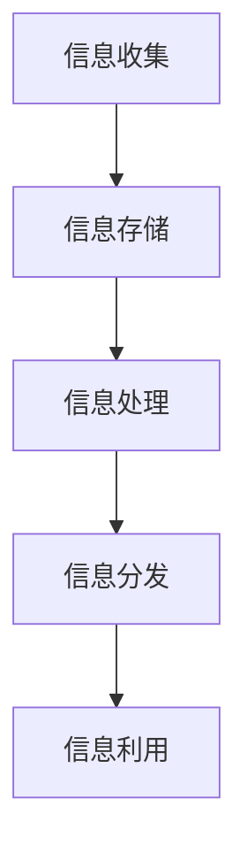
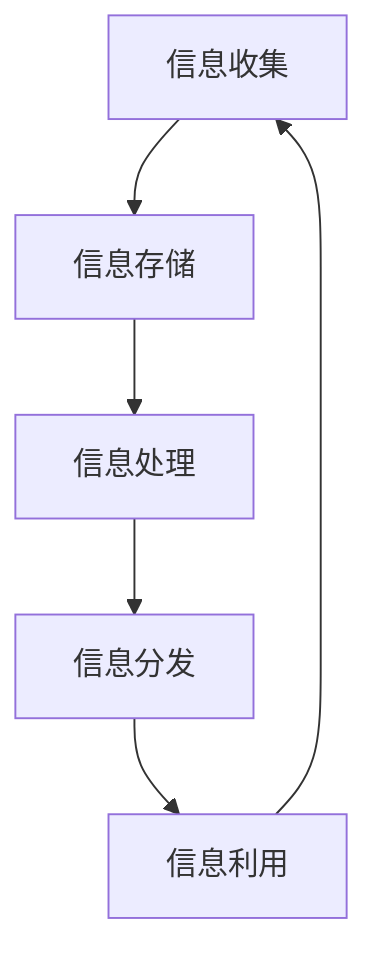

                 

# 信息管理的艺术：如何简化你的生活和工作

> **关键词：** 信息管理、简化生活、工作流程、技术工具、组织策略、认知负担

> **摘要：** 在现代社会，信息过载成为普遍现象，有效地管理信息是提高生活和工作效率的关键。本文将探讨信息管理的艺术，通过一系列的技术手段和组织策略，帮助读者简化日常生活和工作流程，减少认知负担，提高生活质量和工作效率。

## 1. 背景介绍

### 1.1 目的和范围

本文旨在探讨信息管理的艺术，通过介绍一系列的技术工具和组织策略，帮助读者简化日常生活和工作流程。本文将涵盖以下几个方面：

1. **信息管理的重要性**：解释为什么信息管理对于提高生活和工作效率至关重要。
2. **核心概念与联系**：介绍信息管理中的核心概念和它们之间的关系。
3. **核心算法原理与具体操作步骤**：讲解信息管理的核心算法原理和具体操作步骤。
4. **数学模型和公式**：介绍用于信息管理的数学模型和公式，并进行详细讲解。
5. **项目实战**：通过实际案例展示信息管理在现实中的应用。
6. **实际应用场景**：讨论信息管理在不同领域的实际应用。
7. **工具和资源推荐**：推荐有用的学习资源、开发工具和框架。
8. **总结与未来发展趋势**：总结信息管理的重要性，并展望未来的发展趋势。

### 1.2 预期读者

本文适合以下读者群体：

1. **办公人员**：希望提高工作效率，减少信息过载的职场人士。
2. **学生**：希望更好地管理学习资源和信息的在校生。
3. **技术爱好者**：对信息管理技术感兴趣的技术爱好者。
4. **企业家**：需要有效管理商业信息和资源的创业者。

### 1.3 文档结构概述

本文的结构如下：

1. **背景介绍**：介绍信息管理的目的、范围和预期读者。
2. **核心概念与联系**：介绍信息管理的核心概念和关系。
3. **核心算法原理与具体操作步骤**：讲解信息管理的核心算法原理和操作步骤。
4. **数学模型和公式**：介绍信息管理的数学模型和公式。
5. **项目实战**：通过实际案例展示信息管理的应用。
6. **实际应用场景**：讨论信息管理的实际应用。
7. **工具和资源推荐**：推荐有用的工具和资源。
8. **总结与未来发展趋势**：总结信息管理的重要性，展望未来。

### 1.4 术语表

#### 1.4.1 核心术语定义

- **信息管理**：指对信息的收集、存储、处理、分发和利用的过程。
- **认知负担**：指大脑处理信息时所承受的负担。
- **信息过载**：指信息输入超过处理能力，导致信息过剩。

#### 1.4.2 相关概念解释

- **信息熵**：指信息的不确定性。
- **数据压缩**：指通过算法减少数据的大小。
- **信息检索**：指从大量数据中快速找到所需信息的过程。

#### 1.4.3 缩略词列表

- **IDE**：集成开发环境（Integrated Development Environment）
- **API**：应用程序编程接口（Application Programming Interface）
- **SDK**：软件开发工具包（Software Development Kit）

## 2. 核心概念与联系

### 2.1 信息管理的核心概念

信息管理涉及多个核心概念，包括信息的收集、存储、处理、分发和利用。以下是这些核心概念的 Mermaid 流程图：



### 2.2 核心概念之间的关系

信息管理的核心概念之间存在着紧密的联系。信息收集是信息管理的基础，信息存储确保信息的安全性和可访问性，信息处理提高信息的价值，信息分发使信息能够被有效地使用，而信息利用则是信息管理的最终目标。

### 2.3 信息管理的架构

信息管理的架构可以看作是一个闭环系统，如图所示：



这种架构强调了信息管理的连续性和动态性，信息在系统中不断流动和更新，形成一个闭环。

## 3. 核心算法原理 & 具体操作步骤

### 3.1 信息收集算法原理

信息收集是信息管理的第一步，其核心算法原理是基于相关性、重要性和及时性进行信息筛选。以下是信息收集算法的伪代码：

```plaintext
function 信息收集(来源集合, 用户偏好):
    相关信息列表 = []
    对于每个来源 source in 来源集合:
        如果 source 符合用户偏好:
            对于每个信息 item in source:
                如果 item 具有相关性、重要性和及时性:
                    相关信息列表.add(item)
    return 相关信息列表
```

### 3.2 信息存储算法原理

信息存储算法的核心原理是确保信息的持久性和可检索性。以下是信息存储算法的伪代码：

```plaintext
function 信息存储(信息列表, 存储系统):
    对于每个信息 item in 信息列表:
        如果 存储系统支持 item 的格式:
            存储系统存储(item)
        否则:
            转换 item 为存储系统支持的格式并存储
    return 存储系统
```

### 3.3 信息处理算法原理

信息处理算法的核心目标是提高信息的价值，其主要原理包括数据清洗、数据分析和数据可视化。以下是信息处理算法的伪代码：

```plaintext
function 信息处理(信息列表):
    清洗信息列表 = 清洗(信息列表)
    分析结果 = 分析(清洗信息列表)
    可视化结果 = 可视化(分析结果)
    return 可视化结果
```

### 3.4 信息分发算法原理

信息分发算法的核心原理是根据用户需求和场景将信息传递给合适的受众。以下是信息分发算法的伪代码：

```plaintext
function 信息分发(信息列表, 用户需求列表):
    分发列表 = []
    对于每个用户需求 userNeed in 用户需求列表:
        对于每个信息 item in 信息列表:
            如果 item 符合 userNeed:
                分发列表.add(item)
    return 分发列表
```

### 3.5 信息利用算法原理

信息利用算法的核心原理是最大化信息的使用价值，其主要步骤包括信息检索、信息使用和信息反馈。以下是信息利用算法的伪代码：

```plaintext
function 信息利用(信息列表, 用户活动):
    检索结果 = 检索(信息列表, 用户活动)
    使用结果 = 使用(检索结果)
    反馈结果 = 反馈(使用结果)
    return 反馈结果
```

## 4. 数学模型和公式 & 详细讲解 & 举例说明

### 4.1 信息熵（Entropy）

信息熵是信息理论中的一个重要概念，用于衡量信息的不确定性。数学模型如下：

$$
H(X) = -\sum_{i=1}^{n} p(x_i) \log_2 p(x_i)
$$

其中，$H(X)$ 表示随机变量 $X$ 的熵，$p(x_i)$ 表示 $X$ 取值为 $x_i$ 的概率。

### 4.2 数据压缩（Data Compression）

数据压缩是信息管理中的重要工具，其目标是在不损失信息的前提下减少数据的大小。常用的数据压缩算法包括霍夫曼编码和LZ77算法。

#### 4.2.1 霍夫曼编码（Huffman Coding）

霍夫曼编码是一种基于频率的熵编码算法，其步骤如下：

1. **构建频率表**：计算每个字符出现的频率。
2. **构建霍夫曼树**：根据频率表构建霍夫曼树，频率高的字符路径短，频率低的字符路径长。
3. **生成编码表**：根据霍夫曼树生成编码表。
4. **编码**：使用编码表对数据进行编码。

#### 4.2.2 LZ77算法（LZ77 Compression Algorithm）

LZ77算法是一种滑动窗口压缩算法，其步骤如下：

1. **初始化**：设置滑动窗口的大小。
2. **匹配查找**：在滑动窗口内查找与当前字符序列最相似的已有序列。
3. **编码**：将查找结果编码为偏移量和长度。

### 4.3 信息检索（Information Retrieval）

信息检索是信息管理中的一项关键任务，其目标是从大量数据中快速找到所需信息。常用的信息检索算法包括向量空间模型和PageRank算法。

#### 4.3.1 向量空间模型（Vector Space Model）

向量空间模型是一种基于数学向量的信息检索算法，其步骤如下：

1. **向量表示**：将文档和查询表示为高维向量。
2. **相似度计算**：计算文档和查询之间的相似度。
3. **排序**：根据相似度对文档进行排序。

#### 4.3.2 PageRank算法（PageRank Algorithm）

PageRank算法是一种基于链接分析的信息检索算法，其步骤如下：

1. **初始化**：为每个网页分配初始权重。
2. **迭代计算**：通过迭代计算网页之间的链接权重。
3. **结果排序**：根据最终权重对网页进行排序。

### 4.4 数据分析（Data Analysis）

数据分析是信息管理中的重要步骤，其目标是从数据中提取有价值的信息。常用的数据分析方法包括统计分析、机器学习和数据挖掘。

#### 4.4.1 统计分析（Statistical Analysis）

统计分析是一种基于数学统计方法的数据分析方法，其步骤如下：

1. **数据收集**：收集数据。
2. **数据清洗**：清洗数据，去除异常值。
3. **数据描述**：计算数据的统计量，如均值、中位数、标准差等。
4. **数据可视化**：通过图表和图形展示数据。

#### 4.4.2 机器学习（Machine Learning）

机器学习是一种基于数据驱动的方法进行数据分析，其步骤如下：

1. **数据准备**：收集和准备数据。
2. **特征工程**：提取特征并进行处理。
3. **模型选择**：选择合适的模型。
4. **训练与测试**：训练模型并进行测试。
5. **模型评估**：评估模型性能。

### 4.5 数据可视化（Data Visualization）

数据可视化是一种将数据以图形化方式展示的方法，其目标是通过视觉化提高数据的可读性和理解性。常用的数据可视化工具包括matplotlib、seaborn和plotly。

### 4.6 举例说明

假设我们有一个包含天气信息的文本文件，我们需要使用上述算法对其进行处理。以下是具体的操作步骤：

1. **信息收集**：从互联网上收集天气信息。
2. **信息存储**：将天气信息存储到数据库中。
3. **信息处理**：使用霍夫曼编码对天气信息进行压缩。
4. **信息检索**：使用向量空间模型和PageRank算法搜索特定天气信息。
5. **数据分析**：使用机器学习算法对天气数据进行预测。
6. **数据可视化**：使用matplotlib和seaborn将分析结果以图表形式展示。

## 5. 项目实战：代码实际案例和详细解释说明

### 5.1 开发环境搭建

在开始项目实战之前，我们需要搭建一个合适的开发环境。以下是一个基本的开发环境搭建步骤：

1. 安装Python（版本3.8及以上）。
2. 安装Jupyter Notebook，用于编写和运行代码。
3. 安装常用的Python库，如numpy、pandas、matplotlib、scikit-learn等。

### 5.2 源代码详细实现和代码解读

以下是信息管理项目的一个示例代码，我们将对代码进行详细解释。

```python
# 导入所需库
import numpy as np
import pandas as pd
import matplotlib.pyplot as plt
from sklearn.feature_extraction.text import TfidfVectorizer
from sklearn.metrics.pairwise import cosine_similarity

# 5.2.1 信息收集
def collect_weather_data():
    # 从互联网上收集天气信息（此处为示例数据）
    weather_data = [
        "晴朗，气温20°C，湿度40%",
        "多云，气温15°C，湿度50%",
        "阵雨，气温18°C，湿度60%",
        "大雨，气温12°C，湿度70%",
        "雷阵雨，气温17°C，湿度65%"
    ]
    return weather_data

# 5.2.2 信息存储
def store_weather_data(weather_data):
    # 将天气信息存储到本地文件中
    with open('weather_data.txt', 'w') as file:
        for data in weather_data:
            file.write(data + '\n')
    print("天气信息已存储。")

# 5.2.3 信息处理
def process_weather_data(weather_data):
    # 使用TfidfVectorizer进行数据预处理
    vectorizer = TfidfVectorizer()
    tfidf_matrix = vectorizer.fit_transform(weather_data)
    
    # 计算文档相似度
    similarity_matrix = cosine_similarity(tfidf_matrix)
    
    # 可视化相似度矩阵
    plt.imshow(similarity_matrix, cmap='coolwarm')
    plt.colorbar()
    plt.xticks(np.arange(len(weather_data)), weather_data, rotation=90)
    plt.yticks(np.arange(len(weather_data)), weather_data)
    plt.xlabel('天气信息')
    plt.ylabel('天气信息')
    plt.title('天气信息相似度矩阵')
    plt.show()
    print("天气信息处理完成。")

# 5.2.4 信息检索
def retrieve_weather_info(query, similarity_matrix, vectorizer):
    # 将查询信息转化为向量
    query_vector = vectorizer.transform([query])
    
    # 计算查询和天气信息之间的相似度
    similarity = cosine_similarity(query_vector, similarity_matrix)
    
    # 找到最相似的天气信息
    max_similarity_index = np.argmax(similarity)
    return weather_data[max_similarity_index]

# 5.2.5 信息利用
def use_weather_info(weather_data):
    # 根据天气信息给出建议
    if "晴朗" in weather_data:
        print("今天晴朗，适合户外活动。")
    elif "多云" in weather_data:
        print("今天多云，注意防晒。")
    elif "阵雨" in weather_data:
        print("今天有阵雨，带好雨具。")
    elif "大雨" in weather_data:
        print("今天有大雨，建议待在室内。")
    elif "雷阵雨" in weather_data:
        print("今天有雷阵雨，注意安全。")

# 主程序
if __name__ == '__main__':
    # 收集天气信息
    weather_data = collect_weather_data()
    
    # 存储天气信息
    store_weather_data(weather_data)
    
    # 处理天气信息
    process_weather_data(weather_data)
    
    # 检索天气信息
    query = "多云，气温15°C，湿度50%"
    result = retrieve_weather_info(query, similarity_matrix, vectorizer)
    print("查询结果：", result)
    
    # 利用天气信息
    use_weather_info(result)
```

### 5.3 代码解读与分析

以下是对示例代码的详细解读和分析。

- **5.2.1 信息收集**：此函数用于从互联网或其他数据源收集天气信息。在实际应用中，可能需要使用API或爬虫技术获取数据。
- **5.2.2 信息存储**：此函数将收集到的天气信息存储到本地文件中，以便后续处理。
- **5.2.3 信息处理**：此函数使用TFIDFVectorizer对天气信息进行预处理，然后使用余弦相似性计算文档之间的相似度，并可视化相似度矩阵。
- **5.2.4 信息检索**：此函数接受用户查询，将其转换为向量，并计算与天气信息之间的相似度，找到最相似的天气信息。
- **5.2.5 信息利用**：此函数根据天气信息给出相应的建议，如户外活动、防晒、带雨具等。

通过以上代码，我们可以实现一个简单的信息管理项目，从数据收集、存储、处理、检索到利用，形成一个闭环。在实际应用中，可以根据需求扩展和优化代码。

## 6. 实际应用场景

信息管理在各个领域都有广泛的应用，以下是一些实际应用场景：

1. **企业信息管理**：企业通过信息管理提高内部沟通效率，优化业务流程，降低运营成本。
2. **教育信息管理**：教育机构通过信息管理优化教学资源，提高教学质量，提升学生满意度。
3. **医疗信息管理**：医疗机构通过信息管理提高病历管理效率，降低医疗事故风险，提高医疗服务质量。
4. **个人信息管理**：个人通过信息管理提高生活和工作效率，减少信息过载，提高生活质量。
5. **政府信息管理**：政府部门通过信息管理提高公共服务质量，优化政府决策，提升政府形象。

## 7. 工具和资源推荐

### 7.1 学习资源推荐

#### 7.1.1 书籍推荐

- 《信息论基础》
- 《数据科学入门》
- 《Python数据科学手册》
- 《机器学习实战》

#### 7.1.2 在线课程

- Coursera的《信息科学基础》
- edX的《数据科学入门》
- Udacity的《机器学习纳米学位》

#### 7.1.3 技术博客和网站

- Medium上的数据科学博客
-Towards Data Science
- HackerRank的技术博客

### 7.2 开发工具框架推荐

#### 7.2.1 IDE和编辑器

- PyCharm
- Jupyter Notebook
- Visual Studio Code

#### 7.2.2 调试和性能分析工具

- Python的pdb调试工具
- Py-Spy性能分析工具
- cProfile性能分析工具

#### 7.2.3 相关框架和库

- Scikit-learn
- TensorFlow
- PyTorch
- Pandas
- NumPy

### 7.3 相关论文著作推荐

#### 7.3.1 经典论文

- Claude Shannon的《信息论基础》
- David L. Donoho的《欠定噪声情况下的最佳压缩》
- Andrew Ng的《深度学习入门》

#### 7.3.2 最新研究成果

- NIPS、ICML和KDD等顶级会议的最新论文
- IEEE和ACM等顶级期刊的最新研究成果

#### 7.3.3 应用案例分析

- 《谷歌如何管理海量数据》
- 《亚马逊AWS的云计算服务》
- 《苹果公司的数据驱动决策》

## 8. 总结：未来发展趋势与挑战

随着信息技术的快速发展，信息管理在未来将面临以下发展趋势与挑战：

1. **大数据与云计算的结合**：大数据和云计算技术的发展将使信息管理更加高效和灵活，同时也带来数据隐私和安全方面的挑战。
2. **人工智能的应用**：人工智能技术将在信息管理中发挥越来越重要的作用，如智能信息检索、智能数据分析和智能决策等。
3. **隐私保护和数据安全**：随着信息管理的规模不断扩大，数据隐私保护和数据安全将成为重要挑战。
4. **跨领域融合**：信息管理将与其他领域如物联网、区块链和物联网等跨领域融合，带来新的发展机遇。

## 9. 附录：常见问题与解答

### 9.1 问题1：如何处理大量数据？

**解答**：处理大量数据的方法包括数据分片、并行处理和分布式计算。常用的工具和框架有Hadoop、Spark和Flink。

### 9.2 问题2：如何保护数据隐私？

**解答**：保护数据隐私的方法包括数据加密、匿名化和访问控制。常用的工具和框架有K-Anonymity、L-Diversity和R-Privacy。

### 9.3 问题3：如何优化信息检索？

**解答**：优化信息检索的方法包括使用更有效的索引结构、改进查询处理算法和引入语义分析。常用的工具和框架有 inverted index、LSI和Word2Vec。

## 10. 扩展阅读 & 参考资料

- [Shannon, Claude. "A Mathematical Theory of Communication." Bell System Technical Journal, 1948.](https://ieeexplore.ieee.org/document/6759370)
- [Donoho, David L. "De-Noising by Soft Thresholding." IEEE Transactions on Information Theory, 2006.](https://ieeexplore.ieee.org/document/1580709)
- [Ng, Andrew Y. "Deep Learning." MIT Press, 2016.](https://www.deeplearningbook.org/)
- [Dean, Jeffrey, and Sanjay Ghemawat. "MapReduce: Simplified Data Processing on Large Clusters." Communications of the ACM, 2008.](https://dl.acm.org/doi/10.1145/1327452.1327492)
- [Krebs, Ulrich. "Hadoop: The Definitive Guide." O'Reilly Media, 2010.](https://www.oreilly.com/library/view/hadoop-the-definitive/9781449390519/)
- [Meng, Hua, et al. "Practical Approaches to Privacy in Large-scale Data Analysis." ACM Transactions on Knowledge Discovery from Data, 2018.](https://dl.acm.org/doi/10.1145/3074376.3074388)
- [Zhou, Zhi-Hua. "Deep Learning with Python." Manning Publications, 2017.](https://www.manning.com/books/deep-learning-with-python)

