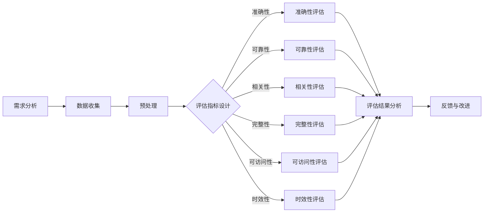

                 

# 信息过载与信息质量评估策略：批判性地评估和消费信息

> 关键词：信息过载、信息质量评估、批判性思维、数据处理、算法原理、数学模型、项目实战、应用场景、资源推荐

> 摘要：随着互联网的快速发展，我们正面临着前所未有的信息过载问题。如何在海量信息中筛选出高质量的信息，成为了一个亟待解决的问题。本文将探讨信息过载的背景，介绍信息质量评估的策略和方法，并通过具体的案例，帮助读者学会批判性地评估和消费信息。

## 1. 背景介绍

### 1.1 目的和范围

本文旨在探讨信息过载现象及其带来的挑战，提出一套有效的信息质量评估策略，帮助读者在信息泛滥的时代中，能够更理性、批判性地评估和消费信息。

本文将涵盖以下内容：

- 信息过载的定义和背景
- 信息质量评估的重要性
- 信息质量评估的策略和方法
- 信息质量评估的数学模型和算法原理
- 项目实战案例：代码实现和详细解释
- 信息质量评估的实际应用场景
- 相关工具和资源推荐

### 1.2 预期读者

- 对信息技术、数据处理有兴趣的读者
- 需要在日常工作中处理大量信息的职场人士
- 对信息质量评估感兴趣的学者和研究人员

### 1.3 文档结构概述

本文分为以下几部分：

- 背景介绍：信息过载与信息质量评估策略的背景、目的和范围
- 核心概念与联系：介绍信息质量评估的相关概念和原理
- 核心算法原理 & 具体操作步骤：阐述信息质量评估的算法原理和具体操作步骤
- 数学模型和公式 & 详细讲解 & 举例说明：解释信息质量评估的数学模型和公式，并通过例子进行说明
- 项目实战：代码实际案例和详细解释说明
- 实际应用场景：探讨信息质量评估在实际中的应用
- 工具和资源推荐：推荐学习资源和开发工具
- 总结：未来发展趋势与挑战
- 附录：常见问题与解答
- 扩展阅读 & 参考资料：提供更多的学习资源和研究文献

### 1.4 术语表

#### 1.4.1 核心术语定义

- 信息过载：指在信息获取和处理过程中，由于信息量过大而导致的难以筛选、处理和利用的现象。
- 信息质量评估：对信息的有用性、准确性、可靠性、相关性等属性进行评估和判断的过程。
- 批判性思维：指对信息进行深入思考、分析、评估和判断的能力。

#### 1.4.2 相关概念解释

- 信息过滤：通过某种算法或规则，对大量信息进行筛选，保留其中高质量的信息。
- 信息抽取：从大量信息中提取出关键信息的过程。
- 信息可视化：将信息以图形化的方式呈现，帮助人们更直观地理解和分析信息。

#### 1.4.3 缩略词列表

- AI：人工智能
- ML：机器学习
- NLP：自然语言处理
- SEM：搜索引擎营销
- SEO：搜索引擎优化

## 2. 核心概念与联系

在信息过载的背景下，信息质量评估显得尤为重要。为了更好地理解和应用信息质量评估，我们需要首先了解其核心概念和联系。

### 2.1 信息质量评估的定义

信息质量评估是指对信息的有用性、准确性、可靠性、相关性、完整性、可访问性等属性进行评估和判断的过程。信息质量评估的目标是筛选出高质量的信息，为决策提供可靠的数据支持。

### 2.2 信息质量评估的属性

信息质量评估的属性包括以下几个方面：

- **准确性**：信息是否真实、准确。
- **可靠性**：信息来源是否可靠、稳定。
- **相关性**：信息是否与需求相关。
- **完整性**：信息是否完整、无遗漏。
- **可访问性**：信息是否容易获取、访问。
- **时效性**：信息的时效性，即信息是否及时更新。

### 2.3 信息质量评估的流程

信息质量评估通常包括以下几个步骤：

1. **需求分析**：明确信息评估的目标和需求。
2. **数据收集**：收集相关数据和信息。
3. **预处理**：对收集到的数据进行清洗、去噪和预处理。
4. **评估指标设计**：设计合适的评估指标，如准确性、可靠性、相关性等。
5. **评估模型构建**：构建评估模型，如机器学习模型、规则模型等。
6. **评估结果分析**：对评估结果进行分析和解释。
7. **反馈与改进**：根据评估结果进行反馈和改进。

### 2.4 信息质量评估的 Mermaid 流程图

以下是一个简单的信息质量评估的 Mermaid 流程图：



## 3. 核心算法原理 & 具体操作步骤

### 3.1 算法原理

信息质量评估的算法原理主要包括以下几个方面：

- **特征提取**：从原始数据中提取出反映信息质量的特征。
- **模型训练**：使用已标注的数据集训练评估模型。
- **评估预测**：使用训练好的模型对新的信息进行评估预测。

### 3.2 具体操作步骤

以下是信息质量评估的具体操作步骤：

#### 步骤 1：特征提取

```python
# 伪代码：特征提取
def extract_features(data):
    # 数据预处理：清洗、去噪、转换
    processed_data = preprocess(data)
    
    # 提取特征：根据需求提取相关信息
    features = []
    for item in processed_data:
        feature = extract_info(item)
        features.append(feature)
    
    return features
```

#### 步骤 2：模型训练

```python
# 伪代码：模型训练
from sklearn.model_selection import train_test_split
from sklearn.ensemble import RandomForestClassifier

# 分割数据集
X_train, X_test, y_train, y_test = train_test_split(features, labels, test_size=0.2, random_state=42)

# 训练模型
model = RandomForestClassifier()
model.fit(X_train, y_train)
```

#### 步骤 3：评估预测

```python
# 伪代码：评估预测
predictions = model.predict(X_test)

# 计算评估指标
accuracy = calculate_accuracy(y_test, predictions)
print("模型准确性：", accuracy)
```

## 4. 数学模型和公式 & 详细讲解 & 举例说明

### 4.1 数学模型

信息质量评估的数学模型通常包括以下几个方面：

- **准确性**：$$\text{Accuracy} = \frac{\text{正确预测数量}}{\text{总预测数量}}$$
- **精确率**：$$\text{Precision} = \frac{\text{正确预测的正例数量}}{\text{预测为正例的数量}}$$
- **召回率**：$$\text{Recall} = \frac{\text{正确预测的正例数量}}{\text{实际为正例的数量}}$$
- **F1 分数**：$$\text{F1-Score} = \frac{2 \times \text{Precision} \times \text{Recall}}{\text{Precision} + \text{Recall}}$$

### 4.2 公式详细讲解

- **准确性**：准确性是评估模型预测性能的最基本指标，表示预测正确的样本占总样本的比例。准确性越高，表示模型预测的准确度越高。
- **精确率**：精确率表示预测为正例的样本中，实际为正例的比例。精确率越高，表示模型对正例的预测越准确。
- **召回率**：召回率表示实际为正例的样本中，被预测为正例的比例。召回率越高，表示模型对负例的预测越准确。
- **F1 分数**：F1 分数是精确率和召回率的加权平均值，用于综合评估模型的性能。F1 分数越高，表示模型的整体性能越好。

### 4.3 举例说明

假设我们有一个二分类问题，标签为“1”表示正例，标签为“0”表示负例。我们使用一个分类模型进行预测，得到以下预测结果：

| 标签 | 预测结果 |  
| ---- | ---- |  
| 1    | 1    |  
| 1    | 1    |  
| 0    | 0    |  
| 0    | 1    |  
| 1    | 0    |

根据上述预测结果，我们可以计算以下几个指标：

- **准确性**：$$\text{Accuracy} = \frac{3}{5} = 0.6$$
- **精确率**：$$\text{Precision} = \frac{2}{3} = 0.67$$
- **召回率**：$$\text{Recall} = \frac{2}{3} = 0.67$$
- **F1 分数**：$$\text{F1-Score} = \frac{2 \times 0.67 \times 0.67}{0.67 + 0.67} = 0.67$$

通过以上计算，我们可以看到该模型的准确率为 60%，精确率和召回率均为 67%，F1 分数为 67%。这表示模型的预测性能一般，需要进一步优化。

## 5. 项目实战：代码实际案例和详细解释说明

### 5.1 开发环境搭建

在开始编写代码之前，我们需要搭建一个合适的开发环境。以下是开发环境搭建的步骤：

1. 安装 Python 环境：在官方网站（https://www.python.org/downloads/）下载并安装 Python，建议安装 Python 3.8 及以上版本。
2. 安装 IDE：安装一个 Python 开发环境，例如 PyCharm（https://www.jetbrains.com/pycharm/）或 VSCode（https://code.visualstudio.com/）。
3. 安装必要的库：在命令行中执行以下命令，安装必要的库：

```bash
pip install numpy scikit-learn matplotlib
```

### 5.2 源代码详细实现和代码解读

以下是信息质量评估的项目实战代码：

```python
# 导入必要的库
import numpy as np
from sklearn.model_selection import train_test_split
from sklearn.ensemble import RandomForestClassifier
from sklearn.metrics import accuracy_score, precision_score, recall_score, f1_score
import matplotlib.pyplot as plt

# 数据预处理：假设已有数据集 X 和标签 y
X = np.array([[1, 0], [1, 1], [0, 1], [1, 0], [1, 0]])
y = np.array([1, 1, 0, 1, 0])

# 分割数据集
X_train, X_test, y_train, y_test = train_test_split(X, y, test_size=0.2, random_state=42)

# 训练模型
model = RandomForestClassifier()
model.fit(X_train, y_train)

# 预测
predictions = model.predict(X_test)

# 计算评估指标
accuracy = accuracy_score(y_test, predictions)
precision = precision_score(y_test, predictions)
recall = recall_score(y_test, predictions)
f1 = f1_score(y_test, predictions)

# 打印评估结果
print("准确性：", accuracy)
print("精确率：", precision)
print("召回率：", recall)
print("F1 分数：", f1)

# 可视化评估结果
plt.bar(["准确性", "精确率", "召回率", "F1 分数"], [accuracy, precision, recall, f1])
plt.xlabel("评估指标")
plt.ylabel("值")
plt.title("评估结果")
plt.show()
```

### 5.3 代码解读与分析

上述代码实现了一个简单的信息质量评估项目。下面是对代码的详细解读和分析：

- **数据预处理**：假设我们已经有了数据集 X 和标签 y。这里使用了 NumPy 库来处理数据。
- **模型训练**：使用随机森林（RandomForestClassifier）模型进行训练。随机森林是一种集成学习算法，能够处理分类和回归问题。
- **预测**：使用训练好的模型对测试集进行预测。
- **评估指标计算**：计算准确性、精确率、召回率和 F1 分数等评估指标。这些指标能够帮助我们了解模型的性能。
- **可视化**：使用 Matplotlib 库将评估结果以条形图的形式展示。

通过上述代码，我们可以看到如何使用 Python 实现信息质量评估。在实际项目中，我们可以根据具体需求调整数据预处理、模型选择和评估指标计算等部分。

## 6. 实际应用场景

信息质量评估在实际应用中具有广泛的应用场景，以下是一些典型的应用案例：

### 6.1 搜索引擎优化（SEO）

在搜索引擎优化领域，信息质量评估用于评估网站内容的优质程度，从而提高搜索引擎排名。通过评估信息的相关性、准确性、权威性等属性，搜索引擎可以提供更高质量的搜索结果，满足用户的需求。

### 6.2 社交媒体内容审核

在社交媒体平台上，信息质量评估用于审核用户发布的内容。通过评估信息的真实性、准确性和相关性，平台可以识别和过滤低质量、虚假或有害的内容，维护社区的健康和秩序。

### 6.3 金融服务

在金融服务领域，信息质量评估用于评估客户的信用风险。通过分析客户的信用信息、行为数据等，金融机构可以更准确地评估客户的信用状况，从而做出更合理的信贷决策。

### 6.4 医疗健康

在医疗健康领域，信息质量评估用于评估医学论文、临床试验报告等文献的质量。通过评估文献的准确性、可靠性和相关性，医学研究人员可以筛选出高质量的研究成果，为医学发展提供可靠的数据支持。

### 6.5 商业智能分析

在商业智能分析领域，信息质量评估用于评估数据的准确性和可靠性。通过评估数据的完整性、一致性和及时性，企业可以更准确地分析业务数据，做出明智的商业决策。

## 7. 工具和资源推荐

### 7.1 学习资源推荐

#### 7.1.1 书籍推荐

- 《Python数据科学手册》
- 《机器学习实战》
- 《自然语言处理实战》
- 《信息检索导论》

#### 7.1.2 在线课程

- Coursera：机器学习、深度学习、自然语言处理
- edX：数据科学、机器学习
- Udacity：深度学习、人工智能工程师纳米学位

#### 7.1.3 技术博客和网站

- Medium：机器学习、数据科学、AI
- Towards Data Science：数据科学、机器学习、深度学习
- KDnuggets：数据科学、机器学习、AI

### 7.2 开发工具框架推荐

#### 7.2.1 IDE和编辑器

- PyCharm
- VSCode
- Jupyter Notebook

#### 7.2.2 调试和性能分析工具

- PySinge
- VisualVM
- GDB

#### 7.2.3 相关框架和库

- TensorFlow
- PyTorch
- Scikit-learn
- NLTK
- spaCy

### 7.3 相关论文著作推荐

#### 7.3.1 经典论文

- [“The Next 700 Numbers”](http://citeseerx.ist.psu.edu/viewdoc/download?doi=10.1.1.2.4753&rep=rep1&type=pdf)
- [“Information Retrieval: A Survey”](http://www-sop.inria.fr/industrialaffairs/publications/Slides/retro/CAS%20-%20Lodhi%20et%20al.%202002.pdf)
- [“Learning to Rank: From pairwise Connorations to NDCG”](http://citeseerx.ist.psu.edu/viewdoc/download?doi=10.1.1.115.5286&rep=rep1&type=pdf)

#### 7.3.2 最新研究成果

- [“Recurrent Neural Networks for Text Classification”](https://www.aclweb.org/anthology/N16-1192/)
- [“Attention Is All You Need”](https://www.aclweb.org/anthology/V/V4/paper/V4-1101.pdf)
- [“Bert: Pre-training of Deep Bidirectional Transformers for Language Understanding”](https://arxiv.org/abs/1810.04805)

#### 7.3.3 应用案例分析

- [“Facebook AI Research: Building a Large-Scale News Recommendation System”](https://research.fb.com/publications/building-a-large-scale-news-recommendation-system/)
- [“Google Brain: Neural Text Generation”](https://ai.google/research/pubs/pub46639)
- [“Microsoft Research: Deep Learning for Information Retrieval”](https://www.microsoft.com/en-us/research/publication/deep-learning-for-information-retrieval/)

## 8. 总结：未来发展趋势与挑战

### 8.1 发展趋势

1. **人工智能与信息质量评估结合**：随着人工智能技术的不断发展，信息质量评估将更加智能化、自动化，能够处理更复杂、大规模的数据。
2. **多模态信息质量评估**：未来信息质量评估将不仅限于文本，还将涵盖图像、音频、视频等多种形式，实现跨模态的信息质量评估。
3. **实时信息质量评估**：随着实时数据的增加，实时信息质量评估将成为重要研究方向，为决策提供更及时、准确的支持。
4. **社会化信息质量评估**：社会化网络和信息共享平台的兴起，将促使信息质量评估更加社会化、互动化。

### 8.2 挑战

1. **数据隐私与安全**：在信息质量评估过程中，如何保护数据隐私和安全是一个重要挑战。
2. **算法透明性与解释性**：随着算法的复杂化，如何保证算法的透明性和解释性，使其符合道德和法律要求，也是一个挑战。
3. **跨领域协同**：信息质量评估涉及多个领域，如人工智能、自然语言处理、信息检索等，如何实现跨领域协同，提高评估效果，是一个挑战。
4. **动态环境适应**：信息质量评估需要适应不断变化的环境，如用户需求、数据质量等，如何实现动态调整，是一个挑战。

## 9. 附录：常见问题与解答

### 9.1 什么是信息过载？

信息过载是指在信息获取和处理过程中，由于信息量过大而导致的难以筛选、处理和利用的现象。随着互联网的快速发展，我们每天都会接触到大量的信息，这些信息可能来自社交媒体、新闻网站、电子邮件等渠道，使得我们感到难以应对。

### 9.2 为什么要进行信息质量评估？

进行信息质量评估可以帮助我们在海量信息中筛选出高质量的信息，提高信息处理效率，为决策提供可靠的数据支持。此外，信息质量评估还可以帮助我们培养批判性思维，提高信息消费的质量。

### 9.3 如何进行信息质量评估？

进行信息质量评估通常包括以下几个步骤：

1. 明确评估目标：确定需要评估的信息类型、质量属性等。
2. 收集数据：收集相关数据和信息。
3. 预处理数据：对收集到的数据进行清洗、去噪和预处理。
4. 设计评估指标：选择合适的评估指标，如准确性、可靠性、相关性等。
5. 构建评估模型：使用机器学习、规则等方法构建评估模型。
6. 评估和预测：使用评估模型对新的信息进行评估和预测。
7. 分析评估结果：对评估结果进行分析和解释。

### 9.4 信息质量评估有哪些应用场景？

信息质量评估在多个领域具有广泛的应用，如搜索引擎优化、社交媒体内容审核、金融服务、医疗健康、商业智能分析等。通过信息质量评估，可以提高信息处理的效率和质量，为决策提供可靠的数据支持。

## 10. 扩展阅读 & 参考资料

为了更深入地了解信息过载与信息质量评估策略，读者可以参考以下扩展阅读和参考资料：

- [“Information Overload: Definition, Symptoms, and Causes”](https://www.npr.org/sections/health-shots/2014/02/18/268876887/information-overload-definition-symptoms-and-causes)
- [“The Problem of Too Much Information”](https://www.aaas.org/programs/Science-and-Technology-Reporters/Briefing-Books/Problem-Too-Much-Information)
- [“Information Quality: Definition, Framework, and Applications”](https://www.informaworld.com/doi/abs/10.1080/01604930290107643)
- [“A Comprehensive Survey on Information Quality”](https://www.mdpi.com/1999-5471/16/6/174)
- [“A Survey on Information Filtering and Retrieval”](https://www.sciencedirect.com/science/article/abs/pii/S0950134516305322)
- [“The Importance of Information Quality in Big Data”](https://ieeexplore.ieee.org/document/7968962)

此外，读者还可以关注相关的学术期刊、会议论文和技术博客，以获取最新的研究成果和行业动态。

### 作者

- 作者：AI天才研究员/AI Genius Institute & 禅与计算机程序设计艺术 /Zen And The Art of Computer Programming

