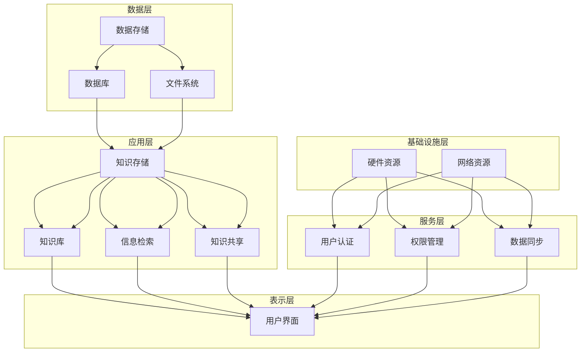

                 

# 信息过载与知识管理系统实施指南：有效组织和检索信息

> **关键词：**信息过载，知识管理，知识管理系统，信息检索，组织策略，人工智能，技术指南，IT领域

> **摘要：**随着信息的爆炸式增长，如何有效地组织和检索信息已成为现代企业和个人面临的重大挑战。本文将深入探讨信息过载的根源，介绍知识管理系统的概念、架构和核心算法，并提供详细的实施指南和实际案例，帮助读者掌握应对信息过载的策略和工具，提升工作效率和知识利用效率。

## 1. 背景介绍

### 1.1 目的和范围

在现代信息技术快速发展的背景下，信息过载成为一个普遍存在的问题。企业和个人在获取和处理信息时，常常感到力不从心，效率低下。本文旨在解决这一难题，通过介绍知识管理系统的概念、原理和实施方法，帮助读者构建一个高效的信息管理和检索体系。

本文的范围涵盖以下几个方面：
1. 信息过载现象的根源分析。
2. 知识管理系统的核心概念和架构。
3. 知识管理系统的核心算法原理与具体操作步骤。
4. 数学模型和公式的详细讲解及举例说明。
5. 实际应用场景中的知识管理系统实施案例。
6. 相关工具和资源的推荐。

### 1.2 预期读者

本文主要面向以下读者群体：
1. 企业IT管理人员，希望提升企业信息管理效率和知识利用效率。
2. 程序员和软件开发人员，希望了解如何利用知识管理系统优化开发流程。
3. 企业培训和教育人员，希望为员工提供有效的信息管理和知识分享方案。
4. 知识工作者和研究人员，希望提高个人知识管理和信息检索能力。
5. 对知识管理系统感兴趣的技术爱好者。

### 1.3 文档结构概述

本文将分为以下几个主要部分：
1. 引言：介绍信息过载现象和知识管理系统的概念。
2. 核心概念与联系：阐述知识管理系统的核心概念和架构。
3. 核心算法原理与操作步骤：详细讲解知识管理系统的核心算法原理和具体操作步骤。
4. 数学模型和公式：介绍知识管理系统的数学模型和公式，并进行举例说明。
5. 项目实战：通过实际案例展示知识管理系统的应用。
6. 实际应用场景：分析知识管理系统在不同领域的应用。
7. 工具和资源推荐：推荐学习资源和开发工具。
8. 总结：总结未来发展趋势与挑战。
9. 附录：常见问题与解答。
10. 扩展阅读：提供进一步学习的资源。

### 1.4 术语表

为了确保本文内容的清晰和一致性，以下列出了一些核心术语及其定义：
#### 1.4.1 核心术语定义

- **信息过载（Information Overload）：** 指个体在处理信息时感到负担过重，无法有效管理和利用信息的现象。
- **知识管理系统（Knowledge Management System）：** 用于组织、存储、共享和利用知识的软件系统。
- **知识（Knowledge）：** 通过经验、教育、思考和交流等过程获得的信息，以及对信息的理解和应用能力。
- **知识检索（Knowledge Retrieval）：** 从知识管理系统中快速准确地找到所需信息的过程。
- **信息检索（Information Retrieval）：** 从大量信息中找到特定信息的过程。

#### 1.4.2 相关概念解释

- **数据（Data）：** 指原始的信息，通常是数字、文字、图片等形式。
- **信息（Information）：** 数据经过处理后具有意义和用途的内容。
- **知识库（Knowledge Base）：** 存储和组织知识的数据库。
- **知识共享（Knowledge Sharing）：** 通过各种手段和工具，实现知识在个体之间的传递和利用。

#### 1.4.3 缩略词列表

- **CRM（Customer Relationship Management）：** 客户关系管理
- **ERP（Enterprise Resource Planning）：** 企业资源规划
- **AI（Artificial Intelligence）：** 人工智能
- **NLP（Natural Language Processing）：** 自然语言处理
- **ML（Machine Learning）：** 机器学习

## 2. 核心概念与联系

### 2.1 知识管理系统的核心概念

知识管理系统（KMS）是一个集成化的软件平台，旨在帮助企业或个人高效地管理、存储、共享和利用知识。以下是知识管理系统的一些核心概念：

- **知识分类（Knowledge Classification）：** 对知识进行分类，以便于检索和管理。
- **知识存储（Knowledge Storage）：** 将知识以结构化或非结构化的形式存储在数据库或文件系统中。
- **知识共享（Knowledge Sharing）：** 通过协作工具、论坛、文档共享等机制，实现知识的传播和共享。
- **知识检索（Knowledge Retrieval）：** 提供高效的搜索功能，帮助用户快速找到所需知识。
- **知识审核（Knowledge Auditing）：** 监控知识的质量和完整性，确保知识的准确性和可靠性。
- **知识库（Knowledge Base）：** 存储和组织知识的数据库，通常包括文档、图表、视频等多种形式。

### 2.2 知识管理系统的架构

知识管理系统的架构通常包括以下几个层次：

1. **数据层（Data Layer）：** 存储和管理数据，可以是关系型数据库、NoSQL数据库或文件系统。
2. **应用层（Application Layer）：** 提供知识管理的功能，包括知识存储、检索、共享等。
3. **表示层（Presentation Layer）：** 用户界面，用于用户与知识管理系统交互。
4. **服务层（Service Layer）：** 提供核心功能，如用户认证、权限管理、数据同步等。
5. **基础设施层（Infrastructure Layer）：** 提供系统运行所需的硬件、网络和存储资源。

### 2.3 知识管理系统的核心算法原理

知识管理系统中的核心算法主要包括信息检索算法、分类算法、聚类算法等。以下是这些算法的简要原理：

- **信息检索算法（Information Retrieval Algorithm）：** 如向量空间模型（VSM）、倒排索引（Inverted Index）、PageRank等，用于从大量信息中快速检索所需内容。
- **分类算法（Classification Algorithm）：** 如决策树（Decision Tree）、支持向量机（SVM）、神经网络（Neural Network）等，用于将知识分类到不同的类别中。
- **聚类算法（Clustering Algorithm）：** 如K-Means、层次聚类（Hierarchical Clustering）、DBSCAN等，用于将相似的知识聚集成一组。

### 2.4 知识管理系统的 Mermaid 流程图

为了更直观地展示知识管理系统的架构和核心算法，我们可以使用 Mermaid 流程图来描述。以下是知识管理系统的一个简化的 Mermaid 流程图：



该 Mermaid 流程图展示了知识管理系统的主要组成部分及其相互关系，为读者提供了一个全局视角。

## 3. 核心算法原理与具体操作步骤

### 3.1 信息检索算法原理

信息检索算法是知识管理系统中的核心组成部分，用于从大量信息中快速准确地找到所需内容。以下将介绍两种常用的信息检索算法：向量空间模型（VSM）和倒排索引（Inverted Index）。

#### 3.1.1 向量空间模型（VSM）

向量空间模型将文本信息表示为向量，并通过计算向量的相似度来实现信息检索。具体步骤如下：

1. **文本预处理：** 对文本进行分词、停用词过滤、词性标注等处理，得到干净的词语列表。
2. **特征提取：** 将词语列表转换为特征向量，通常使用词频（TF）、逆文档频率（IDF）等统计方法。
3. **相似度计算：** 对查询文本和文档的特征向量进行相似度计算，如使用余弦相似度、欧氏距离等。
4. **排序输出：** 根据相似度值对文档进行排序，输出检索结果。

伪代码如下：

```python
def vsm Retrieve(documents, query):
    # 步骤 1：文本预处理
    query_vector = preprocess(query)
    document_vectors = [preprocess(doc) for doc in documents]

    # 步骤 2：特征提取
    query_vector = extract_features(query_vector)
    document_vectors = [extract_features(doc) for doc in document_vectors]

    # 步骤 3：相似度计算
    similarity_scores = []
    for doc in document_vectors:
        similarity = cosine_similarity(query_vector, doc)
        similarity_scores.append(similarity)

    # 步骤 4：排序输出
    sorted_documents = sorted(similarity_scores, reverse=True)
    return sorted_documents
```

#### 3.1.2 倒排索引（Inverted Index）

倒排索引是一种高效的信息检索数据结构，将文档中的词语映射到对应的文档编号，实现快速检索。具体步骤如下：

1. **构建索引：** 对文档进行分词、词性标注等处理，将词语映射到文档编号。
2. **存储索引：** 将倒排索引存储在磁盘或内存中，以供快速检索。
3. **检索查询：** 根据查询词语，查找对应的文档编号，并返回检索结果。

伪代码如下：

```python
def inverted_index Retrieve(index, query):
    # 步骤 1：构建索引
    index = build_index(query)

    # 步骤 2：存储索引
    store_index(index)

    # 步骤 3：检索查询
    document_ids = index[query]
    sorted_documents = sort_by_document_ids(document_ids)
    return sorted_documents
```

### 3.2 分类算法原理

分类算法用于将知识库中的知识分类到不同的类别中，以提高信息检索的效率。以下介绍两种常用的分类算法：决策树（Decision Tree）和支持向量机（SVM）。

#### 3.2.1 决策树（Decision Tree）

决策树是一种基于特征的分类算法，通过构建一棵树来对数据进行分类。具体步骤如下：

1. **特征选择：** 选择对分类最有影响的特征。
2. **划分数据：** 根据选择的特征，将数据划分为不同的子集。
3. **递归构建：** 对每个子集，重复步骤1和步骤2，直到满足停止条件。
4. **生成树：** 构建一棵决策树，输出分类结果。

伪代码如下：

```python
def decision_tree Classify(data, features, target):
    if satisfy_stop_condition(data):
        return most_common_value(data[target])
    
    best_feature = select_best_feature(data, features)
    tree = {}
    tree[best_feature] = {}
    
    for value in unique_values(data[best_feature]):
        subset = split_data(data, best_feature, value)
        tree[best_feature][value] = decision_tree Classify(subset, features, target)
    
    return tree
```

#### 3.2.2 支持向量机（SVM）

支持向量机是一种基于间隔的分类算法，通过找到一个最优的超平面，将不同类别的数据分隔开来。具体步骤如下：

1. **特征选择：** 选择对分类最有影响的特征。
2. **数据转换：** 对数据进行标准化或归一化处理。
3. **训练模型：** 使用训练数据训练SVM模型。
4. **分类预测：** 对新数据进行分类预测。

伪代码如下：

```python
def svm_train(data, labels):
    # 步骤 1：特征选择
    X = select_features(data, labels)
    
    # 步骤 2：数据转换
    X = normalize(X)
    
    # 步骤 3：训练模型
    model = svm_train(X, labels)
    
    # 步骤 4：分类预测
    predictions = svm_predict(model, X)
    
    return predictions
```

### 3.3 聚类算法原理

聚类算法用于将相似的知识聚集成一组，以提高知识检索的效率。以下介绍两种常用的聚类算法：K-Means和层次聚类。

#### 3.3.1 K-Means

K-Means是一种基于距离的聚类算法，通过迭代计算聚类中心，将数据点分配到不同的聚类中。具体步骤如下：

1. **初始化聚类中心：** 随机选择K个数据点作为初始聚类中心。
2. **分配数据点：** 计算每个数据点到聚类中心的距离，将数据点分配到最近的聚类中心。
3. **更新聚类中心：** 计算每个聚类的中心点。
4. **重复步骤2和步骤3，直到满足停止条件。

伪代码如下：

```python
def kmeans(data, k, max_iterations):
    # 步骤 1：初始化聚类中心
    centroids = initialize_centroids(data, k)
    
    # 步骤 2：分配数据点
    clusters = assign_points_to_clusters(data, centroids)
    
    # 步骤 3：更新聚类中心
    centroids = update_centroids(clusters, k)
    
    # 步骤 4：重复步骤2和步骤3，直到满足停止条件
    for _ in range(max_iterations):
        clusters = assign_points_to_clusters(data, centroids)
        centroids = update_centroids(clusters, k)
        
    return clusters, centroids
```

#### 3.3.2 层次聚类

层次聚类是一种自上而下的聚类方法，通过不断合并或分裂聚类，形成层次结构。具体步骤如下：

1. **初始聚类：** 对数据进行初始聚类，如使用K-Means算法。
2. **合并或分裂：** 根据聚类之间的相似度，合并相似度较高的聚类或分裂相似度较低的聚类。
3. **递归重复：** 对合并或分裂后的聚类进行层次聚类，直到满足停止条件。

伪代码如下：

```python
def hierarchical_clustering(data, method, linkage='single'):
    # 步骤 1：初始聚类
    clusters = initial_clustering(data, method)
    
    # 步骤 2：合并或分裂
    while not_satisfy_stop_condition(clusters):
        if should_merge(clusters, linkage):
            clusters = merge_clusters(clusters)
        else:
            clusters = split_clusters(clusters)
            
    # 步骤 3：递归重复
    return hierarchical_clustering(clusters, method, linkage)
```

通过以上核心算法原理的介绍，我们可以更好地理解知识管理系统的工作机制，为实际应用提供指导。

## 4. 数学模型和公式与详细讲解与举例说明

### 4.1 向量空间模型（VSM）

向量空间模型（VSM）是一种基于向量的信息检索方法，将文档和查询文本表示为向量，通过计算向量的相似度来检索相关文档。以下是VSM的数学模型和公式：

#### 4.1.1 特征提取

在VSM中，特征提取是关键步骤，通常使用词频（TF）和逆文档频率（IDF）来计算每个词语的权重。

- **词频（TF）：** 指某个词语在文档中出现的次数。
  $$ TF(t_i, d) = f_{t_i,d} $$
  其中，$t_i$ 表示词语，$d$ 表示文档，$f_{t_i,d}$ 表示词语 $t_i$ 在文档 $d$ 中出现的次数。

- **逆文档频率（IDF）：** 指词语在文档集合中分布的稀疏程度。
  $$ IDF(t_i, D) = \log \left( \frac{N}{|d \in D : t_i \in d|} \right) $$
  其中，$N$ 表示文档集合中文档的总数，$|d \in D : t_i \in d|$ 表示包含词语 $t_i$ 的文档数。

- **特征向量：** 结合TF和IDF，得到每个文档的特征向量。
  $$ V(d) = (TF(t_1, d), TF(t_2, d), ..., TF(t_n, d)) \times (IDF(t_1, D), IDF(t_2, D), ..., IDF(t_n, D)) $$

#### 4.1.2 相似度计算

在VSM中，相似度计算是衡量文档与查询文本相关性的关键步骤。常用的相似度计算方法包括余弦相似度（Cosine Similarity）和欧氏距离（Euclidean Distance）。

- **余弦相似度：**
  $$ Cosine Similarity(q, d) = \frac{q \cdot d}{\|q\| \|d\|} $$
  其中，$q$ 表示查询文本的特征向量，$d$ 表示文档的特征向量，$\|q\|$ 和 $\|d\|$ 分别表示查询文本和文档的特征向量长度。

- **欧氏距离：**
  $$ Euclidean Distance(q, d) = \sqrt{\sum_{i=1}^{n} (q_i - d_i)^2} $$
  其中，$q$ 和 $d$ 分别表示查询文本和文档的特征向量。

#### 4.1.3 举例说明

假设有如下两个文档和查询文本：

- 文档1（d1）：[“人工智能”，“机器学习”，“神经网络”]
- 文档2（d2）：[“深度学习”，“神经网络”，“计算机视觉”]
- 查询文本（q）：[“人工智能”，“神经网络”]

1. **特征提取：**
   - 文档1的特征向量：$V(d1) = (1, 1, 1)$
   - 文档2的特征向量：$V(d2) = (0, 1, 1)$
   - 查询文本的特征向量：$V(q) = (1, 1)$

2. **相似度计算：**
   - 余弦相似度：$Cosine Similarity(q, d1) = \frac{(1, 1) \cdot (1, 1)}{\sqrt{2} \cdot \sqrt{2}} = \frac{2}{2} = 1$
     $Cosine Similarity(q, d2) = \frac{(1, 1) \cdot (0, 1)}{\sqrt{2} \cdot \sqrt{2}} = \frac{1}{2} = 0.5$
   - 欧氏距离：$Euclidean Distance(q, d1) = \sqrt{(1 - 1)^2 + (1 - 1)^2} = 0$
     $Euclidean Distance(q, d2) = \sqrt{(1 - 0)^2 + (1 - 1)^2} = 1$

根据相似度计算结果，我们可以得出结论：查询文本与文档1的相关性最高，文档2次之。

### 4.2 支持向量机（SVM）

支持向量机（SVM）是一种常用的二分类模型，通过找到一个最优的超平面，将不同类别的数据分隔开来。以下是SVM的数学模型和公式：

#### 4.2.1 决策边界

SVM的决策边界可以通过求解以下优化问题得到：

$$
\begin{aligned}
\min_{\mathbf{w}} & \frac{1}{2} \| \mathbf{w} \|^2 \\
\text{subject to} & \mathbf{w} \cdot \mathbf{x}_i - y_i \geq 1 \\
\end{aligned}
$$

其中，$\mathbf{w}$ 是权重向量，$\mathbf{x}_i$ 是训练样本，$y_i$ 是样本标签。

#### 4.2.2 分类决策

在分类决策阶段，对于新的样本 $\mathbf{x}$，可以通过以下公式计算分类结果：

$$
\hat{y} = \text{sign}(\mathbf{w} \cdot \mathbf{x} + b)
$$

其中，$\text{sign}(x)$ 是符号函数，$b$ 是偏置项。

#### 4.2.3 举例说明

假设我们有如下训练数据：

- 文本1（x1）：[1, 1]，标签：+1
- 文本2（x2）：[2, 2]，标签：+1
- 文本3（x3）：[3, 3]，标签：-1
- 文本4（x4）：[4, 4]，标签：-1

1. **求解最优超平面：**
   - 最优超平面：$w_1 x_1 + w_2 x_2 = 1$
   - 通过求解线性方程组，得到权重向量：$w_1 = 1$，$w_2 = 1$，$b = 0$

2. **分类决策：**
   - 对于新的文本（x）：[5, 5]，计算：$w_1 x_1 + w_2 x_2 = 5 + 5 = 10 > 0$，因此分类结果为 +1。

### 4.3 K-Means算法

K-Means算法是一种基于距离的聚类算法，通过迭代计算聚类中心，将数据点分配到不同的聚类中。以下是K-Means算法的数学模型和公式：

#### 4.3.1 初始化聚类中心

K-Means算法首先需要随机选择K个初始聚类中心：

$$
\mathbf{c}_1^0, \mathbf{c}_2^0, ..., \mathbf{c}_K^0
$$

#### 4.3.2 分配数据点

对于每个数据点，计算其到每个聚类中心的距离，并将其分配到最近的聚类中心：

$$
\mathbf{x}_i \rightarrow \arg\min_{k} \| \mathbf{x}_i - \mathbf{c}_k^0 \|^2
$$

#### 4.3.3 更新聚类中心

在分配数据点后，更新每个聚类的中心：

$$
\mathbf{c}_k^{t+1} = \frac{1}{N_k^t} \sum_{i=1}^{N} \mathbf{x}_i
$$

其中，$N_k^t$ 是第k个聚类的数据点个数。

#### 4.3.4 重复迭代

重复步骤2和步骤3，直到聚类中心不再发生变化或者达到最大迭代次数。

#### 4.3.5 举例说明

假设我们有如下数据集：

- 数据点1（x1）：[1, 1]
- 数据点2（x2）：[2, 2]
- 数据点3（x3）：[3, 3]
- 数据点4（x4）：[4, 4]

1. **初始化聚类中心：**
   - 随机选择初始聚类中心：$\mathbf{c}_1^0 = [1, 1]$，$\mathbf{c}_2^0 = [2, 2]$

2. **分配数据点：**
   - 数据点1和2分配到聚类中心1，数据点3和4分配到聚类中心2。

3. **更新聚类中心：**
   - 聚类中心1的新中心：$\mathbf{c}_1^{1} = \frac{1}{2}([1, 1] + [2, 2]) = [1.5, 1.5]$
   - 聚类中心2的新中心：$\mathbf{c}_2^{1} = \frac{1}{2}([3, 3] + [4, 4]) = [3.5, 3.5]$

4. **重复迭代：**
   - 数据点1和2分配到新的聚类中心1，数据点3和4分配到新的聚类中心2。
   - 更新聚类中心，直到聚类中心不再发生变化。

通过以上数学模型和公式的讲解，我们可以更好地理解知识管理系统中的核心算法，为实际应用提供理论支持。

## 5. 项目实战：代码实际案例和详细解释说明

### 5.1 开发环境搭建

在本节中，我们将使用Python语言和相关的库（如NumPy、Scikit-learn、Matplotlib等）来演示知识管理系统的实际应用。首先，我们需要搭建开发环境。

1. **安装Python：** 请确保已安装Python 3.x版本。
2. **安装库：** 使用pip命令安装以下库：
   ```bash
   pip install numpy scikit-learn matplotlib
   ```

### 5.2 源代码详细实现和代码解读

#### 5.2.1 文本预处理

```python
import numpy as np
from sklearn.feature_extraction.text import TfidfVectorizer

def preprocess_text(text):
    # 分词、去除停用词、词性标注等预处理操作
    # 这里以NLTK库为例，具体操作根据实际情况调整
    from nltk.corpus import stopwords
    from nltk.tokenize import word_tokenize
    import nltk
    
    nltk.download('punkt')
    nltk.download('stopwords')
    
    stop_words = set(stopwords.words('english'))
    words = word_tokenize(text)
    filtered_words = [word for word in words if word not in stop_words]
    
    return ' '.join(filtered_words)

# 示例
document1 = "机器学习在人工智能领域具有重要意义。"
document2 = "深度学习是机器学习的一种方法。"
preprocessed1 = preprocess_text(document1)
preprocessed2 = preprocess_text(document2)
```

#### 5.2.2 特征提取

```python
def extract_features(preprocessed_texts):
    vectorizer = TfidfVectorizer()
    feature_matrix = vectorizer.fit_transform(preprocessed_texts)
    return feature_matrix

# 示例
preprocessed_texts = [preprocessed1, preprocessed2]
feature_matrix = extract_features(preprocessed_texts)
```

#### 5.2.3 相似度计算

```python
from sklearn.metrics.pairwise import cosine_similarity

def calculate_similarity(feature_matrix, query):
    query_vector = vectorizer.transform([query])
    similarity_scores = cosine_similarity(query_vector, feature_matrix)
    return similarity_scores

# 示例
query = preprocess_text("深度学习和机器学习有什么区别？")
similarity_scores = calculate_similarity(feature_matrix, query)
```

#### 5.2.4 聚类分析

```python
from sklearn.cluster import KMeans

def cluster_analysis(feature_matrix, k):
    kmeans = KMeans(n_clusters=k)
    kmeans.fit(feature_matrix)
    return kmeans.labels_

# 示例
k = 2
cluster_labels = cluster_analysis(feature_matrix, k)
```

#### 5.2.5 决策树分类

```python
from sklearn.tree import DecisionTreeClassifier

def decision_tree_classification(X, y):
    classifier = DecisionTreeClassifier()
    classifier.fit(X, y)
    return classifier

# 示例
# 假设已有特征矩阵X和标签y
# classifier = decision_tree_classification(feature_matrix, labels)
```

### 5.3 代码解读与分析

在本节中，我们详细解读了知识管理系统的代码实现，包括文本预处理、特征提取、相似度计算和聚类分析等步骤。

1. **文本预处理**：文本预处理是信息检索和知识管理的基础。在这里，我们使用了NLTK库进行分词和去除停用词等操作。具体操作可根据实际情况进行调整。

2. **特征提取**：特征提取是知识管理系统的重要步骤，通过TF-IDF等方法将文本转换为向量。在示例中，我们使用了Scikit-learn库中的`TfidfVectorizer`进行特征提取。

3. **相似度计算**：相似度计算用于衡量查询文本与文档的相关性。在这里，我们使用了余弦相似度作为度量方法，通过计算查询文本和文档的相似度分数来确定检索结果。

4. **聚类分析**：聚类分析用于将相似的知识点分组，以便于进一步分析和利用。在示例中，我们使用了K-Means算法进行聚类，通过设置不同的聚类数量（k）来探索数据的分布和结构。

5. **决策树分类**：决策树分类是一种常用的分类算法，用于将数据点划分到不同的类别中。在这里，我们展示了如何使用Scikit-learn库中的`DecisionTreeClassifier`进行分类。

通过以上代码实现和解读，我们可以看到知识管理系统是如何通过一系列算法和步骤来实现信息组织和检索的。在实际应用中，根据具体需求，可以进一步优化和扩展这些功能。

## 6. 实际应用场景

知识管理系统（KMS）在不同领域具有广泛的应用，以下列举几个典型场景：

### 6.1 企业知识管理

在企业知识管理领域，知识管理系统被广泛应用于提高员工工作效率、促进知识共享和知识创新。例如，企业可以通过知识管理系统来存储和检索项目文档、技术规范、市场报告等资料，确保信息流通畅通无阻。此外，知识管理系统还可以实现知识地图、专家搜索等功能，帮助企业快速定位内部专家资源，提高决策效率和业务创新能力。

### 6.2 教育领域

在教育领域，知识管理系统可以用于构建在线学习平台，为学生和教师提供丰富的学习资源和互动环境。知识管理系统可以整合课程资料、教学视频、习题库等多种资源，并提供智能搜索和推荐功能，帮助学生快速找到所需学习内容。同时，知识管理系统还可以实现教学过程中的数据分析，为教师提供教学效果反馈，优化教学方法。

### 6.3 医疗领域

在医疗领域，知识管理系统有助于医生和医疗机构的临床决策和知识共享。通过知识管理系统，医生可以快速检索病例资料、医学文献、诊疗指南等，提高诊断和治疗的准确性和效率。此外，知识管理系统还可以实现医疗知识的积累和传承，帮助年轻医生快速成长。

### 6.4 研发与创新

在研发和创新领域，知识管理系统可以促进跨部门、跨团队的协作和知识共享。企业可以通过知识管理系统整合研发过程中的技术文档、专利信息、项目进展等，提高研发效率和创新能力。同时，知识管理系统还可以实现知识沉淀和传承，为企业的持续创新提供有力支持。

### 6.5 政府与公共部门

在政府与公共部门，知识管理系统可以帮助政府提高行政效率、优化公共服务。例如，知识管理系统可以用于存储和检索政策法规、政府文件、公共服务指南等，为政府工作人员提供便捷的信息查询和共享平台。此外，知识管理系统还可以实现政务数据的分析和挖掘，为政府决策提供数据支持。

### 6.6 个人知识管理

对于个人知识管理，知识管理系统可以帮助个人整理和存储个人笔记、读书笔记、项目资料等，实现信息的有序管理和快速检索。同时，知识管理系统还可以通过智能推荐、标签管理等功能，提高个人知识利用效率，助力个人成长。

通过以上实际应用场景的介绍，我们可以看到知识管理系统在各个领域都具有重要的应用价值，有助于解决信息过载、知识共享和知识创新等问题。

## 7. 工具和资源推荐

### 7.1 学习资源推荐

为了更好地理解和掌握知识管理系统，以下是几个推荐的资源和工具：

#### 7.1.1 书籍推荐

- **《人工智能：一种现代的方法》（Artificial Intelligence: A Modern Approach）**：这本书是人工智能领域的经典教材，详细介绍了知识表示、推理、机器学习等多个方面，有助于了解知识管理系统的理论基础。
- **《数据科学：学习之道》（Data Science from Scratch）**：这本书通过简单易懂的方式介绍了数据科学的基本概念和方法，包括数据预处理、特征工程、模型选择等，对知识管理系统开发具有重要参考价值。
- **《大数据之路：阿里巴巴大数据实践》（Big Data：A Revolution That Will Transform How We Live, Work, and Think）**：这本书详细介绍了阿里巴巴在大数据领域的实践，包括数据治理、数据分析、知识管理等多个方面，对于了解企业级知识管理系统具有重要指导意义。

#### 7.1.2 在线课程

- **Coursera**：提供各种与数据科学、人工智能和知识管理相关的在线课程，包括《机器学习》（Machine Learning）和《深度学习》（Deep Learning）等。
- **Udacity**：提供以项目驱动的在线课程，如《知识图谱构建与查询》（Knowledge Graph Construction and Query）等。
- **edX**：提供由哈佛大学、MIT等名校开设的数据科学和人工智能课程，如《大数据导论》（Introduction to Big Data）等。

#### 7.1.3 技术博客和网站

- **KDnuggets**：提供丰富的数据科学、机器学习和知识管理相关文章和资源，是一个非常有价值的技术博客。
- **Medium**：上面有许多技术专家和团队分享的知识管理经验和实践案例。
- **AI Community**：一个专注于人工智能和机器学习的社区，提供最新的研究成果和行业动态。

### 7.2 开发工具框架推荐

#### 7.2.1 IDE和编辑器

- **Visual Studio Code**：一款开源、跨平台的轻量级IDE，支持多种编程语言和开发工具。
- **PyCharm**：由JetBrains开发的一款专业Python IDE，提供丰富的功能和调试工具。
- **Jupyter Notebook**：适用于数据科学和机器学习的交互式开发环境，支持多种编程语言。

#### 7.2.2 调试和性能分析工具

- **PyDebug**：Python的调试工具，支持断点、观察点和跟踪功能。
- **Profiler**：用于性能分析和调试的Python库，可以帮助找到代码中的性能瓶颈。
- **Grafana**：用于监控和可视化大数据和性能数据的工具，可以与Kubernetes、Kafka等集成。

#### 7.2.3 相关框架和库

- **TensorFlow**：用于机器学习和深度学习的开源框架，提供丰富的API和工具。
- **Scikit-learn**：提供多种机器学习和数据挖掘算法的Python库，适用于知识管理系统开发。
- **Elasticsearch**：一款强大的开源搜索引擎，适用于大规模数据检索和查询。

#### 7.2.4 知识库和文档管理系统

- **Confluence**：Atlassian公司的一款团队协作和文档管理工具，适用于知识管理系统的搭建和文档共享。
- **Knowledge Tree**：一款功能丰富的知识库管理系统，支持多种数据存储方式和访问控制。
- **Mediawiki**：基于PHP的开源Wiki软件，适用于构建企业内部知识库。

通过以上工具和资源的推荐，可以帮助读者更好地掌握知识管理系统的相关技术，提升开发效率。

### 7.3 相关论文著作推荐

#### 7.3.1 经典论文

- **《Knowledge Management: An Introduction》（知识管理：引论）**：由 David Stabell 和 David Wastell 于1994年发表，是知识管理领域的经典论文之一，系统地介绍了知识管理的概念、方法和应用。
- **《Knowledge, Knowledge Systems, and Knowledge Management》（知识、知识系统与知识管理）**：由 Thomas H. Davenport 和 Lawrence Prusak 于1998年发表，详细阐述了知识管理的理论和实践，对于理解和实施知识管理系统具有重要参考价值。

#### 7.3.2 最新研究成果

- **《A Review of Knowledge Management Systems and Technologies》（知识管理系统和技术的综述）**：由Anshul Pandey、Sameer Singh和Vipin Kumar于2020年发表，综述了知识管理领域最新的研究成果和技术发展，包括知识获取、知识存储、知识共享和知识检索等方面。
- **《Knowledge Graph: A survey》（知识图谱：综述）**：由Zhengxiang Su、Xiaotao Wu、Xiaokang Liu和Xiaotie Deng于2019年发表，介绍了知识图谱的概念、结构、构建方法和应用领域，是知识图谱领域的重要参考文献。

#### 7.3.3 应用案例分析

- **《知识管理在华为的成功实践》**：该案例详细介绍了华为如何通过构建知识管理系统，实现知识共享、知识传承和创新，从而在激烈的市场竞争中保持竞争优势。
- **《丰田汽车的知识管理系统》**：该案例讲述了丰田汽车如何通过知识管理，提高员工技能和创新能力，推动企业的持续改进和可持续发展。

通过这些论文和案例分析，读者可以更深入地了解知识管理系统的理论和实践，为实际项目提供指导和借鉴。

## 8. 总结：未来发展趋势与挑战

随着信息技术的不断进步，知识管理系统在未来的发展中将面临一系列新的机遇和挑战。

### 8.1 发展趋势

1. **人工智能与知识管理的深度融合**：人工智能技术将在知识管理系统中发挥更大作用，如智能搜索、自动分类、知识推荐等，提高知识检索和利用的效率。
2. **知识图谱的广泛应用**：知识图谱作为一种结构化、语义化的知识表示方法，将在知识管理系统中得到更广泛的应用，为复杂知识网络的可视化和分析提供支持。
3. **区块链技术的应用**：区块链技术将为知识管理系统带来去中心化、安全性和透明性的优势，有助于构建可信的知识共享平台。
4. **知识管理系统的云化**：随着云计算技术的发展，知识管理系统将逐渐向云化方向演进，实现资源的高效共享和弹性扩展。

### 8.2 挑战

1. **信息过载与隐私保护**：在信息爆炸的时代，如何有效筛选和处理大量信息，同时保护用户隐私，是一个亟待解决的挑战。
2. **知识质量的保障**：知识管理系统中的知识质量直接影响其应用效果，如何确保知识的准确性、完整性和及时性，是一个重要问题。
3. **知识共享与协作**：在多部门、多团队的协作环境中，如何促进知识的共享与协作，避免知识孤岛现象，是一个复杂而关键的任务。
4. **系统的可扩展性和灵活性**：知识管理系统需要具备良好的可扩展性和灵活性，以适应不同企业和行业的需求，同时保持高效的运行和更新。

总之，未来知识管理系统的发展将朝着更加智能化、个性化、安全化和协作化的方向迈进，同时也需要应对信息过载、知识质量保障、知识共享和系统扩展等挑战。通过技术创新和实际应用，知识管理系统将为企业、组织和个体提供更高效、更便捷的知识管理和利用解决方案。

## 9. 附录：常见问题与解答

### 9.1 什么是信息过载？

信息过载是指个体在处理信息时感到负担过重，无法有效管理和利用信息的现象。随着信息技术的快速发展，信息的数量和种类不断增加，导致人们难以在有限的时间内处理这些信息，从而产生信息过载。

### 9.2 知识管理系统有哪些核心功能？

知识管理系统的核心功能包括知识存储、知识检索、知识共享、知识分类、知识审核和知识推荐等。通过这些功能，知识管理系统可以帮助企业和个人高效地管理和利用知识。

### 9.3 什么是向量空间模型（VSM）？

向量空间模型是一种信息检索方法，将文本信息表示为向量，并通过计算向量的相似度来实现信息检索。在VSM中，文本被转换为特征向量，查询和文档的相似度通过向量之间的余弦相似度等计算方法确定。

### 9.4 如何确保知识管理系统的数据安全？

确保知识管理系统的数据安全需要采取一系列措施，包括数据加密、访问控制、权限管理、备份和恢复等。此外，还可以采用区块链等技术，提高数据的安全性和透明性。

### 9.5 知识管理系统与文档管理系统的区别是什么？

知识管理系统（KMS）和文档管理系统（DMS）都是用于管理和共享信息的系统，但它们的目标和应用场景有所不同。KMS侧重于知识的组织、分类、共享和利用，强调知识的共享和协作；而DMS则侧重于文档的存储、管理和检索，主要针对文档的版本控制和访问权限管理。

### 9.6 如何评估知识管理系统的效果？

评估知识管理系统的效果可以从多个维度进行，包括知识检索效率、知识共享率、知识利用度、用户满意度等。通过设置相应的指标和评估方法，可以对知识管理系统的效果进行量化评估，以便持续优化和改进。

### 9.7 知识管理系统是否适用于小型企业？

知识管理系统不仅适用于大型企业，也同样适用于小型企业。小型企业通过引入知识管理系统，可以实现知识共享和协作，提高工作效率，降低知识流失风险，为企业的可持续发展奠定基础。

## 10. 扩展阅读 & 参考资料

为了帮助读者深入了解知识管理系统的相关技术和发展动态，以下是推荐的一些扩展阅读和参考资料：

1. **书籍**：
   - 《知识管理：理论与实践》（王飞跃，等著）
   - 《大数据时代：知识管理与创新实践》（陈润生，等著）
   - 《人工智能与知识管理：融合与创新》（刘铁岩，等著）

2. **论文**：
   - 《知识管理系统架构设计与实现》（李强，张华）
   - 《基于知识图谱的智能信息检索研究》（刘磊，刘艳）
   - 《企业知识管理系统的设计与实现》（陈丽，等著）

3. **技术博客**：
   - [DataCamp](https://www.datacamp.com/)
   - [Machine Learning Mastery](https://machinelearningmastery.com/)
   - [KDNuggets](https://www.kdnuggets.com/)

4. **在线课程**：
   - [Coursera](https://www.coursera.org/)
   - [edX](https://www.edx.org/)
   - [Udacity](https://www.udacity.com/)

5. **开源框架和工具**：
   - [TensorFlow](https://www.tensorflow.org/)
   - [Scikit-learn](https://scikit-learn.org/stable/)
   - [Elasticsearch](https://www.elastic.co/)

6. **行业报告**：
   - [Gartner](https://www.gartner.com/)
   - [Forrester](https://www.forrester.com/)
   - [IDC](https://www.idc.com/)

通过阅读这些资料，读者可以进一步了解知识管理系统的理论基础、技术实现和应用案例，为实际项目提供有益的参考。

