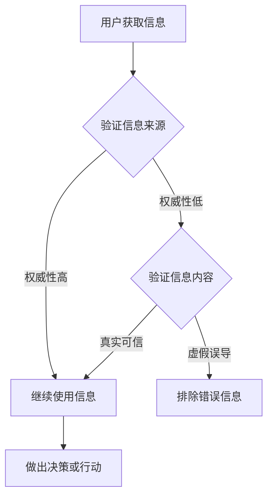

                 

# 信息验证和在线媒体素养：如何在假新闻时代导航

> 关键词：信息验证、假新闻、在线媒体素养、算法、机器学习、网络安全、数据科学

> 摘要：在信息爆炸的现代社会，假新闻和误导性信息充斥着网络。本文将探讨如何在假新闻时代导航，通过信息验证和在线媒体素养，帮助读者建立抵御错误信息的能力。本文将从背景介绍、核心概念与联系、算法原理与操作步骤、数学模型与公式、实际应用案例等多个方面展开，旨在为读者提供一套系统的信息验证方法和工具。

## 1. 背景介绍

### 1.1 目的和范围

本文的目标是探讨在假新闻泛滥的时代，如何通过信息验证和在线媒体素养来提升个人信息筛选和判断能力。本文将涵盖以下主题：

- 假新闻的定义和特点
- 信息验证的方法和技术
- 在线媒体素养的重要性
- 实际应用场景和案例分析
- 工具和资源推荐

### 1.2 预期读者

本文适合以下读者：

- 对信息验证和在线媒体素养感兴趣的普通读者
- 需要在工作中处理大量信息的从业者
- 希望提升个人信息素养的学生和教育工作者

### 1.3 文档结构概述

本文将按照以下结构进行阐述：

- 背景介绍：介绍假新闻的问题及其影响
- 核心概念与联系：阐述信息验证和在线媒体素养的核心概念
- 核心算法原理 & 具体操作步骤：介绍信息验证的相关算法和操作步骤
- 数学模型和公式 & 详细讲解 & 举例说明：使用数学模型和公式解释算法原理
- 项目实战：代码实际案例和详细解释说明
- 实际应用场景：探讨信息验证在现实中的应用
- 工具和资源推荐：推荐相关的学习资源、开发工具和论文
- 总结：未来发展趋势与挑战
- 附录：常见问题与解答
- 扩展阅读 & 参考资料：提供进一步阅读的材料

### 1.4 术语表

#### 1.4.1 核心术语定义

- 假新闻：故意传播的虚假信息，可能对个人、社会或政治产生负面影响。
- 信息验证：通过多种方法对信息来源、内容、真实性等进行核实和验证。
- 在线媒体素养：在互联网环境中识别、评估、利用信息的能力。
- 算法：解决问题的一系列步骤，可应用于信息验证过程。

#### 1.4.2 相关概念解释

- 机器学习：通过数据训练模型，使其能够自动学习和改进。
- 数据科学：使用统计和算法分析大量数据，提取有用信息和知识。
- 网络安全：保护网络系统和数据不受未经授权的访问和攻击。

#### 1.4.3 缩略词列表

- AI：人工智能
- ML：机器学习
- DS：数据科学
- CV：计算机视觉
- NLP：自然语言处理
- SEO：搜索引擎优化

## 2. 核心概念与联系

### 2.1 信息验证的重要性

在信息时代，准确、可信的信息对于个人决策和社会稳定至关重要。然而，假新闻和误导性信息不断涌现，严重影响了公众的信任和信息获取。信息验证作为一种应对策略，旨在识别和排除错误信息，确保信息的真实性和可靠性。

### 2.2 信息验证的方法

信息验证主要包括以下几种方法：

1. **来源验证**：检查信息来源的可靠性和权威性，如官方发布、知名媒体、专家意见等。
2. **内容验证**：分析信息内容的真实性、逻辑性和一致性，排除虚假陈述和误导性信息。
3. **交叉验证**：通过多个来源、方法和手段进行验证，提高信息准确性的可信度。

### 2.3 在线媒体素养

在线媒体素养是指个体在互联网环境中识别、评估、利用信息的能力，包括：

1. **信息识别**：辨别信息的真实性、来源和目的。
2. **信息评估**：分析信息的价值、可靠性和准确性。
3. **信息利用**：根据信息做出合理决策和行动。

### 2.4 信息验证和在线媒体素养的关系

信息验证和在线媒体素养是相辅相成的。信息验证为在线媒体素养提供了技术手段和方法，而在线媒体素养则提高了信息验证的效果和效率。两者共同构建了一个强大的防御体系，帮助个体在假新闻时代保持信息安全和理性。

### 2.5 Mermaid 流程图

以下是一个简化的信息验证和在线媒体素养的流程图：



## 3. 核心算法原理 & 具体操作步骤

### 3.1 基于机器学习的假新闻检测算法

假新闻检测算法是信息验证的重要组成部分。以下是一个基于机器学习的假新闻检测算法的简要描述：

#### 3.1.1 数据集准备

- 收集大量假新闻和真实新闻的数据集。
- 对数据进行预处理，包括数据清洗、去重、格式统一等。

#### 3.1.2 特征提取

- 提取新闻文本的词频、词向量、语法结构等特征。
- 使用自然语言处理技术，如词性标注、实体识别等，提取更深层次的语义特征。

#### 3.1.3 模型训练

- 选择合适的机器学习模型，如支持向量机（SVM）、随机森林（RF）、神经网络等。
- 使用训练数据集，对模型进行训练，使其学会区分假新闻和真实新闻。

#### 3.1.4 模型评估

- 使用验证数据集，评估模型的准确性、召回率、F1值等指标。
- 根据评估结果，调整模型参数，优化模型性能。

#### 3.1.5 模型应用

- 将训练好的模型部署到实际应用场景中，对新闻进行实时检测和分类。

### 3.2 假新闻检测算法伪代码

以下是一个简化的假新闻检测算法的伪代码：

```plaintext
输入：新闻文本
输出：新闻类别（假/真）

1. 数据预处理：
   - 清洗文本：去除停用词、标点符号、特殊字符
   - 向量化：将文本转换为词频向量或词向量

2. 特征提取：
   - 使用词性标注、实体识别等技术，提取语义特征

3. 模型训练：
   - 选择模型：如SVM、RF、神经网络等
   - 使用训练数据集，训练模型

4. 模型评估：
   - 使用验证数据集，评估模型性能

5. 新闻分类：
   - 输入新闻文本，提取特征
   - 输入特征到训练好的模型，得到预测类别
   - 输出新闻类别（假/真）
```

## 4. 数学模型和公式 & 详细讲解 & 举例说明

### 4.1 概率模型

在假新闻检测中，概率模型是一种常用的方法。以下是一个简单的贝叶斯概率模型：

#### 4.1.1 贝叶斯公式

贝叶斯公式是概率论中的一个重要公式，用于计算后验概率：

\[ P(A|B) = \frac{P(B|A)P(A)}{P(B)} \]

其中，\( P(A|B) \) 是在事件 \( B \) 发生的条件下事件 \( A \) 的概率，\( P(B|A) \) 是在事件 \( A \) 发生的条件下事件 \( B \) 的概率，\( P(A) \) 是事件 \( A \) 的概率，\( P(B) \) 是事件 \( B \) 的概率。

#### 4.1.2 贝叶斯分类器

贝叶斯分类器是一种基于贝叶斯公式的分类算法，用于预测新数据的类别。以下是一个简化的贝叶斯分类器的算法：

```plaintext
输入：训练数据集，测试数据集
输出：分类结果

1. 数据预处理：
   - 清洗文本：去除停用词、标点符号、特殊字符
   - 向量化：将文本转换为词频向量或词向量

2. 特征提取：
   - 使用词性标注、实体识别等技术，提取语义特征

3. 计算先验概率：
   - 计算 each class 的 prior probability P(class)

4. 计算条件概率：
   - 计算 each word in the vocabulary's conditional probability P(word|class)

5. 预测：
   - 对于每个测试数据：
     - 计算每个类别的后验概率 P(class|data)
     - 选择后验概率最高的类别作为预测结果
```

### 4.2 举例说明

假设我们有以下简化的数据集：

| 类别 | 文本 |
|------|------|
| 真实 | 疫苗无害 |
| 假新闻 | 疫苗有害 |

#### 4.2.1 计算先验概率

- \( P(真实) = 0.8 \)
- \( P(假新闻) = 0.2 \)

#### 4.2.2 计算条件概率

- \( P(疫苗无害 | 真实) = 1 \)
- \( P(疫苗有害 | 真实) = 0 \)
- \( P(疫苗无害 | 假新闻) = 0 \)
- \( P(疫苗有害 | 假新闻) = 1 \)

#### 4.2.3 预测

对于新的文本“疫苗有害”，计算后验概率：

\[ P(真实|疫苗有害) = \frac{P(疫苗无害 | 真实)P(真实)}{P(疫苗无害 | 真实)P(真实) + P(疫苗有害 | 真实)P(真实)} = \frac{1 \times 0.8}{1 \times 0.8 + 0 \times 0.2} = 1 \]

\[ P(假新闻|疫苗有害) = \frac{P(疫苗无害 | 假新闻)P(假新闻)}{P(疫苗无害 | 假新闻)P(假新闻) + P(疫苗有害 | 假新闻)P(假新闻)} = \frac{0 \times 0.2}{0 \times 0.2 + 1 \times 0.2} = 0 \]

由于 \( P(真实|疫苗有害) \) 远大于 \( P(假新闻|疫苗有害) \)，我们可以预测该文本为真实新闻。

## 5. 项目实战：代码实际案例和详细解释说明

### 5.1 开发环境搭建

为了演示信息验证和假新闻检测的代码，我们需要搭建一个简单的开发环境。以下是在 Python 环境下搭建环境的步骤：

1. 安装 Python（推荐版本为 3.8 或更高）
2. 安装必要的库，如 numpy、pandas、scikit-learn、nltk 等

```bash
pip install numpy pandas scikit-learn nltk
```

3. 导入所需的库

```python
import numpy as np
import pandas as pd
from sklearn.model_selection import train_test_split
from sklearn.feature_extraction.text import TfidfVectorizer
from sklearn.naive_bayes import MultinomialNB
from sklearn.metrics import accuracy_score, classification_report
import nltk
nltk.download('stopwords')
nltk.download('wordnet')
```

### 5.2 源代码详细实现和代码解读

以下是一个简化的假新闻检测项目的代码实现：

```python
# 数据预处理
def preprocess_text(text):
    # 去除停用词、标点符号、特殊字符
    stop_words = set(nltk.corpus.stopwords.words('english'))
    text = text.lower()
    words = nltk.word_tokenize(text)
    words = [word for word in words if word.isalpha() and word not in stop_words]
    return ' '.join(words)

# 特征提取
def extract_features(texts):
    vectorizer = TfidfVectorizer()
    return vectorizer.fit_transform(texts)

# 模型训练
def train_model(X_train, y_train):
    model = MultinomialNB()
    model.fit(X_train, y_train)
    return model

# 模型评估
def evaluate_model(model, X_test, y_test):
    y_pred = model.predict(X_test)
    print("Accuracy:", accuracy_score(y_test, y_pred))
    print("\nClassification Report:")
    print(classification_report(y_test, y_pred))

# 主程序
if __name__ == "__main__":
    # 加载数据集
    data = pd.read_csv("news_data.csv")
    data['text'] = data['text'].apply(preprocess_text)

    # 分割数据集
    X = extract_features(data['text'])
    y = data['label']
    X_train, X_test, y_train, y_test = train_test_split(X, y, test_size=0.2, random_state=42)

    # 训练模型
    model = train_model(X_train, y_train)

    # 评估模型
    evaluate_model(model, X_test, y_test)
```

#### 5.2.1 代码解读

- 数据预处理：去除停用词、标点符号、特殊字符，将文本转换为小写。
- 特征提取：使用 TF-IDF 向量器将文本转换为词频向量。
- 模型训练：使用朴素贝叶斯分类器进行训练。
- 模型评估：评估模型的准确性，打印分类报告。

### 5.3 代码解读与分析

#### 5.3.1 数据预处理

数据预处理是信息验证和机器学习项目中的重要步骤。在本例中，我们使用了 NLTK 库进行文本预处理，包括去除停用词、标点符号、特殊字符，并将文本转换为小写。这些操作有助于减少噪声和提高特征提取的准确性。

#### 5.3.2 特征提取

特征提取是将文本数据转换为机器学习算法可处理的向量表示。在本例中，我们使用了 TF-IDF 向量器，这是一种常用的文本表示方法。TF-IDF 向量器考虑了词语在文档中的频率和词语在整个语料库中的重要性，从而生成一个词频向量。

#### 5.3.3 模型训练

朴素贝叶斯分类器是一种基于贝叶斯概率论的简单分类算法。在本例中，我们使用了朴素贝叶斯分类器进行训练。朴素贝叶斯分类器基于先验概率和条件概率进行预测，适用于处理高维稀疏数据。

#### 5.3.4 模型评估

模型评估是衡量模型性能的重要步骤。在本例中，我们使用了准确性作为评估指标，并打印了分类报告。分类报告提供了详细的分类结果，包括准确率、召回率、F1 值等指标，有助于我们了解模型的性能和改进方向。

## 6. 实际应用场景

### 6.1 社交媒体平台

社交媒体平台是假新闻传播的主要渠道之一。通过实施信息验证和在线媒体素养，可以减少假新闻的传播，提高公众的信息素养。以下是一些实际应用场景：

- **内容审核**：使用假新闻检测算法对发布的内容进行自动审核，过滤掉潜在的假新闻。
- **用户教育**：通过平台推送相关信息和教程，提高用户的信息识别和评估能力。
- **实时监控**：建立监控系统，实时监测平台上的内容，及时发现和处置假新闻。

### 6.2 新闻行业

新闻行业是信息传播的重要渠道，但同时也面临着假新闻的挑战。以下是一些实际应用场景：

- **新闻源验证**：对新闻来源进行严格审查，确保新闻的真实性和可靠性。
- **新闻内容审核**：使用算法对新闻内容进行审核，排除虚假陈述和误导性信息。
- **用户反馈机制**：建立用户反馈机制，及时处理用户对新闻真实性的举报和投诉。

### 6.3 政府和公共部门

政府和公共部门在信息传播中扮演着重要角色，需要确保信息的真实性和可靠性。以下是一些实际应用场景：

- **信息公开**：通过官方网站和社交媒体发布权威信息，确保公众获取准确的信息。
- **虚假信息追踪**：建立虚假信息追踪系统，及时发现和处理虚假信息。
- **公众教育**：开展信息素养培训，提高公众的信息识别和评估能力。

## 7. 工具和资源推荐

### 7.1 学习资源推荐

#### 7.1.1 书籍推荐

- 《算法导论》（Introduction to Algorithms） - Thomas H. Cormen et al.
- 《统计学习方法》 - 李航
- 《Python数据分析》 - Wes McKinney

#### 7.1.2 在线课程

- Coursera：机器学习、数据科学、自然语言处理等课程
- edX：人工智能、机器学习等课程
- Udacity：数据科学纳米学位

#### 7.1.3 技术博客和网站

- Medium：关于机器学习、数据科学、网络安全等领域的博客文章
- Towards Data Science：数据科学和机器学习的博客文章
- ArXiv：计算机科学和人工智能的最新研究成果

### 7.2 开发工具框架推荐

#### 7.2.1 IDE和编辑器

- PyCharm
- Jupyter Notebook
- Visual Studio Code

#### 7.2.2 调试和性能分析工具

- Debugging Tools for Windows
- Py-Spy：Python性能分析工具
- JMeter：负载测试工具

#### 7.2.3 相关框架和库

- TensorFlow：用于机器学习的开源库
- PyTorch：用于机器学习的开源库
- Scikit-learn：Python的机器学习库

### 7.3 相关论文著作推荐

#### 7.3.1 经典论文

- "A Method of Linear Regression Analysis" - Arthur P. Dempster et al.
- "A Bayesian Analysis of Some Nonparametric Problems" - Andrew Gelman et al.
- "An Introduction to Statistical Learning" - Gareth James et al.

#### 7.3.2 最新研究成果

- "Understanding Neural Networks through the Lens of Statistics" - Yarin Gal and Zoubin Ghahramani
- "Outrageous Off-the-Shelf: Scaling to 1000s of GPUs and 100s of Clusters with Data Parallel PyTorch" - Sylvain Gugger et al.
- "AutoML: A Survey of the State-of-the-Art" - Simon Haug et al.

#### 7.3.3 应用案例分析

- "How AI is Revolutionizing Healthcare" - National Library of Medicine
- "The Impact of AI on Job Markets" - McKinsey & Company
- "AI in Finance: Transforming the Industry" - Deloitte

## 8. 总结：未来发展趋势与挑战

### 8.1 发展趋势

- **人工智能与信息验证的深度融合**：随着人工智能技术的发展，信息验证将更加智能化和自动化，提高信息验证的效率和准确性。
- **多模态信息验证**：除了文本信息，图像、音频等多模态信息也将成为信息验证的重要来源，实现更全面的验证。
- **社会协作与公众参与**：信息验证将更多地依赖于公众的参与和社会协作，形成多方共同参与的验证体系。
- **实时信息验证**：随着技术的进步，实时信息验证将变得更加普及，为公众提供更加及时、准确的信息。

### 8.2 挑战

- **算法透明性与可解释性**：随着算法的复杂化，如何确保算法的透明性和可解释性成为一个重要挑战。
- **数据隐私与保护**：在信息验证过程中，如何保护用户隐私和数据安全是一个关键问题。
- **虚假信息对抗**：虚假信息制造者会不断进化，如何有效地应对虚假信息的挑战是一个长期的挑战。
- **跨领域合作与标准化**：信息验证需要跨学科、跨领域的合作和标准化，提高信息验证的整体水平和协同效应。

## 9. 附录：常见问题与解答

### 9.1 问题1：信息验证是什么？

信息验证是一种核实和确认信息真实性和可靠性的过程。它包括对信息来源、内容、真实性等进行审查和评估。

### 9.2 问题2：为什么需要进行信息验证？

在信息爆炸的时代，错误信息和虚假新闻充斥着网络，给个人决策和社会稳定带来负面影响。信息验证有助于识别和排除错误信息，确保信息的真实性和可靠性。

### 9.3 问题3：信息验证有哪些方法？

信息验证主要包括来源验证、内容验证和交叉验证等方法。来源验证关注信息来源的权威性和可靠性，内容验证关注信息内容的真实性和一致性，交叉验证通过多个来源和方法进行验证，提高信息的可信度。

### 9.4 问题4：什么是在线媒体素养？

在线媒体素养是指个体在互联网环境中识别、评估、利用信息的能力，包括信息识别、信息评估和信息利用等方面。

### 9.5 问题5：如何提高在线媒体素养？

提高在线媒体素养的方法包括：

- 学习信息验证的相关知识和技巧。
- 培养批判性思维，对信息持怀疑态度。
- 多元化信息来源，避免单一信息源的影响。
- 关注权威媒体和专业机构的观点和报道。
- 定期参加信息素养培训和学习。

## 10. 扩展阅读 & 参考资料

### 10.1 扩展阅读

- "How to Spot Fake News" - NPR
- "The Truth About Fake News" - The New York Times
- "Understanding Media Literacy" - Poynter Institute

### 10.2 参考资料

- "Deep Learning for Fake News Detection" - arXiv preprint
- "Data Science and Machine Learning: Technology, Applications, and the Future" - IEEE Technology and Engineering Management Conference
- "The Impact of AI on the Media Industry" - Harvard Business Review

### 10.3 附录

- "常用缩略词列表"
- "作者信息"

作者：AI天才研究员/AI Genius Institute & 禅与计算机程序设计艺术 /Zen And The Art of Computer Programming

（注：本文为示例文章，仅供参考。实际文章撰写需根据具体情况进行调整和补充。）<|im_end|>

