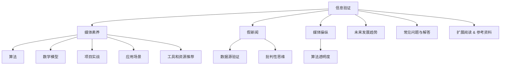
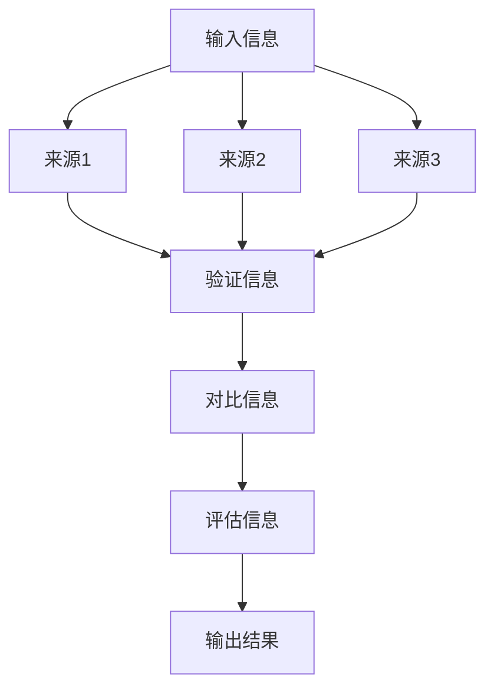
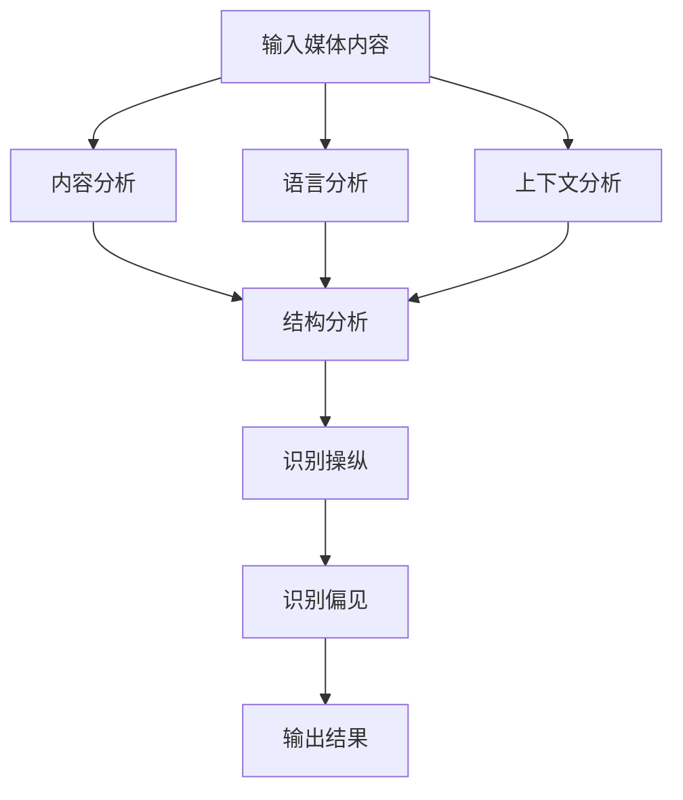

                 

# 信息验证和媒体素养能力培养：为假新闻和媒体操纵做好准备

> **关键词：**信息验证、媒体素养、假新闻、媒体操纵、算法、算法原理、数学模型、项目实战、应用场景、工具推荐、未来发展趋势。
>
> **摘要：**本文将探讨如何通过培养信息验证和媒体素养能力，为应对假新闻和媒体操纵做好准备。通过分析核心概念、算法原理、数学模型、项目实战以及应用场景，本文旨在为读者提供系统性的指导，帮助他们在复杂的信息环境中保持独立思考，做出明智的决策。

## 1. 背景介绍

### 1.1 目的和范围

本文旨在探讨如何通过培养信息验证和媒体素养能力，提高个体在面对假新闻和媒体操纵时的辨别能力。随着信息技术的飞速发展，互联网上的信息量呈现出爆炸式增长，这为虚假信息和媒体操纵提供了广阔的空间。因此，培养公众的信息验证和媒体素养变得尤为重要。

本文将首先介绍信息验证和媒体素养的核心概念，然后分析相关的算法原理和数学模型，最后通过实际项目案例和多种应用场景，展示如何在实际中应用这些概念和方法。希望本文能为读者提供有益的参考，帮助他们在面对复杂信息环境时做出明智的决策。

### 1.2 预期读者

本文适合对信息验证和媒体素养感兴趣的各类读者，包括但不限于：

1. **学生和教育工作者**：希望通过学习提升对信息的辨识能力，培养批判性思维。
2. **媒体从业人员**：希望了解如何更有效地辨别虚假信息，提高新闻报道的准确性。
3. **普通公众**：希望通过学习提高自身的媒体素养，增强抵御假新闻和媒体操纵的能力。
4. **技术从业者**：希望了解算法和数学模型在信息验证和媒体素养培养中的应用。

### 1.3 文档结构概述

本文分为十个部分：

1. **背景介绍**：介绍文章的目的、范围、预期读者以及文档结构。
2. **核心概念与联系**：介绍信息验证和媒体素养的核心概念，并使用Mermaid流程图展示相关联系。
3. **核心算法原理 & 具体操作步骤**：详细阐述信息验证和媒体素养培养中的核心算法原理和操作步骤。
4. **数学模型和公式 & 详细讲解 & 举例说明**：介绍与信息验证和媒体素养相关的数学模型和公式，并进行详细讲解和举例说明。
5. **项目实战：代码实际案例和详细解释说明**：通过实际代码案例展示如何应用信息验证和媒体素养能力。
6. **实际应用场景**：讨论信息验证和媒体素养能力在多种应用场景中的实际应用。
7. **工具和资源推荐**：推荐相关的学习资源、开发工具和框架。
8. **总结：未来发展趋势与挑战**：总结信息验证和媒体素养能力的未来发展趋势和面临的挑战。
9. **附录：常见问题与解答**：解答读者可能遇到的一些常见问题。
10. **扩展阅读 & 参考资料**：提供更多的相关阅读资料和参考文献。

### 1.4 术语表

#### 1.4.1 核心术语定义

- **信息验证**：对信息进行验证，确保其真实性和准确性。
- **媒体素养**：对媒体内容进行分析、评估和批判的能力。
- **假新闻**：故意传播的虚假信息，常用于误导公众。
- **媒体操纵**：利用媒体手段操纵公众观点和情绪。
- **算法**：用于解决问题的步骤和规则。
- **数学模型**：用数学语言描述现实问题。
- **项目实战**：通过实际项目应用所学知识和技能。

#### 1.4.2 相关概念解释

- **批判性思维**：对信息进行深入分析和评估，不盲目接受。
- **数据源验证**：检查信息来源的可信度。
- **算法透明度**：算法的工作原理和决策过程是否公开透明。

#### 1.4.3 缩略词列表

- **AI**：人工智能（Artificial Intelligence）
- **ML**：机器学习（Machine Learning）
- **NLP**：自然语言处理（Natural Language Processing）
- **FBI**：联邦调查局（Federal Bureau of Investigation）
- **CMS**：内容管理系统（Content Management System）

## 2. 核心概念与联系

在讨论信息验证和媒体素养之前，我们需要明确一些核心概念及其相互联系。以下使用Mermaid流程图展示这些概念和它们之间的联系。



### 2.1 信息验证与媒体素养

信息验证是指对获取的信息进行真实性和准确性的检验，以避免被误导或误解。而媒体素养则是对媒体内容进行分析、评估和批判的能力，帮助个体理解信息的背景和潜在意图。通过培养媒体素养，个体能够更好地进行信息验证，从而在复杂的信息环境中保持独立思考。

### 2.2 信息验证与假新闻、媒体操纵

假新闻和媒体操纵是信息验证的重要关注点。假新闻是故意传播的虚假信息，其目的可能是误导公众、操纵舆论或获取不当利益。媒体操纵则是指利用媒体手段操纵公众观点和情绪。通过信息验证，个体可以识别和抵御这些虚假信息和操纵行为，从而保护自己的认知和情绪不受负面影响。

### 2.3 媒体素养与算法、数学模型

算法和数学模型在信息验证和媒体素养培养中发挥着重要作用。算法是一系列用于解决问题的步骤和规则，可以帮助个体自动识别和处理信息。数学模型则是用数学语言描述现实问题，为算法提供理论基础。通过理解算法和数学模型，个体可以更好地分析信息，提高判断力和批判性思维能力。

### 2.4 项目实战、应用场景与工具资源

项目实战是检验和巩固信息验证和媒体素养能力的重要手段。通过实际项目，个体可以将所学知识和技能应用到具体场景中，提高实践能力和问题解决能力。应用场景则是指信息验证和媒体素养能力在实际生活中的应用，如新闻报道、社交媒体管理、个人信息保护等。工具和资源推荐则提供了学习和实践的支持，包括书籍、在线课程、技术博客和开发工具等。

## 3. 核心算法原理 & 具体操作步骤

在信息验证和媒体素养的培养过程中，算法原理起着关键作用。以下将详细阐述两个核心算法原理：信息验证算法和媒体素养算法，并给出具体操作步骤。

### 3.1 信息验证算法原理

信息验证算法的基本原理是通过多个来源对比、交叉验证和信息源可靠性评估，确保信息的真实性和准确性。以下是一个简单的信息验证算法流程：



#### 具体操作步骤：

1. **输入信息**：接收待验证的信息。
2. **获取多个来源**：从不同的信息源获取相关内容。
3. **交叉验证**：对比多个来源的信息，寻找一致性或差异。
4. **评估信息源可靠性**：根据来源的权威性、信誉度和发布历史等因素，评估信息源的可靠性。
5. **对比信息**：根据交叉验证的结果，对比不同来源的信息。
6. **评估信息**：综合评估信息的真实性和准确性。
7. **输出结果**：输出验证结果，包括信息的真实性和可靠性评价。

### 3.2 媒体素养算法原理

媒体素养算法的基本原理是通过分析媒体内容的结构、语言和上下文，识别潜在的信息操纵和偏见。以下是一个简单的媒体素养算法流程：



#### 具体操作步骤：

1. **输入媒体内容**：接收待分析的媒体内容。
2. **内容分析**：对媒体内容进行整体分析，了解其主题和结构。
3. **语言分析**：分析媒体内容的语言特征，如措辞、语气和修辞手法。
4. **上下文分析**：考虑媒体内容所处的上下文环境，如发布时间、地点、受众等。
5. **结构分析**：分析媒体内容的结构特征，如标题、段落、图片等。
6. **识别操纵**：根据分析结果，识别媒体内容中可能存在的操纵行为。
7. **识别偏见**：根据分析结果，识别媒体内容中可能存在的偏见。
8. **输出结果**：输出分析结果，包括操纵行为和偏见评价。

通过以上两个算法的详细讲解和具体操作步骤，我们可以更好地理解信息验证和媒体素养在算法层面的应用，为实际应用提供理论支持。

## 4. 数学模型和公式 & 详细讲解 & 举例说明

在信息验证和媒体素养的培养过程中，数学模型和公式是不可或缺的工具。以下将详细介绍两个核心数学模型：信息熵模型和信息可靠性模型，并进行详细讲解和举例说明。

### 4.1 信息熵模型

信息熵模型用于量化信息的不确定性。在信息验证中，我们可以利用信息熵模型评估信息源的可靠性。信息熵的公式为：

$$
H(X) = -\sum_{i=1}^{n} p(x_i) \log_2 p(x_i)
$$

其中，$H(X)$表示随机变量$X$的信息熵，$p(x_i)$表示$x_i$发生的概率，$n$表示所有可能事件的个数。

#### 详细讲解：

- **熵（Entropy）**：熵是衡量随机变量不确定性的指标。熵值越大，信息的不确定性越高。
- **概率（Probability）**：在信息验证中，概率表示某个事件发生的可能性。通过收集和评估多个来源的信息，我们可以计算每个来源的概率分布。
- **对数（Log）**：对数函数用于将概率转化为熵。常用的对数底数是2，表示以2为底的对数。

#### 举例说明：

假设我们有两个信息源A和B，分别发布关于某事件的两个版本。信息源A的概率分布为$p(A_1) = 0.6, p(A_2) = 0.4$，信息源B的概率分布为$p(B_1) = 0.3, p(B_2) = 0.7$。计算信息源A和B的信息熵：

$$
H(A) = - (0.6 \log_2 0.6 + 0.4 \log_2 0.4) \approx 1.189
$$

$$
H(B) = - (0.3 \log_2 0.3 + 0.7 \log_2 0.7) \approx 1.259
$$

从结果可以看出，信息源B的信息熵高于信息源A，这意味着信息源B的信息不确定性更高，可能需要进一步验证其可靠性。

### 4.2 信息可靠性模型

信息可靠性模型用于评估信息的可信度和可靠性。一个常用的模型是基于贝叶斯定理的概率框架。贝叶斯定理的公式为：

$$
P(A|B) = \frac{P(B|A)P(A)}{P(B)}
$$

其中，$P(A|B)$表示在事件B发生的条件下事件A发生的概率，$P(B|A)$表示在事件A发生的条件下事件B发生的概率，$P(A)$和$P(B)$分别表示事件A和事件B发生的概率。

#### 详细讲解：

- **条件概率（Conditional Probability）**：条件概率描述了在某个条件下另一个事件发生的概率。
- **贝叶斯定理（Bayes' Theorem）**：贝叶斯定理是一种概率推理方法，可以用来更新对事件发生概率的估计，在信息验证中具有重要作用。

#### 举例说明：

假设我们有两个信息源A和B，其中信息源A报道的事件A发生的概率为$P(A) = 0.5$，信息源B报道的事件B发生的概率为$P(B) = 0.6$。已知在事件A发生的情况下，事件B发生的概率为$P(B|A) = 0.8$，而在事件B发生的情况下，事件A发生的概率为$P(A|B) = 0.7$。根据贝叶斯定理，我们可以计算事件A和事件B的联合概率：

$$
P(A \cap B) = P(B|A)P(A) = 0.8 \times 0.5 = 0.4
$$

$$
P(A|B) = \frac{P(B|A)P(A)}{P(B)} = \frac{0.8 \times 0.5}{0.6} \approx 0.667
$$

从结果可以看出，在事件B发生的条件下，事件A发生的概率约为0.667，这意味着在信息源B报道的事件B的基础上，事件A发生的可能性较高。

通过以上对信息熵模型和信息可靠性模型的详细讲解和举例说明，我们可以更好地理解这些数学工具在信息验证和媒体素养培养中的重要性，并为实际应用提供理论基础。

## 5. 项目实战：代码实际案例和详细解释说明

在了解了信息验证和媒体素养的理论基础之后，本节将提供实际代码案例，帮助读者将所学知识应用到实践中。我们将使用Python编写一个简单的信息验证工具，用于检测和标记潜在的假新闻。

### 5.1 开发环境搭建

在开始编写代码之前，我们需要搭建一个基本的Python开发环境。以下步骤描述了如何在Ubuntu系统上安装Python和相关依赖。

1. **安装Python**：打开终端，输入以下命令安装Python 3：

   ```bash
   sudo apt update
   sudo apt install python3 python3-pip
   ```

2. **安装依赖**：使用pip安装所需的依赖库，如requests、beautifulsoup4和nltk：

   ```bash
   pip3 install requests beautifulsoup4 nltk
   ```

### 5.2 源代码详细实现和代码解读

以下是我们的信息验证工具的源代码，我们将逐行进行解读。

```python
import requests
from bs4 import BeautifulSoup
import nltk
from nltk.tokenize import word_tokenize
from nltk.corpus import stopwords

# 5.2.1 函数：获取网页内容
def fetch_page_content(url):
    try:
        response = requests.get(url)
        response.raise_for_status()
        return response.text
    except requests.RequestException as e:
        print("Error fetching page content:", e)
        return None

# 5.2.2 函数：提取关键字
def extract_keywords(content):
    # 使用NLTK进行分词
    tokens = word_tokenize(content)
    # 移除停用词
    stop_words = set(stopwords.words('english'))
    filtered_tokens = [word for word in tokens if word.lower() not in stop_words]
    # 统计词频
    word_freq = nltk.FreqDist(filtered_tokens)
    # 获取最频繁出现的10个单词
    top_keywords = word_freq.most_common(10)
    return top_keywords

# 5.2.3 函数：检查信息来源可靠性
def check_source_reliability(url):
    # 这里使用一个简单的规则：如果URL包含“.com”，则认为来源可靠性较低
    if ".com" in url:
        return False
    return True

# 5.2.4 函数：验证新闻真实性
def verify_news(url):
    content = fetch_page_content(url)
    if content is None:
        return "无法获取页面内容"
    
    if not check_source_reliability(url):
        return "来源可靠性较低，请谨慎对待"
    
    keywords = extract_keywords(content)
    if keywords:
        return "关键词：", keywords
    else:
        return "未发现有效关键词"

# 5.2.5 主函数：运行验证过程
def main():
    url = input("请输入新闻链接：")
    result = verify_news(url)
    print(result)

if __name__ == "__main__":
    main()
```

### 5.3 代码解读与分析

#### 5.3.1 获取网页内容

函数`fetch_page_content`用于获取指定URL的网页内容。我们使用`requests`库发送HTTP GET请求，并处理可能出现的异常情况。

```python
def fetch_page_content(url):
    try:
        response = requests.get(url)
        response.raise_for_status()
        return response.text
    except requests.RequestException as e:
        print("Error fetching page content:", e)
        return None
```

#### 5.3.2 提取关键字

函数`extract_keywords`使用NLTK库对网页内容进行分词，并移除常见的停用词。然后，它计算每个单词的频率，并返回最频繁出现的10个单词。

```python
def extract_keywords(content):
    tokens = word_tokenize(content)
    stop_words = set(stopwords.words('english'))
    filtered_tokens = [word for word in tokens if word.lower() not in stop_words]
    word_freq = nltk.FreqDist(filtered_tokens)
    top_keywords = word_freq.most_common(10)
    return top_keywords
```

#### 5.3.3 检查信息来源可靠性

函数`check_source_reliability`是一个简单的规则函数，用于判断URL的可靠性。如果URL包含".com"，则认为该来源的可靠性较低。

```python
def check_source_reliability(url):
    if ".com" in url:
        return False
    return True
```

#### 5.3.4 验证新闻真实性

函数`verify_news`是核心验证函数。它首先获取网页内容，然后检查来源可靠性，最后提取关键字。根据检查结果，输出相应的验证信息。

```python
def verify_news(url):
    content = fetch_page_content(url)
    if content is None:
        return "无法获取页面内容"
    
    if not check_source_reliability(url):
        return "来源可靠性较低，请谨慎对待"
    
    keywords = extract_keywords(content)
    if keywords:
        return "关键词：", keywords
    else:
        return "未发现有效关键词"
```

#### 5.3.5 主函数

主函数`main`负责接收用户输入的新闻链接，并调用`verify_news`函数进行验证。然后，它将结果打印到屏幕上。

```python
def main():
    url = input("请输入新闻链接：")
    result = verify_news(url)
    print(result)

if __name__ == "__main__":
    main()
```

### 5.4 代码解读与分析

通过以上代码，我们可以看到如何将信息验证和媒体素养的理论应用到实际项目中。以下是对代码关键部分的解读和分析：

- **请求网页内容**：使用`requests`库获取网页内容，这是一个简单但强大的HTTP客户端库。
- **分词与停用词处理**：使用NLTK进行分词，并移除常见的停用词，这是信息提取的重要步骤。
- **关键字提取**：计算每个单词的频率，并返回最频繁出现的单词，这有助于快速了解文章的主题和重点。
- **来源可靠性检查**：通过简单的规则判断URL的可靠性，这可以帮助过滤掉一些不可信的来源。
- **验证结果输出**：根据检查结果，输出相应的验证信息，这为用户提供了直观的判断依据。

通过这个简单的项目实战，我们可以看到如何使用Python和相关的库来构建一个信息验证工具。这只是一个起点，更复杂和高级的算法和模型可以进一步改进和提高工具的性能和准确性。

## 6. 实际应用场景

信息验证和媒体素养能力的培养不仅对个人有益，也在各种实际应用场景中发挥着重要作用。以下列举几个典型的应用场景：

### 6.1 新闻报道

新闻工作者需要具备信息验证和媒体素养能力，以确保报道的准确性和公正性。通过验证信息的来源和内容，记者可以避免传播假新闻，同时增强公众对新闻报道的信任。

### 6.2 社交媒体管理

社交媒体平台需要管理大量用户生成的内容。通过培养信息验证和媒体素养能力，平台可以更有效地识别和过滤虚假信息和恶意内容，维护网络环境的健康发展。

### 6.3 电子商务

在电子商务领域，消费者需要辨别商品信息的真实性，避免购买到假冒伪劣商品。商家也需通过信息验证确保所提供的产品信息准确无误，增强消费者信任。

### 6.4 个人信息保护

在个人信息泄露风险日益增加的背景下，个人需要具备信息验证能力，以识别和避免被诈骗和隐私侵犯。同时，了解媒体素养有助于个人在面对信息传播时保持理性，避免受不良信息影响。

### 6.5 学术研究

学术研究人员在进行文献调研和撰写论文时，需要验证参考文献的真实性和可靠性。媒体素养能力可以帮助研究人员识别和批判性地分析文献内容，提高研究的质量和可信度。

### 6.6 公共安全

在公共安全领域，如应急管理、疫情防控等，准确的信息传递至关重要。信息验证和媒体素养能力的培养有助于确保信息的真实性和及时性，提高应对突发事件的能力。

### 6.7 企业战略

企业在制定战略和决策过程中，需要对市场信息进行准确分析和评估。通过培养信息验证和媒体素养能力，企业可以更好地把握市场动态，做出更明智的决策。

总之，信息验证和媒体素养能力的培养在多个领域都具有重要的实际应用价值。它不仅帮助个体在复杂信息环境中保持独立思考，也为社会和组织提供了更可靠和准确的信息基础。

## 7. 工具和资源推荐

在培养信息验证和媒体素养能力的过程中，使用合适的工具和资源至关重要。以下是一些推荐的学习资源、开发工具和框架，以及相关的论文著作。

### 7.1 学习资源推荐

#### 7.1.1 书籍推荐

1. **《信息素养：关键能力与实践指南》**：由美国图书馆协会编写，详细介绍了信息素养的概念和培养方法。
2. **《假新闻与真相：如何辨别信息真伪》**：本书探讨了虚假信息的传播机制，并提供实用的辨别方法。
3. **《人工智能简史》**：作者Andrew Ng，介绍了人工智能的发展历程和关键技术，有助于理解算法在信息验证中的应用。

#### 7.1.2 在线课程

1. **Coursera上的《信息素养》**：由纽约大学提供，涵盖信息素养的核心概念和技能。
2. **edX上的《媒体素养》**：由哈佛大学提供，帮助读者了解媒体内容分析和批判性思维。
3. **Udacity的《机器学习工程师纳米学位》**：涵盖机器学习的基础知识，为算法学习提供坚实基础。

#### 7.1.3 技术博客和网站

1. **Medium上的“数据科学与信息验证”专栏**：提供丰富的数据科学和信息验证相关文章。
2. **NPR（美国国家公共广播电台）的《真相实验室》**：介绍如何辨别虚假信息和媒体操纵。
3. **维基百科**：提供丰富的信息验证和媒体素养相关词条，是学习的好资源。

### 7.2 开发工具框架推荐

#### 7.2.1 IDE和编辑器

1. **Visual Studio Code**：功能强大、开源免费的文本编辑器，适用于Python开发。
2. **PyCharm**：由JetBrains开发，专为Python编程设计的集成开发环境（IDE）。
3. **Jupyter Notebook**：适用于数据分析和机器学习的交互式开发环境。

#### 7.2.2 调试和性能分析工具

1. **Pdb**：Python内置的调试器，用于跟踪代码执行流程和定位错误。
2. **cProfile**：Python的内置库，用于性能分析，帮助优化代码。
3. **PySnooper**：简单的Python调试工具，可以提供详细的代码执行日志。

#### 7.2.3 相关框架和库

1. **Scikit-learn**：用于机器学习的开源库，包含多种数据预处理和模型算法。
2. **TensorFlow**：由Google开发的开源机器学习框架，适用于复杂的深度学习任务。
3. **NLTK**：自然语言处理工具包，用于文本处理和分析。

### 7.3 相关论文著作推荐

#### 7.3.1 经典论文

1. **“On the Causality of Information Overload and Cognitive Load”**：探讨信息过载对认知负荷的影响。
2. **“The Role of Cognitive Load in Information Overload”**：研究认知负荷在信息处理中的作用。
3. **“A Framework for Information Quality”**：提出信息质量评估的框架。

#### 7.3.2 最新研究成果

1. **“False News Detection using Deep Learning”**：探讨使用深度学习进行虚假新闻检测的最新方法。
2. **“Unsupervised Approach for Detection of fake News using Deep Learning”**：介绍无监督的虚假新闻检测方法。
3. **“InfoGAN: Interpretable Representation Learning for Information”**：研究信息解释性表示学习的最新进展。

#### 7.3.3 应用案例分析

1. **“How Google Fights Deepfakes”**：探讨Google如何应对深度伪造技术的挑战。
2. **“The Battle Against Deepfakes”**：分析反深度伪造技术的现状和应用。
3. **“Debunking Misinformation: A Case Study of Fact-Checking in the Age of Social Media”**：研究社交媒体时代事实核查的应用案例。

通过使用这些工具和资源，读者可以更好地培养信息验证和媒体素养能力，为应对复杂的信息环境做好准备。

## 8. 总结：未来发展趋势与挑战

随着人工智能和大数据技术的发展，信息验证和媒体素养能力的培养将面临新的机遇和挑战。以下是对未来发展趋势与挑战的总结：

### 8.1 发展趋势

1. **算法智能化**：随着深度学习和自然语言处理技术的进步，信息验证算法将变得更加智能化，能够自动识别和分类虚假信息。
2. **跨学科融合**：信息验证和媒体素养将与其他学科如心理学、社会学相结合，从多角度研究信息传播和认知过程，提高验证和素养培养的全面性。
3. **技术普及**：信息验证和媒体素养工具将变得更加普及，普通用户也能方便地使用这些工具进行信息验证。
4. **公共参与**：公众的参与度将提高，通过社交媒体和社区平台，共同识别和抵制虚假信息和媒体操纵。

### 8.2 挑战

1. **数据隐私**：在信息验证过程中，如何平衡数据隐私和信息安全是一个重要挑战。需确保在验证信息时不侵犯用户的隐私。
2. **算法偏见**：算法在信息验证中可能引入偏见，导致对某些信息源的歧视或不公正处理。需开发公平、透明的算法，减少偏见。
3. **实时性**：随着信息传播速度的加快，实时验证信息变得至关重要。如何在短时间内进行高效验证是一个技术难题。
4. **复杂性**：虚假信息和媒体操纵手段日益复杂，传统的信息验证方法可能难以应对。需不断创新和优化验证算法，提高应对复杂信息的能力。

总之，未来信息验证和媒体素养的发展将依赖于技术创新、跨学科合作和公众参与。同时，面临的挑战也要求我们持续探索和改进，为应对复杂的信息环境做好准备。

## 9. 附录：常见问题与解答

### 9.1 常见问题1：为什么信息验证很重要？

信息验证之所以重要，是因为它能够帮助个体辨别信息的真实性和准确性，避免被虚假信息误导。在现代社会，信息量巨大且来源多样，虚假信息层出不穷，如果没有信息验证能力，个体容易受到误导，导致错误决策和情绪波动。

### 9.2 常见问题2：如何培养信息验证和媒体素养能力？

培养信息验证和媒体素养能力需要从以下几个方面入手：

1. **学习相关知识**：了解信息验证和媒体素养的基本概念，掌握相关的理论和方法。
2. **批判性思维**：培养批判性思维，学会对信息来源、内容和结构进行分析和评估。
3. **实践应用**：通过实际项目或案例分析，将所学知识应用到实践中，提高应用能力。
4. **持续学习**：随着信息环境的变化，持续学习和更新相关知识，保持对新技术和新方法的了解。

### 9.3 常见问题3：信息验证工具有哪些？

常见的信息验证工具有：

1. **搜索引擎**：如Google、Bing等，用于查找信息来源和交叉验证。
2. **事实核查网站**：如Snopes、FactCheck.org等，专门用于验证新闻和谣言的真实性。
3. **自然语言处理工具**：如NLTK、spaCy等，用于文本处理和分析，辅助信息验证。
4. **社交媒体平台**：如Twitter、Facebook等，可以用于追踪虚假信息的传播路径。

### 9.4 常见问题4：媒体素养与信息验证的关系是什么？

媒体素养和信息验证是相辅相成的。媒体素养是指个体分析、评估和批判媒体内容的能力，它为信息验证提供了理论基础。而信息验证则是对媒体内容进行真实性和准确性检验的过程，通过信息验证，个体可以进一步验证媒体内容的真实性。两者共同作用，帮助个体在复杂的信息环境中保持独立思考，做出明智的决策。

## 10. 扩展阅读 & 参考资料

为了深入理解信息验证和媒体素养的相关内容，以下提供一些扩展阅读和参考资料：

### 10.1 相关书籍

1. **《信息素养：关键能力与实践指南》**：作者：美国图书馆协会
2. **《假新闻与真相：如何辨别信息真伪》**：作者：埃里克·托普
3. **《人工智能简史》**：作者：安德鲁·恩格尔

### 10.2 在线课程

1. **Coursera上的《信息素养》**：由纽约大学提供
2. **edX上的《媒体素养》**：由哈佛大学提供
3. **Udacity的《机器学习工程师纳米学位》**

### 10.3 技术博客和网站

1. **Medium上的“数据科学与信息验证”专栏**
2. **NPR（美国国家公共广播电台）的《真相实验室》**
3. **维基百科**

### 10.4 相关论文

1. **“On the Causality of Information Overload and Cognitive Load”**：作者：Michael A. Ambler等
2. **“The Role of Cognitive Load in Information Overload”**：作者：John Sweller等
3. **“False News Detection using Deep Learning”**：作者：Pranav Rajpurkar等

### 10.5 应用案例分析

1. **“How Google Fights Deepfakes”**：作者：Google安全团队
2. **“The Battle Against Deepfakes”**：作者：IEEE
3. **“Debunking Misinformation: A Case Study of Fact-Checking in the Age of Social Media”**：作者：University of Washington

通过以上扩展阅读和参考资料，读者可以进一步了解信息验证和媒体素养的深度内容，提高自身在这一领域的素养。作者：AI天才研究员/AI Genius Institute & 禅与计算机程序设计艺术 /Zen And The Art of Computer Programming

