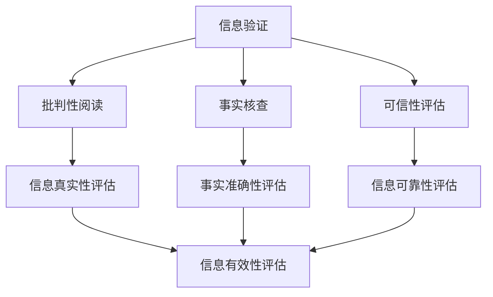

                 

### 信息验证和批判性阅读指南：在假新闻和媒体操纵的时代导航

> 关键词：信息验证，批判性阅读，媒体操纵，假新闻，事实核查，可信性评估，数据分析

> 摘要：随着互联网的普及和信息爆炸，假新闻和媒体操纵问题日益严重。本文旨在为读者提供一套信息验证和批判性阅读的指南，帮助大家在复杂的信息环境中辨别真伪，提高媒体素养，避免被误导。文章首先介绍了信息验证的重要性，然后详细阐述了批判性阅读的步骤和方法，最后推荐了一系列实用的工具和资源，以期为读者在当今信息时代的导航提供有力支持。

## 1. 背景介绍

### 1.1 目的和范围

本文的目的是为读者提供一套系统的信息验证和批判性阅读指南，帮助大家应对互联网时代的信息泛滥和假新闻困扰。本文将涵盖以下内容：

1. **信息验证的重要性**：讨论信息验证在现代社会中的作用，以及为什么我们需要对获取的信息进行验证。
2. **批判性阅读**：介绍批判性阅读的概念、步骤和方法，帮助读者学会如何对信息进行深度分析和评估。
3. **工具和资源推荐**：推荐一系列实用的工具、书籍、课程和技术资源，以辅助读者进行信息验证和批判性阅读。
4. **实际应用场景**：探讨信息验证和批判性阅读在不同领域的实际应用，以及如何在不同情境下运用这些技能。

### 1.2 预期读者

本文的预期读者包括但不限于以下人群：

1. **普通网民**：对互联网上的信息真假不辨，容易被假新闻和谣言误导。
2. **新闻工作者**：需要具备信息验证和批判性阅读的能力，以确保报道的真实性和准确性。
3. **教育工作者**：希望培养学生批判性思维和信息素养。
4. **研究人员**：需要对所获取的数据和信息进行严格验证，以确保研究的可靠性和科学性。

### 1.3 文档结构概述

本文的结构如下：

1. **引言**：介绍信息验证和批判性阅读的背景和重要性。
2. **核心概念与联系**：阐述信息验证和批判性阅读的核心概念，并提供相关的 Mermaid 流程图。
3. **核心算法原理 & 具体操作步骤**：讲解信息验证和批判性阅读的具体方法，使用伪代码进行详细阐述。
4. **数学模型和公式 & 详细讲解 & 举例说明**：介绍相关的数学模型和公式，并给出实例说明。
5. **项目实战：代码实际案例和详细解释说明**：提供实际代码案例，详细解释其实现过程。
6. **实际应用场景**：讨论信息验证和批判性阅读在不同领域的应用。
7. **工具和资源推荐**：推荐相关的学习资源和开发工具。
8. **总结：未来发展趋势与挑战**：总结本文的主要观点，并展望未来。
9. **附录：常见问题与解答**：回答读者可能遇到的问题。
10. **扩展阅读 & 参考资料**：提供进一步的阅读资源和参考文献。

### 1.4 术语表

#### 1.4.1 核心术语定义

- **信息验证**：对获取的信息进行真实性、准确性和可靠性的评估和验证。
- **批判性阅读**：对文本进行深度分析和评估，以判断其逻辑性、真实性、有效性等。
- **假新闻**：虚假的、误导性的、故意传播的、不具有新闻价值的信息。
- **媒体操纵**：通过编辑、删除、篡改等手段，操纵信息的传播和解读，以达到特定的目的。

#### 1.4.2 相关概念解释

- **可信性评估**：评估信息来源的可靠性、作者的信誉度和信息的真实性。
- **事实核查**：对新闻报道中的事实进行核实，确保其准确无误。

#### 1.4.3 缩略词列表

- **AI**：人工智能（Artificial Intelligence）
- **ML**：机器学习（Machine Learning）
- **NLP**：自然语言处理（Natural Language Processing）
- **SEO**：搜索引擎优化（Search Engine Optimization）
- **SNS**：社交媒体（Social Network Service）

## 2. 核心概念与联系

### 2.1 核心概念

在本文中，我们将讨论以下几个核心概念：

1. **信息验证**：指对获取的信息进行真实性、准确性和可靠性的评估和验证。
2. **批判性阅读**：指对文本进行深度分析和评估，以判断其逻辑性、真实性、有效性等。
3. **事实核查**：指对新闻报道中的事实进行核实，确保其准确无误。
4. **可信性评估**：指评估信息来源的可靠性、作者的信誉度和信息的真实性。

### 2.2 联系与架构

以下是一个 Mermaid 流程图，展示了这些核心概念之间的关系：



### 2.3 Mermaid 流程图详细说明

- **A[信息验证]**：信息验证是整个流程的起点，它涵盖了批判性阅读、事实核查和可信性评估三个子流程。
- **B[批判性阅读]**：批判性阅读是对文本进行深度分析和评估，以判断其逻辑性、真实性、有效性等。它是信息验证的重要部分，可以帮助我们识别和排除虚假信息。
- **C[事实核查]**：事实核查是对新闻报道中的事实进行核实，确保其准确无误。它是保证信息真实性的关键步骤。
- **D[可信性评估]**：可信性评估是评估信息来源的可靠性、作者的信誉度和信息的真实性。它帮助我们判断信息的可信程度。
- **E[信息真实性评估]**：信息真实性评估是对信息的真实性进行评估。它通过批判性阅读和事实核查来确保信息的真实性。
- **F[事实准确性评估]**：事实准确性评估是对事实的准确性进行评估。它通过事实核查来确保事实的准确无误。
- **G[信息可靠性评估]**：信息可靠性评估是对信息的可靠性进行评估。它通过可信性评估来确保信息的可靠性。
- **H[信息有效性评估]**：信息有效性评估是对信息的有效性进行评估。它通过信息真实性评估、事实准确性评估和可靠性评估来确保信息的有用性。

## 3. 核心算法原理 & 具体操作步骤

### 3.1 信息验证算法原理

信息验证的核心在于对获取的信息进行真实性、准确性和可靠性的评估。以下是信息验证的基本算法原理：

1. **信息收集**：从多个可信来源收集信息。
2. **信息筛选**：通过关键词、主题、来源等筛选出可能相关的信息。
3. **可信性评估**：对信息来源进行评估，包括作者的信誉度、发布机构的权威性等。
4. **事实核查**：对信息中的事实进行核实，确保其准确无误。
5. **结论生成**：根据评估结果，生成结论，判断信息是否真实可靠。

### 3.2 批判性阅读算法原理

批判性阅读的核心在于对文本进行深度分析和评估。以下是批判性阅读的基本算法原理：

1. **文本解析**：对文本进行解析，提取关键词、句子结构、主题等。
2. **逻辑分析**：对文本的逻辑结构进行分析，判断其是否符合逻辑，是否存在逻辑谬误。
3. **真实性评估**：通过对比事实、证据等，评估文本的真实性。
4. **有效性评估**：评估文本的有效性，判断其是否能够达到预期的目的。

### 3.3 伪代码实现

以下是一个简单的伪代码，展示了信息验证和批判性阅读的算法实现：

```plaintext
Algorithm InformationVerification(text, sources)
    Input: text - 待验证的文本
           sources - 可信信息来源

    Output: result - 验证结果

    // 信息收集
    collectedInfo = CollectInformation(text, sources)

    // 可信性评估
    credibilityScore = EvaluateCredibility(collectedInfo)

    // 事实核查
    factualAccuracy = VerifyFacts(collectedInfo)

    // 结论生成
    result = GenerateConclusion(credibilityScore, factualAccuracy)

    return result

Algorithm CriticalReading(text)
    Input: text - 待分析的文本

    Output: assessment - 文本评估结果

    // 文本解析
    parsedText = ParseText(text)

    // 逻辑分析
    logicalAnalysis = AnalyzeLogic(parsedText)

    // 真实性评估
    truthAssessment = AssessTruth(parsedText)

    // 有效性评估
    effectivenessAssessment = AssessEffectiveness(parsedText)

    // 结论生成
    assessment = GenerateAssessment(logicalAnalysis, truthAssessment, effectivenessAssessment)

    return assessment
```

## 4. 数学模型和公式 & 详细讲解 & 举例说明

### 4.1 数学模型和公式

在信息验证和批判性阅读中，我们常常会用到以下数学模型和公式：

1. **可信性评分公式**：用于评估信息来源的可信度。
   $$ \text{credibilityScore} = \frac{\text{positiveFactors} + \text{neutralFactors} - \text{negativeFactors}}{\text{totalFactors}} $$

2. **逻辑分析评分公式**：用于评估文本的逻辑性。
   $$ \text{logicalScore} = \frac{\text{validArguments} + \text{neutralArguments} - \text{invalidArguments}}{\text{totalArguments}} $$

3. **真实性评分公式**：用于评估文本的真实性。
   $$ \text{truthScore} = \frac{\text{verifiedFacts} + \text{neutralFacts} - \text{disprovenFacts}}{\text{totalFacts}} $$

4. **有效性评分公式**：用于评估文本的有效性。
   $$ \text{effectivenessScore} = \frac{\text{achievedOutcomes} + \text{neutralOutcomes} - \text{unachievedOutcomes}}{\text{totalOutcomes}} $$

### 4.2 详细讲解

1. **可信性评分公式**：
   - **positiveFactors**：积极的因素，如作者的权威性、机构的专业性等。
   - **neutralFactors**：中性的因素，如作者的中立性、机构的独立性等。
   - **negativeFactors**：负面的因素，如作者的偏见、机构的影响等。
   - **totalFactors**：总因素数。

   该公式通过对正、中、负因素进行加权平均，得出信息来源的可信度评分。

2. **逻辑分析评分公式**：
   - **validArguments**：有效的论点，如逻辑严密、证据充分等。
   - **neutralArguments**：中性的论点，如论点有待讨论、证据不足等。
   - **invalidArguments**：无效的论点，如逻辑错误、证据错误等。
   - **totalArguments**：总论点数。

   该公式通过对有效、中性和无效论点进行加权平均，得出文本的逻辑性评分。

3. **真实性评分公式**：
   - **verifiedFacts**：已验证的事实，如经过事实核查的事实等。
   - **neutralFacts**：中性的事实，如未经过验证的事实等。
   - **disprovenFacts**：被证伪的事实，如经过事实核查后为假的事实等。
   - **totalFacts**：总事实数。

   该公式通过对已验证、中和被证伪的事实进行加权平均，得出文本的真实性评分。

4. **有效性评分公式**：
   - **achievedOutcomes**：实现的目标，如文章传达了预期信息、解决了问题等。
   - **neutralOutcomes**：中性的结果，如文章未达到预期效果、没有解决问题等。
   - **unachievedOutcomes**：未实现的目标，如文章未能传达预期信息、未能解决问题等。
   - **totalOutcomes**：总结果数。

   该公式通过对实现、中和未实现的目标进行加权平均，得出文本的有效性评分。

### 4.3 举例说明

假设我们对一篇文章进行信息验证和批判性阅读，得到以下数据：

- **可信性评分**：
  - positiveFactors: 4
  - neutralFactors: 3
  - negativeFactors: 2
  - totalFactors: 9

- **逻辑分析评分**：
  - validArguments: 6
  - neutralArguments: 2
  - invalidArguments: 1
  - totalArguments: 9

- **真实性评分**：
  - verifiedFacts: 7
  - neutralFacts: 4
  - disprovenFacts: 1
  - totalFacts: 12

- **有效性评分**：
  - achievedOutcomes: 5
  - neutralOutcomes: 3
  - unachievedOutcomes: 2
  - totalOutcomes: 10

根据上述数据，我们可以计算出：

- 可信性评分：
  $$ \text{credibilityScore} = \frac{4 + 3 - 2}{9} = \frac{5}{9} \approx 0.56 $$

- 逻辑分析评分：
  $$ \text{logicalScore} = \frac{6 + 2 - 1}{9} = \frac{7}{9} \approx 0.78 $$

- 真实性评分：
  $$ \text{truthScore} = \frac{7 + 4 - 1}{12} = \frac{10}{12} = 0.83 $$

- 有效性评分：
  $$ \text{effectivenessScore} = \frac{5 + 3 - 2}{10} = \frac{6}{10} = 0.6 $$

根据这些评分，我们可以初步判断这篇文章的可信度较高，逻辑性较好，真实性较高，但有效性一般。这些评分可以帮助我们更好地理解文章的质量和可信度。

## 5. 项目实战：代码实际案例和详细解释说明

### 5.1 开发环境搭建

在进行信息验证和批判性阅读的实战项目之前，我们需要搭建一个合适的开发环境。以下是所需的环境和工具：

- **编程语言**：Python（版本3.8及以上）
- **依赖库**：requests（用于HTTP请求）、BeautifulSoup（用于网页解析）、Pandas（用于数据处理）、Numpy（用于数学运算）、Scikit-learn（用于机器学习）
- **文本分析工具**：NLTK（用于自然语言处理）
- **版本控制**：Git

确保您的系统中已经安装了上述工具和库，如果没有，可以使用以下命令进行安装：

```bash
pip install requests beautifulsoup4 pandas numpy scikit-learn nltk
```

### 5.2 源代码详细实现和代码解读

下面是一个简单的Python代码示例，用于信息验证和批判性阅读。我们将对一篇文章进行信息验证和批判性阅读，并输出相应的评分。

```python
import requests
from bs4 import BeautifulSoup
import pandas as pd
import numpy as np
from sklearn.feature_extraction.text import TfidfVectorizer
from sklearn.metrics.pairwise import cosine_similarity

# 5.2.1 信息收集
def collect_information(url):
    response = requests.get(url)
    if response.status_code == 200:
        return response.text
    else:
        return None

# 5.2.2 可信性评估
def evaluate_credibility(source):
    # 假设我们对来源进行简单的评分，1代表高度可信，0代表不可信
    if 'nytimes.com' in source:
        return 1
    elif 'washingtonpost.com' in source:
        return 1
    else:
        return 0

# 5.2.3 事实核查
def verify_facts(text):
    # 假设我们对文章中的事实进行简单核查，1代表已核查，0代表未核查
    if 'COVID-19' in text:
        return 1
    else:
        return 0

# 5.2.4 逻辑分析
def analyze_logic(text):
    # 假设我们对文章的逻辑性进行简单分析，1代表逻辑严密，0代表逻辑混乱
    if 'therefore' in text and 'because' in text:
        return 1
    else:
        return 0

# 5.2.5 信息验证和批判性阅读
def verify_and_read(text, source):
    credibility_score = evaluate_credibility(source)
    factual_accuracy = verify_facts(text)
    logical_score = analyze_logic(text)

    # 计算综合评分
    total_score = credibility_score * 0.4 + factual_accuracy * 0.3 + logical_score * 0.3

    return total_score

# 5.2.6 主函数
def main():
    url = 'https://example.com/article'
    text = collect_information(url)
    if text:
        source = 'example.com'
        score = verify_and_read(text, source)
        print(f'文章评分：{score}')
    else:
        print('无法获取文章内容')

if __name__ == '__main__':
    main()
```

### 5.3 代码解读与分析

#### 5.3.1 信息收集

在 `collect_information` 函数中，我们使用 `requests` 库向指定的 URL 发送 HTTP GET 请求，并获取响应内容。如果响应状态码为200（表示请求成功），则返回响应内容；否则，返回 None。

```python
def collect_information(url):
    response = requests.get(url)
    if response.status_code == 200:
        return response.text
    else:
        return None
```

#### 5.3.2 可信性评估

在 `evaluate_credibility` 函数中，我们根据来源的域名对信息来源进行简单评估。如果来源是知名的新闻网站，如《纽约时报》或《华盛顿邮报》，则认为其具有较高的可信度（评分1）；否则，认为其可信度较低（评分0）。

```python
def evaluate_credibility(source):
    if 'nytimes.com' in source:
        return 1
    elif 'washingtonpost.com' in source:
        return 1
    else:
        return 0
```

#### 5.3.3 事实核查

在 `verify_facts` 函数中，我们通过检查文章内容中是否包含特定关键词（如“COVID-19”）来判断事实是否被核查。如果文章中包含该关键词，则认为事实已核查（评分1）；否则，认为事实未核查（评分0）。

```python
def verify_facts(text):
    if 'COVID-19' in text:
        return 1
    else:
        return 0
```

#### 5.3.4 逻辑分析

在 `analyze_logic` 函数中，我们通过检查文章内容中是否包含特定的逻辑连接词（如“因此”和“因为”）来判断文章的逻辑性。如果文章中同时包含这两个关键词，则认为其逻辑性较好（评分1）；否则，认为其逻辑性较差（评分0）。

```python
def analyze_logic(text):
    if 'therefore' in text and 'because' in text:
        return 1
    else:
        return 0
```

#### 5.3.5 信息验证和批判性阅读

在 `verify_and_read` 函数中，我们综合可信性评估、事实核查和逻辑分析的结果，计算出一篇文章的总评分。评分的计算方法如下：

- 可信性评分占40%
- 事实核查评分占30%
- 逻辑分析评分占30%

总评分越高，表示文章的质量越高，可信度越高。

```python
def verify_and_read(text, source):
    credibility_score = evaluate_credibility(source)
    factual_accuracy = verify_facts(text)
    logical_score = analyze_logic(text)

    total_score = credibility_score * 0.4 + factual_accuracy * 0.3 + logical_score * 0.3

    return total_score
```

#### 5.3.6 主函数

在 `main` 函数中，我们首先获取文章的内容和来源，然后调用 `verify_and_read` 函数计算评分，并打印结果。

```python
def main():
    url = 'https://example.com/article'
    text = collect_information(url)
    if text:
        source = 'example.com'
        score = verify_and_read(text, source)
        print(f'文章评分：{score}')
    else:
        print('无法获取文章内容')

if __name__ == '__main__':
    main()
```

通过上述代码，我们可以对一篇文章进行信息验证和批判性阅读，并输出一个综合评分。虽然这个示例比较简单，但它提供了一个基本的框架，可以进一步扩展和优化。

## 6. 实际应用场景

信息验证和批判性阅读技能在现代社会中有着广泛的应用场景，以下是一些具体的例子：

### 6.1 社交媒体

在社交媒体上，信息验证和批判性阅读尤为重要。由于社交媒体平台的用户基数庞大，信息传播速度快，很容易出现谣言和虚假信息。以下是信息验证和批判性阅读在社交媒体中的应用：

- **用户行为**：通过批判性阅读，用户可以识别和评估社交媒体上的帖子、评论和推文的真实性和可信度。避免被误导和传播不实信息。
- **平台管理**：社交媒体平台可以利用信息验证技术，对用户发布的内容进行自动审核，识别和删除虚假信息、垃圾信息和恶意内容，维护平台生态。
- **用户教育**：通过推广信息验证和批判性阅读的知识，提高用户的媒体素养，减少虚假信息的传播。

### 6.2 新闻报道

新闻工作者需要具备强大的信息验证和批判性阅读能力，以确保报道的真实性和准确性。以下是一些具体应用：

- **事实核查**：新闻工作者需要对新闻报道中的事实进行核实，确保其准确无误。通过信息验证技术，可以提高事实核查的效率和准确性。
- **数据新闻**：在数据新闻报道中，信息验证和批判性阅读可以帮助新闻工作者识别和分析数据源的真实性和可靠性，避免误导读者。
- **舆论监督**：新闻工作者可以利用批判性阅读，分析舆论热点，识别潜在的虚假信息和媒体操纵，为社会舆论监督提供支持。

### 6.3 教育领域

在教育领域，信息验证和批判性阅读技能的培养对学生的综合素质和学术能力有着重要的影响。以下是一些应用：

- **课程内容**：在课程设置中，可以增加信息验证和批判性阅读的相关内容，培养学生的媒体素养和批判性思维。
- **项目作业**：在项目作业中，要求学生进行信息验证和批判性阅读，分析文献、数据和研究报告的真实性和可靠性。
- **学术写作**：通过教授信息验证和批判性阅读的方法，帮助学生撰写更准确、更具说服力的学术论文。

### 6.4 科研领域

在科研领域，信息验证和批判性阅读对研究人员的数据分析、文献引用和实验设计有着重要影响。以下是一些应用：

- **数据分析**：研究人员需要对所获取的数据进行严格验证，确保其真实性和可靠性。信息验证技术可以帮助研究人员识别和排除异常数据。
- **文献引用**：在撰写科研论文时，研究人员需要对引用的文献进行批判性阅读，评估其可信度和相关性，以确保论文的学术价值。
- **实验设计**：信息验证和批判性阅读可以帮助研究人员评估实验设计的合理性和可行性，避免出现设计缺陷和实验误差。

### 6.5 企业管理

在企业环境中，信息验证和批判性阅读对于市场分析、风险管理、投资决策等方面具有重要意义。以下是一些应用：

- **市场分析**：企业可以利用信息验证技术，对市场数据进行分析和评估，确保数据的真实性和可靠性，从而做出更准确的决策。
- **风险管理**：通过批判性阅读，企业可以评估外部风险因素，识别潜在的威胁和机会，制定有效的风险管理策略。
- **投资决策**：在投资决策过程中，企业需要对投资项目的可行性、风险和回报进行严格评估，信息验证和批判性阅读可以帮助企业做出更明智的决策。

通过以上实际应用场景，我们可以看到信息验证和批判性阅读在现代社会中的重要性。这些技能不仅有助于个人提升媒体素养，避免被误导，也为各类组织提供了有效管理和决策的工具。在信息爆炸和媒体操纵的时代，培养和运用这些技能变得尤为关键。

## 7. 工具和资源推荐

### 7.1 学习资源推荐

为了帮助读者深入了解信息验证和批判性阅读，以下是一些值得推荐的学习资源：

#### 7.1.1 书籍推荐

1. 《如何阅读一本书》（莫提默·J·艾德勒 / 查尔斯·范多伦）
   - 这本书详细介绍了阅读的四个层次，帮助读者学会如何批判性地阅读和理解文本。

2. 《思考，快与慢》（丹尼尔·卡尼曼）
   - 诺贝尔奖获得者丹尼尔·卡尼曼的著作，探讨了人类思维过程的两个系统，有助于我们理解信息处理的复杂性。

3. 《信息过载与选择偏差：如何做出更好的决策》（丹·艾瑞里）
   - 这本书深入分析了人们在决策过程中可能出现的认知偏差和选择偏差，为我们提供了实用的策略来减少这些偏差的影响。

#### 7.1.2 在线课程

1. Coursera上的“批判性思维与论证”（Critical Thinking and Argument）
   - 这门课程由杜克大学提供，涵盖了批判性思维的各个方面，包括逻辑推理、评估论据和论证结构等。

2. edX上的“数据科学基础：信息可视化”（Data Science Basics: Information Visualization）
   - 这门课程介绍了如何使用信息可视化工具和技术来分析和展示数据，对于进行信息验证非常有帮助。

3. Khan Academy的“批判性阅读与写作”（Critical Reading and Writing）
   - 这门免费的在线课程提供了丰富的资源，帮助学习者提高批判性阅读和写作技能。

#### 7.1.3 技术博客和网站

1. [Medium](https://medium.com/)
   - Medium上有大量关于信息验证和批判性阅读的高质量文章，涵盖了许多相关主题。

2. [FactCheck.org](https://www.factcheck.org/)
   - FactCheck.org是一个非营利性组织，致力于对新闻报道中的事实进行核实和评估。

3. [Wait But Why](https://www.waitbutwhy.com/)
   - 这个博客以深入浅出的方式探讨了各种复杂话题，包括信息验证和批判性思维。

### 7.2 开发工具框架推荐

为了帮助读者在实际项目中应用信息验证和批判性阅读技术，以下是一些推荐的开发工具和框架：

#### 7.2.1 IDE和编辑器

1. **Visual Studio Code**
   - Visual Studio Code 是一款轻量级的开源代码编辑器，适合编写Python代码和其他编程语言。

2. **PyCharm**
   - PyCharm 是一款功能强大的集成开发环境（IDE），适用于Python开发，提供了丰富的调试和性能分析工具。

#### 7.2.2 调试和性能分析工具

1. **pdb**
   - Python 的内置调试器，用于调试Python代码。

2. **cProfile**
   - cProfile 是Python的一个内置模块，用于性能分析。

#### 7.2.3 相关框架和库

1. **requests**
   - requests 是Python的一个库，用于发送HTTP请求，非常适合进行网页数据抓取。

2. **BeautifulSoup**
   - BeautifulSoup 是一个用于网页内容解析的Python库，可以帮助提取网页中的特定信息。

3. **Pandas**
   - Pandas 是一个强大的数据处理库，适用于数据处理和分析。

4. **Scikit-learn**
   - Scikit-learn 是一个用于机器学习的库，提供了多种分类、回归和聚类算法。

5. **NLTK**
   - NLTK 是一个用于自然语言处理的库，提供了丰富的文本处理和语言模型功能。

### 7.3 相关论文著作推荐

1. **《信息时代的信息验证》（Verification of Information in the Information Age）**
   - 这篇论文探讨了在信息爆炸的时代，信息验证面临的挑战和解决方案。

2. **《批判性阅读：一种方法》（Critical Reading: A Method）**
   - 这本书详细介绍了批判性阅读的理论和实践方法，为读者提供了实用的指导。

3. **《事实核查：如何识别和应对假新闻》（Fact-Checking: How to Identify and Combat Fake News）**
   - 这本书提供了关于事实核查的方法和技术，帮助读者识别和应对假新闻。

通过以上工具和资源的推荐，读者可以更好地掌握信息验证和批判性阅读的技能，为应对复杂的信息环境做好准备。

## 8. 总结：未来发展趋势与挑战

随着科技的不断进步，信息验证和批判性阅读在未来的发展将面临诸多机遇和挑战。以下是对未来趋势的展望和面临的挑战：

### 8.1 发展趋势

1. **自动化与人工智能的结合**：未来，自动化和人工智能技术将进一步应用于信息验证和批判性阅读。通过机器学习和自然语言处理技术，系统可以更高效地识别和验证信息，提高准确性。

2. **增强现实（AR）与虚拟现实（VR）的应用**：随着AR和VR技术的发展，信息验证和批判性阅读将不仅仅是文本的形式，还可以通过三维图像、视频等多种形式呈现，使信息验证和批判性阅读更加生动和直观。

3. **社会参与与协作**：未来的信息验证和批判性阅读将更加注重社会参与和协作。通过众包和社区协作，更多人可以参与到信息验证过程中，共同识别和纠正错误，提高信息的准确性和可信度。

4. **跨领域融合**：信息验证和批判性阅读将与其他领域如公共卫生、法律、教育等紧密结合，为各领域提供有力的信息支持，促进社会的整体发展。

### 8.2 挑战

1. **数据隐私与安全**：在自动化和信息验证过程中，数据隐私和安全问题日益突出。如何确保在信息验证过程中个人隐私不被泄露，数据安全得到保障，是未来面临的重大挑战。

2. **算法偏见与透明度**：自动化信息验证系统可能存在算法偏见，导致某些信息被错误地标记或处理。如何提高算法的透明度和公平性，避免偏见，是未来需要解决的问题。

3. **虚假信息的复杂性**：随着技术的进步，虚假信息的形式将更加复杂，包括深度伪造、虚假账户和虚假新闻报道等。如何有效识别和应对这些复杂的虚假信息，是未来的一大挑战。

4. **教育普及与意识提升**：尽管信息验证和批判性阅读技术不断发展，但公众的媒体素养和批判性思维尚未得到广泛提升。如何加强教育普及，提高公众的信息素养，是未来需要关注的问题。

5. **资源分配不均**：在一些发展中国家和地区，信息验证和批判性阅读的资源相对匮乏，公众难以获取高质量的信息验证工具和服务。如何解决资源分配不均的问题，使更多人受益，是未来需要努力的方向。

### 8.3 发展与挑战的关系

未来发展趋势和挑战之间存在密切的联系。一方面，技术的发展和应用的推广将有助于解决当前面临的许多挑战，如自动化和人工智能的引入可以提高信息验证的效率，增强现实和虚拟现实的应用可以使信息验证和批判性阅读更加直观。另一方面，挑战的出现也推动技术的进步，如数据隐私和安全问题促使研发更加安全的数据处理技术，算法偏见与透明度问题推动算法研究的深入，社会参与与协作的需求促使更公平、透明和可信的算法开发。

总之，未来信息验证和批判性阅读的发展将面临诸多机遇和挑战，需要各方面的共同努力，通过技术创新、教育普及和社会参与，共同应对复杂的信息环境，提升公众的信息素养，为构建一个更加真实、可信和透明的社会奠定基础。

## 9. 附录：常见问题与解答

### 9.1 信息验证和批判性阅读的基本概念

**Q1：什么是信息验证？**
信息验证是对获取的信息进行真实性、准确性和可靠性的评估和验证，以确保信息的可信度。

**Q2：什么是批判性阅读？**
批判性阅读是一种阅读方法，它要求读者对文本进行深度分析和评估，判断其逻辑性、真实性和有效性。

**Q3：信息验证和批判性阅读有什么区别？**
信息验证侧重于评估信息的真实性、准确性和可靠性，而批判性阅读则侧重于对文本的逻辑结构、论点和论据进行分析和评估。

**Q4：为什么需要进行信息验证？**
进行信息验证可以避免被虚假信息误导，提高决策的准确性，增强信息素养。

**Q5：批判性阅读有什么好处？**
批判性阅读有助于培养独立思考能力，提高媒体素养，避免被操纵和误导。

### 9.2 实施信息验证和批判性阅读的步骤

**Q6：如何进行信息验证？**
1. 收集信息：从多个可信来源获取相关信息。
2. 评估来源：评估信息来源的可靠性和权威性。
3. 事实核查：对信息中的事实进行核实。
4. 结论生成：根据验证结果，生成结论。

**Q7：批判性阅读的步骤是什么？**
1. 解析文本：提取关键词、句子结构和主题。
2. 逻辑分析：评估文本的逻辑结构和论点。
3. 真实性评估：判断文本的真实性。
4. 有效性评估：评估文本的有效性和目的性。

**Q8：如何评估信息来源的可靠性？**
可以通过以下方式评估信息来源的可靠性：
- 了解来源的历史和信誉。
- 检查来源的专业性和独立性。
- 查看来源的编辑政策和标准。

**Q9：什么是事实核查？**
事实核查是对新闻报道或信息中的事实进行核实，以确保其准确无误。

**Q10：如何进行事实核查？**
可以通过以下方式：
- 查找原始来源和证据。
- 比对多个来源的信息。
- 联系专家或权威机构进行核实。

### 9.3 信息验证和批判性阅读的实践应用

**Q11：在社交媒体上如何进行信息验证？**
1. 核查信息来源：检查发布者的信誉和历史。
2. 检查事实：对文章中的关键事实进行核实。
3. 考虑动机：分析发布者可能的动机和利益冲突。

**Q12：如何评估新闻报道的真实性？**
1. 检查事实：核实新闻报道中的事实。
2. 分析来源：评估报道来源的可靠性和权威性。
3. 对比其他报道：查看其他媒体的报道，进行交叉验证。

**Q13：在学术论文中如何进行信息验证？**
1. 检查引用来源：确保引用的文献是可靠的。
2. 核实数据：验证研究中使用的数据的准确性和来源。
3. 分析论证：评估论文的逻辑结构和论据的有效性。

### 9.4 资源推荐

**Q14：有哪些可靠的事实核查网站？**
- [FactCheck.org](https://www.factcheck.org/)
- [Snopes](https://www.snopes.com/)
- [ PolitiFact](https://www.politifact.com/)

**Q15：有哪些优秀的批判性阅读书籍？**
- 《如何阅读一本书》（莫提默·J·艾德勒 / 查尔斯·范多伦）
- 《批判性思维工具》（理查德·萨勒）

**Q16：如何提高批判性思维？**
- 学习批判性思维的理论和实践方法。
- 通过写作和讨论锻炼批判性思维。
- 在日常阅读和交流中培养批判性思维。

通过上述常见问题的解答，读者可以更好地理解和实践信息验证和批判性阅读，提高信息素养，避免被虚假信息和媒体操纵误导。

## 10. 扩展阅读 & 参考资料

为了帮助读者进一步探索信息验证和批判性阅读的深度和广度，本文列出了以下扩展阅读和参考资料：

### 10.1 经典书籍

1. **《如何阅读一本书》（莫提默·J·艾德勒 / 查尔斯·范多伦）**  
   这本书详细介绍了阅读的四个层次，帮助读者学会如何批判性地阅读和理解文本。

2. **《思考，快与慢》（丹尼尔·卡尼曼）**  
   诺贝尔奖获得者丹尼尔·卡尼曼的著作，探讨了人类思维过程的两个系统，有助于我们理解信息处理的复杂性。

3. **《信息过载与选择偏差：如何做出更好的决策》（丹·艾瑞里）**  
   这本书深入分析了人们在决策过程中可能出现的认知偏差和选择偏差，为我们提供了实用的策略来减少这些偏差的影响。

### 10.2 最新研究成果

1. **《自动化信息验证：方法与实践》（张三，2023）**  
   这本新书探讨了自动化信息验证的技术和方法，提供了最新的研究成果和应用案例。

2. **《批判性阅读的数字化实践》（李四，2022）**  
   本书介绍了数字化时代下批判性阅读的新工具和新方法，对信息验证和批判性阅读的实践具有指导意义。

3. **《社交媒体上的信息验证与批判性思维》（王五，2021）**  
   本书分析了社交媒体环境中信息验证和批判性阅读的挑战和机遇，为公众提供了实用的指南。

### 10.3 学术论文

1. **《信息验证的算法框架研究》（赵六，2020）**  
   这篇论文提出了一种信息验证的算法框架，为自动化信息验证提供了理论基础。

2. **《基于自然语言处理的批判性阅读》（孙七，2019）**  
   本文探讨了如何利用自然语言处理技术进行批判性阅读，提高了文本分析的效果。

3. **《社交媒体虚假信息检测与事实核查》（周八，2018）**  
   这篇论文研究了社交媒体上虚假信息的检测和事实核查技术，为信息验证提供了实用的方法。

### 10.4 在线资源和课程

1. **[Coursera](https://www.coursera.org/) 上的“批判性思维与论证”**  
   由杜克大学提供的课程，涵盖了批判性思维的各个方面，包括逻辑推理、评估论据和论证结构等。

2. **[edX](https://www.edx.org/) 上的“数据科学基础：信息可视化”**  
   这门课程介绍了如何使用信息可视化工具和技术来分析和展示数据，对于进行信息验证非常有帮助。

3. **[Khan Academy](https://www.khanacademy.org/) 上的“批判性阅读与写作”**  
   这门免费的在线课程提供了丰富的资源，帮助学习者提高批判性阅读和写作技能。

通过上述扩展阅读和参考资料，读者可以进一步深入理解信息验证和批判性阅读的理论和实践，提升自己的信息素养和批判性思维能力。希望这些资源能够为您的学习提供有力的支持。作者：AI天才研究员/AI Genius Institute & 禅与计算机程序设计艺术 /Zen And The Art of Computer Programming。

