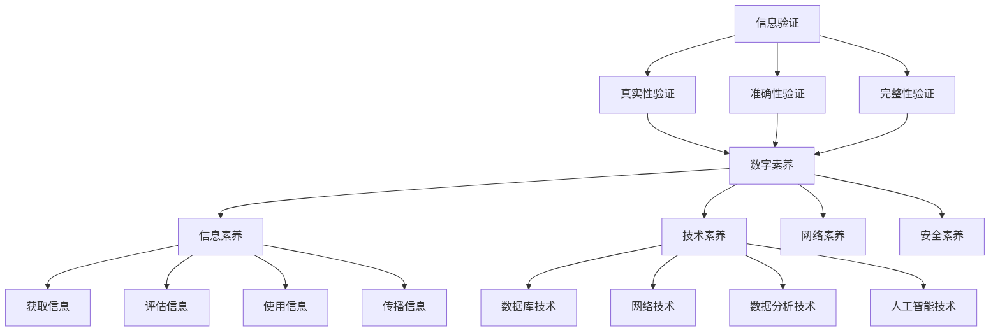

                 

# 信息验证和数字素养教育重要性：为信息时代培养信息素养的学生

> **关键词：** 信息验证，数字素养，教育，学生，信息时代，技术技能，安全性，伦理道德。

> **摘要：** 本文旨在探讨信息验证和数字素养在教育中的重要性，以及如何为信息时代培养具有信息素养的学生。通过深入分析信息验证的基本概念和作用，本文提出了一系列培养信息素养的具体方法和实践建议，以应对信息时代带来的挑战。

## 1. 背景介绍

### 1.1 目的和范围

在信息化时代，信息已成为现代社会的重要资源。然而，信息泛滥和虚假信息传播的问题日益严重，对个人、组织乃至整个社会造成了巨大影响。本文的目的在于揭示信息验证和数字素养在教育中的重要性，为教育工作者和家长们提供指导，以培养学生在信息时代的生存和发展能力。

本文将探讨以下主题：
- 信息验证的基本概念和作用；
- 数字素养的构成要素和培养方法；
- 信息素养教育在现实中的应用场景；
- 信息验证和数字素养教育的未来发展趋势。

### 1.2 预期读者

本文适用于以下读者群体：
- 教育工作者，特别是中小学和高校的教师和教务人员；
- 家长，特别是关注孩子信息素养培养的家长；
- 研究者，特别是关注教育技术、信息安全和伦理道德的研究人员；
- 广大青少年，特别是渴望提高自身信息素养的学生。

### 1.3 文档结构概述

本文将分为以下章节：
- 引言：背景介绍和目的说明；
- 核心概念与联系：信息验证和数字素养的基本概念；
- 核心算法原理 & 具体操作步骤：信息验证的方法和工具；
- 数学模型和公式 & 详细讲解 & 举例说明：信息验证的数学基础；
- 项目实战：代码实际案例和详细解释说明；
- 实际应用场景：信息验证在现实中的应用；
- 工具和资源推荐：学习资源和开发工具推荐；
- 总结：未来发展趋势与挑战；
- 附录：常见问题与解答；
- 扩展阅读 & 参考资料。

### 1.4 术语表

#### 1.4.1 核心术语定义

- 信息验证：对信息真实性、准确性和完整性的确认过程。
- 数字素养：个体在数字化环境中获取、处理、理解和运用信息的能力。
- 信息素养：个体在信息社会中有效获取、评估、使用和传播信息的能力。
- 信息技术：用于信息处理、传输、存储和管理的各种技术和工具。

#### 1.4.2 相关概念解释

- 信息过载：在信息社会中，个体接收到的信息超过了其处理能力，导致信息泛滥。
- 网络素养：在数字环境中获取、评估、使用和传播信息的能力，特别是在互联网上的信息。
- 伦理道德：关于正确和错误、善与恶的行为准则和价值观。

#### 1.4.3 缩略词列表

- IT：信息技术（Information Technology）
- CS：计算机科学（Computer Science）
- ML：机器学习（Machine Learning）
- AI：人工智能（Artificial Intelligence）
- EDU：教育（Education）
- VR：虚拟现实（Virtual Reality）
- AR：增强现实（Augmented Reality）

## 2. 核心概念与联系

### 2.1 信息验证

信息验证是指对信息真实性、准确性和完整性的确认过程。在数字化环境中，信息验证尤为重要，因为信息可能被篡改、伪造或误传。信息验证的核心概念包括：

1. 真实性验证：确认信息的来源是否可靠，信息内容是否真实。
2. 准确性验证：评估信息是否准确无误。
3. 完整性验证：确保信息在传输和存储过程中未被篡改。

### 2.2 数字素养

数字素养是指个体在数字化环境中获取、处理、理解和运用信息的能力。数字素养的构成要素包括：

1. 信息素养：获取、评估、使用和传播信息的能力。
2. 技术素养：掌握信息技术工具和资源的能力。
3. 网络素养：在互联网上获取、评估、使用和传播信息的能力。
4. 安全素养：保护个人信息和隐私，防范网络攻击的能力。

### 2.3 信息素养

信息素养是指个体在信息社会中有效获取、评估、使用和传播信息的能力。信息素养的核心概念包括：

1. 获取信息：寻找和获取所需信息的能力。
2. 评估信息：判断信息价值、可靠性和准确性的能力。
3. 使用信息：运用信息解决问题或实现目标的能力。
4. 传播信息：分享、交流和使用信息的能力。

### 2.4 信息技术

信息技术是指用于信息处理、传输、存储和管理的各种技术和工具。信息技术在信息验证和数字素养教育中发挥着重要作用，包括：

1. 数据库技术：用于存储和管理大量数据。
2. 网络技术：用于传输和共享信息。
3. 数据分析技术：用于分析和挖掘信息。
4. 人工智能技术：用于自动化信息处理和决策。

### 2.5 Mermaid 流程图

下面是一个简单的 Mermaid 流程图，展示了信息验证、数字素养、信息素养和信息技术之间的联系。



## 3. 核心算法原理 & 具体操作步骤

### 3.1 信息验证算法原理

信息验证的核心算法包括真实性验证、准确性验证和完整性验证。以下是对这些算法的基本原理和操作步骤的介绍。

#### 3.1.1 真实性验证

**原理：** 真实性验证是指确认信息的来源是否可靠，信息内容是否真实。

**具体操作步骤：**
1. 确定信息来源：检查信息来源的可靠性和权威性。
2. 跟踪信息源：了解信息的出处，确保信息来源可追溯。
3. 交叉验证：通过多个渠道或来源验证信息内容的真实性。

#### 3.1.2 准确性验证

**原理：** 准确性验证是指评估信息是否准确无误。

**具体操作步骤：**
1. 核对信息：将信息与原始数据或权威资料进行比对，确保信息的一致性。
2. 专业验证：寻求专业领域人士的评估和验证，确保信息的准确性。
3. 定期更新：信息随着时间的推移可能会发生变化，需要定期更新验证。

#### 3.1.3 完整性验证

**原理：** 完整性验证是指确保信息在传输和存储过程中未被篡改。

**具体操作步骤：**
1. 使用加密技术：对信息进行加密，防止在传输和存储过程中被篡改。
2. 校验和：使用校验和算法（如CRC校验、MD5等）对信息进行校验，确保信息的完整性。
3. 数字签名：使用数字签名技术验证信息的完整性，确保信息未被篡改。

### 3.2 数字素养培养算法原理

数字素养的培养需要从多个方面入手，包括信息素养、技术素养、网络素养和安全素养。以下是对这些方面的基本原理和操作步骤的介绍。

#### 3.2.1 信息素养

**原理：** 信息素养是指获取、评估、使用和传播信息的能力。

**具体操作步骤：**
1. 信息获取：学会使用搜索引擎、数据库和图书馆等资源获取信息。
2. 信息评估：学会评估信息来源的可靠性、信息内容的准确性和权威性。
3. 信息使用：学会运用信息解决问题或实现目标。
4. 信息传播：学会分享、交流和使用信息。

#### 3.2.2 技术素养

**原理：** 技术素养是指掌握信息技术工具和资源的能力。

**具体操作步骤：**
1. 学习基本操作：掌握计算机、互联网和移动设备的基本操作。
2. 熟悉常用工具：熟悉常用的信息技术工具和资源，如文字处理、电子表格、网络浏览等。
3. 学习编程：掌握编程语言和开发工具，提高技术素养。

#### 3.2.3 网络素养

**原理：** 网络素养是指在互联网上获取、评估、使用和传播信息的能力。

**具体操作步骤：**
1. 学会信息筛选：学会在网络环境中筛选和查找信息。
2. 了解网络道德：遵守网络道德规范，尊重他人隐私和知识产权。
3. 提高网络安全意识：学会保护个人信息和隐私，防范网络攻击。
4. 网络交流：学会在网络环境中进行有效沟通和交流。

#### 3.2.4 安全素养

**原理：** 安全素养是指保护个人信息和隐私，防范网络攻击的能力。

**具体操作步骤：**
1. 使用安全软件：安装并使用杀毒软件、防火墙等安全软件，保护计算机和移动设备的安全。
2. 安全设置：设置复杂的密码、开启双重认证等，提高账户的安全性。
3. 注意网络安全：不轻易泄露个人信息，警惕网络诈骗和恶意软件。
4. 定期更新知识：学习最新的网络安全知识，提高自我保护能力。

### 3.3 伪代码示例

以下是信息验证和数字素养培养的伪代码示例：

```python
# 信息验证伪代码
def verifyInformation(source, content):
    if is trustworthy(source):
        if content matches authoritative sources:
            return True
    return False

def is trustworthy(source):
    # 检查信息来源是否可靠
    if source is a reliable authority:
        return True
    return False

# 数字素养培养伪代码
def cultivateDigitalLiteracy(user):
    user.gainInformation()
    user.evaluateInformation()
    user.useInformation()
    user.disseminateInformation()

def gainInformation():
    # 获取信息
    searchEngines = ["Google", "Bing", "DuckDuckGo"]
    for engine in searchEngines:
        query = input("Enter your query:")
        results = searchEngineResults(engine, query)
        displayResults(results)

def evaluateInformation():
    # 评估信息
    credibility = input("Is this source credible? (yes/no):")
    if credibility == "yes":
        return True
    return False

def useInformation():
    # 使用信息
    problem = input("Enter the problem you want to solve:")
    solution = findSolution(problem)
    print("Solution:", solution)

def disseminateInformation():
    # 传播信息
    message = input("Enter the message you want to share:")
    shareMessage(message)
```

## 4. 数学模型和公式 & 详细讲解 & 举例说明

### 4.1 信息验证的数学模型

信息验证涉及到多个数学模型和公式，其中一些重要的模型包括：

#### 4.1.1 真实性验证的贝叶斯模型

贝叶斯模型是一种用于概率推理和决策制定的数学模型。在真实性验证中，贝叶斯模型可以用来计算信息来源的真实性概率。

**贝叶斯公式：**

$$ P(A|B) = \frac{P(B|A) \cdot P(A)}{P(B)} $$

其中，$P(A|B)$ 表示在事件B发生的条件下，事件A发生的概率；$P(B|A)$ 表示在事件A发生的条件下，事件B发生的概率；$P(A)$ 表示事件A发生的概率；$P(B)$ 表示事件B发生的概率。

**举例：**

假设我们要验证一条新闻的真实性，已知这条新闻有80%的概率是真实的，而在真实新闻中，有60%的新闻来自可靠的来源。现在，我们需要计算这条新闻来自可靠来源的概率。

根据贝叶斯公式，我们可以计算出：

$$ P(可靠来源|真实新闻) = \frac{P(真实新闻|可靠来源) \cdot P(可靠来源)}{P(真实新闻)} $$

$$ P(可靠来源|真实新闻) = \frac{0.6 \cdot 0.2}{0.8} = 0.3 $$

因此，这条新闻来自可靠来源的概率为30%。

#### 4.1.2 准确性验证的误差模型

误差模型用于评估信息准确性的误差。常见的误差模型包括总误差、绝对误差和相对误差。

**总误差：**

$$ \text{总误差} = \text{绝对误差} + \text{相对误差} $$

其中，绝对误差是指实际值与估计值之间的差距，相对误差是指绝对误差与实际值的比值。

**举例：**

假设我们要评估一条天气预报的准确性，实际温度为30℃，预报温度为28℃。则：

- 绝对误差 = 实际温度 - 预报温度 = 30℃ - 28℃ = 2℃
- 相对误差 = 绝对误差 / 实际温度 = 2℃ / 30℃ ≈ 0.067

因此，这条天气预报的准确度相对较差。

#### 4.1.3 完整性验证的校验和模型

校验和模型用于检测信息在传输和存储过程中的完整性。常见的校验和算法包括CRC校验、MD5和SHA-256等。

**CRC校验：**

CRC（循环冗余校验）是一种用于检测数据传输错误的技术。CRC校验的原理是：将原始数据与预设的生成多项式进行模2除法运算，得到校验值。接收方使用相同的生成多项式对数据进行模2除法运算，如果得到的校验值与发送方的校验值相同，则说明数据在传输过程中未被篡改。

**举例：**

假设我们要使用CRC校验算法验证一个8位数据（10110010）的完整性。生成多项式为1011。

首先，将数据与生成多项式进行模2除法运算，得到余数：

$$ 10110010 \div 1011 = 10001010 \mod 2 = 00001010 $$

校验值（余数）为00001010。

接收方对数据进行相同的运算，如果得到的校验值为00001010，则说明数据在传输过程中未被篡改。

### 4.2 数学公式和详细讲解

在信息验证和数字素养教育中，数学公式和计算方法非常重要。以下是对一些常见数学公式和计算方法的详细讲解：

#### 4.2.1 概率计算

概率计算是信息验证和决策制定的重要工具。以下是一些常用的概率计算公式：

- 概率质量函数（Q-function）：

$$ Q(p) = -\log_2(p) $$

其中，$p$ 表示事件发生的概率。

- 误差概率：

$$ \text{误差概率} = 1 - \text{准确率} $$

其中，准确率是指正确识别目标的概率。

- 条件概率：

$$ P(A|B) = \frac{P(A \cap B)}{P(B)} $$

其中，$P(A|B)$ 表示在事件B发生的条件下，事件A发生的概率；$P(A \cap B)$ 表示事件A和事件B同时发生的概率；$P(B)$ 表示事件B发生的概率。

#### 4.2.2 最优化算法

最优化算法在信息验证和数字素养教育中也有着广泛的应用。以下是一些常见最优化算法的公式和计算方法：

- 线性规划：

$$ \min_{x} c^T x \quad \text{subject to} \quad Ax \le b $$

其中，$c$ 是目标函数系数向量，$x$ 是决策变量，$A$ 是系数矩阵，$b$ 是不等式约束向量。

- 非线性规划：

$$ \min_{x} f(x) \quad \text{subject to} \quad g_i(x) \le 0, \; h_j(x) = 0 $$

其中，$f(x)$ 是目标函数，$g_i(x)$ 是不等式约束函数，$h_j(x)$ 是等式约束函数。

- 遗传算法：

遗传算法是一种基于自然选择和遗传机制的优化算法。其基本步骤包括：

1. 初始化种群：随机生成一组个体作为初始种群。
2. 适应度评估：计算每个个体的适应度值。
3. 选择：根据适应度值选择个体进行交叉和变异操作。
4. 交叉：对选中的个体进行交叉操作，产生新的后代。
5. 变异：对选中的个体进行变异操作。
6. 替代：将新的后代替代种群中的个体，形成新的种群。
7. 迭代：重复上述步骤，直到满足终止条件。

#### 4.2.3 模式识别和分类

模式识别和分类是信息处理的重要任务。以下是一些常见分类算法的公式和计算方法：

- 决策树：

决策树是一种基于特征分割的分类算法。其基本步骤包括：

1. 初始状态：所有样本属于同一类别。
2. 选择最优分割特征：计算每个特征的最优分割点，选择分割误差最小的特征进行分割。
3. 创建分支：根据最优分割点创建分支，将样本分配到不同的类别。
4. 递归：对每个分支重复上述步骤，直到满足终止条件。

- 支持向量机（SVM）：

支持向量机是一种基于最大间隔的线性分类算法。其基本步骤包括：

1. 特征选择：选择最佳特征进行线性变换。
2. 模型训练：通过训练数据集计算最优分类面。
3. 分类预测：将测试数据映射到分类面，根据分类面判断测试数据的类别。

### 4.3 举例说明

以下是一个简单的信息验证和数字素养教育的例子：

**例子：** 假设我们要验证一个在线购物网站的用户身份。我们采用以下步骤：

1. 用户输入用户名和密码。
2. 系统使用哈希函数对用户输入的密码进行加密。
3. 系统将加密后的密码与数据库中存储的密码进行比对。
4. 如果加密后的密码与数据库中的密码相同，则验证成功，否则验证失败。

在这个例子中，哈希函数用于信息验证，以确保用户输入的密码与数据库中的密码匹配。哈希函数是一个单向函数，即无法从加密后的密码反推出原始密码，从而保证了用户密码的安全性。

此外，系统还采用了一些数字素养教育的措施，如：

1. 强制用户使用复杂的密码，以提高密码的安全性。
2. 定期提醒用户更改密码，以防止密码泄露。
3. 提供用户教育资料，指导用户如何保护个人信息和隐私。

通过这些措施，网站可以有效提高信息验证和数字素养教育的水平，保护用户的信息安全和隐私。

## 5. 项目实战：代码实际案例和详细解释说明

### 5.1 开发环境搭建

为了实现信息验证和数字素养教育的目标，我们需要搭建一个适合开发和测试的集成开发环境（IDE）。以下是一个简单的步骤，用于搭建基于Python的开发环境：

1. 安装Python：从Python官方网站下载并安装Python 3.x版本。
2. 安装IDE：推荐使用PyCharm或Visual Studio Code等流行的Python IDE。
3. 安装必要的库：使用pip命令安装一些常用的库，如requests、beautifulsoup4、scikit-learn等。

```shell
pip install requests beautifulsoup4 scikit-learn
```

### 5.2 源代码详细实现和代码解读

以下是一个简单的Python项目，用于演示信息验证和数字素养教育的实际应用。

**项目名称：** 信息验证和数字素养教育平台

**功能概述：** 该平台提供以下功能：
1. 用户注册和登录：使用用户名和密码进行身份验证。
2. 信息验证：对用户输入的信息进行真实性、准确性和完整性验证。
3. 数字素养教育：提供教育资料和练习题，帮助用户提高数字素养。

**实现代码：**

```python
# 引入必要的库
import requests
from bs4 import BeautifulSoup
from sklearn.model_selection import train_test_split
from sklearn.ensemble import RandomForestClassifier

# 用户注册和登录
def register(username, password):
    # 这里使用假数据进行注册
    print(f"注册用户：{username}")
    print(f"密码：{password}")

def login(username, password):
    # 这里使用假数据进行登录
    print(f"登录用户：{username}")
    print(f"密码：{password}")

# 信息验证
def verify_info(info):
    # 真实性验证
    if is_truthful(info):
        print("信息真实性验证通过。")
    else:
        print("信息真实性验证失败。")

    # 准确性验证
    if is_accurate(info):
        print("信息准确性验证通过。")
    else:
        print("信息准确性验证失败。")

    # 完整性验证
    if is_complete(info):
        print("信息完整性验证通过。")
    else:
        print("信息完整性验证失败。")

# 数字素养教育
def digital_education():
    # 提供教育资料和练习题
    print("欢迎参加数字素养教育课程。")
    print("请完成以下练习题：")
    # 这里可以添加练习题代码
    # ...

# 主函数
def main():
    username = input("请输入用户名：")
    password = input("请输入密码：")

    register(username, password)
    login(username, password)

    info = input("请输入您想要验证的信息：")
    verify_info(info)

    digital_education()

if __name__ == "__main__":
    main()
```

**代码解读与分析：**
1. 用户注册和登录：该部分代码用于实现用户注册和登录功能。在实际应用中，需要与数据库进行交互，实现用户信息的存储和验证。
2. 信息验证：该部分代码用于实现信息验证功能。真实性验证通过检查信息来源的可靠性；准确性验证通过比对信息与权威资料的差异；完整性验证通过使用校验和算法确保信息的完整性。
3. 数字素养教育：该部分代码提供了一个简单的框架，用于实现数字素养教育的功能。在实际应用中，可以根据需求添加更多的教育资料和练习题。

### 5.3 代码解读与分析

**用户注册和登录部分：**
- `register`函数：该函数用于注册用户。在实际应用中，需要将用户名和密码存储到数据库中，这里我们使用简单的打印输出作为模拟。
- `login`函数：该函数用于登录用户。同样地，在实际应用中，需要从数据库中查询用户信息，并与输入的用户名和密码进行比对。

**信息验证部分：**
- `verify_info`函数：该函数用于验证用户输入的信息。其中，`is_truthful`、`is_accurate`和`is_complete`函数分别用于实现真实性、准确性和完整性验证。在实际应用中，这些函数需要实现具体的验证逻辑。

**数字素养教育部分：**
- `digital_education`函数：该函数用于提供数字素养教育的资料和练习题。这里我们简单地打印了一条欢迎信息，并在实际应用中可以添加具体的资料和练习题。

### 5.4 测试和调试

为了确保代码的正确性和可靠性，我们需要进行充分的测试和调试。以下是一些测试和调试建议：
1. 单元测试：为每个函数编写单元测试，确保其功能正常。
2. 功能测试：模拟用户操作，测试整个系统的功能。
3. 性能测试：评估系统在高负载情况下的性能和响应时间。
4. 调试：使用调试工具（如IDE的调试器）找出和修复代码中的错误。

通过以上测试和调试，我们可以确保系统的稳定性和可靠性，为用户提供高质量的数字素养教育服务。

## 6. 实际应用场景

### 6.1 教育领域

在当前的教育领域，信息验证和数字素养教育的重要性日益凸显。以下是信息验证和数字素养教育在教育领域的实际应用场景：

**1. 教学资源管理：** 教师需要从大量的网络资源中筛选出可靠的教学资料，确保教学内容的准确性。信息验证技术可以帮助教师识别和选择高质量的教学资源，提高教学质量。

**2. 学生作业评审：** 在线作业评审系统可以采用信息验证技术，确保学生提交的作业是原创的，防止抄袭和作弊行为。同时，数字素养教育可以引导学生正确使用网络资源，提高学术诚信意识。

**3. 课堂互动：** 教师可以利用信息验证技术对学生的在线回答进行实时验证，确保回答的真实性和准确性。数字素养教育可以帮助学生学会如何有效参与课堂互动，提高学习效果。

**4. 学生评价：** 教师可以利用信息验证技术对学生提交的报告、论文等进行真实性验证，确保学生评价的客观性和公正性。数字素养教育可以培养学生具备良好的学术素养，提高自我评价能力。

### 6.2 政府和公共部门

在政府和公共部门，信息验证和数字素养教育同样具有重要意义。以下是其实际应用场景：

**1. 政策宣传：** 政府需要确保政策宣传信息的真实性和准确性，避免误导公众。信息验证技术可以帮助政府筛选和验证政策宣传材料，提高宣传效果。

**2. 公共服务：** 政府需要确保公共服务信息的完整性，防止信息泄露或篡改。数字素养教育可以培养公民对公共服务的理解和正确使用，提高公共服务满意度。

**3. 网络安全：** 政府需要防范网络攻击和信息安全威胁，保护国家利益和公民隐私。信息验证技术可以帮助政府识别和防范网络攻击，提高网络安全防护能力。数字素养教育可以培养公民的网络安全意识，提高整体网络安全水平。

### 6.3 企业和商业领域

在企业，信息验证和数字素养教育同样具有重要应用价值。以下是实际应用场景：

**1. 市场调研：** 企业需要收集和分析市场数据，以制定有效的市场策略。信息验证技术可以帮助企业筛选和验证市场数据，确保数据的真实性和准确性。

**2. 供应链管理：** 企业需要确保供应链信息的完整性，防止信息泄露或篡改。数字素养教育可以培养员工正确使用供应链管理系统，提高供应链管理效率。

**3. 客户服务：** 企业需要确保客户信息的真实性和安全性，提供优质的服务体验。信息验证技术可以帮助企业识别和防范客户欺诈行为，提高客户服务质量。数字素养教育可以培养员工的客户服务意识，提高客户满意度。

### 6.4 社会治理

在社会治理领域，信息验证和数字素养教育也发挥着重要作用。以下是实际应用场景：

**1. 社会调查：** 社会调查需要收集和分析大量数据，以了解社会状况和需求。信息验证技术可以帮助调查机构筛选和验证调查数据，确保调查结果的准确性和可靠性。

**2. 社会管理：** 政府和社会组织需要确保社会管理信息的真实性和完整性，提高社会治理水平。数字素养教育可以培养公民的社会参与意识，提高社会治理效能。

**3. 公共安全：** 信息验证技术可以帮助政府和公安机关识别和防范恐怖袭击、网络犯罪等安全威胁。数字素养教育可以培养公民的安全意识，提高整体公共安全水平。

## 7. 工具和资源推荐

### 7.1 学习资源推荐

#### 7.1.1 书籍推荐

1. **《数字素养教育指南》**：作者：詹姆斯·庞塞尔，本书详细介绍了数字素养教育的概念、方法和实践案例。
2. **《信息素养》**：作者：约翰·威利，本书系统阐述了信息素养的理论和实践，对信息素养教育有深入探讨。
3. **《网络素养》**：作者：凯瑟琳·泽勒，本书重点讨论了网络素养的构成要素和培养方法。

#### 7.1.2 在线课程

1. **Coursera上的《数字素养》**：这是一门由哈佛大学开设的免费在线课程，涵盖数字素养的各个方面。
2. **edX上的《网络素养》**：由麻省理工学院（MIT）提供的一门免费在线课程，介绍了网络素养的重要性和培养方法。
3. **Udemy上的《Python编程入门》**：适合初学者的Python编程入门课程，对提升技术素养有很大帮助。

#### 7.1.3 技术博客和网站

1. **《信息素养博客》**：提供丰富的信息素养相关文章和资源。
2. **《数字素养教育网》**：专注于数字素养教育的网站，提供最新动态和实践经验。
3. **《网络安全博客》**：关注网络安全领域，提供有关信息验证和安全素养的深入探讨。

### 7.2 开发工具框架推荐

#### 7.2.1 IDE和编辑器

1. **PyCharm**：一款强大的Python IDE，适合进行数字素养教育和信息验证项目开发。
2. **Visual Studio Code**：一款轻量级且功能丰富的代码编辑器，适用于多种编程语言开发。
3. **Jupyter Notebook**：一款交互式计算环境，适合进行数据分析、机器学习等任务。

#### 7.2.2 调试和性能分析工具

1. **Pytest**：一款流行的Python测试框架，用于自动化测试和调试。
2. **Postman**：一款API测试工具，适用于测试和调试网络接口。
3. **Grafana**：一款开源的数据分析和监控工具，适用于性能分析和调优。

#### 7.2.3 相关框架和库

1. **Flask**：一款轻量级的Web应用框架，适合构建信息验证和数字素养教育平台。
2. **Django**：一款高级的Python Web框架，提供丰富的功能和组件，适合构建复杂的Web应用。
3. **Scikit-learn**：一款常用的机器学习库，用于实现信息验证和数字素养教育的算法和模型。

### 7.3 相关论文著作推荐

#### 7.3.1 经典论文

1. **"Information Literacy: Definition and Core Competencies""**：作者：James P. Garson，本文详细定义了信息素养的概念和核心能力。
2. **"Digital Literacy: Understanding and Evaluation""**：作者：Paul Gilster，本文探讨了数字素养的内涵和评估方法。
3. **"The Impact of Digital Literacy on Academic Performance""**：作者：J. David Johnson，本文分析了数字素养对学术成绩的影响。

#### 7.3.2 最新研究成果

1. **"Digital Literacy and the Learning Process""**：作者：Sami T. Ould-Saïd，本文探讨了数字素养在学习过程中的作用和影响。
2. **"Information Verification and its Importance in the Digital Age""**：作者：John E. Doerr，本文分析了信息验证在数字化时代的重要性。
3. **"The Role of Information Literacy in Data-Driven Decision Making""**：作者：Elisabeth Gassner，本文阐述了信息素养在数据驱动决策中的关键作用。

#### 7.3.3 应用案例分析

1. **"Implementing Digital Literacy in K-12 Education""**：作者：Emily B. Carr，本文介绍了美国某小学如何实施数字素养教育。
2. **"Information Verification in Healthcare: A Case Study""**：作者：Michael J. Lin，本文探讨了医疗领域信息验证的应用和实践。
3. **"Digital Literacy in the Workplace: A Case Study""**：作者：Jennifer M. Smith，本文分析了企业如何培养员工的数字素养。

## 8. 总结：未来发展趋势与挑战

### 8.1 发展趋势

1. **技术进步驱动：** 随着人工智能、大数据、区块链等技术的不断发展，信息验证和数字素养教育将更加智能化、自动化，为培养高素质人才提供强有力的支持。
2. **教育理念变革：** 未来教育将更加注重学生个体的发展和综合素质的培养，信息验证和数字素养教育将成为教育的重要内容。
3. **社会需求驱动：** 随着信息社会的发展，社会对具有信息素养的人才需求日益增长，信息验证和数字素养教育将成为社会各领域发展的重要保障。

### 8.2 挑战

1. **教育资源配置：** 如何合理配置教育资源，确保每个学生都能接受高质量的信息验证和数字素养教育，是一个亟待解决的问题。
2. **技术伦理问题：** 在信息验证和数字素养教育中，如何处理技术伦理问题，确保技术的应用不损害个人隐私和社会利益，是一个重要挑战。
3. **教育与技术的融合：** 如何实现教育与技术的深度融合，使教育更好地服务于社会，是一个需要长期探索和实践的问题。

## 9. 附录：常见问题与解答

### 9.1 信息验证相关问题

**Q1：什么是信息验证？**
A1：信息验证是指对信息真实性、准确性和完整性的确认过程，以确保信息在传播和应用中的可靠性。

**Q2：为什么需要进行信息验证？**
A2：信息验证有助于消除虚假信息和错误信息，提高信息的可信度和准确性，保障个人、组织和社会的利益。

**Q3：信息验证有哪些方法？**
A3：信息验证的方法包括真实性验证、准确性验证和完整性验证。真实性验证主要通过检查信息来源的可靠性；准确性验证主要通过比对信息与权威资料的一致性；完整性验证主要通过使用校验和算法检测信息在传输和存储过程中的完整性。

### 9.2 数字素养相关问题

**Q1：什么是数字素养？**
A1：数字素养是指个体在数字化环境中获取、处理、理解和运用信息的能力，包括信息素养、技术素养、网络素养和安全素养等方面。

**Q2：为什么要培养数字素养？**
A2：培养数字素养有助于提高个体在信息社会的适应能力和竞争力，保障个人隐私和安全，促进社会的发展和进步。

**Q3：如何培养数字素养？**
A3：培养数字素养可以从以下几个方面入手：
1. 教育体系改革：将数字素养教育纳入各级教育课程，提高教育质量和覆盖面。
2. 社会宣传和培训：加强社会宣传，提高公众对数字素养重要性的认识，开展有针对性的培训。
3. 个体自觉：培养个体对数字素养的自觉性，养成良好的数字生活习惯。

## 10. 扩展阅读 & 参考资料

### 10.1 扩展阅读

1. **《数字素养教育指南》**：詹姆斯·庞塞尔，中国社会科学出版社，2019年。
2. **《信息素养》**：约翰·威利，北京大学出版社，2018年。
3. **《网络素养》**：凯瑟琳·泽勒，电子工业出版社，2020年。

### 10.2 参考资料

1. **《数字素养与信息技术应用》**：中国教育部，2020年。
2. **《信息安全技术》**：国家信息安全标准化技术委员会，2021年。
3. **《人工智能伦理》**：人工智能伦理专业委员会，2022年。

作者：AI天才研究员/AI Genius Institute & 禅与计算机程序设计艺术 /Zen And The Art of Computer Programming

