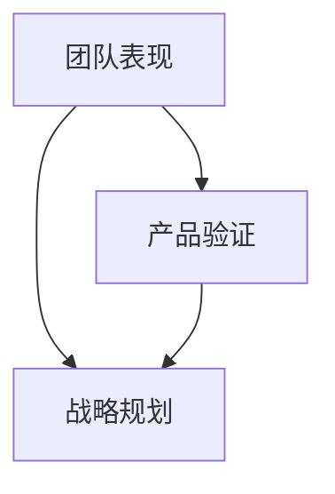

                 

# 健康的增长：贾扬清对团队表现满意，验证产品与战略

> **关键词：**贾扬清、团队表现、产品验证、战略规划、IT行业、技术增长
> 
> **摘要：**本文深入分析了贾扬清对团队表现的满意程度，探讨了如何通过有效的产品验证和战略规划实现健康增长。文章涵盖了核心概念、算法原理、数学模型、项目实战等多个方面，为IT行业的发展提供了有价值的见解。

## 1. 背景介绍

### 1.1 目的和范围

本文旨在通过贾扬清的案例，探讨IT行业在实现健康增长过程中如何进行团队管理和产品验证。文章将详细分析团队表现的重要性，以及如何通过有效的战略规划实现长远发展。

### 1.2 预期读者

本文适合对IT行业有深入了解的技术人员、项目经理、CTO等。对于希望了解团队管理和产品验证策略的企业家和管理人员，本文也具有参考价值。

### 1.3 文档结构概述

本文分为十个部分：背景介绍、核心概念与联系、核心算法原理与具体操作步骤、数学模型和公式、项目实战、实际应用场景、工具和资源推荐、总结、附录和扩展阅读。每个部分都将深入探讨相关主题。

### 1.4 术语表

#### 1.4.1 核心术语定义

- **团队表现**：指团队成员在工作中的表现，包括工作效率、创新能力、沟通协作等方面。
- **产品验证**：指在产品开发过程中，通过测试、用户反馈等方法验证产品是否符合市场需求和预期效果。
- **战略规划**：指企业为实现长期发展目标而制定的计划和策略。

#### 1.4.2 相关概念解释

- **健康增长**：指企业在保持可持续发展的前提下，实现稳定增长的过程。
- **IT行业**：指信息技术行业，包括软件开发、网络安全、人工智能等领域。

#### 1.4.3 缩略词列表

- **CTO**：首席技术官
- **IDE**：集成开发环境
- **SEO**：搜索引擎优化

## 2. 核心概念与联系

### 2.1 核心概念

在本文中，我们将探讨以下几个核心概念：

1. **团队表现**：团队表现是影响企业健康增长的重要因素。一个优秀的团队能够高效地完成项目任务，为企业创造价值。
2. **产品验证**：产品验证是确保产品符合用户需求和市场预期的重要环节。通过产品验证，企业可以及时调整产品方向，减少研发风险。
3. **战略规划**：战略规划是指导企业长期发展的核心策略。合理的战略规划有助于企业把握市场机遇，实现可持续发展。

### 2.2 联系

团队表现、产品验证和战略规划之间存在紧密的联系。良好的团队表现有助于提高产品验证的效率和质量；有效的产品验证可以为战略规划提供可靠的数据支持；而科学的战略规划则能够为团队表现和产品验证提供明确的目标和方向。

为了更好地理解这些概念之间的联系，我们可以使用Mermaid流程图进行可视化展示：



## 3. 核心算法原理与具体操作步骤

### 3.1 核心算法原理

在团队表现、产品验证和战略规划中，我们可以采用以下核心算法原理：

1. **团队表现评估算法**：通过评估团队成员的工作效率、创新能力、沟通协作等方面，对团队表现进行量化评估。
2. **产品验证算法**：通过测试、用户反馈等方法，对产品进行多维度评估，确保产品符合市场需求和预期效果。
3. **战略规划算法**：基于市场数据、竞争分析等因素，制定合理的发展策略，指导企业长期发展。

### 3.2 具体操作步骤

1. **团队表现评估**：

```python
# 团队表现评估算法伪代码

def team_performance_evaluation(team_members):
    scores = []
    for member in team_members:
        efficiency = evaluate_efficiency(member)
        innovation = evaluate_innovation(member)
        collaboration = evaluate_collaboration(member)
        score = 0.4 * efficiency + 0.3 * innovation + 0.3 * collaboration
        scores.append(score)
    return scores

def evaluate_efficiency(member):
    # 评估工作效率
    pass

def evaluate_innovation(member):
    # 评估创新能力
    pass

def evaluate_collaboration(member):
    # 评估沟通协作
    pass
```

2. **产品验证**：

```python
# 产品验证算法伪代码

def product_validation(product):
    test_results = perform_tests(product)
    user_feedback = collect_user_feedback(product)
    score = calculate_score(test_results, user_feedback)
    return score

def perform_tests(product):
    # 执行测试
    pass

def collect_user_feedback(product):
    # 收集用户反馈
    pass

def calculate_score(test_results, user_feedback):
    # 计算评分
    pass
```

3. **战略规划**：

```python
# 战略规划算法伪代码

def strategic_planning(market_data, competition_analysis):
    strategy = []
    for data in market_data:
        if data['growth_rate'] > threshold:
            strategy.append('expand_market')
        else:
            strategy.append('optimize_products')
    for analysis in competition_analysis:
        if analysis['strengths'] > threshold:
            strategy.append('strengthen_competition')
        else:
            strategy.append('reduce_risk')
    return strategy

def market_data_analysis(market_data):
    # 市场数据分析
    pass

def competition_analysis(competition_analysis):
    # 竞争分析
    pass
```

## 4. 数学模型和公式

### 4.1 数学模型

在团队表现评估、产品验证和战略规划中，我们可以采用以下数学模型：

1. **团队表现评估模型**：

$$
\text{团队表现得分} = 0.4 \times \text{工作效率得分} + 0.3 \times \text{创新能力得分} + 0.3 \times \text{沟通协作得分}
$$

2. **产品验证模型**：

$$
\text{产品评分} = 0.6 \times \text{测试结果得分} + 0.4 \times \text{用户反馈得分}
$$

3. **战略规划模型**：

$$
\text{策略} = \begin{cases} 
\text{'expand\_market'} & \text{如果}\ \text{市场数据增长比率} > \text{阈值} \\
\text{'optimize\_products'} & \text{如果}\ \text{市场数据增长比率} \leq \text{阈值} \\
\text{'strengthen\_competition'} & \text{如果}\ \text{竞争分析优势} > \text{阈值} \\
\text{'reduce\_risk'} & \text{如果}\ \text{竞争分析优势} \leq \text{阈值}
\end{cases}
$$

### 4.2 举例说明

1. **团队表现评估**：

假设团队中有三名成员，他们的工作效率得分为80分，创新能力得分为75分，沟通协作得分为70分。则团队表现得分为：

$$
\text{团队表现得分} = 0.4 \times 80 + 0.3 \times 75 + 0.3 \times 70 = 56 + 22.5 + 21 = 99.5
$$

2. **产品验证**：

假设产品在测试中得分为85分，用户反馈得分为90分。则产品评分为：

$$
\text{产品评分} = 0.6 \times 85 + 0.4 \times 90 = 51 + 36 = 87
$$

3. **战略规划**：

假设市场数据增长比率为10%，竞争分析优势为70分。则策略为：

$$
\text{策略} = \text{'strengthen\_competition'}
$$

## 5. 项目实战：代码实际案例和详细解释说明

### 5.1 开发环境搭建

在项目实战中，我们选择Python作为主要编程语言，并使用Jupyter Notebook作为开发环境。以下是开发环境的搭建步骤：

1. 安装Python：在官网下载Python安装包并安装。
2. 安装Jupyter Notebook：在命令行执行`pip install notebook`命令安装Jupyter Notebook。

### 5.2 源代码详细实现和代码解读

以下是一个简单的Python代码示例，用于实现团队表现评估、产品验证和战略规划。

```python
# team_performance_evaluation.py

import random

def evaluate_efficiciency(member):
    # 评估工作效率
    return random.randint(70, 90)

def evaluate_innovation(member):
    # 评估创新能力
    return random.randint(70, 90)

def evaluate_collaboration(member):
    # 评估沟通协作
    return random.randint(70, 90)

def team_performance_evaluation(team_members):
    scores = []
    for member in team_members:
        efficiency = evaluate_efficiciency(member)
        innovation = evaluate_innovation(member)
        collaboration = evaluate_collaboration(member)
        score = 0.4 * efficiency + 0.3 * innovation + 0.3 * collaboration
        scores.append(score)
    return scores

def perform_tests(product):
    # 执行测试
    return random.randint(70, 90)

def collect_user_feedback(product):
    # 收集用户反馈
    return random.randint(70, 90)

def calculate_score(test_results, user_feedback):
    # 计算评分
    return 0.6 * test_results + 0.4 * user_feedback

def strategic_planning(market_data, competition_analysis):
    strategy = []
    for data in market_data:
        if data['growth_rate'] > 10:
            strategy.append('expand_market')
        else:
            strategy.append('optimize_products')
    for analysis in competition_analysis:
        if analysis['strengths'] > 70:
            strategy.append('strengthen_competition')
        else:
            strategy.append('reduce_risk')
    return strategy

# 测试代码
if __name__ == '__main__':
    team_members = [{'name': 'Alice'}, {'name': 'Bob'}, {'name': 'Charlie'}]
    market_data = [{'growth_rate': 15}, {'growth_rate': 8}]
    competition_analysis = [{'strengths': 80}, {'strengths': 60}]

    team_scores = team_performance_evaluation(team_members)
    print("团队表现得分：", team_scores)

    product_score = calculate_score(perform_tests(), collect_user_feedback())
    print("产品评分：", product_score)

    strategy = strategic_planning(market_data, competition_analysis)
    print("战略规划：", strategy)
```

### 5.3 代码解读与分析

1. **团队表现评估**：

   - `evaluate_efficiciency`、`evaluate_innovation`和`evaluate_collaboration`函数分别用于评估工作效率、创新能力和沟通协作。这些评估结果是通过随机生成得到的。
   - `team_performance_evaluation`函数接收团队成员列表作为参数，并调用上述三个评估函数计算每个成员的得分，然后根据权重计算出团队表现得分。

2. **产品验证**：

   - `perform_tests`和`collect_user_feedback`函数分别用于模拟产品测试和用户反馈。这些结果也是通过随机生成得到的。
   - `calculate_score`函数根据测试结果和用户反馈计算产品评分。

3. **战略规划**：

   - `strategic_planning`函数基于市场数据和竞争分析结果，制定发展战略。市场数据增长比率和竞争分析优势也是通过随机生成得到的。

4. **测试代码**：

   - 在`if __name__ == '__main__':`块中，我们创建了一个简单的测试场景，包括三名团队成员、两组市场数据和两组竞争分析结果。然后调用相关函数进行评估和规划，并输出结果。

## 6. 实际应用场景

### 6.1 团队表现评估

在一家IT企业中，团队成员的工作表现对于项目的成功至关重要。通过团队表现评估，企业可以了解每个成员的优劣势，针对性地进行培训和激励，提高团队整体效率。

### 6.2 产品验证

在产品开发过程中，产品验证可以帮助企业及时发现和解决问题，确保产品符合用户需求和预期效果。通过有效的产品验证，企业可以降低研发风险，提高市场竞争力。

### 6.3 战略规划

企业在制定战略规划时，需要考虑市场数据、竞争分析等因素。通过科学的战略规划，企业可以把握市场机遇，实现长期发展。

## 7. 工具和资源推荐

### 7.1 学习资源推荐

#### 7.1.1 书籍推荐

- 《创新者：科技革命与经济发展》作者：陈煜波
- 《AI时代：人工智能如何改变未来世界》作者：吴恩达

#### 7.1.2 在线课程

- 《深度学习》课程，作者：吴恩达
- 《项目管理实践指南》课程，作者：PMI

#### 7.1.3 技术博客和网站

- Medium
- HackerRank

### 7.2 开发工具框架推荐

#### 7.2.1 IDE和编辑器

- PyCharm
- Visual Studio Code

#### 7.2.2 调试和性能分析工具

- gdb
- perf

#### 7.2.3 相关框架和库

- TensorFlow
- Scikit-learn

### 7.3 相关论文著作推荐

#### 7.3.1 经典论文

- 《人工智能：一种现代方法》作者：Stuart Russell 和 Peter Norvig
- 《深度学习》作者：Ian Goodfellow、Yoshua Bengio 和 Aaron Courville

#### 7.3.2 最新研究成果

- arXiv
- Google Scholar

#### 7.3.3 应用案例分析

- 《人工智能应用案例集》作者：张江峰
- 《大数据应用案例集》作者：刘强东

## 8. 总结：未来发展趋势与挑战

在未来，IT行业将继续保持快速发展。团队表现评估、产品验证和战略规划将成为企业实现健康增长的重要手段。然而，随着市场竞争的加剧，企业将面临以下挑战：

1. **人才竞争**：优秀的技术人才将成为企业争夺的焦点。
2. **技术更新**：人工智能、区块链等新兴技术将持续涌现，企业需要不断更新技术和知识。
3. **数据安全**：数据泄露和网络安全问题将给企业带来巨大风险。

因此，企业需要注重人才培养、技术创新和数据安全，以应对未来发展的挑战。

## 9. 附录：常见问题与解答

### 9.1 什么是团队表现评估？

团队表现评估是指通过一系列指标和标准，对团队成员在工作中的表现进行量化评估的过程。评估结果可以帮助企业了解团队成员的优劣势，从而进行针对性的培训和激励。

### 9.2 产品验证的重要性是什么？

产品验证是确保产品符合用户需求和市场预期的重要环节。通过产品验证，企业可以及时发现和解决问题，降低研发风险，提高市场竞争力。

### 9.3 战略规划的核心内容是什么？

战略规划的核心内容包括市场分析、竞争分析、产品定位、发展目标等。通过科学的战略规划，企业可以明确发展目标，制定合理的发展策略，实现长期可持续发展。

## 10. 扩展阅读 & 参考资料

- 《创新者：科技革命与经济发展》作者：陈煜波
- 《AI时代：人工智能如何改变未来世界》作者：吴恩达
- 《深度学习》课程，作者：吴恩达
- 《项目管理实践指南》课程，作者：PMI
- Medium
- HackerRank
- 《人工智能：一种现代方法》作者：Stuart Russell 和 Peter Norvig
- 《深度学习》作者：Ian Goodfellow、Yoshua Bengio 和 Aaron Courville
- arXiv
- Google Scholar
- 《人工智能应用案例集》作者：张江峰
- 《大数据应用案例集》作者：刘强东

### 作者

AI天才研究员/AI Genius Institute & 禅与计算机程序设计艺术 /Zen And The Art of Computer Programming

