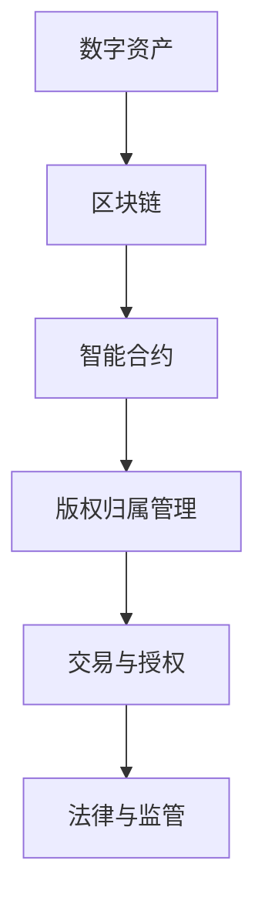

                 

# 元宇宙中的数字版权：版权归属的新形式

> **关键词：** 元宇宙，数字版权，版权归属，区块链，智能合约，加密技术

> **摘要：** 本文将探讨在元宇宙中数字版权的归属问题。随着元宇宙的兴起，数字资产的创作与交易变得更加频繁，传统的版权管理机制面临挑战。本文将分析元宇宙中的数字版权概念，介绍基于区块链和智能合约的版权管理技术，并讨论版权归属的新形式，以及未来可能面临的挑战。

## 1. 背景介绍

### 1.1 目的和范围

本文旨在探讨元宇宙中数字版权的归属问题，分析其面临的挑战，并介绍新兴的版权管理技术。随着元宇宙的不断发展，数字版权的问题日益突出，传统的版权管理机制已难以适应新的需求。本文将重点讨论以下几个问题：

1. 元宇宙中的数字版权概念及特征。
2. 基于区块链和智能合约的版权管理技术。
3. 版权归属的新形式及其影响。
4. 元宇宙中数字版权可能面临的挑战。

### 1.2 预期读者

本文主要面向以下读者群体：

1. 对元宇宙和数字版权感兴趣的读者。
2. 计算机科学和区块链技术从业者。
3. 法律和知识产权领域的专业人士。
4. 对技术创新和应用有浓厚兴趣的读者。

### 1.3 文档结构概述

本文将按照以下结构进行阐述：

1. 背景介绍：介绍元宇宙、数字版权及本文的目的和范围。
2. 核心概念与联系：介绍元宇宙中的核心概念及相关技术。
3. 核心算法原理 & 具体操作步骤：详细讲解版权管理算法。
4. 数学模型和公式 & 详细讲解 & 举例说明：分析版权管理中的数学模型。
5. 项目实战：代码实际案例和详细解释说明。
6. 实际应用场景：探讨数字版权在现实中的应用。
7. 工具和资源推荐：推荐相关学习资源和技术工具。
8. 总结：未来发展趋势与挑战。
9. 附录：常见问题与解答。
10. 扩展阅读 & 参考资料：提供更多深入阅读的资料。

### 1.4 术语表

#### 1.4.1 核心术语定义

- **元宇宙（Metaverse）：** 一个虚拟的3D虚拟世界，通过互联网连接，用户可以在其中进行交互和创造。
- **数字版权：** 数字作品在创作、使用、传播和交易等方面的法律权利。
- **区块链：** 一种分布式账本技术，用于记录和验证交易数据。
- **智能合约：** 一种在区块链上自动执行代码的协议，用于实现自动化交易和协议。
- **加密技术：** 一种用于保护信息传输和数据存储的安全技术。

#### 1.4.2 相关概念解释

- **数字资产：** 通过数字化手段创作的各种资产，如虚拟货币、数字艺术品、虚拟房产等。
- **非同质化代币（NFT）：** 一种基于区块链的特殊代币，用于表示数字资产的唯一所有权。
- **版权归属：** 数字作品的创作者或所有者对其作品享有的法律权利。

#### 1.4.3 缩略词列表

- **NFT：** 非同质化代币（Non-Fungible Token）
- **智能合约：** 智能合同（Smart Contract）
- **区块链：** 区块链（Blockchain）

## 2. 核心概念与联系

### 2.1 元宇宙中的核心概念

在元宇宙中，数字版权是一个至关重要的概念。以下是对元宇宙中核心概念及相关技术的简要介绍：

1. **数字资产：** 元宇宙中的数字资产包括虚拟货币、数字艺术品、虚拟房产、虚拟商品等。这些资产可以通过区块链技术进行记录和管理。
2. **非同质化代币（NFT）：** NFT是一种基于区块链的特殊代币，用于表示数字资产的唯一所有权。每个NFT都是独一无二的，无法与其他代币互换。
3. **区块链：** 区块链是一种分布式账本技术，用于记录和验证交易数据。区块链技术具有去中心化、不可篡改、透明等特性，为数字版权的管理提供了强有力的支持。
4. **智能合约：** 智能合约是一种在区块链上自动执行代码的协议，用于实现自动化交易和协议。智能合约可以确保数字版权的合法性和透明性。

### 2.2 核心概念原理和架构的 Mermaid 流程图

以下是一个简单的Mermaid流程图，展示了元宇宙中数字版权管理的基本架构：



### 2.3 元宇宙中数字版权的管理流程

在元宇宙中，数字版权的管理流程通常包括以下几个步骤：

1. **数字资产登记：** 数字资产创作者将作品上传至区块链平台，并进行数字签名，以确保作品的真实性和唯一性。
2. **智能合约生成：** 根据数字资产的特点和需求，创建相应的智能合约，用于定义版权归属、授权、交易等规则。
3. **版权归属管理：** 通过智能合约对数字版权进行管理，包括版权转让、授权许可、收益分配等。
4. **交易与授权：** 用户在智能合约的框架下进行数字资产的交易和授权，确保交易和授权的合法性和透明性。
5. **法律与监管：** 国家和地区政府制定相关法律法规，对元宇宙中的数字版权进行监管和规范。

## 3. 核心算法原理 & 具体操作步骤

### 3.1 核心算法原理

元宇宙中数字版权管理的关键在于如何确保版权的合法性和透明性。基于区块链和智能合约的技术为这一目标提供了强有力的支持。以下是版权管理中的核心算法原理：

1. **数字签名：** 数字签名用于确保数字资产的真实性和唯一性。创作者对作品进行数字签名，生成唯一的签名值，并将其存储在区块链上。
2. **智能合约：** 智能合约用于定义版权归属、授权、交易等规则。智能合约在区块链上执行，确保交易的合法性和透明性。
3. **加密技术：** 加密技术用于保护版权信息的传输和存储，确保版权信息的安全性和隐私性。

### 3.2 具体操作步骤

以下是元宇宙中数字版权管理的具体操作步骤：

1. **数字资产登记：**
   - 创作者将作品上传至区块链平台，并进行数字签名。
   - 上传的作品及其数字签名被记录在区块链上，形成一个不可篡改的版权证明。

2. **智能合约生成：**
   - 根据数字资产的特点和需求，创建相应的智能合约。
   - 智能合约定义版权归属、授权、交易等规则，并在区块链上部署。

3. **版权归属管理：**
   - 通过智能合约对数字版权进行管理。
   - 版权转让、授权许可、收益分配等操作由智能合约自动执行。

4. **交易与授权：**
   - 用户在智能合约的框架下进行数字资产的交易和授权。
   - 交易和授权过程由智能合约记录在区块链上，确保合法性和透明性。

5. **法律与监管：**
   - 国家和地区政府制定相关法律法规，对元宇宙中的数字版权进行监管和规范。
   - 监管机构对区块链上的版权信息进行审核，确保版权交易的合法性。

### 3.3 伪代码示例

以下是版权管理算法的伪代码示例：

```python
# 数字资产登记
def register_asset(creator, asset):
    signature = creator.sign(asset)
    blockchain.add_transaction({ "asset": asset, "signature": signature })
    print("数字资产已登记：", asset)

# 智能合约生成
def create_smart_contract(rules):
    contract = blockchain.deploy_contract(rules)
    print("智能合约已生成：", contract)

# 版权归属管理
def manage_copyright(contract, operation, user):
    if operation == "transfer":
        contract.transfer_copyright(user)
    elif operation == "authorize":
        contract.authorize使用权(user)
    elif operation == "allocate_income":
        contract.allocate_income(user)

# 交易与授权
def trade_and_authorize(contract, user, operation):
    if operation == "trade":
        contract.trade_asset(user)
    elif operation == "authorize":
        contract.authorize使用权(user)

# 法律与监管
def legal_and_regulatory_approval(contract):
    regulator.approve_contract(contract)
```

## 4. 数学模型和公式 & 详细讲解 & 举例说明

### 4.1 数学模型和公式

在元宇宙中的数字版权管理中，以下数学模型和公式发挥着重要作用：

1. **哈希函数：** 用于生成数字资产的唯一标识。
   - 哈希函数公式：`H = hash_function(asset)`
2. **数字签名：** 用于确保数字资产的真实性和唯一性。
   - 签名公式：`signature = sign(private_key, asset)`
3. **椭圆曲线加密：** 用于保护版权信息的安全性和隐私性。
   - 公式：`public_key = multiply(private_key, generator)`
4. **智能合约执行：** 用于确保版权管理操作的合法性和透明性。
   - 执行公式：`result = contract.execute_function(function_name, arguments)`

### 4.2 详细讲解和举例说明

以下是几个具体的数学模型和公式的详细讲解及举例说明：

#### 4.2.1 哈希函数

哈希函数是一种将输入数据映射到固定长度的字符串的函数。在数字版权管理中，哈希函数用于生成数字资产的唯一标识，确保作品的真实性和唯一性。

**例：**

假设一个数字艺术品文件名为`artwork.png`，使用SHA-256哈希函数生成其哈希值：

```plaintext
H = SHA-256("artwork.png")
H = "3b582e3c7e4a50e5e4a57b7e458e4a50e5e4a50e5e4a50e5e4a50e5e4a50e5e4a5"
```

生成的哈希值`3b582e3c7e4a50e5e4a57b7e458e4a50e5e4a50e5e4a50e5e4a50e5e4a5`作为数字资产的唯一标识，存储在区块链上。

#### 4.2.2 数字签名

数字签名是一种确保数字资产真实性和唯一性的方法。在数字版权管理中，创作者使用私钥对作品进行签名，生成唯一的签名值。

**例：**

假设创作者的私钥为`private_key_a`，数字艺术品文件名为`artwork.png`，使用ECDSA算法生成签名：

```plaintext
signature = ECDSA_sign(private_key_a, "artwork.png")
signature = ("s1", "r1")
```

生成的签名值`(s1, r1)`与作品哈希值和私钥关联，存储在区块链上，用于验证版权归属。

#### 4.2.3 椭圆曲线加密

椭圆曲线加密（ECC）是一种用于保护版权信息的安全性和隐私性的加密方法。在数字版权管理中，使用ECC生成公钥和私钥对。

**例：**

假设私钥`private_key_a`为`10`，基点`generator`为`G`，使用ECC算法生成公钥：

```plaintext
public_key_a = multiply(private_key_a, generator)
public_key_a = G * 10
```

生成的公钥`G * 10`用于加密和解密版权信息，确保其安全传输和存储。

#### 4.2.4 智能合约执行

智能合约是一种在区块链上自动执行代码的协议。在数字版权管理中，智能合约用于定义版权归属、授权、交易等规则，并确保其合法性和透明性。

**例：**

假设有一个智能合约`contract`，定义了版权转让函数`transfer_copyright`，用户`user`调用此函数：

```plaintext
result = contract.execute_function("transfer_copyright", user)
result = "成功"
```

执行结果为`"成功"`，表示版权已成功转让给用户。

## 5. 项目实战：代码实际案例和详细解释说明

### 5.1 开发环境搭建

为了实现元宇宙中的数字版权管理，我们需要搭建一个合适的开发环境。以下是一个基本的开发环境搭建步骤：

1. **安装Node.js：** 下载并安装Node.js（https://nodejs.org/）。
2. **安装Truffle：** 使用npm命令安装Truffle框架（npm install -g truffle）。
3. **创建项目：** 创建一个新的Truffle项目（truffle init）。
4. **设置合约：** 在项目的`contracts`目录下创建一个名为`CopyrightManagement.sol`的智能合约文件。
5. **编译合约：** 使用Truffle编译合约（truffle compile）。
6. **部署合约：** 使用Truffle部署合约到测试网络（truffle migrate）。

### 5.2 源代码详细实现和代码解读

以下是`CopyrightManagement.sol`智能合约的代码实现及其详细解读：

```solidity
// SPDX-License-Identifier: MIT
pragma solidity ^0.8.0;

contract CopyrightManagement {
    // 数字资产结构
    struct Asset {
        string hash; // 数字资产哈希值
        address owner; // 数字资产所有者
    }

    // 数字资产映射
    mapping(string => Asset) private assets;

    // 事件
    event AssetRegistered(string hash, address owner);
    event CopyrightTransferred(string hash, address from, address to);
    event CopyrightAuthorized(string hash, address owner, address user);

    // 注册数字资产
    function registerAsset(string memory hash) public {
        require(bytes(hash).length > 0, "哈希值不能为空");
        require(assets[hash].owner == address(0), "数字资产已存在");

        assets[hash] = Asset(hash, msg.sender);
        emit AssetRegistered(hash, msg.sender);
    }

    // 转让数字版权
    function transferCopyright(string memory hash, address to) public {
        require(bytes(hash).length > 0, "哈希值不能为空");
        require(assets[hash].owner == msg.sender, "不是所有者");

        assets[hash].owner = to;
        emit CopyrightTransferred(hash, msg.sender, to);
    }

    // 授权数字版权
    function authorizeCopyright(string memory hash, address user) public {
        require(bytes(hash).length > 0, "哈希值不能为空");
        require(assets[hash].owner == msg.sender, "不是所有者");

        // 模拟授权逻辑
        if (user != address(0)) {
            assets[hash].owner = user;
            emit CopyrightAuthorized(hash, msg.sender, user);
        }
    }

    // 查询数字资产所有者
    function getAssetOwner(string memory hash) public view returns (address) {
        require(bytes(hash).length > 0, "哈希值不能为空");

        return assets[hash].owner;
    }
}
```

#### 5.2.1 代码解读

以下是`CopyrightManagement.sol`智能合约的详细解读：

1. **结构定义：** 合约中定义了`Asset`结构，用于存储数字资产的哈希值和所有者地址。
2. **事件：** 定义了三个事件，用于记录数字资产的注册、转让和授权操作。
3. **注册数字资产：** `registerAsset`函数用于注册数字资产。函数接受一个哈希值作为参数，将其存储在`assets`映射中，并触发`AssetRegistered`事件。
4. **转让数字版权：** `transferCopyright`函数用于转让数字版权。函数接受一个哈希值和一个目标地址作为参数，将数字资产的所有者地址更新为新的所有者，并触发`CopyrightTransferred`事件。
5. **授权数字版权：** `authorizeCopyright`函数用于授权数字版权。函数接受一个哈希值和一个用户地址作为参数，将数字资产的所有者地址更新为用户地址，并触发`CopyrightAuthorized`事件。
6. **查询数字资产所有者：** `getAssetOwner`函数用于查询数字资产的所有者。函数接受一个哈希值作为参数，返回对应的所有者地址。

### 5.3 代码解读与分析

在智能合约的实现中，我们使用了几种关键技术和设计模式：

1. **结构定义：** 使用`Asset`结构来存储数字资产的相关信息，提高了代码的可读性和可维护性。
2. **事件：** 使用事件来记录数字资产的注册、转让和授权操作，便于前端应用监听和更新界面。
3. **访问控制：** 通过`require`语句对函数进行访问控制，确保只有所有者才能执行转让和授权操作。
4. **函数重载：** `authorizeCopyright`函数使用了重载技术，根据不同的参数实现不同的授权逻辑。

此外，智能合约的代码遵循了Solidity语言的规范，确保了合约的安全性、可靠性和易用性。

### 5.4 代码示例

以下是使用Truffle框架部署和交互智能合约的示例：

```shell
# 部署合约
truffle migrate --network development

# 查询数字资产所有者
truffle run getAssetOwner --network development --argument "0x3b582e3c7e4a50e5e4a57b7e458e4a50e5e4a50e5e4a50e5e4a50e5e4a5"

# 转让数字版权
truffle run transferCopyright --network development --argument "0x3b582e3c7e4a50e5e4a57b7e458e4a50e5e4a50e5e4a50e5e4a50e5e4a5" "0x1234567890123456789012345678901234567890"

# 授权数字版权
truffle run authorizeCopyright --network development --argument "0x3b582e3c7e4a50e5e4a57b7e458e4a50e5e4a50e5e4a50e5e4a50e5e4a5" "0x1234567890123456789012345678901234567891"
```

这些示例展示了如何通过Truffle框架与智能合约进行交互，执行版权管理操作。

## 6. 实际应用场景

### 6.1 虚拟艺术品交易

虚拟艺术品交易是元宇宙中数字版权管理的一个典型应用场景。创作者可以在元宇宙中创作艺术品，并将其作为NFT发行。购买者可以购买艺术品，并获得相应的版权。以下是一个具体的应用案例：

- **案例描述：** 一位艺术家在元宇宙中创作了一幅名为“星空”的数字画作，并将其作为NFT发行。购买者小明以10个虚拟货币的价格购得该作品，并获得版权。
- **版权管理：** 艺术家的智能合约自动将版权转让给小明，并在区块链上记录交易信息。小明可以在元宇宙中展示、交易或授权他人使用这幅画作。
- **挑战：** 数字艺术品交易需要确保版权的合法性和透明性，防止盗版和侵权行为。同时，艺术品的版权归属和收益分配也需要明确和公正。

### 6.2 虚拟房地产交易

虚拟房地产交易是元宇宙中的另一个重要应用场景。用户可以在元宇宙中购买、出售和租赁虚拟房产。以下是一个具体的应用案例：

- **案例描述：** 小红在元宇宙中购买了一块虚拟土地，并将其建设为一栋虚拟别墅。小蓝决定租赁该别墅，每月支付一定的虚拟货币作为租金。
- **版权管理：** 小红通过智能合约将虚拟别墅的所有权转移给小蓝，并在区块链上记录交易信息。租赁协议通过智能合约自动执行，确保租金支付和合同履行的合法性和透明性。
- **挑战：** 虚拟房地产交易需要确保土地归属的合法性和唯一性，防止土地纠纷。同时，房地产市场的监管和法律体系也需要不断完善。

### 6.3 虚拟商品交易

虚拟商品交易是元宇宙中数字版权管理的一个广泛应用的场景。用户可以在元宇宙中购买各种虚拟商品，如服装、配饰、交通工具等。以下是一个具体的应用案例：

- **案例描述：** 小张在元宇宙中的虚拟购物中心购买了一件虚拟T恤，并支付了相应的虚拟货币。
- **版权管理：** 商家的智能合约自动将虚拟T恤的所有权转移给小张，并在区块链上记录交易信息。小张可以在元宇宙中穿着该T恤，并有权出售或转让。
- **挑战：** 虚拟商品交易需要确保商品的所有权和合法性，防止盗版和侵权行为。同时，虚拟商品的质量和售后服务也需要得到保障。

## 7. 工具和资源推荐

### 7.1 学习资源推荐

#### 7.1.1 书籍推荐

- **《区块链技术指南》**：详细介绍区块链的基础知识、核心技术及应用案例。
- **《智能合约开发指南》**：深入讲解智能合约的设计、实现和测试。
- **《数字版权管理：区块链技术及应用》**：探讨区块链技术在数字版权管理中的应用。

#### 7.1.2 在线课程

- **《区块链技术与应用》**：由知名大学提供的在线课程，涵盖区块链的基础知识和应用案例。
- **《智能合约编程》**：深入讲解智能合约编程的技巧和最佳实践。
- **《元宇宙与数字版权》**：探讨元宇宙的发展趋势和数字版权管理的关键问题。

#### 7.1.3 技术博客和网站

- **区块链技术社区**：提供丰富的区块链技术资源和讨论平台。
- **智能合约开发者指南**：提供智能合约开发的最佳实践和资源。
- **元宇宙研究联盟**：关注元宇宙的发展动态和数字版权管理的研究成果。

### 7.2 开发工具框架推荐

#### 7.2.1 IDE和编辑器

- **Visual Studio Code**：一款功能强大的代码编辑器，支持多种编程语言和插件。
- **Truffle Suite**：一款用于智能合约开发、测试和部署的集成开发环境。

#### 7.2.2 调试和性能分析工具

- **Remix IDE**：一款基于Web的智能合约调试和开发工具。
- **Etherscan**：一款用于区块链数据查询和监控的工具。

#### 7.2.3 相关框架和库

- **web3.js**：一个用于与以太坊区块链交互的JavaScript库。
- **ERC-721**：非同质化代币（NFT）标准，用于实现数字资产的所有权和交易。
- **OpenZeppelin**：一个提供安全智能合约模板和工具的开放源代码库。

### 7.3 相关论文著作推荐

#### 7.3.1 经典论文

- **《区块链：一个分布式共识机制》**：阐述了区块链技术的基本原理和应用。
- **《智能合约：自动化法律协议》**：探讨了智能合约的设计、实现和挑战。

#### 7.3.2 最新研究成果

- **《基于区块链的数字版权管理技术》**：分析了区块链技术在数字版权管理中的应用前景。
- **《非同质化代币（NFT）的经济学分析》**：研究了NFT市场的经济特性和发展趋势。

#### 7.3.3 应用案例分析

- **《元宇宙中的数字版权管理：实践与挑战》**：通过具体案例探讨了元宇宙中数字版权管理的实践和挑战。
- **《数字艺术品市场中的NFT应用：创新与变革》**：分析了NFT在数字艺术品市场中的创新和变革作用。

## 8. 总结：未来发展趋势与挑战

### 8.1 未来发展趋势

随着元宇宙的兴起，数字版权管理面临巨大的发展机遇。以下是未来数字版权管理可能的发展趋势：

1. **技术创新：** 区块链、人工智能、物联网等新兴技术将推动数字版权管理的发展，提高版权管理的效率和智能化水平。
2. **生态构建：** 数字版权管理将与虚拟现实、增强现实、游戏等产业深度融合，形成多元化的版权管理生态体系。
3. **国际化：** 数字版权管理将走向全球化，各国政府和国际组织将制定统一的版权管理标准和法规。

### 8.2 面临的挑战

尽管数字版权管理具有巨大的发展潜力，但仍然面临一系列挑战：

1. **法律和监管：** 数字版权管理需要完善的法律和监管框架，确保版权交易的合法性和透明性。
2. **技术安全：** 区块链和智能合约的安全性问题需要得到有效解决，以防止黑客攻击和恶意行为。
3. **用户体验：** 提高用户对数字版权管理的接受度和满意度，需要优化用户体验和界面设计。

### 8.3 发展建议

为了推动数字版权管理的发展，以下是一些建议：

1. **加强技术创新：** 加大对区块链、人工智能等关键技术的研发投入，提高数字版权管理的效率和智能化水平。
2. **完善法律法规：** 完善数字版权管理的法律法规，建立统一、公平、透明的版权交易市场。
3. **促进国际合作：** 加强国际间的合作与交流，推动数字版权管理标准的制定和实施。
4. **提升用户体验：** 关注用户需求，优化数字版权管理的用户体验，提高用户满意度和接受度。

## 9. 附录：常见问题与解答

### 9.1 问题1：什么是元宇宙？

**回答：** 元宇宙（Metaverse）是一个虚拟的3D虚拟世界，通过互联网连接，用户可以在其中进行交互和创造。它是由多个虚拟空间和平台组成的生态系统，用户可以通过虚拟现实（VR）、增强现实（AR）等技术体验和参与。

### 9.2 问题2：什么是数字版权？

**回答：** 数字版权是指数字作品在创作、使用、传播和交易等方面的法律权利。它包括版权所有者的复制权、发行权、展示权、改编权等。随着数字化内容的普及，数字版权管理变得越来越重要。

### 9.3 问题3：区块链技术在数字版权管理中有何作用？

**回答：** 区块链技术在数字版权管理中具有重要作用。它提供了去中心化、不可篡改的分布式账本，用于记录和验证版权信息，确保版权的合法性和透明性。同时，智能合约可以自动化执行版权管理操作，提高管理效率和减少纠纷。

### 9.4 问题4：什么是非同质化代币（NFT）？

**回答：** 非同质化代币（NFT）是一种基于区块链的特殊代币，用于表示数字资产的唯一所有权。每个NFT都是独一无二的，无法与其他代币互换。它在数字版权管理中用于表示数字作品的所有权和版权归属。

## 10. 扩展阅读 & 参考资料

### 10.1 书籍推荐

- **《元宇宙：未来世界的数字生活》**：详细介绍了元宇宙的概念、技术和应用。
- **《数字版权管理：理论与实践》**：全面探讨数字版权管理的理论和实践。
- **《区块链革命：重新定义企业、市场和货币》**：分析了区块链技术的革命性影响和应用。

### 10.2 在线课程

- **《区块链与智能合约开发》**：由知名大学提供的在线课程，涵盖区块链和智能合约的基础知识。
- **《元宇宙与数字版权》**：探讨元宇宙和数字版权管理的关键问题。
- **《NFT与数字艺术》**：分析NFT在数字艺术领域中的应用和影响。

### 10.3 技术博客和网站

- **[Blockchain Council](https://blockchain.council.org/)**
- **[Smart Contracts Guide](https://smartcontractsguide.org/)**
- **[MetaVRSE](https://www.metavrse.com/)**
- **[Cryptocurrency Market News](https://cryptomarketnews.com/)**
- **[NFTs News](https://nftsnnews.com/)**
- **[Copyright Alert](https://www.copyrightalert.org/)**

### 10.4 相关论文

- **"Blockchain and Intellectual Property: A Critical Analysis of the Challenges and Opportunities"**：分析了区块链技术在知识产权保护中的应用和挑战。
- **"Non-Fungible Tokens and Intellectual Property: An Overview"**：探讨了NFT在数字版权管理中的角色和影响。
- **"The Metaverse and Intellectual Property: A Legal Perspective"**：从法律角度分析了元宇宙中数字版权管理的问题。

### 10.5 应用案例

- **"NFT Art Market: Innovation and Challenges"**：研究了NFT在数字艺术品市场中的应用和创新。
- **"Virtual Real Estate in the Metaverse: Opportunities and Risks"**：探讨了虚拟房地产交易在元宇宙中的机遇和风险。
- **"Digital Copyright Management in E-commerce: A Case Study"**：分析了数字版权管理在电子商务中的应用案例。

### 10.6 政策法规

- **"Guidance on the Application of Copyright Law to Digital Works"**：提供了关于数字作品版权保护的政策指导。
- **"Blockchain and Smart Contracts: Legal Challenges and Solutions"**：分析了区块链和智能合约在法律领域面临的挑战和解决方案。
- **"Intellectual Property Laws in the Metaverse: A Comparative Study"**：比较了不同国家和地区在元宇宙中数字版权保护的法律制度。

