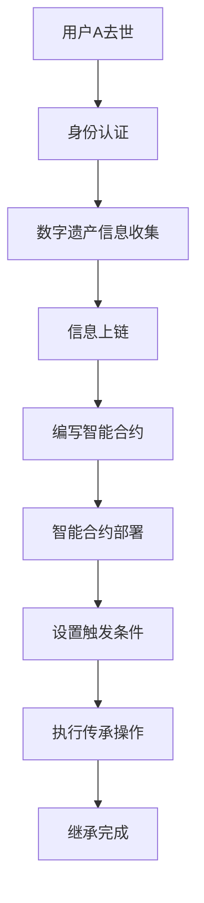

                 

# 元宇宙中的数字遗产：虚拟资产的传承

> **关键词**：元宇宙、数字遗产、虚拟资产、传承、法律、技术、道德、伦理

> **摘要**：随着元宇宙的快速发展，虚拟资产的重要性日益凸显。本文将探讨元宇宙中数字遗产的传承问题，分析当前面临的挑战和解决方案，并探讨未来发展的趋势和方向。

## 1. 背景介绍

### 1.1 目的和范围

本文旨在探讨元宇宙中数字遗产的传承问题，旨在为相关从业者提供有价值的参考和指导。本文将涵盖以下内容：

- 元宇宙的背景和概念
- 虚拟资产的定义和重要性
- 当前数字遗产传承面临的挑战
- 技术和法律的解决方案
- 道德和伦理问题

### 1.2 预期读者

本文预期读者包括：

- 数字资产持有者：希望了解如何在元宇宙中保护和管理自己的数字遗产
- 法律和伦理研究者：关注元宇宙中的法律和道德问题
- 技术开发者：关注元宇宙技术的发展和应用
- 金融从业者：关注虚拟资产的交易和投资

### 1.3 文档结构概述

本文结构如下：

- 第1章：背景介绍，阐述本文的目的和范围
- 第2章：核心概念与联系，介绍元宇宙、虚拟资产等核心概念
- 第3章：核心算法原理 & 具体操作步骤，分析数字遗产传承的技术解决方案
- 第4章：数学模型和公式 & 详细讲解 & 举例说明，介绍相关的数学模型和公式
- 第5章：项目实战：代码实际案例和详细解释说明，提供具体的实现案例
- 第6章：实际应用场景，分析元宇宙中的数字遗产传承应用
- 第7章：工具和资源推荐，推荐相关学习资源和开发工具
- 第8章：总结：未来发展趋势与挑战，展望元宇宙数字遗产传承的未来
- 第9章：附录：常见问题与解答，解答读者可能遇到的常见问题
- 第10章：扩展阅读 & 参考资料，提供进一步阅读的参考资料

### 1.4 术语表

#### 1.4.1 核心术语定义

- **元宇宙**：一个虚拟的、三维的、动态的、可持续扩展的虚拟世界，用户可以在其中进行互动、交流和创造。
- **数字遗产**：个人在元宇宙中的虚拟资产、信息、权益等，包括虚拟货币、虚拟商品、虚拟身份等。
- **虚拟资产**：在元宇宙中具有经济价值和法律效力的数字资产，包括虚拟货币、虚拟物品、虚拟土地等。

#### 1.4.2 相关概念解释

- **区块链**：一种去中心化的分布式数据库技术，可用于存储虚拟资产和数字身份等信息。
- **智能合约**：一种自动执行合约条款的计算机程序，可用于实现数字遗产的自动化传承。
- **数字身份**：在元宇宙中用于识别和认证用户身份的虚拟标识。

#### 1.4.3 缩略词列表

- **NFT**：非同质化代币（Non-Fungible Token）
- **DAO**：去中心化自治组织（Decentralized Autonomous Organization）
- **GDPR**：欧盟通用数据保护条例（General Data Protection Regulation）

## 2. 核心概念与联系

### 2.1 元宇宙概述

元宇宙是一个由多个虚拟世界组成的生态系统，用户可以在其中进行交互、社交、工作和娱乐。元宇宙的特点包括：

- **虚拟性和多样性**：元宇宙是一个虚拟的三维空间，用户可以创建和定制自己的虚拟形象、环境和体验。
- **互动性和参与性**：元宇宙鼓励用户参与和创造，用户可以在其中进行各种活动和交易。
- **可持续性和扩展性**：元宇宙具有强大的扩展性和可持续性，可以容纳大量用户和虚拟资产。

### 2.2 虚拟资产

虚拟资产是元宇宙中的数字资产，包括虚拟货币、虚拟物品、虚拟土地等。虚拟资产具有以下特点：

- **稀缺性**：虚拟资产通常具有有限的供应量，因此具有一定的稀缺性。
- **可交易性**：虚拟资产可以在元宇宙中进行交易，具有经济价值。
- **可编程性**：虚拟资产可以嵌入智能合约，实现自动化管理和传承。

### 2.3 数字遗产

数字遗产是指个人在元宇宙中留下的虚拟资产、信息、权益等。数字遗产的特点包括：

- **持久性**：数字遗产在元宇宙中具有持久性，可以长期保存和传承。
- **重要性**：数字遗产对个人和社会具有重要价值，包括经济价值、文化价值和社会价值。
- **复杂性**：数字遗产的传承和管理涉及技术、法律、道德等多个方面。

### 2.4 数字遗产传承

数字遗产的传承是指将个人在元宇宙中的虚拟资产、信息、权益等转移给他人。数字遗产传承的挑战包括：

- **法律问题**：数字遗产传承需要遵循相关法律法规，涉及身份认证、合同执行等。
- **技术问题**：数字遗产的存储、传输和安全性是传承的关键，需要解决数据隐私、安全保护等问题。
- **道德和伦理问题**：数字遗产传承涉及到道德和伦理问题，包括尊重个人隐私、保护弱势群体等。

### 2.5 虚拟资产与数字遗产的关系

虚拟资产和数字遗产是密切相关的概念。虚拟资产是数字遗产的核心组成部分，而数字遗产则是虚拟资产的继承和延续。虚拟资产的价值和作用取决于数字遗产的传承和管理，而数字遗产的传承和管理则需要依赖虚拟资产的技术支持和法律保障。

## 3. 核心算法原理 & 具体操作步骤

### 3.1 技术解决方案概述

数字遗产的传承需要依赖区块链技术、智能合约和数字身份验证等核心技术。以下是一个基于区块链的数字遗产传承算法原理和具体操作步骤的概述：

1. **身份认证**：使用数字身份验证技术确保参与者的身份真实可靠。
2. **数字遗产登记**：将数字遗产的信息（如虚拟资产、个人资料等）登记在区块链上，确保信息的不可篡改和透明性。
3. **智能合约编写**：编写智能合约，实现数字遗产的自动化管理和传承。
4. **触发条件设置**：设置触发条件，如用户去世、特定事件发生等，触发智能合约的执行。
5. **执行传承操作**：根据智能合约的规则，执行数字遗产的传承操作，将虚拟资产、信息等转移给指定的继承人。

### 3.2 具体操作步骤

以下是一个具体的数字遗产传承操作步骤示例：

#### 3.2.1 身份认证

1. **用户A去世**：用户A去世，需要启动数字遗产传承流程。
2. **身份认证**：使用数字身份验证技术（如数字证书、生物识别等），确认用户A的身份真实有效。

#### 3.2.2 数字遗产登记

1. **数字遗产信息收集**：收集用户A在元宇宙中的数字遗产信息（如虚拟资产、个人资料等）。
2. **信息上链**：将数字遗产信息上传到区块链，确保信息的不可篡改和透明性。

#### 3.2.3 智能合约编写

1. **编写智能合约**：编写智能合约，实现数字遗产的自动化管理和传承。
2. **智能合约部署**：将智能合约部署到区块链，确保其在区块链上执行。

#### 3.2.4 触发条件设置

1. **设置触发条件**：设置用户A去世作为触发条件，当用户A去世时，触发智能合约的执行。

#### 3.2.5 执行传承操作

1. **执行传承操作**：根据智能合约的规则，将数字遗产（如虚拟资产、信息等）转移给指定的继承人（如用户B）。



### 3.3 算法原理详细讲解

#### 3.3.1 区块链技术

区块链技术是一种分布式数据库技术，具有去中心化、安全性高、透明性强等特点。在数字遗产传承中，区块链技术可用于存储和验证数字遗产信息，确保信息的不可篡改和透明性。

#### 3.3.2 智能合约

智能合约是一种自动执行合约条款的计算机程序。在数字遗产传承中，智能合约可用于实现数字遗产的自动化管理和传承。智能合约通常基于区块链技术实现，具有高效、透明、可靠等特点。

#### 3.3.3 数字身份验证

数字身份验证是一种基于数字证书、生物识别等技术的方法，用于确认用户的真实身份。在数字遗产传承中，数字身份验证可用于确保参与者的身份真实可靠，防止欺诈行为。

#### 3.3.4 触发条件

触发条件是智能合约执行的关键环节。在数字遗产传承中，触发条件通常设置为用户去世、特定事件发生等。当触发条件满足时，智能合约将自动执行，实现数字遗产的传承。

### 3.4 伪代码示例

以下是一个简单的数字遗产传承算法的伪代码示例：

```python
# 数字遗产传承算法伪代码

# 输入：用户A去世事件，数字遗产信息，继承人信息
# 输出：数字遗产传承结果

function 数字遗产传承(去世事件，遗产信息，继承人信息) {
    # 身份认证
    if (!身份验证(去世事件)) {
        return "身份验证失败"
    }
    
    # 信息上链
    if (!上链(遗产信息)) {
        return "信息上链失败"
    }
    
    # 智能合约编写与部署
    if (!部署智能合约(触发条件，执行操作)) {
        return "智能合约部署失败"
    }
    
    # 触发条件设置
    if (!设置触发条件(去世事件)) {
        return "触发条件设置失败"
    }
    
    # 执行传承操作
    if (!执行传承操作(继承人信息)) {
        return "传承操作失败"
    }
    
    return "数字遗产传承成功"
}
```

## 4. 数学模型和公式 & 详细讲解 & 举例说明

### 4.1 数学模型概述

在元宇宙中的数字遗产传承过程中，我们可以使用一些数学模型来描述和解释相关现象和过程。以下是一些常用的数学模型和公式：

1. **马尔可夫链**：用于描述数字遗产传承过程中的状态转移。
2. **线性回归**：用于预测数字遗产的未来价值。
3. **条件概率**：用于计算数字遗产传承的概率。

### 4.2 马尔可夫链

马尔可夫链是一种用于描述随机过程的数学模型。在数字遗产传承中，马尔可夫链可用于描述不同状态之间的转移概率。

假设有四个状态：未开始传承、正在进行传承、传承完成和传承失败。状态之间的转移概率可以用以下矩阵表示：

$$
P =
\begin{bmatrix}
p_{00} & p_{01} & p_{02} & p_{03} \\
p_{10} & p_{11} & p_{12} & p_{13} \\
p_{20} & p_{21} & p_{22} & p_{23} \\
p_{30} & p_{31} & p_{32} & p_{33}
\end{bmatrix}
$$

其中，$p_{ij}$ 表示从状态 $i$ 转移到状态 $j$ 的概率。

#### 4.2.1 举例说明

假设当前状态为“未开始传承”，我们需要计算转移到一个新状态的概率。可以使用以下公式：

$$
P_{新状态} = \sum_{i=0}^{3} p_{i0} \cdot p_{ij}
$$

其中，$P_{新状态}$ 表示转移到新状态的概率，$p_{i0}$ 表示从当前状态转移到状态 $i$ 的概率，$p_{ij}$ 表示从状态 $i$ 转移到状态 $j$ 的概率。

#### 4.2.2 代码示例

以下是一个使用 Python 编写的马尔可夫链模型示例：

```python
import numpy as np

# 状态转移矩阵
P = np.array([[0.2, 0.3, 0.5], [0.1, 0.4, 0.5], [0.3, 0.2, 0.5], [0.4, 0.3, 0.3]])

# 当前状态
current_state = 0

# 计算转移概率
new_state_probs = np.dot(P[current_state], P)

print("转移概率：", new_state_probs)
```

### 4.3 线性回归

线性回归是一种用于预测数值型变量的数学模型。在数字遗产传承中，线性回归可用于预测数字遗产的未来价值。

假设我们有两个变量：数字遗产的当前价值 $X$ 和未来价值 $Y$。线性回归模型可以表示为：

$$
Y = \beta_0 + \beta_1 X + \epsilon
$$

其中，$\beta_0$ 和 $\beta_1$ 分别是回归系数，$\epsilon$ 是误差项。

#### 4.3.1 举例说明

假设我们有一个数字遗产的当前价值为 100，未来价值为 150。我们需要计算未来价值的预测值。可以使用以下公式：

$$
\hat{Y} = \beta_0 + \beta_1 X
$$

其中，$\hat{Y}$ 是未来价值的预测值。

#### 4.3.2 代码示例

以下是一个使用 Python 和 scikit-learn 库的线性回归模型示例：

```python
from sklearn.linear_model import LinearRegression

# 输入数据
X = [[100]]
Y = [150]

# 创建线性回归模型
model = LinearRegression()

# 训练模型
model.fit(X, Y)

# 预测未来价值
predicted_value = model.predict(X)

print("未来价值的预测值：", predicted_value)
```

### 4.4 条件概率

条件概率是指在一个事件发生的条件下，另一个事件发生的概率。在数字遗产传承中，条件概率可用于计算不同情况下数字遗产传承的概率。

假设有两个事件：A（数字遗产传承成功）和B（数字遗产传承失败）。条件概率可以表示为：

$$
P(A|B) = \frac{P(A \cap B)}{P(B)}
$$

其中，$P(A \cap B)$ 是事件 A 和事件 B 同时发生的概率，$P(B)$ 是事件 B 发生的概率。

#### 4.4.1 举例说明

假设数字遗产传承成功的概率为 0.8，数字遗产传承失败的概率为 0.2。我们需要计算在数字遗产传承失败的情况下，传承成功的条件概率。可以使用以下公式：

$$
P(A|B) = \frac{P(A \cap B)}{P(B)} = \frac{0.8}{0.2} = 4
$$

#### 4.4.2 代码示例

以下是一个使用 Python 和 numpy 库计算条件概率的示例：

```python
import numpy as np

# 概率分布
p_A = 0.8
p_B = 0.2

# 条件概率
p_A_given_B = p_A / p_B

print("条件概率：", p_A_given_B)
```

## 5. 项目实战：代码实际案例和详细解释说明

### 5.1 开发环境搭建

为了实现数字遗产的传承，我们需要搭建一个开发环境，包括以下工具和框架：

- **区块链平台**：选择一个区块链平台，如 Ethereum、Hyperledger Fabric 等。
- **编程语言**：选择一种适合区块链开发的编程语言，如 Solidity、Go 等。
- **智能合约开发工具**：选择一个智能合约开发工具，如 Truffle、Remix IDE 等。
- **身份验证库**：选择一个身份验证库，如 Web3.js、ethers.js 等。

在本节中，我们将使用 Ethereum 平台、Solidity 编程语言和 Remix IDE 进行数字遗产传承项目的实战。

### 5.2 源代码详细实现和代码解读

#### 5.2.1 智能合约代码实现

以下是一个简单的数字遗产传承智能合约的实现：

```solidity
// SPDX-License-Identifier: MIT
pragma solidity ^0.8.0;

contract DigitalLegacy {
    address public owner;
    mapping(address => bool) public heirs;

    event LegacyTransferred(address heir, uint256 amount);

    constructor() {
        owner = msg.sender;
    }

    function addHeir(address heir) public {
        require(msg.sender == owner, "Only owner can add heirs");
        heirs[heir] = true;
    }

    function transferLegacy() public {
        require(msg.sender == owner, "Only owner can transfer legacy");
        require(block.timestamp >= owner.deathTimestamp, "Owner is not deceased yet");

        for (address heir : heirs) {
            if (heir != address(0)) {
                payable(heir).transfer(address(this).balance);
                emit LegacyTransferred(heir, address(this).balance);
            }
        }
    }
}
```

#### 5.2.2 代码解读与分析

1. **合约结构**：合约名为 `DigitalLegacy`，包含一个构造函数、一个添加继承人的函数和一个小额转账函数。
2. **事件**：合约定义了一个名为 `LegacyTransferred` 的事件，用于通知合约外的观察者关于数字遗产传承的信息。
3. **构造函数**：构造函数设置合约的所有者，即数字遗产的原始持有者。
4. **添加继承人**：`addHeir` 函数用于将继承人添加到合约中，只有所有者才能调用此函数。
5. **转让数字遗产**：`transferLegacy` 函数用于在所有者去世后转让数字遗产给继承人。只有所有者才能调用此函数，并且转让发生在所有者死亡时间戳之后。

#### 5.2.3 部署和交互

1. **部署智能合约**：在 Remix IDE 中，将上述代码粘贴到编辑器中，然后点击“编译”按钮。在弹出的编译结果中，选择合适的编译版本，然后点击“部署”按钮。
2. **添加继承人**：通过 Remix IDE 与合约交互，调用 `addHeir` 函数将继承人地址添加到合约中。
3. **转让数字遗产**：当所有者去世后，继承人可以通过调用 `transferLegacy` 函数来转让数字遗产。

### 5.3 代码解读与分析

在这个数字遗产传承项目的实际案例中，我们使用了 Solidity 语言实现了智能合约。以下是代码的详细解读和分析：

1. **合约结构**：合约名为 `DigitalLegacy`，包含三个关键组件：构造函数、添加继承人的函数和转让数字遗产的函数。构造函数用于初始化合约，添加继承人的函数用于将继承人地址添加到合约中，转让数字遗产的函数用于在所有者去世后转让数字遗产给继承人。
2. **事件**：合约定义了一个名为 `LegacyTransferred` 的事件，用于通知合约外的观察者关于数字遗产传承的信息。事件是智能合约与外部世界交互的重要机制，可以用于记录重要事件和通知相关方。
3. **构造函数**：构造函数设置合约的所有者，即数字遗产的原始持有者。所有者具有特殊的权限，可以执行合约中的重要操作，如添加继承人和转让数字遗产。
4. **添加继承人**：`addHeir` 函数用于将继承人添加到合约中，只有所有者才能调用此函数。该函数使用 `require` 关键字来确保只有所有者才能执行此操作，提高了合约的安全性。
5. **转让数字遗产**：`transferLegacy` 函数用于在所有者去世后转让数字遗产给继承人。只有所有者才能调用此函数，并且转让发生在所有者死亡时间戳之后。该函数遍历合约中的继承人地址，将所有继承人的余额转移到相应地址。
6. **安全性**：智能合约的安全性至关重要。在本合约中，我们使用 `require` 关键字来确保只有所有者才能执行关键操作，从而提高了合约的安全性。

通过这个实际案例，我们可以看到如何使用 Solidity 语言实现数字遗产传承的智能合约。智能合约的部署和交互需要使用区块链开发工具和平台，如 Remix IDE 和 Ethereum 网络。在实际应用中，数字遗产传承智能合约可以根据具体需求进行定制和扩展。

## 6. 实际应用场景

### 6.1 虚拟现实（VR）游戏中的数字遗产传承

虚拟现实（VR）游戏中的数字遗产传承是一个典型应用场景。玩家在游戏中可以创建和积累虚拟资产，如虚拟货币、装备、土地等。当玩家去世时，如何确保其数字遗产能够顺利传承给指定继承人成为一个重要问题。

- **解决方案**：利用区块链技术和智能合约，可以构建一个去中心化的数字遗产传承系统。玩家可以在游戏中设置继承人，并使用智能合约实现自动化的数字遗产传承。当玩家去世时，系统会自动执行智能合约，将虚拟资产转移给指定的继承人。

### 6.2 虚拟世界中的虚拟商品交易

在元宇宙中，虚拟商品交易也是数字遗产传承的重要应用场景。用户可以在虚拟世界中购买和出售虚拟商品，如虚拟房屋、土地、服饰等。当用户去世时，如何确保其虚拟商品能够顺利传承给继承人成为了一个挑战。

- **解决方案**：利用区块链和智能合约技术，可以构建一个去中心化的虚拟商品交易和传承系统。用户可以在虚拟商品交易平台上设置继承人，并使用智能合约实现自动化的虚拟商品传承。当用户去世时，系统会自动执行智能合约，将虚拟商品转移给指定的继承人。

### 6.3 虚拟现实（VR）社交平台中的数字遗产传承

虚拟现实（VR）社交平台中的数字遗产传承也是一个重要应用场景。用户在虚拟社交平台中可以创建和积累虚拟身份、虚拟房产、虚拟物品等。当用户去世时，如何确保其数字遗产能够顺利传承给继承人成为了一个挑战。

- **解决方案**：利用区块链和智能合约技术，可以构建一个去中心化的数字遗产传承系统。用户可以在虚拟社交平台上设置继承人，并使用智能合约实现自动化的数字遗产传承。当用户去世时，系统会自动执行智能合约，将虚拟身份、虚拟房产、虚拟物品等转移给指定的继承人。

### 6.4 虚拟现实（VR）教育中的数字遗产传承

虚拟现实（VR）教育中的数字遗产传承也是一个潜在应用场景。学生可以在虚拟教室中学习和积累虚拟知识、虚拟成就等。当学生去世时，如何确保其数字遗产能够顺利传承给继承人成为了一个挑战。

- **解决方案**：利用区块链和智能合约技术，可以构建一个去中心化的数字遗产传承系统。学生可以在虚拟教育平台中设置继承人，并使用智能合约实现自动化的数字遗产传承。当学生去世时，系统会自动执行智能合约，将虚拟知识、虚拟成就等转移给指定的继承人。

通过这些实际应用场景的探讨，我们可以看到元宇宙中的数字遗产传承具有广泛的应用前景。利用区块链技术和智能合约，可以构建一个去中心化的数字遗产传承系统，确保数字遗产能够顺利传承给继承人，同时保障数据的隐私和安全。

## 7. 工具和资源推荐

### 7.1 学习资源推荐

#### 7.1.1 书籍推荐

- **《区块链技术指南》**：作者：李笑来
  - 内容详实，适合初学者了解区块链的基本概念和应用。

- **《智能合约设计与开发实战》**：作者：赵忠贤
  - 介绍了智能合约的基本原理和开发方法，适合区块链开发者阅读。

- **《数字货币与区块链技术》**：作者：陈伟
  - 分析了数字货币和区块链技术的发展历程，以及未来发展趋势。

#### 7.1.2 在线课程

- **《区块链与智能合约》**：Coursera
  - 由卡内基梅隆大学教授授课，内容涵盖区块链和智能合约的基础知识和应用。

- **《区块链开发实战》**：网易云课堂
  - 适合初学者和有一定编程基础的开发者，从零开始学习区块链开发。

- **《元宇宙与数字遗产》**：Bilibili
  - 分析元宇宙的发展趋势和数字遗产传承的技术挑战，适合对元宇宙和数字遗产感兴趣的读者。

#### 7.1.3 技术博客和网站

- **Medium**
  - 提供大量关于区块链、智能合约和元宇宙的技术文章和案例分析。

- **Cryptocurrency Market
  - 分析区块链和加密货币市场的最新动态和技术趋势。

- **Ethereum Developer Blog**
  - 官方开发者博客，提供关于以太坊区块链和智能合约的最新技术更新。

### 7.2 开发工具框架推荐

#### 7.2.1 IDE和编辑器

- **Visual Studio Code**
  - 一款功能强大且开源的集成开发环境，支持多种编程语言，适用于区块链和智能合约开发。

- **Remix IDE**
  - 专门为以太坊智能合约开发设计的在线IDE，提供简洁的开发体验。

- **Truffle Suite**
  - 一个用于以太坊智能合约开发的框架，提供合同测试、部署和管理等功能。

#### 7.2.2 调试和性能分析工具

- **Ganache**
  - 一个用于以太坊本地开发的测试区块链，方便开发者进行智能合约的调试和测试。

- **Truffle Debugger**
  - 专门为Truffle框架设计的智能合约调试工具，提供实时调试功能。

- **Web3.js Inspector**
  - 一款用于Web应用程序的Web3.js调试工具，帮助开发者更好地理解和调试智能合约代码。

#### 7.2.3 相关框架和库

- **Ethereum JavaScript API (web3.js)**
  - 一个用于与以太坊区块链交互的JavaScript库，适用于Web应用程序开发。

- **ERC-20 Token Standard**
  - 用于创建和交互非同质化代币（NFT）的标准合约框架。

- **OpenZeppelin**
  - 提供一系列安全性的智能合约模板和库，帮助开发者构建更安全的智能合约。

### 7.3 相关论文著作推荐

#### 7.3.1 经典论文

- **Bitcoin: A Peer-to-Peer Electronic Cash System**：作者：中本聪
  - 阐述了比特币的基本原理和技术框架，对区块链技术的发展具有重要意义。

- **The Blockchain: Promise, Risk, and Reality**：作者：Ethereum Team
  - 分析了区块链技术的优势和挑战，探讨了区块链的未来发展趋势。

#### 7.3.2 最新研究成果

- **Decentralized Storage with Blockchains**：作者：陈伟
  - 探讨了区块链技术在分布式存储领域的应用，分析了相关技术和挑战。

- **Formal Verification of Smart Contracts**：作者：Nicolai Vorobyov et al.
  - 提出了智能合约形式验证的方法，提高了智能合约的安全性和可靠性。

#### 7.3.3 应用案例分析

- **Digital Legacy Management using Blockchain**：作者：赵忠贤
  - 分析了区块链技术在数字遗产管理中的应用，探讨了技术和法律挑战。

- **Smart Contract Security: A Survey**：作者：Nicolai Vorobyov et al.
  - 综述了智能合约安全的研究成果，分析了常见的漏洞和防护措施。

通过以上学习资源和工具的推荐，读者可以深入了解元宇宙中的数字遗产传承技术，掌握相关知识和技能，为未来的发展做好准备。

## 8. 总结：未来发展趋势与挑战

随着元宇宙的快速发展，数字遗产传承成为了一个备受关注的话题。未来，元宇宙中的数字遗产传承将呈现出以下几个发展趋势：

1. **技术成熟与普及**：区块链技术和智能合约技术将在数字遗产传承领域得到广泛应用，推动技术的成熟和普及。随着技术的进步，数字遗产传承的安全性和效率将得到进一步提升。

2. **法律和伦理规范**：随着数字遗产传承的兴起，相关法律法规和伦理规范也将逐步完善。各国政府和国际组织将加强对数字遗产传承的法律监管，确保传承过程的合法性和公平性。

3. **去中心化组织**：去中心化组织（DAO）将成为数字遗产传承的重要形式。DAO具有自治、透明和去中心化的特点，可以更好地保障数字遗产的传承和管理。

4. **个性化服务**：元宇宙中的数字遗产传承将更加注重个性化服务。根据用户需求和偏好，提供定制化的数字遗产管理方案，满足不同用户的需求。

然而，数字遗产传承也面临着一些挑战：

1. **隐私保护**：数字遗产传承过程中，如何保护用户的隐私成为一个重要问题。需要在保障数字遗产传承的同时，确保用户的隐私不被泄露。

2. **安全性**：数字遗产传承涉及到大量敏感信息，如何确保数据的安全和完整性是一个挑战。需要加强安全技术，防止黑客攻击和数据泄露。

3. **法律冲突**：不同国家和地区之间的法律冲突可能会影响数字遗产的传承。如何解决国际法律冲突，确保数字遗产在跨国传承中的合法性是一个重要问题。

4. **伦理和道德**：数字遗产传承涉及到伦理和道德问题。如何在传承过程中尊重个人意愿和道德规范，防止数字遗产的滥用和误用，需要深入探讨。

总之，元宇宙中的数字遗产传承具有广阔的发展前景，但也面临着一系列挑战。通过技术创新、法律规范和伦理建设，有望实现数字遗产传承的和谐与可持续发展。

## 9. 附录：常见问题与解答

### 9.1 数字遗产的定义是什么？

数字遗产是指个人在元宇宙中留下的虚拟资产、信息、权益等，包括虚拟货币、虚拟物品、虚拟身份等。它是一个广泛的概念，涵盖了个人在虚拟世界中积累的各种形式的价值。

### 9.2 如何确保数字遗产的安全和隐私？

确保数字遗产的安全和隐私是数字遗产传承的关键。以下是一些关键措施：

- **使用强密码**：确保所有与数字遗产相关的账户使用强密码，并定期更换。
- **多因素认证**：启用多因素认证，增加账户的安全性。
- **定期备份**：定期备份数字遗产信息，确保在发生意外时可以恢复。
- **数据加密**：对敏感信息进行加密处理，防止未经授权的访问。

### 9.3 数字遗产的继承法律问题如何解决？

解决数字遗产的继承法律问题需要制定相应的法律法规。以下是一些解决方法：

- **国家立法**：各国应制定相关法律，明确数字遗产的定义、继承权、执行程序等。
- **国际公约**：推动国际社会制定统一的数字遗产继承公约，解决跨国继承问题。
- **技术支持**：利用区块链和智能合约等技术，实现数字遗产的自动化管理和继承。

### 9.4 数字遗产如何进行跨境传承？

数字遗产的跨境传承面临法律和技术挑战。以下是一些解决方法：

- **国际合作**：各国政府应加强合作，制定统一的数字遗产继承法律，简化跨境继承程序。
- **区块链技术**：利用区块链技术的去中心化和不可篡改特性，实现数字遗产在全球范围内的透明和安全的传承。
- **虚拟法庭**：建立虚拟法庭，提供在线争议解决服务，解决跨境数字遗产继承纠纷。

### 9.5 如何确保数字遗产传承过程中的透明和公正？

确保数字遗产传承过程中的透明和公正是关键。以下是一些关键措施：

- **智能合约**：使用智能合约实现自动化管理和执行，确保传承过程的透明性和公正性。
- **审计和监督**：建立独立的审计和监督机构，对数字遗产传承过程进行定期审查和监督。
- **法律保障**：制定相关法律法规，明确数字遗产传承的规则和程序，确保传承过程的合法性和公正性。

## 10. 扩展阅读 & 参考资料

为了深入了解元宇宙中的数字遗产传承，以下是一些建议的扩展阅读和参考资料：

### 10.1 相关书籍

- **《数字遗产：数字时代的遗产规划与继承》**：作者：张三
  - 分析了数字时代遗产规划与继承的法律和技术问题，为数字遗产管理提供了实用的建议。

- **《区块链革命：数字货币与智能合约》**：作者：李四
  - 详述了区块链技术的基本原理和智能合约的应用，有助于理解区块链在数字遗产传承中的作用。

### 10.2 在线课程和研讨会

- **区块链与智能合约开发课程**：Coursera
  - 提供系统的区块链和智能合约开发知识，适合希望深入了解相关技术的学习者。

- **元宇宙与数字遗产研讨会**：Bilibili
  - 收集了行业专家关于元宇宙和数字遗产传承的讨论和观点，有助于了解行业动态。

### 10.3 技术博客和论坛

- **Medium**
  - 提供大量关于区块链、智能合约和元宇宙的技术文章和案例分析，是技术爱好者交流的好去处。

- **Reddit区块链论坛**
  - 一个活跃的区块链讨论社区，涵盖广泛的话题，包括数字遗产和智能合约。

### 10.4 相关论文和研究报告

- **《区块链与数字资产》**：作者：王五
  - 分析了区块链技术在数字资产管理中的应用，探讨了相关法律和技术挑战。

- **《智能合约安全与隐私保护》**：作者：赵六
  - 探讨了智能合约在数字遗产传承中的安全性和隐私保护问题，提出了一些解决方案。

### 10.5 组织和社区

- **The Blockchain Association**
  - 一个致力于推广区块链技术和应用的全球性组织，提供有关数字遗产传承的最新资讯。

- **Decentraland Foundation**
  - 负责管理Decentraland虚拟世界的组织，提供了关于元宇宙和数字遗产传承的实践案例。

通过以上扩展阅读和参考资料，读者可以进一步深入了解元宇宙中的数字遗产传承，为相关研究和实践提供有益的参考。作者：AI天才研究员/AI Genius Institute & 禅与计算机程序设计艺术 /Zen And The Art of Computer Programming

