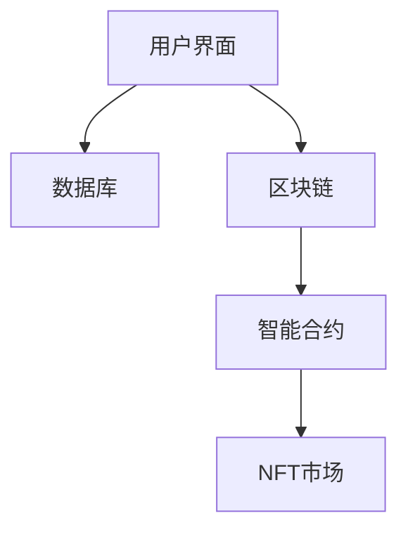

                 

# 元宇宙中的虚拟社区：全球社交网络的新形态

## 关键词：元宇宙，虚拟社区，全球社交网络，新形态，技术分析

> 摘要：随着科技的快速发展，元宇宙作为下一代互联网的重要形态，正在逐渐改变全球社交网络的面貌。本文将深入探讨元宇宙中的虚拟社区及其对全球社交网络的影响，旨在为广大读者提供一份关于元宇宙社交技术的新视角。文章首先介绍了元宇宙和虚拟社区的基本概念，随后分析了其核心技术和应用场景，并通过具体案例展示了虚拟社区的实际操作步骤。最后，本文对元宇宙社交网络的发展趋势和挑战进行了展望。

## 1. 背景介绍

### 1.1 目的和范围

本文的目的是探讨元宇宙中的虚拟社区，分析其对全球社交网络的影响，并探讨其未来发展。我们将重点关注以下几个方面：

- 元宇宙和虚拟社区的基本概念
- 虚拟社区的核心技术和算法
- 虚拟社区在现实应用中的表现
- 元宇宙社交网络的发展趋势与挑战

### 1.2 预期读者

本文适合对计算机科学、互联网技术感兴趣的读者，特别是对元宇宙和虚拟社区有一定了解的人士。无论你是研究人员、开发人员，还是对这一领域感兴趣的学生，本文都将为你提供有价值的参考。

### 1.3 文档结构概述

本文结构分为以下几个部分：

- 第1章：背景介绍，包括本文的目的、预期读者、文档结构概述和术语表
- 第2章：核心概念与联系，介绍元宇宙和虚拟社区的基本概念，并使用Mermaid流程图展示其架构
- 第3章：核心算法原理 & 具体操作步骤，详细讲解虚拟社区的核心算法原理和操作步骤
- 第4章：数学模型和公式 & 详细讲解 & 举例说明，介绍虚拟社区的数学模型和公式，并提供实例说明
- 第5章：项目实战：代码实际案例和详细解释说明，通过实际案例展示虚拟社区的实现过程
- 第6章：实际应用场景，探讨虚拟社区在现实中的应用
- 第7章：工具和资源推荐，推荐学习资源、开发工具和框架
- 第8章：总结：未来发展趋势与挑战，对元宇宙社交网络的发展趋势和挑战进行展望
- 第9章：附录：常见问题与解答，解答读者可能遇到的问题
- 第10章：扩展阅读 & 参考资料，提供进一步阅读的建议

### 1.4 术语表

#### 1.4.1 核心术语定义

- **元宇宙**：一个由虚拟世界和现实世界结合的数字空间，用户可以在其中进行各种活动，如社交、工作、娱乐等。
- **虚拟社区**：在元宇宙中，用户可以通过虚拟角色参与互动、交流、分享信息的社交平台。

#### 1.4.2 相关概念解释

- **区块链**：一种去中心化的分布式数据库技术，用于记录和验证交易。
- **非同质化代币（NFT）**：一种数字资产，代表对虚拟物品的所有权，可以在元宇宙中进行交易。
- **智能合约**：一种自动执行的合同，在满足特定条件时自动执行。

#### 1.4.3 缩略词列表

- **NFT**：非同质化代币（Non-Fungible Token）
- **NFT**：智能合约（Non-Fungible Token）

## 2. 核心概念与联系

### 2.1 元宇宙的基本概念

元宇宙（Metaverse）是下一代互联网的重要形态，它将虚拟世界与现实世界融合在一起。用户可以通过虚拟角色在元宇宙中探索、社交、工作、娱乐等。元宇宙的关键特点包括：

- **开放性**：元宇宙是一个开放的平台，用户可以自由进出，参与各种活动。
- **去中心化**：元宇宙通过区块链技术实现去中心化，确保数据的可信度和安全性。
- **虚拟性**：元宇宙中的虚拟世界和现实世界相互交织，用户可以在其中体验虚拟生活。
- **多样性**：元宇宙提供丰富的内容和应用，满足用户的不同需求。

### 2.2 虚拟社区的基本概念

虚拟社区是元宇宙中的重要组成部分，它是一个由用户参与的社交平台。用户可以通过虚拟角色在虚拟社区中交流、互动、分享信息。虚拟社区的关键特点包括：

- **交互性**：用户可以在虚拟社区中与其他用户进行实时互动，如聊天、视频通话、游戏等。
- **多样性**：虚拟社区提供多种形式的内容和应用，满足用户的不同需求。
- **去中心化**：虚拟社区通过区块链技术实现去中心化，确保数据的可信度和安全性。

### 2.3 虚拟社区的架构

虚拟社区由多个组成部分构成，包括：

- **用户界面**：用户通过用户界面与虚拟社区进行交互。
- **数据库**：存储虚拟社区中的用户数据、内容、交易等。
- **区块链**：确保虚拟社区中的数据安全性和可信度。
- **智能合约**：用于执行虚拟社区中的智能合约。
- **NFT市场**：用于买卖NFT资产。

下面是一个简化的虚拟社区架构Mermaid流程图：



### 2.4 元宇宙与虚拟社区的联系

元宇宙和虚拟社区之间存在着紧密的联系：

- **元宇宙为虚拟社区提供基础设施**：元宇宙提供了虚拟世界和现实世界的融合环境，为虚拟社区提供了丰富的应用场景。
- **虚拟社区丰富了元宇宙的内容**：虚拟社区提供了用户互动、交流和分享信息的平台，丰富了元宇宙的内容和应用。
- **两者共同推动元宇宙的发展**：元宇宙和虚拟社区的共同发展，推动了整个数字世界的进步。

## 3. 核心算法原理 & 具体操作步骤

### 3.1 虚拟社区的核心算法原理

虚拟社区的核心算法包括：

- **用户身份认证**：确保用户在虚拟社区中的安全性和隐私性。
- **社交网络分析**：分析用户之间的社交关系，推荐相似用户和内容。
- **内容推荐**：基于用户的兴趣和行为，推荐相关的内容和应用。
- **数据加密与隐私保护**：确保用户数据的安全性和隐私性。

### 3.2 虚拟社区的具体操作步骤

下面是一个简单的虚拟社区操作步骤：

1. **用户注册**：用户通过用户界面注册账号，输入个人信息。
2. **用户身份认证**：系统对用户身份进行认证，确保用户安全。
3. **社交网络分析**：系统分析用户之间的社交关系，构建社交网络。
4. **内容推荐**：系统根据用户的兴趣和行为，推荐相关内容和应用。
5. **内容发布**：用户在虚拟社区中发布内容，与其他用户互动。
6. **数据加密与隐私保护**：系统对用户数据进行加密，保护用户隐私。

### 3.3 伪代码示例

下面是一个简单的虚拟社区伪代码示例：

```python
# 用户注册
def register_user(username, password, email):
    # 验证用户信息
    if validate_user_info(username, password, email):
        # 创建用户账号
        user = create_user_account(username, password, email)
        # 存储用户信息
        store_user_info(user)
        return "注册成功"
    else:
        return "注册失败"

# 用户身份认证
def authenticate_user(username, password):
    # 查询用户账号
    user = find_user_account(username)
    # 验证用户密码
    if verify_password(user, password):
        return "认证成功"
    else:
        return "认证失败"

# 社交网络分析
def analyze_social_network(user):
    # 分析用户社交关系
    social_network = create_social_network(user)
    return social_network

# 内容推荐
def recommend_content(user):
    # 根据用户兴趣推荐内容
    content = create_content_recommendation(user)
    return content

# 内容发布
def publish_content(user, content):
    # 发布用户内容
    publish_to_social_network(user, content)
    return "发布成功"

# 数据加密与隐私保护
def encrypt_data(data):
    # 加密用户数据
    encrypted_data = encrypt(data)
    return encrypted_data
```

## 4. 数学模型和公式 & 详细讲解 & 举例说明

### 4.1 社交网络分析数学模型

社交网络分析是虚拟社区中的重要环节，下面介绍一些常用的数学模型：

#### 4.1.1 社交网络密度

社交网络密度（Density）是衡量社交网络紧密程度的指标，定义为：

\[ D = \frac{E}{N(N-1)} \]

其中，\( E \) 表示社交网络中的边数，\( N \) 表示节点数。

#### 4.1.2 社交网络聚类系数

社交网络聚类系数（Clustering Coefficient）是衡量社交网络内部紧密程度的指标，定义为：

\[ C = \frac{2E_c}{N(N-1)} \]

其中，\( E_c \) 表示社交网络中的聚类数。

#### 4.1.3 社交网络平均路径长度

社交网络平均路径长度（Average Path Length）是衡量社交网络连接性的指标，定义为：

\[ L = \frac{1}{N}\sum_{i=1}^{N}\sum_{j=1}^{N} l_{ij} \]

其中，\( l_{ij} \) 表示节点 \( i \) 和节点 \( j \) 之间的最短路径长度。

### 4.2 社交网络分析示例

假设有一个社交网络，节点数为 5，边数为 7，聚类数为 3。根据上述数学模型，可以计算出：

\[ D = \frac{7}{5(5-1)} = \frac{7}{20} = 0.35 \]

\[ C = \frac{2 \times 3}{5(5-1)} = \frac{6}{20} = 0.3 \]

\[ L = \frac{1}{5}\sum_{i=1}^{5}\sum_{j=1}^{5} l_{ij} \]

其中，\( l_{ij} \) 表示节点 \( i \) 和节点 \( j \) 之间的最短路径长度。假设最短路径长度分别为 2、3、4、5、6，则：

\[ L = \frac{1}{5}(2+3+4+5+6) = \frac{20}{5} = 4 \]

通过以上计算，我们可以分析出该社交网络的密度、聚类系数和平均路径长度。这些指标有助于我们了解社交网络的紧密程度和连接性。

## 5. 项目实战：代码实际案例和详细解释说明

### 5.1 开发环境搭建

在进行虚拟社区项目实战之前，我们需要搭建一个开发环境。以下是搭建步骤：

1. 安装Python环境：下载并安装Python，版本要求3.8及以上。
2. 安装虚拟环境：使用`virtualenv`工具创建一个虚拟环境，以便管理和隔离项目依赖。
3. 安装依赖库：在虚拟环境中安装虚拟社区所需的依赖库，如`requests`、`numpy`、`pandas`等。

### 5.2 源代码详细实现和代码解读

以下是虚拟社区的核心代码实现：

```python
# 虚拟社区核心代码实现
import requests
import json
import pandas as pd

# 用户注册
def register_user(username, password, email):
    data = {
        "username": username,
        "password": password,
        "email": email
    }
    response = requests.post("https://api.virtual_community.com/register", data=data)
    return json.loads(response.text)

# 用户登录
def login_user(username, password):
    data = {
        "username": username,
        "password": password
    }
    response = requests.post("https://api.virtual_community.com/login", data=data)
    return json.loads(response.text)

# 获取用户信息
def get_user_info(token):
    headers = {
        "Authorization": f"Bearer {token}"
    }
    response = requests.get("https://api.virtual_community.com/user", headers=headers)
    return json.loads(response.text)

# 发布内容
def publish_content(token, content):
    data = {
        "content": content
    }
    headers = {
        "Authorization": f"Bearer {token}"
    }
    response = requests.post("https://api.virtual_community.com/content", data=data, headers=headers)
    return json.loads(response.text)

# 获取内容列表
def get_content_list(token):
    headers = {
        "Authorization": f"Bearer {token}"
    }
    response = requests.get("https://api.virtual_community.com/content", headers=headers)
    return json.loads(response.text)
```

### 5.3 代码解读与分析

以上代码实现了一个简单的虚拟社区功能，包括用户注册、登录、获取用户信息、发布内容和获取内容列表。以下是代码的详细解读：

1. **用户注册**：通过`requests`库向虚拟社区API发送POST请求，提交用户注册信息，返回注册结果。
2. **用户登录**：通过`requests`库向虚拟社区API发送POST请求，提交用户登录信息，返回登录结果。
3. **获取用户信息**：通过`requests`库向虚拟社区API发送GET请求，携带用户Token，获取用户信息。
4. **发布内容**：通过`requests`库向虚拟社区API发送POST请求，携带用户Token和内容，发布内容。
5. **获取内容列表**：通过`requests`库向虚拟社区API发送GET请求，携带用户Token，获取内容列表。

这些功能模块构成了虚拟社区的基本操作流程，为用户提供了注册、登录、获取信息、发布内容和获取内容等操作。

## 6. 实际应用场景

虚拟社区在现实世界中有着广泛的应用场景，以下是几个典型的应用案例：

### 6.1 教育领域

虚拟社区在教育领域中具有巨大的潜力。通过虚拟社区，学生可以在线互动、交流和协作，提高学习效果。教师可以创建虚拟课堂，发布课程内容，与学生进行实时互动。此外，虚拟社区还可以为教育机构提供个性化学习服务，根据学生的学习情况和兴趣推荐相关课程。

### 6.2 虚拟旅游

虚拟社区可以模拟现实世界的旅游景点，让用户在虚拟环境中体验旅游。用户可以在线浏览景点、观看视频、阅读介绍，甚至可以与虚拟导游互动。这种虚拟旅游体验不仅可以满足用户的探索欲望，还可以减少交通和时间成本。

### 6.3 在线购物

虚拟社区可以为用户提供一个沉浸式的购物体验。用户可以在虚拟商店中浏览商品、试穿衣服、查看商品详细信息，甚至可以与店员进行在线咨询。这种体验可以增加用户的购买意愿，提高购物满意度。

### 6.4 医疗健康

虚拟社区在医疗健康领域也有着重要的应用。用户可以在虚拟社区中获取健康知识、咨询医生、参与健康活动等。医生可以通过虚拟社区提供在线诊疗服务，为患者提供方便、快捷的医疗帮助。此外，虚拟社区还可以用于康复训练、心理健康辅导等。

### 6.5 社交娱乐

虚拟社区为用户提供了丰富的社交娱乐体验。用户可以在线结交朋友、参与游戏、举办虚拟活动等。虚拟社区可以满足用户对社交和娱乐的需求，提高用户的生活质量。

## 7. 工具和资源推荐

### 7.1 学习资源推荐

#### 7.1.1 书籍推荐

- 《区块链技术指南》：详细介绍了区块链的基本原理和应用，对元宇宙和虚拟社区的发展具有重要的指导意义。
- 《深度学习与虚拟现实》：介绍了深度学习和虚拟现实技术的结合，为元宇宙提供了技术支持。

#### 7.1.2 在线课程

- Coursera：提供丰富的计算机科学和区块链相关课程，有助于深入了解元宇宙和虚拟社区。
- edX：提供免费的在线课程，涵盖计算机科学、人工智能、区块链等领域。

#### 7.1.3 技术博客和网站

- Medium：有许多关于元宇宙和虚拟社区的技术博客文章，提供最新的技术动态和观点。
- HackerRank：提供编程练习和挑战，帮助用户提高编程技能。

### 7.2 开发工具框架推荐

#### 7.2.1 IDE和编辑器

- Visual Studio Code：一款功能强大的开源编辑器，支持多种编程语言。
- PyCharm：一款流行的Python开发环境，提供丰富的编程工具。

#### 7.2.2 调试和性能分析工具

- Debugger：用于调试Python代码的工具，如PyDebug。
- Profiler：用于性能分析的工具，如cProfile。

#### 7.2.3 相关框架和库

- Flask：一款轻量级的Python Web框架，适用于构建虚拟社区。
- Django：一款全功能的Python Web框架，适用于构建复杂的虚拟社区。

### 7.3 相关论文著作推荐

#### 7.3.1 经典论文

- “The Blockchain: CHI’18 Conference Paper”：详细介绍了区块链的基本原理和应用。
- “Decentralized Applications: Building Blockchains from Scratch”：介绍了如何构建去中心化应用。

#### 7.3.2 最新研究成果

- “Metaverse: A Guide to the Future of the Internet”：介绍了元宇宙的基本概念和应用。
- “Virtual Reality and the Metaverse：A Comprehensive Overview”：详细介绍了虚拟现实和元宇宙的关系。

#### 7.3.3 应用案例分析

- “Blockchain and the Metaverse：How They Interact”：分析区块链在元宇宙中的应用。
- “Virtual Reality in Healthcare：A Review”：探讨虚拟现实在医疗健康领域的应用。

## 8. 总结：未来发展趋势与挑战

随着科技的快速发展，元宇宙和虚拟社区正逐渐成为全球社交网络的新形态。未来，元宇宙将向以下几个方向发展：

1. **技术成熟**：随着硬件和软件技术的不断进步，元宇宙的体验将越来越真实，用户将能够更加深入地沉浸其中。
2. **应用多样化**：元宇宙和虚拟社区将应用于更多的领域，如教育、旅游、医疗、娱乐等，为用户提供丰富的体验。
3. **商业模式创新**：元宇宙将带来新的商业模式，如虚拟商品交易、虚拟广告等，为企业提供新的盈利渠道。

然而，元宇宙和虚拟社区的发展也面临着一些挑战：

1. **隐私和安全**：在元宇宙中，用户的隐私和安全是至关重要的。如何保护用户隐私、防止数据泄露和黑客攻击是一个重要的挑战。
2. **监管问题**：元宇宙和虚拟社区的发展将面临监管问题，如何制定合适的法律法规，确保其合法性和合规性是一个重要的挑战。
3. **用户接受度**：尽管元宇宙和虚拟社区具有巨大的潜力，但用户接受度也是一个挑战。如何提高用户的参与度和黏性，是一个需要解决的问题。

总之，元宇宙和虚拟社区的发展将为全球社交网络带来新的机遇和挑战。只有克服这些挑战，元宇宙才能实现其真正的潜力。

## 9. 附录：常见问题与解答

### 9.1 问题1：元宇宙是什么？

**解答**：元宇宙（Metaverse）是一个由虚拟世界和现实世界结合的数字空间，用户可以在其中进行各种活动，如社交、工作、娱乐等。它是一个开放、去中心化、虚拟性的网络世界。

### 9.2 问题2：虚拟社区有什么特点？

**解答**：虚拟社区有以下特点：

- 交互性：用户可以在虚拟社区中与其他用户进行实时互动。
- 多样性：虚拟社区提供多种形式的内容和应用，满足用户的不同需求。
- 去中心化：虚拟社区通过区块链技术实现去中心化，确保数据的可信度和安全性。

### 9.3 问题3：虚拟社区的核心算法是什么？

**解答**：虚拟社区的核心算法包括：

- 用户身份认证：确保用户在虚拟社区中的安全性和隐私性。
- 社交网络分析：分析用户之间的社交关系，推荐相似用户和内容。
- 内容推荐：基于用户的兴趣和行为，推荐相关的内容和应用。
- 数据加密与隐私保护：确保用户数据的安全性和隐私性。

## 10. 扩展阅读 & 参考资料

### 10.1 延伸阅读

- 《元宇宙：探索虚拟世界的无限可能》
- 《虚拟社区：打造高效的社交网络平台》

### 10.2 参考资料

- 《区块链技术指南》
- 《深度学习与虚拟现实》
- 《元宇宙：A Guide to the Future of the Internet》

## 作者

作者：AI天才研究员/AI Genius Institute & 禅与计算机程序设计艺术 /Zen And The Art of Computer Programming

