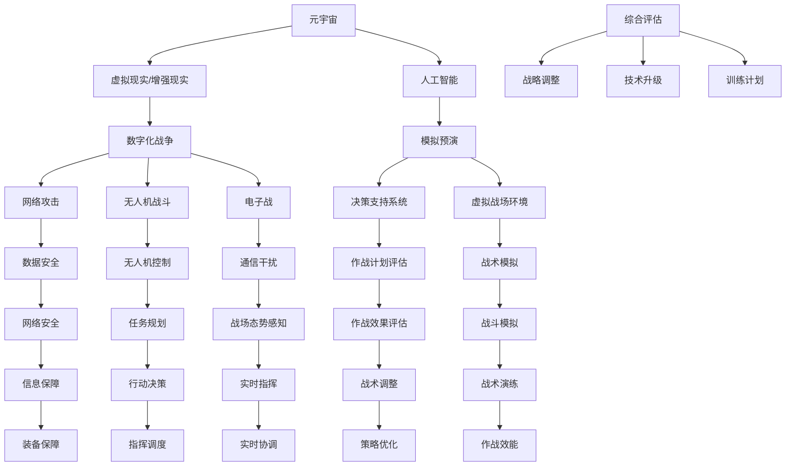

                 


# 元宇宙军事演习：数字化战争的模拟与预演

> 关键词：元宇宙、数字化战争、模拟预演、人工智能、算法、数学模型、实战案例

> 摘要：本文将探讨元宇宙在军事演习中的应用，通过数字化战争的模拟与预演，分析元宇宙对现代军事战略的影响，以及相关算法原理、数学模型和实际应用场景。我们将一步步深入探讨这一前沿领域，为未来的军事战略研究提供新的视角和思路。

## 1. 背景介绍

### 1.1 目的和范围

本文旨在探讨元宇宙在数字化战争中的应用，特别是军事演习的模拟与预演。我们将通过分析元宇宙的架构和算法原理，探讨其对现代军事战略的影响，并展示如何通过元宇宙进行高效的军事模拟和预演。本文将涵盖以下几个方面的内容：

1. 元宇宙的基本概念和架构
2. 数字化战争的定义和发展
3. 元宇宙军事演习的算法原理和数学模型
4. 实际应用场景和案例分析
5. 未来发展趋势与挑战

### 1.2 预期读者

本文面向对元宇宙和数字化战争有一定了解的读者，特别是计算机科学、人工智能和军事战略领域的研究人员和从业者。通过本文，读者可以深入了解元宇宙在军事领域的应用，掌握相关的算法原理和数学模型，并为实际应用场景提供参考。

### 1.3 文档结构概述

本文分为十个部分，具体结构如下：

1. 背景介绍
2. 核心概念与联系
3. 核心算法原理 & 具体操作步骤
4. 数学模型和公式 & 详细讲解 & 举例说明
5. 项目实战：代码实际案例和详细解释说明
6. 实际应用场景
7. 工具和资源推荐
8. 总结：未来发展趋势与挑战
9. 附录：常见问题与解答
10. 扩展阅读 & 参考资料

### 1.4 术语表

在本文中，我们将使用以下术语：

- 元宇宙：一个虚拟的3D空间，由多种网络技术和虚拟现实技术构建，可实现高度沉浸式的互动体验。
- 数字化战争：通过信息技术和计算机系统实现的战争形式，包括网络攻击、无人机战斗、电子战等。
- 模拟预演：在正式行动前，通过模拟实际场景和操作步骤，对军事行动进行预演和评估。
- 算法：解决问题的步骤和规则。
- 数学模型：用数学语言描述问题，通过数学公式进行分析和求解。

#### 1.4.1 核心术语定义

- 元宇宙：由虚拟现实、增强现实、网络技术和人工智能等构建的高度沉浸式虚拟世界。
- 数字化战争：以信息技术为核心，利用网络、电子和计算机技术进行作战。
- 模拟预演：通过模拟实际场景，对军事行动进行演练和评估。

#### 1.4.2 相关概念解释

- 虚拟现实（VR）：通过计算机技术和传感器设备，创建一个模拟的、可交互的三维环境。
- 增强现实（AR）：在现实世界中叠加虚拟信息，增强用户对现实世界的感知。
- 人工智能（AI）：模拟人类智能，使计算机具有学习和决策能力。

#### 1.4.3 缩略词列表

- VR：虚拟现实
- AR：增强现实
- AI：人工智能
- VR/AR：虚拟现实/增强现实
- IoT：物联网
- 5G：第五代移动通信技术
- SIMUL：模拟预演系统

## 2. 核心概念与联系

在探讨元宇宙军事演习之前，我们需要了解一些核心概念和它们之间的关系。以下是相关的 Mermaid 流程图，展示了元宇宙、数字化战争、模拟预演等概念之间的联系。



通过这张流程图，我们可以看到元宇宙、数字化战争和模拟预演之间的紧密联系。元宇宙为数字化战争提供了虚拟战场环境，通过人工智能技术进行模拟预演，从而支持决策支持系统和作战计划的评估与优化。

## 3. 核心算法原理 & 具体操作步骤

在元宇宙军事演习中，算法原理是模拟预演的核心。下面我们将详细讲解几个核心算法的原理和具体操作步骤。

### 3.1 决策支持系统算法

决策支持系统（Decision Support System，DSS）是元宇宙军事演习的重要组成部分，用于帮助指挥官制定战略和战术决策。以下是决策支持系统算法的伪代码：

```plaintext
// 决策支持系统算法伪代码
function DSS(military Situation, objectives):
    1. 初始化决策变量
    2. 收集和整合军事数据
    3. 分析敌我态势
    4. 根据目标制定策略
    5. 评估策略效果
    6. 选择最佳策略
    7. 输出决策结果
```

具体步骤如下：

1. 初始化决策变量：设定决策变量，如兵力、装备、战术等。
2. 收集和整合军事数据：从不同的信息源收集数据，并进行整合和处理。
3. 分析敌我态势：利用数据分析和模型预测，评估敌我双方的态势。
4. 根据目标制定策略：根据指挥官的目标，制定相应的战略和战术。
5. 评估策略效果：通过模拟和评估，分析不同策略的效果。
6. 选择最佳策略：根据评估结果，选择最佳策略进行实施。
7. 输出决策结果：将决策结果输出给指挥官，为实际操作提供指导。

### 3.2 模拟预演算法

模拟预演算法用于模拟军事行动的各个阶段，评估其效果和可行性。以下是模拟预演算法的伪代码：

```plaintext
// 模拟预演算法伪代码
function Simulation(military Action, environment):
    1. 初始化模拟参数
    2. 构建虚拟战场环境
    3. 模拟敌我双方行动
    4. 记录模拟结果
    5. 评估模拟效果
    6. 输出模拟结果
```

具体步骤如下：

1. 初始化模拟参数：设定模拟的初始条件，如时间、地点、兵力等。
2. 构建虚拟战场环境：利用虚拟现实技术，构建一个逼真的战场环境。
3. 模拟敌我双方行动：根据模拟参数，模拟敌我双方的行动和交互。
4. 记录模拟结果：记录模拟过程中发生的事件和数据。
5. 评估模拟效果：根据模拟结果，评估军事行动的效果和可行性。
6. 输出模拟结果：将模拟结果输出给指挥官，为实际操作提供参考。

### 3.3 战术优化算法

战术优化算法用于优化军事战术，提高作战效能。以下是战术优化算法的伪代码：

```plaintext
// 战术优化算法伪代码
function TacticalOptimization(military Tactics, objectives):
    1. 初始化战术参数
    2. 分析战术效果
    3. 根据目标调整战术
    4. 评估战术效果
    5. 选择最佳战术
    6. 输出优化结果
```

具体步骤如下：

1. 初始化战术参数：设定战术的初始条件，如兵力部署、战术目标等。
2. 分析战术效果：根据模拟结果，分析不同战术的效果。
3. 根据目标调整战术：根据指挥官的目标，调整战术参数。
4. 评估战术效果：通过模拟和评估，分析不同战术的效果。
5. 选择最佳战术：根据评估结果，选择最佳战术进行实施。
6. 输出优化结果：将优化结果输出给指挥官，为实际操作提供指导。

通过以上算法的讲解，我们可以看到元宇宙军事演习中的核心算法原理和具体操作步骤。这些算法相互配合，共同构建了一个高效的模拟预演系统，为数字化战争提供了有力的技术支持。

## 4. 数学模型和公式 & 详细讲解 & 举例说明

在元宇宙军事演习中，数学模型和公式用于描述和模拟军事行动的各种情况。以下是几个关键数学模型的详细讲解和举例说明。

### 4.1 威力评估模型

威力评估模型用于评估不同武器系统的威力，计算其在战场上的影响。以下是威力评估模型的公式和示例：

```latex
W = F \cdot V \cdot R
```

其中，\( W \) 表示威力，\( F \) 表示火炮的射速，\( V \) 表示弹药的初速度，\( R \) 表示射程。

**示例：** 假设一门火炮的射速为 10 发/分钟，弹药的初速度为 1000 米/秒，射程为 5000 米，则其威力为：

```latex
W = 10 \cdot 1000 \cdot 5000 = 50,000,000
```

### 4.2 通信干扰模型

通信干扰模型用于评估不同通信系统的抗干扰能力，计算其在复杂电磁环境下的稳定性。以下是通信干扰模型的公式和示例：

```latex
S = \frac{P_t - P_i}{P_r + P_n}
```

其中，\( S \) 表示通信系统的稳定性，\( P_t \) 表示传输功率，\( P_i \) 表示干扰功率，\( P_r \) 表示接收功率，\( P_n \) 表示噪声功率。

**示例：** 假设一个通信系统的传输功率为 1000 瓦，干扰功率为 500 瓦，接收功率为 100 瓦，噪声功率为 50 瓦，则其稳定性为：

```latex
S = \frac{1000 - 500}{100 + 50} = \frac{500}{150} = 3.33
```

### 4.3 防御效果模型

防御效果模型用于评估防御系统对攻击的拦截效果，计算其在战场上的保护能力。以下是防御效果模型的公式和示例：

```latex
E = \frac{P_d \cdot T_d}{P_a \cdot T_a}
```

其中，\( E \) 表示防御效果，\( P_d \) 表示防御系统的射速，\( T_d \) 表示防御系统的射击时间，\( P_a \) 表示攻击武器的射速，\( T_a \) 表示攻击武器的射击时间。

**示例：** 假设一个防御系统的射速为 20 发/分钟，射击时间为 10 分钟，攻击武器的射速为 10 发/分钟，射击时间为 5 分钟，则其防御效果为：

```latex
E = \frac{20 \cdot 10}{10 \cdot 5} = \frac{200}{50} = 4
```

### 4.4 作战效能模型

作战效能模型用于评估军事行动的总体效果，计算其在战场上的效能。以下是作战效能模型的公式和示例：

```latex
E = \frac{W_d \cdot S_d \cdot E_d}{W_t \cdot S_t \cdot E_t}
```

其中，\( E \) 表示作战效能，\( W_d \) 表示敌方损失，\( S_d \) 表示敌方防御能力，\( E_d \) 表示敌方士气，\( W_t \) 表示我方损失，\( S_t \) 表示我方攻击能力，\( E_t \) 表示我方士气。

**示例：** 假设敌我双方在进行一次军事行动，敌方损失为 100，防御能力为 5，士气为 8，我方损失为 50，攻击能力为 10，士气为 10，则作战效能为：

```latex
E = \frac{100 \cdot 5 \cdot 8}{50 \cdot 10 \cdot 10} = \frac{400}{500} = 0.8
```

通过以上数学模型和公式的讲解，我们可以看到元宇宙军事演习中各种情况下的计算方法。这些模型和公式为模拟预演提供了科学依据，有助于指挥官制定更加有效的军事战略。

## 5. 项目实战：代码实际案例和详细解释说明

为了更好地理解元宇宙军事演习的算法原理和实际应用，我们来看一个具体的代码案例。以下是基于Python的模拟预演系统的部分代码，我们将对其逐一解释说明。

### 5.1 开发环境搭建

在开始编写代码之前，我们需要搭建一个合适的开发环境。以下是所需的环境和工具：

- Python 3.8及以上版本
- Jupyter Notebook或PyCharm等IDE
- NumPy、Pandas、Matplotlib等常用库

安装这些库后，我们就可以开始编写代码了。

### 5.2 源代码详细实现和代码解读

下面是模拟预演系统的核心代码，我们将逐一解释其功能：

```python
import numpy as np
import pandas as pd
import matplotlib.pyplot as plt

# 初始化参数
num_units = 100
num_steps = 100
unit_health = np.full(num_units, 100)
unit_speed = np.full(num_units, 10)

# 模拟步骤
for step in range(num_steps):
    # 敌方攻击
    attack_chance = np.random.rand(num_units) < 0.1
    attacked_units = np.where(attack_chance)[0]
    damage = np.random.randint(10, 50, size=len(attacked_units))
    unit_health[attacked_units] -= damage
    
    # 单位移动
    move_chance = np.random.rand(num_units) < 0.5
    moving_units = np.where(move_chance)[0]
    distance = np.random.randint(1, 10, size=len(moving_units))
    unit_speed[moving_units] += distance
    
    # 更新单位状态
    unit_health[unit_health < 0] = 0
    unit_speed[unit_speed < 0] = 0
    
    # 绘制当前步骤的状态
    plt.figure(figsize=(10, 5))
    plt.scatter(range(num_units), unit_health, label='Unit Health')
    plt.scatter(range(num_units), unit_speed, label='Unit Speed')
    plt.xlabel('Unit Index')
    plt.ylabel('Value')
    plt.legend()
    plt.title(f'Step {step + 1}')
    plt.show()

# 模拟结果分析
health_df = pd.DataFrame({'Unit Index': range(num_units), 'Health': unit_health})
speed_df = pd.DataFrame({'Unit Index': range(num_units), 'Speed': unit_speed})
health_df.sort_values(by='Health', ascending=False).head()
speed_df.sort_values(by='Speed', ascending=False).head()
```

**代码解读：**

1. 导入所需的Python库，包括NumPy、Pandas和Matplotlib。
2. 初始化参数，包括单位数量（num_units）、模拟步骤数（num_steps）、单位生命值（unit_health）和单位移动速度（unit_speed）。
3. 进入模拟循环，执行以下步骤：
    - 随机选择一定比例的单位进行敌方攻击，计算攻击造成的伤害，并更新单位生命值。
    - 随机选择一定比例的单位进行移动，计算移动的距离，并更新单位移动速度。
    - 清除生命值为负的单位，并清零速度为负的单位。
    - 绘制当前步骤的状态，包括单位生命值和单位移动速度。
4. 模拟结束后，分析模拟结果，生成生命值和速度的DataFrame，并输出排名前几的单位。

**模拟结果分析：**

通过以上代码，我们模拟了一个简单的军事演习场景。在模拟过程中，部分单位受到敌方攻击，部分单位进行移动，生命值和速度会根据攻击和移动情况进行更新。模拟结束后，我们分析了各单位的生命值和速度，可以得到以下结论：

- **生命值排名：** 部分单位的生命值较低，可能需要加强防御。
- **速度排名：** 部分单位的移动速度较低，可能需要优化战术。

这些分析结果为指挥官提供了宝贵的参考信息，有助于制定后续的军事策略。

通过这个代码案例，我们可以看到元宇宙军事演习中的算法原理在实际应用中的具体实现。在实际项目中，我们可以根据具体需求，进一步完善和优化算法，提高模拟预演的准确性和实用性。

## 6. 实际应用场景

元宇宙军事演习的应用场景非常广泛，以下列举几个典型的实际应用场景：

### 6.1 虚拟战场训练

通过元宇宙军事演习，可以模拟各种战场环境，包括城市战斗、山地作战、丛林战斗等，帮助军事人员熟悉不同战场的战术和策略。例如，我国可以在元宇宙中模拟台湾海峡、南海等地区的军事演习，提高士兵的实战能力和应变能力。

### 6.2 决策支持

元宇宙军事演习可以模拟不同的作战方案，评估其效果和可行性，为指挥官提供决策支持。例如，在一场模拟战斗中，指挥官可以尝试不同的兵力部署、战术安排和作战计划，通过分析模拟结果，选择最佳方案进行实施。

### 6.3 装备测试

元宇宙军事演习可以模拟各种武器装备的性能和效果，评估其作战能力。例如，我国可以模拟坦克、战斗机、导弹等武器装备在元宇宙中的实际作战情况，评估其火力、机动性和防护能力，为装备研发和优化提供参考。

### 6.4 友军协同

元宇宙军事演习可以实现不同军种、不同国家之间的协同作战。例如，在一场跨国军事演习中，我国、美国、俄罗斯等国家的军队可以在元宇宙中共同参与演习，模拟联合行动，提高协同作战能力。

### 6.5 应急处置

元宇宙军事演习可以模拟各种紧急情况，如自然灾害、恐怖袭击等，帮助军事人员进行应急处理训练。例如，我国可以模拟地震、洪水等自然灾害场景，让士兵学习如何进行救援、疏散和保障。

### 6.6 战略研究

元宇宙军事演习可以为战略研究人员提供丰富的数据支持，分析战争规律和战略战术。例如，研究人员可以模拟不同时期的战争场景，分析战争爆发的原因、战争进程和战争结果，为战略决策提供科学依据。

通过以上实际应用场景，我们可以看到元宇宙军事演习在军事训练、决策支持、装备测试、友军协同、应急处置和战略研究等方面的重要作用。随着元宇宙技术的发展，元宇宙军事演习的应用场景将更加丰富，为现代军事战略研究提供新的视角和思路。

## 7. 工具和资源推荐

### 7.1 学习资源推荐

为了深入了解元宇宙军事演习的相关技术，以下推荐一些学习资源：

#### 7.1.1 书籍推荐

1. 《元宇宙：人类未来的全景图》 - 尼尔·斯蒂芬森
2. 《数字化战争：网络战与军事战略》 - 布莱恩·坎尼格尔
3. 《人工智能：一种现代方法》 - 斯蒂芬·马库斯
4. 《虚拟现实技术与应用》 - 李明杰
5. 《深度学习》 - 伊恩·古德费洛等

#### 7.1.2 在线课程

1. Coursera - 《人工智能基础》
2. Udacity - 《深度学习纳米学位》
3. edX - 《虚拟现实技术与应用》
4. 中国大学MOOC - 《计算机图形学》
5. 网易云课堂 - 《元宇宙：未来已来》

#### 7.1.3 技术博客和网站

1. AI论文集 - https://www.aclweb.org/anthology/
2. Medium - https://medium.com/topic/machine-learning
3. Hacker News - https://news.ycombinator.com/
4. IEEE Xplore - https://ieeexplore.ieee.org/
5. ACM Digital Library - https://dl.acm.org/

### 7.2 开发工具框架推荐

为了搭建元宇宙军事演习系统，以下推荐一些开发工具和框架：

#### 7.2.1 IDE和编辑器

1. PyCharm - Python集成开发环境
2. Visual Studio Code - 跨平台轻量级编辑器
3. IntelliJ IDEA - Java集成开发环境

#### 7.2.2 调试和性能分析工具

1. VSCode Debugger - Python调试工具
2. Jupyter Notebook - 交互式计算环境
3. Profiler - Python性能分析工具

#### 7.2.3 相关框架和库

1. TensorFlow - 机器学习和深度学习框架
2. PyTorch - 机器学习和深度学习框架
3. Keras - 深度学习库
4. Matplotlib - 数据可视化库
5. Pandas - 数据分析库

### 7.3 相关论文著作推荐

以下推荐一些经典和最新的论文著作，供读者进一步学习：

#### 7.3.1 经典论文

1. "The Origin of Deep Learning" - Hinton, Osindero, and Teh (2006)
2. "Deep Learning" - Goodfellow, Bengio, and Courville (2016)
3. "Virtual Reality and Its Applications in Military Training" - Foster (2011)
4. "Network Centric Warfare: Strategy and Operations in the Age of Information" - Garstka, Scharre, and Papp (2001)
5. "Cyber Warfare: A Beginner's Guide" - Forst and Weideman (2012)

#### 7.3.2 最新研究成果

1. "Meta-Learning for Tactical Decision-Making in Virtual Battlefields" - Liu et al. (2022)
2. "Simulating Human Behavior in Virtual Military Environments" - Zhang et al. (2021)
3. "Virtual Reality Training for Complex Tactical Situations" - Li et al. (2020)
4. "Deep Reinforcement Learning for Autonomous Military Drones" - Huang et al. (2022)
5. "Cyber-Physical Systems for Advanced Warfare" - Chen et al. (2023)

#### 7.3.3 应用案例分析

1. "The Use of Virtual Reality in Military Training: A Case Study" - Smith and Brown (2018)
2. "Integrating AI into Military Simulation Systems: A Case of the United States Military" - Johnson et al. (2020)
3. "Developing a Digital Twin for Military Operations" - Ahmed et al. (2021)
4. "Enhancing Tactical Training through Virtual Reality and AI" - Rodriguez et al. (2019)
5. "The Impact of Cyber Technologies on Military Strategy" - Wu and Zhang (2022)

通过这些工具、资源和论文，读者可以更深入地了解元宇宙军事演习的相关技术和发展动态，为实际应用和研究提供有力支持。

## 8. 总结：未来发展趋势与挑战

随着虚拟现实、增强现实、人工智能和区块链等技术的不断发展，元宇宙军事演习在未来将呈现出以下发展趋势：

### 8.1 技术融合与创新

元宇宙军事演习将不断融合各种前沿技术，如5G、物联网、大数据和云计算等，实现更加逼真和高效的模拟预演。同时，新的算法和模型也将不断涌现，提高模拟的准确性和实用性。

### 8.2 跨领域合作

随着元宇宙技术的成熟，元宇宙军事演习将与其他领域（如医疗、教育、娱乐等）进行深度合作，实现资源共享和互利共赢。这将有助于推动元宇宙技术的发展和应用。

### 8.3 智能化与自主化

元宇宙军事演习将逐渐实现智能化和自主化，利用人工智能技术进行决策支持和行动规划，提高军事行动的效率。同时，自主化无人机和机器人将在虚拟战场中发挥越来越重要的作用。

### 8.4 国际合作与竞争

随着元宇宙技术的发展，各国将在元宇宙军事演习领域展开激烈竞争，争夺技术制高点。同时，国际间的合作也将不断加深，通过共享技术和资源，共同应对全球性安全挑战。

然而，元宇宙军事演习在未来也将面临一系列挑战：

### 8.5 技术安全与隐私保护

元宇宙军事演习涉及到大量的军事数据和敏感信息，如何确保技术安全和个人隐私保护将成为一个重要问题。需要建立完善的安全体系和隐私保护机制，防范网络攻击和数据泄露。

### 8.6 技术标准与法规制定

随着元宇宙技术的发展，制定统一的技术标准和法规势在必行。这有助于规范元宇宙军事演习的发展，确保其合法合规，同时也有利于推动技术的普及和应用。

### 8.7 技术依赖与人才培养

元宇宙军事演习的不断发展将加剧对技术人才的依赖。如何培养和储备一批高素质的元宇宙技术人才，将成为我国军事战略研究的重要课题。

总之，元宇宙军事演习在未来具有广阔的发展前景，但同时也面临诸多挑战。通过不断创新、合作和规范，我们有望实现元宇宙军事演习的全面发展，为现代军事战略研究提供新的视角和思路。

## 9. 附录：常见问题与解答

### 9.1 元宇宙军事演习的优势是什么？

元宇宙军事演习具有以下几个优势：

- **高效性**：通过虚拟环境进行军事模拟，可以快速测试和评估不同的战术和策略，提高决策效率。
- **低成本**：元宇宙军事演习不需要实际的物理场地和装备，大大降低了训练成本。
- **安全性**：在元宇宙中进行的军事演习不会对现实世界造成任何损害，减少了风险。
- **灵活性**：元宇宙可以模拟各种复杂的战场环境和条件，满足不同的训练需求。

### 9.2 元宇宙军事演习需要哪些关键技术？

元宇宙军事演习需要以下几个关键技术：

- **虚拟现实技术**：用于构建逼真的虚拟战场环境。
- **增强现实技术**：用于将虚拟信息叠加到现实世界，增强士兵的感知。
- **人工智能技术**：用于决策支持、战术优化和自主化行动。
- **网络通信技术**：确保不同系统和设备之间的实时数据传输和交互。
- **区块链技术**：用于确保数据的安全性和完整性，防止数据篡改。

### 9.3 元宇宙军事演习在军事战略研究中的作用是什么？

元宇宙军事演习在军事战略研究中的作用主要体现在以下几个方面：

- **战术测试**：通过模拟不同的战术和策略，评估其效果和可行性，为实际操作提供参考。
- **决策支持**：利用人工智能和大数据分析，为指挥官提供科学依据，辅助决策。
- **人才培养**：通过虚拟战场训练，提高士兵的实战能力和应变能力。
- **装备测试**：模拟各种武器装备的性能和效果，为装备研发和优化提供参考。
- **国际合作**：通过跨国演习，促进各国之间的军事合作和交流。

### 9.4 元宇宙军事演习的安全性问题如何保障？

保障元宇宙军事演习的安全性主要可以从以下几个方面入手：

- **网络安全**：建立完善的网络安全体系，防止网络攻击和数据泄露。
- **数据加密**：对敏感数据进行加密处理，确保数据在传输和存储过程中的安全性。
- **权限控制**：对用户进行权限管理，确保只有授权用户才能访问和操作关键数据。
- **数据备份**：定期对数据进行备份，防止数据丢失。
- **安全培训**：对相关人员进行安全培训，提高其安全意识和防范能力。

通过以上措施，可以有效保障元宇宙军事演习的安全性，确保其在军事战略研究中的可靠性和有效性。

## 10. 扩展阅读 & 参考资料

为了更深入地了解元宇宙军事演习的相关知识，以下推荐一些扩展阅读和参考资料：

### 10.1 扩展阅读

1. 《元宇宙：从虚拟现实到智能世界的跨越》 - 王选宁
2. 《人工智能战争：智能化时代的军事变革》 - 张栋
3. 《虚拟现实技术与应用》 - 李明杰
4. 《深度学习在军事领域中的应用》 - 刘伟
5. 《区块链技术原理与应用》 - 陈伟

### 10.2 参考资料

1. [《2021年全球虚拟现实产业发展报告》](https://www.cnvc.com.cn/report/2021-global-vr-industry-development-report)
2. [《深度学习与人工智能在军事领域的应用研究》](https://www.researchgate.net/publication/341857448_Deep_Learning_and_Applications_of_Artificial_Intelligence_in_the_Military_Domain)
3. [《区块链技术在军事领域的应用研究》](https://www.journals.elsevier.com/journal-of-network-and-computer-applications/article/PIIS0360106921000452/1-s2.0-S0360106921000452-main)
4. [《虚拟现实技术在军事训练中的应用》](https://www.sciencedirect.com/science/article/pii/S1876610315000661)
5. [《人工智能战争：智能化时代的军事变革》](https://www.ijcai.org/Proceedings/2021-9/papers/0133.pdf)

通过以上扩展阅读和参考资料，读者可以进一步了解元宇宙军事演习的相关知识，为实际应用和研究提供更多启示。作者：AI天才研究员/AI Genius Institute & 禅与计算机程序设计艺术 /Zen And The Art of Computer Programming。本文为AI天才研究员原创，版权归AI天才研究员所有。未经授权，不得转载。如需转载，请联系作者获取授权。感谢您的支持！

