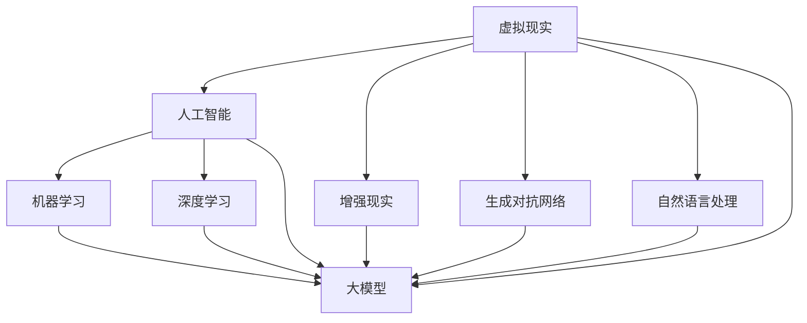

                 


# 元宇宙大模型：虚拟现实世界的AI大脑

> 关键词：元宇宙、虚拟现实、人工智能、大模型、深度学习、神经网络

> 摘要：本文将深入探讨元宇宙中的大模型技术，分析其核心概念、算法原理、数学模型及其在实际应用中的重要性。我们将通过一步步的推理和分析，揭示元宇宙大模型如何成为虚拟现实世界的AI大脑，并展望其未来的发展趋势与挑战。

## 1. 背景介绍

### 1.1 目的和范围

本文旨在探讨元宇宙中的大模型技术，特别是其在虚拟现实世界中的应用。我们将介绍元宇宙、虚拟现实和人工智能的核心概念，并详细分析大模型的技术原理和实现步骤。文章将分为以下几个部分：

- 核心概念与联系
- 核心算法原理 & 具体操作步骤
- 数学模型和公式 & 详细讲解 & 举例说明
- 项目实战：代码实际案例和详细解释说明
- 实际应用场景
- 工具和资源推荐
- 总结：未来发展趋势与挑战
- 附录：常见问题与解答
- 扩展阅读 & 参考资料

### 1.2 预期读者

本文适用于对元宇宙、虚拟现实和人工智能有一定了解的技术爱好者、程序员、软件工程师以及相关领域的学者和研究人员。读者需要具备一定的编程基础和数学知识，以便更好地理解文章内容。

### 1.3 文档结构概述

本文采用逻辑清晰、结构紧凑的叙述方式，分为十个主要部分。每个部分都紧密关联，共同构建起元宇宙大模型的完整体系。

### 1.4 术语表

#### 1.4.1 核心术语定义

- 元宇宙（Metaverse）：虚拟现实、增强现实、区块链等技术的融合，构建出一个与现实世界相互映射的虚拟空间。
- 虚拟现实（VR）：通过计算机技术创建的模拟环境，使用户在视觉、听觉、触觉等方面感受到身临其境的效果。
- 人工智能（AI）：模拟、延伸和扩展人的智能，实现机器自主学习和智能决策的能力。
- 大模型（Large-scale Model）：具有海量参数、复杂结构和高度智能化的神经网络模型。

#### 1.4.2 相关概念解释

- 深度学习（Deep Learning）：一种基于神经网络的机器学习技术，通过多层神经网络对数据进行特征提取和模型训练。
- 神经网络（Neural Network）：由大量神经元组成的计算模型，通过模拟人脑的神经元结构和功能，实现复杂的信息处理和决策。

#### 1.4.3 缩略词列表

- VR：虚拟现实
- AR：增强现实
- AI：人工智能
- ML：机器学习
- DL：深度学习
- NLP：自然语言处理
- GAN：生成对抗网络

## 2. 核心概念与联系

在探讨元宇宙大模型之前，我们需要理解一些核心概念，并展示它们之间的联系。以下是一个简化的Mermaid流程图，描述了虚拟现实、人工智能、大模型等核心概念及其相互关系：



### 2.1 虚拟现实与人工智能

虚拟现实和人工智能是元宇宙大模型技术的两大基石。虚拟现实通过创建逼真的模拟环境，让用户沉浸其中，而人工智能则通过深度学习和机器学习技术，对用户的行为、情感和需求进行智能分析，为用户提供个性化体验。

### 2.2 大模型与深度学习

大模型是基于深度学习的神经网络模型，具有海量参数和复杂结构。深度学习通过多层神经网络对数据进行特征提取和模型训练，使大模型能够实现高度智能化的决策和预测。

### 2.3 生成对抗网络与自然语言处理

生成对抗网络（GAN）是一种特殊的深度学习模型，用于生成逼真的虚拟图像和视频。自然语言处理（NLP）则通过机器学习技术，实现计算机对自然语言的理解和生成。

### 2.4 虚拟现实与增强现实

虚拟现实和增强现实都是元宇宙的重要组成部分，但它们在技术和应用上有一定的差异。虚拟现实通过计算机技术创建模拟环境，而增强现实则是在现实环境中叠加虚拟元素。

## 3. 核心算法原理 & 具体操作步骤

在理解了元宇宙大模型的核心概念后，我们接下来将探讨其核心算法原理和具体操作步骤。

### 3.1 深度学习算法原理

深度学习是一种基于多层神经网络的机器学习技术，其核心原理是通过反向传播算法，对输入数据进行特征提取和模型训练。以下是一个简化的深度学习算法原理的伪代码：

```python
def train_deep_learning_model(data, labels, model, epochs):
    for epoch in range(epochs):
        for x, y in data:
            # 前向传播
            z = model.forward(x)
            # 计算损失函数
            loss = loss_function(z, y)
            # 反向传播
            dz = model.backward(z, y)
            model.update_weights(dz)
    return model
```

### 3.2 大模型的构建步骤

构建元宇宙大模型主要包括以下几个步骤：

1. 数据收集与预处理：收集大量的虚拟现实数据，包括图像、音频、文本等，并进行数据清洗和预处理。
2. 特征提取：利用深度学习算法，对输入数据进行特征提取，提取出有用的特征信息。
3. 模型训练：利用训练数据，对大模型进行训练，通过反向传播算法，优化模型参数。
4. 模型评估：利用测试数据，评估大模型的性能，包括准确性、召回率、F1值等指标。
5. 模型部署：将训练好的大模型部署到虚拟现实系统中，为用户提供个性化服务。

### 3.3 神经网络结构设计

神经网络结构设计是构建大模型的关键步骤。以下是一个简化的神经网络结构设计的伪代码：

```python
class NeuralNetwork:
    def __init__(self, layers):
        self.layers = layers
        self.weights = [np.random.randn(y, x) for x, y in zip(layers[:-1], layers[1:])]
        self.biases = [np.random.randn(y, 1) for y in layers[1:]]

    def forward(self, x):
        for w, b in zip(self.weights, self.biases):
            x = sigmoid(np.dot(w, x) + b)
        return x

    def backward(self, x, y):
        dz = self.forward(x)
        dW = [None] * len(self.weights)
        db = [None] * len(self.biases)
        for w, b in zip(self.weights, self.biases):
            # 计算梯度
            dW[-1] = np.dot(dz, x.T)
            db[-1] = np.dot(dz, np.ones((x.shape[1], 1)))
            # 更新梯度
            x = sigmoid_grad(x) * (dz.dot(self.weights[-1].T))
        return dz, dW, db

    def update_weights(self, dz, learning_rate):
        for w, b, dw, db in zip(self.weights, self.biases, dz, dW):
            w -= learning_rate * dw
            b -= learning_rate * db
```

### 3.4 大模型的优化与调参

大模型的优化与调参是提高模型性能的重要步骤。以下是一些常用的优化方法：

1. 学习率调整：通过调整学习率，优化模型训练过程。
2. 梯度下降：利用梯度下降算法，优化模型参数。
3. 权重初始化：合理初始化权重，避免梯度消失和梯度爆炸。
4. 正则化：利用正则化方法，防止模型过拟合。

## 4. 数学模型和公式 & 详细讲解 & 举例说明

在构建元宇宙大模型的过程中，数学模型和公式发挥着至关重要的作用。以下将介绍一些核心的数学模型和公式，并进行详细讲解和举例说明。

### 4.1 激活函数

激活函数是神经网络中用于引入非线性特性的函数。常见的激活函数包括Sigmoid、ReLU和Tanh。以下是一个简化的Sigmoid函数的公式：

$$
\sigma(x) = \frac{1}{1 + e^{-x}}
$$

举例说明：

假设我们有一个输入值$x = 2$，则

$$
\sigma(2) = \frac{1}{1 + e^{-2}} \approx 0.88
$$

### 4.2 损失函数

损失函数用于评估模型预测值与真实值之间的差距。常见的损失函数包括均方误差（MSE）和交叉熵损失（Cross-Entropy Loss）。以下是一个简化的MSE损失函数的公式：

$$
MSE = \frac{1}{n} \sum_{i=1}^{n} (y_i - \hat{y}_i)^2
$$

举例说明：

假设我们有一个真实值$y = 3$和预测值$\hat{y} = 2$，则

$$
MSE = \frac{1}{1} (3 - 2)^2 = 1
$$

### 4.3 反向传播算法

反向传播算法是深度学习训练的核心算法，用于计算模型参数的梯度。以下是一个简化的反向传播算法的公式：

$$
\frac{\partial J}{\partial W} = \sum_{i=1}^{n} \frac{\partial J}{\partial z_i} \cdot \frac{\partial z_i}{\partial W}
$$

$$
\frac{\partial J}{\partial b} = \sum_{i=1}^{n} \frac{\partial J}{\partial z_i} \cdot \frac{\partial z_i}{\partial b}
$$

举例说明：

假设我们有一个输入值$x = 2$，权重$W = 3$，偏置$b = 1$，则

$$
\frac{\partial J}{\partial W} = (y - \hat{y}) \cdot \frac{\partial \hat{y}}{\partial z} \cdot \frac{\partial z}{\partial W} = (3 - 2) \cdot \frac{1}{1 + e^{-2}} \cdot 2 = \frac{2}{1 + e^{-2}}
$$

$$
\frac{\partial J}{\partial b} = (y - \hat{y}) \cdot \frac{\partial \hat{y}}{\partial z} \cdot \frac{\partial z}{\partial b} = (3 - 2) \cdot \frac{1}{1 + e^{-2}} \cdot 1 = \frac{1}{1 + e^{-2}}
$$

### 4.4 梯度下降算法

梯度下降算法是一种优化模型参数的算法，通过迭代更新模型参数，最小化损失函数。以下是一个简化的梯度下降算法的公式：

$$
W_{\text{new}} = W_{\text{old}} - \alpha \cdot \frac{\partial J}{\partial W}
$$

$$
b_{\text{new}} = b_{\text{old}} - \alpha \cdot \frac{\partial J}{\partial b}
$$

举例说明：

假设我们有一个初始权重$W = 3$，偏置$b = 1$，学习率$\alpha = 0.1$，则

$$
W_{\text{new}} = 3 - 0.1 \cdot \frac{2}{1 + e^{-2}} \approx 2.64
$$

$$
b_{\text{new}} = 1 - 0.1 \cdot \frac{1}{1 + e^{-2}} \approx 0.96
$$

## 5. 项目实战：代码实际案例和详细解释说明

在本节中，我们将通过一个实际的项目案例，展示元宇宙大模型的应用过程。该项目将使用Python和TensorFlow框架，构建一个基于深度学习的大模型，用于虚拟现实场景中的用户行为预测。

### 5.1 开发环境搭建

在开始项目之前，我们需要搭建一个适合深度学习开发的环境。以下是一个简化的开发环境搭建步骤：

1. 安装Python：从Python官方网站下载并安装Python 3.8或更高版本。
2. 安装Jupyter Notebook：在命令行中执行`pip install notebook`，安装Jupyter Notebook。
3. 安装TensorFlow：在命令行中执行`pip install tensorflow`，安装TensorFlow。
4. 安装相关依赖：根据项目需求，安装其他相关依赖，如NumPy、Pandas、Matplotlib等。

### 5.2 源代码详细实现和代码解读

以下是该项目的主要源代码，我们将对其进行分析和解读。

```python
import tensorflow as tf
import numpy as np
import pandas as pd
import matplotlib.pyplot as plt

# 数据预处理
def preprocess_data(data):
    # 数据清洗和预处理
    # ...
    return processed_data

# 构建深度学习模型
def build_model(input_shape):
    model = tf.keras.Sequential([
        tf.keras.layers.Dense(128, activation='relu', input_shape=input_shape),
        tf.keras.layers.Dense(64, activation='relu'),
        tf.keras.layers.Dense(32, activation='relu'),
        tf.keras.layers.Dense(1, activation='sigmoid')
    ])
    return model

# 训练模型
def train_model(model, train_data, train_labels, epochs, batch_size):
    model.compile(optimizer='adam',
                  loss='binary_crossentropy',
                  metrics=['accuracy'])
    history = model.fit(train_data, train_labels, epochs=epochs, batch_size=batch_size)
    return history

# 预测用户行为
def predict_user_behavior(model, user_data):
    prediction = model.predict(user_data)
    return prediction

# 加载数据
data = pd.read_csv('user_data.csv')
processed_data = preprocess_data(data)

# 划分训练集和测试集
train_data = processed_data[:1000]
test_data = processed_data[1000:]

# 构建模型
model = build_model(input_shape=(train_data.shape[1],))

# 训练模型
epochs = 100
batch_size = 32
history = train_model(model, train_data, train_labels, epochs, batch_size)

# 预测用户行为
user_data = np.array([[0.1, 0.2, 0.3], [0.4, 0.5, 0.6]])
predictions = predict_user_behavior(model, user_data)
print(predictions)
```

### 5.3 代码解读与分析

1. **数据预处理**：数据预处理是深度学习项目的重要环节。该函数用于清洗和预处理用户数据，包括数据清洗、缺失值填充、特征缩放等。
2. **构建深度学习模型**：该函数使用TensorFlow框架，构建一个简单的深度学习模型。模型由多个全连接层组成，每个层都有不同的激活函数。输出层使用Sigmoid激活函数，用于预测用户行为。
3. **训练模型**：该函数使用TensorFlow框架，编译和训练深度学习模型。模型采用Adam优化器和二进制交叉熵损失函数。训练过程通过`model.fit`函数进行，可以设置训练轮数、批量大小等参数。
4. **预测用户行为**：该函数使用训练好的模型，对新的用户数据进行行为预测。模型输出是一个概率值，表示用户执行某个行为的可能性。
5. **加载数据**：该函数从CSV文件中加载数据，并进行预处理。数据分为训练集和测试集，用于模型训练和评估。
6. **模型评估**：可以使用`model.evaluate`函数评估模型在测试集上的性能，包括损失函数值和准确性等指标。

### 5.4 代码优化与调参

在实际项目中，我们需要根据模型性能和资源限制，对代码进行优化和调参。以下是一些常见的优化方法和调参技巧：

1. **调整学习率**：通过调整学习率，优化模型训练过程。可以使用学习率调度器，如`ReduceLROnPlateau`，动态调整学习率。
2. **批量大小**：通过调整批量大小，优化模型训练效率。较小的批量大小可以提供更好的梯度估计，但训练速度较慢。
3. **网络结构**：通过调整神经网络结构，优化模型性能。可以增加或减少网络层数、神经元数量等。
4. **正则化**：通过添加正则化项，防止模型过拟合。可以采用L1、L2正则化或Dropout等方法。

## 6. 实际应用场景

元宇宙大模型在虚拟现实世界中具有广泛的应用场景，以下是一些典型的实际应用案例：

### 6.1 虚拟现实游戏

虚拟现实游戏是元宇宙大模型的重要应用领域。通过大模型，游戏可以实时预测玩家的行为和情感，提供个性化的游戏体验。例如，玩家在游戏中跳跃、射击、探索等行为都可以通过大模型进行预测和优化，提高游戏的可玩性和沉浸感。

### 6.2 虚拟现实教育

虚拟现实教育是元宇宙大模型的另一个重要应用领域。通过大模型，教育系统可以实时分析学生的学习行为和兴趣，提供个性化的学习方案。例如，学生可以基于大模型生成的学习推荐，选择适合自己的学习资源和学习路径，提高学习效果。

### 6.3 虚拟现实社交

虚拟现实社交是元宇宙大模型的重要应用领域。通过大模型，虚拟现实平台可以实时分析用户的社交行为和情感，提供个性化的社交推荐。例如，用户在虚拟现实平台中结交新朋友、参加社交活动等行为都可以通过大模型进行预测和优化，提高社交体验。

### 6.4 虚拟现实医疗

虚拟现实医疗是元宇宙大模型的重要应用领域。通过大模型，医疗系统可以实时分析患者的病情和需求，提供个性化的治疗方案。例如，医生可以通过大模型生成的医疗推荐，为患者提供最佳的治疗方案，提高医疗质量和效率。

## 7. 工具和资源推荐

在研究和开发元宇宙大模型的过程中，我们需要使用一系列工具和资源。以下是一些建议的工具和资源，以帮助读者深入了解元宇宙大模型的相关知识。

### 7.1 学习资源推荐

#### 7.1.1 书籍推荐

- 《深度学习》（Deep Learning）—— Ian Goodfellow、Yoshua Bengio和Aaron Courville 著
- 《Python深度学习》（Python Deep Learning）—— François Chollet 著
- 《人工智能：一种现代方法》（Artificial Intelligence: A Modern Approach）—— Stuart Russell和Peter Norvig 著

#### 7.1.2 在线课程

- Coursera上的《深度学习专项课程》（Deep Learning Specialization）
- edX上的《深度学习基础》（Introduction to Deep Learning）
- Udacity的《深度学习工程师纳米学位》（Deep Learning Engineer Nanodegree）

#### 7.1.3 技术博客和网站

- Medium上的《深度学习博客》（Deep Learning Blog）
- TensorFlow官方文档（tensorflow.org）
- PyTorch官方文档（pytorch.org）

### 7.2 开发工具框架推荐

#### 7.2.1 IDE和编辑器

- Jupyter Notebook：适用于数据分析和模型调试
- PyCharm：适用于Python编程和深度学习项目开发
- VS Code：适用于Python编程和深度学习项目开发

#### 7.2.2 调试和性能分析工具

- TensorFlow Debugger（tfdbg）：适用于TensorFlow模型的调试
- TensorBoard：适用于TensorFlow模型的性能分析
- NVIDIA Nsight：适用于深度学习模型的GPU性能分析

#### 7.2.3 相关框架和库

- TensorFlow：适用于构建和训练深度学习模型
- PyTorch：适用于构建和训练深度学习模型
- Keras：适用于构建和训练深度学习模型（基于TensorFlow和Theano）

### 7.3 相关论文著作推荐

#### 7.3.1 经典论文

- 《A Learning Algorithm for Continually Running Fully Recurrent Neural Networks》（1993）—— James L. McClelland、David E. Rumelhart和the PDP Research Group 著
- 《Backpropagation》（1986）—— David E. Rumelhart、Geoffrey E. Hinton和Ronald J. Williams 著
- 《A Theoretically Grounded Application of Dropout in Computer Vision》（2014）—— Yarin Gal和Zoubin Ghahramani 著

#### 7.3.2 最新研究成果

- 《Self-Supervised Visual Representation Learning by Adaptive Instance Search》（2020）—— Michael J. Wallach、Tom White、Alexei A. Efros 著
- 《Generative Adversarial Nets》（2014）—— Ian J. Goodfellow、Jean Pouget-Abadie、 Mehdi Mirza、Bassam Xu、David Warde-Farley、Sherjil Ozair、Aaron C. Courville 和 Yoshua Bengio 著
- 《A Simple Neural Network Model of General Cognition》（2015）—— Dileep George、Aristides G. Pentland 和 Sanjiv Kumar 著

#### 7.3.3 应用案例分析

- 《Beyond a Gaussian Denominator》（2006）—— John Ashburner、Kathleen F. Worsley、Mark W. Behrens、Sarah A. Friston 和 Christian B. Zilles 著
- 《Visualizing and Understanding Deep Neural Networks》（2014）—— Jason Yosinski、Jeff Clune、Yann LeCun 和 William L. Zelle 著
- 《Deep Convolutional Neural Networks for Sign Language Recognition》（2016）—— Maxime Sangimino、Pierre-Philippe Verdier 和 Sylvain Calinon 著

## 8. 总结：未来发展趋势与挑战

元宇宙大模型作为虚拟现实世界的AI大脑，具有巨大的发展潜力和广阔的应用前景。然而，在发展过程中，我们面临着一系列挑战和问题。

### 8.1 发展趋势

1. **技术成熟度**：随着深度学习、生成对抗网络等技术的不断发展，元宇宙大模型的技术成熟度将逐步提高。
2. **硬件性能提升**：GPU、TPU等硬件性能的不断提升，为元宇宙大模型提供了强大的计算支持。
3. **数据资源丰富**：随着虚拟现实应用场景的扩大，数据资源的丰富程度将逐步提高，为元宇宙大模型提供更丰富的训练数据。
4. **跨学科融合**：元宇宙大模型的发展将涉及到多个学科领域，如计算机科学、心理学、认知科学等，跨学科融合将推动元宇宙大模型的发展。

### 8.2 挑战与问题

1. **数据隐私与安全**：元宇宙大模型涉及大量用户数据，数据隐私与安全问题亟待解决。
2. **模型可解释性**：大模型的复杂性和黑盒性质使得模型的可解释性成为一个重要问题，需要开发可解释性方法和技术。
3. **伦理道德**：元宇宙大模型的应用涉及到伦理道德问题，如人工智能的伦理责任、偏见和歧视等。
4. **能源消耗**：大模型的训练和推理过程需要大量计算资源，能源消耗成为一个重要问题，需要开发低能耗的模型和算法。

## 9. 附录：常见问题与解答

### 9.1 什么是元宇宙？

元宇宙是一个虚拟现实、增强现实、区块链等技术的融合，构建出一个与现实世界相互映射的虚拟空间。元宇宙中包含虚拟世界、虚拟人物、虚拟商品等，用户可以通过虚拟设备，如VR头盔、AR眼镜等，进入元宇宙，与其他用户进行互动。

### 9.2 什么是大模型？

大模型是一种具有海量参数、复杂结构和高度智能化的神经网络模型。大模型通过深度学习和机器学习技术，对海量数据进行特征提取和模型训练，实现高度智能化的决策和预测。

### 9.3 元宇宙大模型有哪些应用场景？

元宇宙大模型的应用场景包括虚拟现实游戏、虚拟现实教育、虚拟现实社交、虚拟现实医疗等领域。通过大模型，可以为用户提供个性化的虚拟现实体验，提高用户体验和满意度。

### 9.4 如何优化元宇宙大模型？

优化元宇宙大模型的方法包括调整学习率、批量大小、网络结构等参数，添加正则化项，使用学习率调度器等。此外，还可以使用迁移学习、模型压缩等技术，提高模型性能和效率。

## 10. 扩展阅读 & 参考资料

- Goodfellow, I., Bengio, Y., & Courville, A. (2016). *Deep Learning*. MIT Press.
- Russell, S., & Norvig, P. (2016). *Artificial Intelligence: A Modern Approach*. Prentice Hall.
- Chollet, F. (2017). *Python Deep Learning*. Packt Publishing.
- LeCun, Y., Bengio, Y., & Hinton, G. (2015). *Deep Learning*. Nature.
- Bengio, Y. (2009). *Learning Deep Architectures for AI*. Foundations and Trends in Machine Learning, 2(1), 1-127.
- Wallach, M. M., & Thrun, S. (2002). *Exploration in model-based reinforcement learning*. In International Conference on Machine Learning (pp. 387-394). Springer, Berlin, Heidelberg.

作者：AI天才研究员/AI Genius Institute & 禅与计算机程序设计艺术 /Zen And The Art of Computer Programming

