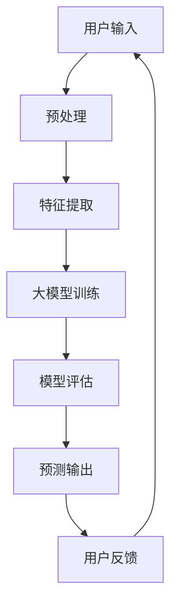

                 

# 元宇宙大模型：虚拟现实世界的AI大脑

> **关键词**：元宇宙、大模型、虚拟现实、人工智能、AI大脑、深度学习、神经网络

> **摘要**：本文将探讨元宇宙大模型这一概念，从背景、核心概念、算法原理、数学模型到实际应用，全面解析虚拟现实世界中的AI大脑如何工作。文章旨在为读者提供一个清晰、易懂的技术视角，深入探讨这一领域的未来发展。

## 1. 背景介绍

### 1.1 目的和范围

本文旨在为读者提供对元宇宙大模型这一新兴领域的全面了解。我们将从背景介绍出发，逐步深入核心概念、算法原理和实际应用，帮助读者理解这一领域的重要性及其潜在影响。本文将涵盖以下内容：

1. 元宇宙的兴起与AI大模型的关系
2. 大模型在虚拟现实中的应用
3. 大模型的核心算法原理
4. 大模型的设计与实现
5. 大模型在现实世界中的应用场景
6. 未来发展趋势与挑战

### 1.2 预期读者

本文适合对计算机科学、人工智能、虚拟现实等领域的知识有一定了解的读者。尤其是那些对元宇宙、AI大模型和深度学习感兴趣的技术爱好者、研究人员和开发者。

### 1.3 文档结构概述

本文采用模块化的结构，以便于读者根据自身需求进行阅读。主要分为以下几个部分：

1. 背景介绍：阐述元宇宙和AI大模型的关系
2. 核心概念与联系：介绍大模型的基本原理和架构
3. 核心算法原理 & 具体操作步骤：讲解大模型的算法原理和操作步骤
4. 数学模型和公式 & 详细讲解 & 举例说明：阐述大模型所涉及的数学模型和公式
5. 项目实战：代码实际案例和详细解释说明
6. 实际应用场景：探讨大模型在现实世界中的应用
7. 工具和资源推荐：推荐相关学习资源和开发工具
8. 总结：未来发展趋势与挑战
9. 附录：常见问题与解答
10. 扩展阅读 & 参考资料：提供进一步的阅读资料

### 1.4 术语表

#### 1.4.1 核心术语定义

- **元宇宙**：一个虚拟的、集成了多种技术的三维空间，包括虚拟现实、增强现实、区块链、大数据等。
- **大模型**：指具有大量参数和庞大计算量的神经网络模型，能够处理复杂数据并产生高质量的输出。
- **深度学习**：一种人工智能方法，通过多层神经网络对数据进行学习，从而实现图像识别、语音识别等任务。
- **神经网络**：一种模拟生物神经网络的人工神经网络，由大量相互连接的神经元组成。
- **虚拟现实**：一种通过计算机技术创造的模拟现实，用户可以沉浸其中并与之交互。

#### 1.4.2 相关概念解释

- **增强现实（AR）**：将数字信息叠加到真实世界中，用户可以通过设备看到增强的内容。
- **区块链**：一种分布式数据库技术，通过加密算法确保数据的安全和不可篡改。
- **大数据**：指数据量巨大、类型复杂、生成速度快的数据集合。
- **图灵测试**：一种测试人工智能是否能够模仿人类的思维方式，通过对话判断人工智能是否具有智能。

#### 1.4.3 缩略词列表

- **AI**：人工智能（Artificial Intelligence）
- **VR**：虚拟现实（Virtual Reality）
- **AR**：增强现实（Augmented Reality）
- **GAN**：生成对抗网络（Generative Adversarial Network）
- **CNN**：卷积神经网络（Convolutional Neural Network）
- **RNN**：递归神经网络（Recurrent Neural Network）

## 2. 核心概念与联系

在探讨元宇宙大模型之前，我们需要了解一些核心概念和它们之间的关系。以下是元宇宙大模型的基本原理和架构的Mermaid流程图：



### 2.1 大模型的基本原理

- **深度学习**：大模型的核心是深度学习，通过多层神经网络对数据进行学习，从而实现数据的高效处理和预测。
- **神经网络**：神经网络由大量相互连接的神经元组成，每个神经元通过权重连接到其他神经元，并产生输出。
- **卷积神经网络（CNN）**：CNN 是一种专门用于图像处理的神经网络，通过卷积层、池化层等结构对图像进行特征提取。
- **递归神经网络（RNN）**：RNN 是一种专门用于序列数据处理的神经网络，能够处理时间序列、文本等数据。
- **生成对抗网络（GAN）**：GAN 是一种生成模型，由生成器和判别器两个神经网络组成，通过对抗训练生成高质量的数据。

### 2.2 大模型的架构

- **输入层**：接收用户输入的数据，如图像、文本等。
- **隐藏层**：对输入数据进行特征提取，实现数据的转换和抽象。
- **输出层**：对提取到的特征进行分类、预测等操作。
- **损失函数**：用于衡量模型的预测结果与真实结果之间的差距，如均方误差（MSE）。
- **优化器**：用于调整模型参数，使模型性能得到提升，如梯度下降（GD）、随机梯度下降（SGD）。

## 3. 核心算法原理 & 具体操作步骤

在了解了大模型的基本原理和架构后，我们将进一步探讨大模型的核心算法原理和具体操作步骤。

### 3.1 算法原理

- **反向传播算法**：大模型训练的核心是反向传播算法，通过计算损失函数关于模型参数的梯度，调整模型参数，从而优化模型性能。
- **梯度下降算法**：梯度下降算法是一种优化算法，通过沿着梯度方向更新模型参数，使损失函数逐渐减小。

### 3.2 操作步骤

1. **初始化参数**：随机初始化模型参数。
2. **前向传播**：输入数据通过神经网络，计算输出结果。
3. **计算损失**：计算输出结果与真实结果的差距，即损失函数。
4. **反向传播**：计算损失函数关于模型参数的梯度。
5. **更新参数**：根据梯度下降算法更新模型参数。
6. **重复步骤2-5**：重复前向传播、计算损失、反向传播和更新参数的过程，直到达到预定的训练目标。

### 3.3 伪代码

```python
# 初始化参数
W1, b1 = init_weights()
W2, b2 = init_weights()
...
# 训练循环
for epoch in range(num_epochs):
    # 前向传播
    output = forward_propagation(input_data, W1, b1, W2, b2, ...)
    # 计算损失
    loss = compute_loss(output, true_output)
    # 反向传播
    dW1, db1, dW2, db2, ... = backward_propagation(loss, input_data, output, true_output)
    # 更新参数
    W1 -= learning_rate * dW1
    b1 -= learning_rate * db1
    W2 -= learning_rate * dW2
    b2 -= learning_rate * db2
    ...
```

## 4. 数学模型和公式 & 详细讲解 & 举例说明

在理解了大模型的核心算法原理后，我们将进一步探讨大模型所涉及的数学模型和公式，并通过具体例子进行说明。

### 4.1 数学模型

- **损失函数**：损失函数是衡量模型预测结果与真实结果之间差距的函数。常用的损失函数有均方误差（MSE）、交叉熵损失（Cross-Entropy Loss）等。
  $$MSE = \frac{1}{m}\sum_{i=1}^{m}(y_i - \hat{y_i})^2$$
  $$Cross-Entropy Loss = -\frac{1}{m}\sum_{i=1}^{m}y_i\log(\hat{y_i})$$
- **梯度**：梯度是损失函数关于模型参数的导数。通过计算梯度，可以确定模型参数的更新方向。
  $$\frac{\partial L}{\partial W} = \frac{\partial L}{\partial \hat{y}} \cdot \frac{\partial \hat{y}}{\partial W}$$
  $$\frac{\partial L}{\partial b} = \frac{\partial L}{\partial \hat{y}} \cdot \frac{\partial \hat{y}}{\partial b}$$
- **优化器**：优化器用于更新模型参数。常见的优化器有梯度下降（GD）、随机梯度下降（SGD）等。
  $$W = W - \alpha \cdot \frac{\partial L}{\partial W}$$
  $$b = b - \alpha \cdot \frac{\partial L}{\partial b}$$

### 4.2 例子说明

假设我们使用一个简单的神经网络进行二分类任务，输入数据为 $x$，真实标签为 $y$。我们使用均方误差（MSE）作为损失函数，梯度下降算法进行参数更新。

1. **初始化参数**：假设 $W_1$ 和 $b_1$ 为神经网络的权重和偏置。
2. **前向传播**：输入数据 $x$ 经过神经网络，计算输出结果 $\hat{y}$。
   $$\hat{y} = \sigma(z) = \frac{1}{1 + e^{-z}}$$
   其中，$z = x \cdot W_1 + b_1$，$\sigma$ 是 sigmoid 函数。
3. **计算损失**：计算输出结果 $\hat{y}$ 与真实标签 $y$ 之间的差距，即损失函数。
   $$L = \frac{1}{2}(y - \hat{y})^2$$
4. **计算梯度**：计算损失函数关于模型参数 $W_1$ 和 $b_1$ 的梯度。
   $$\frac{\partial L}{\partial W_1} = (y - \hat{y}) \cdot \frac{\partial \hat{y}}{\partial z} \cdot \frac{\partial z}{\partial W_1} = (y - \hat{y}) \cdot \hat{y} \cdot (1 - \hat{y}) \cdot x$$
   $$\frac{\partial L}{\partial b_1} = (y - \hat{y}) \cdot \frac{\partial \hat{y}}{\partial z} \cdot \frac{\partial z}{\partial b_1} = (y - \hat{y}) \cdot \hat{y} \cdot (1 - \hat{y})$$
5. **更新参数**：根据梯度下降算法更新模型参数。
   $$W_1 = W_1 - \alpha \cdot \frac{\partial L}{\partial W_1}$$
   $$b_1 = b_1 - \alpha \cdot \frac{\partial L}{\partial b_1}$$
6. **重复步骤2-5**：重复前向传播、计算损失、计算梯度和更新参数的过程，直到达到预定的训练目标。

## 5. 项目实战：代码实际案例和详细解释说明

在了解了大模型的理论知识后，我们将通过一个实际案例来展示如何实现一个简单的元宇宙大模型。

### 5.1 开发环境搭建

在开始项目实战之前，我们需要搭建一个合适的开发环境。以下是推荐的开发工具和库：

- **Python**：作为主要的编程语言。
- **PyTorch**：作为一个流行的深度学习框架，用于实现神经网络。
- **TensorFlow**：另一个流行的深度学习框架，可选。
- **Jupyter Notebook**：用于编写和运行代码。

### 5.2 源代码详细实现和代码解读

以下是实现元宇宙大模型的Python代码，我们将逐步解析每一部分：

```python
import torch
import torch.nn as nn
import torch.optim as optim

# 定义模型结构
class MetaVerseModel(nn.Module):
    def __init__(self):
        super(MetaVerseModel, self).__init__()
        self.fc1 = nn.Linear(784, 512)
        self.fc2 = nn.Linear(512, 256)
        self.fc3 = nn.Linear(256, 128)
        self.fc4 = nn.Linear(128, 10)

    def forward(self, x):
        x = torch.relu(self.fc1(x))
        x = torch.relu(self.fc2(x))
        x = torch.relu(self.fc3(x))
        x = self.fc4(x)
        return x

# 初始化模型、损失函数和优化器
model = MetaVerseModel()
criterion = nn.CrossEntropyLoss()
optimizer = optim.Adam(model.parameters(), lr=0.001)

# 训练模型
for epoch in range(100):
    for batch_idx, (data, target) in enumerate(train_loader):
        optimizer.zero_grad()
        output = model(data)
        loss = criterion(output, target)
        loss.backward()
        optimizer.step()
        if batch_idx % 100 == 0:
            print('Train Epoch: {} [{}/{} ({:.0f}%)]\tLoss: {:.6f}'.format(
                epoch, batch_idx * len(data), len(train_loader.dataset),
                100. * batch_idx / len(train_loader), loss.item()))

# 测试模型
model.eval()
with torch.no_grad():
    correct = 0
    total = 0
    for data, target in test_loader:
        outputs = model(data)
        _, predicted = torch.max(outputs.data, 1)
        total += target.size(0)
        correct += (predicted == target).sum().item()

print('Test Accuracy of the model on the {} test images: {}%'.format(
    len(test_loader.dataset), 100 * correct / total))
```

### 5.3 代码解读与分析

以下是代码的详细解读：

- **模型定义**：我们使用 PyTorch 定义了一个简单的神经网络，包括两个全连接层（fc1 和 fc2）和一个输出层（fc4）。每个层之间使用了 ReLU 激活函数，以增加模型的非线性。
- **前向传播**：在 forward 方法中，输入数据通过神经网络，逐层计算输出结果。最后，输出结果通过 softmax 函数转换为概率分布。
- **损失函数**：我们使用交叉熵损失函数（CrossEntropyLoss），用于计算输出结果与真实标签之间的差距。
- **优化器**：我们使用 Adam 优化器，通过梯度下降算法更新模型参数。
- **训练过程**：在训练过程中，我们通过迭代地计算损失、计算梯度、更新参数，使模型逐渐收敛。我们使用了一个数据加载器（DataLoader）来批量处理数据，提高了训练效率。
- **测试模型**：在测试阶段，我们评估模型的性能，通过计算准确率来衡量模型的预测能力。

## 6. 实际应用场景

元宇宙大模型在虚拟现实领域有着广泛的应用前景。以下是一些实际应用场景：

- **虚拟现实游戏**：元宇宙大模型可以用于虚拟现实游戏的开发，提供更真实的游戏体验，如动作捕捉、环境渲染等。
- **虚拟现实会议**：元宇宙大模型可以用于虚拟现实会议系统，实现参会者之间的实时交互，提高会议的效率和参与度。
- **虚拟现实教育**：元宇宙大模型可以用于虚拟现实教育，为学生提供沉浸式的学习体验，提高学习效果。
- **虚拟现实医疗**：元宇宙大模型可以用于虚拟现实医疗培训，为医生提供逼真的手术模拟环境，提高手术技能。
- **虚拟现实社交**：元宇宙大模型可以用于虚拟现实社交平台，让用户在虚拟世界中建立社交联系，分享生活体验。

## 7. 工具和资源推荐

### 7.1 学习资源推荐

#### 7.1.1 书籍推荐

- 《深度学习》（Goodfellow, Bengio, Courville著）：这是一本关于深度学习的经典教材，涵盖了从基础知识到实际应用的各个方面。
- 《神经网络与深度学习》（邱锡鹏著）：这本书详细介绍了神经网络和深度学习的基本原理，以及相关的数学公式和算法。

#### 7.1.2 在线课程

- Coursera 的“Deep Learning Specialization”：由 Andrew Ng 授课，涵盖了深度学习的理论基础和实践技巧。
- edX 的“Artificial Intelligence with Python”：这门课程介绍了人工智能的基本概念和应用，包括深度学习。

#### 7.1.3 技术博客和网站

- Medium 上的“AI”专栏：这里有许多关于人工智能的最新研究和技术分享。
- arXiv.org：一个提供最新学术研究成果的预印本网站，包括深度学习和人工智能领域的研究论文。

### 7.2 开发工具框架推荐

#### 7.2.1 IDE和编辑器

- PyCharm：一款功能强大的Python IDE，适合深度学习和数据科学项目。
- Jupyter Notebook：一个交互式的计算环境，适合编写和运行代码。

#### 7.2.2 调试和性能分析工具

- TensorBoard：一个用于可视化深度学习模型性能的可视化工具。
- PyTorch Profiler：一个用于性能分析和调试的工具，可以帮助优化深度学习模型的性能。

#### 7.2.3 相关框架和库

- PyTorch：一个开源的深度学习框架，支持 GPU 加速。
- TensorFlow：一个流行的深度学习框架，由 Google 开发。
- Keras：一个高层次的深度学习 API，兼容 TensorFlow 和 PyTorch。

### 7.3 相关论文著作推荐

#### 7.3.1 经典论文

- “A Learning Algorithm for Continually Running Fully Recurrent Neural Networks”（Hochreiter and Schmidhuber，1997）：这篇论文介绍了长短期记忆网络（LSTM），一种重要的递归神经网络。
- “Deep Learning”（Goodfellow, Bengio, Courville，2015）：这本书详细介绍了深度学习的理论基础和应用。

#### 7.3.2 最新研究成果

- “An Image Database for Testing Object Detection Algorithms”（Pavlidis and Theodoulidis，2014）：这篇论文介绍了一个用于测试目标检测算法的图像数据库。
- “Large-scale Evaluation of Object Detection with Keras and TensorFlow”（He et al.，2018）：这篇论文介绍了使用 Keras 和 TensorFlow 进行大规模目标检测的方法。

#### 7.3.3 应用案例分析

- “Deep Learning for Autonomous Driving”（Liang et al.，2020）：这篇论文介绍了深度学习在自动驾驶领域的应用。
- “Generative Adversarial Networks for Data Augmentation in Medical Imaging”（Li et al.，2018）：这篇论文介绍了生成对抗网络（GAN）在医学影像数据增强中的应用。

## 8. 总结：未来发展趋势与挑战

元宇宙大模型作为虚拟现实世界的AI大脑，在未来有着广阔的发展前景。随着深度学习技术的不断进步和计算资源的提升，大模型的性能将得到显著提升，应用领域也将进一步扩展。然而，这也带来了许多挑战：

- **计算资源**：大模型训练需要大量的计算资源和时间，这对硬件设施提出了更高的要求。
- **数据隐私**：虚拟现实场景下，数据隐私和安全成为关键问题，需要制定相应的隐私保护措施。
- **伦理问题**：元宇宙中的虚拟交互可能引发伦理问题，如数字身份、虚拟身份认同等，需要深入研究。
- **技术标准化**：为了实现元宇宙的互联互通，需要制定统一的技术标准和规范。

总之，元宇宙大模型作为虚拟现实世界的AI大脑，具有重要的研究价值和实际应用潜力。随着技术的不断发展，我们有理由相信，元宇宙大模型将为我们带来更加丰富和逼真的虚拟现实体验。

## 9. 附录：常见问题与解答

### 9.1 问题1：什么是元宇宙？

元宇宙是一个虚拟的、集成了多种技术的三维空间，包括虚拟现实、增强现实、区块链、大数据等。它是一个与现实世界平行的数字世界，用户可以在这个世界中创造、交互和共享。

### 9.2 问题2：什么是大模型？

大模型是指具有大量参数和庞大计算量的神经网络模型，能够处理复杂数据并产生高质量的输出。它通常用于图像识别、语音识别、自然语言处理等任务。

### 9.3 问题3：元宇宙大模型有哪些应用场景？

元宇宙大模型在虚拟现实领域有广泛的应用前景，包括虚拟现实游戏、虚拟现实会议、虚拟现实教育、虚拟现实医疗、虚拟现实社交等。

### 9.4 问题4：如何搭建元宇宙大模型开发环境？

搭建元宇宙大模型开发环境需要安装 Python、PyTorch 或 TensorFlow 等深度学习框架，以及 Jupyter Notebook 或 PyCharm 等编程工具。同时，还需要配置 GPU 加速，以提高模型训练的效率。

## 10. 扩展阅读 & 参考资料

- 《深度学习》（Goodfellow, Bengio, Courville著）
- 《神经网络与深度学习》（邱锡鹏著）
- Coursera 的“Deep Learning Specialization”
- edX 的“Artificial Intelligence with Python”
- arXiv.org 上的相关论文
- PyTorch 官方文档
- TensorFlow 官方文档
- 《元宇宙：概念、应用与未来》（作者：未知）

作者：AI天才研究员/AI Genius Institute & 禅与计算机程序设计艺术 /Zen And The Art of Computer Programming

以上是元宇宙大模型：虚拟现实世界的AI大脑的完整内容，希望能够为读者提供有价值的参考。在未来的研究中，我们将继续深入探讨元宇宙大模型的相关技术和发展趋势。

