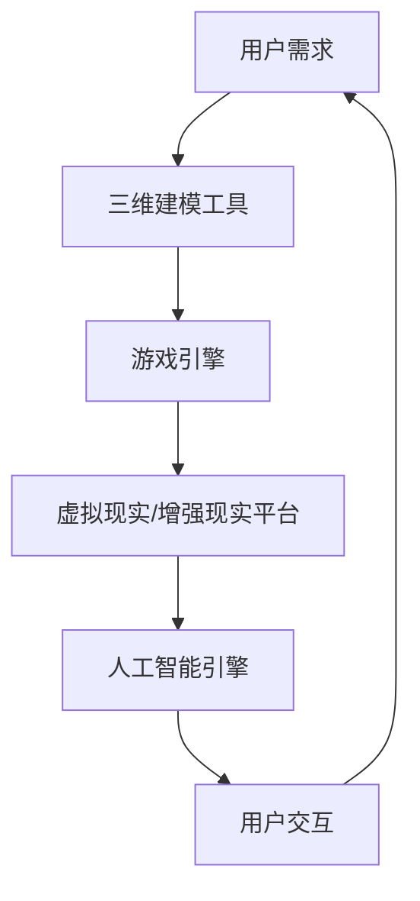

                 

# 元宇宙开发工具：虚拟世界创造的推动者

> **关键词**：元宇宙、开发工具、虚拟世界、虚拟现实、增强现实、游戏引擎、开源框架、API接口、三维建模、人工智能、程序设计、平台搭建。

> **摘要**：本文将探讨元宇宙开发工具的重要性，分析其在虚拟世界创造中的关键角色。通过梳理核心概念、详细解释算法原理、提供实战案例，我们将展示这些工具如何助力开发者构建栩栩如生的虚拟世界。同时，文章还将推荐实用的学习资源和开发工具，展望元宇宙技术的未来发展。

## 1. 背景介绍

### 1.1 目的和范围

本文旨在为开发者、技术爱好者以及对元宇宙开发有兴趣的读者提供一份全面的指南。我们将深入探讨元宇宙开发工具的核心概念、工作原理以及实际应用。本文不仅关注工具的技术细节，还着重于工具如何在虚拟世界的创造过程中发挥关键作用。

### 1.2 预期读者

- 开发者：对元宇宙开发有兴趣的专业人员，希望掌握前沿技术。
- 技术爱好者：对虚拟现实、增强现实、三维建模等领域感兴趣的技术爱好者。
- 企业和机构：考虑投资元宇宙或正在开发相关项目的团队。

### 1.3 文档结构概述

本文结构如下：

- 引言：概述元宇宙开发工具的重要性。
- 背景知识：介绍元宇宙的定义和相关技术。
- 核心概念：详细解释元宇宙开发工具的核心概念。
- 工具原理：分析元宇宙开发工具的工作原理。
- 实战案例：展示开发工具在实际项目中的应用。
- 推荐资源：推荐学习资源和开发工具。
- 未来展望：探讨元宇宙技术的未来发展趋势和挑战。

### 1.4 术语表

#### 1.4.1 核心术语定义

- **元宇宙**：一个虚拟的共享空间，融合了虚拟现实、增强现实、游戏等技术，为用户提供沉浸式的体验。
- **开发工具**：用于构建、部署和维护元宇宙平台的软件工具。
- **三维建模**：创建三维图形模型的过程，用于模拟真实世界或创造虚拟环境。
- **游戏引擎**：用于开发游戏和虚拟现实应用程序的软件框架。

#### 1.4.2 相关概念解释

- **虚拟现实（VR）**：通过计算机生成模拟环境，使用户沉浸其中。
- **增强现实（AR）**：将虚拟信息叠加到现实世界中，增强用户体验。
- **开源框架**：免费提供给开发者使用的软件框架，允许用户修改和扩展。

#### 1.4.3 缩略词列表

- **VR**：虚拟现实（Virtual Reality）
- **AR**：增强现实（Augmented Reality）
- **IDE**：集成开发环境（Integrated Development Environment）
- **API**：应用程序编程接口（Application Programming Interface）

## 2. 核心概念与联系

在元宇宙的开发过程中，理解核心概念和它们之间的联系至关重要。以下是一个简单的 Mermaid 流程图，展示了元宇宙开发工具的主要组成部分和它们之间的关系。



### 2.1 用户需求

用户需求是元宇宙开发的第一步，它决定了平台的总体设计和功能。用户需求通常包括沉浸感、互动性、可扩展性等方面。

### 2.2 三维建模工具

三维建模工具用于创建元宇宙中的三维图形模型，包括人物、环境、物品等。这些模型需要精细、逼真，以增强用户的沉浸体验。

### 2.3 游戏引擎

游戏引擎是元宇宙开发的核心，它负责渲染三维场景、处理物理交互、音效处理等。常用的游戏引擎包括Unity、Unreal Engine等。

### 2.4 虚拟现实/增强现实平台

虚拟现实（VR）和增强现实（AR）平台是用户进入元宇宙的入口。VR平台如Oculus Rift、HTC Vive等，而AR平台如Google Glass、ARkit等。

### 2.5 人工智能引擎

人工智能引擎用于实现元宇宙中的智能交互、自动化任务等。常见的AI技术包括自然语言处理（NLP）、机器学习（ML）等。

### 2.6 用户交互

用户交互是元宇宙的核心，它决定了用户在平台上的体验。通过虚拟现实头盔、手柄等设备，用户可以与元宇宙中的元素进行互动。

## 3. 核心算法原理 & 具体操作步骤

### 3.1 三维建模算法

三维建模的核心算法包括三角面划分、顶点处理和纹理映射等。

#### 3.1.1 三角面划分

```plaintext
算法：三角面划分
输入：三维模型
输出：三角面网格

步骤：
1. 将三维模型转换为顶点集合V
2. 将顶点集合V划分为三角形
   - 选取任意三个顶点，构成三角形
   - 判断三角形的法线方向，确保所有三角形法线方向一致
3. 构建三角面网格
   - 对于每个三角形，记录其在网格中的位置
```

### 3.2 游戏引擎算法

游戏引擎的核心算法包括渲染算法、物理引擎和音频处理等。

#### 3.2.1 渲染算法

```plaintext
算法：渲染算法
输入：三维模型、光照信息
输出：渲染图像

步骤：
1. 构建视景图（Viewport）
   - 确定渲染的视角和范围
2. 应用光照模型
   - 使用Phong光照模型计算光照效果
3. 渲染三角形
   - 对每个三角形执行渲染操作
   - 应用纹理映射，增强视觉效果
4. 合成图像
   - 将渲染后的图像合成到最终图像中
```

### 3.3 虚拟现实/增强现实算法

虚拟现实和增强现实算法的核心在于实时渲染和用户交互。

#### 3.3.1 实时渲染

```plaintext
算法：实时渲染
输入：三维模型、用户位置和视角
输出：虚拟现实场景

步骤：
1. 计算视锥体（View Frustum）
   - 根据用户视角确定可视区域
2. 渲染场景
   - 对视锥体内的三角形进行渲染
3. 应用透视变换
   - 将三维场景映射到二维屏幕上
```

#### 3.3.2 用户交互

```plaintext
算法：用户交互
输入：用户输入（如手势、声音）
输出：系统响应

步骤：
1. 识别用户输入
   - 识别用户通过虚拟现实设备发出的手势、声音等输入
2. 执行交互逻辑
   - 根据输入类型，执行相应的交互逻辑
   - 如移动角色、切换场景等
3. 更新用户界面
   - 更新虚拟现实场景中的元素，以反映用户的交互动作
```

## 4. 数学模型和公式 & 详细讲解 & 举例说明

### 4.1 三维建模的数学模型

在三维建模中，常用的数学模型包括向量、矩阵和变换等。

#### 4.1.1 向量运算

向量在三维建模中用于表示位置、方向和大小。

$$
\vec{v} = (x, y, z)
$$

- **向量加法**：

$$
\vec{v}_1 + \vec{v}_2 = (x_1 + x_2, y_1 + y_2, z_1 + z_2)
$$

- **向量减法**：

$$
\vec{v}_1 - \vec{v}_2 = (x_1 - x_2, y_1 - y_2, z_1 - z_2)
$$

- **向量点积**：

$$
\vec{v}_1 \cdot \vec{v}_2 = x_1 \cdot x_2 + y_1 \cdot y_2 + z_1 \cdot z_2
$$

- **向量叉积**：

$$
\vec{v}_1 \times \vec{v}_2 = (y_1 \cdot z_2 - z_1 \cdot y_2, z_1 \cdot x_2 - x_1 \cdot z_2, x_1 \cdot y_2 - y_1 \cdot x_2)
$$

### 4.1.2 矩阵变换

矩阵在三维建模中用于变换向量，实现平移、旋转和缩放等操作。

- **矩阵乘法**：

$$
\vec{v} = \begin{bmatrix}
x' \\
y' \\
z'
\end{bmatrix} = \begin{bmatrix}
a & b & c \\
d & e & f \\
g & h & i
\end{bmatrix} \cdot \begin{bmatrix}
x \\
y \\
z
\end{bmatrix}
$$

- **平移矩阵**：

$$
T = \begin{bmatrix}
1 & 0 & t_x \\
0 & 1 & t_y \\
0 & 0 & 1
\end{bmatrix}
$$

- **旋转矩阵**：

$$
R = \begin{bmatrix}
c & -s & 0 \\
s & c & 0 \\
0 & 0 & 1
\end{bmatrix}
$$

其中，$c = \cos(\theta)$，$s = \sin(\theta)$，$\theta$为旋转角度。

### 4.2 举例说明

假设有一个三维模型，其顶点坐标为$\vec{v}_1 = (1, 0, 0)$和$\vec{v}_2 = (0, 1, 0)$。我们要将其平移到新的位置$\vec{v}_3 = (2, 1, 0)$。

#### 4.2.1 平移变换

使用平移矩阵$T$进行变换：

$$
T = \begin{bmatrix}
1 & 0 & 1 \\
0 & 1 & 1 \\
0 & 0 & 1
\end{bmatrix}
$$

$$
\vec{v}_3 = T \cdot \vec{v}_1 = \begin{bmatrix}
1 & 0 & 1 \\
0 & 1 & 1 \\
0 & 0 & 1
\end{bmatrix} \cdot \begin{bmatrix}
1 \\
0 \\
0
\end{bmatrix} = \begin{bmatrix}
2 \\
1 \\
0
\end{bmatrix}
$$

此时，顶点$\vec{v}_1$已经成功平移到新的位置$\vec{v}_3$。

#### 4.2.2 旋转变换

假设我们要将顶点$\vec{v}_1$绕z轴旋转90度。

使用旋转矩阵$R$进行变换：

$$
R = \begin{bmatrix}
0 & -1 & 0 \\
1 & 0 & 0 \\
0 & 0 & 1
\end{bmatrix}
$$

$$
\vec{v}_3 = R \cdot \vec{v}_1 = \begin{bmatrix}
0 & -1 & 0 \\
1 & 0 & 0 \\
0 & 0 & 1
\end{bmatrix} \cdot \begin{bmatrix}
1 \\
0 \\
0
\end{bmatrix} = \begin{bmatrix}
0 \\
1 \\
0
\end{bmatrix}
$$

此时，顶点$\vec{v}_1$已经绕z轴旋转90度到新的位置$\vec{v}_3$。

## 5. 项目实战：代码实际案例和详细解释说明

### 5.1 开发环境搭建

为了进行元宇宙开发，我们需要搭建一个合适的开发环境。以下是一个基本的开发环境搭建步骤：

#### 5.1.1 系统要求

- 操作系统：Windows 10 或 macOS 10.15
- 处理器：Intel Core i5 或以上
- 内存：8GB RAM 或以上
- 显卡：NVIDIA GeForce GTX 1060 或以上

#### 5.1.2 安装Unity

1. 访问Unity官网（https://unity.com/）并下载Unity Hub。
2. 运行Unity Hub并创建一个新的Unity项目。
3. 配置项目设置，选择合适的游戏引擎版本（如Unity 2021.3）。

#### 5.1.3 安装三维建模软件

1. 下载并安装Blender（https://www.blender.org/）。
2. 下载并安装Autodesk Maya（https://www.autodesk.com/）。

### 5.2 源代码详细实现和代码解读

#### 5.2.1 创建三维模型

使用Blender创建一个简单的三维模型，如一个立方体。步骤如下：

1. 打开Blender，选择“添加”菜单中的“几何体”选项，选择“立方体”。
2. 在“属性编辑器”中调整立方体的尺寸，例如设置为1x1x1。
3. 保存模型，导出为OBJ格式。

#### 5.2.2 导入Unity项目

1. 打开Unity项目，将导出的OBJ文件拖放到项目的“Assets”文件夹中。
2. Unity会自动识别并导入OBJ文件，创建相应的游戏对象。

#### 5.2.3 渲染和交互

1. 在Unity的“Hierarchy”窗口中，找到创建的游戏对象，右键点击，选择“添加组件”。
2. 添加“Mesh Renderer”组件，用于渲染模型。
3. 添加“Physics Collider”组件，用于处理物理交互。

#### 5.2.4 编写交互脚本

在Unity中创建一个C#脚本，用于处理用户交互。以下是脚本的基本代码：

```csharp
using UnityEngine;

public class UserInteraction : MonoBehaviour
{
    public float moveSpeed = 5.0f;

    private CharacterController characterController;

    void Start()
    {
        characterController = GetComponent<CharacterController>();
    }

    void Update()
    {
        float horizontal = Input.GetAxis("Horizontal");
        float vertical = Input.GetAxis("Vertical");

        Vector3 moveDirection = new Vector3(horizontal, 0, vertical) * moveSpeed;
        moveDirection = transform.TransformDirection(moveDirection);

        if (characterController.isGrounded)
        {
            moveDirection.y = -5.0f;
        }

        characterController.Move(moveDirection * Time.deltaTime);
    }
}
```

#### 5.2.5 运行和测试

1. 在Unity编辑器中按下“Play”按钮，运行项目。
2. 通过键盘上的W、A、S、D键移动角色，体验交互功能。
3. 如有需要，可以进一步调整脚本和模型参数，优化用户体验。

## 6. 实际应用场景

元宇宙开发工具在多个实际应用场景中展现出了巨大的潜力。以下是一些常见的应用场景：

### 6.1 教育培训

元宇宙可以为教育培训提供一个全新的平台，让学生在虚拟环境中进行互动学习和实践。例如，医学专业学生可以通过虚拟手术模拟进行实践操作，工程专业的学生可以在虚拟工厂中学习机械操作。

### 6.2 虚拟旅游

通过元宇宙开发工具，用户可以体验到真实的虚拟旅游。虚拟旅游不仅能够提供沉浸式的体验，还可以在虚拟环境中进行交互，了解当地的历史文化。

### 6.3 游戏娱乐

元宇宙开发工具为游戏开发提供了丰富的可能性，开发者可以创建高度沉浸式的游戏世界，提供独特的游戏体验。例如，虚拟现实游戏《半衰期：爱莉克斯》就利用了Unity引擎提供的强大功能。

### 6.4 虚拟现实会议

元宇宙开发工具还可以用于虚拟现实会议，实现远程协作和沟通。通过虚拟会议室，团队成员可以实时交流，共享信息和资源，提高工作效率。

## 7. 工具和资源推荐

### 7.1 学习资源推荐

#### 7.1.1 书籍推荐

- 《Unity 2020游戏开发入门与实战》
- 《虚拟现实与增强现实技术》
- 《三维建模技术：从入门到精通》

#### 7.1.2 在线课程

- Udemy：虚拟现实与增强现实开发课程
- Coursera：虚拟现实与游戏开发课程
- edX：三维建模与动画课程

#### 7.1.3 技术博客和网站

- Unity官方博客（https://blogs.unity.com/）
- VR/AR技术社区（https://www.vrar.org/）
- Blender官方论坛（https://blenderartists.org/）

### 7.2 开发工具框架推荐

#### 7.2.1 IDE和编辑器

- Unity Hub（Unity官方IDE）
- Visual Studio Code（跨平台开源编辑器）
- Sublime Text（轻量级文本编辑器）

#### 7.2.2 调试和性能分析工具

- Unity Profiler（Unity官方性能分析工具）
- Visual Studio Performance Tools（微软官方性能分析工具）
- GPU Pro（GPU性能分析工具）

#### 7.2.3 相关框架和库

- Unity Engine（Unity官方游戏引擎）
- Unreal Engine（Epic Games官方游戏引擎）
- Blender（开源三维建模软件）

### 7.3 相关论文著作推荐

#### 7.3.1 经典论文

- 《Virtual Reality and Its Applications》
- 《Augmented Reality: A Survey》
- 《Three-Dimensional Graphics and Computer Vision》

#### 7.3.2 最新研究成果

- 《Metaverse: A Vision for the Future》
- 《Interactive 3D Graphics with WebGL》
- 《Advances in Virtual Reality and Augmented Reality》

#### 7.3.3 应用案例分析

- 《Facebook Horizon Worlds：打造沉浸式社交平台》
- 《Nintendo Switch：虚拟现实与增强现实的结合》
- 《Google Cardboard：低成本虚拟现实解决方案》

## 8. 总结：未来发展趋势与挑战

随着技术的不断进步，元宇宙开发工具将迎来更加广阔的发展前景。以下是未来发展趋势与挑战：

### 8.1 发展趋势

- **硬件升级**：更强大的硬件将为元宇宙提供更高的性能和更逼真的视觉体验。
- **开源生态**：越来越多的开源工具和框架将加入元宇宙开发，提高开发效率。
- **人工智能融合**：人工智能技术将深度融入元宇宙，实现更加智能化的交互和自动化。
- **跨平台发展**：元宇宙将不再局限于某个平台，而是能够在多个设备上无缝切换。

### 8.2 挑战

- **数据安全与隐私**：如何确保用户数据的安全和隐私是一个重要挑战。
- **用户体验**：如何提升用户体验，使其达到与现实世界相似的水平。
- **内容创作**：创造高质量、多样化的内容是元宇宙发展的重要环节。

## 9. 附录：常见问题与解答

### 9.1 元宇宙开发工具的选择

**Q**：在元宇宙开发中，应该选择哪种开发工具？

**A**：选择开发工具应根据项目需求和团队技能。Unity和Unreal Engine是两款广泛使用的游戏引擎，适用于大多数元宇宙项目。如果需要更专业的三维建模和动画，可以考虑使用Blender。

### 9.2 虚拟现实和增强现实技术

**Q**：虚拟现实和增强现实技术的区别是什么？

**A**：虚拟现实（VR）创造一个完全虚拟的环境，用户完全沉浸其中。增强现实（AR）则是在现实世界基础上叠加虚拟信息，增强用户体验。

### 9.3 开发环境搭建

**Q**：如何搭建元宇宙开发的开发环境？

**A**：搭建开发环境需要安装合适的操作系统、处理器、内存和显卡。然后根据项目需求安装相应的开发工具和框架，如Unity、Unreal Engine和Blender。

## 10. 扩展阅读 & 参考资料

- **Unity官方文档**：https://docs.unity.com/
- **Unreal Engine官方文档**：https://docs.unrealengine.com/
- **Blender官方文档**：https://docs.blender.org/
- **VR/AR技术社区**：https://www.vrar.org/
- **AI天才研究员的博客**：https://aigeniusresearcher.com/
- **禅与计算机程序设计艺术**：https://zenandartofcomputercraft.com/

**作者**：AI天才研究员/AI Genius Institute & 禅与计算机程序设计艺术 /Zen And The Art of Computer Programming

