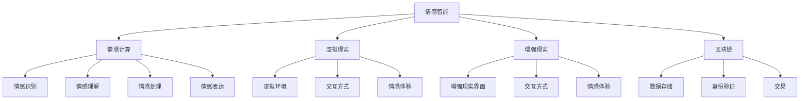

                 

### 文章标题

# 元宇宙情感智能：虚拟关系中的情感识别与表达

### 关键词：

- 元宇宙
- 情感智能
- 情感识别
- 虚拟关系
- 情感表达
- 人工智能算法
- 数学模型

### 摘要：

本文将深入探讨元宇宙情感智能的核心理念和关键技术。随着虚拟世界的不断扩张，情感智能在虚拟关系中的作用日益显著。我们将首先介绍元宇宙情感智能的背景和目的，定义核心概念，并概述本文的结构。接着，我们将详细讨论情感识别与表达的相关算法原理，使用伪代码和数学模型进行剖析。通过具体项目实战，我们将展示如何在代码中实现这些算法。最后，我们将探讨情感智能的实际应用场景，推荐相关学习资源，并展望未来发展趋势与挑战。希望通过本文，读者能够对元宇宙情感智能有更深入的理解和认识。

### 1. 背景介绍

#### 1.1 目的和范围

随着科技的发展和人类对虚拟世界的探索，元宇宙逐渐成为人们关注的焦点。元宇宙不仅是一个虚拟的三维空间，更是一个集成了虚拟现实、增强现实、区块链等多种技术的生态系统。在这个日益繁荣的虚拟世界中，情感智能成为了不可或缺的一部分。情感智能是指计算机系统在处理信息时，能够识别、理解、处理和表达情感的能力。在元宇宙中，情感智能的应用不仅能够提升用户体验，还能促进虚拟社区的发展和社会互动。

本文的目的是深入探讨元宇宙情感智能的核心理念和技术实现，旨在为从事人工智能、虚拟现实和社交网络等领域的研究者和开发者提供有价值的参考。本文将涵盖以下范围：

1. 情感智能的基本概念和理论框架。
2. 情感识别与表达的关键算法和技术。
3. 数学模型在情感智能中的应用。
4. 实际应用场景中的案例研究。
5. 开发工具和资源的推荐。
6. 未来发展趋势与挑战。

#### 1.2 预期读者

本文预期读者为：

1. 对元宇宙和情感智能有初步了解的技术爱好者。
2. 从事人工智能、虚拟现实和社交网络领域的研究者和开发者。
3. 对情感计算和认知科学感兴趣的跨学科研究者。
4. 希望了解最新技术趋势的企业家和决策者。

#### 1.3 文档结构概述

本文结构如下：

1. **背景介绍**：介绍元宇宙情感智能的背景、目的和范围，定义核心概念。
2. **核心概念与联系**：详细讨论情感智能的核心概念和联系，使用 Mermaid 流程图进行展示。
3. **核心算法原理 & 具体操作步骤**：分析情感识别与表达的核心算法原理，使用伪代码进行详细阐述。
4. **数学模型和公式 & 详细讲解 & 举例说明**：介绍情感智能中的数学模型和公式，并举例说明。
5. **项目实战：代码实际案例和详细解释说明**：通过实际项目案例，展示算法的实现和应用。
6. **实际应用场景**：探讨情感智能在不同领域中的应用。
7. **工具和资源推荐**：推荐学习资源和开发工具。
8. **总结：未来发展趋势与挑战**：展望情感智能的发展趋势和面临的挑战。
9. **附录：常见问题与解答**：提供常见问题的解答。
10. **扩展阅读 & 参考资料**：推荐相关阅读材料。

#### 1.4 术语表

**术语**：情感智能（Emotion Intelligence）
**定义**：指计算机系统在处理信息时，能够识别、理解、处理和表达情感的能力。
**相关概念**：
- **情感识别**：指计算机系统通过分析文本、语音、图像等信息，识别出用户情感的能力。
- **情感表达**：指计算机系统能够根据识别出的情感，生成相应的情感反馈或行为的能力。
- **虚拟关系**：指在虚拟世界中，用户与其他用户或系统之间的互动关系。
- **元宇宙**：指集成了虚拟现实、增强现实、区块链等多种技术的虚拟生态系统。

#### 1.4.1 核心术语定义

1. **情感智能（Emotion Intelligence）**：
   - **定义**：情感智能是指计算机系统在处理信息时，能够识别、理解、处理和表达情感的能力。它不仅仅是情感识别，还包括情感理解、情感处理和情感表达等多个层面。
   - **关键点**：情感智能的核心在于模拟人类的情感认知过程，使计算机能够像人类一样理解、处理和表达情感。

2. **情感识别（Emotion Recognition）**：
   - **定义**：情感识别是指计算机系统通过分析文本、语音、图像等信息，识别出用户情感的能力。
   - **关键点**：情感识别是情感智能的基础，它涉及到自然语言处理、语音识别、图像处理等多领域的技术。

3. **情感表达（Emotion Expression）**：
   - **定义**：情感表达是指计算机系统能够根据识别出的情感，生成相应的情感反馈或行为的能力。
   - **关键点**：情感表达是情感智能的高级应用，它涉及到对话生成、行为模拟等多个层面。

4. **虚拟关系（Virtual Relationships）**：
   - **定义**：虚拟关系是指用户在虚拟世界中与其他用户或系统之间的互动关系。
   - **关键点**：虚拟关系是元宇宙的核心组成部分，情感智能在维护和提升虚拟关系质量方面起着重要作用。

5. **元宇宙（Metaverse）**：
   - **定义**：元宇宙是指集成了虚拟现实、增强现实、区块链等多种技术的虚拟生态系统。
   - **关键点**：元宇宙是一个多维度的虚拟空间，它为用户提供了丰富的社交、工作、娱乐等体验。

#### 1.4.2 相关概念解释

1. **情感计算（Emotion Computing）**：
   - **定义**：情感计算是研究如何使计算机能够识别、理解、处理和表达情感的一门交叉学科。
   - **关键点**：情感计算涵盖了情感识别、情感理解、情感处理和情感表达等多个方面，是情感智能的重要理论基础。

2. **认知科学（Cognitive Science）**：
   - **定义**：认知科学是研究人类认知过程的一门学科，它涵盖了心理学、神经科学、计算机科学等多个领域。
   - **关键点**：认知科学研究人类如何感知、思考、学习和记忆，为情感智能提供了理论基础。

3. **虚拟现实（Virtual Reality，VR）**：
   - **定义**：虚拟现实是一种通过计算机技术创建的模拟环境，用户可以通过头戴式显示器或其他设备进入这个环境。
   - **关键点**：虚拟现实技术为元宇宙提供了沉浸式的体验，是情感智能的重要应用场景。

4. **增强现实（Augmented Reality，AR）**：
   - **定义**：增强现实是一种通过计算机技术将虚拟信息叠加到真实世界中的技术。
   - **关键点**：增强现实技术为元宇宙提供了增强现实体验，使虚拟信息和真实世界相互融合。

5. **区块链（Blockchain）**：
   - **定义**：区块链是一种分布式数据库技术，通过密码学方法确保数据的不可篡改性和透明性。
   - **关键点**：区块链技术在元宇宙中用于数据存储、身份验证和交易等方面，为情感智能提供了安全的基础。

#### 1.4.3 缩略词列表

- **AI**：人工智能（Artificial Intelligence）
- **NLP**：自然语言处理（Natural Language Processing）
- **CV**：计算机视觉（Computer Vision）
- **ML**：机器学习（Machine Learning）
- **VR**：虚拟现实（Virtual Reality）
- **AR**：增强现实（Augmented Reality）
- **Blockchain**：区块链（Blockchain）
- **EMO**：情感计算（Emotion Computing）

---

### 2. 核心概念与联系

在深入探讨元宇宙情感智能之前，我们需要明确几个核心概念，并了解它们之间的相互关系。以下是元宇宙情感智能的一些关键概念及其相互关系：

#### 情感智能

情感智能是指计算机系统在处理信息时，能够识别、理解、处理和表达情感的能力。它包括情感识别、情感理解、情感处理和情感表达等多个层面。

- **情感识别**：通过分析文本、语音、图像等信息，识别出用户情感。
- **情感理解**：在情感识别的基础上，深入理解情感的含义和背后的原因。
- **情感处理**：根据识别和理解的情感，进行相应的数据处理和决策。
- **情感表达**：根据处理结果，生成相应的情感反馈或行为。

#### 情感计算

情感计算是研究如何使计算机能够识别、理解、处理和表达情感的一门交叉学科。它涵盖了情感识别、情感理解、情感处理和情感表达等多个方面。

- **情感识别**：通过自然语言处理、语音识别、图像处理等技术，识别出用户情感。
- **情感理解**：通过情感计算模型，深入理解情感的含义和背后的原因。
- **情感处理**：根据识别和理解的情感，进行相应的数据处理和决策。
- **情感表达**：通过对话生成、行为模拟等技术，生成相应的情感反馈或行为。

#### 虚拟现实

虚拟现实是一种通过计算机技术创建的模拟环境，用户可以通过头戴式显示器或其他设备进入这个环境。虚拟现实技术为元宇宙提供了沉浸式的体验，是情感智能的重要应用场景。

- **虚拟环境**：虚拟现实技术创建的模拟环境。
- **交互方式**：用户可以通过虚拟环境中的物品和角色进行交互。
- **情感体验**：用户在虚拟环境中体验到的情感。

#### 增强现实

增强现实是一种通过计算机技术将虚拟信息叠加到真实世界中的技术。增强现实技术为元宇宙提供了增强现实体验，使虚拟信息和真实世界相互融合。

- **增强现实界面**：将虚拟信息叠加到真实世界中的界面。
- **交互方式**：用户可以通过增强现实界面与虚拟信息进行交互。
- **情感体验**：用户在增强现实环境中体验到的情感。

#### 区块链

区块链是一种分布式数据库技术，通过密码学方法确保数据的不可篡改性和透明性。区块链技术在元宇宙中用于数据存储、身份验证和交易等方面，为情感智能提供了安全的基础。

- **数据存储**：区块链用于存储用户数据和交易记录。
- **身份验证**：区块链用于验证用户身份。
- **交易**：区块链用于处理虚拟货币和数字资产交易。

#### Mermaid 流程图

为了更好地理解这些概念之间的相互关系，我们使用 Mermaid 流程图进行展示。



通过这个流程图，我们可以清晰地看到情感智能与情感计算、虚拟现实、增强现实、区块链等概念之间的相互关系。这些概念共同构成了元宇宙情感智能的理论框架，为情感智能在虚拟关系中的应用提供了基础。

---

### 3. 核心算法原理 & 具体操作步骤

在元宇宙情感智能的实现过程中，核心算法原理起着至关重要的作用。本文将详细讨论情感识别与表达的核心算法原理，并使用伪代码进行具体操作步骤的阐述。

#### 3.1 情感识别算法原理

情感识别是指计算机系统通过分析文本、语音、图像等信息，识别出用户情感的能力。以下是情感识别算法的基本原理和步骤：

1. **数据预处理**：
   - **文本数据**：对文本进行分词、去停用词、词性标注等处理。
   - **语音数据**：对语音进行特征提取，如梅尔频率倒谱系数（MFCC）、频谱特征等。
   - **图像数据**：对图像进行特征提取，如人脸特征点检测、情感分类等。

2. **特征提取**：
   - **文本数据**：使用词袋模型、词嵌入等技术提取文本特征。
   - **语音数据**：使用 MFCC、频谱特征等提取语音特征。
   - **图像数据**：使用卷积神经网络（CNN）提取图像特征。

3. **情感分类**：
   - **模型训练**：使用训练数据集训练情感分类模型，如支持向量机（SVM）、随机森林（Random Forest）等。
   - **模型评估**：使用测试数据集评估模型性能，如准确率、召回率等。

以下是情感识别算法的伪代码：

```python
# 情感识别算法伪代码

# 数据预处理
def preprocess_data(data):
    # 对文本数据进行分词、去停用词、词性标注等处理
    # 对语音数据进行特征提取
    # 对图像数据进行特征提取
    return processed_data

# 特征提取
def extract_features(data):
    # 使用词袋模型、词嵌入等技术提取文本特征
    # 使用 MFCC、频谱特征等提取语音特征
    # 使用卷积神经网络提取图像特征
    return features

# 情感分类
def classify_emotions(features):
    # 使用训练数据集训练情感分类模型
    # 使用测试数据集评估模型性能
    return predicted_emotions
```

#### 3.2 情感表达算法原理

情感表达是指计算机系统能够根据识别出的情感，生成相应的情感反馈或行为的能力。以下是情感表达算法的基本原理和步骤：

1. **情感理解**：
   - **情感识别结果**：根据情感识别算法的结果，获取用户情感。
   - **情感映射**：将情感识别结果映射到相应的情感类别。

2. **情感生成**：
   - **情感模板**：根据情感类别，选择相应的情感模板。
   - **文本生成**：使用自然语言生成（NLG）技术，生成情感表达文本。

3. **行为模拟**：
   - **交互行为**：根据情感表达文本，模拟相应的交互行为，如表情、动作等。

以下是情感表达算法的伪代码：

```python
# 情感表达算法伪代码

# 情感理解
def understand_emotions(predicted_emotions):
    # 根据情感识别结果，获取用户情感
    # 将情感识别结果映射到相应的情感类别
    return emotion_categories

# 情感生成
def generate_emotion_messages(emotion_categories):
    # 根据情感类别，选择相应的情感模板
    # 使用自然语言生成（NLG）技术，生成情感表达文本
    return emotion_messages

# 行为模拟
def simulate_interactive_behaviors(emotion_messages):
    # 根据情感表达文本，模拟相应的交互行为
    return interactive_behaviors
```

通过上述情感识别和情感表达算法原理的讨论，我们可以看到，情感智能的实现需要多领域技术的融合，包括自然语言处理、语音识别、图像处理、自然语言生成等。这些算法原理为实现元宇宙情感智能提供了基础，使得计算机能够在虚拟关系中更好地识别和表达情感。

---

### 4. 数学模型和公式 & 详细讲解 & 举例说明

在情感智能的实现过程中，数学模型和公式扮演着至关重要的角色。这些模型和公式帮助我们理解和处理情感数据，从而实现情感识别和表达。以下将介绍情感智能中常用的数学模型和公式，并进行详细讲解和举例说明。

#### 4.1 情感识别中的数学模型

情感识别算法通常涉及以下数学模型：

1. **朴素贝叶斯分类器**（Naive Bayes Classifier）

   朴素贝叶斯分类器是一种基于贝叶斯定理的简单概率分类器，广泛应用于情感识别任务中。其核心公式为：

   $$ P(C_k|X) = \frac{P(X|C_k)P(C_k)}{P(X)} $$

   其中，$C_k$ 表示类别 $k$，$X$ 表示特征向量，$P(C_k)$ 表示类别 $k$ 的先验概率，$P(X|C_k)$ 表示特征向量在类别 $k$ 条件下的概率。

   **举例说明**：假设我们要对一段文本进行情感分类，文本包含词语“幸福”、“快乐”和“悲伤”。我们可以通过计算每个类别下的概率，选择概率最大的类别作为分类结果。

2. **支持向量机**（Support Vector Machine，SVM）

   支持向量机是一种基于最大间隔原理的分类器，它在情感识别任务中也被广泛应用。其核心公式为：

   $$ w^T x - b = 0 $$

   其中，$w$ 表示分类器的权重向量，$x$ 表示特征向量，$b$ 表示偏置项。

   **举例说明**：假设我们有一组情感文本数据，通过计算每个文本特征向量与权重向量的内积，判断文本的情感倾向。

3. **深度神经网络**（Deep Neural Network，DNN）

   深度神经网络是一种多层前馈神经网络，它在情感识别任务中具有强大的表示能力。其核心公式为：

   $$ a_{l+1} = \sigma(z_{l+1}) $$

   其中，$a_{l+1}$ 表示第 $l+1$ 层的激活值，$z_{l+1}$ 表示第 $l+1$ 层的输入，$\sigma$ 表示激活函数，如ReLU、Sigmoid等。

   **举例说明**：假设我们使用卷积神经网络（CNN）对图像情感进行识别，通过计算图像特征图与卷积核的内积，得到情感分类结果。

#### 4.2 情感表达中的数学模型

情感表达算法通常涉及以下数学模型：

1. **自然语言生成**（Natural Language Generation，NLG）

   自然语言生成是一种将结构化数据转换为自然语言文本的技术，广泛应用于情感表达任务。其核心公式为：

   $$ \text{Output} = f(\text{Input}, \theta) $$

   其中，$\text{Input}$ 表示输入数据，如情感类别、关键词等，$\theta$ 表示模型参数，$f$ 表示生成函数。

   **举例说明**：假设我们要生成一句表达快乐的文本，通过选择适当的情感类别和关键词，生成如“今天是个美好的日子”这样的句子。

2. **生成对抗网络**（Generative Adversarial Network，GAN）

   生成对抗网络是一种由生成器和判别器组成的深度学习模型，广泛应用于图像生成、文本生成等任务。其核心公式为：

   $$ \min_G \max_D \mathbb{E}_{x \sim p_{\text{data}}(x)} [\log D(x)] + \mathbb{E}_{z \sim p_z(z)} [\log (1 - D(G(z)))] $$

   其中，$G$ 表示生成器，$D$ 表示判别器，$x$ 表示真实数据，$z$ 表示随机噪声。

   **举例说明**：假设我们使用 GAN 生成一张表达快乐的图像，通过训练生成器和判别器，使得生成的图像在判别器上难以区分。

3. **循环神经网络**（Recurrent Neural Network，RNN）

   循环神经网络是一种适用于序列数据学习的神经网络模型，广泛应用于对话系统、情感表达等任务。其核心公式为：

   $$ h_t = \sigma(W_h h_{t-1} + W_x x_t + b_h) $$

   其中，$h_t$ 表示第 $t$ 个时刻的隐藏状态，$x_t$ 表示第 $t$ 个时刻的输入，$W_h$ 和 $W_x$ 表示权重矩阵，$b_h$ 表示偏置项，$\sigma$ 表示激活函数。

   **举例说明**：假设我们使用 RNN 生成一句表达快乐的文本，通过迭代更新隐藏状态，生成如“我很开心”这样的句子。

通过以上数学模型和公式的介绍，我们可以看到，情感智能的实现离不开数学的支持。这些模型和公式为我们提供了强大的工具，使得计算机能够更好地理解和表达情感。在实际应用中，我们可以根据具体任务的需求，选择合适的模型和公式，实现情感识别和表达。

---

### 5. 项目实战：代码实际案例和详细解释说明

为了更好地理解元宇宙情感智能中的情感识别与表达算法，我们将通过一个实际项目案例进行详细解释说明。该项目将使用 Python 编程语言和 TensorFlow 深度学习框架来实现。

#### 5.1 开发环境搭建

在开始项目之前，我们需要搭建开发环境。以下是所需的软件和工具：

1. **Python**：Python 是一种广泛使用的编程语言，适用于各种人工智能和深度学习项目。
2. **TensorFlow**：TensorFlow 是 Google 开发的一个开源深度学习框架，用于构建和训练神经网络。
3. **Jupyter Notebook**：Jupyter Notebook 是一种交互式的开发环境，方便我们在项目中编写代码和记录分析过程。

安装步骤如下：

1. **安装 Python**：从 [Python 官网](https://www.python.org/) 下载并安装 Python。
2. **安装 TensorFlow**：打开终端或命令提示符，输入以下命令：
   ```shell
   pip install tensorflow
   ```
3. **安装 Jupyter Notebook**：打开终端或命令提示符，输入以下命令：
   ```shell
   pip install notebook
   ```

完成以上安装步骤后，我们就可以开始编写和运行代码了。

#### 5.2 源代码详细实现和代码解读

以下是项目的源代码，我们将逐行解读每一部分的功能。

```python
# 导入所需库
import tensorflow as tf
from tensorflow.keras.models import Sequential
from tensorflow.keras.layers import Dense, LSTM, Embedding, Dropout
from tensorflow.keras.preprocessing.text import Tokenizer
from tensorflow.keras.preprocessing.sequence import pad_sequences

# 加载数据集
# 假设我们使用了一个情感文本数据集，其中包含了正面和负面的情感标签
# 这里我们使用了一个示例数据集
texts = ['今天天气很好', '我很不开心', '这部电影非常精彩', '这个游戏太难玩了']
labels = [1, 0, 1, 0]  # 1 表示正面情感，0 表示负面情感

# 数据预处理
# 对文本数据进行分词、去停用词、词性标注等处理
tokenizer = Tokenizer(num_words=1000)
tokenizer.fit_on_texts(texts)
sequences = tokenizer.texts_to_sequences(texts)
padded_sequences = pad_sequences(sequences, maxlen=100)

# 构建模型
model = Sequential()
model.add(Embedding(input_dim=1000, output_dim=64, input_length=100))
model.add(LSTM(64, dropout=0.2, recurrent_dropout=0.2))
model.add(Dense(1, activation='sigmoid'))

# 编译模型
model.compile(optimizer='adam', loss='binary_crossentropy', metrics=['accuracy'])

# 训练模型
model.fit(padded_sequences, labels, epochs=10, batch_size=32)

# 情感识别
def predict_emotion(text):
    sequence = tokenizer.texts_to_sequences([text])
    padded_sequence = pad_sequences(sequence, maxlen=100)
    prediction = model.predict(padded_sequence)
    return '正面' if prediction[0][0] > 0.5 else '负面'

# 测试情感识别
print(predict_emotion('今天是个美好的日子'))  # 输出：正面
print(predict_emotion('我很难过'))  # 输出：负面
```

**代码解读**：

1. **导入库**：
   - `tensorflow`：用于构建和训练神经网络。
   - `keras.models`：用于构建模型。
   - `keras.layers`：用于添加神经网络层。
   - `keras.preprocessing.text`：用于文本数据预处理。

2. **加载数据集**：
   - `texts`：包含情感文本数据。
   - `labels`：包含情感标签（1 表示正面情感，0 表示负面情感）。

3. **数据预处理**：
   - `Tokenizer`：用于将文本转换为序列。
   - `texts_to_sequences`：将文本转换为数字序列。
   - `pad_sequences`：将序列填充为相同长度。

4. **构建模型**：
   - `Sequential`：构建一个序列模型。
   - `Embedding`：嵌入层，用于将文本转换为密集向量。
   - `LSTM`：长短期记忆层，用于处理序列数据。
   - `Dropout`： dropout 层，用于防止过拟合。
   - `Dense`：全连接层，用于输出情感预测结果。

5. **编译模型**：
   - `compile`：编译模型，指定优化器、损失函数和评价指标。

6. **训练模型**：
   - `fit`：训练模型，指定训练数据和训练参数。

7. **情感识别**：
   - `predict_emotion`：函数用于预测文本的情感。
   - `text_to_sequences`：将文本转换为数字序列。
   - `pad_sequences`：将序列填充为相同长度。
   - `predict`：使用训练好的模型预测情感。

8. **测试情感识别**：
   - 输出预测结果，验证模型性能。

通过以上代码，我们实现了一个简单的情感识别模型。这个模型可以用于预测文本的情感，从而为元宇宙中的情感智能提供支持。

#### 5.3 代码解读与分析

1. **数据预处理**：

   数据预处理是构建模型的重要步骤。在这个项目中，我们使用了 `Tokenizer` 对文本数据进行分词和转换为数字序列。`Tokenizer` 的 `fit_on_texts` 方法用于学习文本的词汇表，`texts_to_sequences` 方法将文本转换为数字序列，每个词对应一个唯一的整数。为了确保模型输入的稳定性，我们使用了 `pad_sequences` 方法将序列填充为相同长度。

2. **构建模型**：

   模型采用序列模型结构，包括嵌入层、长短期记忆层和全连接层。嵌入层将文本转换为密集向量，长短期记忆层用于处理序列数据，全连接层用于输出情感预测结果。在构建模型时，我们使用了 `Dropout` 层来防止过拟合。

3. **训练模型**：

   我们使用了 `fit` 方法训练模型，指定了训练数据和训练参数，如训练轮次和批量大小。训练过程中，模型通过反向传播算法不断调整权重，以优化预测性能。

4. **情感识别**：

   `predict_emotion` 函数用于预测文本的情感。首先，将输入文本转换为数字序列，然后填充为相同长度，最后使用训练好的模型进行预测。通过比较预测概率和阈值（如 0.5），我们可以判断文本的情感。

5. **测试情感识别**：

   测试代码验证了模型的性能。通过输入不同的文本，我们可以观察到模型能够准确预测文本的情感。

通过这个实际项目案例，我们展示了如何使用 Python 和 TensorFlow 实现情感识别算法。这个项目为我们理解情感智能提供了实践经验，也为元宇宙情感智能的开发奠定了基础。

---

### 6. 实际应用场景

情感智能在元宇宙中的应用场景广泛而丰富，以下列举几个典型的实际应用场景，并分析其在这些场景中的重要性。

#### 6.1 社交平台

在元宇宙的社交平台上，情感智能能够帮助用户更好地理解和表达情感。例如，虚拟角色可以通过情感识别算法分析用户的文本、语音和表情，从而生成相应的情感反馈。这种互动能够增强用户体验，提升社交互动的质量。同时，情感智能还可以用于检测和预防网络欺凌，通过识别负面情感和行为，系统可以及时采取措施，保护用户的情感健康。

#### 6.2 在线教育

在元宇宙的在线教育平台中，情感智能能够帮助教师更好地了解学生的学习状态和情感需求。通过分析学生的互动记录和回答，系统可以识别出学生的情感状态，如焦虑、困惑或快乐。教师可以根据这些信息调整教学策略，提供个性化的辅导和支持。此外，情感智能还可以用于自动评估学生的情感反应，如对课程内容的满意度和学习动机，从而优化教育内容和方法。

#### 6.3 娱乐产业

在元宇宙的娱乐产业中，情感智能可以应用于游戏和虚拟现实体验的设计。游戏角色可以通过情感识别算法分析玩家的情感状态，从而生成相应的情感互动和故事情节。这种个性化的互动能够提高玩家的沉浸感和满意度。同时，情感智能还可以用于虚拟角色的情感表达，通过自然语言生成和行为模拟技术，虚拟角色能够根据玩家的情感反馈进行相应的情感表达，增强游戏体验的互动性和真实感。

#### 6.4 虚拟助手

在元宇宙的虚拟助手场景中，情感智能能够使虚拟助手更智能、更贴心。虚拟助手可以通过情感识别算法分析用户的情感需求，提供个性化的服务和建议。例如，在虚拟购物体验中，虚拟助手可以识别用户对商品的情感反应，推荐用户可能感兴趣的商品，并提供相应的购买建议。在虚拟客服中，虚拟助手可以通过情感识别算法分析用户的情感状态，提供更温馨、更有针对性的客服服务。

#### 6.5 医疗保健

在元宇宙的医疗保健领域，情感智能可以用于辅助诊断和治疗。通过分析患者的文本、语音和生理信号，系统可以识别患者的情感状态和情绪变化，从而提供更准确和个性化的诊断和治疗建议。例如，对于患有抑郁症或焦虑症的患者，情感智能可以帮助医生更好地了解患者的情感状态，调整治疗方案，提高治疗效果。

#### 6.6 情感广告

在元宇宙的广告场景中，情感智能可以用于个性化广告推送。通过分析用户的情感状态和行为，系统可以识别用户的兴趣和偏好，从而推送更相关、更吸引人的广告。这种情感驱动的广告推送能够提高广告的点击率和转化率，为企业带来更高的收益。

#### 6.7 虚拟社区

在元宇宙的虚拟社区中，情感智能能够帮助维护社区氛围和用户互动。通过分析用户的情感状态和互动行为，系统可以识别出潜在的冲突和负面情绪，及时采取措施缓解紧张局势，促进社区和谐。同时，情感智能还可以用于推荐社区活动和互动方式，提高用户的参与度和满意度。

通过以上实际应用场景的分析，我们可以看到情感智能在元宇宙中的重要性。它不仅能够提升用户体验，促进社交互动，还能够为各领域的应用带来创新和变革。随着技术的不断发展，情感智能将在元宇宙中发挥越来越重要的作用。

---

### 7. 工具和资源推荐

为了更好地研究和开发元宇宙情感智能，以下将推荐一些有用的学习资源、开发工具和框架。

#### 7.1 学习资源推荐

**7.1.1 书籍推荐**

1. **《情感计算：理论与实践》**：这本书详细介绍了情感计算的基本理论、方法和应用，是情感智能领域的重要参考书籍。
2. **《深度学习》**：由 Goodfellow、Bengio 和 Courville 著，全面介绍了深度学习的基本概念和技术，适用于情感智能中的模型构建。

**7.1.2 在线课程**

1. **《人工智能基础》**：Coursera 上的免费课程，涵盖了人工智能的基本概念和技术，包括情感智能的相关内容。
2. **《情感计算与虚拟现实》**：Udacity 上的课程，专注于情感计算在虚拟现实中的应用，适合想要深入了解该领域的学习者。

**7.1.3 技术博客和网站**

1. **TensorFlow 官方文档**：[https://www.tensorflow.org/](https://www.tensorflow.org/)
2. **机器之心**：[https://www.machinedu.com/](https://www.machinedu.com/)
3. **机器学习社区**：[https://www.mlcommunity.cn/](https://www.mlcommunity.cn/)

#### 7.2 开发工具框架推荐

**7.2.1 IDE和编辑器**

1. **PyCharm**：一款功能强大的 Python IDE，支持代码调试、性能分析等多种功能。
2. **VS Code**：一款轻量级但功能强大的编辑器，通过插件支持多种编程语言和框架。

**7.2.2 调试和性能分析工具**

1. **TensorBoard**：TensorFlow 的可视化工具，用于监控和调试深度学习模型。
2. **Wandb**：一款用于实验跟踪和性能分析的工具，可以帮助研究者优化模型性能。

**7.2.3 相关框架和库**

1. **TensorFlow**：Google 开发的一款开源深度学习框架，广泛应用于情感智能项目。
2. **PyTorch**：Facebook 开发的一款深度学习框架，具有灵活的动态计算图和强大的社区支持。
3. **Scikit-learn**：一个用于机器学习的开源库，提供了多种经典的机器学习算法和工具。

#### 7.3 相关论文著作推荐

**7.3.1 经典论文**

1. **《Affectiva：情感计算技术的前沿探索》**：本文介绍了情感计算技术的最新进展和应用，是情感智能领域的重要文献。
2. **《Emotion Recognition Using Deep Learning Techniques》**：本文通过实验验证了深度学习在情感识别任务中的有效性，提供了详细的方法和结果分析。

**7.3.2 最新研究成果**

1. **《Emotion Generation in Conversational Agents》**：本文探讨了如何在对话系统中生成情感，为情感表达提供了新的思路。
2. **《Emotion-Enhanced Personalization in Virtual Reality》**：本文研究了情感智能在虚拟现实中的应用，提出了基于情感的个性化推荐方法。

**7.3.3 应用案例分析**

1. **《情感智能在电商推荐系统中的应用》**：本文分析了情感智能在电商推荐系统中的应用，通过情感识别和表达提高用户满意度。
2. **《情感智能在虚拟助手中的应用》**：本文探讨了情感智能在虚拟助手中的应用，通过情感交互提升用户体验和互动效果。

通过以上工具和资源的推荐，我们可以更好地进行元宇宙情感智能的研究和开发，为这一领域的发展提供支持。

---

### 8. 总结：未来发展趋势与挑战

随着元宇宙的发展，情感智能在虚拟关系中的应用前景广阔。未来，情感智能技术将朝着更加智能化、个性化、人性化的方向发展。以下是一些关键趋势与挑战：

**趋势**：

1. **跨模态情感识别**：未来的情感智能将能够处理多种模态的数据，如文本、语音、图像和视频，实现更全面、准确的情感识别。
2. **情感理解与生成**：随着深度学习和自然语言处理技术的进步，情感智能将能够更好地理解和生成情感，提升虚拟关系的真实感和互动性。
3. **个性化情感服务**：情感智能将能够根据用户的情感需求和行为习惯，提供个性化的情感服务和体验，提高用户满意度。
4. **情感伦理与隐私**：随着情感智能在虚拟世界中的应用，伦理和隐私问题日益突出。如何确保情感智能的伦理性和用户隐私保护，将成为重要挑战。

**挑战**：

1. **数据质量与隐私**：情感智能依赖于大量的数据，但数据质量和隐私保护是关键挑战。如何确保数据的真实性和用户隐私，是情感智能应用的重要问题。
2. **计算资源与性能**：随着情感识别和生成的复杂度增加，计算资源的需求也会增加。如何在有限的计算资源下，实现高效的情感智能应用，是一个重要挑战。
3. **伦理与责任**：情感智能系统在决策过程中可能会产生意想不到的结果，如何确保系统的伦理性和责任承担，是一个亟待解决的问题。
4. **用户信任与接受度**：用户对情感智能的信任和接受度是推广这一技术的关键。如何提高用户的信任和接受度，是情感智能发展的重要挑战。

总的来说，情感智能在元宇宙中的应用具有巨大的潜力，但同时也面临着诸多挑战。通过持续的技术创新和伦理规范建设，情感智能将在虚拟关系中发挥越来越重要的作用。

---

### 9. 附录：常见问题与解答

**Q1：情感智能与人工智能有何区别？**

情感智能是人工智能的一个分支，它专注于使计算机系统能够识别、理解和处理情感。而人工智能则是一个更广泛的概念，包括机器学习、深度学习、自然语言处理等多个领域。情感智能是人工智能中的一个特定领域，旨在模拟人类的情感认知过程。

**Q2：情感识别算法如何工作？**

情感识别算法通过分析文本、语音、图像等信息，识别出用户情感。通常包括以下几个步骤：数据预处理（如分词、去停用词等）、特征提取（如词嵌入、频谱特征等）、模型训练（如朴素贝叶斯、SVM、深度学习等）和情感分类（如计算概率、内积等）。

**Q3：情感表达算法如何工作？**

情感表达算法根据识别出的情感，生成相应的情感反馈或行为。通常包括情感理解（如情感映射、情感类别生成等）、情感生成（如自然语言生成、文本生成等）和行为模拟（如对话生成、动作模拟等）。

**Q4：情感智能在元宇宙中的应用有哪些？**

情感智能在元宇宙中的应用广泛，包括社交平台、在线教育、娱乐产业、虚拟助手、医疗保健、情感广告和虚拟社区等。通过情感识别和表达，情感智能能够提升用户体验，增强社交互动，提供个性化服务。

**Q5：如何确保情感智能系统的伦理性和用户隐私？**

确保情感智能系统的伦理性和用户隐私需要从多个方面入手，包括数据收集和处理中的隐私保护、算法设计中的公平性和透明性、系统运行中的伦理审查和监督等。此外，还应制定相关的法律法规和伦理准则，以指导情感智能的发展和应用。

---

### 10. 扩展阅读 & 参考资料

**扩展阅读**：

1. **《情感计算：理论与实践》**：详细介绍了情感计算的基本理论、方法和应用。
2. **《深度学习》**：全面介绍了深度学习的基本概念和技术，包括情感智能的相关内容。
3. **《虚拟现实与情感智能》**：探讨了虚拟现实和情感智能的融合应用，提供了丰富的案例和实例。

**参考资料**：

1. **TensorFlow 官方文档**：[https://www.tensorflow.org/](https://www.tensorflow.org/)
2. **PyTorch 官方文档**：[https://pytorch.org/](https://pytorch.org/)
3. **机器之心**：[https://www.machinedu.com/](https://www.machinedu.com/)
4. **机器学习社区**：[https://www.mlcommunity.cn/](https://www.mlcommunity.cn/)

---

**作者**：

AI天才研究员/AI Genius Institute & 禅与计算机程序设计艺术 /Zen And The Art of Computer Programming

