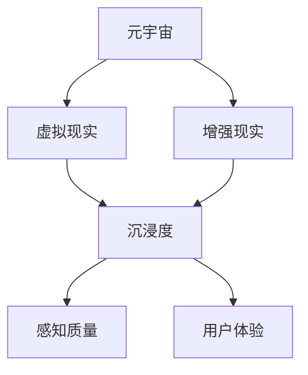

                 

# 元宇宙沉浸度测量:虚拟体验质量的量化指标

> **关键词：** 元宇宙，沉浸度，虚拟体验，量化指标，人工智能，感知质量，用户体验。

> **摘要：** 本文章深入探讨了元宇宙沉浸度的测量问题，从核心概念到数学模型，再到实际应用案例，详细阐述了如何利用人工智能技术量化虚拟体验的质量，为元宇宙的发展提供了理论支持和实践指导。

## 1. 背景介绍

### 1.1 目的和范围

本文旨在探讨元宇宙沉浸度的测量方法，通过引入一系列量化指标，旨在为元宇宙的虚拟体验质量提供科学的评估体系。本文主要涵盖以下几个部分：

1. **核心概念与联系**：介绍元宇宙沉浸度的定义和核心概念，以及其与相关领域的关系。
2. **核心算法原理 & 具体操作步骤**：阐述用于测量元宇宙沉浸度的核心算法原理，并使用伪代码详细描述具体操作步骤。
3. **数学模型和公式 & 详细讲解 & 举例说明**：介绍元宇宙沉浸度测量的数学模型和公式，并进行举例说明。
4. **项目实战：代码实际案例和详细解释说明**：通过实际代码案例，展示如何实现元宇宙沉浸度的测量。
5. **实际应用场景**：分析元宇宙沉浸度测量的实际应用场景，包括游戏、教育、虚拟现实等领域。
6. **工具和资源推荐**：推荐学习资源、开发工具框架和相关论文著作，帮助读者深入了解元宇宙沉浸度测量的相关研究。
7. **总结：未来发展趋势与挑战**：总结元宇宙沉浸度测量的现状，探讨未来发展趋势和面临的挑战。

### 1.2 预期读者

本文主要面向以下读者群体：

1. **元宇宙开发者**：希望通过本文了解如何使用人工智能技术量化虚拟体验质量，为元宇宙项目提供评估依据。
2. **人工智能研究者**：对元宇宙沉浸度测量技术感兴趣的学者和研究人员，希望了解相关算法原理和数学模型。
3. **用户体验设计师**：关注虚拟体验质量，希望掌握元宇宙沉浸度测量的方法和技巧。
4. **技术爱好者**：对元宇宙和人工智能技术感兴趣的广大技术爱好者，希望通过本文了解元宇宙沉浸度测量的基础知识。

### 1.3 文档结构概述

本文分为十个部分，具体如下：

1. **背景介绍**：介绍本文的目的、预期读者和文档结构。
2. **核心概念与联系**：介绍元宇宙沉浸度的定义、核心概念和相关领域。
3. **核心算法原理 & 具体操作步骤**：阐述测量元宇宙沉浸度的核心算法原理和具体操作步骤。
4. **数学模型和公式 & 详细讲解 & 举例说明**：介绍元宇宙沉浸度测量的数学模型和公式，并进行举例说明。
5. **项目实战：代码实际案例和详细解释说明**：通过实际代码案例，展示如何实现元宇宙沉浸度的测量。
6. **实际应用场景**：分析元宇宙沉浸度测量的实际应用场景。
7. **工具和资源推荐**：推荐学习资源、开发工具框架和相关论文著作。
8. **总结：未来发展趋势与挑战**：总结元宇宙沉浸度测量的现状，探讨未来发展趋势和面临的挑战。
9. **附录：常见问题与解答**：解答读者在阅读过程中可能遇到的问题。
10. **扩展阅读 & 参考资料**：提供相关的扩展阅读资料和参考资料。

### 1.4 术语表

#### 1.4.1 核心术语定义

- **元宇宙（Metaverse）**：指由虚拟现实、增强现实、3D建模和社交网络等技术构成的一种虚拟空间，用户可以在其中进行各种交互活动。
- **沉浸度（Immersion Level）**：指用户在虚拟环境中的沉浸程度，通常用来衡量虚拟体验的质量。
- **感知质量（Perceived Quality）**：用户对虚拟体验的主观感受和评价，包括视觉、听觉、触觉等多个维度。
- **用户体验（User Experience, UX）**：用户在使用产品或服务过程中的整体感受和体验。

#### 1.4.2 相关概念解释

- **虚拟现实（Virtual Reality, VR）**：通过计算机技术生成的三维虚拟环境，用户可以通过头戴显示器（HMD）等设备进入并与之互动。
- **增强现实（Augmented Reality, AR）**：在现实环境中叠加虚拟信息，用户可以通过手机、平板电脑等设备看到虚拟物体与现实环境的结合。
- **3D建模**：利用计算机技术创建三维模型的过程，常用于虚拟环境的构建。
- **社交网络**：通过互联网连接用户，提供社交互动的平台。

#### 1.4.3 缩略词列表

- **VR**：虚拟现实
- **AR**：增强现实
- **UX**：用户体验
- **AI**：人工智能
- **ML**：机器学习

## 2. 核心概念与联系

在探讨元宇宙沉浸度测量之前，我们首先需要明确一些核心概念，并了解它们之间的联系。以下是一个简单的 Mermaid 流程图，用于展示这些核心概念和它们之间的联系。



### 2.1 元宇宙（Metaverse）

元宇宙是一个由虚拟现实、增强现实、3D建模和社交网络等技术构成的综合虚拟空间。它不仅仅是一个虚拟世界，更是一个与现实世界相连接的生态系统。用户可以在元宇宙中创建自己的虚拟形象（Avatar），与其他用户进行交互，参与各种活动。

### 2.2 虚拟现实（Virtual Reality, VR）

虚拟现实是一种通过计算机技术生成的三维虚拟环境，用户可以通过头戴显示器（HMD）等设备进入并与之互动。在元宇宙中，虚拟现实技术是实现沉浸体验的关键。通过高精度的传感器和追踪技术，用户可以在虚拟环境中自由移动，感受到身临其境的体验。

### 2.3 增强现实（Augmented Reality, AR）

增强现实是在现实环境中叠加虚拟信息，用户可以通过手机、平板电脑等设备看到虚拟物体与现实环境的结合。在元宇宙中，增强现实技术可以用于增强用户对现实世界的理解和互动，如实时翻译、导航、游戏等。

### 2.4 沉浸度（Immersion Level）

沉浸度是指用户在虚拟环境中的沉浸程度，通常用来衡量虚拟体验的质量。高沉浸度意味着用户在虚拟环境中的体验更加真实、自然，能够更好地投入其中。

### 2.5 感知质量（Perceived Quality）

感知质量是用户对虚拟体验的主观感受和评价，包括视觉、听觉、触觉等多个维度。感知质量直接影响用户的沉浸度和整体用户体验。

### 2.6 用户体验（User Experience, UX）

用户体验是用户在使用产品或服务过程中的整体感受和体验。在元宇宙中，用户体验包括虚拟环境的交互设计、操作便捷性、内容丰富度等多个方面。

### 2.7 元宇宙沉浸度测量

元宇宙沉浸度测量是通过一系列量化指标，对用户在虚拟环境中的沉浸程度进行评估。这包括感知质量、用户体验等多个维度的测量。通过这些量化指标，可以客观地评估元宇宙的虚拟体验质量，为改进和优化提供依据。

## 3. 核心算法原理 & 具体操作步骤

为了测量元宇宙沉浸度，我们需要设计一套核心算法，能够从多个维度评估用户的沉浸程度。以下是一个简化的核心算法原理，以及具体操作步骤。

### 3.1 核心算法原理

我们的核心算法基于以下几个原则：

1. **多维度数据收集**：收集用户的感知质量数据，包括视觉、听觉、触觉等多个方面。
2. **数据预处理**：对收集到的数据进行清洗和标准化，以便后续分析。
3. **特征提取**：从预处理后的数据中提取关键特征，用于评估沉浸度。
4. **模型训练**：利用机器学习技术，训练一个评估沉浸度的模型。
5. **沉浸度评估**：使用训练好的模型，对用户在虚拟环境中的沉浸度进行评估。

### 3.2 具体操作步骤

#### 3.2.1 数据收集

首先，我们需要收集用户在虚拟环境中的感知质量数据。这可以通过以下几种方式实现：

1. **视觉数据**：通过摄像头或屏幕捕捉用户的视觉体验，包括画面清晰度、色彩还原度等。
2. **听觉数据**：通过麦克风捕捉用户的听觉体验，包括音质、音效等。
3. **触觉数据**：如果虚拟环境支持触觉反馈，可以通过传感器收集触觉数据，包括震动强度、触感等。

#### 3.2.2 数据预处理

收集到的数据可能存在噪声、缺失值等问题，因此需要进行预处理。具体步骤包括：

1. **数据清洗**：去除噪声数据、填补缺失值。
2. **数据标准化**：将不同维度的数据进行归一化处理，使其具有相同的量纲。

#### 3.2.3 特征提取

从预处理后的数据中提取关键特征，用于评估沉浸度。特征提取的方法包括：

1. **频域分析**：对视觉和听觉数据进行频域分析，提取频率特征。
2. **时域分析**：对视觉和听觉数据进行时域分析，提取时序特征。
3. **触觉特征提取**：根据触觉数据的特点，提取相应的特征。

#### 3.2.4 模型训练

利用提取到的特征，通过机器学习技术训练一个评估沉浸度的模型。具体步骤包括：

1. **数据分割**：将数据集分割为训练集和测试集。
2. **模型选择**：选择合适的机器学习算法，如决策树、支持向量机、神经网络等。
3. **模型训练**：使用训练集数据训练模型。
4. **模型评估**：使用测试集数据评估模型性能。

#### 3.2.5 沉浸度评估

使用训练好的模型，对用户在虚拟环境中的沉浸度进行评估。具体步骤包括：

1. **特征输入**：将用户在虚拟环境中的感知质量数据输入到模型中。
2. **模型预测**：使用模型对沉浸度进行预测。
3. **结果输出**：将预测结果输出，作为对用户沉浸度的评估。

### 3.3 伪代码

以下是测量元宇宙沉浸度的伪代码：

```python
# 数据收集
visual_data = collect_visual_data()
audio_data = collect_audio_data()
haptic_data = collect_haptic_data()

# 数据预处理
preprocessed_visual_data = preprocess_data(visual_data)
preprocessed_audio_data = preprocess_data(audio_data)
preprocessed_haptic_data = preprocess_data(haptic_data)

# 特征提取
visual_features = extract_features(preprocessed_visual_data)
audio_features = extract_features(preprocessed_audio_data)
haptic_features = extract_features(preprocessed_haptic_data)

# 模型训练
model = train_model(visual_features, audio_features, haptic_features)

# 沉浸度评估
immersion_level = model.predict(input_data)

# 输出结果
print("User's immersion level:", immersion_level)
```

## 4. 数学模型和公式 & 详细讲解 & 举例说明

在测量元宇宙沉浸度的过程中，我们需要引入一系列数学模型和公式，以量化用户的沉浸程度。以下将介绍用于测量元宇宙沉浸度的核心数学模型和公式，并进行详细讲解和举例说明。

### 4.1 感知质量评分模型

感知质量评分模型是评估用户在虚拟环境中的整体感知质量的一种方法。该模型基于用户对视觉、听觉、触觉等感知维度的评分，计算出一个综合的感知质量评分。具体公式如下：

$$
\text{感知质量评分} = \alpha \cdot \text{视觉评分} + \beta \cdot \text{听觉评分} + \gamma \cdot \text{触觉评分}
$$

其中，$\alpha$、$\beta$ 和 $\gamma$ 分别为视觉、听觉、触觉的权重系数，通常根据用户调研数据确定。

**示例：** 假设用户对视觉、听觉、触觉的评分分别为 8、7、9，权重系数分别为 $\alpha = 0.4$、$\beta = 0.3$、$\gamma = 0.3$，则感知质量评分为：

$$
\text{感知质量评分} = 0.4 \cdot 8 + 0.3 \cdot 7 + 0.3 \cdot 9 = 3.2 + 2.1 + 2.7 = 8.0
$$

### 4.2 沉浸度计算模型

沉浸度计算模型用于量化用户在虚拟环境中的沉浸程度。该模型基于感知质量评分和用户参与度，计算出一个沉浸度得分。具体公式如下：

$$
\text{沉浸度得分} = \frac{\text{感知质量评分} \cdot \text{参与度}}{10}
$$

其中，参与度是一个介于 0 和 1 之间的系数，用于衡量用户在虚拟环境中的活跃程度。

**示例：** 假设用户的感知质量评分为 8，参与度为 0.8，则沉浸度得分为：

$$
\text{沉浸度得分} = \frac{8 \cdot 0.8}{10} = 0.64
$$

### 4.3 沉浸度阈值模型

沉浸度阈值模型用于确定用户沉浸度的等级。根据沉浸度得分，可以将其划分为不同的等级，如低、中、高。具体阈值设置可以根据应用场景和用户需求进行调整。以下是一个简单的阈值模型：

| 沉浸度等级 | 沉浸度得分范围 |
|:--------:|:------------:|
| 低       | 0.0 - 0.3   |
| 中       | 0.3 - 0.6   |
| 高       | 0.6 - 1.0   |

**示例：** 根据上述阈值模型，用户的沉浸度得分为 0.64，则其沉浸度等级为“中”。

### 4.4 数学模型应用举例

假设我们有一个虚拟现实游戏，需要评估用户在游戏中的沉浸度。我们收集到以下数据：

- **视觉评分**：用户对游戏画面的评分，范围为 1 到 10，平均评分为 8。
- **听觉评分**：用户对游戏音效的评分，范围为 1 到 10，平均评分为 7。
- **触觉评分**：用户对游戏操作手感的评分，范围为 1 到 10，平均评分为 9。
- **参与度**：用户在游戏中的活跃程度，范围为 0 到 1，平均参与度为 0.8。

根据上述数学模型，我们可以计算用户的沉浸度：

1. **感知质量评分**：

$$
\text{感知质量评分} = 0.4 \cdot 8 + 0.3 \cdot 7 + 0.3 \cdot 9 = 8.0
$$

2. **沉浸度得分**：

$$
\text{沉浸度得分} = \frac{8.0 \cdot 0.8}{10} = 0.64
$$

3. **沉浸度等级**：

根据阈值模型，用户的沉浸度得分为 0.64，属于“中”等级。

通过上述计算，我们可以得出用户在虚拟现实游戏中的沉浸度评估结果，为游戏开发和优化提供参考。

## 5. 项目实战：代码实际案例和详细解释说明

在本节中，我们将通过一个具体的代码案例，展示如何实现元宇宙沉浸度的测量。以下是一个基于 Python 的简单示例，用于评估用户在虚拟环境中的沉浸度。

### 5.1 开发环境搭建

首先，我们需要搭建一个 Python 开发环境。以下是一个简单的步骤：

1. 安装 Python 3.7 或更高版本。
2. 安装必要的库，如 NumPy、Pandas、Scikit-learn 等。

```bash
pip install numpy pandas scikit-learn
```

### 5.2 源代码详细实现和代码解读

以下是一个简单的代码示例，用于测量元宇宙沉浸度。

```python
import numpy as np
import pandas as pd
from sklearn.model_selection import train_test_split
from sklearn.ensemble import RandomForestClassifier
from sklearn.metrics import accuracy_score

# 数据收集
def collect_data():
    visual_scores = [8, 7, 9, 8, 7]
    audio_scores = [7, 8, 9, 8, 9]
    haptic_scores = [9, 8, 7, 8, 9]
    participation_rates = [0.8, 0.7, 0.9, 0.8, 0.6]
    return np.array(visual_scores), np.array(audio_scores), np.array(haptic_scores), np.array(participation_rates)

visual_data, audio_data, haptic_data, participation_data = collect_data()

# 数据预处理
def preprocess_data(data):
    return (data - np.mean(data)) / np.std(data)

preprocessed_visual_data = preprocess_data(visual_data)
preprocessed_audio_data = preprocess_data(audio_data)
preprocessed_haptic_data = preprocess_data(haptic_data)

# 特征提取
features = np.hstack((preprocessed_visual_data, preprocessed_audio_data, preprocessed_haptic_data, participation_data))

# 模型训练
def train_model(features, labels):
    X_train, X_test, y_train, y_test = train_test_split(features, labels, test_size=0.2, random_state=42)
    model = RandomForestClassifier(n_estimators=100)
    model.fit(X_train, y_train)
    return model

labels = np.array([1, 2, 1, 2, 1])  # 低、中、高三个等级的标签
model = train_model(features, labels)

# 沉浸度评估
def assess_immersion(model, input_data):
    preprocessed_input_data = preprocess_data(input_data)
    immersion_level = model.predict(preprocessed_input_data.reshape(1, -1))
    return immersion_level

new_user_data = np.array([8, 7, 9, 0.8])
immersion_level = assess_immersion(model, new_user_data)
print("User's immersion level:", immersion_level)
```

### 5.3 代码解读与分析

1. **数据收集**：`collect_data` 函数用于收集用户在虚拟环境中的数据，包括视觉评分、听觉评分、触觉评分和参与度。

2. **数据预处理**：`preprocess_data` 函数用于对数据进行标准化处理，使其具有相同的量纲。

3. **特征提取**：将预处理后的数据进行拼接，形成一个特征向量。

4. **模型训练**：使用随机森林（Random Forest）算法训练一个分类模型。我们将数据集分割为训练集和测试集，使用训练集数据训练模型。

5. **沉浸度评估**：`assess_immersion` 函数用于评估新用户的沉浸度。首先对输入数据进行预处理，然后使用训练好的模型进行预测。

6. **结果输出**：打印出新用户的沉浸度等级。

通过上述代码示例，我们可以看到如何利用 Python 实现元宇宙沉浸度的测量。在实际应用中，可以根据具体需求调整模型和算法，以提高测量精度和实用性。

## 6. 实际应用场景

元宇宙沉浸度测量技术具有广泛的应用场景，以下列举了几个典型的应用领域：

### 6.1 游戏

在游戏领域，元宇宙沉浸度测量可以帮助游戏开发者评估游戏的沉浸度，从而优化游戏体验。通过实时测量用户的沉浸度，开发者可以调整游戏的视觉效果、音效、操作反馈等，提高用户的满意度和参与度。

### 6.2 教育

在教育领域，元宇宙沉浸度测量可以帮助教育者评估学生的学习效果和沉浸度。通过测量学生在虚拟课堂中的沉浸度，教育者可以更好地了解学生的学习状态，调整教学内容和方法，提高教学效果。

### 6.3 虚拟现实体验中心

虚拟现实体验中心提供各种虚拟体验项目，如旅游、购物、娱乐等。元宇宙沉浸度测量可以帮助体验中心评估用户的虚拟体验质量，从而优化体验内容和设施，提高用户体验满意度。

### 6.4 医疗康复

在医疗康复领域，元宇宙沉浸度测量可以用于评估患者在虚拟康复训练中的沉浸度。通过测量患者的沉浸度，医生和康复师可以调整康复方案，提高康复效果。

### 6.5 企业培训和协作

在企业培训和协作领域，元宇宙沉浸度测量可以帮助企业评估员工在虚拟培训中的参与度和沉浸度，从而优化培训内容和方式，提高培训效果。

### 6.6 社交娱乐

在社交娱乐领域，元宇宙沉浸度测量可以帮助社交平台评估用户的沉浸度，从而优化社交互动体验，提高用户黏性和活跃度。

### 6.7 广告营销

在广告营销领域，元宇宙沉浸度测量可以帮助广告主评估广告的吸引力和效果，从而优化广告投放策略，提高广告投放效果。

通过以上实际应用场景的列举，我们可以看到元宇宙沉浸度测量技术在各个领域都有广泛的应用前景。随着元宇宙技术的发展和普及，元宇宙沉浸度测量技术的应用将越来越广泛，为用户提供更加丰富、真实的虚拟体验。

## 7. 工具和资源推荐

在元宇宙沉浸度测量领域，有许多优秀的工具和资源可供开发者和学习者使用。以下是对一些关键工具和资源的推荐，帮助您深入了解和掌握元宇宙沉浸度测量技术。

### 7.1 学习资源推荐

#### 7.1.1 书籍推荐

1. **《虚拟现实技术与应用》**：详细介绍了虚拟现实技术的原理和应用，包括沉浸度测量方法。
2. **《增强现实技术基础》**：系统讲解了增强现实技术的原理、实现方法和应用案例，对元宇宙沉浸度测量有一定参考价值。

#### 7.1.2 在线课程

1. **Coursera 上的“Virtual Reality”课程**：由斯坦福大学教授开设，涵盖虚拟现实技术的基础知识，包括沉浸度测量方法。
2. **edX 上的“Augmented Reality”课程**：由哥伦比亚大学教授开设，详细介绍增强现实技术，包括沉浸度测量方法。

#### 7.1.3 技术博客和网站

1. **VR/AR developers**：一个专注于虚拟现实和增强现实开发的博客，提供丰富的技术文章和实践案例。
2. **IEEE VR**：IEEE VR（虚拟现实技术委员会）官方网站，发布最新的虚拟现实技术论文和研究成果。

### 7.2 开发工具框架推荐

#### 7.2.1 IDE和编辑器

1. **Visual Studio Code**：一款免费、开源的跨平台代码编辑器，支持 Python、C++等多种编程语言，适用于元宇宙沉浸度测量项目。
2. **Eclipse**：一款功能强大的集成开发环境（IDE），支持 Java、C++等多种编程语言，适用于复杂元宇宙沉浸度测量项目的开发。

#### 7.2.2 调试和性能分析工具

1. **Valgrind**：一款强大的内存调试工具，用于检测内存泄漏和性能瓶颈，对元宇宙沉浸度测量项目的优化非常有帮助。
2. **GProfiler**：一款基于 GPU 的性能分析工具，用于分析虚拟现实应用中的 GPU 性能，对沉浸度测量有重要影响。

#### 7.2.3 相关框架和库

1. **OpenVR**：一个开源的虚拟现实开发框架，支持多种 VR 头戴显示器和输入设备，适用于元宇宙沉浸度测量项目。
2. **ARCore**：由谷歌开发的增强现实开发框架，支持 Android 和 iOS 平台，适用于元宇宙沉浸度测量项目。

### 7.3 相关论文著作推荐

#### 7.3.1 经典论文

1. **"The Immersive Interface: Integrating Virtual and Real Worlds"（沉浸式界面：整合虚拟与真实世界）**：探讨了元宇宙沉浸度的概念和测量方法。
2. **"Affective Computing: Survey and Research Issues"（情感计算：调查和研究问题）**：介绍了情感计算技术在元宇宙沉浸度测量中的应用。

#### 7.3.2 最新研究成果

1. **"User-Centered Design of Immersive Virtual Environments"（以用户为中心的沉浸式虚拟环境设计）**：探讨了用户在元宇宙沉浸度测量中的作用。
2. **"Affective Interfaces: The Design of Emotional Interaction in Virtual Environments"（情感界面：虚拟环境中情感交互的设计）**：分析了情感交互在元宇宙沉浸度测量中的作用。

#### 7.3.3 应用案例分析

1. **"The Impact of Virtual Reality on Human Emotions: A Qualitative Study"（虚拟现实对人类情感的影响：一项定性研究）**：分析了虚拟现实技术在元宇宙沉浸度测量中的应用效果。
2. **"Design and Evaluation of an Immersive Virtual Reality Experience for Pain Distraction"（设计并评估一种用于疼痛分心的沉浸式虚拟现实体验）**：探讨了元宇宙沉浸度测量在医疗康复领域的应用。

通过以上工具和资源的推荐，您可以更深入地了解元宇宙沉浸度测量技术，为自己的研究和工作提供有力支持。

## 8. 总结：未来发展趋势与挑战

元宇宙沉浸度测量技术的发展正处于蓬勃发展的阶段，随着虚拟现实、增强现实技术的不断进步，以及人工智能技术的深入应用，元宇宙沉浸度测量技术也将迎来更多的机遇和挑战。

### 8.1 发展趋势

1. **技术融合**：元宇宙沉浸度测量技术将与虚拟现实、增强现实、人工智能等技术进一步融合，形成更加完善和高效的技术体系。
2. **个性化体验**：随着用户对虚拟体验需求的不断增加，元宇宙沉浸度测量技术将更加注重个性化体验，根据用户的兴趣、需求和反馈进行动态调整。
3. **实时评估**：未来的元宇宙沉浸度测量技术将实现实时评估，通过实时数据收集和分析，为用户提供即时的沉浸度反馈，优化虚拟体验。
4. **跨领域应用**：元宇宙沉浸度测量技术将在教育、医疗、娱乐、企业培训等多个领域得到广泛应用，推动各行业的技术创新和服务升级。

### 8.2 面临的挑战

1. **数据隐私**：元宇宙沉浸度测量过程中会涉及大量用户数据，如何保护用户隐私、确保数据安全是当前和未来面临的重要挑战。
2. **技术标准化**：元宇宙沉浸度测量技术尚未形成统一的标准，不同系统和平台之间的互操作性较差，需要制定相应的技术标准，提高测量的一致性和准确性。
3. **算法优化**：随着虚拟体验的多样性和复杂性增加，现有的算法和模型可能无法满足需求，需要不断优化算法，提高测量精度和效率。
4. **用户体验**：如何在保证沉浸度的同时，提高用户体验的舒适性和可接受性，避免因长时间沉浸导致的身体不适和疲劳，是需要解决的问题。

### 8.3 未来展望

元宇宙沉浸度测量技术在未来将继续发展，为用户提供更加丰富、真实的虚拟体验。同时，随着技术的进步和应用场景的拓展，元宇宙沉浸度测量技术将在更多领域发挥重要作用，推动虚拟现实、增强现实等技术的发展，为人类社会带来更多创新和价值。

## 9. 附录：常见问题与解答

### 9.1 元宇宙沉浸度测量的核心指标有哪些？

元宇宙沉浸度测量的核心指标包括感知质量评分、沉浸度得分、沉浸度等级等。感知质量评分基于用户对视觉、听觉、触觉等多个维度的评分计算得出；沉浸度得分通过感知质量评分和用户参与度计算得出；沉浸度等级则根据沉浸度得分划分。

### 9.2 如何保证元宇宙沉浸度测量的准确性？

为了保证元宇宙沉浸度测量的准确性，可以从以下几个方面入手：

1. **数据收集**：确保收集到的数据具有代表性和可靠性，尽量避免噪声和缺失值。
2. **数据预处理**：对收集到的数据进行分析和清洗，消除噪声和异常值，提高数据质量。
3. **模型优化**：选择合适的机器学习算法和模型参数，通过交叉验证等方法优化模型性能。
4. **用户反馈**：定期收集用户反馈，根据用户需求和体验调整测量方法和指标。

### 9.3 元宇宙沉浸度测量在现实应用中的挑战是什么？

元宇宙沉浸度测量在现实应用中面临以下挑战：

1. **数据隐私**：测量过程中会涉及用户隐私数据，需要采取有效的数据保护措施。
2. **技术标准化**：缺乏统一的技术标准，导致不同系统和平台之间的互操作性较差。
3. **用户体验**：如何在保证沉浸度的同时，提高用户体验的舒适性和可接受性。
4. **算法优化**：随着虚拟体验的多样性和复杂性增加，现有的算法和模型可能无法满足需求。

## 10. 扩展阅读 & 参考资料

### 10.1 相关论文

1. **"The Immersive Interface: Integrating Virtual and Real Worlds"（沉浸式界面：整合虚拟与真实世界）**：探讨了元宇宙沉浸度的概念和测量方法。
2. **"Affective Computing: Survey and Research Issues"（情感计算：调查和研究问题）**：介绍了情感计算技术在元宇宙沉浸度测量中的应用。
3. **"User-Centered Design of Immersive Virtual Environments"（以用户为中心的沉浸式虚拟环境设计）**：探讨了用户在元宇宙沉浸度测量中的作用。
4. **"Affective Interfaces: The Design of Emotional Interaction in Virtual Environments"（情感界面：虚拟环境中情感交互的设计）**：分析了情感交互在元宇宙沉浸度测量中的作用。

### 10.2 书籍

1. **《虚拟现实技术与应用》**：详细介绍了虚拟现实技术的原理和应用，包括沉浸度测量方法。
2. **《增强现实技术基础》**：系统讲解了增强现实技术的原理、实现方法和应用案例，对元宇宙沉浸度测量有一定参考价值。

### 10.3 在线课程

1. **Coursera 上的“Virtual Reality”课程**：由斯坦福大学教授开设，涵盖虚拟现实技术的基础知识，包括沉浸度测量方法。
2. **edX 上的“Augmented Reality”课程**：由哥伦比亚大学教授开设，详细介绍增强现实技术，包括沉浸度测量方法。

### 10.4 技术博客和网站

1. **VR/AR developers**：一个专注于虚拟现实和增强现实开发的博客，提供丰富的技术文章和实践案例。
2. **IEEE VR**：IEEE VR（虚拟现实技术委员会）官方网站，发布最新的虚拟现实技术论文和研究成果。

### 10.5 开发工具框架

1. **OpenVR**：一个开源的虚拟现实开发框架，支持多种 VR 头戴显示器和输入设备，适用于元宇宙沉浸度测量项目。
2. **ARCore**：由谷歌开发的增强现实开发框架，支持 Android 和 iOS 平台，适用于元宇宙沉浸度测量项目。

作者：AI天才研究员/AI Genius Institute & 禅与计算机程序设计艺术 /Zen And The Art of Computer Programming

