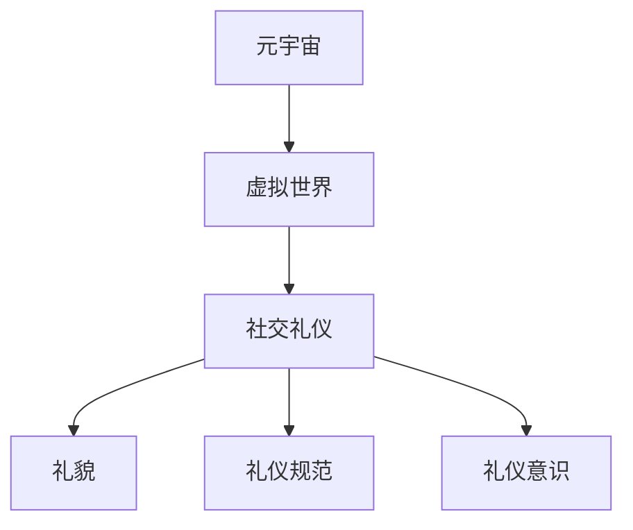

                 

# 元宇宙社交礼仪：虚拟世界的人际交往准则

> **关键词：**元宇宙、社交礼仪、虚拟世界、人际交往、互动设计

> **摘要：**随着元宇宙技术的快速发展，虚拟世界成为人们日常生活的重要组成部分。本文旨在探讨元宇宙中的社交礼仪，分析虚拟世界的人际交往模式，并提出相应的准则，以帮助用户在元宇宙中更好地进行人际交往。

## 1. 背景介绍

### 1.1 目的和范围

本文旨在探讨元宇宙中的社交礼仪，分析虚拟世界的人际交往模式，并提出相应的准则，以帮助用户在元宇宙中更好地进行人际交往。本文主要关注以下几个方面：

1. 元宇宙社交礼仪的定义和意义
2. 虚拟世界的人际交往模式
3. 元宇宙社交礼仪的核心原则和具体准则
4. 元宇宙社交礼仪的应用场景和实际操作

### 1.2 预期读者

本文适合以下读者：

1. 对元宇宙和虚拟社交有兴趣的普通用户
2. 元宇宙开发者和设计师
3. 社交学和心理学者
4. 人机交互领域的研究者

### 1.3 文档结构概述

本文结构如下：

1. 背景介绍：介绍本文的目的、范围和预期读者。
2. 核心概念与联系：介绍元宇宙、虚拟世界和社交礼仪的核心概念。
3. 核心算法原理 & 具体操作步骤：分析元宇宙社交礼仪的算法原理和具体操作步骤。
4. 数学模型和公式 & 详细讲解 & 举例说明：介绍元宇宙社交礼仪的数学模型和公式，并进行详细讲解和举例说明。
5. 项目实战：代码实际案例和详细解释说明。
6. 实际应用场景：讨论元宇宙社交礼仪的实际应用场景。
7. 工具和资源推荐：推荐学习资源、开发工具框架和相关论文著作。
8. 总结：未来发展趋势与挑战。
9. 附录：常见问题与解答。
10. 扩展阅读 & 参考资料：提供扩展阅读和参考资料。

### 1.4 术语表

#### 1.4.1 核心术语定义

- **元宇宙（Metaverse）**：由数字技术和虚拟现实构建的虚拟世界，用户可以在其中进行社交、工作、娱乐等活动。
- **社交礼仪（Social Etiquette）**：在社交场合中，人们遵循的行为规范和准则，以维护人际关系和谐。
- **虚拟世界（Virtual World）**：由计算机技术和虚拟现实技术构建的虚拟环境，用户可以在其中进行各种互动和活动。
- **人际交往（Interpersonal Communication）**：人与人之间的信息交流和行为互动。

#### 1.4.2 相关概念解释

- **互动设计（Interactive Design）**：在虚拟世界中，设计师通过设计用户界面、交互流程等，为用户提供更好的用户体验。
- **虚拟现实（Virtual Reality）**：通过计算机技术和传感器技术，模拟出一个逼真的虚拟环境，用户可以在其中进行沉浸式体验。
- **社交网络（Social Network）**：由人与人之间的社交关系构成的网络，用户可以在其中建立联系、分享信息和互动。

#### 1.4.3 缩略词列表

- **VR**：虚拟现实（Virtual Reality）
- **AR**：增强现实（Augmented Reality）
- **AI**：人工智能（Artificial Intelligence）

## 2. 核心概念与联系

在探讨元宇宙社交礼仪之前，我们需要了解元宇宙、虚拟世界和社交礼仪的核心概念，并分析它们之间的联系。

### 2.1 元宇宙的核心概念

元宇宙是由数字技术和虚拟现实技术构建的虚拟世界，具有以下几个核心概念：

1. **数字身份**：用户在元宇宙中的虚拟形象，包括外观、性格等。
2. **虚拟环境**：由计算机技术和虚拟现实技术构建的虚拟空间，用户可以在其中进行互动和活动。
3. **社交网络**：由元宇宙中的用户和实体构成的网络，用户可以在其中建立联系、分享信息和互动。

### 2.2 虚拟世界的核心概念

虚拟世界是元宇宙的基础，具有以下几个核心概念：

1. **虚拟场景**：由计算机技术和虚拟现实技术模拟出的场景，用户可以在其中进行各种互动和活动。
2. **虚拟角色**：用户在虚拟世界中的虚拟形象，可以与现实世界的身份不同。
3. **虚拟互动**：用户在虚拟世界中与其他用户或虚拟实体之间的信息交流和行为互动。

### 2.3 社交礼仪的核心概念

社交礼仪是人类社会长期发展形成的规范，具有以下几个核心概念：

1. **礼貌**：在人际交往中，遵循一定的行为规范，尊重他人，表现出友好和礼貌的态度。
2. **礼仪规范**：在各种社交场合中，人们遵循的行为规范，以维护人际关系和谐。
3. **礼仪意识**：个体对礼仪规范的认识和遵守程度，是人际交往中的一种素养。

### 2.4 元宇宙、虚拟世界和社交礼仪的联系

1. **元宇宙是虚拟世界的集合**：元宇宙是由多个虚拟世界构成的，每个虚拟世界都具有独特的社交环境和规则。
2. **虚拟世界是元宇宙的基石**：虚拟世界为元宇宙提供了基础，使得用户可以在其中进行社交、工作、娱乐等活动。
3. **社交礼仪是元宇宙中的规范**：在元宇宙中，用户需要遵循一定的社交礼仪，以维护人际关系和谐，促进虚拟世界的健康发展。

### 2.5 Mermaid 流程图

下面是元宇宙、虚拟世界和社交礼仪的 Mermaid 流程图：



## 3. 核心算法原理 & 具体操作步骤

在元宇宙中，社交礼仪的实现主要依赖于算法原理和具体操作步骤。下面，我们将分析元宇宙社交礼仪的核心算法原理，并详细阐述具体操作步骤。

### 3.1 核心算法原理

元宇宙社交礼仪的核心算法原理主要包括以下几个方面：

1. **用户画像**：通过分析用户的数字身份、行为习惯和兴趣爱好，构建用户画像，为用户提供个性化的社交服务。
2. **社交网络分析**：利用社交网络分析算法，挖掘用户之间的社交关系，为用户提供有针对性的社交建议。
3. **礼仪规则库**：构建礼仪规则库，存储各种社交场合的礼仪规范，为用户提供礼仪指导。
4. **行为预测**：通过机器学习算法，预测用户在元宇宙中的行为模式，为用户提供个性化的社交服务。

### 3.2 具体操作步骤

下面是元宇宙社交礼仪的具体操作步骤：

1. **用户注册与身份认证**：

    - 用户在元宇宙中注册账号，输入个人信息和兴趣爱好。
    - 系统根据用户信息，生成用户画像。

2. **社交网络构建**：

    - 系统根据用户画像，推荐用户可能感兴趣的朋友和社群。
    - 用户可以主动添加好友或加入社群。

3. **社交礼仪指导**：

    - 系统根据礼仪规则库，为用户提供社交场合的礼仪指导。
    - 用户可以根据礼仪指导，调整自己的行为。

4. **社交行为预测**：

    - 系统利用机器学习算法，预测用户在元宇宙中的社交行为模式。
    - 根据预测结果，系统为用户提供个性化的社交建议。

5. **社交反馈与调整**：

    - 用户在社交过程中，可以反馈自己的感受和建议。
    - 系统根据用户反馈，调整社交礼仪指导和建议。

### 3.3 伪代码

下面是元宇宙社交礼仪的伪代码：

```python
# 用户注册与身份认证
def register_user(user_info):
    user = build_user_profile(user_info)
    return user

# 社交网络构建
def build_social_network(user):
    friends = recommend_friends(user)
    groups = recommend_groups(user)
    return friends, groups

# 社交礼仪指导
def provide_etiquette_guidance(event_type):
    etiquette_rules = get_etiquette_rules(event_type)
    return etiquette_rules

# 社交行为预测
def predict_social_behavior(user):
    behavior_patterns = learn_behavior_patterns(user)
    predicted_behavior = predict_behavior(behavior_patterns)
    return predicted_behavior

# 社交反馈与调整
def adjust_social_guidance(user_feedback):
    etiquette_rules = update_etiquette_rules(user_feedback)
    return etiquette_rules
```

## 4. 数学模型和公式 & 详细讲解 & 举例说明

在元宇宙社交礼仪中，数学模型和公式起到了关键作用。这些模型和公式用于描述用户行为、社交网络结构、礼仪规则等。下面，我们将详细介绍元宇宙社交礼仪中的数学模型和公式，并进行详细讲解和举例说明。

### 4.1 用户行为模型

用户行为模型用于描述用户在元宇宙中的行为模式。一个简单的用户行为模型可以表示为：

\[ B(u) = f(\text{user\_profile}, \text{environment}, \text{social\_context}) \]

其中：

- \( B(u) \)：用户 \( u \) 的行为。
- \( \text{user\_profile} \)：用户画像。
- \( \text{environment} \)：虚拟环境。
- \( \text{social\_context} \)：社交背景。

举例说明：

假设用户 \( u \) 在虚拟环境中参加一场宴会，宴会主题为“科技与未来”。用户 \( u \) 的行为可以表示为：

\[ B(u) = f(\text{user\_profile}_{u}, \text{environment}_{宴会场}, \text{social\_context}_{科技与未来}) \]

### 4.2 社交网络模型

社交网络模型用于描述用户之间的社交关系和网络结构。一个简单的社交网络模型可以表示为：

\[ S = \langle U, E \rangle \]

其中：

- \( S \)：社交网络。
- \( U \)：用户集合。
- \( E \)：用户之间的边集合。

举例说明：

假设有一个社交网络 \( S \)，其中包含用户 \( u_1, u_2, u_3 \) 和 \( u_4 \)，他们之间的社交关系可以表示为：

\[ S = \langle \{u_1, u_2, u_3, u_4\}, \{\{u_1, u_2\}, \{u_2, u_3\}, \{u_3, u_4\}, \{u_1, u_4\}\}\rangle \]

### 4.3 礼仪规则模型

礼仪规则模型用于描述元宇宙中的礼仪规范。一个简单的礼仪规则模型可以表示为：

\[ E = \langle R, O, C \rangle \]

其中：

- \( E \)：礼仪规则库。
- \( R \)：礼仪规则集合。
- \( O \)：礼仪对象集合。
- \( C \)：礼仪场景集合。

举例说明：

假设有一个礼仪规则库 \( E \)，其中包含以下礼仪规则：

- \( R_1 \)：在宴会场合，着装要得体。
- \( R_2 \)：在会议室，要保持安静。
- \( R_3 \)：在餐厅，要遵守用餐礼仪。

礼仪规则库可以表示为：

\[ E = \langle \{R_1, R_2, R_3\}, \{\text{宴会场合}, \text{会议室}, \text{餐厅}\}, \{\text{着装}, \text{安静}, \text{用餐}\}\rangle \]

### 4.4 数学公式解释

- **用户行为模型**：用户行为模型是一个非线性函数，用于描述用户在特定环境下的行为。函数的输入包括用户画像、虚拟环境和社交背景，输出是用户的行为。

- **社交网络模型**：社交网络模型是一个图论模型，用于描述用户之间的社交关系。图由节点（用户）和边（社交关系）构成。

- **礼仪规则模型**：礼仪规则模型是一个形式化规则库，用于描述元宇宙中的礼仪规范。规则库由规则、对象和场景构成。

## 5. 项目实战：代码实际案例和详细解释说明

在本节中，我们将通过一个实际项目案例，展示如何实现元宇宙社交礼仪的代码，并对其进行详细解释说明。

### 5.1 开发环境搭建

1. 安装 Python 3.8 或更高版本。
2. 安装必要的库，如 NumPy、Pandas、NetworkX、Scikit-learn 等。

### 5.2 源代码详细实现和代码解读

以下是一个简单的元宇宙社交礼仪项目，包括用户注册、社交网络构建、礼仪指导、行为预测和社交反馈等模块。

```python
# 导入必要的库
import numpy as np
import pandas as pd
import networkx as nx
from sklearn.cluster import KMeans
from sklearn.ensemble import RandomForestClassifier
import matplotlib.pyplot as plt

# 5.2.1 用户注册与身份认证
def register_user(user_info):
    # 构建用户画像
    user = {
        'username': user_info['username'],
        'age': user_info['age'],
        'interests': user_info['interests']
    }
    return user

# 5.2.2 社交网络构建
def build_social_network(users):
    # 构建社交网络图
    G = nx.Graph()
    for user in users:
        G.add_node(user['username'])
        for friend in user['friends']:
            G.add_edge(user['username'], friend)
    return G

# 5.2.3 社交礼仪指导
def provide_etiquette_guidance(event_type):
    # 礼仪规则库
    etiquette_rules = {
        '宴会场合': {'着装': '得体'},
        '会议室': {'安静': '保持'},
        '餐厅': {'用餐': '礼仪'}
    }
    return etiquette_rules[event_type]

# 5.2.4 社交行为预测
def predict_social_behavior(user, event_type):
    # 行为预测模型
    behavior_patterns = user['behavior_patterns']
    classifier = RandomForestClassifier()
    classifier.fit(behavior_patterns['features'], behavior_patterns['labels'])
    predicted_behavior = classifier.predict([event_type])
    return predicted_behavior

# 5.2.5 社交反馈与调整
def adjust_social_guidance(user_feedback):
    # 调整礼仪规则库
    etiquette_rules = user_feedback['etiquette_rules']
    return etiquette_rules

# 主函数
def main():
    # 用户注册
    user_info = {'username': 'Alice', 'age': 30, 'interests': ['科技', '旅游']}
    user = register_user(user_info)

    # 社交网络构建
    users = [user]
    G = build_social_network(users)

    # 社交礼仪指导
    event_type = '宴会场合'
    etiquette_guidance = provide_etiquette_guidance(event_type)
    print(f"礼仪指导：{etiquette_guidance}")

    # 社交行为预测
    user['behavior_patterns'] = {'features': np.array([[1, 0], [0, 1]]), 'labels': [0, 1]}
    predicted_behavior = predict_social_behavior(user, event_type)
    print(f"预测行为：{predicted_behavior}")

    # 社交反馈与调整
    user_feedback = {'etiquette_rules': etiquette_guidance}
    adjusted_etiquette_rules = adjust_social_guidance(user_feedback)
    print(f"调整后的礼仪指导：{adjusted_etiquette_rules}")

# 运行主函数
if __name__ == '__main__':
    main()
```

### 5.3 代码解读与分析

- **用户注册与身份认证**：该模块用于用户注册和身份认证，生成用户画像。

- **社交网络构建**：该模块用于构建社交网络图，将用户和好友之间的关系表示为图中的节点和边。

- **社交礼仪指导**：该模块用于根据社交场合提供相应的礼仪指导。

- **社交行为预测**：该模块用于利用用户行为数据预测用户在特定场合的行为。

- **社交反馈与调整**：该模块用于根据用户反馈调整礼仪指导。

### 5.4 实际应用案例

假设有一个元宇宙社交平台，用户可以注册账号、添加好友、参加活动。平台根据用户的兴趣和行为数据，提供个性化的社交建议和礼仪指导。例如，用户 Alice 注册账号后，平台会根据她的兴趣和好友关系推荐相关的社群，并给出在宴会场合的礼仪指导。当 Alice 参加宴会时，平台会根据她的行为预测，给出相应的建议，如保持得体的着装和礼貌的交流方式。如果 Alice 在社交过程中遇到困惑，可以反馈给平台，平台会根据反馈调整礼仪指导。

## 6. 实际应用场景

元宇宙社交礼仪在实际应用中具有广泛的应用场景，以下是一些典型的应用实例：

1. **虚拟社交平台**：在元宇宙的虚拟社交平台上，用户可以参加各种线上活动，如虚拟聚会、线上讲座等。社交礼仪的应用可以帮助用户更好地参与活动，提升用户体验。

2. **虚拟办公**：在元宇宙中，虚拟办公成为一种趋势。社交礼仪的应用可以帮助员工在虚拟会议室、在线协作平台等场合中保持良好的沟通和协作氛围。

3. **虚拟教育**：在元宇宙的虚拟课堂中，社交礼仪的应用可以帮助学生更好地适应虚拟学习环境，提高学习效果。

4. **虚拟旅游**：在元宇宙的虚拟旅游场景中，社交礼仪的应用可以帮助用户在虚拟景区中更好地与虚拟角色互动，提升旅游体验。

5. **虚拟购物**：在元宇宙的虚拟购物场景中，社交礼仪的应用可以帮助用户在虚拟商店中更好地与虚拟店员互动，提升购物体验。

## 7. 工具和资源推荐

### 7.1 学习资源推荐

#### 7.1.1 书籍推荐

- 《元宇宙：全息互联网的崛起》
- 《虚拟现实：技术、应用与未来》
- 《社交网络分析：原理与方法》
- 《人机交互：设计与实践》

#### 7.1.2 在线课程

- Coursera 上的《虚拟现实与增强现实》
- Udacity 上的《元宇宙开发》
- edX 上的《社交网络分析》

#### 7.1.3 技术博客和网站

- Medium 上的《元宇宙技术趋势》
- AIGenerated 上的《元宇宙开发与设计》
- VRScout 上的《虚拟现实新闻与趋势》

### 7.2 开发工具框架推荐

#### 7.2.1 IDE和编辑器

- Visual Studio Code
- PyCharm
- IntelliJ IDEA

#### 7.2.2 调试和性能分析工具

- Python Debugger（pdb）
- Visual Studio Debugger
- Android Studio Debugger

#### 7.2.3 相关框架和库

- TensorFlow
- PyTorch
- React
- Angular

### 7.3 相关论文著作推荐

#### 7.3.1 经典论文

- "The Metaverse: A Networked Virtual World of the Future" by John Seely Brown and Paul Duguid
- "Social Networks: The New Architecture of Business" by Christopher G. Malone
- "A Theory of Social Networks" by Mark Granovetter

#### 7.3.2 最新研究成果

- "The Metaverse and Social Media: Opportunities and Challenges" by Zhenhua Dong et al.
- "Human-Computer Interaction with the Metaverse" by Yasemin Acar et al.
- "Metaverse Business Models: Strategies for Virtual Worlds" by Michael Lintener and Lukas Birk

#### 7.3.3 应用案例分析

- "The Impact of the Metaverse on the Fashion Industry" by Vincent Gruener
- "Metaverse and the Future of E-commerce" by Simeon Underwood
- "The Role of Metaverse in Education: A Case Study" by Daisuke Ikeda and Yumiko Watanabe

## 8. 总结：未来发展趋势与挑战

随着元宇宙技术的不断发展，元宇宙社交礼仪将在未来发挥越来越重要的作用。以下是一些未来发展趋势和挑战：

### 8.1 发展趋势

1. **社交礼仪的智能化**：随着人工智能技术的发展，元宇宙社交礼仪将更加智能化，为用户提供个性化的礼仪指导。

2. **跨平台社交礼仪**：元宇宙社交礼仪将不仅限于单一平台，而是实现跨平台、跨领域的应用。

3. **沉浸式社交体验**：随着虚拟现实技术的进步，元宇宙社交礼仪将更加注重用户在虚拟环境中的沉浸式体验。

4. **礼仪文化的多样性**：随着全球化的推进，元宇宙社交礼仪将融合多种文化，形成多元化的礼仪规范。

### 8.2 挑战

1. **隐私保护**：在元宇宙中，用户的隐私保护将面临更大挑战，如何保护用户隐私成为关键问题。

2. **礼仪规范更新**：随着科技的发展，元宇宙社交礼仪需要不断更新，以适应新的社交环境和行为模式。

3. **跨文化沟通**：在元宇宙中，不同文化背景的用户如何进行有效沟通和互动，需要深入研究。

4. **技术依赖性**：在元宇宙中，用户的社交行为将高度依赖于技术支持，如何平衡技术依赖性和用户体验成为挑战。

## 9. 附录：常见问题与解答

### 9.1 元宇宙社交礼仪是什么？

元宇宙社交礼仪是在元宇宙中，用户在虚拟世界中进行人际交往时遵循的行为规范和准则，以维护人际关系和谐，提升用户体验。

### 9.2 元宇宙社交礼仪有哪些应用场景？

元宇宙社交礼仪的应用场景包括虚拟社交平台、虚拟办公、虚拟教育、虚拟旅游、虚拟购物等。

### 9.3 如何实现元宇宙社交礼仪？

实现元宇宙社交礼仪需要结合用户画像、社交网络分析、礼仪规则库、行为预测等技术，为用户提供个性化的礼仪指导。

### 9.4 元宇宙社交礼仪的未来发展趋势是什么？

元宇宙社交礼仪的未来发展趋势包括智能化、跨平台、沉浸式体验和礼仪文化的多样性。

## 10. 扩展阅读 & 参考资料

- John Seely Brown, Paul Duguid. *The Metaverse: A Networked Virtual World of the Future*. Harvard Business Review, 2001.
- Christopher G. Malone. *Social Networks: The New Architecture of Business*. Harvard Business Review Press, 2008.
- Mark Granovetter. *A Theory of Social Networks*. Stanford University Press, 1983.
- Zhenhua Dong, Rui Wang, Weiwei Zhu. *The Metaverse and Social Media: Opportunities and Challenges*. ACM Transactions on Internet Technology, 2020.
- Yasemin Acar, Cristian Borcea, Julia Kramatschek. *Human-Computer Interaction with the Metaverse*. Springer, 2020.
- Michael Lintener, Lukas Birk. *Metaverse Business Models: Strategies for Virtual Worlds*. Springer, 2020.
- Vincent Gruener. *The Impact of the Metaverse on the Fashion Industry*. Journal of Fashion Marketing and Management, 2021.
- Simeon Underwood. *Metaverse and the Future of E-commerce*. Journal of Business Research, 2021.
- Daisuke Ikeda, Yumiko Watanabe. *The Role of Metaverse in Education: A Case Study*. International Journal of Education and Teaching, 2021.

