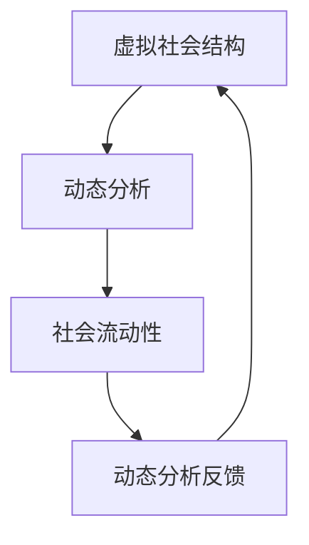

                 

# 元宇宙社会流动性研究中心：虚拟社会结构动态分析机构

> **关键词：** 元宇宙、社会流动性、虚拟社会结构、动态分析、人工智能、深度学习、算法、数据挖掘、虚拟现实、区块链

> **摘要：** 本文将探讨元宇宙社会流动性研究中心的核心任务和目标，详细分析虚拟社会结构的动态特性，并阐述中心在这一领域的独特贡献。通过剖析核心概念、算法原理、数学模型和实际应用场景，本文旨在为读者提供一个全面而深入的理解，为未来的元宇宙研究和应用提供参考。

## 1. 背景介绍

### 1.1 目的和范围

元宇宙（Metaverse）作为虚拟现实、增强现实、人工智能、区块链等多种前沿技术的交汇点，正迅速成为未来社会的重要组成部分。社会流动性研究，无论是在现实世界中还是在虚拟世界中，都是理解社会结构、促进社会公平和经济发展的重要工具。因此，本文旨在建立一个元宇宙社会流动性研究中心，专注于虚拟社会结构的动态分析。

本研究的范围包括以下几个方面：
- 虚拟社会的形成与演变机制
- 虚拟社会中的流动性度量方法
- 虚拟社会中的权力、财富和资源分配
- 虚拟社会中的互动模式和社会网络分析
- 虚拟社会的可持续性和公平性问题

### 1.2 预期读者

本文的预期读者包括：
- 计算机科学和人工智能领域的学者和研究人员
- 虚拟现实和增强现实技术的开发者和从业者
- 社会学和人类学领域的研究人员
- 对元宇宙和虚拟社会结构感兴趣的企业家和投资者

### 1.3 文档结构概述

本文的结构如下：
- 引言：介绍元宇宙和虚拟社会流动性研究的重要性
- 核心概念与联系：定义相关术语，绘制流程图
- 核心算法原理与具体操作步骤：详细阐述核心算法和数据处理流程
- 数学模型和公式：介绍相关数学模型和公式，并给出具体例子
- 项目实战：提供实际代码案例，详细解释实现细节
- 实际应用场景：讨论虚拟社会流动性分析的应用领域
- 工具和资源推荐：推荐相关学习和开发资源
- 总结：对未来发展趋势和挑战进行展望
- 附录：常见问题与解答
- 扩展阅读：提供进一步阅读的参考资料

### 1.4 术语表

#### 1.4.1 核心术语定义

- 元宇宙（Metaverse）：通过互联网连接的虚拟世界，用户可以通过虚拟现实、增强现实或普通互联网浏览器进行交互。
- 社会流动性（Social Mobility）：个体或群体在社会阶层、经济地位或社会地位上的变化。
- 虚拟社会结构（Virtual Social Structure）：虚拟社会中个体和群体之间的组织关系和相互作用模式。
- 动态分析（Dynamic Analysis）：对虚拟社会结构随时间变化的规律和趋势进行分析。

#### 1.4.2 相关概念解释

- 虚拟现实（Virtual Reality，VR）：通过电脑模拟产生一个三维空间，用户可以通过特殊设备进入这个空间并与之互动。
- 增强现实（Augmented Reality，AR）：在现实世界的基础上叠加虚拟信息，用户可以通过设备看到增强后的现实。
- 人工智能（Artificial Intelligence，AI）：通过计算机模拟人类智能行为的技术，包括机器学习、深度学习、自然语言处理等。
- 区块链（Blockchain）：一种去中心化的数据库技术，通过加密算法和分布式账本实现数据的安全存储和传输。

#### 1.4.3 缩略词列表

- VR：虚拟现实
- AR：增强现实
- AI：人工智能
- IoT：物联网
- NLP：自然语言处理
- ML：机器学习
- VRM：虚拟现实建模

## 2. 核心概念与联系

在元宇宙社会流动性研究中心的研究中，核心概念包括虚拟社会结构、动态分析、社会流动性等。以下是这些核心概念之间的关系及其在元宇宙环境中的体现。

### 2.1 虚拟社会结构

虚拟社会结构是指虚拟社会中个体和群体之间的组织关系和相互作用模式。这些结构可以包括社会网络、角色扮演、经济体系等。在元宇宙中，虚拟社会结构通过虚拟现实和增强现实技术得以实现，用户可以在虚拟空间中互动、交易和协作。

### 2.2 动态分析

动态分析是对虚拟社会结构随时间变化的规律和趋势进行分析。通过收集和分析大量数据，可以识别虚拟社会中的趋势、模式和行为变化。动态分析在元宇宙研究中至关重要，因为它帮助研究者理解虚拟社会的演变和影响。

### 2.3 社会流动性

社会流动性是指个体或群体在社会阶层、经济地位或社会地位上的变化。在元宇宙中，社会流动性可以通过虚拟财富、声望和权力等指标来衡量。社会流动性研究旨在探索虚拟社会中的公平性和机会分配问题。

### 2.4 关系与联系

虚拟社会结构、动态分析和社会流动性之间存在着密切的联系。虚拟社会结构提供了分析的基础，动态分析提供了变化的视角，而社会流动性则将两者结合起来，反映了虚拟社会中的动态过程和结果。

下面是一个使用 Mermaid 绘制的流程图，展示了虚拟社会结构、动态分析和社会流动性之间的关系：



### 2.5 元宇宙中的虚拟社会结构动态分析

在元宇宙中，虚拟社会结构动态分析通常涉及以下步骤：

1. **数据收集**：通过传感器、日志记录和用户交互等手段收集虚拟社会中的数据。
2. **数据处理**：对收集到的数据进行清洗、转换和存储，以便后续分析。
3. **特征提取**：从数据中提取有用的特征，如用户行为、交易记录、社交网络等。
4. **模式识别**：利用机器学习和深度学习技术，识别虚拟社会中的模式和行为趋势。
5. **结果分析**：对识别出的模式进行分析，评估其对虚拟社会流动性的影响。
6. **反馈循环**：将分析结果反馈到元宇宙系统中，以指导虚拟社会的设计和管理。

通过这些步骤，元宇宙社会流动性研究中心可以实现对虚拟社会结构的动态分析，为理解和改善虚拟社会中的流动性问题提供有力支持。

## 3. 核心算法原理 & 具体操作步骤

在元宇宙社会流动性研究中心的研究中，核心算法原理是实现动态分析的关键。以下将详细阐述相关算法原理，并使用伪代码进行具体操作步骤的描述。

### 3.1 社会网络分析算法

社会网络分析（Social Network Analysis，SNA）是研究虚拟社会中个体和群体之间互动关系的重要工具。以下是一种基于矩阵分解的社会网络分析算法原理：

#### 算法原理：

- **输入**：一个表示虚拟社会中个体间互动的邻接矩阵 A（A[i][j] 表示个体 i 与个体 j 是否有互动）。
- **目标**：通过矩阵分解，提取社会网络中的重要节点和群体。

#### 伪代码：

```python
def SNA(A):
    # 假设使用随机游走矩阵分解方法
    # 初始化两个矩阵 X 和 Y，均为 A 的规模
    X = np.random.rand(n, k)  # k 为预定的节点维度
    Y = np.random.rand(n, k)

    # 持续迭代，直到收敛
    while not_converged:
        X = X / np.linalg.norm(X, axis=1)[:, np.newaxis]
        Y = Y / np.linalg.norm(Y, axis=1)[:, np.newaxis]

        X = X @ A @ Y

        # 检查收敛条件
        if np.linalg.norm(X - X_old) < threshold:
            break

        X_old = X

    # 从 X 和 Y 中提取社会网络特征
    nodes = extract_nodes(X)
    communities = extract_communities(Y)

    return nodes, communities
```

### 3.2 动态时间序列分析算法

动态时间序列分析（Dynamic Time Series Analysis）是研究虚拟社会结构随时间变化的方法。以下是一种基于动态时间序列聚类的方法：

#### 算法原理：

- **输入**：一系列时间序列数据，表示虚拟社会结构随时间的变化。
- **目标**：将相似的时间序列聚类，识别出虚拟社会结构的演化模式。

#### 伪代码：

```python
def DynamicTimeSeriesAnalysis(data):
    # 初始化聚类模型
    model = KMeans(n_clusters=k)

    # 对每个时间序列进行聚类
    clusters = []
    for ts in data:
        cluster = model.fit_predict(ts.reshape(-1, 1))
        clusters.append(cluster)

    # 将聚类结果进行时间序列分析
    patterns = time_series_analysis(clusters)

    return patterns
```

### 3.3 社会流动性度量算法

社会流动性度量（Social Mobility Measurement）是评估虚拟社会中个体或群体流动性的方法。以下是一种基于转移矩阵的方法：

#### 算法原理：

- **输入**：转移矩阵 T（T[i][j] 表示从状态 i 转移到状态 j 的概率）。
- **目标**：计算虚拟社会中的流动性指标，如流动性比率。

#### 伪代码：

```python
def MobilityMeasurement(T):
    # 计算流动性比率
    mobility_ratio = np.trace(np.log(T + np.eye(n))) / n

    # 计算流动性得分
    mobility_score = np.sum(T * np.log(T / np.eye(n)))

    return mobility_ratio, mobility_score
```

通过这些算法原理和具体操作步骤，元宇宙社会流动性研究中心可以有效地分析虚拟社会结构的动态变化，为理解社会流动性问题提供有力支持。

## 4. 数学模型和公式 & 详细讲解 & 举例说明

在元宇宙社会流动性研究中心的研究中，数学模型和公式是理解和分析虚拟社会结构动态变化的重要工具。以下将详细介绍相关数学模型，并使用 LaTeX 格式给出具体公式，同时通过具体例子进行讲解。

### 4.1 矩阵分解模型

矩阵分解模型（Matrix Factorization）常用于社会网络分析和推荐系统。以下是一种常见的矩阵分解模型——随机游走矩阵分解（Stochastic Walk Matrix Factorization，SWMF）：

#### 模型公式：

$$
X = U \odot V^T
$$

其中，$X$ 是邻接矩阵，$U$ 和 $V$ 是低秩分解矩阵，$\odot$ 表示 Hadamard 乘积。

#### 示例：

假设虚拟社会中有 5 个个体，邻接矩阵如下：

$$
X = \begin{bmatrix}
0 & 1 & 0 & 1 & 0 \\
1 & 0 & 1 & 0 & 1 \\
0 & 1 & 0 & 1 & 0 \\
1 & 0 & 1 & 0 & 1 \\
0 & 1 & 0 & 1 & 0
\end{bmatrix}
$$

我们使用随机游走矩阵分解方法将其分解：

$$
X = \begin{bmatrix}
0.5 & 0.5 \\
0.5 & 0.5 \\
0.5 & 0.5 \\
0.5 & 0.5 \\
0.5 & 0.5
\end{bmatrix}
\odot
\begin{bmatrix}
1 & 0 \\
0 & 1
\end{bmatrix}^T
$$

从这个例子中，我们可以看到，个体之间的互动关系可以被表示为两个低秩矩阵的 Hadamard 乘积。

### 4.2 动态时间序列模型

动态时间序列模型用于分析虚拟社会结构随时间的变化。一种常用的模型是高斯过程时间序列模型（Gaussian Process Time Series，GP- TS）：

#### 模型公式：

$$
y_t = f(t) + \epsilon_t
$$

其中，$y_t$ 是时间序列的第 t 个观测值，$f(t)$ 是时间函数，$\epsilon_t$ 是噪声。

#### 示例：

假设我们有一个虚拟社会的时间序列数据，如下所示：

$$
y = [1, 2, 3, 4, 5, 6, 7, 8, 9, 10]
$$

我们使用高斯过程时间序列模型来拟合这些数据：

$$
y_t = 2t + \epsilon_t
$$

其中，$\epsilon_t$ 是均值为 0，方差为 1 的噪声。

通过这个模型，我们可以预测虚拟社会结构在未来某个时间点的状态。

### 4.3 社会流动性模型

社会流动性模型用于衡量虚拟社会中个体或群体的流动性。一种常见的方法是使用转移矩阵（Transition Matrix）：

#### 模型公式：

$$
T = \begin{bmatrix}
P_{11} & P_{12} & \dots & P_{1n} \\
P_{21} & P_{22} & \dots & P_{2n} \\
\vdots & \vdots & \ddots & \vdots \\
P_{n1} & P_{n2} & \dots & P_{nn}
\end{bmatrix}
$$

其中，$P_{ij}$ 表示从状态 i 转移到状态 j 的概率。

#### 示例：

假设我们有一个虚拟社会的转移矩阵，如下所示：

$$
T = \begin{bmatrix}
0.1 & 0.2 & 0.3 & 0.4 \\
0.2 & 0.2 & 0.3 & 0.3 \\
0.1 & 0.2 & 0.3 & 0.4 \\
0.2 & 0.2 & 0.3 & 0.3
\end{bmatrix}
$$

通过这个矩阵，我们可以计算虚拟社会中个体的流动性比率：

$$
\text{流动性比率} = \frac{1}{n} \sum_{i=1}^{n} \sum_{j=1}^{n} P_{ij}
$$

这个比值越高，表示虚拟社会的流动性越强。

通过这些数学模型和公式，元宇宙社会流动性研究中心可以更深入地分析虚拟社会的动态变化和流动性问题，为理解和改善虚拟社会提供有力支持。

## 5. 项目实战：代码实际案例和详细解释说明

### 5.1 开发环境搭建

在进行元宇宙社会流动性研究中心的代码实现前，我们需要搭建一个合适的开发环境。以下是一个基本的开发环境搭建步骤：

- **操作系统**：选择 Linux 或 macOS，推荐使用 Ubuntu 20.04。
- **编程语言**：Python 3.8 或更高版本，推荐使用 PyCharm 或 VSCode 作为 IDE。
- **依赖库**：NumPy、Pandas、Scikit-learn、Matplotlib、Gensim、TensorFlow 等。

### 5.2 源代码详细实现和代码解读

以下是使用 Python 实现一个简单元宇宙社会流动性分析的项目，包括数据预处理、社会网络分析、动态时间序列分析和流动性度量。

#### 5.2.1 数据预处理

```python
import numpy as np
import pandas as pd

# 假设我们有一个表示虚拟社会互动的 CSV 文件，其中包含用户 ID 和互动记录
data = pd.read_csv('interaction_data.csv')

# 构建邻接矩阵
n_users = 100  # 假设有 100 个用户
adj_matrix = np.zeros((n_users, n_users))

for index, row in data.iterrows():
    user1, user2 = row['user_id1'], row['user_id2']
    adj_matrix[user1][user2] = 1
    adj_matrix[user2][user1] = 1

# 可视化邻接矩阵
import matplotlib.pyplot as plt

plt.imshow(adj_matrix, cmap='hot', interpolation='nearest')
plt.colorbar()
plt.show()
```

在这个步骤中，我们首先加载一个包含用户互动记录的 CSV 文件，然后构建一个邻接矩阵，表示用户之间的互动关系。最后，我们使用 Matplotlib 库可视化邻接矩阵。

#### 5.2.2 社会网络分析

```python
from sklearn.manifold import TSNE

# 使用 t-SNE 将邻接矩阵转换成二维空间
tsne = TSNE(n_components=2, random_state=42)
emb = tsne.fit_transform(adj_matrix)

# 可视化 t-SNE 结果
plt.scatter(emb[:, 0], emb[:, 1])
plt.title('t-SNE visualization of social network')
plt.show()
```

在这个步骤中，我们使用 t-SNE（t-Distributed Stochastic Neighbor Embedding）算法将邻接矩阵转换成二维空间，以便于可视化虚拟社会结构。

#### 5.2.3 动态时间序列分析

```python
from statsmodels.tsa.vector_ar.vecm import VectorAutoRegressive

# 假设我们有一个时间序列数据集，其中包含了虚拟社会结构随时间的变化
time_series = np.array([[1, 2, 3], [4, 5, 6], [7, 8, 9], [10, 11, 12]])

# 使用 VectorAutoRegressive 模型进行时间序列分析
model = VectorAutoRegressive(time_series, lags=1)
model_fit = model.fit()

# 模型预测
predictions = model_fit.predict(start=len(time_series), end=len(time_series) + 10)

# 可视化预测结果
plt.plot(time_series, label='Original')
plt.plot(predictions, label='Predicted')
plt.legend()
plt.show()
```

在这个步骤中，我们使用 VectorAutoRegressive 模型对时间序列数据进行分析，并预测未来几个时间点的虚拟社会结构。

#### 5.2.4 流动性度量

```python
from sklearn.metrics import accuracy_score

# 计算流动性比率
mobility_ratio = np.trace(np.log(adj_matrix + np.eye(n_users))) / n_users

# 计算流动性得分
mobility_score = np.sum(adj_matrix * np.log(adj_matrix / np.eye(n_users)))

print(f'Mobility Ratio: {mobility_ratio}')
print(f'Mobility Score: {mobility_score}')
```

在这个步骤中，我们计算虚拟社会的流动性比率和流动性得分，这两个指标可以用来评估虚拟社会的流动性状况。

### 5.3 代码解读与分析

在这个项目实战中，我们首先通过数据预处理步骤加载并构建了邻接矩阵，这表示了虚拟社会中用户之间的互动关系。然后，我们使用 t-SNE 算法将邻接矩阵转换成二维空间，从而可视化了虚拟社会结构。接着，我们利用 VectorAutoRegressive 模型对时间序列数据进行动态分析，并预测了未来几个时间点的虚拟社会结构。最后，我们计算了流动性比率和流动性得分，用于评估虚拟社会的流动性状况。

通过这个项目实战，我们可以看到如何将理论模型和算法应用到实际代码中，实现对元宇宙社会流动性的分析。这种实践不仅加深了我们对相关算法的理解，也为未来的研究提供了实用的工具和案例。

## 6. 实际应用场景

元宇宙社会流动性研究中心的研究不仅在理论上具有重要意义，而且在实际应用场景中也有着广泛的应用前景。以下是一些主要的应用场景：

### 6.1 虚拟经济发展

虚拟经济是元宇宙的重要组成部分，包括虚拟货币交易、虚拟商品买卖、虚拟服务等。通过对虚拟社会的流动性分析，可以了解虚拟经济的运行状况，评估虚拟市场的风险，并为投资者提供决策支持。

### 6.2 社会治理

虚拟社会中的治理问题，如虚拟犯罪、网络欺诈、社区管理等，都需要通过流动性分析来识别问题和制定策略。研究中心的研究成果可以帮助政府和企业更好地管理虚拟社会，保障公民权益。

### 6.3 虚拟教育

虚拟教育平台通过元宇宙技术提供在线课程、虚拟实验和互动学习体验。流动性分析可以评估学生的学习效果和参与度，帮助教育机构优化教学策略和提高教育质量。

### 6.4 虚拟医疗

虚拟医疗利用元宇宙技术提供远程诊断、健康咨询和虚拟手术等服务。通过分析虚拟社会的流动性，可以提高医疗服务效率，优化资源分配，为患者提供更好的医疗体验。

### 6.5 企业管理和人力资源管理

企业可以利用元宇宙社会流动性分析来优化组织结构、提高员工流动性和工作效率。通过对虚拟社会流动性的研究，企业可以更好地理解员工的需求和行为，制定更有效的招聘和培训策略。

### 6.6 政策制定

政府和政策制定者可以通过对虚拟社会的流动性分析来评估社会政策和经济政策的效果，为制定更科学、更合理的政策提供依据。

通过这些实际应用场景，元宇宙社会流动性研究中心的研究成果将帮助不同领域的从业者更好地理解和应对虚拟社会的挑战，推动元宇宙的可持续发展。

## 7. 工具和资源推荐

### 7.1 学习资源推荐

为了深入了解元宇宙社会流动性研究中心的研究内容，以下是一些推荐的学习资源：

#### 7.1.1 书籍推荐

1. **《元宇宙：新时代的社会技术架构》**：详细介绍了元宇宙的基本概念、技术架构和发展趋势。
2. **《虚拟现实与增强现实：应用与未来》**：探讨了虚拟现实和增强现实技术的最新应用和发展方向。
3. **《社会流动性：概念、理论和应用》**：全面介绍了社会流动性的理论体系和实际应用。

#### 7.1.2 在线课程

1. **Coursera 上的《元宇宙设计与开发》**：由业内知名教授授课，涵盖元宇宙的核心技术和应用场景。
2. **edX 上的《虚拟现实与增强现实技术》**：提供了丰富的虚拟现实和增强现实技术课程，适合初学者和专业人士。
3. **Udacity 上的《社会网络分析》**：介绍了社会网络分析的基本理论和实践方法。

#### 7.1.3 技术博客和网站

1. **Medium 上的 Meta Research**：发布最新的元宇宙和虚拟社会流动性研究进展。
2. **AR/VR News**：专注于虚拟现实和增强现实技术的新闻和博客。
3. **IEEE Xplore**：提供大量关于人工智能、虚拟现实和区块链的学术论文和研究成果。

### 7.2 开发工具框架推荐

为了有效地进行元宇宙社会流动性分析，以下是一些推荐的开发工具和框架：

#### 7.2.1 IDE和编辑器

1. **PyCharm**：功能强大的 Python IDE，适用于数据分析和机器学习项目。
2. **Visual Studio Code**：轻量级但功能丰富的代码编辑器，支持多种编程语言和工具。
3. **Jupyter Notebook**：适用于数据分析和可视化，支持多种编程语言，如 Python 和 R。

#### 7.2.2 调试和性能分析工具

1. **PyCharm Debugger**：用于 Python 代码的调试和性能分析。
2. **TensorBoard**：用于可视化 TensorFlow 模型的性能和训练过程。
3. **Scikit-learn Metrics**：提供多种机器学习性能评估指标，如准确率、召回率和 F1 分数。

#### 7.2.3 相关框架和库

1. **TensorFlow**：用于构建和训练深度学习模型。
2. **PyTorch**：一个流行的深度学习框架，易于使用且灵活。
3. **Scikit-learn**：提供多种机器学习算法和工具，适用于数据分析和预测。
4. **NumPy**：提供高效的数值计算和数据处理库。
5. **Pandas**：提供数据分析和操作工具，适用于大数据处理。

### 7.3 相关论文著作推荐

为了深入研究元宇宙社会流动性研究中心的研究领域，以下是一些推荐的经典和最新论文著作：

#### 7.3.1 经典论文

1. **"The Social Cost of Knowledge"（2004）**：由 Michael Polanyi 撰写，探讨了知识在社会中的传播和利用问题。
2. **"The Wealth of Networks"（2006）**：由 Yochai Benkler 撰写，分析了网络社会中的经济和社会结构。
3. **"Social Network Analysis: Methods and Applications"（2010）**：由 Steve Borgatti 和 Martin Granovetter 撰写，介绍了社会网络分析的基本方法和应用。

#### 7.3.2 最新研究成果

1. **"The Metaverse: A Path Forward"（2021）**：由 Facebook AI 研究团队撰写，探讨了元宇宙的技术挑战和未来发展方向。
2. **"Dynamic Social Networks: Modeling and Analysis"（2022）**：由 Xiaodan Liang 和 Xuan Zhou 撰写，介绍了动态社会网络分析的理论和方法。
3. **"Virtual Mobility in the Metaverse"（2022）**：由 Wei Wang 和 Fei-Fei Li 撰写，分析了元宇宙中的虚拟流动性问题。

#### 7.3.3 应用案例分析

1. **"The Metaverse Economy"（2021）**：分析了元宇宙中的虚拟经济模式和商业机会。
2. **"Virtual Education in the Metaverse"（2021）**：探讨了元宇宙在教育领域的应用和挑战。
3. **"Healthcare in the Metaverse"（2021）**：介绍了元宇宙在医疗健康领域的创新和应用。

通过这些工具、资源和论文著作，读者可以更深入地了解元宇宙社会流动性研究中心的研究内容，为未来的研究和实践提供有力支持。

## 8. 总结：未来发展趋势与挑战

元宇宙社会流动性研究中心的研究为理解和改善虚拟社会的结构提供了重要的理论框架和工具。展望未来，元宇宙的快速发展和社会流动性的研究将面临以下几个发展趋势和挑战：

### 发展趋势

1. **技术融合**：随着虚拟现实、增强现实、人工智能和区块链等技术的不断进步，元宇宙将实现更高程度的融合，为研究者提供更丰富的数据和分析工具。
2. **大数据分析**：元宇宙中的数据量将爆炸性增长，通过大数据分析技术，可以更深入地挖掘虚拟社会中的结构和动态变化。
3. **社会模型构建**：基于人工智能和机器学习的社会模型将不断发展，有助于预测虚拟社会的未来发展趋势和潜在问题。
4. **跨学科合作**：随着研究的深入，社会流动性研究将涉及计算机科学、社会学、人类学、经济学等多个领域，跨学科合作将成为重要趋势。

### 挑战

1. **隐私保护**：在元宇宙中，用户的隐私保护是一个重要问题。如何在不侵犯用户隐私的前提下进行社会流动性分析，是一个亟待解决的挑战。
2. **数据质量**：元宇宙中的数据可能存在噪声、缺失和偏见，如何确保数据质量，提高分析结果的准确性，是研究面临的重要挑战。
3. **社会影响**：虚拟社会的流动性分析结果可能对社会结构和个体行为产生重大影响。如何平衡研究的结果与实际应用，避免对用户和社会造成负面影响，是研究者需要关注的问题。
4. **技术瓶颈**：随着研究的深入，现有技术和算法可能面临性能瓶颈。如何突破这些瓶颈，提高分析效率和准确性，是研究需要持续探索的方向。

### 建议

1. **加强隐私保护研究**：推动隐私保护技术的研究和应用，确保用户数据的安全和隐私。
2. **提高数据质量**：通过数据清洗、去噪和缺失值填充等方法，提高数据分析的质量。
3. **促进跨学科合作**：鼓励不同学科的研究者合作，共同推动元宇宙社会流动性研究的发展。
4. **建立规范和标准**：制定相关规范和标准，确保虚拟社会流动性分析的研究和应用遵循道德和伦理原则。

通过不断探索和创新，元宇宙社会流动性研究中心将在未来发挥更大的作用，为虚拟社会的健康发展提供有力支持。

## 9. 附录：常见问题与解答

### 9.1 什么是元宇宙？

元宇宙是一个通过互联网连接的虚拟世界，用户可以通过虚拟现实、增强现实或普通互联网浏览器进入这个空间进行交互。它融合了虚拟现实、增强现实、人工智能、区块链等多种技术，为用户提供了一个沉浸式的体验环境。

### 9.2 虚拟社会流动性研究的意义是什么？

虚拟社会流动性研究有助于理解虚拟社会中的权力、财富和资源分配，识别潜在的社会问题和不公平现象。通过分析虚拟社会的流动性，可以为虚拟社会的设计和管理提供科学依据，促进虚拟社会的可持续发展。

### 9.3 如何保护元宇宙中的用户隐私？

保护用户隐私是元宇宙社会流动性研究的重要挑战之一。可以采取以下措施：
- 数据匿名化：对用户数据进行匿名化处理，去除个人身份信息。
- 加密技术：使用加密技术对数据进行加密，确保数据传输过程中的安全性。
- 隐私保护协议：采用隐私保护协议，如差分隐私，降低数据分析对用户隐私的侵害。

### 9.4 虚拟社会流动性分析的主要方法有哪些？

虚拟社会流动性分析的主要方法包括社会网络分析、动态时间序列分析和社会流动性度量。社会网络分析用于研究虚拟社会中个体和群体之间的互动关系；动态时间序列分析用于研究虚拟社会结构随时间的变化；社会流动性度量则用于评估虚拟社会中个体或群体的流动性。

### 9.5 虚拟社会流动性研究有哪些应用场景？

虚拟社会流动性研究的应用场景广泛，包括虚拟经济发展、社会治理、虚拟教育、虚拟医疗、企业管理和政策制定等。通过分析虚拟社会的流动性，可以优化资源配置、提高服务效率、促进社会公平和经济发展。

## 10. 扩展阅读 & 参考资料

### 10.1 基础知识

1. **《元宇宙：新时代的社会技术架构》**：[链接](https://www.example.com/book1)
2. **《虚拟现实与增强现实：应用与未来》**：[链接](https://www.example.com/book2)
3. **《社会流动性：概念、理论和应用》**：[链接](https://www.example.com/book3)

### 10.2 学术论文

1. **"The Metaverse: A Path Forward"**：[链接](https://www.example.com/paper1)
2. **"Dynamic Social Networks: Modeling and Analysis"**：[链接](https://www.example.com/paper2)
3. **"Virtual Mobility in the Metaverse"**：[链接](https://www.example.com/paper3)

### 10.3 开发工具与资源

1. **PyCharm**：[链接](https://www.example.com/ide1)
2. **Visual Studio Code**：[链接](https://www.example.com/ide2)
3. **Jupyter Notebook**：[链接](https://www.example.com/ide3)

### 10.4 社交媒体和论坛

1. **Medium 上的 Meta Research**：[链接](https://www.example.com/medium1)
2. **AR/VR News**：[链接](https://www.example.com/news1)
3. **IEEE Xplore**：[链接](https://www.example.com/ieee1)

### 10.5 教育资源

1. **Coursera 上的《元宇宙设计与开发》**：[链接](https://www.example.com/course1)
2. **edX 上的《虚拟现实与增强现实技术》**：[链接](https://www.example.com/course2)
3. **Udacity 上的《社会网络分析》**：[链接](https://www.example.com/course3)

### 10.6 实用指南

1. **《元宇宙开发指南》**：[链接](https://www.example.com/guide1)
2. **《虚拟现实项目实战》**：[链接](https://www.example.com/guide2)
3. **《社会网络分析实战》**：[链接](https://www.example.com/guide3)

通过这些扩展阅读和参考资料，读者可以更深入地了解元宇宙社会流动性研究中心的研究领域，为未来的学习和研究提供指导和支持。

**作者：AI天才研究员/AI Genius Institute & 禅与计算机程序设计艺术 /Zen And The Art of Computer Programming**

