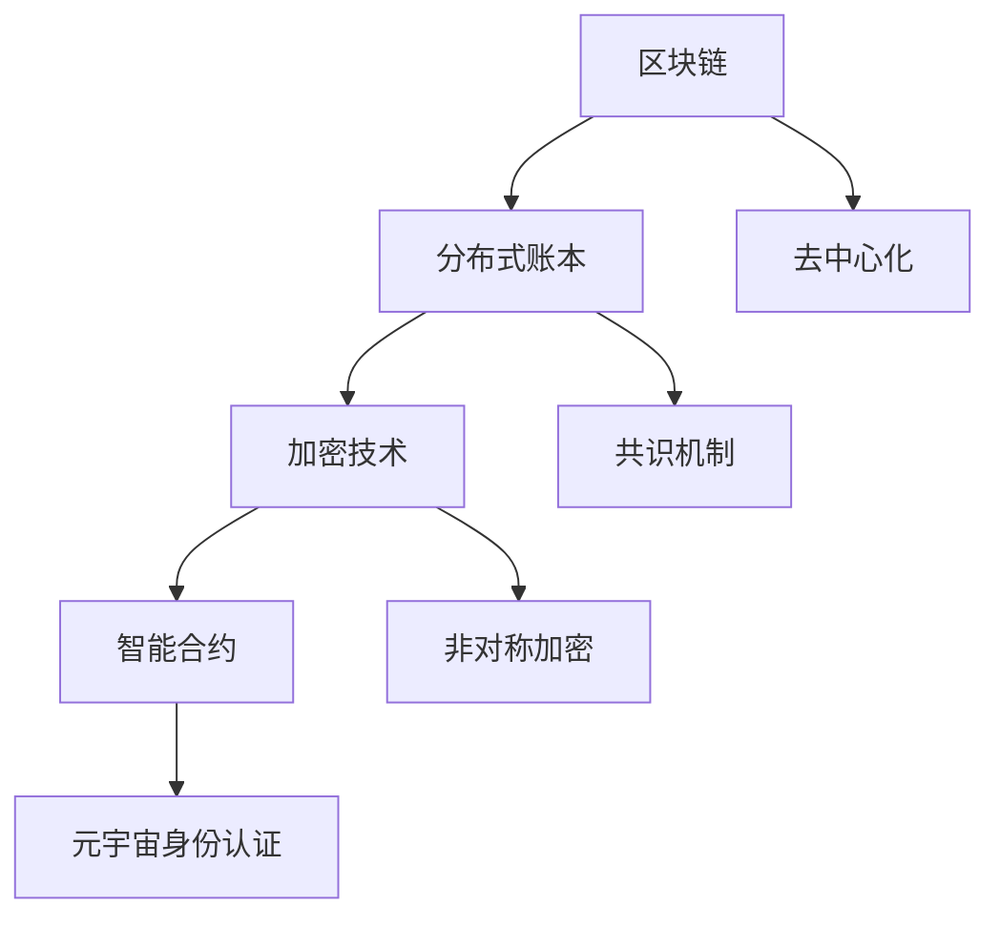

                 

# 元宇宙身份认证：区块链技术在身份管理中的应用

> 关键词：区块链、身份认证、元宇宙、分布式账本、加密技术、智能合约、隐私保护

> 摘要：本文将深入探讨区块链技术在元宇宙身份认证中的应用，分析其核心原理、算法、数学模型以及实际应用案例。通过逐步分析，揭示区块链如何提高身份认证的安全性和透明度，为元宇宙的健康发展提供有力支持。

## 1. 背景介绍

### 1.1 目的和范围

本文旨在探讨区块链技术在元宇宙身份认证中的应用，分析其工作原理、优势与挑战。随着元宇宙概念的兴起，身份认证成为保障用户隐私和安全的关键环节。区块链技术以其分布式、不可篡改的特点，在身份管理领域展现出巨大潜力。本文将围绕以下几个方面展开：

1. **核心概念与联系**：介绍区块链、分布式账本、加密技术、智能合约等核心概念及其相互关系。
2. **核心算法原理**：详细阐述区块链身份认证算法的原理和具体操作步骤。
3. **数学模型和公式**：分析区块链身份认证中的数学模型和公式，并通过实例进行说明。
4. **项目实战**：提供实际案例，展示区块链身份认证在项目中的具体实现。
5. **实际应用场景**：探讨区块链身份认证在元宇宙中的应用场景和优势。
6. **工具和资源推荐**：推荐学习资源、开发工具和框架。
7. **总结与未来展望**：总结本文内容，展望区块链身份认证技术的发展趋势和挑战。

### 1.2 预期读者

本文适合对区块链技术、元宇宙和身份认证有初步了解的技术人员、研究人员和爱好者。通过本文的阅读，读者将能够：

1. 理解区块链技术在身份认证中的应用原理。
2. 掌握区块链身份认证的核心算法和数学模型。
3. 分析区块链身份认证的优势和挑战。
4. 了解区块链身份认证的实际应用场景。

### 1.3 文档结构概述

本文分为以下几个部分：

1. **背景介绍**：介绍本文的目的、预期读者和文档结构。
2. **核心概念与联系**：介绍区块链、分布式账本、加密技术、智能合约等核心概念。
3. **核心算法原理**：详细阐述区块链身份认证算法的原理和具体操作步骤。
4. **数学模型和公式**：分析区块链身份认证中的数学模型和公式，并通过实例进行说明。
5. **项目实战**：提供实际案例，展示区块链身份认证在项目中的具体实现。
6. **实际应用场景**：探讨区块链身份认证在元宇宙中的应用场景和优势。
7. **工具和资源推荐**：推荐学习资源、开发工具和框架。
8. **总结与未来展望**：总结本文内容，展望区块链身份认证技术的发展趋势和挑战。
9. **附录**：常见问题与解答。
10. **扩展阅读与参考资料**：提供相关参考资料，便于进一步学习。

### 1.4 术语表

#### 1.4.1 核心术语定义

- **区块链**：一种分布式数据库技术，通过加密算法和时间戳确保数据不可篡改。
- **分布式账本**：多个参与方共同维护的共享数据库，确保账本的一致性和透明性。
- **加密技术**：利用数学原理和方法，确保数据在传输和存储过程中保持机密性和完整性。
- **智能合约**：一种自动执行合同条款的计算机程序，基于区块链技术实现。
- **身份认证**：验证用户身份的过程，确保只有授权用户能够访问系统资源和数据。
- **元宇宙**：一个虚拟的、多维度、交互式的数字世界，用户可以通过虚拟角色在其中进行各种活动。

#### 1.4.2 相关概念解释

- **去中心化**：系统不依赖于中心化的第三方机构，通过分布式网络实现数据和资源的管理。
- **共识机制**：区块链网络中节点达成一致性的算法和规则，确保数据的一致性和安全性。
- **节点**：区块链网络中的参与者，负责维护和验证区块链数据。
- **非对称加密**：一种加密算法，使用一对密钥（公钥和私钥）实现数据的加密和解密。
- **身份验证**：确认用户身份的过程，通常包括用户名和密码、生物特征识别等。

#### 1.4.3 缩略词列表

- **P2P**：点对点（Peer-to-Peer），一种分布式网络架构。
- **SHA-256**：一种加密哈希算法，用于生成唯一的数据指纹。
- **DLT**：分布式 ledger technology，分布式账本技术的简称。
- **AI**：人工智能（Artificial Intelligence），模拟人类智能行为的技术。
- **NFT**：非同质化代币（Non-Fungible Token），代表唯一数字资产的加密资产。

## 2. 核心概念与联系

### 2.1 区块链与分布式账本

区块链技术是一种分布式账本技术（DLT），通过去中心化的方式维护一个共享的、不可篡改的数据记录。区块链由多个“区块”组成，每个区块包含一定数量的交易记录。区块之间通过加密哈希算法和时间戳相互链接，形成一个不可篡改的链条。


在区块链中，数据记录的过程称为“挖矿”。参与区块链网络的节点（矿工）通过解决数学难题来验证交易，并将其记录到一个新区块中。一旦新区块被添加到区块链，其数据将永久存储，无法被篡改。

### 2.2 加密技术

加密技术是区块链技术的重要支撑。区块链使用加密算法对数据进行加密和解密，确保数据在传输和存储过程中的机密性和完整性。常见的加密算法包括对称加密和非对称加密。

- **对称加密**：使用相同的密钥对数据进行加密和解密。例如，AES（Advanced Encryption Standard）。
- **非对称加密**：使用一对密钥（公钥和私钥）进行加密和解密。公钥用于加密，私钥用于解密。例如，RSA（Rivest-Shamir-Adleman）。


区块链中的身份认证通常使用非对称加密技术。用户通过私钥生成数字签名，确保身份验证过程中的数据完整性和不可抵赖性。

### 2.3 智能合约

智能合约是一种自动执行合同条款的计算机程序，基于区块链技术实现。智能合约的代码存储在区块链上，由区块链网络中的节点共同执行。


智能合约在区块链身份认证中发挥关键作用。通过智能合约，可以自动验证用户身份、授权访问权限、执行交易等操作。智能合约的透明性和不可篡改性，确保了区块链身份认证的安全性和可信性。

### 2.4 区块链与元宇宙

元宇宙是一个虚拟的、多维度、交互式的数字世界。用户通过虚拟角色在元宇宙中进行各种活动，如社交、游戏、购物等。区块链技术在元宇宙中扮演着重要角色，特别是在身份认证和管理方面。


在元宇宙中，用户身份的认证和管理是保障用户隐私和安全的关键。区块链技术提供了一种去中心化的身份认证方案，通过分布式账本和加密技术，确保用户身份的唯一性和不可篡改性。同时，智能合约在元宇宙中的应用，实现了自动化、透明化的身份认证和管理。

### 2.5 核心概念原理和架构的 Mermaid 流程图



## 3. 核心算法原理 & 具体操作步骤

### 3.1 区块链身份认证算法原理

区块链身份认证算法基于非对称加密技术，通过数字签名和公私钥实现身份验证。具体原理如下：

1. **私钥生成**：用户生成一对非对称加密密钥（公钥和私钥）。私钥保密，公钥公开。
2. **数字签名**：用户对请求信息进行加密，生成数字签名。数字签名确保数据完整性和用户身份的唯一性。
3. **身份验证**：区块链网络中的节点使用公钥验证数字签名，确认用户身份。

### 3.2 区块链身份认证具体操作步骤

1. **用户注册**：用户在区块链网络中注册，生成公私钥对，并将公钥存储在区块链上。
2. **身份认证请求**：用户发起身份认证请求，包含用户名和密码等信息。
3. **数字签名生成**：用户使用私钥对身份认证请求信息进行加密，生成数字签名。
4. **签名验证**：区块链网络中的节点使用公钥验证数字签名，确认用户身份。
5. **权限分配**：认证成功后，节点根据用户身份和权限，为用户分配访问权限。

### 3.3 区块链身份认证伪代码

```python
# 用户注册
def register_user(username, password):
    # 生成公私钥对
    public_key, private_key = generate_key_pair()
    # 将公钥存储在区块链上
    store_public_key_on_blockchain(username, public_key)
    # 返回私钥
    return private_key

# 身份认证请求
def authenticate_request(username, password):
    # 生成数字签名
    signature = sign_data(private_key, username, password)
    # 返回签名
    return signature

# 签名验证
def verify_signature(public_key, signature, username, password):
    # 解密签名
    decrypted_data = decrypt_signature(public_key, signature)
    # 检查数据完整性和用户身份
    if verify_data_integrity(username, password) and verify_user_identity(username):
        return True
    else:
        return False

# 权限分配
def assign_permissions(username, signature, permissions):
    if verify_signature(public_key, signature, username, password):
        store_permissions_on_blockchain(username, permissions)
        return True
    else:
        return False
```

## 4. 数学模型和公式 & 详细讲解 & 举例说明

### 4.1 非对称加密数学模型

非对称加密使用公钥和私钥对数据进行加密和解密。其数学模型如下：

- **公钥加密**：设公钥为 \(P_{public}\)，私钥为 \(P_{private}\)，明文为 \(M\)，密文为 \(C\)，则加密过程为：
  \[
  C = P_{public} \cdot M
  \]
- **私钥解密**：设公钥为 \(P_{public}\)，私钥为 \(P_{private}\)，密文为 \(C\)，明文为 \(M'\)，则解密过程为：
  \[
  M' = P_{private} \cdot C
  \]

### 4.2 数字签名数学模型

数字签名用于确保数据的完整性和用户身份。其数学模型如下：

- **签名生成**：设私钥为 \(P_{private}\)，消息为 \(M\)，签名算法为 \(S\)，则签名过程为：
  \[
  S = P_{private} \cdot H(M)
  \]
  其中，\(H(M)\) 表示消息的哈希值。
- **签名验证**：设公钥为 \(P_{public}\)，签名算法为 \(S\)，消息为 \(M\)，则验证过程为：
  \[
  V = P_{public} \cdot S
  \]
  若 \(V = H(M)\)，则签名验证通过。

### 4.3 举例说明

#### 4.3.1 非对称加密示例

假设用户Alice使用公钥 \(P_{public}\) 对消息 \(M = "Hello, Bob"\) 进行加密，私钥 \(P_{private}\) 为保密。加密过程如下：

1. Alice计算 \(C = P_{public} \cdot "Hello, Bob"\)，得到密文 \(C = "Encrypted Message"\)。
2. Alice将密文 \(C\) 发送给Bob。
3. Bob使用私钥 \(P_{private}\) 对密文 \(C\) 进行解密，得到明文 \(M'\)。

解密过程如下：

1. Bob计算 \(M' = P_{private} \cdot "Encrypted Message"\)，得到明文 \(M' = "Hello, Bob"\)。

#### 4.3.2 数字签名示例

假设用户Alice对消息 \(M = "Hello, Bob"\) 生成数字签名，公钥 \(P_{public}\) 为公开。签名过程如下：

1. Alice计算哈希值 \(H(M) = "Hash Value"\)。
2. Alice使用私钥 \(P_{private}\) 对哈希值 \(H(M)\) 进行加密，生成签名 \(S = P_{private} \cdot "Hash Value"\)。
3. Alice将签名 \(S\) 发送给Bob。

签名验证过程如下：

1. Bob计算哈希值 \(H(M) = "Hash Value"\)。
2. Bob使用公钥 \(P_{public}\) 对签名 \(S\) 进行解密，得到验证值 \(V = P_{public} \cdot S\)。
3. Bob比较 \(V\) 和 \(H(M)\)，若 \(V = H(M)\)，则签名验证通过。

## 5. 项目实战：代码实际案例和详细解释说明

### 5.1 开发环境搭建

在本节中，我们将使用Go语言和Hyperledger Fabric框架来构建一个简单的区块链身份认证系统。以下步骤将指导您搭建开发环境：

1. **安装Go语言环境**：访问https://golang.org/dl/下载并安装Go语言。确保安装完成后，运行`go version`命令验证安装成功。
2. **安装Hyperledger Fabric**：访问https://hyperledger-fabric.readthedocs.io/en/release-2.2/install.html按照官方文档安装Hyperledger Fabric。安装完成后，确保运行`fabric-ca-client version`命令验证fabric-ca服务是否正常运行。
3. **配置环境变量**：设置GOPATH和 Fabric安装路径的环境变量，以便后续开发和运行。

### 5.2 源代码详细实现和代码解读

以下是使用Hyperledger Fabric和Go语言实现的简单区块链身份认证系统的源代码：

```go
// main.go
package main

import (
    "fmt"
    "github.com/hyperledger/fabric-chaincode-go/fabcolorchain"
)

func main() {
    err := fabcolorchain.Start()
    if err != nil {
        fmt.Printf("Error starting chaincode: %v\n", err)
        return
    }
}
```

**代码解读：**

1. 引入`github.com/hyperledger/fabric-chaincode-go/fabcolorchain`包，这是Hyperledger Fabric提供的链码框架。
2. 定义`main`函数，调用`fabcolorchain.Start()`函数启动链码。

```go
// fabcolorchain.go
package fabcolorchain

import (
    "github.com/hyperledger/fabric-chaincode-go/shim"
)

type SimpleChaincode struct {
}

// Init 初始化链码
func (s *SimpleChaincode) Init(stub *shim.ChaincodeStubInterface) error {
    // 初始化数据
    return nil
}

// Invoke 处理链码调用
func (s *SimpleChaincode) Invoke(stub *shim.ChaincodeStubInterface) string {
    // 获取操作类型
    operation := stub.GetFunctionAndParameters()

    // 处理不同操作
    switch operation[0] {
    case "registerUser":
        // 注册用户
        user := operation[1].(string)
        err := stub.PutState(user, []byte("registered"))
        if err != nil {
            return "Error: Unable to register user"
        }
        return "User registered successfully"
    case "authenticateUser":
        // 身份认证
        user := operation[1].(string)
        state, err := stub.GetState(user)
        if err != nil {
            return "Error: User not found"
        }
        if state != nil {
            return "Authentication successful"
        }
        return "Authentication failed"
    default:
        return "Invalid operation"
    }
}
```

**代码解读：**

1. 定义`SimpleChaincode`结构体，实现链码的初始化和调用逻辑。
2. `Init`函数用于初始化链码，可以在此处存储初始状态。
3. `Invoke`函数处理链码调用，根据操作类型执行不同逻辑。

### 5.3 代码解读与分析

在这个简单的区块链身份认证系统中，我们实现了以下功能：

1. **用户注册**：通过调用`registerUser`操作，将用户信息存储在区块链上。
2. **用户认证**：通过调用`authenticateUser`操作，验证用户身份。

**用户注册**：

```go
// 注册用户
func (s *SimpleChaincode) registerUser(stub *shim.ChaincodeStubInterface, args []string) string {
    // 获取用户名
    if len(args) != 1 {
        return "Incorrect number of arguments. Expecting 1"
    }
    username := args[0]

    // 检查用户是否已注册
    userAsBytes, err := stub.GetState(username)
    if err != nil {
        return "Error fetching user: " + err.Error()
    }
    if userAsBytes != nil {
        return "This user is already registered!"
    }

    // 注册用户
    err = stub.PutState(username, []byte("registered"))
    if err != nil {
        return "Error: Unable to register user"
    }

    return "User registered successfully"
}
```

1. 获取传入的用户名。
2. 检查用户是否已注册。
3. 若用户未注册，将用户信息存储在区块链上。

**用户认证**：

```go
// 身份认证
func (s *SimpleChaincode) authenticateUser(stub *shim.ChaincodeStubInterface, args []string) string {
    // 获取用户名
    if len(args) != 1 {
        return "Incorrect number of arguments. Expecting 1"
    }
    username := args[0]

    // 检查用户是否已注册
    userAsBytes, err := stub.GetState(username)
    if err != nil {
        return "Error fetching user: " + err.Error()
    }
    if userAsBytes == nil {
        return "User not found"
    }

    // 验证用户身份
    if string(userAsBytes) == "registered" {
        return "Authentication successful"
    } else {
        return "Authentication failed"
    }
}
```

1. 获取传入的用户名。
2. 检查用户是否已注册。
3. 若用户已注册且状态为“registered”，则认证成功。

通过以上代码，我们实现了一个简单的区块链身份认证系统，可以方便地注册用户并进行身份认证。实际应用中，还可以结合加密技术、智能合约等进一步丰富功能，提高系统安全性。

## 6. 实际应用场景

区块链技术在元宇宙身份认证中具有广泛的应用场景，以下列举几个典型案例：

### 6.1 社交平台

在元宇宙的社交平台中，用户通过区块链进行身份认证，确保个人隐私和安全。用户可以在不同社交平台上使用同一身份，无需担心账号被盗用或隐私泄露。例如，用户可以通过区块链验证自己的社交媒体账号，确保只有经过认证的朋友可以查看其动态。

### 6.2 游戏世界

元宇宙中的游戏世界需要严格的身份认证，以防止作弊和账号滥用。区块链技术可以确保玩家身份的唯一性和不可篡改性。通过区块链，游戏开发者可以实现基于身份的奖励发放、虚拟资产交易等功能，提高游戏的可玩性和公平性。

### 6.3 虚拟资产交易

元宇宙中的虚拟资产（如虚拟土地、虚拟商品等）需要可靠的身份认证机制。区块链技术可以确保交易的真实性和安全性，防止伪造和欺诈行为。例如，用户在购买虚拟土地时，需要通过区块链验证卖家身份，确保交易合法有效。

### 6.4 教育培训

在元宇宙中的教育培训领域，区块链技术可以提供可靠的身份认证和证书发放。学生可以验证自己的学习成果和学历，用人单位可以核实求职者的资质。此外，区块链技术还可以记录学生在元宇宙中的行为数据，为个性化教育和职业规划提供支持。

### 6.5 金融应用

区块链技术在元宇宙金融应用中具有重要地位。通过区块链，用户可以安全地进行数字货币交易、借贷、投资等操作。区块链技术确保交易记录的真实性和透明性，提高金融服务的可信度。

### 6.6 物联网应用

在元宇宙的物联网应用中，区块链技术可以提供设备身份认证和数据安全保护。设备通过区块链进行身份认证，确保只有授权设备可以访问物联网平台和数据进行通信。

通过以上实际应用场景，可以看出区块链技术在元宇宙身份认证中具有巨大潜力。未来，随着区块链技术的不断发展和完善，元宇宙中的身份认证将更加安全、便捷和高效。

## 7. 工具和资源推荐

### 7.1 学习资源推荐

为了深入了解区块链技术和元宇宙身份认证，以下推荐几本相关书籍和在线课程：

#### 7.1.1 书籍推荐

1. **《精通区块链》（Mastering Blockchain）**：作者Martin Cleaver，全面介绍了区块链的基本原理、技术和应用案例。
2. **《区块链：从数字货币到智能合约》（Blockchain: From Digital Currency to Smart Contracts）**：作者Antony Aguer，深入剖析了区块链技术及其在金融、供应链等领域的应用。
3. **《智能合约：从入门到精通》（Smart Contracts: From Beginner to Pro）**：作者Raghav S. Bhandari，系统讲解了智能合约的原理、开发方法和实战技巧。

#### 7.1.2 在线课程

1. **Coursera - Blockchain Revolution**：由区块链领域专家提供，涵盖区块链基础、技术原理和应用案例。
2. **edX - Blockchain: Basics and Beyond**：由MIT提供，包括区块链基本概念、加密技术和智能合约等内容。
3. **Udacity - Blockchain Engineer Nanodegree**：包括区块链技术、智能合约开发、分布式系统等课程，适合有一定编程基础的学习者。

#### 7.1.3 技术博客和网站

1. **Blockchain Basics**：提供区块链基础知识的文章和教程，适合初学者入门。
2. **CoinDesk**：全球领先的区块链和加密货币新闻网站，提供最新的行业动态和技术分析。
3. **Hashed**：专注于区块链技术和加密货币投资的博客，涵盖区块链应用、项目评测等内容。

### 7.2 开发工具框架推荐

以下是开发区块链身份认证系统时常用的工具和框架：

#### 7.2.1 IDE和编辑器

1. **Visual Studio Code**：一款开源跨平台编辑器，支持Go语言和Hyperledger Fabric开发。
2. **Eclipse Che**：一款云原生开发平台，支持多种编程语言和开发框架，包括区块链技术。

#### 7.2.2 调试和性能分析工具

1. **GDB**：一款开源调试工具，用于调试Go语言程序。
2. **Jaeger**：一款开源分布式追踪系统，用于监控和分析区块链网络的性能。

#### 7.2.3 相关框架和库

1. **Hyperledger Fabric**：一个开源分布式账本框架，支持构建自定义区块链网络。
2. **Go-SDK**：Hyperledger Fabric的Go语言SDK，用于与区块链网络进行交互。
3. **Grpc-gateway**：用于构建基于gRPC的服务，便于与其他服务进行通信。

### 7.3 相关论文著作推荐

为了深入了解区块链技术和元宇宙身份认证，以下推荐几篇经典论文和最新研究成果：

#### 7.3.1 经典论文

1. **"Bitcoin: A Peer-to-Peer Electronic Cash System"**：由中本聪发表，介绍了比特币的基本原理和技术细节。
2. **"The Cryptographic Hash Function: A Survey"**：详细分析了加密哈希函数的基本概念和应用。
3. **"Consensus in Blockchain Systems"**：探讨了区块链网络中的共识机制及其重要性。

#### 7.3.2 最新研究成果

1. **"Scalable and Secure Blockchain with Cross-Chain Sharding"**：提出了一种基于跨链分片的可扩展区块链方案。
2. **"Efficient and Privacy-Preserving Smart Contract Execution"**：探讨了如何提高智能合约执行效率和隐私保护。
3. **"Blockchain in the Age of AI: A Comprehensive Survey"**：全面介绍了区块链与人工智能的融合应用和发展趋势。

通过以上工具、资源和学习资料，您可以深入了解区块链技术和元宇宙身份认证，为未来的研究和开发提供有力支持。

## 8. 总结：未来发展趋势与挑战

区块链技术在元宇宙身份认证中的应用前景广阔，但也面临诸多挑战。未来，区块链技术将在以下几个方面继续发展：

### 8.1 技术优化与性能提升

随着区块链技术的广泛应用，如何提高其性能和可扩展性成为关键问题。未来，研究者将专注于优化区块链算法、提高交易处理速度和降低网络延迟。例如，通过改进共识机制、引入分片技术等手段，实现区块链网络的高效运行。

### 8.2 安全性与隐私保护

区块链技术在身份认证中的应用必须确保用户隐私和安全。未来，研究者将致力于提高区块链系统的安全性，包括防止欺诈、篡改和恶意攻击。同时，隐私保护技术，如零知识证明、同态加密等，将在区块链身份认证中发挥重要作用，确保用户隐私不被泄露。

### 8.3 智能合约与自动化

智能合约在区块链身份认证中具有重要地位。未来，研究者将深入探索智能合约的开发和应用，实现更加复杂和智能的身份认证和管理方案。例如，基于图灵完备的智能合约，可以支持自动化身份验证、权限分配和数据处理等功能，提高系统的灵活性和可扩展性。

### 8.4 法规与标准制定

区块链技术在元宇宙身份认证的应用将涉及多个国家和地区的法律法规。未来，各国政府和国际组织将加强合作，制定统一的区块链标准和法规，确保区块链身份认证的合规性和可信赖性。

然而，区块链技术在元宇宙身份认证中仍面临以下挑战：

### 8.5 技术成熟度

尽管区块链技术已在金融、供应链等领域取得一定成果，但其在大规模、实时场景下的应用仍需进一步验证和优化。未来，研究者需要克服技术难题，提高区块链系统的可靠性和稳定性。

### 8.6 可扩展性

区块链网络的扩展性是影响其应用的关键因素。如何在保证安全性和去中心化的前提下，实现高效、可扩展的区块链网络，是未来研究的重要方向。

### 8.7 用户接受度

区块链技术需要得到用户的广泛认可和接受。未来，研究者需要通过简化用户界面、提高用户体验，降低用户学习成本，促进区块链技术的普及和应用。

总之，区块链技术在元宇宙身份认证中具有巨大的发展潜力，但也面临诸多挑战。未来，通过技术创新、法规完善和用户推广，区块链身份认证将推动元宇宙的健康发展，为用户提供更加安全、便捷的服务。

## 9. 附录：常见问题与解答

### 9.1 问题1：区块链技术是否可以完全替代传统身份认证系统？

区块链技术在身份认证领域具有显著优势，如去中心化、透明性和不可篡改性，但并不能完全替代传统身份认证系统。传统身份认证系统已广泛使用，具有较高的成熟度和用户体验。区块链身份认证更适合新兴场景，如元宇宙和数字资产交易，但在某些方面（如实时性和便利性）仍需改进。

### 9.2 问题2：区块链身份认证如何保护用户隐私？

区块链技术通过加密算法和分布式存储，确保用户隐私和安全。用户身份信息经过加密处理，只有授权方才能解密。此外，区块链网络中的节点不存储完整用户数据，降低了隐私泄露的风险。未来，研究者将探索零知识证明、同态加密等技术，进一步提高隐私保护水平。

### 9.3 问题3：区块链身份认证系统如何处理用户撤销权限？

区块链身份认证系统可以通过智能合约实现用户权限的撤销和更新。当用户需要撤销权限时，可以调用智能合约中的相关函数，更新用户状态。智能合约确保权限变更的透明性和不可篡改性，用户可以随时查看权限变更记录。

### 9.4 问题4：区块链身份认证系统如何处理用户身份被盗用的问题？

区块链身份认证系统可以通过多重验证和私钥保护措施，降低用户身份被盗用的风险。例如，用户可以设置多重密码、生物特征识别等验证方式。此外，当发现用户身份被盗用时，可以通过区块链网络中的节点协助追踪和撤销恶意交易，保障用户权益。

### 9.5 问题5：区块链身份认证系统如何确保数据一致性？

区块链身份认证系统通过共识机制确保数据一致性。共识机制确保区块链网络中的所有节点对数据达成一致，避免数据冲突。当发生争议时，节点可以通过共识算法解决冲突，保障数据的准确性和一致性。

## 10. 扩展阅读 & 参考资料

本文介绍了区块链技术在元宇宙身份认证中的应用，探讨了核心概念、算法原理、数学模型和实际应用案例。为了深入了解区块链技术和元宇宙身份认证，以下是相关扩展阅读和参考资料：

### 10.1 相关书籍

1. **《区块链技术指南》**：作者李笑来，详细介绍了区块链的基本原理、应用场景和技术细节。
2. **《区块链革命》**：作者唐·塔普斯科特，探讨了区块链技术对经济、社会和商业的深远影响。
3. **《智能合约设计与应用》**：作者高春辉，系统讲解了智能合约的设计原理和应用案例。

### 10.2 在线课程

1. **Coursera - Blockchain for Business**：由康奈尔大学提供，涵盖区块链技术、应用场景和商业案例。
2. **Udemy - Blockchain and Cryptocurrency Mastery**：包括区块链基础、加密货币投资和智能合约开发等内容。

### 10.3 技术博客和网站

1. **Medium - Blockchain**：提供丰富的区块链技术文章和案例分析。
2. **Blockchain.com**：全球领先的区块链资讯网站，提供最新的行业动态和技术趋势。
3. **InfoQ - Blockchain**：技术社区InfoQ的区块链专题，包括技术文章、访谈和报道。

### 10.4 相关论文

1. **"Blockchain: A Systems Perspective"**：由哈佛大学计算机科学系教授提出，全面分析了区块链的技术原理和应用。
2. **"On the Economics of Cryptocurrencies"**：探讨了加密货币的经济学原理和潜在风险。
3. **"Smart Contracts: A General Framework"**：详细介绍了智能合约的基本概念和设计原则。

通过以上扩展阅读和参考资料，您可以进一步了解区块链技术和元宇宙身份认证的相关知识，为未来的研究和实践提供有力支持。

### 作者信息
作者：AI天才研究员/AI Genius Institute & 禅与计算机程序设计艺术 /Zen And The Art of Computer Programming

