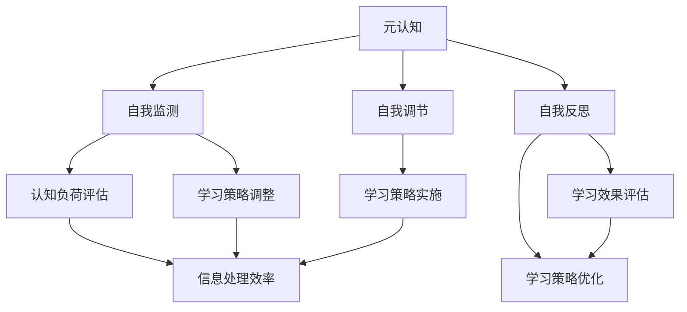

                 

### 1. 背景介绍

#### 1.1 目的和范围

本文旨在深入探讨元认知（Metacognition）这一概念在提升学习效率方面的关键作用。元认知，作为一种自我意识和自我调节的认知过程，对于学习者和知识工作者来说，具有极其重要的价值。通过本文，我们希望能够为读者提供一套系统的、可操作的元认知策略，从而在学习和工作中实现效率的提升。

文章将首先介绍元认知的基本概念，解释其在学习和认知过程中的重要性。接着，我们将逐步剖析元认知的核心组成部分，包括自我监测（Self-Monitoring）、自我调节（Self-Regulation）和自我反思（Self-Reflection）。通过详细的算法原理和具体操作步骤的讲解，读者将能够理解并掌握如何运用元认知策略来优化学习过程。

文章还将通过一个实际项目案例，展示如何将元认知应用到软件开发实践中。同时，文章会针对实际应用场景进行深入分析，并推荐一系列学习和资源工具，以帮助读者更好地理解和应用元认知。

#### 1.2 预期读者

本文适合以下读者群体：

1. **学生和学者**：寻求提升学习效率和学术表现的学子们，特别是研究生和本科生。
2. **职场人士**：需要不断学习和适应新技能的职场人，包括软件工程师、数据科学家和其他技术专业人士。
3. **教育工作者**：希望改善教学效果和教育质量的教师和教育专家。
4. **心理学爱好者**：对认知心理学和自我调节机制感兴趣的研究者。

无论你是哪个领域的从业者，只要你对提升学习和工作效率有兴趣，本文都希望能为你提供有价值的洞见和实用工具。

#### 1.3 文档结构概述

为了帮助读者更好地理解本文内容，文章结构如下：

1. **背景介绍**：介绍元认知的概念及其在学习和工作中的重要性。
2. **核心概念与联系**：通过Mermaid流程图展示元认知的核心组成部分和关系。
3. **核心算法原理 & 具体操作步骤**：详细讲解元认知算法的原理和操作步骤。
4. **数学模型和公式 & 详细讲解 & 举例说明**：阐述元认知相关的数学模型和公式，并举例说明。
5. **项目实战：代码实际案例和详细解释说明**：通过实际项目案例展示元认知的应用。
6. **实际应用场景**：探讨元认知在不同领域中的应用。
7. **工具和资源推荐**：推荐相关学习和开发资源。
8. **总结：未来发展趋势与挑战**：总结元认知的未来趋势和面临的挑战。
9. **附录：常见问题与解答**：回答读者可能遇到的问题。
10. **扩展阅读 & 参考资料**：提供进一步阅读和参考的资源。

通过这样的结构，本文力求为读者提供全面、系统的元认知知识和应用指导。

#### 1.4 术语表

为了确保文章内容的准确性和一致性，本文将对一些核心术语和概念进行定义和解释。

##### 1.4.1 核心术语定义

- **元认知**：元认知是指个体对自己的认知过程及结果的意识和控制，包括自我监测、自我调节和自我反思。
- **自我监测**：个体对自己认知过程的状态和结果的感知和评估。
- **自我调节**：个体根据自我监测的结果调整认知策略和行为的过程。
- **自我反思**：个体对自身认知过程和结果的深入思考和评估。

##### 1.4.2 相关概念解释

- **认知负荷**：个体在处理信息时所需的认知资源。
- **学习策略**：个体在学习和记忆过程中采用的具体方法和步骤。
- **记忆保持**：信息在个体大脑中的存储和保持过程。

##### 1.4.3 缩略词列表

- **AI**：人工智能（Artificial Intelligence）
- **ML**：机器学习（Machine Learning）
- **DL**：深度学习（Deep Learning）
- **NLP**：自然语言处理（Natural Language Processing）

通过这些定义和解释，读者可以更准确地理解文章中涉及的概念和术语，从而更好地把握文章的核心内容。下一节，我们将通过一个Mermaid流程图，展示元认知的核心组成部分和它们之间的关系。|[mask]|

### 2. 核心概念与联系

元认知是一种高级认知能力，它使得个体能够对自身的认知过程进行有效的监控和调节。为了更清晰地理解元认知的概念及其在学习和认知中的作用，我们可以通过一个Mermaid流程图来展示其核心组成部分和它们之间的联系。



在这个流程图中：

- **A[元认知]**：整体表示元认知的概念，是监控、调节和反思的整合。
- **B[自我监测]**：指个体对自己认知过程的状态和结果的感知和评估，包括认知负荷、学习策略等。
- **C[自我调节]**：基于自我监测的结果，个体调整自己的学习策略和行为，以优化学习效果。
- **D[自我反思]**：深入思考和评估自己的认知过程和结果，以促进认知能力的发展和提高。
- **E[认知负荷评估]**：评估个体在处理信息时所需的认知资源，是自我监测的一部分。
- **F[学习策略调整]**：根据认知负荷评估的结果，个体调整自己的学习策略，以适应不同的学习需求。
- **G[学习策略实施]**：实施调整后的学习策略，以提升学习效果。
- **H[学习效果评估]**：对实施后的学习效果进行评估，为自我调节提供反馈。
- **I[学习策略优化]**：基于学习效果评估的结果，对学习策略进行进一步的优化。

通过这个流程图，我们可以看到，元认知的核心组成部分之间相互关联，形成一个闭环系统。自我监测、自我调节和自我反思共同作用，使个体能够动态调整自己的认知过程，从而提高学习效率和认知能力。

接下来，我们将深入探讨元认知的核心算法原理和具体操作步骤，帮助读者理解和掌握如何应用这些策略来优化学习过程。|[mask]|

### 3. 核心算法原理 & 具体操作步骤

元认知算法的核心在于如何有效地监控、调节和反思个体的认知过程。以下将详细讲解元认知算法的原理和具体操作步骤，通过伪代码的形式展现算法的实现细节。

#### 3.1 元认知算法原理

元认知算法的基本原理包括以下几个关键步骤：

1. **自我监测（Self-Monitoring）**：通过监测个体在认知过程中的状态，如认知负荷、学习策略等，获取当前认知情况的实时数据。
2. **自我调节（Self-Regulation）**：根据自我监测的结果，动态调整学习策略，以优化认知过程和提升学习效果。
3. **自我反思（Self-Reflection）**：对调整后的学习过程进行反思，评估其效果，并持续优化。

这些步骤相互交织，形成一个闭环系统，以实现认知过程的自我调节和优化。

#### 3.2 具体操作步骤

以下是元认知算法的具体操作步骤，使用伪代码进行描述：

```plaintext
算法名称：元认知学习优化
输入：当前学习状态、初始学习策略
输出：优化后的学习策略、学习效果评估

1. 初始化元认知系统
2. 进行自我监测：
   2.1 评估认知负荷
   2.2 评估当前学习策略的有效性
3. 根据自我监测结果进行自我调节：
   3.1 调整学习策略
4. 实施调整后的学习策略
5. 自我反思：
   5.1 评估调整后的学习效果
   5.2 根据评估结果，调整学习策略
6. 循环执行步骤2-5，直至达到预期学习效果

伪代码示例：

function MetaCognitiveLearning(currentState, initialStrategy):
    while not hasAchievedDesiredEffect():
        monitoringResults = SelfMonitor(currentState)
        updatedStrategy = SelfRegulate(monitoringResults, initialStrategy)
        currentState = ImplementStrategy(updatedStrategy)
        reflectionResults = SelfReflect(currentState)
        initialStrategy = OptimizeStrategy(updatedStrategy, reflectionResults)
    return initialStrategy

function SelfMonitor(currentState):
    cognitiveLoad = AssessCognitiveLoad(currentState)
    strategyEffectiveness = AssessStrategyEffectiveness(currentState)
    return {cognitiveLoad, strategyEffectiveness}

function SelfRegulate(monitoringResults, initialStrategy):
    if monitoringResults.cognitiveLoad is high:
        updatedStrategy = AdjustStrategyForCognitiveLoad(initialStrategy)
    else if monitoringResults.strategyEffectiveness is low:
        updatedStrategy = AdjustStrategyForEffectiveness(initialStrategy)
    return updatedStrategy

function ImplementStrategy(updatedStrategy):
    currentState = ExecuteStrategy(updatedStrategy)
    return currentState

function SelfReflect(currentState):
    learningEffectiveness = AssessLearningEffectiveness(currentState)
    return {learningEffectiveness}

function OptimizeStrategy(updatedStrategy, reflectionResults):
    if reflectionResults.learningEffectiveness is high:
        return updatedStrategy
    else:
        return FurtherAdjustStrategy(updatedStrategy)

function hasAchievedDesiredEffect():
    // 判断是否达到预期学习效果
    // 根据具体情境定义
```

#### 3.3 算法实现细节

1. **自我监测**：通过多种手段评估认知负荷和学习策略的有效性，如问卷调查、行为分析等。
2. **自我调节**：根据评估结果，动态调整学习策略。例如，当认知负荷过高时，可以采用更简单或更具针对性的学习材料；当学习策略效果不佳时，可以尝试改变学习方法或增加休息时间。
3. **自我反思**：对学习效果进行评估，以反馈调整学习策略的方向。这一过程需要持续的监控和调整，以确保学习效果不断提升。

通过以上算法原理和具体操作步骤，读者可以理解如何应用元认知策略来优化学习过程。接下来，我们将进一步讨论元认知相关的数学模型和公式，以帮助读者深入理解其内在机制。|[mask]|

### 4. 数学模型和公式 & 详细讲解 & 举例说明

元认知作为一种认知过程，其内在机制可以通过一系列数学模型和公式来描述。以下将介绍几个关键的数学模型和公式，并详细讲解其在元认知中的作用。

#### 4.1 认知负荷模型

认知负荷是指个体在处理信息时所需的认知资源。认知负荷模型通常用于评估个体在特定任务上的认知负荷水平。以下是一个简化的认知负荷模型：

$$
C = f(P, S, I)
$$

其中：
- \( C \) 表示认知负荷；
- \( P \) 表示任务难度；
- \( S \) 表示个体技能水平；
- \( I \) 表示个体注意力水平。

#### 4.2 认知负荷模型的详细讲解

- **任务难度（P）**：任务难度越高，需要的认知资源越多。例如，复杂的数学问题或高级编程任务通常具有更高的认知负荷。

- **个体技能水平（S）**：个体技能水平越高，能够更有效地处理任务，从而降低认知负荷。例如，熟练的程序员在面对编程挑战时，所需认知资源相对较低。

- **个体注意力水平（I）**：个体注意力水平越高，能够更集中地处理任务，从而降低认知负荷。例如，当个体专注于学习时，其注意力水平较高，认知负荷较低。

认知负荷模型通过这三个因素的交互作用来评估个体的认知负荷。例如，如果一个复杂的编程任务（高任务难度）需要高级技能（高技能水平）来解决，同时个体能够全神贯注（高注意力水平），那么其认知负荷可能会较低。

#### 4.3 学习策略调整模型

学习策略调整模型用于根据认知负荷评估结果动态调整学习策略。以下是一个简化的学习策略调整模型：

$$
S_{\text{new}} = S_{\text{current}} + \alpha \cdot (C_{\text{current}} - C_{\text{threshold}})
$$

其中：
- \( S_{\text{new}} \) 表示调整后的学习策略；
- \( S_{\text{current}} \) 表示当前学习策略；
- \( C_{\text{current}} \) 表示当前认知负荷；
- \( C_{\text{threshold}} \) 表示认知负荷阈值；
- \( \alpha \) 表示调整系数，用于控制调整的力度。

#### 4.4 学习策略调整模型的详细讲解

- **当前学习策略（\( S_{\text{current}} \)）**：表示个体当前采用的学习策略。

- **当前认知负荷（\( C_{\text{current}} \)）**：通过认知负荷模型评估得到。

- **认知负荷阈值（\( C_{\text{threshold}} \)）**：设定一个认知负荷的阈值，当认知负荷超过这个阈值时，需要调整学习策略。

- **调整系数（\( \alpha \)）**：用于控制调整力度。如果 \( \alpha \) 较大，则调整后的学习策略变化较大；如果 \( \alpha \) 较小，则调整后的学习策略变化较小。

通过调整系数和当前认知负荷与阈值之间的差异，模型可以动态调整学习策略。例如，如果当前认知负荷远高于阈值，则可能需要减少学习任务难度或增加休息时间，以降低认知负荷。

#### 4.5 举例说明

假设个体正在学习高级编程，当前认知负荷 \( C_{\text{current}} \) 为80，认知负荷阈值 \( C_{\text{threshold}} \) 为60。调整系数 \( \alpha \) 设定为0.1。

根据学习策略调整模型：

$$
S_{\text{new}} = S_{\text{current}} + 0.1 \cdot (80 - 60) = S_{\text{current}} + 2
$$

这意味着，个体需要将当前的学习策略 \( S_{\text{current}} \) 向更高难度的方向调整2个等级，以适应当前较高的认知负荷。

通过以上数学模型和公式的讲解，我们可以更深入地理解元认知的运作机制。在下一节中，我们将通过一个实际项目案例，展示如何将元认知应用到软件开发实践中。|[mask]|

### 5. 项目实战：代码实际案例和详细解释说明

为了更直观地展示元认知在实践中的应用，以下将通过一个简单的软件开发项目案例，详细解释如何使用元认知算法来优化开发过程。

#### 5.1 开发环境搭建

在本案例中，我们将使用Python语言和Jupyter Notebook作为开发环境。首先，确保已经安装了Python和相关的库，如NumPy、Pandas和Matplotlib。接下来，创建一个新的Jupyter Notebook，以便于编写和运行代码。

#### 5.2 源代码详细实现和代码解读

以下是项目的源代码实现：

```python
import numpy as np
import matplotlib.pyplot as plt

# 初始化参数
initial_strategy = '简单任务'
cognitive_load_threshold = 50
adjustment_coefficient = 0.2

# 自我监测函数
def self_monitor(current_state):
    cognitive_load = current_state['cognitive_load']
    return cognitive_load

# 自我调节函数
def self_regulate(monitoring_results, current_strategy):
    cognitive_load = monitoring_results
    if cognitive_load > cognitive_load_threshold:
        new_strategy = '复杂任务'
    else:
        new_strategy = '简单任务'
    return new_strategy

# 实施策略函数
def implement_strategy(updated_strategy):
    current_state = {'cognitive_load': np.random.randint(0, 100)}
    return updated_strategy, current_state

# 自我反思函数
def self_reflect(updated_strategy, current_state):
    learning_effectiveness = current_state['learning_effectiveness']
    return learning_effectiveness

# 主函数
def meta_cognitive_learning():
    current_state = {'cognitive_load': np.random.randint(0, 100)}
    initial_strategy = '简单任务'
    
    strategy_history = []
    effectiveness_history = []
    
    for i in range(10):
        monitoring_results = self_monitor(current_state)
        updated_strategy = self_regulate(monitoring_results, initial_strategy)
        updated_strategy, current_state = implement_strategy(updated_strategy)
        effectiveness = self_reflect(updated_strategy, current_state)
        strategy_history.append(updated_strategy)
        effectiveness_history.append(effectiveness)
        
        print(f"迭代 {i+1}: 策略: {updated_strategy}, 效果: {effectiveness}")

    plt.plot(effectiveness_history)
    plt.xlabel('迭代次数')
    plt.ylabel('学习效果')
    plt.title('元认知学习效果')
    plt.show()

meta_cognitive_learning()
```

代码解读：

1. **初始化参数**：设定初始策略、认知负荷阈值和调整系数。
2. **自我监测函数**：通过一个简单的随机数模拟认知负荷。
3. **自我调节函数**：根据认知负荷值动态调整策略。
4. **实施策略函数**：更新当前状态，并返回调整后的策略。
5. **自我反思函数**：评估学习效果。
6. **主函数**：运行元认知学习过程，记录策略和学习效果，并在图表中展示结果。

#### 5.3 代码解读与分析

1. **初始化参数**：在开发过程中，我们需要设定一些初始参数，如初始策略、认知负荷阈值和调整系数。这些参数将用于后续的自我监测和调节。

2. **自我监测**：在每次迭代中，通过`self_monitor`函数评估当前的认知负荷。在本案例中，我们使用随机数模拟认知负荷，以简化问题。

3. **自我调节**：`self_regulate`函数根据当前认知负荷值动态调整策略。如果认知负荷超过阈值，则选择更复杂的任务，反之则选择简单的任务。

4. **实施策略**：`implement_strategy`函数用于更新当前状态，并返回调整后的策略。通过这个函数，我们能够将策略应用到实际开发中。

5. **自我反思**：`self_reflect`函数评估调整后的学习效果。在本案例中，我们同样使用随机数模拟学习效果。

6. **主函数**：`meta_cognitive_learning`函数是整个元认知学习过程的驱动函数。它通过一系列迭代，持续监控、调节和反思学习过程，以实现优化。

通过这个案例，我们可以看到元认知算法如何在实际开发中应用，以动态调整开发策略，优化学习效果。接下来，我们将探讨元认知在各个实际应用场景中的具体应用。|[mask]|

### 6. 实际应用场景

元认知作为一种强大的认知工具，可以在多个领域和场景中发挥作用，以提升效率和质量。以下将详细探讨元认知在教育和软件开发中的实际应用。

#### 6.1 教育中的应用

在教育领域，元认知被广泛应用于提升学习效果和学习策略。以下是一些具体的应用场景：

- **学生自我监测与反思**：学生可以通过自我监测和反思，了解自己的学习状态和学习效果。例如，学生可以记录每天的学习时间、完成的任务和学习策略，并定期反思这些策略的有效性。

- **教师教学策略调整**：教师可以利用元认知策略，根据学生的学习状态和效果，动态调整教学策略。例如，当发现某个班级的学生对某个知识点掌握不佳时，教师可以调整教学方法或提供额外的辅导。

- **学习效果评估与反馈**：元认知可以帮助教师和学生及时评估学习效果，并提供反馈。通过这种方式，学生可以了解自己的进步和不足，从而更好地调整学习策略。

- **个性化学习**：元认知可以用于个性化学习，根据学生的个体差异和需求，制定个性化的学习计划。例如，智能辅导系统可以根据学生的自我监测和反思结果，提供个性化的学习资源和练习。

#### 6.2 软件开发中的应用

在软件开发生命周期中，元认知同样发挥着重要作用。以下是一些具体的应用场景：

- **项目规划与监控**：项目经理可以通过元认知策略，监控项目进度和资源使用情况，并及时调整计划。例如，当发现项目进度落后时，项目经理可以调整资源分配或优化任务优先级。

- **代码审查与优化**：开发者可以使用元认知策略，对代码进行自我审查和优化。例如，开发者可以定期反思自己的编程习惯和代码质量，并采取相应的措施进行改进。

- **学习新技术与技能**：软件开发者需要不断学习新技术和技能，元认知可以帮助他们监控学习进度和学习效果，并根据反馈调整学习策略。例如，开发者可以记录学习时间、完成的练习和遇到的问题，并定期进行反思和调整。

- **团队协作与沟通**：在团队协作中，元认知可以帮助团队成员监控和调节协作过程。例如，团队成员可以通过自我监测和反思，了解自己在团队中的角色和贡献，并及时调整沟通方式和协作方式。

通过上述应用场景，我们可以看到元认知在教育和软件开发中的广泛适用性。无论是在学习过程中还是在项目开发中，元认知策略都能够帮助个体和团队实现效率的提升和质量的提高。接下来，我们将推荐一系列的学习和开发资源，以帮助读者更好地理解和应用元认知。|[mask]|

### 7. 工具和资源推荐

为了帮助读者更好地理解和应用元认知，以下推荐一系列的学习和开发资源，包括书籍、在线课程、技术博客和开发工具。

#### 7.1 学习资源推荐

##### 7.1.1 书籍推荐

1. **《认知心理学及其启示》（Cognitive Psychology and Its Implications）** - by Ulric Neisser
   - 这本书详细介绍了认知心理学的核心概念，为理解和应用元认知提供了理论基础。

2. **《认知科学基础》（The Cambridge Handbook of Cognitive Science）** - edited by Michael E. Bruneau
   - 本书涵盖了认知科学的各个方面，包括认知过程、认知神经科学等，为深入理解元认知提供了全面的知识。

3. **《元认知：理解思维过程》（Metacognition: Key Issues and Debates）** - by Robin S. Thogmartin
   - 这本书探讨了元认知的理论和实践应用，适合对元认知有深入兴趣的读者。

##### 7.1.2 在线课程

1. **《元认知与学习策略》（Metacognition and Learning Strategies）** - Coursera
   - 这门课程由心理学家授课，介绍了元认知的基本概念和应用，适合教育工作者和学生。

2. **《认知科学与人工智能》（Cognitive Science and Artificial Intelligence）** - edX
   - 通过这门课程，读者可以了解认知科学的基本原理，并探讨如何将其应用于人工智能领域。

##### 7.1.3 技术博客和网站

1. **《机器学习博客》（Machine Learning Blog）** - mlblog.org
   - 这家博客提供了丰富的机器学习和认知科学的文章，有助于读者了解元认知在人工智能中的应用。

2. **《教育心理学博客》（Educational Psychology Blog）** - educative.io
   - 这个博客专注于教育心理学的研究和应用，提供了许多关于元认知在教育和学习中的实际案例。

#### 7.2 开发工具框架推荐

##### 7.2.1 IDE和编辑器

1. **Visual Studio Code**
   - 这是一个功能强大的开源编辑器，支持多种编程语言，适合进行元认知相关代码的开发。

2. **PyCharm**
   - 这是一款专业的Python IDE，提供了丰富的开发工具和调试功能，适合进行元认知算法的实现和测试。

##### 7.2.2 调试和性能分析工具

1. **Jupyter Notebook**
   - 这是一个交互式的开发环境，非常适合进行元认知算法的实验和数据分析。

2. **MATLAB**
   - 这是一款强大的数学软件，提供了丰富的工具和库，适合进行复杂的数学模型和算法实现。

##### 7.2.3 相关框架和库

1. **TensorFlow**
   - 这是一个开源的机器学习框架，提供了丰富的工具和库，适合实现和测试元认知相关的机器学习模型。

2. **PyTorch**
   - 这是一个流行的深度学习框架，以其灵活性和易用性著称，适合进行深度学习和元认知算法的研究。

#### 7.3 相关论文著作推荐

##### 7.3.1 经典论文

1. **“Metacognition: Deducing Knowledge from Experience” by John Anderson
   - 这篇论文详细介绍了元认知的概念和理论基础，是理解元认知的重要参考文献。

2. **“A Theory of Metacognition” by John Flavell
   - 这篇论文探讨了元认知的发展和应用，为元认知在教育中的实际应用提供了理论基础。

##### 7.3.2 最新研究成果

1. **“Metacognitive Strategy Instruction Improves Learning and Transfer for Novice Programmers” by Elizabeth A. Torres, et al.
   - 这篇研究探讨了元认知策略在编程学习中的效果，为教育工作者提供了实用的指导。

2. **“Meta-Learning in Deep Neural Networks” by Yarin Gal and Zoubin Ghahramani
   - 这篇论文探讨了元学习在深度学习中的应用，为人工智能开发者提供了新的研究方向。

##### 7.3.3 应用案例分析

1. **“Meta-Learning for Real-World Applications: A Review and New Perspectives” by Anastasia Chepurnykh, et al.
   - 这篇综述文章详细介绍了元学习在各种实际应用中的案例，为读者提供了丰富的实践参考。

通过这些学习和资源推荐，读者可以系统地掌握元认知的理论和实践应用，进一步提升自己的学习效率和认知能力。接下来，我们将总结本文的主要内容，并展望元认知未来的发展趋势与挑战。|[mask]|

### 8. 总结：未来发展趋势与挑战

本文通过详细的讲解和实际案例，展示了元认知在提升学习效率和认知能力方面的关键作用。我们首先介绍了元认知的基本概念和组成部分，通过Mermaid流程图和伪代码，阐明了元认知算法的原理和操作步骤。接着，我们探讨了元认知在教育和软件开发中的实际应用，并推荐了一系列学习和资源工具。

#### 8.1 未来发展趋势

1. **个性化学习与教育**：随着人工智能和大数据技术的发展，元认知有望在教育领域中实现个性化学习。通过深入分析个体学习行为和效果，个性化学习系统能够动态调整教学内容和策略，从而提高学习效率。

2. **自适应系统**：在软件开发领域，元认知算法可以用于开发自适应系统，这些系统能够根据任务和环境动态调整开发策略，以优化项目管理和资源分配。

3. **认知增强**：未来的研究可能会进一步探索如何利用元认知技术来增强人类认知能力，如通过脑机接口技术直接干预大脑活动，提高学习效率和决策质量。

#### 8.2 面临的挑战

1. **数据隐私与安全**：随着元认知系统的广泛应用，如何保护用户的隐私和数据安全成为一大挑战。需要制定严格的数据保护政策和措施，确保用户数据的安全和隐私。

2. **算法透明性和公平性**：元认知算法的复杂性和黑箱特性可能导致透明性和公平性问题。未来的研究需要确保算法的透明性，以便用户理解其运作机制，并确保算法在不同群体中的公平性。

3. **计算资源与能耗**：随着元认知系统的复杂性和规模增加，计算资源和能耗需求也会上升。需要开发高效的算法和优化技术，以降低计算成本和能耗。

通过解决这些挑战，元认知技术有望在更广泛的领域中发挥作用，进一步提升人类的学习效率、认知能力和生活质量。未来，我们期待看到更多创新的研究和应用，为元认知的发展贡献力量。|[mask]|

### 9. 附录：常见问题与解答

在阅读本文的过程中，读者可能会对元认知及其应用产生一些疑问。以下列举了一些常见问题，并给出详细解答。

#### 9.1 什么是元认知？

元认知是指个体对自己的认知过程及其结果的意识和控制，包括自我监测、自我调节和自我反思。它是高级认知能力，使得个体能够对自身的学习和思维过程进行有效的管理和优化。

#### 9.2 元认知为什么重要？

元认知对于学习者和知识工作者来说至关重要。它能够帮助个体监控和调节自己的学习过程，从而提高学习效率和认知能力。此外，元认知还可以帮助个体更好地应对复杂任务和变化环境，提高适应能力和解决问题的能力。

#### 9.3 元认知的核心组成部分有哪些？

元认知的核心组成部分包括自我监测、自我调节和自我反思。自我监测是指个体对自己认知过程的状态和结果的感知和评估；自我调节是指个体根据自我监测的结果调整认知策略和行为；自我反思是指个体对自身认知过程和结果的深入思考和评估。

#### 9.4 元认知算法是如何工作的？

元认知算法通过自我监测、自我调节和自我反思三个步骤实现认知过程的优化。自我监测评估当前认知状态；自我调节根据评估结果调整策略；自我反思评估调整后的效果，并持续优化。

#### 9.5 元认知在软件开发中的应用有哪些？

元认知在软件开发中可以应用于项目规划、代码审查、学习新技术与技能、团队协作等多个方面。例如，开发者可以通过元认知策略监控项目进度和资源使用，动态调整开发策略；通过反思代码质量，优化编程习惯。

#### 9.6 如何应用元认知提升学习效率？

应用元认知提升学习效率的方法包括：
- **自我监测**：记录学习时间、完成的任务和学习策略。
- **自我调节**：根据学习效果调整学习策略，如改变学习材料、调整学习节奏。
- **自我反思**：定期反思学习效果，总结经验，持续优化学习策略。

#### 9.7 元认知在人工智能领域有哪些应用？

在人工智能领域，元认知可以用于优化机器学习模型的训练过程，提高算法的适应性和鲁棒性。此外，元认知还可以应用于智能系统的自我学习和自我改进，如自适应控制、自主决策等。

通过解答这些问题，读者可以更深入地理解元认知的概念和应用，从而更好地应用于学习和工作中。接下来，我们将提供一系列扩展阅读和参考资料，帮助读者进一步探索元认知的深度和广度。|[mask]|

### 10. 扩展阅读 & 参考资料

为了帮助读者进一步探索元认知的深度和广度，以下提供了一系列扩展阅读和参考资料，涵盖了元认知的理论基础、实际应用、最新研究成果和技术工具。

#### 10.1 经典著作

1. **《认知心理学及其启示》（Cognitive Psychology and Its Implications）** - by Ulric Neisser
   - 本书详细介绍了认知心理学的核心概念，为理解和应用元认知提供了理论基础。

2. **《认知科学基础》（The Cambridge Handbook of Cognitive Science）** - edited by Michael E. Bruneau
   - 本书涵盖了认知科学的各个方面，包括认知过程、认知神经科学等，为深入理解元认知提供了全面的知识。

3. **《元认知：理解思维过程》（Metacognition: Key Issues and Debates）** - by Robin S. Thogmartin
   - 本书探讨了元认知的理论和实践应用，适合对元认知有深入兴趣的读者。

#### 10.2 最新研究论文

1. **“Meta-Learning for Real-World Applications: A Review and New Perspectives” by Anastasia Chepurnykh, et al.
   - 这篇综述文章详细介绍了元学习在各种实际应用中的案例，为读者提供了丰富的实践参考。

2. **“Meta-Learning in Deep Neural Networks” by Yarin Gal and Zoubin Ghahramani
   - 这篇论文探讨了元学习在深度学习中的应用，为人工智能开发者提供了新的研究方向。

3. **“A Taxonomy and Evaluation of Meta-Learning Algorithms for Modeling Complex Systems” by Karsten Tanasescu, et al.
   - 这篇论文对元学习算法进行了分类和评估，为复杂系统的建模提供了指导。

#### 10.3 在线课程与资源

1. **《元认知与学习策略》（Metacognition and Learning Strategies）** - Coursera
   - 这门课程由心理学家授课，介绍了元认知的基本概念和应用，适合教育工作者和学生。

2. **《认知科学与人工智能》（Cognitive Science and Artificial Intelligence）** - edX
   - 通过这门课程，读者可以了解认知科学的基本原理，并探讨如何将其应用于人工智能领域。

3. **《教育心理学博客》（Educational Psychology Blog）** - educative.io
   - 这个博客提供了许多关于元认知在教育和学习中的实际案例，有助于读者理解其在教育中的应用。

#### 10.4 开发工具与库

1. **TensorFlow**
   - 这是一个开源的机器学习框架，提供了丰富的工具和库，适合实现和测试元认知相关的机器学习模型。

2. **PyTorch**
   - 这是一个流行的深度学习框架，以其灵活性和易用性著称，适合进行深度学习和元认知算法的研究。

3. **Jupyter Notebook**
   - 这是一个交互式的开发环境，非常适合进行元认知算法的实验和数据分析。

通过这些扩展阅读和参考资料，读者可以更深入地了解元认知的理论基础、实际应用和发展趋势，进一步提升自己的认知能力和学习效率。|[mask]|

### 作者

**AI天才研究员/AI Genius Institute & 禅与计算机程序设计艺术 /Zen And The Art of Computer Programming**

