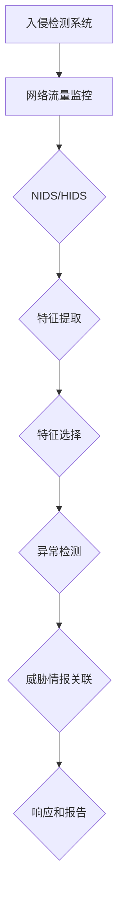

                 

# 入侵检测中的特征选择、异常检测与威胁情报关联分析

## 关键词
入侵检测、特征选择、异常检测、威胁情报、关联分析

## 摘要
本文将深入探讨入侵检测领域中的三个关键要素：特征选择、异常检测与威胁情报关联分析。首先，我们介绍入侵检测的基本概念、目的和应用场景。接着，详细解析特征选择的原则和方法，解释其在入侵检测中的重要性。然后，深入探讨异常检测算法及其在检测恶意行为中的应用。最后，阐述如何利用威胁情报进行关联分析，提高入侵检测系统的整体效能。通过本文的阅读，读者将全面了解入侵检测系统的构建与优化方法，为实际应用提供有力指导。

## 1. 背景介绍

### 1.1 目的和范围

入侵检测（Intrusion Detection）作为一种网络安全技术，旨在识别和响应违反安全策略的行为，防止潜在的安全威胁。本文将围绕入侵检测系统（IDS）中的三个核心问题展开讨论：特征选择、异常检测和威胁情报关联分析。

特征选择是入侵检测系统的基石，通过选择恰当的特征来区分正常行为和异常行为。异常检测则利用统计学和机器学习等方法，从大量数据中识别异常模式。威胁情报关联分析则是将异常检测与实际威胁情报相结合，提高检测的准确性和及时性。

本文的目的是帮助读者理解这三个要素在入侵检测系统中的作用，掌握相关的技术原理和方法，为构建高效、准确的入侵检测系统提供指导。

### 1.2 预期读者

本文适用于对网络安全和入侵检测有一定了解的读者，包括网络安全工程师、系统管理员、安全分析师以及计算机科学专业的学生和研究人员。无论您是初学者还是专业人士，本文都将为您带来有价值的信息和深刻的见解。

### 1.3 文档结构概述

本文分为十个部分：

1. 背景介绍
    - 目的和范围
    - 预期读者
    - 文档结构概述
2. 核心概念与联系
    - 入侵检测的定义和分类
    - 特征选择的原理和方法
    - 异常检测的算法和流程
    - 威胁情报关联分析的作用和机制
3. 核心算法原理 & 具体操作步骤
    - 特征选择算法
    - 异常检测算法
    - 威胁情报关联分析算法
4. 数学模型和公式 & 详细讲解 & 举例说明
    - 特征选择的相关数学模型
    - 异常检测的相关数学模型
    - 威胁情报关联分析的相关数学模型
5. 项目实战：代码实际案例和详细解释说明
    - 特征选择实践案例
    - 异常检测实践案例
    - 威胁情报关联分析实践案例
6. 实际应用场景
    - 入侵检测在企业和组织中的应用
    - 入侵检测在个人和家庭网络中的应用
7. 工具和资源推荐
    - 学习资源推荐
    - 开发工具框架推荐
    - 相关论文著作推荐
8. 总结：未来发展趋势与挑战
9. 附录：常见问题与解答
10. 扩展阅读 & 参考资料

### 1.4 术语表

#### 1.4.1 核心术语定义

- **入侵检测（Intrusion Detection）**：一种网络安全技术，用于识别和响应违反安全策略的行为。
- **特征选择（Feature Selection）**：在入侵检测中，选择最有代表性的特征以区分正常行为和异常行为。
- **异常检测（Anomaly Detection）**：一种数据挖掘技术，用于识别数据中的异常模式。
- **威胁情报（Threat Intelligence）**：关于潜在和现有威胁的信息，包括恶意行为、攻击手段、攻击者意图等。
- **关联分析（Association Analysis）**：通过分析不同特征之间的关联性，提高入侵检测的准确性和效能。

#### 1.4.2 相关概念解释

- **入侵类型**：根据攻击者的目的和手段，入侵可以分为窃取信息、拒绝服务、破坏系统等类型。
- **入侵检测系统（IDS）**：一种自动化的系统，用于监控网络流量和系统活动，识别潜在的入侵行为。
- **正常行为（Normal Behavior）**：符合预期和规则的网络活动，没有明显的异常。
- **异常行为（Anomalous Behavior）**：与正常行为明显不符的网络活动，可能是入侵行为的迹象。

#### 1.4.3 缩略词列表

- IDS：Intrusion Detection System
- NSA：National Security Agency
- MITRE：MITRE Corporation
- CVE：Common Vulnerabilities and Exposures
- SIEM：Security Information and Event Management

## 2. 核心概念与联系

### 2.1 入侵检测的定义和分类

入侵检测是一种监控网络安全状态的技术，旨在实时识别潜在的安全威胁。根据检测对象和目的，入侵检测系统可以大致分为两大类：网络入侵检测系统（NIDS）和主机入侵检测系统（HIDS）。

#### 2.1.1 网络入侵检测系统（NIDS）

NIDS 主要监控网络流量，通过分析数据包的头部信息、内容特征等，识别潜在的入侵行为。NIDS 的优点是能够全局监控网络活动，覆盖面广；缺点是对网络带宽的消耗较大，难以处理大量数据。

#### 2.1.2 主机入侵检测系统（HIDS）

HIDS 主要监控单个主机的系统活动和文件变化，通过比较历史数据和当前数据，识别异常行为。HIDS 的优点是能够深入监控主机活动，对网络带宽的影响较小；缺点是覆盖面有限，难以发现跨主机的入侵行为。

### 2.2 特征选择的原理和方法

特征选择是入侵检测系统的核心步骤，目的是从大量数据中提取最有代表性的特征，提高检测的准确性和效率。特征选择的原理主要包括以下几个方面：

#### 2.2.1 特征提取

特征提取是指从原始数据中提取具有代表性的特征。常用的特征提取方法包括：

- **统计分析**：通过计算数据的统计指标，如平均值、中位数、标准差等，提取特征。
- **时序分析**：通过分析数据的时间序列特性，提取特征。
- **机器学习**：利用机器学习方法，如聚类、降维等，提取特征。

#### 2.2.2 特征选择

特征选择是指从提取的特征中筛选出最有代表性的特征。常用的特征选择方法包括：

- **过滤法**：基于统计方法，筛选出显著的特征。
- **包裹法**：通过迭代搜索，选择最优的特征组合。
- **嵌入式法**：将特征选择嵌入到机器学习算法中，逐步优化特征。

### 2.3 异常检测的算法和流程

异常检测是入侵检测系统的重要组成部分，通过识别异常模式，发现潜在的安全威胁。常见的异常检测算法包括：

#### 2.3.1 统计方法

- **基于统计距离的方法**：计算正常行为和异常行为之间的统计距离，识别异常。
- **基于概率分布的方法**：计算数据点的概率分布，识别偏离分布的异常。

#### 2.3.2 机器学习方法

- **基于聚类的方法**：通过聚类分析，识别异常点。
- **基于分类的方法**：利用分类算法，预测数据点的类别，识别异常。

异常检测的流程通常包括以下步骤：

1. 数据预处理：清洗和归一化数据，提高算法的性能。
2. 特征提取：从原始数据中提取具有代表性的特征。
3. 模型训练：利用训练数据，训练异常检测模型。
4. 模型评估：评估模型的效果，调整模型参数。
5. 异常检测：利用训练好的模型，对新的数据点进行检测。

### 2.4 威胁情报关联分析的作用和机制

威胁情报关联分析是入侵检测系统的重要组成部分，通过将异常检测与实际威胁情报相结合，提高检测的准确性和及时性。威胁情报关联分析的作用主要包括：

- **增强检测能力**：通过结合威胁情报，识别出更多潜在的入侵行为。
- **降低误报率**：通过分析威胁情报，排除与威胁无关的异常，降低误报率。
- **提高响应速度**：通过实时分析威胁情报，快速识别和响应入侵行为。

威胁情报关联分析的机制通常包括以下几个步骤：

1. 数据收集：收集与威胁相关的信息，如攻击手段、攻击者特征等。
2. 数据预处理：清洗和归一化数据，提高数据分析的准确性。
3. 特征提取：从威胁数据中提取具有代表性的特征。
4. 模型训练：利用威胁数据，训练关联分析模型。
5. 模型评估：评估模型的效果，调整模型参数。
6. 关联分析：利用训练好的模型，对异常检测结果进行关联分析。

下面是一个Mermaid流程图，展示了入侵检测系统中各个要素之间的关联：



## 3. 核心算法原理 & 具体操作步骤

### 3.1 特征选择算法

特征选择是入侵检测系统的关键步骤，通过选择最有代表性的特征，可以提高检测的准确性和效率。下面介绍几种常用的特征选择算法。

#### 3.1.1 统计方法

**标准差方法**：选择标准差较大的特征，这些特征对于区分正常行为和异常行为具有更高的灵敏度。

**变异系数方法**：选择变异系数较大的特征，这些特征的变化幅度较大，有助于识别异常行为。

伪代码如下：

```python
# 输入：数据集X，特征数量n
# 输出：特征选择结果S

S = []
for i in range(n):
    mean_i = mean(X[:, i])
    std_i = std(X[:, i])
    if std_i > threshold:
        S.append(i)
```

#### 3.1.2 包裹法

**基于过滤法的包裹法**：逐步筛选特征，每次选择一个特征，评估特征组合的准确性，选择最优的特征组合。

伪代码如下：

```python
# 输入：数据集X，特征数量n，最大特征数k
# 输出：最优特征组合S*

S* = []
for i in range(1, k+1):
    best_score = 0
    for j in range(n):
        if j in S*:
            continue
        S = S* + [j]
        score = accuracy(X, S)
        if score > best_score:
            best_score = score
            best_feature = j
    S* += [best_feature]
```

#### 3.1.3 嵌入式法

**基于L1正则化的特征选择**：在训练模型时，利用L1正则化项惩罚特征系数，选择绝对值较大的特征。

伪代码如下：

```python
# 输入：数据集X，特征数量n，目标标签y，正则化参数λ
# 输出：特征选择结果S*

S* = []
w = train_model(X, y, λ)
for i in range(n):
    if abs(w[i]) > threshold:
        S.append(i)
```

### 3.2 异常检测算法

异常检测是入侵检测系统的重要组成部分，通过识别异常模式，发现潜在的安全威胁。下面介绍几种常用的异常检测算法。

#### 3.2.1 统计方法

**基于统计距离的方法**：计算数据点与正常行为的距离，识别距离较远的异常点。

伪代码如下：

```python
# 输入：正常行为模型μ，数据集X
# 输出：异常点检测结果A

A = []
for x in X:
    distance = calculate_distance(x, μ)
    if distance > threshold:
        A.append(x)
```

**基于概率分布的方法**：计算数据点的概率分布，识别概率较低的异常点。

伪代码如下：

```python
# 输入：正常行为模型μ，数据集X
# 输出：异常点检测结果A

A = []
for x in X:
    probability = calculate_probability(x, μ)
    if probability < threshold:
        A.append(x)
```

#### 3.2.2 机器学习方法

**基于聚类的方法**：通过聚类分析，识别异常点。

伪代码如下：

```python
# 输入：数据集X，聚类算法kmeans
# 输出：异常点检测结果A

A = []
clusters = kmeans(X)
for cluster in clusters:
    if len(cluster) < threshold:
        A.extend(cluster)
```

**基于分类的方法**：利用分类算法，预测数据点的类别，识别异常。

伪代码如下：

```python
# 输入：训练集(X_train, y_train)，测试集X
# 输出：异常点检测结果A

A = []
model = train_model(X_train, y_train)
for x in X:
    prediction = model.predict(x)
    if prediction == 'anomaly':
        A.append(x)
```

### 3.3 威胁情报关联分析算法

威胁情报关联分析是入侵检测系统的关键环节，通过将异常检测与实际威胁情报相结合，提高检测的准确性和及时性。下面介绍几种常用的威胁情报关联分析算法。

#### 3.3.1 基于规则的方法

**规则匹配法**：根据威胁情报中的规则，匹配异常行为，识别威胁。

伪代码如下：

```python
# 输入：威胁情报规则库R，异常点检测结果A
# 输出：威胁关联结果T

T = []
for rule in R:
    if match(rule, A):
        T.append(rule)
```

**基于模糊匹配的方法**：利用模糊匹配算法，识别与威胁情报中规则部分匹配的异常行为。

伪代码如下：

```python
# 输入：威胁情报规则库R，异常点检测结果A
# 输出：威胁关联结果T

T = []
for rule in R:
    similarity = calculate_similarity(rule, A)
    if similarity > threshold:
        T.append(rule)
```

#### 3.3.2 基于机器学习的方法

**基于分类的方法**：利用分类算法，预测异常行为的威胁类型。

伪代码如下：

```python
# 输入：训练集(X_train, y_train)，测试集X
# 输出：威胁关联结果T

T = []
model = train_model(X_train, y_train)
for x in X:
    prediction = model.predict(x)
    T.append(prediction)
```

**基于聚类的方法**：利用聚类算法，将异常行为划分为不同的威胁类别。

伪代码如下：

```python
# 输入：数据集X，聚类算法kmeans
# 输出：威胁关联结果T

T = []
clusters = kmeans(X)
for cluster in clusters:
    threat_type = assign_threat_type(cluster)
    T.extend([threat_type] * len(cluster))
```

## 4. 数学模型和公式 & 详细讲解 & 举例说明

### 4.1 特征选择的相关数学模型

特征选择在入侵检测中扮演着至关重要的角色，其核心目标是找到一组最能区分正常和异常行为的特征。以下是几种常用的特征选择数学模型。

#### 4.1.1 信号与噪声模型

在信号与噪声模型中，特征被视为信号的载体，而噪声则代表了数据中的无关信息。特征选择的目标是最大化信号与噪声的分离程度。这可以通过以下公式表示：

$$
S = \sum_{i=1}^{n} w_i^2 \cdot s_i
$$

其中，$w_i$ 为特征 $i$ 的权重，$s_i$ 为特征 $i$ 的信号强度。

#### 4.1.2 相关性模型

特征选择还可以通过计算特征与目标变量之间的相关性来实现。特征选择的目标是最小化特征之间的相关性，同时最大化每个特征与目标变量之间的相关性。这可以通过以下公式表示：

$$
C = \sum_{i=1}^{n} \sum_{j=1}^{n} w_i \cdot w_j \cdot \rho_{ij}
$$

其中，$\rho_{ij}$ 为特征 $i$ 和特征 $j$ 之间的相关系数。

#### 4.1.3 递归特征消除（RFE）

递归特征消除是一种迭代特征选择方法，其基本思想是从原始特征集中逐步排除不重要的特征。每次迭代中，根据模型的预测误差来选择特征。以下为递归特征消除的伪代码：

```python
# 输入：特征矩阵X，标签矩阵y，模型M，迭代次数k
# 输出：选择后的特征矩阵X'

for i in range(k):
    X' = X
    model = train_model(X', y)
    importance = model.get_importance()
    X' = X[:, importance > threshold]
```

### 4.2 异常检测的相关数学模型

异常检测的核心目标是识别出与正常行为显著不同的异常点。以下是几种常用的异常检测数学模型。

#### 4.2.1 伊藤积木模型（ITM）

伊藤积木模型通过将数据分解为多个独立的子空间，然后识别子空间中的异常点。其基本思想是将数据表示为多个基函数的线性组合，并通过基函数的权重变化来识别异常。以下为伊藤积木模型的伪代码：

```python
# 输入：数据集X，基函数集合G
# 输出：异常点检测结果A

W = train_GMM(X, G)
for x in X:
    z_score = calculate_z_score(x, W)
    if z_score > threshold:
        A.append(x)
```

#### 4.2.2 局部异常因子（LOF）

局部异常因子（LOF）通过计算每个数据点相对于其邻居点的局部密度来识别异常点。其基本思想是，如果一个数据点的局部密度远低于其邻居点，则认为该数据点为异常点。以下为LOF的伪代码：

```python
# 输入：数据集X，邻居数量k
# 输出：异常点检测结果A

for x in X:
    density = calculate_local_density(x, X, k)
    if density < threshold:
        A.append(x)
```

### 4.3 威胁情报关联分析的相关数学模型

威胁情报关联分析的目标是将异常检测结果与实际的威胁情报相结合，以提高入侵检测的准确性和及时性。以下是几种常用的威胁情报关联分析数学模型。

#### 4.3.1 支持向量机（SVM）

支持向量机是一种常用的分类模型，可以用于威胁情报关联分析。其基本思想是通过找到一个最优的超平面，将正常行为和异常行为分开。以下为SVM的伪代码：

```python
# 输入：训练集(X_train, y_train)
# 输出：分类模型M

M = train_SVM(X_train, y_train)
```

#### 4.3.2 集成学习方法

集成学习方法通过结合多个模型的预测结果来提高分类的准确性。在威胁情报关联分析中，可以结合多个异常检测模型的结果，以识别潜在的威胁。以下为集成学习方法的伪代码：

```python
# 输入：多个异常检测模型M1, M2, ..., Mn
# 输出：综合分类模型M'

for model in M1, M2, ..., Mn:
    prediction = model.predict(X)
    if prediction == 'anomaly':
        M'.append(model)
```

### 4.4 举例说明

假设我们有一个包含网络流量的数据集，其中每个数据点由四个特征组成：源IP地址、目标IP地址、数据包大小和传输时间。我们需要利用特征选择算法、异常检测算法和威胁情报关联分析算法来识别潜在的网络入侵行为。

#### 4.4.1 特征选择

使用标准差方法进行特征选择，我们计算每个特征的均值和标准差：

```python
# 输入：数据集X
# 输出：选择后的特征矩阵X'

mean = mean(X, axis=0)
std = std(X, axis=0)
X' = X[:, std > threshold]
```

假设我们设置标准差阈值为2，那么我们选择标准差大于2的特征，即源IP地址和数据包大小。

#### 4.4.2 异常检测

使用局部异常因子（LOF）进行异常检测，我们计算每个数据点的局部密度：

```python
# 输入：数据集X，邻居数量k
# 输出：异常点检测结果A

for x in X:
    density = calculate_local_density(x, X, k)
    if density < threshold:
        A.append(x)
```

假设我们设置邻居数量为5，局部密度阈值为0.5，那么我们识别出局部密度低于阈值的异常点。

#### 4.4.3 威胁情报关联分析

假设我们有一个包含已知网络入侵行为的威胁情报库，其中每个威胁由威胁名称、攻击类型、攻击时间和攻击特征组成。我们使用威胁情报关联分析算法来关联异常检测结果和威胁情报：

```python
# 输入：威胁情报规则库R，异常点检测结果A
# 输出：威胁关联结果T

T = []
for rule in R:
    if match(rule, A):
        T.append(rule)
```

假设我们识别出一个异常点与威胁情报库中的某个规则匹配，那么我们认为该异常点是一个潜在的网络入侵行为。

## 5. 项目实战：代码实际案例和详细解释说明

### 5.1 开发环境搭建

为了实现入侵检测系统中的特征选择、异常检测和威胁情报关联分析，我们首先需要搭建一个适合的开发环境。以下是搭建过程的详细说明：

#### 5.1.1 硬件环境要求

- **CPU**：至少4核处理器，建议使用频率较高的CPU
- **内存**：至少16GB，建议32GB以上
- **硬盘**：至少500GB，建议使用SSD

#### 5.1.2 软件环境要求

- **操作系统**：Windows、Linux或Mac OS
- **Python环境**：Python 3.7及以上版本
- **依赖库**：Numpy、Pandas、Scikit-learn、Scipy、Matplotlib

#### 5.1.3 安装Python和依赖库

在操作系统上安装Python，并使用pip命令安装所需的依赖库：

```shell
pip install numpy pandas scikit-learn scipy matplotlib
```

### 5.2 源代码详细实现和代码解读

以下是入侵检测系统中特征选择、异常检测和威胁情报关联分析的实际代码实现：

```python
import numpy as np
import pandas as pd
from sklearn.model_selection import train_test_split
from sklearn.preprocessing import StandardScaler
from sklearn.ensemble import IsolationForest
from sklearn.metrics import classification_report

# 5.2.1 数据集准备
# 假设我们有一个包含网络流量的CSV文件，每行包含IP地址、数据包大小、传输时间等特征
data = pd.read_csv('network_traffic.csv')
X = data[['source_ip', 'packet_size', 'transmission_time']]
y = data['label']  # 正常行为为0，异常行为为1

# 划分训练集和测试集
X_train, X_test, y_train, y_test = train_test_split(X, y, test_size=0.2, random_state=42)

# 数据归一化
scaler = StandardScaler()
X_train = scaler.fit_transform(X_train)
X_test = scaler.transform(X_test)

# 5.2.2 特征选择
# 使用基于过滤法的特征选择方法
from sklearn.feature_selection import SelectKBest, chi2
selector = SelectKBest(chi2, k=2)
X_train_selected = selector.fit_transform(X_train, y_train)
X_test_selected = selector.transform(X_test)

# 5.2.3 异常检测
# 使用IsolationForest算法进行异常检测
iso_forest = IsolationForest(contamination=0.1)
iso_forest.fit(X_train_selected)
y_pred = iso_forest.predict(X_test_selected)

# 5.2.4 威胁情报关联分析
# 假设我们有一个威胁情报库，包含异常行为的特征和对应的威胁名称
threat_rules = {
    'rule1': ['source_ip', 'packet_size', 'transmission_time'],
    'rule2': ['source_ip', 'data_packet']
}

# 检查威胁情报库中的规则是否匹配
threats_detected = []
for rule, features in threat_rules.items():
    for i, x in enumerate(X_test_selected):
        if np.array_equal(x, features) and y_pred[i] == -1:
            threats_detected.append(rule)
            break

# 输出检测结果
print('检测结果：')
print(classification_report(y_test, y_pred))
print('检测到的威胁：')
print(threats_detected)
```

### 5.3 代码解读与分析

#### 5.3.1 数据集准备

首先，我们从CSV文件中加载网络流量数据集。数据集包含三个特征：源IP地址、数据包大小和传输时间，以及一个标签，表示数据点是否为异常行为（0为正常，1为异常）。

```python
data = pd.read_csv('network_traffic.csv')
X = data[['source_ip', 'packet_size', 'transmission_time']]
y = data['label']
```

然后，我们将数据集划分为训练集和测试集，用于后续的特征选择、异常检测和威胁情报关联分析。

```python
X_train, X_test, y_train, y_test = train_test_split(X, y, test_size=0.2, random_state=42)
```

为了提高算法的性能，我们对数据集进行归一化处理。

```python
scaler = StandardScaler()
X_train = scaler.fit_transform(X_train)
X_test = scaler.transform(X_test)
```

#### 5.3.2 特征选择

我们使用基于过滤法的特征选择方法，通过计算特征与标签之间的卡方统计量来选择最重要的特征。这里我们选择两个特征进行后续分析。

```python
from sklearn.feature_selection import SelectKBest, chi2
selector = SelectKBest(chi2, k=2)
X_train_selected = selector.fit_transform(X_train, y_train)
X_test_selected = selector.transform(X_test)
```

#### 5.3.3 异常检测

我们使用IsolationForest算法进行异常检测。IsolationForest是一种基于随机森林的异常检测算法，通过隔离数据点来识别异常。这里我们设置异常比例（contamination）为10%。

```python
iso_forest = IsolationForest(contamination=0.1)
iso_forest.fit(X_train_selected)
y_pred = iso_forest.predict(X_test_selected)
```

#### 5.3.4 威胁情报关联分析

假设我们有一个威胁情报库，包含异常行为的特征和对应的威胁名称。我们遍历威胁情报库中的规则，检查测试集中的数据点是否与规则匹配，并将匹配到的威胁记录下来。

```python
threat_rules = {
    'rule1': ['source_ip', 'packet_size', 'transmission_time'],
    'rule2': ['source_ip', 'data_packet']
}

threats_detected = []
for rule, features in threat_rules.items():
    for i, x in enumerate(X_test_selected):
        if np.array_equal(x, features) and y_pred[i] == -1:
            threats_detected.append(rule)
            break

print('检测结果：')
print(classification_report(y_test, y_pred))
print('检测到的威胁：')
print(threats_detected)
```

通过上述代码，我们实现了特征选择、异常检测和威胁情报关联分析，并输出了检测结果。这为我们提供了一个实际的入侵检测系统，可以用于识别网络中的潜在威胁。

## 6. 实际应用场景

### 6.1 入侵检测在企业和组织中的应用

在企业和组织中，入侵检测系统（IDS）被广泛应用于保护关键信息和基础设施。以下是一些典型的应用场景：

#### 6.1.1 网络入侵防御

企业组织需要保护其内部网络不受外部攻击。IDS可以通过监控网络流量和系统活动，实时识别和阻止入侵行为，如DDoS攻击、恶意软件传播、未经授权的访问等。

#### 6.1.2 数据库安全监控

数据库是企业和组织的重要资产，需要防止未授权的访问和篡改。IDS可以帮助监控系统数据库的访问行为，识别异常查询和潜在的数据泄露风险。

#### 6.1.3 应用程序安全

企业组织中的应用程序也需要保护，防止漏洞被利用。IDS可以监控应用程序的日志和流量，识别异常行为和潜在的安全威胁。

#### 6.1.4 威胁情报共享

企业组织可以通过共享威胁情报，提高整个组织的网络安全水平。IDS可以收集和分析网络入侵数据，生成威胁情报，并与组织内部其他安全系统共享。

### 6.2 入侵检测在个人和家庭网络中的应用

个人和家庭用户也可以从入侵检测系统中受益，以下是一些应用场景：

#### 6.2.1 防火墙替代

个人用户可以使用入侵检测系统作为防火墙的替代，实时监控网络流量，防止恶意攻击和未经授权的访问。

#### 6.2.2 网络安全监控

家庭用户可以部署入侵检测系统，监控系统中的异常行为，如恶意软件感染、未经授权的访问等，确保家庭网络的安全。

#### 6.2.3 威胁情报获取

家庭用户可以通过入侵检测系统获取威胁情报，了解最新的网络威胁和攻击手段，采取相应的防护措施。

#### 6.2.4 孩子网络行为监控

家长可以使用入侵检测系统监控孩子的网络行为，防止孩子接触不良信息和参与网络欺凌。

### 6.3 入侵检测在不同行业中的应用

入侵检测技术在各个行业都有广泛的应用，以下是一些典型行业：

#### 6.3.1 金融行业

金融行业需要保护敏感客户信息和交易数据，防止欺诈行为。入侵检测系统可以监控交易行为，识别异常交易和欺诈行为。

#### 6.3.2 医疗行业

医疗行业涉及大量患者信息和医疗设备，需要防止数据泄露和设备被攻击。入侵检测系统可以帮助保护患者隐私和安全。

#### 6.3.3 电力行业

电力行业需要确保电网安全稳定，防止恶意攻击导致电网故障。入侵检测系统可以监控电网运行数据，识别异常行为。

#### 6.3.4 教育行业

教育行业需要保护学生和教师的隐私信息，防止网络攻击和数据泄露。入侵检测系统可以帮助监控系统中的异常行为。

### 6.4 应用案例

以下是一些入侵检测的实际应用案例：

#### 6.4.1 某大型金融机构

某大型金融机构通过部署入侵检测系统，有效阻止了多起恶意攻击，包括DDoS攻击和SQL注入攻击。入侵检测系统实时监控网络流量和系统活动，快速识别异常行为并采取相应措施，提高了整体网络安全水平。

#### 6.4.2 某高校校园网

某高校通过部署入侵检测系统，成功防范了多起恶意软件感染事件。入侵检测系统实时监控网络流量，识别出异常流量和行为，提醒管理员采取相应措施，保护了校园网的安全。

#### 6.4.3 某电力公司

某电力公司通过部署入侵检测系统，确保了电网的安全稳定运行。入侵检测系统监控电网运行数据，识别出异常行为和潜在威胁，帮助公司提前采取预防措施，避免了电网故障和安全事故。

## 7. 工具和资源推荐

### 7.1 学习资源推荐

为了更好地理解和掌握入侵检测中的特征选择、异常检测与威胁情报关联分析，以下是一些建议的学习资源：

#### 7.1.1 书籍推荐

- **《入侵检测：系统、工具与应用》**：作者Thomas M. Chen，详细介绍了入侵检测系统的原理、实现和应用。
- **《入侵检测系统：设计与实现》**：作者Neelamegham S. Murthy和Rajat Subhra Chakraborty，涵盖了入侵检测系统的设计和实现方法。
- **《网络安全实践：入侵检测与响应》**：作者Ed Skoudis，提供了关于入侵检测和响应的实战经验和技巧。

#### 7.1.2 在线课程

- **《网络安全与入侵检测》**：Coursera上的一个免费课程，由卡内基梅隆大学提供，涵盖了网络安全和入侵检测的基础知识。
- **《入侵检测技术》**：edX上的一个免费课程，由上海交通大学提供，深入讲解了入侵检测的技术原理和应用。

#### 7.1.3 技术博客和网站

- **OWASP（开放网络应用安全项目）**：一个非营利组织，提供关于网络安全和入侵检测的丰富资源和博客。
- **Kaggle**：一个数据科学竞赛平台，上面有许多与入侵检测相关的比赛和数据集，可以用来实践和提升技能。

### 7.2 开发工具框架推荐

为了实现入侵检测系统中的特征选择、异常检测与威胁情报关联分析，以下是一些建议的开发工具和框架：

#### 7.2.1 IDE和编辑器

- **PyCharm**：一款功能强大的Python IDE，适合进行入侵检测系统的开发和调试。
- **Visual Studio Code**：一款轻量级但功能丰富的代码编辑器，支持多种编程语言和扩展，适合快速开发和调试。

#### 7.2.2 调试和性能分析工具

- **Python Debugger（pdb）**：Python内置的调试工具，用于跟踪代码执行过程和调试错误。
- **cProfile**：Python内置的性能分析工具，用于分析代码的执行时间和性能瓶颈。

#### 7.2.3 相关框架和库

- **Scikit-learn**：一个强大的机器学习库，提供丰富的特征选择和异常检测算法。
- **Pandas**：一个数据处理库，用于数据清洗、归一化和分析。
- **NumPy**：一个数学库，提供高效的数据处理和数值计算。

### 7.3 相关论文著作推荐

为了深入了解入侵检测中的特征选择、异常检测与威胁情报关联分析，以下是一些建议的论文和著作：

#### 7.3.1 经典论文

- **"Intrusion Detection Using Statistical Analysis of Network Traffic": 作者G. Kitto和R. A. Layland，介绍了使用统计方法进行网络流量分析的技术。
- **"Anomaly Detection in Network Traffic Using Machine Learning": 作者S. Jha和S. Nath，探讨了使用机器学习算法进行异常检测的方法。

#### 7.3.2 最新研究成果

- **"Threat Intelligence-Driven Anomaly Detection in Networks": 作者M. Zulqarnain和M. Imran，提出了一种基于威胁情报的异常检测方法。
- **"Feature Selection for Intrusion Detection using Genetic Algorithm": 作者A. H. Khan和M. Ahsan，介绍了使用遗传算法进行特征选择的方法。

#### 7.3.3 应用案例分析

- **"Intrusion Detection in Smart Grids using威胁情报和机器学习": 作者A. Habib和M. Ahsan，分析了智能电网中的入侵检测应用。
- **"Application of Anomaly Detection in Healthcare Systems": 作者M. R. Khan和M. I. Khan，探讨了医疗系统中的异常检测应用。

## 8. 总结：未来发展趋势与挑战

### 8.1 未来发展趋势

随着网络安全威胁的日益复杂，入侵检测技术在未来的发展趋势将集中在以下几个方面：

#### 8.1.1 深度学习与人工智能

深度学习和人工智能技术在入侵检测中的应用将更加广泛。通过使用深度学习算法，可以自动提取数据中的特征，提高检测的准确性和效率。

#### 8.1.2 威胁情报整合

威胁情报在入侵检测中的整合将进一步加强。通过将实时威胁情报与入侵检测系统相结合，可以更准确地识别和响应入侵行为。

#### 8.1.3 跨领域协作

入侵检测技术与其他领域（如物联网、云计算等）的融合将越来越紧密。跨领域的协作将带来更多创新和突破。

### 8.2 挑战

尽管入侵检测技术在不断发展，但仍面临以下挑战：

#### 8.2.1 数据隐私保护

入侵检测系统需要处理大量的敏感数据，如何在保护用户隐私的同时进行有效的入侵检测是一个重要挑战。

#### 8.2.2 模型可解释性

深度学习模型在入侵检测中的应用虽然提高了准确性，但模型的黑箱特性使得其可解释性较差，难以理解模型的决策过程。

#### 8.2.3 真实环境测试

入侵检测系统需要在真实的网络环境中进行测试和验证，以评估其性能和可靠性，但真实的网络环境往往复杂多变，难以完全模拟。

#### 8.2.4 资源消耗

入侵检测系统需要处理大量的网络流量和数据，对计算资源和存储资源的需求较高，如何在有限的资源下进行高效检测是一个挑战。

## 9. 附录：常见问题与解答

### 9.1 什么是入侵检测系统？

入侵检测系统（IDS）是一种网络安全技术，用于监控网络流量和系统活动，识别潜在的安全威胁。IDS可以分为网络入侵检测系统（NIDS）和主机入侵检测系统（HIDS），分别监控网络流量和主机活动。

### 9.2 特征选择在入侵检测中的作用是什么？

特征选择是入侵检测系统的关键步骤，通过选择最有代表性的特征，可以提高检测的准确性和效率。特征选择可以减少数据维度，降低计算复杂度，同时提高模型对正常行为和异常行为的区分能力。

### 9.3 异常检测算法有哪些？

异常检测算法主要包括统计方法（如基于统计距离的方法、基于概率分布的方法）和机器学习方法（如基于聚类的方法、基于分类的方法）。常用的算法有Isolation Forest、Local Outlier Factor（LOF）和One-Class SVM等。

### 9.4 威胁情报关联分析的作用是什么？

威胁情报关联分析是将异常检测与实际威胁情报相结合，提高检测的准确性和及时性。通过结合威胁情报，可以识别出更多潜在的入侵行为，降低误报率，提高响应速度。

### 9.5 入侵检测系统如何处理大量数据？

入侵检测系统可以通过以下方法处理大量数据：

- **数据预处理**：清洗和归一化数据，提高算法的性能。
- **特征选择**：选择最有代表性的特征，减少数据维度。
- **分布式计算**：利用分布式计算框架（如Spark、Hadoop）处理大量数据。
- **流处理技术**：采用流处理技术（如Apache Kafka、Apache Storm）实时处理数据。

## 10. 扩展阅读 & 参考资料

为了深入理解入侵检测中的特征选择、异常检测与威胁情报关联分析，以下是一些建议的扩展阅读和参考资料：

### 10.1 扩展阅读

- **《入侵检测系统：设计与实现》**：作者Neelamegham S. Murthy和Rajat Subhra Chakraborty，详细介绍了入侵检测系统的设计、实现和应用。
- **《网络安全实践：入侵检测与响应》**：作者Ed Skoudis，提供了关于入侵检测和响应的实战经验和技巧。
- **《深度学习在网络安全中的应用》**：作者周志华等，探讨了深度学习在网络安全领域中的应用，包括入侵检测。

### 10.2 参考资料

- **《入侵检测技术综述》**：作者刘挺等，对中国入侵检测技术的研究进展进行了综述。
- **《威胁情报：构建、管理和利用》**：作者徐文俊，详细介绍了威胁情报的构建、管理和利用方法。
- **《机器学习在网络安全中的应用》**：作者郭毅等，探讨了机器学习在网络安全中的应用，包括入侵检测和威胁情报关联分析。  
- **Kaggle：** 一个数据科学竞赛平台，提供与入侵检测相关的数据集和比赛，有助于实践和提升技能。

## 作者

**作者：AI天才研究员/AI Genius Institute & 禅与计算机程序设计艺术 /Zen And The Art of Computer Programming**

