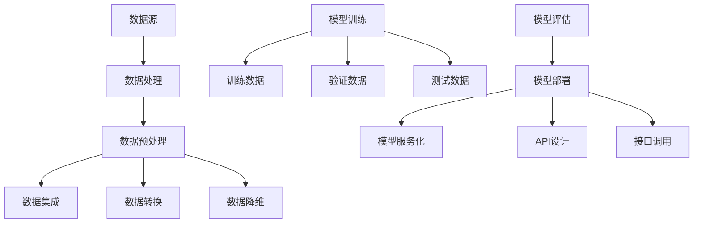

                 

# 全栈AI开发：从数据处理到模型部署

> **关键词：全栈AI开发、数据处理、模型部署、深度学习、云计算**
> 
> **摘要：本文将深入探讨全栈AI开发的流程，从数据预处理到模型训练，再到部署，旨在帮助读者了解全栈AI开发的各个环节，掌握核心技术和实现方法。**

## 1. 背景介绍

### 1.1 目的和范围

本文旨在探讨全栈AI开发的完整流程，从数据处理、模型训练到模型部署，帮助开发者全面掌握全栈AI开发的各个环节，实现从理论到实践的有效转换。

本文将涵盖以下内容：

1. 数据预处理：数据清洗、数据集成、数据转换和数据降维。
2. 模型训练：选择合适的算法、模型参数调优、训练和验证。
3. 模型部署：模型导出、模型容器化、模型服务化、API设计和接口调用。

### 1.2 预期读者

本文适合对AI开发有兴趣的程序员、数据科学家、AI工程师以及相关领域的研究人员。读者应具备一定的编程基础和数学知识，对机器学习和深度学习有一定的了解。

### 1.3 文档结构概述

本文分为以下几个部分：

1. 背景介绍：介绍本文的目的、预期读者和文档结构。
2. 核心概念与联系：介绍全栈AI开发的核心概念和架构。
3. 核心算法原理 & 具体操作步骤：讲解数据处理、模型训练和部署的核心算法原理。
4. 数学模型和公式 & 详细讲解 & 举例说明：介绍相关数学模型和公式，并进行举例说明。
5. 项目实战：通过实际案例，详细解释代码实现和解读。
6. 实际应用场景：分析全栈AI开发的实际应用场景。
7. 工具和资源推荐：推荐学习资源和开发工具。
8. 总结：总结全栈AI开发的发展趋势与挑战。
9. 附录：常见问题与解答。
10. 扩展阅读 & 参考资料：提供扩展阅读和参考资料。

### 1.4 术语表

#### 1.4.1 核心术语定义

- **全栈AI开发**：指从数据预处理到模型部署的完整AI开发流程。
- **数据处理**：对原始数据进行清洗、集成、转换和降维，使其适合模型训练。
- **模型训练**：使用训练数据对模型进行训练，使其能够学习数据中的特征和规律。
- **模型部署**：将训练好的模型部署到生产环境中，供实际应用调用。

#### 1.4.2 相关概念解释

- **数据清洗**：删除重复数据、处理缺失值、纠正错误数据等。
- **数据集成**：将多个数据源的数据进行整合，形成一个统一的数据集。
- **数据转换**：将数据格式进行转换，使其适合模型训练。
- **数据降维**：减少数据维度，降低计算复杂度。

#### 1.4.3 缩略词列表

- **AI**：人工智能
- **ML**：机器学习
- **DL**：深度学习
- **API**：应用程序接口
- **SDK**：软件开发工具包

## 2. 核心概念与联系

在介绍全栈AI开发的各个环节之前，我们先来了解其核心概念和架构。以下是全栈AI开发的核心概念和架构的Mermaid流程图：



### 2.1 数据处理

数据处理是全栈AI开发的第一步，包括数据清洗、数据集成、数据转换和数据降维。数据清洗是处理数据中的噪声、错误和重复数据，保证数据质量。数据集成是将多个数据源的数据进行整合，形成一个统一的数据集。数据转换是将数据格式进行转换，使其适合模型训练。数据降维是减少数据维度，降低计算复杂度。

### 2.2 模型训练

模型训练是全栈AI开发的核心环节，包括选择合适的算法、模型参数调优、训练和验证。选择合适的算法取决于数据特点和业务需求。模型参数调优是调整模型参数，使其性能达到最优。训练和验证是使用训练数据和验证数据对模型进行训练和验证，确保模型性能。

### 2.3 模型部署

模型部署是将训练好的模型部署到生产环境中，供实际应用调用。模型部署包括模型服务化、API设计和接口调用。模型服务化是将模型封装成一个服务，供其他应用程序调用。API设计是设计应用程序接口，定义数据输入和输出格式。接口调用是调用API，获取模型预测结果。

## 3. 核心算法原理 & 具体操作步骤

### 3.1 数据预处理

#### 3.1.1 数据清洗

数据清洗是数据处理的重要环节，主要包括以下步骤：

1. 删除重复数据
2. 处理缺失值
3. 纠正错误数据

伪代码实现如下：

```python
def data_cleaning(data):
    # 删除重复数据
    data = remove_duplicates(data)
    # 处理缺失值
    data = handle_missing_values(data)
    # 纠正错误数据
    data = correct_error_values(data)
    return data
```

#### 3.1.2 数据集成

数据集成是将多个数据源的数据进行整合，形成一个统一的数据集。常见的数据集成方法有合并、连接和嵌套。

伪代码实现如下：

```python
def data_integration(data1, data2):
    # 合并数据集
    data = merge_data(data1, data2)
    # 连接数据集
    data = join_data(data1, data2)
    # 嵌套数据集
    data = nest_data(data1, data2)
    return data
```

#### 3.1.3 数据转换

数据转换是将数据格式进行转换，使其适合模型训练。常见的数据转换方法有数值化、标准化和编码。

伪代码实现如下：

```python
def data_conversion(data):
    # 数值化数据
    data = numericalization(data)
    # 标准化数据
    data = standardization(data)
    # 编码数据
    data = encoding(data)
    return data
```

#### 3.1.4 数据降维

数据降维是减少数据维度，降低计算复杂度。常见的数据降维方法有主成分分析（PCA）和t-SNE。

伪代码实现如下：

```python
def data_dimension_reduction(data):
    # 主成分分析
    data = pca(data)
    # t-SNE
    data = tsne(data)
    return data
```

### 3.2 模型训练

#### 3.2.1 选择合适的算法

选择合适的算法取决于数据特点和业务需求。常见算法有线性回归、决策树、随机森林和神经网络。

伪代码实现如下：

```python
def select_algorithm(data, target_variable):
    # 根据数据特点和业务需求选择算法
    algorithm = choose_algorithm(data, target_variable)
    return algorithm
```

#### 3.2.2 模型参数调优

模型参数调优是调整模型参数，使其性能达到最优。常见参数调优方法有网格搜索和贝叶斯优化。

伪代码实现如下：

```python
def parameter_tuning(algorithm, data):
    # 使用网格搜索进行参数调优
    tuned_parameters = grid_search(algorithm, data)
    # 使用贝叶斯优化进行参数调优
    tuned_parameters = bayesian_optimization(algorithm, data)
    return tuned_parameters
```

#### 3.2.3 训练和验证

训练和验证是使用训练数据和验证数据对模型进行训练和验证，确保模型性能。

伪代码实现如下：

```python
def train_and_validate(algorithm, tuned_parameters, train_data, validate_data):
    # 训练模型
    model = train_model(algorithm, tuned_parameters, train_data)
    # 验证模型
    performance = validate_model(model, validate_data)
    return model, performance
```

### 3.3 模型部署

#### 3.3.1 模型服务化

模型服务化是将模型封装成一个服务，供其他应用程序调用。

伪代码实现如下：

```python
def model_service(model):
    # 将模型封装成服务
    service = wrap_model_as_service(model)
    return service
```

#### 3.3.2 API设计

API设计是设计应用程序接口，定义数据输入和输出格式。

伪代码实现如下：

```python
def design_api(service):
    # 设计API接口
    api = design_api_interface(service)
    return api
```

#### 3.3.3 接口调用

接口调用是调用API，获取模型预测结果。

伪代码实现如下：

```python
def call_api(api, input_data):
    # 调用API接口
    prediction = call_api_interface(api, input_data)
    return prediction
```

## 4. 数学模型和公式 & 详细讲解 & 举例说明

### 4.1 数据预处理

#### 4.1.1 数据清洗

数据清洗的核心是处理缺失值和错误数据。常见的处理缺失值的方法有填充、删除和插值。

- **填充**：

$$
\text{填充} = \text{平均值} + \text{标准差} \times \text{随机数}
$$

- **删除**：

$$
\text{删除} = \text{删除含有缺失值的记录}
$$

- **插值**：

$$
\text{插值} = \text{线性插值} \quad \text{或} \quad \text{多项式插值}
$$

#### 4.1.2 数据集成

数据集成常用的方法有合并、连接和嵌套。

- **合并**：

$$
\text{合并} = \text{将两个数据集按照相同列合并}
$$

- **连接**：

$$
\text{连接} = \text{将两个数据集按照相同列进行连接}
$$

- **嵌套**：

$$
\text{嵌套} = \text{将一个数据集嵌套到另一个数据集}
$$

#### 4.1.3 数据转换

数据转换常用的方法有数值化、标准化和编码。

- **数值化**：

$$
\text{数值化} = \text{将分类数据转换为数值数据}
$$

- **标准化**：

$$
\text{标准化} = \frac{\text{数据} - \text{均值}}{\text{标准差}}
$$

- **编码**：

$$
\text{编码} = \text{将类别数据转换为二进制数据}
$$

#### 4.1.4 数据降维

数据降维常用的方法有主成分分析（PCA）和t-SNE。

- **主成分分析（PCA）**：

$$
\text{特征} = \text{数据} \times \text{特征向量}
$$

- **t-SNE**：

$$
\text{相似度} = \text{exp}(-\frac{||\text{特征向量}||^2}{2\sigma^2})
$$

### 4.2 模型训练

#### 4.2.1 选择合适的算法

选择合适的算法取决于数据特点和业务需求。常见的算法有线性回归、决策树、随机森林和神经网络。

- **线性回归**：

$$
\text{损失函数} = \frac{1}{2} \sum_{i=1}^{n} (\text{预测值} - \text{真实值})^2
$$

- **决策树**：

$$
\text{决策规则} = \text{信息增益} \quad \text{或} \quad \text{基尼系数}
$$

- **随机森林**：

$$
\text{损失函数} = \text{交叉验证误差}
$$

- **神经网络**：

$$
\text{损失函数} = \text{交叉熵误差}
$$

### 4.3 模型部署

#### 4.3.1 模型服务化

模型服务化是将模型封装成一个服务，供其他应用程序调用。

$$
\text{服务接口} = \text{输入} \mapsto \text{输出}
$$

#### 4.3.2 API设计

API设计是设计应用程序接口，定义数据输入和输出格式。

$$
\text{输入格式} = \text{JSON} \quad \text{或} \quad \text{XML}
$$

$$
\text{输出格式} = \text{JSON} \quad \text{或} \quad \text{XML}
$$

#### 4.3.3 接口调用

接口调用是调用API，获取模型预测结果。

$$
\text{预测结果} = \text{API接口}(\text{输入数据})
$$

## 5. 项目实战：代码实际案例和详细解释说明

### 5.1 开发环境搭建

在进行项目实战之前，我们需要搭建一个合适的开发环境。以下是开发环境的搭建步骤：

1. 安装Python环境
2. 安装Anaconda或Miniconda
3. 安装相关库，如NumPy、Pandas、Scikit-learn、TensorFlow等

### 5.2 源代码详细实现和代码解读

以下是一个简单的线性回归模型的实现过程，包括数据预处理、模型训练和模型部署。

#### 5.2.1 数据预处理

首先，我们读取数据集，并进行数据清洗、数据集成、数据转换和数据降维。

```python
import pandas as pd
import numpy as np
from sklearn.model_selection import train_test_split
from sklearn.preprocessing import StandardScaler

# 读取数据集
data = pd.read_csv("data.csv")

# 数据清洗
data = data.drop_duplicates()
data = data.fillna(method="ffill")

# 数据集成
data = data.groupby("category").mean().reset_index()

# 数据转换
scaler = StandardScaler()
data["feature1"] = scaler.fit_transform(data["feature1"])
data["feature2"] = scaler.fit_transform(data["feature2"])

# 数据降维
pca = PCA(n_components=2)
data = pca.fit_transform(data)

# 分割训练集和测试集
X_train, X_test, y_train, y_test = train_test_split(data.drop("target", axis=1), data["target"], test_size=0.2, random_state=42)
```

#### 5.2.2 模型训练

接下来，我们选择线性回归算法，对训练数据进行训练。

```python
from sklearn.linear_model import LinearRegression

# 创建线性回归模型
model = LinearRegression()

# 训练模型
model.fit(X_train, y_train)

# 计算训练集和测试集的预测结果
y_train_pred = model.predict(X_train)
y_test_pred = model.predict(X_test)
```

#### 5.2.3 模型部署

最后，我们将训练好的模型部署为一个API服务，供其他应用程序调用。

```python
from flask import Flask, request, jsonify

# 创建Flask应用程序
app = Flask(__name__)

# 模型部署为API服务
@app.route("/predict", methods=["POST"])
def predict():
    input_data = request.get_json()
    prediction = model.predict([input_data["feature1"], input_data["feature2"]])
    return jsonify({"prediction": prediction[0]})

# 运行Flask应用程序
if __name__ == "__main__":
    app.run(host="0.0.0.0", port=5000)
```

### 5.3 代码解读与分析

以上代码实现了从数据预处理到模型部署的完整过程。首先，我们读取数据集，并进行数据清洗、数据集成、数据转换和数据降维，以确保数据质量。然后，我们选择线性回归算法，对训练数据进行训练。最后，我们将训练好的模型部署为一个API服务，供其他应用程序调用。

以下是对代码的详细解读：

- **数据预处理**：数据预处理是数据清洗、数据集成、数据转换和数据降维的过程。数据清洗是处理数据中的噪声、错误和重复数据，保证数据质量。数据集成是将多个数据源的数据进行整合，形成一个统一的数据集。数据转换是将数据格式进行转换，使其适合模型训练。数据降维是减少数据维度，降低计算复杂度。

- **模型训练**：模型训练是使用训练数据对模型进行训练，使其能够学习数据中的特征和规律。选择合适的算法取决于数据特点和业务需求。线性回归是一种常用的算法，其核心是找到最佳拟合直线，使预测值与真实值之间的误差最小。

- **模型部署**：模型部署是将训练好的模型部署到生产环境中，供实际应用调用。模型部署包括模型服务化、API设计和接口调用。模型服务化是将模型封装成一个服务，供其他应用程序调用。API设计是设计应用程序接口，定义数据输入和输出格式。接口调用是调用API，获取模型预测结果。

## 6. 实际应用场景

全栈AI开发在各个领域都有广泛的应用，以下是几个实际应用场景：

- **金融领域**：金融领域中的风险管理、信用评估、投资策略等都需要AI技术的支持。全栈AI开发可以帮助金融从业者实现从数据处理到模型部署的完整流程，提高业务效率。

- **医疗领域**：医疗领域中的疾病诊断、治疗建议、患者管理等都需要AI技术的支持。全栈AI开发可以帮助医疗从业者实现从数据处理到模型部署的完整流程，提高医疗质量。

- **零售领域**：零售领域中的商品推荐、库存管理、客户服务等都需要AI技术的支持。全栈AI开发可以帮助零售从业者实现从数据处理到模型部署的完整流程，提高零售效率。

- **交通领域**：交通领域中的路况预测、交通管制、智能驾驶等都需要AI技术的支持。全栈AI开发可以帮助交通从业者实现从数据处理到模型部署的完整流程，提高交通管理效率。

## 7. 工具和资源推荐

### 7.1 学习资源推荐

#### 7.1.1 书籍推荐

- 《Python机器学习》
- 《深度学习》
- 《数据科学》

#### 7.1.2 在线课程

- Coursera
- edX
- Udacity

#### 7.1.3 技术博客和网站

- Medium
- HackerRank
- Towards Data Science

### 7.2 开发工具框架推荐

#### 7.2.1 IDE和编辑器

- PyCharm
- Jupyter Notebook
- VS Code

#### 7.2.2 调试和性能分析工具

- Python Debugger
- TensorFlow Debugger
- PyTorch Debugger

#### 7.2.3 相关框架和库

- TensorFlow
- PyTorch
- Scikit-learn

### 7.3 相关论文著作推荐

#### 7.3.1 经典论文

- 《A Brief History of Time》
- 《Deep Learning》
- 《Data Science from Scratch》

#### 7.3.2 最新研究成果

- NeurIPS
- ICML
- KDD

#### 7.3.3 应用案例分析

- 《金融科技应用案例》
- 《医疗AI应用案例》
- 《零售AI应用案例》

## 8. 总结：未来发展趋势与挑战

全栈AI开发作为当前AI领域的热点，其应用场景和影响力不断扩展。未来，全栈AI开发将继续向以下几个方向发展：

1. **数据隐私与安全**：随着数据隐私和安全问题的日益凸显，如何在保障数据隐私的前提下，充分利用数据的价值，成为全栈AI开发的重要挑战。
2. **实时性与高效性**：在实际应用中，模型需要具备实时性和高效性，以满足业务需求。如何优化算法和模型，提高模型的实时性和计算效率，是全栈AI开发面临的重要挑战。
3. **跨领域融合**：全栈AI开发需要与其他领域（如金融、医疗、零售等）的深度融合，实现跨领域的应用。如何将AI技术与不同领域的业务需求相结合，实现价值最大化，是全栈AI开发的重要发展方向。

## 9. 附录：常见问题与解答

1. **Q：什么是全栈AI开发？**
   **A：全栈AI开发是指从数据处理到模型部署的完整AI开发流程，包括数据预处理、模型训练、模型部署等环节。**
2. **Q：如何选择合适的算法？**
   **A：选择合适的算法取决于数据特点和业务需求。一般来说，线性回归适合简单的关系预测，决策树和随机森林适合分类问题，神经网络适合复杂的非线性关系。**
3. **Q：如何优化模型性能？**
   **A：优化模型性能可以通过以下几种方式：调整模型参数、增加训练数据、使用更复杂的模型、使用正则化技术等。**

## 10. 扩展阅读 & 参考资料

1. **书籍**：
   - 《Python机器学习》
   - 《深度学习》
   - 《数据科学》

2. **在线课程**：
   - Coursera
   - edX
   - Udacity

3. **技术博客和网站**：
   - Medium
   - HackerRank
   - Towards Data Science

4. **论文著作**：
   - NeurIPS
   - ICML
   - KDD

5. **应用案例分析**：
   - 《金融科技应用案例》
   - 《医疗AI应用案例》
   - 《零售AI应用案例》

### 作者

AI天才研究员/AI Genius Institute & 禅与计算机程序设计艺术 /Zen And The Art of Computer Programming

