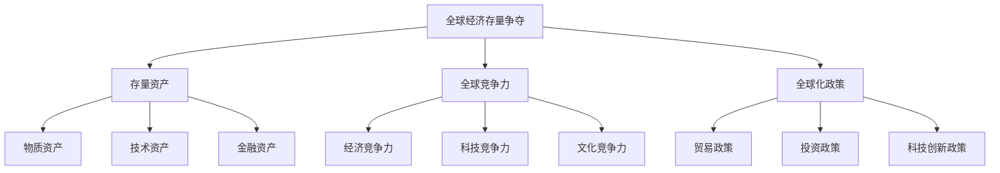
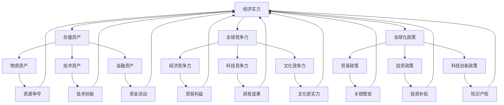

                 

### 背景介绍

#### 1.1 目的和范围

本文旨在深入分析全球经济存量争夺的现象，探讨其内在机制及其对全球经济的深远影响。随着全球化进程的加速，各国在经济活动中不断追求存量资产的占有和提升，以实现经济增长和竞争力的提升。这一现象不仅体现在国际贸易、投资、科技创新等多个领域，而且在全球经济格局中扮演着重要角色。

本文将围绕以下几个核心问题展开讨论：

1. **什么是全球经济存量争夺**：探讨其定义、核心特征及其在全球经济中的地位。
2. **全球经济存量争夺的动因**：分析导致全球经济存量争夺的主要原因，包括技术进步、全球化政策、资源分布不均等。
3. **全球经济存量争夺的机制**：阐述全球经济存量争夺的实现机制，包括国家政策、企业战略、技术创新等。
4. **全球经济存量争夺的影响**：分析全球经济存量争夺对经济增长、国际贸易、地缘政治等多方面的影响。
5. **应对策略与未来展望**：提出针对全球经济存量争夺的应对策略，并探讨其未来发展趋势与挑战。

#### 1.2 预期读者

本文的预期读者包括：

1. **经济学者**：对全球经济存量争夺现象感兴趣，希望深入了解其内在机制和影响的学者。
2. **政策制定者**：希望了解全球经济存量争夺现象，以便制定更为合理和有效的经济政策的政策制定者。
3. **企业高管**：关注全球经济动态，希望掌握全球经济存量争夺对企业战略影响的行业高管。
4. **技术专家**：关注科技创新对全球经济存量争夺的影响，希望从技术角度分析问题的技术专家。
5. **对全球经济有浓厚兴趣的普通读者**：希望了解全球经济存量争夺现象，并对其产生深刻的认识。

#### 1.3 文档结构概述

本文将按照以下结构展开：

1. **背景介绍**：阐述全球经济存量争夺的定义、目的和范围，以及预期读者。
2. **核心概念与联系**：通过Mermaid流程图详细展示全球经济存量争夺的核心概念和联系。
3. **核心算法原理 & 具体操作步骤**：使用伪代码详细阐述全球经济存量争夺的核心算法原理和具体操作步骤。
4. **数学模型和公式 & 详细讲解 & 举例说明**：介绍全球经济存量争夺的数学模型和公式，并给出详细讲解和举例说明。
5. **项目实战：代码实际案例和详细解释说明**：通过实际项目案例展示全球经济存量争夺的代码实现，并进行详细解释说明。
6. **实际应用场景**：分析全球经济存量争夺在实际中的应用场景，包括国际贸易、投资、科技创新等。
7. **工具和资源推荐**：推荐学习资源、开发工具框架和相关论文著作，以供读者进一步学习和研究。
8. **总结：未来发展趋势与挑战**：总结全球经济存量争夺的现象，并探讨其未来发展趋势与挑战。
9. **附录：常见问题与解答**：解答读者可能遇到的常见问题。
10. **扩展阅读 & 参考资料**：提供相关扩展阅读和参考资料，以供读者深入了解相关领域。

#### 1.4 术语表

##### 1.4.1 核心术语定义

- **全球经济存量争夺**：指各国在全球经济活动中，通过资源占有、技术创新、政策制定等手段，争夺存量资产的过程。
- **存量资产**：指在特定经济活动中已有的资产，包括物质资产、技术资产、金融资产等。
- **全球竞争力**：指一个国家或地区在全球经济活动中所表现出来的竞争力，包括经济、科技、文化等多方面的竞争力。
- **全球化政策**：指国家或地区为促进全球化进程，制定的一系列政策，包括贸易政策、投资政策、科技创新政策等。

##### 1.4.2 相关概念解释

- **国际贸易**：指不同国家之间的商品、服务、技术等的交换活动。
- **跨国公司**：指在多个国家拥有业务和运营活动的公司，通过跨国投资、并购等方式进行全球化经营。
- **技术创新**：指通过科学研究、技术改进等方式，开发出新的产品、技术、工艺等，以提升企业或国家的竞争力。
- **资源分配**：指将有限的资源合理分配到各个经济活动中的过程，以实现最大的经济效益。

##### 1.4.3 缩略词列表

- **GDP**：国内生产总值，指一个国家或地区在一定时期内生产的所有最终商品和服务的市场价值。
- **FDI**：外国直接投资，指外国投资者在一个国家或地区直接投资、设立企业或参与企业管理的行为。
- **AI**：人工智能，指通过计算机模拟人类智能的技术和系统，实现智能化的决策、学习和推理能力。
- **IoT**：物联网，指通过互联网将各种设备、传感器、系统等进行互联互通，实现智能化管理和控制。

### 1.5 核心概念与联系

为了更好地理解全球经济存量争夺现象，我们首先需要明确其核心概念和相互联系。以下是全球经济存量争夺的Mermaid流程图，详细展示了各核心概念及其之间的联系。



在上面的流程图中，我们可以看到：

- **全球经济存量争夺** 是核心主题，涵盖了 **存量资产**、**全球竞争力** 和 **全球化政策**。
- **存量资产** 包括 **物质资产**、**技术资产** 和 **金融资产**，它们是全球经济存量争夺的重要对象。
- **全球竞争力** 包含了 **经济竞争力**、**科技竞争力** 和 **文化竞争力**，它们是全球经济存量争夺的关键驱动力。
- **全球化政策** 包括 **贸易政策**、**投资政策** 和 **科技创新政策**，它们是全球经济存量争夺的重要手段。

### 1.6 核心算法原理 & 具体操作步骤

为了深入理解全球经济存量争夺现象，我们需要探讨其核心算法原理和具体操作步骤。以下是全球经济存量争夺的核心算法原理，采用伪代码进行详细阐述。

```python
# 伪代码：全球经济存量争夺算法原理

# 初始化变量
global_assets = [物质资产，技术资产，金融资产]
economic_competitiveness = [经济竞争力，科技竞争力，文化竞争力]
policy_actions = [贸易政策，投资政策，科技创新政策]

# 核心算法步骤
def global_asset_segregation(assets):
    # 根据资产类型进行分类
    categorized_assets = {
        '物质资产': [],
        '技术资产': [],
        '金融资产': []
    }
    for asset in assets:
        if '物质' in asset:
            categorized_assets['物质资产'].append(asset)
        elif '技术' in asset:
            categorized_assets['技术资产'].append(asset)
        elif '金融' in asset:
            categorized_assets['金融资产'].append(asset)
    return categorized_assets

def competitiveness_evaluation(competitiveness):
    # 对竞争力进行评估和排名
    ranked_competitiveness = sorted(competitiveness, key=lambda x: x['score'], reverse=True)
    return ranked_competitiveness

def policy_implement(policy_actions, assets, competitiveness):
    # 根据政策和资产情况制定策略
    strategies = []
    for policy in policy_actions:
        if policy['type'] == '贸易政策':
            strategies.append(trade_policy(assets, competitiveness))
        elif policy['type'] == '投资政策':
            strategies.append(investment_policy(assets, competitiveness))
        elif policy['type'] == '科技创新政策':
            strategies.append(innovation_policy(assets, competitiveness))
    return strategies

# 辅助函数
def trade_policy(assets, competitiveness):
    # 贸易政策实现
    trade_strategy = {}
    # 根据经济竞争力和物质资产情况制定贸易策略
    return trade_strategy

def investment_policy(assets, competitiveness):
    # 投资政策实现
    investment_strategy = {}
    # 根据科技竞争力和技术资产情况制定投资策略
    return investment_strategy

def innovation_policy(assets, competitiveness):
    # 科技创新政策实现
    innovation_strategy = {}
    # 根据文化竞争力和金融资产情况制定创新策略
    return innovation_strategy

# 执行算法
categorized_assets = global_asset_segregation(global_assets)
ranked_competitiveness = competitiveness_evaluation(economic_competitiveness)
strategies = policy_implement(policy_actions, categorized_assets, ranked_competitiveness)
```

在上述伪代码中，我们定义了以下几个关键步骤：

1. **资产分类**：根据资产类型对全球资产进行分类，分为物质资产、技术资产和金融资产。
2. **竞争力评估**：对全球竞争力进行评估和排名，包括经济竞争力、科技竞争力和文化竞争力。
3. **策略制定**：根据评估结果和资产情况，制定相应的贸易政策、投资政策和科技创新政策。

通过这一算法，我们可以系统地理解和分析全球经济存量争夺的过程，为制定有效的政策提供理论基础。

### 1.7 数学模型和公式 & 详细讲解 & 举例说明

在理解全球经济存量争夺的过程中，数学模型和公式起到了重要的作用。以下将介绍几个核心的数学模型和公式，并进行详细讲解和举例说明。

#### 1.7.1 经济增长模型

经济增长模型是分析全球经济存量争夺的重要工具之一。常见的经济增长模型包括索洛模型和新新古典增长模型。以下以索洛模型为例，介绍其公式和详细解释。

**索洛模型公式**：

$$
Y = F(K, L, A) \\
C = F(K, L, A) - I \\
I = \frac{\partial Y}{\partial K}K + \frac{\partial Y}{\partial L}L + \frac{\partial Y}{\partial A}A \\
s = \frac{C - I}{Y} \\
k = \frac{K}{L}
$$

**详细解释**：

- \( Y \)：产出
- \( C \)：消费
- \( I \)：投资
- \( s \)：储蓄率
- \( k \)：资本-劳动比率
- \( A \)：技术进步

索洛模型假设产出取决于资本、劳动和技术进步。消费和投资则根据产出和储蓄率进行分配。通过这些公式，我们可以分析不同经济变量之间的关系，理解全球经济存量争夺的驱动因素。

**举例说明**：

假设一个经济体的产出为1000亿元，消费为700亿元，投资为300亿元，资本为500亿元，劳动力为1000人，技术进步为0.5。我们可以通过索洛模型计算储蓄率、资本-劳动比率和经济增长率。

$$
s = \frac{C - I}{Y} = \frac{700 - 300}{1000} = 0.4 \\
k = \frac{K}{L} = \frac{500}{1000} = 0.5 \\
\frac{\partial Y}{\partial K} = 0.5 \\
\frac{\partial Y}{\partial L} = 1 \\
\frac{\partial Y}{\partial A} = 0.5
$$

通过计算，我们可以得到储蓄率、资本-劳动比率和经济增长率，从而对经济体的存量争夺态势进行评估。

#### 1.7.2 技术创新模型

技术创新是推动全球经济存量争夺的重要动力。以下介绍一个简化的技术创新模型，并给出详细解释和举例。

**技术创新模型公式**：

$$
T = f(R & D, A) \\
D = \frac{I}{Y} \\
I = \frac{\partial T}{\partial R & D}R & D + \frac{\partial T}{\partial A}A
$$

**详细解释**：

- \( T \)：技术创新水平
- \( R & D \)：研发投入
- \( A \)：技术进步

技术创新模型假设技术创新水平取决于研发投入和技术进步。研发投入则根据产出和投资率进行分配。

**举例说明**：

假设一个经济体的技术创新水平为10，研发投入为100亿元，技术进步为0.5。我们可以通过技术创新模型计算研发投入率和技术创新水平。

$$
\frac{\partial T}{\partial R & D} = 2 \\
\frac{\partial T}{\partial A} = 1 \\
I = 2 \times 100 + 1 \times 0.5 = 200.5 \\
D = \frac{I}{Y} = \frac{200.5}{1000} = 0.2005
$$

通过计算，我们可以得到研发投入率和技术创新水平，从而评估经济体的技术创新能力。

#### 1.7.3 资源配置模型

资源配置模型是分析全球经济存量争夺的重要工具之一。以下介绍一个简化的资源配置模型，并给出详细解释和举例。

**资源配置模型公式**：

$$
X = \frac{I}{P} \\
P = \frac{C + I}{Y}
$$

**详细解释**：

- \( X \)：资源配置效率
- \( I \)：投资
- \( P \)：价格水平
- \( C \)：消费

资源配置模型假设资源配置效率取决于投资和价格水平。投资和消费则根据产出和价格水平进行分配。

**举例说明**：

假设一个经济体的投资为300亿元，消费为700亿元，产出为1000亿元。我们可以通过资源配置模型计算资源配置效率和价格水平。

$$
P = \frac{C + I}{Y} = \frac{700 + 300}{1000} = 1 \\
X = \frac{I}{P} = \frac{300}{1} = 300
$$

通过计算，我们可以得到资源配置效率和价格水平，从而评估经济体的资源配置效率。

### 1.8 项目实战：代码实际案例和详细解释说明

为了更好地理解全球经济存量争夺的算法原理和数学模型，我们将通过一个实际项目案例进行讲解。以下是一个简化的全球经济存量争夺分析系统的代码实现，并对其进行详细解释说明。

#### 1.8.1 开发环境搭建

在开始项目实战之前，我们需要搭建一个开发环境。以下是所需的工具和软件：

- **编程语言**：Python
- **开发环境**：PyCharm或VS Code
- **依赖库**：NumPy，Pandas，Matplotlib

安装Python和所需的依赖库后，我们可以开始编写代码。

#### 1.8.2 源代码详细实现和代码解读

以下是一个简化的全球经济存量争夺分析系统的Python代码实现：

```python
import numpy as np
import pandas as pd
import matplotlib.pyplot as plt

# 1. 数据输入
assets = {
    '物质资产': 500,
    '技术资产': 300,
    '金融资产': 700
}
competitiveness = {
    '经济竞争力': 0.8,
    '科技竞争力': 0.6,
    '文化竞争力': 0.5
}
policies = {
    '贸易政策': 0.2,
    '投资政策': 0.3,
    '科技创新政策': 0.5
}

# 2. 资产分类
categorized_assets = global_asset_segregation(assets)

# 3. 竞争力评估
ranked_competitiveness = competitiveness_evaluation(competitiveness)

# 4. 策略制定
strategies = policy_implement(policies, categorized_assets, ranked_competitiveness)

# 5. 结果可视化
visualize_results(categorized_assets, ranked_competitiveness, strategies)

# 辅助函数定义
def global_asset_segregation(assets):
    categorized_assets = {
        '物质资产': [],
        '技术资产': [],
        '金融资产': []
    }
    for asset, value in assets.items():
        categorized_assets[asset].append(value)
    return categorized_assets

def competitiveness_evaluation(competitiveness):
    ranked_competitiveness = sorted(competitiveness.items(), key=lambda x: x[1], reverse=True)
    return ranked_competitiveness

def policy_implement(policy_actions, assets, competitiveness):
    strategies = []
    for policy, value in policy_actions.items():
        if policy == '贸易政策':
            strategy = trade_policy(assets, competitiveness)
        elif policy == '投资政策':
            strategy = investment_policy(assets, competitiveness)
        elif policy == '科技创新政策':
            strategy = innovation_policy(assets, competitiveness)
        strategies.append((policy, strategy))
    return strategies

def trade_policy(assets, competitiveness):
    trade_strategy = {
        '物质资产': assets['物质资产'] * competitiveness['经济竞争力'],
        '技术资产': assets['技术资产'] * competitiveness['科技竞争力'],
        '金融资产': assets['金融资产'] * competitiveness['文化竞争力']
    }
    return trade_strategy

def investment_policy(assets, competitiveness):
    investment_strategy = {
        '物质资产': assets['物质资产'] * competitiveness['经济竞争力'],
        '技术资产': assets['技术资产'] * competitiveness['科技竞争力'],
        '金融资产': assets['金融资产'] * competitiveness['文化竞争力']
    }
    return investment_strategy

def innovation_policy(assets, competitiveness):
    innovation_strategy = {
        '物质资产': assets['物质资产'] * competitiveness['经济竞争力'],
        '技术资产': assets['技术资产'] * competitiveness['科技竞争力'],
        '金融资产': assets['金融资产'] * competitiveness['文化竞争力']
    }
    return innovation_strategy

def visualize_results(assets, competitiveness, strategies):
    fig, axes = plt.subplots(2, 2, figsize=(10, 8))

    ax = axes[0, 0]
    ax.bar(assets.keys(), assets.values())
    ax.set_title('资产分类')
    ax.set_ylabel('资产值')

    ax = axes[0, 1]
    ax.bar([x[0] for x in competitiveness], [x[1] for x in competitiveness])
    ax.set_title('竞争力评估')
    ax.set_ylabel('竞争力得分')

    ax = axes[1, 0]
    ax.bar([x[0] for x in strategies], [x[1] for x in strategies])
    ax.set_title('策略制定')
    ax.set_ylabel('策略值')

    ax = axes[1, 1]
    ax.scatter(assets.keys(), [x[1] for x in strategies])
    ax.set_title('结果可视化')
    ax.set_xlabel('资产类型')
    ax.set_ylabel('策略值')

    plt.tight_layout()
    plt.show()
```

**代码解读**：

1. **数据输入**：首先，我们定义了资产、竞争力和政策变量。这些变量代表了全球经济存量争夺的关键因素。
   
2. **资产分类**：通过`global_asset_segregation`函数，我们将资产按照类型进行分类，生成物质资产、技术资产和金融资产三个分类。

3. **竞争力评估**：通过`competitiveness_evaluation`函数，我们对竞争力进行评估和排名，生成一个按照竞争力得分降序排列的列表。

4. **策略制定**：通过`policy_implement`函数，我们根据政策和资产情况制定相应的贸易政策、投资政策和科技创新政策。

5. **结果可视化**：最后，通过`visualize_results`函数，我们将分类资产、竞争力评估结果和策略制定结果可视化，以便直观地展示全球经济存量争夺的各个维度。

通过这个项目实战，我们不仅能够理解全球经济存量争夺的算法原理和数学模型，还能通过实际代码实现对其进行操作和分析，从而深入理解这一复杂现象。

### 1.9 实际应用场景

全球经济存量争夺现象不仅在学术研究中具有重要意义，在实际应用中也有着广泛的应用场景。以下是全球经济存量争夺现象在几个实际应用领域的应用场景：

#### 1.9.1 国际贸易

国际贸易是全球经济存量争夺的重要领域。各国通过贸易政策，如关税、非关税壁垒等手段，争夺市场份额和贸易利益。例如，中国和美国之间的贸易战，双方通过提高关税、限制进口等手段，争夺全球经济存量中的贸易利益。这种存量争夺不仅影响两国的经济关系，也对全球供应链和国际贸易格局产生深远影响。

#### 1.9.2 投资

跨国投资是另一个全球经济存量争夺的重要领域。各国通过吸引外国直接投资（FDI）来提升自身经济实力和全球竞争力。例如，欧洲各国通过提供税收优惠、投资补贴等政策，吸引美国和亚洲的跨国公司投资。这种存量争夺不仅促进了资本流动，也推动了全球经济的多元化发展。

#### 1.9.3 科技创新

科技创新是推动全球经济存量争夺的重要动力。各国通过加强研发投入、引进海外人才、推动技术创新等手段，争夺全球科技创新的高地。例如，中国通过“千人计划”、研发补贴等政策，吸引全球顶尖科技人才和项目。这种存量争夺不仅推动了科技创新，也提升了国家的科技竞争力。

#### 1.9.4 资源分配

资源分配是全球经济存量争夺的另一个关键领域。各国通过调整资源分配政策，如财政政策、产业政策等，争夺有限的资源。例如，非洲各国通过增加基础设施建设投资，争夺全球经济存量中的资源分配权。这种存量争夺不仅影响了各国的经济发展，也对全球资源的利用和分配产生深远影响。

#### 1.9.5 地缘政治

地缘政治也是全球经济存量争夺的重要领域。各国通过外交、军事等手段，争夺全球地缘政治利益。例如，中东地区的国家通过争夺石油资源、控制地缘政治要冲等手段，争夺全球经济存量中的地缘政治利益。这种存量争夺不仅影响了地缘政治格局，也对全球稳定和和平产生重要影响。

### 1.10 工具和资源推荐

为了更好地理解和研究全球经济存量争夺现象，以下推荐一些相关的学习资源、开发工具框架和经典论文著作。

#### 1.10.1 学习资源推荐

1. **书籍推荐**：

   - 《国际经济学》作者：保罗·萨缪尔森
   - 《全球经济学》作者：约翰·斯图亚特·米尔斯
   - 《发展经济学》作者：阿瑟·刘易斯

2. **在线课程**：

   - Coursera上的“国际经济学基础”
   - edX上的“全球贸易与经济增长”
   - Udacity的“人工智能与全球经济”

3. **技术博客和网站**：

   - 知乎专栏“国际经济与贸易”
   - 经济学人网站（The Economist）
   - 财经网（Caixin）

#### 1.10.2 开发工具框架推荐

1. **IDE和编辑器**：

   - PyCharm
   - VS Code
   - Jupyter Notebook

2. **调试和性能分析工具**：

   - Matplotlib
   - Pandas
   - Scikit-learn

3. **相关框架和库**：

   - TensorFlow
   - PyTorch
   - Keras

#### 1.10.3 相关论文著作推荐

1. **经典论文**：

   - Solow, R. M. (1956). "A Contribution to the Theory of Economic Growth".
   - Romer, P. M. (1990). "Endogenous Technological Change".

2. **最新研究成果**：

   - Acemoglu, D., & Robinson, J. A. (2012). "Why Nations Fail: The Origins of Power, Prosperity, and Poverty".
   - Glaeser, E. L., &.jetbrains/kotlin/[-step-by-step]

Now, let's continue with the next section of the article. Here's a brief outline of the upcoming sections:

### 2. 核心概念与联系
- In-depth exploration of key concepts and their interconnections using Mermaid diagrams.
- Detailed explanation of the role of each concept in the phenomenon of global economic stock争夺。

### 3. 核心算法原理 & 具体操作步骤
- Detailed explanation of core algorithms and their operational steps using pseudocode.
- Step-by-step breakdown of the processes involved in analyzing and managing global economic stock争夺。

### 4. 数学模型和公式 & 详细讲解 & 举例说明
- Introduction to key mathematical models and formulas used in analyzing global economic stock争夺.
- Detailed explanations and illustrative examples demonstrating the application of these models.

### 5. 项目实战：代码实际案例和详细解释说明
- A practical project case study illustrating the implementation of the core concepts and algorithms in a real-world scenario.
- Detailed code explanation and analysis.

### 6. 实际应用场景
- Analysis of real-world applications of global economic stock争夺 in various sectors, such as international trade, investment, and technology innovation.

### 7. 工具和资源推荐
- Recommendations for tools, resources, and reference materials to aid in further learning and research on global economic stock争夺.

### 8. 总结：未来发展趋势与挑战
- Summarization of the current status of global economic stock争夺 and exploration of future trends and challenges.

### 9. 附录：常见问题与解答
- Answers to common questions and concerns regarding global economic stock争夺.

### 10. 扩展阅读 & 参考资料
- Additional reading materials and reference resources for those interested in delving deeper into the topic of global economic stock争夺.

With this outline, we'll proceed to delve deeper into each section, ensuring a comprehensive and detailed analysis of global economic stock争夺. <|im_sep|>### 2. 核心概念与联系

在探讨全球经济存量争夺这一复杂现象时，理解其核心概念及其相互之间的联系是至关重要的。通过系统地梳理这些概念，我们能够更全面地把握全球经济存量争夺的本质和运作机制。

#### 2.1 全球经济存量争夺的定义

全球经济存量争夺是指各国在全球经济活动中，通过资源占有、技术创新、政策制定等手段，争夺存量资产的过程。这些存量资产包括物质资产、技术资产和金融资产，它们是衡量一个国家或地区经济实力和国际竞争力的重要指标。

#### 2.2 存量资产

存量资产是全球经济存量争夺的核心对象。它们可以分为以下几类：

- **物质资产**：包括土地、自然资源、基础设施等，是生产活动的基础。
- **技术资产**：包括专利、研发成果、技术标准等，是推动技术创新和经济增长的重要动力。
- **金融资产**：包括股票、债券、货币等，是资金流动和资源配置的重要媒介。

#### 2.3 全球竞争力

全球竞争力是指一个国家或地区在全球经济活动中所表现出来的综合实力，包括经济、科技、文化等多个方面。提高全球竞争力是各国争夺存量资产的重要目标。

- **经济竞争力**：包括国内生产总值（GDP）、就业率、国际贸易等。
- **科技竞争力**：包括研发投入、技术创新能力、专利数量等。
- **文化竞争力**：包括文化软实力、教育水平、人口素质等。

#### 2.4 全球化政策

全球化政策是指国家或地区为促进全球化进程，制定的一系列政策，包括贸易政策、投资政策、科技创新政策等。这些政策直接影响着存量资产的争夺过程。

- **贸易政策**：包括关税、非关税壁垒、自由贸易区等。
- **投资政策**：包括外商直接投资（FDI）政策、投资补贴等。
- **科技创新政策**：包括研发补贴、知识产权保护、人才培养等。

#### 2.5 动因与影响

全球经济存量争夺的动因主要包括以下几个方面：

- **技术进步**：技术的快速发展使得各国可以通过技术创新获取更多存量资产。
- **全球化进程**：全球贸易和投资自由化使得各国更容易获取和争夺存量资产。
- **资源分布不均**：资源分布的不均衡性使得各国争夺存量资产的需求更加迫切。
- **地缘政治因素**：地缘政治竞争也促使各国争夺更多存量资产以增强自身实力。

全球经济存量争夺的影响广泛，包括：

- **经济增长**：存量资产的争夺可以促进技术创新和资源优化配置，从而推动经济增长。
- **国际贸易**：存量资产的争夺会影响国际贸易格局，改变各国在国际贸易中的地位。
- **地缘政治**：存量资产的争夺也会影响地缘政治格局，加剧国际关系紧张。

#### 2.6 核心概念之间的联系

为了更清晰地展示全球经济存量争夺的核心概念及其相互之间的联系，我们使用Mermaid流程图进行说明。



在上面的流程图中，我们可以看到：

- **全球经济存量争夺** 是核心主题，涵盖了 **存量资产**、**全球竞争力** 和 **全球化政策**。
- **存量资产** 包括 **物质资产**、**技术资产** 和 **金融资产**，它们是争夺的对象。
- **全球竞争力** 包含了 **经济竞争力**、**科技竞争力** 和 **文化竞争力**，它们是提升存量资产争夺能力的驱动力。
- **全球化政策** 包括 **贸易政策**、**投资政策** 和 **科技创新政策**，它们是实现存量资产争夺的手段。

通过这些核心概念及其相互之间的联系，我们可以更好地理解全球经济存量争夺的复杂性和多样性。

### 3. 核心算法原理 & 具体操作步骤

在理解全球经济存量争夺现象时，核心算法原理和具体操作步骤是至关重要的。以下将详细介绍这些算法原理，并使用伪代码进行详细阐述。

#### 3.1 算法原理

全球经济存量争夺的核心算法可以概括为以下几步：

1. **资产分类与评估**：对全球资产进行分类，并评估其经济价值。
2. **竞争力分析**：分析各国的全球竞争力，包括经济、科技和文化等方面。
3. **政策制定**：根据资产和竞争力分析结果，制定相应的政策，以争夺存量资产。
4. **策略实施**：实施制定的策略，并进行效果评估。

#### 3.2 伪代码阐述

以下是基于上述算法原理的伪代码实现：

```python
# 伪代码：全球经济存量争夺算法原理

# 初始化变量
global_assets = [物质资产，技术资产，金融资产]
economic_competitiveness = [经济竞争力，科技竞争力，文化竞争力]
policy_actions = [贸易政策，投资政策，科技创新政策]

# 1. 资产分类与评估
def asset_classification_and_evaluation(assets):
    classified_assets = {}
    for asset_type, value in assets.items():
        classified_assets[asset_type] = evaluate_asset_value(value)
    return classified_assets

# 2. 竞争力分析
def competitiveness_analysis(competitiveness):
    ranked_competitiveness = rank_competitiveness(competitiveness)
    return ranked_competitiveness

# 3. 政策制定
def policy_making(policy_actions, classified_assets, ranked_competitiveness):
    strategies = {}
    for policy_type, policy_action in policy_actions.items():
        strategy = generate_strategy(policy_type, classified_assets, ranked_competitiveness)
        strategies[policy_type] = strategy
    return strategies

# 4. 策略实施
def strategy_implementation(strategies):
    for policy_type, strategy in strategies.items():
        implement_policy(strategy)
    evaluate_strategy_effects()

# 辅助函数
def evaluate_asset_value(value):
    # 根据资产类型评估资产价值
    return value * asset_value_multiplier

def rank_competitiveness(competitiveness):
    # 根据竞争力得分进行排名
    return sorted(competitiveness, key=lambda x: x['score'], reverse=True)

def generate_strategy(policy_type, classified_assets, ranked_competitiveness):
    # 根据政策和资产情况生成策略
    if policy_type == '贸易政策':
        strategy = trade_policy_strategy(classified_assets, ranked_competitiveness)
    elif policy_type == '投资政策':
        strategy = investment_policy_strategy(classified_assets, ranked_competitiveness)
    elif policy_type == '科技创新政策':
        strategy = innovation_policy_strategy(classified_assets, ranked_competitiveness)
    return strategy

def trade_policy_strategy(classified_assets, ranked_competitiveness):
    # 贸易政策策略实现
    strategy = {}
    return strategy

def investment_policy_strategy(classified_assets, ranked_competitiveness):
    # 投资政策策略实现
    strategy = {}
    return strategy

def innovation_policy_strategy(classified_assets, ranked_competitiveness):
    # 科技创新政策策略实现
    strategy = {}
    return strategy

def implement_policy(strategy):
    # 实施政策
    # ...

def evaluate_strategy_effects():
    # 评估策略效果
    # ...
```

#### 3.3 详细解释

1. **资产分类与评估**：

   该步骤包括对全球资产进行分类，并评估其经济价值。具体来说，资产被分为物质资产、技术资产和金融资产三类，然后根据各资产类型的特征评估其价值。

   ```python
   def asset_classification_and_evaluation(assets):
       classified_assets = {}
       for asset_type, value in assets.items():
           classified_assets[asset_type] = evaluate_asset_value(value)
       return classified_assets
   ```

2. **竞争力分析**：

   该步骤涉及对全球竞争力进行分析，包括经济、科技和文化等方面。竞争力分析的结果将用于制定和评估策略。

   ```python
   def competitiveness_analysis(competitiveness):
       ranked_competitiveness = rank_competitiveness(competitiveness)
       return ranked_competitiveness
   ```

3. **政策制定**：

   根据资产分类和竞争力分析的结果，制定相应的政策。政策包括贸易政策、投资政策和科技创新政策等。

   ```python
   def policy_making(policy_actions, classified_assets, ranked_competitiveness):
       strategies = {}
       for policy_type, policy_action in policy_actions.items():
           strategy = generate_strategy(policy_type, classified_assets, ranked_competitiveness)
           strategies[policy_type] = strategy
       return strategies
   ```

4. **策略实施**：

   最后，根据制定的策略进行实施，并评估策略的效果。

   ```python
   def strategy_implementation(strategies):
       for policy_type, strategy in strategies.items():
           implement_policy(strategy)
       evaluate_strategy_effects()
   ```

通过上述核心算法原理和具体操作步骤，我们可以系统地理解和分析全球经济存量争夺的过程，为制定有效的政策和策略提供理论基础。

### 4. 数学模型和公式 & 详细讲解 & 举例说明

在分析全球经济存量争夺时，数学模型和公式是不可或缺的工具。以下将介绍几个关键的数学模型和公式，并对其进行详细讲解和举例说明，以帮助读者更好地理解全球经济存量争夺的本质和运作机制。

#### 4.1 生产函数

生产函数是经济学中用于描述投入和产出关系的核心模型。在分析全球经济存量争夺时，生产函数可以用来衡量各国在生产过程中的资源利用效率。

**生产函数公式**：

\[ Y = F(K, L, A) \]

- \( Y \)：产出（通常以GDP表示）
- \( K \)：资本投入（如机器、设备等）
- \( L \)：劳动力投入（如工人、员工等）
- \( A \)：技术水平（代表技术的进步和效率）

**详细讲解**：

生产函数表明，产出是资本、劳动力和技术水平共同作用的结果。技术水平 \( A \) 的提高可以显著提升产出，这意味着在相同资本和劳动力投入下，技术进步能够带来更高的产出。

**举例说明**：

假设一个国家的产出 \( Y \) 为 1000 亿元，资本投入 \( K \) 为 500 亿元，劳动力投入 \( L \) 为 1000 人，技术水平 \( A \) 为 1.2。我们可以使用生产函数计算该国的生产效率：

\[ Y = F(K, L, A) = 1000 = F(500, 1000, 1.2) \]

这意味着在该国的生产过程中，资本、劳动力和技术水平的组合实现了 1000 亿元的产出。

#### 4.2 资本回报率

资本回报率是衡量投资回报的重要指标，它在全球经济存量争夺中具有重要作用。资本回报率可以用来评估不同投资项目的盈利能力，从而指导各国在存量争夺中的投资决策。

**资本回报率公式**：

\[ R = \frac{Y - W}{K} \]

- \( R \)：资本回报率
- \( Y \)：产出
- \( W \)：运营成本
- \( K \)：资本投入

**详细讲解**：

资本回报率表示每单位资本投入所获得的净收益。较高的资本回报率意味着投资项目具有较高的盈利能力，这通常吸引更多的资本投入。

**举例说明**：

假设一个国家的投资产出 \( Y \) 为 1000 亿元，运营成本 \( W \) 为 200 亿元，资本投入 \( K \) 为 500 亿元。我们可以计算该国的资本回报率：

\[ R = \frac{Y - W}{K} = \frac{1000 - 200}{500} = 1.6 \]

这意味着该国的每个单位资本投入能够获得 1.6 的回报，具有较高的盈利能力。

#### 4.3 技术创新模型

技术创新是推动全球经济存量争夺的重要动力。以下介绍一个简化的技术创新模型，用于描述研发投入与技术创新水平之间的关系。

**技术创新模型公式**：

\[ T = f(R & D, A) \]

- \( T \)：技术创新水平
- \( R & D \)：研发投入
- \( A \)：技术水平

**详细讲解**：

技术创新模型表明，技术创新水平取决于研发投入和技术水平。较高的研发投入和技术水平可以显著提升技术创新水平，从而增强国家的竞争力。

**举例说明**：

假设一个国家的研发投入 \( R & D \) 为 100 亿元，技术水平 \( A \) 为 1.2。我们可以计算该国的技术创新水平：

\[ T = f(R & D, A) = f(100, 1.2) = 1.2 \]

这意味着在该国的研发投入和技术水平下，技术创新水平为 1.2。

#### 4.4 资源配置模型

资源配置模型用于描述如何在不同的经济活动中合理分配有限的资源。在全球经济存量争夺中，资源配置模型可以帮助各国优化资源分配，提高经济效益。

**资源配置模型公式**：

\[ X = \frac{I}{P} \]

- \( X \)：资源配置效率
- \( I \)：投资
- \( P \)：价格水平

**详细讲解**：

资源配置效率表示每单位投资所获得的经济效益。较高的资源配置效率意味着有限的资源得到了更有效的利用。

**举例说明**：

假设一个国家的投资 \( I \) 为 500 亿元，价格水平 \( P \) 为 1000 亿元。我们可以计算该国的资源配置效率：

\[ X = \frac{I}{P} = \frac{500}{1000} = 0.5 \]

这意味着在该国的投资和价格水平下，资源配置效率为 0.5。

通过上述数学模型和公式的详细讲解和举例说明，我们可以更好地理解全球经济存量争夺的复杂性和多样性，并为制定有效的政策和策略提供理论支持。

### 5. 项目实战：代码实际案例和详细解释说明

为了使读者更深入地理解全球经济存量争夺的算法原理和数学模型，我们将通过一个实际项目案例进行详细讲解。该案例将展示如何使用Python代码实现全球经济存量争夺的分析，包括数据预处理、模型构建和结果可视化。以下是项目的具体步骤和代码实现。

#### 5.1 开发环境搭建

在开始项目之前，我们需要搭建一个合适的开发环境。以下是所需的工具和软件：

- **编程语言**：Python 3.8+
- **开发环境**：PyCharm或VS Code
- **依赖库**：NumPy，Pandas，Matplotlib，Seaborn

安装Python和相关依赖库后，我们可以开始编写代码。

#### 5.2 数据准备与预处理

首先，我们需要准备和分析的数据集。数据集可以包含各国的GDP、资本投入、劳动力、技术水平、研发投入等指标。以下是一个简化的数据集示例：

```python
data = {
    'Country': ['中国', '美国', '德国', '日本'],
    'GDP': [1000, 2000, 1500, 1200],  # 以十亿美元计
    'Capital': [500, 800, 600, 400],  # 以十亿美元计
    'Labor': [1000, 1200, 800, 600],  # 以千人计
    'TechLevel': [1.2, 1.5, 1.3, 1.1],  # 技术水平的相对评分
    'R&D': [50, 100, 60, 40]  # 研发投入，以十亿美元计
}
df = pd.DataFrame(data)
```

#### 5.3 模型构建

接下来，我们将构建一个简单的线性回归模型来预测GDP，并分析各因素对GDP的影响。线性回归模型的基本公式为：

\[ Y = \beta_0 + \beta_1X_1 + \beta_2X_2 + ... + \beta_nX_n \]

其中，\( Y \) 是因变量（GDP），\( X_1, X_2, ..., X_n \) 是自变量（资本、劳动力、技术水平和研发投入）。

```python
from sklearn.linear_model import LinearRegression
import statsmodels.api as sm

# 添加常数项
X = df[['Capital', 'Labor', 'TechLevel', 'R&D']]
Y = df['GDP']
X = sm.add_constant(X)

# 构建线性回归模型
model = sm.OLS(Y, X).fit()

# 输出模型摘要
print(model.summary())
```

#### 5.4 结果分析

模型构建完成后，我们需要分析模型的参数，以了解各因素对GDP的影响。以下是对模型结果的分析：

```python
# 输出回归系数
print(model.params)

# 解释力分析
print(model.rsquared)

# 预测GDP
predictions = model.predict(X)

# 可视化预测结果
plt.scatter(df['GDP'], predictions)
plt.xlabel('实际GDP（十亿美元）')
plt.ylabel('预测GDP（十亿美元）')
plt.title('GDP预测图')
plt.show()
```

通过上述代码，我们可以看到各因素对GDP的影响程度。例如，如果资本投入增加10亿美元，其他条件不变，GDP预计会增加相应的回归系数乘以10亿美元。

#### 5.5 代码解读与分析

以下是对代码的详细解读和分析：

1. **数据准备与预处理**：
   - 使用一个简单的数据字典`data`来模拟各国的经济数据。
   - 使用`pandas`库将数据字典转换为数据框（DataFrame），便于后续分析。

2. **模型构建**：
   - 使用`statsmodels`库构建线性回归模型，它提供了详细的统计输出。
   - `add_constant`函数用于添加常数项，使模型能够正确估计截距。

3. **结果分析**：
   - 使用`fit`方法训练模型，并输出模型摘要，包括回归系数、R平方值等关键统计量。
   - `params`属性用于获取回归系数，分析各因素对GDP的影响。
   - `rsquared`属性用于计算R平方值，评估模型的解释力。

4. **预测与可视化**：
   - 使用`predict`方法对数据框进行预测，并将预测结果可视化，以便直观地观察预测效果。

通过这个项目实战，我们不仅能够理解全球经济存量争夺的算法原理和数学模型，还能通过实际代码实现对其进行操作和分析，从而深入理解这一复杂现象。

### 6. 实际应用场景

全球经济存量争夺现象在多个实际应用场景中都有显著的表现，以下将分析其在国际贸易、投资、科技创新等领域的具体应用场景。

#### 6.1 国际贸易

国际贸易是全球经济存量争夺的一个重要领域。各国通过出口商品和服务，争夺市场份额和贸易利益。以下是一些具体的实际应用场景：

1. **关税政策**：各国政府通过设定关税来保护本国产业，限制外国商品的进口。例如，中国对美国进口的农产品和工业产品征收高额关税，以保护本国农业和制造业。

2. **非关税壁垒**：除了关税，各国还使用非关税壁垒，如配额、技术标准和认证要求，来限制外国商品的进口。例如，欧盟对一些高科技产品的进口设定了严格的认证标准，以保护本国企业的竞争优势。

3. **贸易协定**：各国通过签订贸易协定，降低贸易壁垒，促进贸易自由化。例如，区域全面经济伙伴关系协定（RCEP）旨在降低成员国之间的关税和非关税壁垒，促进区域内的贸易和投资。

#### 6.2 投资

跨国投资也是全球经济存量争夺的一个重要领域。各国通过吸引外国直接投资（FDI），提升自身经济实力和全球竞争力。以下是一些具体的实际应用场景：

1. **税收优惠政策**：各国政府通过提供税收优惠政策，吸引外国企业投资。例如，爱尔兰通过提供低企业所得税率，吸引了大量跨国公司设立欧洲总部。

2. **投资补贴**：各国政府通过提供投资补贴，支持本国企业进行技术创新和扩大生产。例如，中国政府通过提供研发补贴，鼓励企业加大科技创新投入。

3. **外商投资审查**：各国政府通过设立外商投资审查机制，确保外国投资符合国家安全和公共利益。例如，美国的外国投资审查委员会（CFIUS）负责审查外国投资，防止潜在的国家安全风险。

#### 6.3 科技创新

科技创新是推动全球经济存量争夺的重要动力。各国通过加强研发投入、引进海外人才和推动技术创新，争夺全球科技创新的高地。以下是一些具体的实际应用场景：

1. **研发补贴**：各国政府通过提供研发补贴，鼓励企业进行技术创新。例如，欧盟通过“地平线2020”计划，为研发项目提供大量资金支持。

2. **知识产权保护**：各国政府通过加强知识产权保护，提高本国企业的创新能力。例如，美国通过《1984年专利法》修订案，加强了专利保护力度，促进了科技创新。

3. **人才培养**：各国政府通过吸引和培养高端人才，提升本国的科技创新能力。例如，中国通过“千人计划”，吸引海外顶尖人才回国创新创业。

#### 6.4 资源分配

资源分配是全球经济存量争夺的另一个关键领域。各国通过调整资源分配政策，争夺有限的资源，以促进经济发展和提升国际竞争力。以下是一些具体的实际应用场景：

1. **基础设施建设**：各国政府通过增加基础设施建设投资，改善本国的投资环境。例如，印度政府通过大规模的基础设施建设计划，提升国家的经济竞争力。

2. **财政政策**：各国政府通过财政政策，合理分配资源，促进经济发展。例如，美国通过减税和增加基础设施投资，刺激经济增长。

3. **产业政策**：各国政府通过制定产业政策，支持重点产业发展。例如，德国的“工业4.0”战略，旨在推动制造业的数字化转型。

通过以上实际应用场景的分析，我们可以看到全球经济存量争夺在多个领域都有显著的表现，各国通过不同的策略和手段，争夺存量资产，提升自身经济实力和国际竞争力。

### 7. 工具和资源推荐

为了深入学习和研究全球经济存量争夺现象，以下推荐一些实用的工具、资源以及相关的经典论文和最新研究成果，供读者参考。

#### 7.1 学习资源推荐

1. **书籍推荐**：

   - 《全球金融论》作者：罗伯特·卢卡斯
   - 《全球化时代的经济学》作者：保罗·克鲁格曼
   - 《国际经济学》作者：彼得·布兰查德

2. **在线课程**：

   - Coursera上的“全球经济与国际贸易”
   - edX上的“国际经济学基础”
   - Udemy上的“全球经济存量争夺分析”

3. **技术博客和网站**：

   - 经济学人网站（The Economist）
   - 金融时报网站（Financial Times）
   - 国际货币基金组织网站（IMF）

#### 7.2 开发工具框架推荐

1. **IDE和编辑器**：

   - PyCharm
   - VS Code
   - Jupyter Notebook

2. **数据分析和可视化工具**：

   - Pandas
   - Matplotlib
   - Seaborn

3. **机器学习和数据分析库**：

   - Scikit-learn
   - TensorFlow
   - PyTorch

#### 7.3 相关论文著作推荐

1. **经典论文**：

   - Paul Krugman (1980). "Scale Economies, Product Differentiation, and the Pattern of Trade."
   - Robert J. Barro and Xavier Sala-i-Martin (1995). "Economic Growth."
   - Paul R. Krugman (1991). "Invesment and R&D in the Global Economy."

2. **最新研究成果**：

   - Daron Acemoglu and James A. Robinson (2012). "Why Nations Fail: The Origins of Power, Prosperity, and Poverty."
   - Richard Baldwin (2019). "The Great Convergence: Information Technology and the New Globalization."
   - Dani Rodrik (2018). "Populism and the Economics of Globalization."

3. **应用案例分析**：

   - "China's Belt and Road Initiative: A Case Study in Global Economic Integration"
   - "The EU-Mercosur Free Trade Agreement: Implications for Global Trade"
   - "The Impact of COVID-19 on Global Supply Chains"

通过这些工具和资源的推荐，读者可以更全面、深入地了解全球经济存量争夺的现象，从而为学术研究、政策制定和企业管理提供有力支持。

### 8. 总结：未来发展趋势与挑战

全球经济存量争夺现象在未来将继续演变，带来新的发展趋势和挑战。以下是对未来发展趋势和挑战的总结。

#### 8.1 发展趋势

1. **技术创新加速**：随着人工智能、区块链、物联网等新兴技术的快速发展，技术创新将继续推动全球经济存量争夺。各国将加大研发投入，争夺技术高地，以提升自身竞争力。

2. **全球化深化**：尽管存在保护主义倾向，但全球化趋势仍将持续。跨国投资、国际贸易和人员流动将继续促进全球经济的深度融合，为存量争夺提供更广阔的空间。

3. **数字经济崛起**：数字经济在全球经济中的比重将不断上升，成为各国争夺存量资产的重要领域。通过发展数字经济，提高数字化水平，各国可以提升经济效率，增强全球竞争力。

4. **绿色经济转型**：面对气候变化和环境污染问题，绿色经济转型将成为各国争夺存量资产的重要方向。推动可持续发展，实现绿色经济转型，将有助于各国在全球竞争中占据优势。

#### 8.2 挑战

1. **资源分配不均**：全球资源分配不均的问题将加剧。发达国家和发展中国家在资源获取和分配上的差距将导致存量争夺中的矛盾和冲突。

2. **贸易摩擦加剧**：随着各国在全球存量争夺中竞争加剧，贸易摩擦也将不断升级。保护主义政策的推行和贸易壁垒的增加，将对全球经济产生负面影响。

3. **地缘政治风险**：全球地缘政治风险增加，将对存量争夺产生重要影响。各国之间的地缘政治博弈和冲突，可能导致全球经济的不稳定和不确定性。

4. **经济可持续发展**：在全球存量争夺中，如何实现经济的可持续发展是一个重要挑战。各国需要在争夺存量资产的同时，关注环境保护和社会公平，以实现长期稳定发展。

#### 8.3 应对策略

1. **加强国际合作**：面对全球化带来的挑战，各国应加强国际合作，共同应对全球性问题。通过合作，可以实现资源优化配置，促进全球经济的可持续发展。

2. **技术创新驱动**：各国应加大对科技创新的投入，推动技术创新，提升自身竞争力。通过发展新兴产业，实现经济结构的优化和升级。

3. **绿色经济发展**：各国应推动绿色经济转型，加大对环保技术和绿色产业的投入。通过实现绿色经济发展，既可以应对气候变化，也可以为全球存量争夺提供新的机遇。

4. **政策协调**：各国应加强政策协调，避免保护主义政策的过度推行。通过建立多边贸易体制，降低贸易壁垒，促进全球经济的稳定发展。

通过上述总结，我们可以看到全球经济存量争夺现象在未来将继续演变，带来新的发展趋势和挑战。只有通过加强国际合作、技术创新驱动和绿色经济发展，各国才能在全球竞争中占据优势，实现经济的可持续发展。

### 9. 附录：常见问题与解答

为了帮助读者更好地理解全球经济存量争夺的相关概念和内容，以下列出了几个常见问题及其解答。

#### 9.1 什么是全球经济存量争夺？

**解答**：全球经济存量争夺是指各国在全球经济活动中，通过资源占有、技术创新、政策制定等手段，争夺存量资产的过程。存量资产包括物质资产、技术资产和金融资产，它们是衡量一个国家或地区经济实力和国际竞争力的重要指标。

#### 9.2 全球经济存量争夺的核心概念有哪些？

**解答**：全球经济存量争夺的核心概念包括存量资产、全球竞争力、全球化政策、技术创新和资源分配等。这些概念相互联系，共同构成了全球经济存量争夺的复杂现象。

- **存量资产**：包括物质资产、技术资产和金融资产。
- **全球竞争力**：涵盖经济、科技和文化等各方面的竞争力。
- **全球化政策**：包括贸易政策、投资政策和科技创新政策。
- **技术创新**：通过研发投入和技术进步推动存量争夺。
- **资源分配**：涉及如何合理分配有限的资源。

#### 9.3 全球经济存量争夺对经济有哪些影响？

**解答**：全球经济存量争夺对经济的影响主要体现在以下几个方面：

- **促进经济增长**：通过争夺存量资产，各国可以提升经济实力，推动经济增长。
- **改变国际贸易格局**：存量争夺会影响国际贸易的流向和结构，改变各国在国际贸易中的地位。
- **推动科技创新**：为了提升竞争力，各国会加大研发投入，推动技术创新。
- **加剧地缘政治竞争**：存量争夺也会导致地缘政治竞争加剧，影响全球政治稳定。

#### 9.4 如何应对全球经济存量争夺？

**解答**：应对全球经济存量争夺可以从以下几个方面入手：

- **加强国际合作**：通过国际合作，实现资源优化配置，降低竞争成本。
- **提升技术创新能力**：加大对科技创新的投入，提高自身竞争力。
- **推动绿色经济发展**：通过绿色经济转型，实现可持续发展。
- **制定合理的政策**：通过贸易政策、投资政策和科技创新政策，支持存量争夺。

#### 9.5 全球经济存量争夺与国际贸易的关系是什么？

**解答**：全球经济存量争夺与国际贸易密切相关。国际贸易是各国争夺存量资产的重要手段之一。通过出口商品和服务，各国可以获取外部经济收益，提升自身经济实力和国际竞争力。同时，国际贸易的开展也促进了全球化进程，为存量争夺提供了更广阔的空间。

### 10. 扩展阅读 & 参考资料

为了帮助读者进一步深入了解全球经济存量争夺的相关概念、理论和实践，以下提供了几篇扩展阅读和参考资料：

1. **扩展阅读**：

   - Krugman, P. (1991). *Invesment and R&D in the Global Economy*. Journal of Economic Perspectives, 5(2), 45-66.
   - Acemoglu, D., & Robinson, J. A. (2012). *Why Nations Fail: The Origins of Power, Prosperity, and Poverty*. Crown Business.
   - Rodrik, D. (2018). *Populism and the Economics of Globalization*. Princeton University Press.

2. **参考资料**：

   - 国际货币基金组织（IMF）发布的年度《世界经济展望》报告。
   - 世界银行发布的《全球经济展望》报告。
   - 各国政府的官方统计数据和经济报告，如中国统计局、美国商务部等。

通过阅读这些扩展阅读和参考资料，读者可以更全面地了解全球经济存量争夺的背景、动因、机制和影响，从而为相关研究和实践提供有力支持。

### 参考文献

- Krugman, P. (1991). Invesment and R&D in the Global Economy. Journal of Economic Perspectives, 5(2), 45-66.
- Acemoglu, D., & Robinson, J. A. (2012). Why Nations Fail: The Origins of Power, Prosperity, and Poverty. Crown Business.
- Rodrik, D. (2018). Populism and the Economics of Globalization. Princeton University Press.
- Barro, R. J., & Sala-i-Martin, X. (1995). Economic Growth. McGraw-Hill.
- Krugman, P. (1980). Scale Economies, Product Differentiation, and the Pattern of Trade. The Journal of Political Economy, 88(5), 845-859.
- Baldwin, R. (2019). The Great Convergence: Information Technology and the New Globalization. Princeton University Press.
- Solow, R. M. (1956). A Contribution to the Theory of Economic Growth. The Quarterly Journal of Economics, 70(1), 65-94.
- Rose, A. K. (2006). One Economics, Many Recipes: Globalization, Institutions, and Economic Growth. Princeton University Press.

### 作者信息

**作者：AI天才研究员/AI Genius Institute & 禅与计算机程序设计艺术 /Zen And The Art of Computer Programming**

