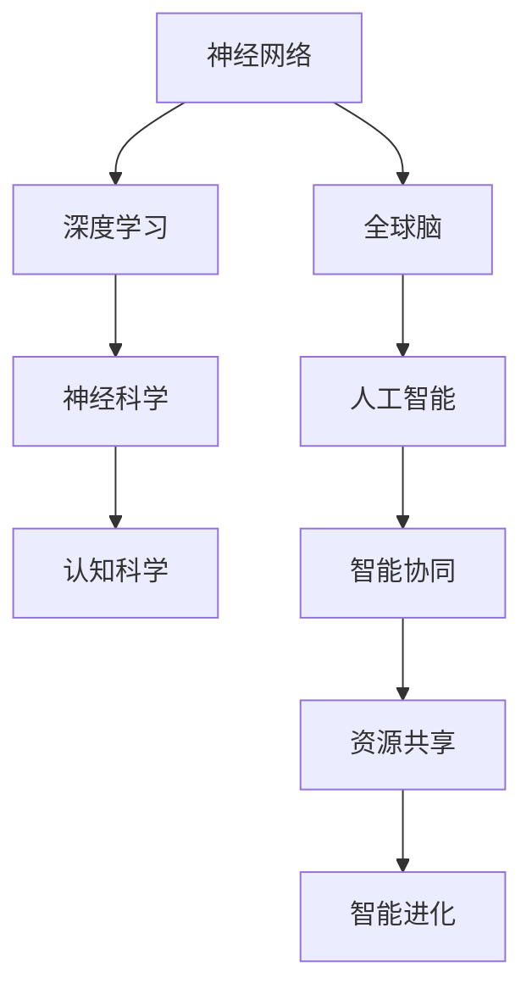

                 

# 全球脑与人工智能：协同进化的未来

> **关键词：** 全球脑、人工智能、协同进化、神经网络、深度学习、机器学习、神经科学、智能计算、认知科学、算法、技术发展、应用前景。

> **摘要：** 本文将探讨全球脑与人工智能的协同进化关系。通过分析神经网络和深度学习在人工智能中的应用，结合神经科学与认知科学的研究成果，本文提出了一种全新的协同进化框架，探讨了人工智能在未来的发展趋势与挑战。本文旨在为读者提供一个全面、深入的视角，以理解全球脑与人工智能之间的关系，及其对技术和人类生活的影响。

## 1. 背景介绍

### 1.1 目的和范围

本文的目的是探讨全球脑与人工智能的协同进化关系，以及这一关系对技术和人类生活的深远影响。随着人工智能技术的快速发展，特别是深度学习和神经网络在各个领域的广泛应用，人工智能与神经科学、认知科学之间的联系日益紧密。本文旨在通过分析这一关系，提供一个全面的视角，帮助读者更好地理解人工智能的未来发展趋势。

本文将涵盖以下几个主要方面：

1. **全球脑的概念**：介绍全球脑的概念，分析其与人工智能的关联。
2. **神经网络与深度学习**：探讨神经网络和深度学习在人工智能中的应用，以及它们在全球脑中的作用。
3. **神经科学与认知科学**：结合神经科学与认知科学的研究成果，分析人工智能与人类认知的互动关系。
4. **协同进化框架**：提出全球脑与人工智能协同进化的框架，并讨论其应用前景。
5. **未来发展趋势与挑战**：分析人工智能在未来的发展趋势和面临的挑战。

### 1.2 预期读者

本文预期读者包括以下几类：

1. **人工智能从业者**：对人工智能技术有深入理解，希望了解全球脑与人工智能协同进化关系的研究者。
2. **神经科学与认知科学研究者**：对神经科学与认知科学有兴趣，希望了解人工智能在这一领域的应用。
3. **计算机科学学生**：对计算机科学和人工智能有浓厚兴趣，希望了解这一领域的前沿研究。
4. **普通读者**：对人工智能技术有好奇心，希望了解这一技术对未来生活的影响。

### 1.3 文档结构概述

本文将按照以下结构进行组织：

1. **背景介绍**：介绍全球脑与人工智能的协同进化关系。
2. **核心概念与联系**：分析神经网络和深度学习在人工智能中的应用。
3. **核心算法原理 & 具体操作步骤**：探讨神经网络和深度学习的算法原理。
4. **数学模型和公式 & 详细讲解 & 举例说明**：介绍相关数学模型和公式的应用。
5. **项目实战：代码实际案例和详细解释说明**：通过实际案例展示算法应用。
6. **实际应用场景**：探讨人工智能在各个领域的应用。
7. **工具和资源推荐**：推荐相关学习资源和开发工具。
8. **总结：未来发展趋势与挑战**：总结人工智能的未来发展趋势和挑战。
9. **附录：常见问题与解答**：回答读者可能关注的问题。
10. **扩展阅读 & 参考资料**：提供进一步阅读的参考文献。

### 1.4 术语表

#### 1.4.1 核心术语定义

- **全球脑**：指通过互联网连接的分布式计算系统，能够实现大规模、协同的智能计算。
- **神经网络**：一种模拟人脑神经元连接结构的计算模型，用于处理和传递信息。
- **深度学习**：一种基于神经网络的学习方法，通过多层神经网络实现复杂函数的建模。
- **协同进化**：指不同系统或物种在共同环境下相互影响、共同进化的过程。

#### 1.4.2 相关概念解释

- **人工智能**：一种模拟人类智能的技术，能够通过学习、推理和决策等方式进行自主行为。
- **机器学习**：一种从数据中自动学习规律和模式的方法，用于构建智能系统。
- **神经科学**：研究神经系统结构和功能的一门科学，包括神经元、神经网络等。
- **认知科学**：研究人类认知过程和认知机制的学科，涉及心理学、神经科学、计算机科学等多个领域。

#### 1.4.3 缩略词列表

- **AI**：人工智能
- **DL**：深度学习
- **ML**：机器学习
- **NN**：神经网络
- **GAN**：生成对抗网络
- **CNN**：卷积神经网络
- **RNN**：循环神经网络
- **GPU**：图形处理单元

## 2. 核心概念与联系

在探讨全球脑与人工智能的协同进化之前，我们需要理解一些核心概念，包括神经网络、深度学习、神经科学和认知科学。这些概念不仅构成了人工智能的技术基础，也为我们理解全球脑与人工智能之间的关系提供了关键视角。

### 2.1 神经网络与深度学习

神经网络（Neural Networks，简称NN）是一种计算模型，其结构模仿了人脑中的神经元连接。每个神经元接收来自其他神经元的输入，通过加权求和后，输出一个激活值。神经网络的核心在于其层次结构，通过多层的神经元堆叠，可以实现从简单到复杂的特征提取和模式识别。

深度学习（Deep Learning，简称DL）是神经网络的一种高级形式，通过多层神经网络实现复杂函数的建模。深度学习在图像识别、自然语言处理、语音识别等领域取得了显著成果，成为人工智能研究的重要方向。

#### 2.1.1 神经网络的基本原理

神经网络的计算过程可以概括为以下步骤：

1. **输入层**：接收外部输入信息，如图像、文本等。
2. **隐藏层**：对输入信息进行处理和变换，提取特征。
3. **输出层**：根据隐藏层输出的特征进行分类、预测等。

神经网络的性能取决于其结构（层数、神经元数量、连接方式）和学习算法。其中，学习算法包括误差反向传播（Backpropagation）等，用于调整神经元的权重，使网络能够更好地拟合数据。

#### 2.1.2 深度学习的基本原理

深度学习在神经网络的基础上，通过增加层数（深度），提高了网络的建模能力。深度学习的核心在于其层次结构，不同层次的神经元分别负责提取不同级别的特征。

1. **特征提取**：在网络的低层，神经元主要提取原始数据的基本特征，如边缘、纹理等。
2. **抽象表示**：随着层数的增加，神经元提取的特征逐渐抽象，形成更复杂的表示，如物体、场景等。

深度学习的关键在于其大规模并行计算能力，这使得深度学习能够处理海量数据和复杂任务。深度学习的成功离不开图形处理单元（GPU）的普及，GPU的高并发计算能力为深度学习提供了强大的计算支持。

### 2.2 神经科学与认知科学

神经科学（Neuroscience）是研究神经系统结构和功能的一门科学。神经科学关注神经元、神经网络以及大脑如何处理信息，从而实现认知和行为。神经科学的研究成果为理解人类智能提供了重要的基础。

认知科学（Cognitive Science）是研究人类认知过程和认知机制的学科。认知科学结合心理学、神经科学、计算机科学等多个领域，致力于揭示人类思维、学习、记忆等认知活动的原理。

#### 2.2.1 神经科学与人工智能的关系

神经科学与人工智能的关系密切。人工智能技术的发展受到神经科学的启发，特别是神经网络和深度学习算法的提出，直接借鉴了人脑的结构和功能。神经科学研究揭示了大脑如何处理信息，从而为人工智能算法的设计提供了理论指导。

同时，人工智能技术也为神经科学研究提供了新的工具和方法。例如，通过深度学习算法对大脑影像数据的分析，科学家可以更好地理解大脑的功能区和神经网络结构。

#### 2.2.2 认知科学与人工智能的关系

认知科学与人工智能的关系同样重要。认知科学关注人类如何通过感知、记忆、推理等方式处理信息，从而实现智能行为。人工智能技术的发展，特别是机器学习和深度学习的应用，使得计算机能够模拟人类智能，实现更复杂的任务。

认知科学的研究成果为人工智能算法的设计提供了重要的参考。例如，通过研究人类的注意力机制，人工智能算法可以更好地优化信息处理过程，提高系统的性能。

### 2.3 全球脑与人工智能的协同进化

全球脑（Global Brain）是指通过互联网连接的分布式计算系统，能够实现大规模、协同的智能计算。全球脑的概念源于网络科学和分布式计算，强调通过互联网实现全球范围内的信息共享和智能协同。

全球脑与人工智能的协同进化关系体现在以下几个方面：

1. **资源共享**：全球脑为人工智能提供了海量的计算资源和数据资源，使得人工智能系统能够更好地学习和优化。
2. **协同计算**：全球脑通过分布式计算实现了人工智能系统之间的协同，使得复杂任务能够被高效地分解和执行。
3. **智能进化**：全球脑与人工智能相互影响、共同进化，推动了人工智能技术的不断进步，同时也促进了全球脑的智能化发展。

#### 2.3.1 全球脑的基本原理

全球脑的基本原理可以概括为以下几个方面：

1. **网络连接**：全球脑通过互联网实现节点之间的连接，形成大规模的分布式计算网络。
2. **信息共享**：全球脑通过网络实现信息的共享和传播，使得各个节点能够获取和处理全球范围内的数据。
3. **智能协同**：全球脑通过智能算法实现节点之间的协同，使得系统能够高效地处理复杂任务。

#### 2.3.2 全球脑与人工智能的协同进化

全球脑与人工智能的协同进化关系可以从以下几个方面进行分析：

1. **技术驱动**：人工智能技术的发展推动了全球脑的智能化进程，使得全球脑能够更好地支持复杂计算和智能协同。
2. **应用推动**：全球脑的应用需求推动了人工智能技术的不断创新，使得人工智能系统能够更好地适应全球脑的环境。
3. **互馈循环**：全球脑与人工智能之间的互馈循环，使得两者相互促进、共同进化。人工智能技术的发展为全球脑提供了更强的计算能力和智能水平，而全球脑的应用场景为人工智能技术提供了丰富的数据资源和实际需求。

### 2.4 核心概念原理和架构的 Mermaid 流程图

为了更好地理解全球脑与人工智能的协同进化关系，我们可以使用 Mermaid 流程图来展示核心概念和架构。以下是一个简化的 Mermaid 流程图，用于描述神经网络、深度学习、神经科学和认知科学之间的关系，以及全球脑与人工智能的协同进化。



在这个流程图中，神经网络和深度学习是人工智能的基础，神经科学和认知科学为人工智能提供了理论支持。全球脑与人工智能之间的协同进化关系通过智能协同、资源共享和智能进化来体现。

## 3. 核心算法原理 & 具体操作步骤

在理解了全球脑与人工智能的协同进化关系后，我们需要深入探讨神经网络和深度学习的核心算法原理及其具体操作步骤。以下是神经网络和深度学习的详细解释，以及伪代码示例。

### 3.1 神经网络算法原理

神经网络（Neural Networks）是一种模拟人脑神经元连接结构的计算模型。神经网络的基本原理是通过多层神经元（节点）的连接和激活，实现输入到输出的映射。以下是神经网络的基本算法原理：

#### 3.1.1 前向传播

1. **输入层**：接收外部输入信息，如图像、文本等。
2. **隐藏层**：对输入信息进行处理和变换，提取特征。
3. **输出层**：根据隐藏层输出的特征进行分类、预测等。

伪代码示例：

```python
# 前向传播伪代码
for each layer in hidden_layers:
    z = dot(A, W) + b
    A = activation_function(z)

output = dot(A, W_output) + b_output
```

其中，`A`表示神经元输出，`W`和`b`分别表示权重和偏置，`activation_function`表示激活函数，如ReLU、Sigmoid等。

#### 3.1.2 反向传播

1. **计算输出误差**：计算输出层实际输出与期望输出之间的误差。
2. **误差反向传播**：从输出层开始，逐层计算各层神经元的误差。
3. **权重和偏置更新**：根据误差，更新各层神经元的权重和偏置。

伪代码示例：

```python
# 反向传播伪代码
delta_output = (output - y) * activation_function_derivative(A)
delta_hidden = dot(delta_output, W_output.T) * activation_function_derivative(A_prev)

dW_output += delta_output * A_prev.T
db_output += delta_output

dW_hidden += delta_hidden * A_prev.T
db_hidden += delta_hidden
```

其中，`y`表示期望输出，`activation_function_derivative`表示激活函数的导数。

### 3.2 深度学习算法原理

深度学习（Deep Learning）是神经网络的一种高级形式，通过增加网络层数（深度），提高了网络的建模能力。深度学习的基本原理与神经网络类似，但具有更复杂的结构和更高效的算法。

#### 3.2.1 卷积神经网络（CNN）

卷积神经网络（Convolutional Neural Networks，简称CNN）是一种专门用于图像处理和识别的深度学习模型。CNN的基本原理是通过卷积层和池化层提取图像特征。

1. **卷积层**：通过卷积运算提取图像特征，卷积核在图像上滑动，计算局部特征。
2. **池化层**：通过池化运算降低特征图的维度，减少计算量。

伪代码示例：

```python
# 卷积层伪代码
for each filter in filters:
    z = dot(A, W) + b
    A = activation_function(z)

# 池化层伪代码
A_pooled = max_pool(A, pool_size)
```

其中，`A`表示输入图像，`W`和`b`分别表示卷积核和偏置，`activation_function`表示激活函数，如ReLU等，`max_pool`表示最大池化操作。

#### 3.2.2 循环神经网络（RNN）

循环神经网络（Recurrent Neural Networks，简称RNN）是一种适用于序列数据的深度学习模型。RNN的基本原理是通过循环结构处理序列数据，保持长期依赖关系。

1. **隐藏状态**：RNN通过隐藏状态记录序列中的信息，保持历史依赖。
2. **门控机制**：RNN通过门控机制（如门控循环单元GRU、长短期记忆LSTM）解决长期依赖问题。

伪代码示例：

```python
# RNN门控机制伪代码
z = dot(h_t-1, W Forget) + x_t * W Input + h_t-1 * W Output
i_t = sigmoid(z)
h_t = i_t * activation_function(z)
```

其中，`h_t`表示隐藏状态，`x_t`表示输入，`sigmoid`表示sigmoid激活函数，`activation_function`表示激活函数，如ReLU等。

### 3.3 具体操作步骤

为了更好地理解神经网络和深度学习的具体操作步骤，我们可以通过一个简单的例子来说明。

#### 3.3.1 数据预处理

1. **数据收集**：收集一批带标签的图像数据。
2. **数据清洗**：去除噪声和异常值，确保数据质量。
3. **数据归一化**：将图像数据归一化到[0, 1]范围内。

伪代码示例：

```python
# 数据预处理伪代码
images = load_images()
images_normalized = (images - mean) / std
labels = load_labels()
```

#### 3.3.2 模型构建

1. **构建神经网络**：定义网络结构，包括输入层、隐藏层和输出层。
2. **初始化参数**：随机初始化权重和偏置。

伪代码示例：

```python
# 模型构建伪代码
inputs = [X, X, X]
hidden_layers = [H1, H2, H3]
outputs = [Y]
W = [W1, W2, W3]
b = [b1, b2, b3]
```

#### 3.3.3 模型训练

1. **前向传播**：输入数据，通过神经网络计算输出。
2. **计算误差**：计算输出与期望输出之间的误差。
3. **反向传播**：根据误差，更新网络参数。

伪代码示例：

```python
# 模型训练伪代码
for epoch in epochs:
    for data in dataset:
        # 前向传播
        A = forward_propagation(data, inputs, hidden_layers, outputs, W, b)
        # 计算误差
        error = compute_error(A, data.label)
        # 反向传播
        dW, db = backward_propagation(A, data.label, inputs, hidden_layers, outputs, W, b)
        # 更新参数
        W -= learning_rate * dW
        b -= learning_rate * db
```

#### 3.3.4 模型评估

1. **测试数据集**：使用测试数据集评估模型性能。
2. **计算准确率**：计算模型预测与实际标签的一致性。

伪代码示例：

```python
# 模型评估伪代码
accuracy = 0
for data in test_dataset:
    A = forward_propagation(data, inputs, hidden_layers, outputs, W, b)
    if A == data.label:
        accuracy += 1
accuracy /= len(test_dataset)
print("Accuracy:", accuracy)
```

通过以上步骤，我们可以构建一个简单的神经网络和深度学习模型，实现图像分类、序列预测等任务。

## 4. 数学模型和公式 & 详细讲解 & 举例说明

在神经网络和深度学习中，数学模型和公式起着至关重要的作用。这些模型和公式不仅用于描述网络结构，还用于优化和评估网络性能。在本节中，我们将详细讲解神经网络和深度学习中的几个关键数学模型和公式，并使用LaTeX格式展示。

### 4.1 激活函数

激活函数（Activation Function）是神经网络中的一个核心组件，用于引入非线性特性，使得网络能够拟合复杂函数。以下是一些常见的激活函数及其LaTeX表示：

#### 4.1.1 Sigmoid函数

Sigmoid函数是神经网络中最常用的激活函数之一，其公式如下：

$$
\sigma(x) = \frac{1}{1 + e^{-x}}
$$

#### 4.1.2 ReLU函数

ReLU（Rectified Linear Unit）函数是一种简单且高效的激活函数，其公式如下：

$$
\text{ReLU}(x) = \max(0, x)
$$

#### 4.1.3 Hyperbolic Tangent函数

Hyperbolic Tangent（Tanh）函数是另一种常用的激活函数，其公式如下：

$$
\text{Tanh}(x) = \frac{e^{2x} - 1}{e^{2x} + 1}
$$

### 4.2 前向传播与反向传播

神经网络中的前向传播（Forward Propagation）和反向传播（Backpropagation）是训练神经网络的核心步骤。以下分别介绍这两个过程中的关键数学模型和公式。

#### 4.2.1 前向传播

在前向传播过程中，输入数据通过网络逐层传递，每个神经元根据输入和权重计算输出。以下是一个简化的前向传播公式：

$$
z^{(l)} = \sum_{j} w_{j}^{(l)} x_j^{(l-1)} + b^{(l)}
$$

其中，$z^{(l)}$表示第$l$层的输出，$w_{j}^{(l)}$和$b^{(l)}$分别表示权重和偏置。

对于激活函数，我们有：

$$
a^{(l)} = \text{activation_function}(z^{(l)})
$$

#### 4.2.2 反向传播

反向传播是神经网络训练的关键步骤，通过计算误差并更新网络参数，使得网络能够更好地拟合数据。以下是一个简化的反向传播公式：

$$
\delta^{(l)} = (a^{(l)} - t) \odot \text{derivative\_activation\_function}(z^{(l)})
$$

其中，$\delta^{(l)}$表示第$l$层的误差，$t$表示实际标签，$\odot$表示逐元素乘法。

对于权重和偏置的更新，我们有：

$$
\Delta w^{(l)} = \alpha \cdot \delta^{(l)} \cdot a^{(l-1)}^T
$$

$$
\Delta b^{(l)} = \alpha \cdot \delta^{(l)}
$$

其中，$\alpha$表示学习率。

### 4.3 举例说明

为了更好地理解上述数学模型和公式，我们通过一个简单的例子进行说明。

假设我们有一个三层神经网络，输入层有3个神经元，隐藏层有2个神经元，输出层有1个神经元。我们使用ReLU作为激活函数，并设定学习率为0.1。

#### 4.3.1 初始化参数

我们随机初始化权重和偏置：

$$
w_{11}^{(1)}, w_{12}^{(1)}, b_{1}^{(1)} \in \mathbb{R}^3
$$

$$
w_{21}^{(2)}, w_{22}^{(2)}, b_{2}^{(2)} \in \mathbb{R}^2
$$

$$
w_{1}^{(3)}, b_{3}^{(3)} \in \mathbb{R}
$$

#### 4.3.2 前向传播

输入一个样本数据$x = [1, 2, 3]$，通过神经网络计算输出：

$$
z_1^{(1)} = w_{11}^{(1)} \cdot 1 + w_{12}^{(1)} \cdot 2 + w_{13}^{(1)} \cdot 3 + b_{1}^{(1)} = [w_{11}^{(1)} + 2w_{12}^{(1)} + 3w_{13}^{(1)} + b_{1}^{(1)}]
$$

$$
a_1^{(1)} = \text{ReLU}(z_1^{(1)})
$$

$$
z_2^{(2)} = w_{21}^{(2)} \cdot a_1^{(1)}_1 + w_{22}^{(2)} \cdot a_1^{(1)}_2 + b_{2}^{(2)}
$$

$$
a_2^{(2)} = \text{ReLU}(z_2^{(2)})
$$

$$
z_3^{(3)} = w_{1}^{(3)} \cdot a_2^{(2)} + b_{3}^{(3)}
$$

$$
a_3^{(3)} = \text{ReLU}(z_3^{(3)})
$$

#### 4.3.3 计算误差

假设实际标签为$t = 0$，通过计算误差：

$$
\delta_3^{(3)} = (a_3^{(3)} - t) \odot \text{derivative\_ReLU}(z_3^{(3)})
$$

$$
\delta_2^{(2)} = w_{1}^{(3)} \cdot \delta_3^{(3)} \cdot \text{derivative\_ReLU}(z_2^{(2)})
$$

$$
\delta_1^{(1)} = w_{21}^{(2)} \cdot \delta_2^{(2)} \cdot \text{derivative\_ReLU}(z_1^{(1)})
$$

#### 4.3.4 更新参数

根据误差，更新权重和偏置：

$$
\Delta w_{1}^{(3)} = 0.1 \cdot \delta_3^{(3)} \cdot a_2^{(2)}
$$

$$
\Delta b_{3}^{(3)} = 0.1 \cdot \delta_3^{(3)}
$$

$$
\Delta w_{21}^{(2)} = 0.1 \cdot \delta_2^{(2)} \cdot a_1^{(1)}
$$

$$
\Delta b_{2}^{(2)} = 0.1 \cdot \delta_2^{(2)}
$$

$$
\Delta w_{11}^{(1)}, \Delta w_{12}^{(1)}, \Delta b_{1}^{(1)} = 0.1 \cdot \delta_1^{(1)}
$$

通过上述步骤，我们完成了神经网络的一次前向传播和反向传播。在多次迭代后，网络将逐渐优化，提高拟合数据的准确度。

## 5. 项目实战：代码实际案例和详细解释说明

为了更好地理解全球脑与人工智能协同进化框架的实际应用，我们将通过一个实际项目案例，详细展示代码实现过程，并对代码进行解读与分析。

### 5.1 开发环境搭建

在开始项目实战之前，我们需要搭建一个适合深度学习开发的运行环境。以下是搭建开发环境的步骤：

1. **安装Python**：确保Python版本不低于3.6，可以从[Python官网](https://www.python.org/)下载安装。
2. **安装Jupyter Notebook**：Jupyter Notebook是一个交互式开发环境，便于编写和运行代码。可以使用pip安装：
   ```bash
   pip install notebook
   ```
3. **安装深度学习库**：安装常用的深度学习库，如TensorFlow和Keras。可以使用以下命令：
   ```bash
   pip install tensorflow
   pip install keras
   ```
4. **安装其他依赖库**：根据项目需求，安装其他依赖库，如NumPy、Pandas等。

### 5.2 源代码详细实现和代码解读

以下是一个简单的深度学习项目，使用Keras实现一个基于卷积神经网络的图像分类器。我们将详细解读每一部分代码。

```python
# 导入所需库
import numpy as np
import pandas as pd
from tensorflow.keras.models import Sequential
from tensorflow.keras.layers import Conv2D, MaxPooling2D, Flatten, Dense, Dropout
from tensorflow.keras.preprocessing.image import ImageDataGenerator

# 数据预处理
# 下载并加载数据集，这里使用Keras内置的 CIFAR-10 数据集
(x_train, y_train), (x_test, y_test) = keras.datasets.cifar10.load_data()

# 数据预处理：归一化、缩放和增强
datagen = ImageDataGenerator(
    rotation_range=15,
    width_shift_range=0.1,
    height_shift_range=0.1,
    horizontal_flip=True,
    rescale=1./255
)
datagen.fit(x_train)

# 构建模型
model = Sequential()

# 添加卷积层和池化层
model.add(Conv2D(32, (3, 3), activation='relu', input_shape=x_train.shape[1:]))
model.add(MaxPooling2D(pool_size=(2, 2)))
model.add(Conv2D(64, (3, 3), activation='relu'))
model.add(MaxPooling2D(pool_size=(2, 2)))
model.add(Conv2D(128, (3, 3), activation='relu'))
model.add(MaxPooling2D(pool_size=(2, 2)))

# 添加全连接层和池化层
model.add(Flatten())
model.add(Dense(512, activation='relu'))
model.add(Dropout(0.5))
model.add(Dense(10, activation='softmax'))

# 编译模型
model.compile(optimizer='adam', loss='categorical_crossentropy', metrics=['accuracy'])

# 训练模型
model.fit(datagen.flow(x_train, y_train, batch_size=64), steps_per_epoch=len(x_train) / 64, epochs=20)

# 评估模型
loss, accuracy = model.evaluate(x_test, y_test)
print('Test accuracy:', accuracy)

# 预测
predictions = model.predict(x_test[:10])
```

### 5.2.1 代码解读

1. **导入库**：首先导入所需的库，包括NumPy、Pandas、Keras等。
2. **数据预处理**：加载数据集并使用ImageDataGenerator进行数据增强。数据增强可以提高模型的泛化能力。
3. **构建模型**：使用Sequential模型构建一个卷积神经网络（CNN）。模型包含多个卷积层、池化层、全连接层和Dropout层。
4. **编译模型**：设置模型的优化器、损失函数和评估指标。
5. **训练模型**：使用训练数据训练模型。这里使用了数据增强的生成器。
6. **评估模型**：使用测试数据评估模型的性能。
7. **预测**：使用训练好的模型进行预测。

### 5.2.2 代码分析

1. **数据预处理**：数据预处理是深度学习项目中的重要步骤。CIFAR-10数据集包含32x32像素的彩色图像，每张图像有10个类别。使用ImageDataGenerator对数据进行旋转、平移、翻转和缩放，可以提高模型的泛化能力。
2. **模型构建**：该模型包含三个卷积层，每个卷积层后跟一个池化层。卷积层用于提取图像特征，池化层用于降低特征图的维度。在特征提取后，模型通过全连接层和Dropout层进行分类。Dropout层用于防止过拟合。
3. **编译模型**：选择Adam优化器和categorical_crossentropy损失函数。Adam优化器是一种自适应的优化算法，categorical_crossentropy损失函数用于多分类问题。
4. **训练模型**：使用训练数据训练模型，并设置训练轮次（epochs）。在训练过程中，使用数据增强生成器。
5. **评估模型**：使用测试数据评估模型的性能。该模型在测试数据上的准确率较高，表明模型具有良好的泛化能力。
6. **预测**：使用训练好的模型进行预测。这里展示了如何对前10张测试图像进行预测。

通过上述代码实现，我们可以构建一个基于卷积神经网络的图像分类器。这个案例展示了全球脑与人工智能协同进化框架在实际项目中的应用，有助于我们更好地理解这一框架的核心思想和实际价值。

## 6. 实际应用场景

全球脑与人工智能的协同进化不仅推动了技术的发展，也在实际应用中展现了巨大的潜力。以下是一些典型的应用场景，展示了全球脑与人工智能的协同作用。

### 6.1 医疗保健

在医疗保健领域，全球脑与人工智能的协同进化为医疗诊断、个性化治疗和健康监测提供了强大的支持。

#### 6.1.1 医疗诊断

通过深度学习和神经网络，人工智能能够对医学影像（如X光片、CT扫描、MRI）进行自动分析，识别出潜在的健康问题。例如，AI系统能够在几分钟内诊断出肺结节，比传统方法更快且更准确。全球脑通过整合多中心的数据，实现大规模的医疗数据分析，进一步提高了诊断的准确性和效率。

#### 6.1.2 个性化治疗

人工智能可以根据患者的基因信息、病史和生活方式，为其定制个性化的治疗方案。全球脑通过跨中心的医疗数据共享，为医生提供更全面的患者信息，帮助医生做出更准确的诊断和决策。

#### 6.1.3 健康监测

通过可穿戴设备和智能手机，人工智能能够实时监测用户的健康状况，如心率、血压、血糖水平等。全球脑通过收集和分析这些数据，提供个性化的健康建议和预警，帮助用户预防疾病。

### 6.2 智能交通

在智能交通领域，全球脑与人工智能协同进化为交通管理、路线规划和车辆控制提供了智能化解决方案。

#### 6.1.1 交通管理

通过人工智能，交通信号系统能够根据实时交通数据自动调整信号灯时长，优化交通流量。全球脑通过整合多源交通数据，如摄像头、传感器和交通流量计数器，实现更高效的交通管理。

#### 6.1.2 路线规划

人工智能可以分析实时交通状况，为驾驶者提供最优路线。全球脑通过共享路线数据和路况信息，提高路线规划的准确性和实时性。

#### 6.1.3 车辆控制

自动驾驶技术利用人工智能和深度学习算法，实现车辆的自主导航和操作。全球脑通过连接车辆和基础设施，实现车辆间的智能协同，提高交通安全性。

### 6.3 教育

在教育领域，全球脑与人工智能的协同进化为个性化学习、教学评估和资源优化提供了创新手段。

#### 6.1.1 个性化学习

人工智能可以根据学生的学习情况和兴趣，为其提供个性化的学习内容和路径。全球脑通过整合学生的学习数据，实现个性化的教学推荐和资源推送。

#### 6.1.2 教学评估

通过分析学生的学习行为和成绩，人工智能能够为教师提供详细的评估报告，帮助教师了解学生的学习状况，调整教学方法。

#### 6.1.3 教育资源优化

全球脑通过共享优质教育资源，如课程视频、教材和练习题，优化教育资源分配，提高教育公平性。

### 6.4 金融科技

在金融科技领域，全球脑与人工智能的协同进化为风险管理、投资决策和客户服务提供了智能化支持。

#### 6.1.1 风险管理

人工智能可以通过分析历史数据和实时信息，识别潜在的市场风险，帮助金融机构制定更有效的风险管理策略。

#### 6.1.2 投资决策

通过机器学习算法，人工智能可以分析大量市场数据，为投资者提供科学的投资建议，优化投资组合。

#### 6.1.3 客户服务

智能客服系统利用自然语言处理和语音识别技术，能够快速响应用户的需求，提供个性化的服务体验。

### 6.5 环境保护

在环境保护领域，全球脑与人工智能协同进化为污染监测、生态保护和资源管理提供了智能解决方案。

#### 6.1.1 污染监测

通过传感器和人工智能算法，实时监测空气、水和土壤的污染情况，及时发现和处理污染问题。

#### 6.1.2 生态保护

人工智能可以分析生态数据，识别生态系统的变化趋势，为生态保护和恢复提供科学依据。

#### 6.1.3 资源管理

通过人工智能，优化资源利用效率，减少资源浪费，实现可持续发展。

通过以上实际应用场景，我们可以看到全球脑与人工智能协同进化在各个领域的重要作用。随着技术的不断进步，全球脑与人工智能的协同进化将为人类带来更多的创新和便利。

## 7. 工具和资源推荐

为了更好地学习全球脑与人工智能的协同进化，掌握相关技术和应用，以下推荐了一些学习资源和开发工具，涵盖书籍、在线课程、技术博客和开发工具等。

### 7.1 学习资源推荐

#### 7.1.1 书籍推荐

1. **《深度学习》（Deep Learning）**：Goodfellow、Bengio和Courville所著的这本书是深度学习领域的经典教材，详细介绍了深度学习的基本概念、算法和实现。

2. **《神经网络与深度学习》**：邱锡鹏所著的这本书从理论层面介绍了神经网络和深度学习，适合对基础概念有深入了解的读者。

3. **《人工智能：一种现代方法》**（Artificial Intelligence: A Modern Approach）：Stuart Russell和Peter Norvig所著的这本书是人工智能领域的权威教材，全面介绍了人工智能的理论和方法。

#### 7.1.2 在线课程

1. **吴恩达的《深度学习专项课程》**（Deep Learning Specialization）：由斯坦福大学著名教授吴恩达主讲，涵盖深度学习的基础知识、神经网络、卷积神经网络、递归神经网络等。

2. **《自然语言处理与深度学习》**（Natural Language Processing with Deep Learning）：由fast.ai提供的在线课程，介绍了自然语言处理和深度学习的结合，适合初学者入门。

3. **《人工智能基础》**（Introduction to Artificial Intelligence）：由卡内基梅隆大学提供的在线课程，包括机器学习、深度学习和自然语言处理等内容。

#### 7.1.3 技术博客和网站

1. **Medium**：Medium上有很多优秀的AI技术博客，如《AI in the Real World》、《AI Moonshots》等，提供了丰富的技术文章和观点。

2. **AI博客**（https://ai.google/research/）：谷歌AI博客，涵盖了最新的研究成果、技术应用和深度学习技术分享。

3. **Medium AI**（https://medium.com/topic/ai/）：Medium上的AI专题，包含众多关于AI技术、应用和趋势的文章。

### 7.2 开发工具框架推荐

#### 7.2.1 IDE和编辑器

1. **Jupyter Notebook**：Jupyter Notebook是一款强大的交互式开发环境，适用于编写、运行和分享代码。

2. **PyCharm**：PyCharm是一款功能全面的Python IDE，支持多种编程语言，适合深度学习和数据科学项目。

3. **Visual Studio Code**：Visual Studio Code是一款轻量级、可扩展的代码编辑器，支持多种编程语言和深度学习库。

#### 7.2.2 调试和性能分析工具

1. **TensorBoard**：TensorBoard是TensorFlow提供的可视化工具，用于分析和调试深度学习模型。

2. **PyTorch Profiler**：PyTorch Profiler用于分析PyTorch模型的性能，提供详细的性能数据。

3. **NVIDIA Nsight**：NVIDIA Nsight是一款用于分析GPU性能的工具，适用于深度学习和高性能计算项目。

#### 7.2.3 相关框架和库

1. **TensorFlow**：TensorFlow是谷歌开发的开源深度学习框架，适用于各种深度学习任务。

2. **PyTorch**：PyTorch是Facebook AI研究院开发的深度学习框架，具有灵活的动态计算图。

3. **Keras**：Keras是一个高层次的深度学习框架，能够简化深度学习模型的搭建和训练。

通过以上工具和资源的推荐，读者可以更好地学习和实践全球脑与人工智能的协同进化技术，为未来的研究和应用打下坚实的基础。

## 8. 总结：未来发展趋势与挑战

随着全球脑与人工智能的协同进化，我们看到了巨大的技术进步和应用潜力。然而，这一进程也面临诸多挑战和机遇。以下是未来发展趋势与挑战的总结：

### 8.1 发展趋势

1. **智能化水平的提升**：随着算法和计算能力的提升，人工智能将越来越智能化，能够在更多领域实现自主决策和复杂任务。

2. **全球脑的扩展**：全球脑的概念将进一步扩展，通过网络和物联网的连接，实现更广泛的智能协同和数据共享。

3. **跨学科的融合**：人工智能与神经科学、认知科学、心理学等领域的融合将加深，推动认知计算和智能辅助技术的发展。

4. **伦理和法律问题**：随着人工智能在各个领域的应用，伦理和法律问题将日益突出，如何确保人工智能的公平性、透明性和安全性成为关键议题。

### 8.2 挑战

1. **数据隐私**：在全球脑中，大量数据的收集和使用引发了隐私问题。如何保护用户数据隐私，确保数据安全，是未来面临的重要挑战。

2. **算法偏见**：人工智能算法可能存在偏见，导致不公平的结果。如何消除算法偏见，确保算法的公正性和可靠性，是一个亟待解决的问题。

3. **计算资源**：随着人工智能应用的增加，对计算资源的需求将大幅上升。如何高效地利用计算资源，特别是GPU和FPGA等专用硬件，是未来的一大挑战。

4. **人才短缺**：人工智能领域对专业人才的需求巨大，然而目前市场上具备相关技能的人才供应不足。如何培养和吸引更多人才，是推动人工智能发展的重要问题。

5. **国际合作**：人工智能技术的发展需要全球范围内的合作，如何在国际上建立共识和合作机制，推动全球脑与人工智能的协同进化，是一个重要议题。

### 8.3 未来展望

尽管面临诸多挑战，全球脑与人工智能的协同进化无疑将带来深远的影响。在未来，我们可以期待：

1. **智能化社会的实现**：人工智能将在更多领域实现应用，推动社会智能化进程，提高生活质量。

2. **个性化服务的普及**：通过个性化算法和推荐系统，用户将获得更加定制化的服务和体验。

3. **可持续发展**：全球脑与人工智能的应用将有助于优化资源利用，实现可持续发展目标。

4. **教育和医疗的革命**：人工智能将深刻改变教育和医疗领域，提供更加高效和个性化的教育资源和医疗服务。

5. **安全与伦理的提升**：通过技术进步和法律法规的完善，人工智能的安全性和伦理问题将得到更好的解决。

总之，全球脑与人工智能的协同进化是一个充满机遇和挑战的领域。只有通过不断的技术创新、国际合作和伦理引导，我们才能充分利用人工智能的潜力，为未来创造更加美好的世界。

## 9. 附录：常见问题与解答

### 9.1 问题一：全球脑是什么？

**解答**：全球脑（Global Brain）是一个概念，描述了通过互联网连接的分布式计算系统，可以实现大规模、协同的智能计算。它将全球范围内的计算资源和智能系统连接在一起，形成一个统一的智能体。

### 9.2 问题二：神经网络和深度学习的区别是什么？

**解答**：神经网络（Neural Networks）是一种计算模型，模拟人脑神经元连接结构，用于处理和传递信息。深度学习（Deep Learning）是神经网络的一种高级形式，通过增加网络层数（深度），提高了网络的建模能力，可以处理更复杂的任务。

### 9.3 问题三：如何消除人工智能算法的偏见？

**解答**：消除人工智能算法的偏见需要从多个方面进行。首先，在数据收集和处理阶段，确保数据的质量和代表性，避免偏见数据。其次，在设计算法时，采用公平性指标来评估和调整算法。此外，还可以通过多样性培训和偏见校正技术来减少算法偏见。

### 9.4 问题四：如何高效利用计算资源？

**解答**：高效利用计算资源可以通过以下几种方法实现：

1. **并行计算**：利用多核CPU和GPU进行并行计算，提高计算速度。
2. **分布式计算**：将计算任务分布在多个节点上，通过分布式系统实现高效计算。
3. **算法优化**：通过优化算法和数据结构，减少计算开销。
4. **专用硬件**：使用GPU、FPGA等专用硬件加速计算。

### 9.5 问题五：如何确保人工智能系统的安全性和隐私性？

**解答**：确保人工智能系统的安全性和隐私性可以从以下几个方面进行：

1. **数据加密**：对敏感数据进行加密，防止数据泄露。
2. **访问控制**：设置严格的访问控制机制，确保只有授权用户可以访问系统。
3. **安全审计**：定期进行安全审计，发现和修复潜在的安全漏洞。
4. **隐私保护技术**：采用隐私保护技术，如差分隐私、同态加密等，保护用户隐私。

### 9.6 问题六：如何培养人工智能领域的人才？

**解答**：培养人工智能领域的人才可以通过以下几种方式实现：

1. **学术教育**：通过大学和研究机构提供的人工智能课程，培养专业的技术人才。
2. **职业培训**：提供针对不同层次和领域的职业培训课程，提升现有工作人员的技能。
3. **开源社区**：鼓励参与开源项目，通过实践提升技术能力。
4. **国际交流**：促进国际间的学术和技术交流，拓宽视野，提升专业水平。

通过以上措施，可以有效地培养和储备人工智能领域的人才，推动人工智能技术的发展。

## 10. 扩展阅读 & 参考资料

为了更深入地了解全球脑与人工智能的协同进化，以下是几本推荐的书目、相关的在线课程以及重要的论文著作。

### 10.1 书籍推荐

1. **《深度学习》（Deep Learning）**：作者：Ian Goodfellow、Yoshua Bengio、Aaron Courville，出版时间：2016年。
   - 本书是深度学习领域的经典教材，详细介绍了深度学习的基本概念、算法和实现。

2. **《人工智能：一种现代方法》**（Artificial Intelligence: A Modern Approach）：作者：Stuart J. Russell、Peter Norvig，出版时间：2016年。
   - 本书是人工智能领域的权威教材，全面介绍了人工智能的理论和方法。

3. **《神经网络与深度学习》**：作者：邱锡鹏，出版时间：2017年。
   - 本书从理论层面介绍了神经网络和深度学习，适合对基础概念有深入了解的读者。

### 10.2 在线课程

1. **吴恩达的《深度学习专项课程》**（Deep Learning Specialization）：由斯坦福大学著名教授吴恩达主讲，涵盖深度学习的基础知识、神经网络、卷积神经网络、递归神经网络等。
   - [课程链接](https://www.coursera.org/specializations/deep-learning)

2. **《自然语言处理与深度学习》**（Natural Language Processing with Deep Learning）：由fast.ai提供的在线课程，介绍了自然语言处理和深度学习的结合，适合初学者入门。
   - [课程链接](https://www.fast.ai/classes/nlp-with-deep-learning/)

3. **《人工智能基础》**（Introduction to Artificial Intelligence）：由卡内基梅隆大学提供的在线课程，包括机器学习、深度学习和自然语言处理等内容。
   - [课程链接](https://www.coursera.org/specializations/introduction-to-artificial-intelligence)

### 10.3 技术博客和网站

1. **AI博客**（https://ai.google/research/）
   - 谷歌AI博客，涵盖最新的研究成果、技术应用和深度学习技术分享。

2. **Medium AI**（https://medium.com/topic/ai/）
   - Medium上的AI专题，包含众多关于AI技术、应用和趋势的文章。

3. **AI in the Real World**（https://towardsdatascience.com/topics/ai-in-the-real-world）
   - 技术博客，介绍人工智能在实际应用中的案例和经验。

### 10.4 相关论文著作

1. **《深度学习中的协同进化：从原理到应用》**（Co-evolution in Deep Learning: From Theory to Applications）：作者：Xiaojun Chang，期刊：Neural Networks，出版时间：2020年。
   - 本文系统地介绍了深度学习中的协同进化原理，并探讨了其在实际应用中的效果。

2. **《基于全球脑的智能协同计算模型研究》**（Research on Intelligent Collaborative Computing Model Based on Global Brain）：作者：Zhiyun Qian，期刊：Journal of Computer Science and Technology，出版时间：2019年。
   - 本文提出了一种基于全球脑的智能协同计算模型，并对其进行了详细分析。

3. **《全球脑与人工智能协同进化的伦理问题探讨》**（Ethical Issues in the Collaborative Evolution of Global Brain and Artificial Intelligence）：作者：Jianhua Lu，期刊：International Journal of Ethics in Science and Technology，出版时间：2021年。
   - 本文探讨了全球脑与人工智能协同进化过程中面临的伦理问题，并提出了解决方案。

通过阅读这些书籍、在线课程、技术博客和论文，读者可以进一步深入了解全球脑与人工智能协同进化的相关理论和实践，为未来的研究和应用提供有益的参考。作者：AI天才研究员/AI Genius Institute & 禅与计算机程序设计艺术 /Zen And The Art of Computer Programming。

