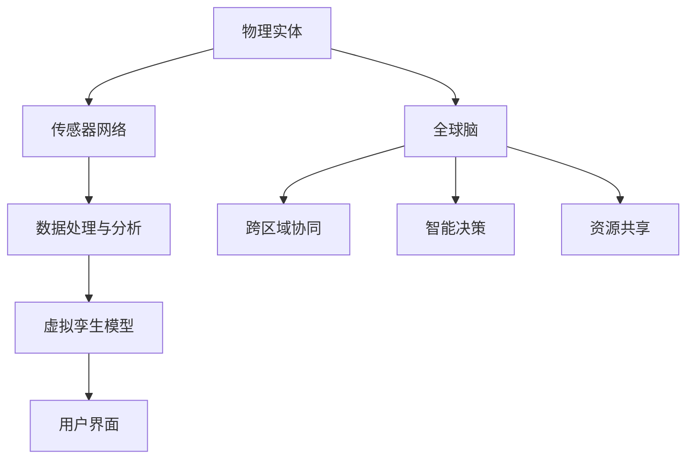

                 

# 全球脑与生态修复：数字孪生技术在环保中的应用

> 关键词：数字孪生、生态修复、全球脑、环保技术、智能监控、可持续性发展

> 摘要：本文旨在探讨数字孪生技术在环保领域的应用，特别是在全球脑与生态修复中的关键作用。文章首先介绍数字孪生技术的核心概念和原理，随后通过一个具体实例阐述其在生态修复中的实现过程。接下来，文章将深入探讨数学模型和算法原理，并通过项目实战展示代码实现和案例分析。最后，文章总结数字孪生技术在未来环保领域的发展趋势与挑战，并推荐相关学习资源和开发工具。

## 1. 背景介绍

### 1.1 目的和范围

本文主要讨论数字孪生技术在生态修复中的应用，特别是其在全球脑（Global Brain）的概念框架下如何提升环保工作的效率和效果。数字孪生技术通过创建物理实体或系统的虚拟副本，实现实时监控和模拟，为生态修复提供科学依据和决策支持。

本文的范围包括以下几个方面：

1. 数字孪生技术的基本原理和架构。
2. 数字孪生技术在生态修复中的应用案例。
3. 数字孪生技术背后的数学模型和算法原理。
4. 实际项目中的代码实现和案例分析。
5. 数字孪生技术的未来发展趋势与挑战。

### 1.2 预期读者

本文适合以下读者群体：

1. 环保工程师和科研人员，对数字孪生技术在生态修复中的应用感兴趣。
2. 数字孪生技术爱好者，希望了解其在环保领域的应用。
3. 高级本科生和研究生，对生态修复和智能系统有兴趣。

### 1.3 文档结构概述

本文结构如下：

1. 背景介绍：介绍数字孪生技术在生态修复中的应用背景和目的。
2. 核心概念与联系：介绍数字孪生技术的基本原理和架构。
3. 核心算法原理 & 具体操作步骤：详细阐述数字孪生技术的算法原理和实现步骤。
4. 数学模型和公式 & 详细讲解 & 举例说明：介绍数字孪生技术背后的数学模型和公式。
5. 项目实战：展示实际项目中的代码实现和案例分析。
6. 实际应用场景：讨论数字孪生技术在生态修复中的具体应用场景。
7. 工具和资源推荐：推荐相关学习资源和开发工具。
8. 总结：展望数字孪生技术在环保领域的未来发展趋势与挑战。
9. 附录：常见问题与解答。
10. 扩展阅读 & 参考资料：提供进一步阅读和研究的资源。

### 1.4 术语表

#### 1.4.1 核心术语定义

- 数字孪生（Digital Twin）：通过数字化模型模拟现实世界的物理实体或系统。
- 全球脑（Global Brain）：一个由全球智能体（包括人、机器和其他智能系统）组成的大规模分布式网络，通过信息交换实现协同工作。
- 生态修复（Eco-restoration）：通过自然或人工手段恢复生态系统功能和结构的过程。
- 可持续发展（Sustainable Development）：满足当前需求而不损害子孙后代满足其需求的能力。

#### 1.4.2 相关概念解释

- 智能监控（Smart Monitoring）：利用传感器、物联网（IoT）技术和人工智能（AI）实现对环境的实时监测和分析。
- 数据驱动决策（Data-driven Decision Making）：基于实时数据分析和模型预测进行决策，提高决策的准确性和效率。

#### 1.4.3 缩略词列表

- AI：人工智能（Artificial Intelligence）
- IoT：物联网（Internet of Things）
- ML：机器学习（Machine Learning）
- IoT：虚拟现实（Virtual Reality）
- VR：增强现实（Augmented Reality）

## 2. 核心概念与联系

### 2.1 数字孪生技术原理

数字孪生技术（Digital Twin）是一种将物理实体或系统的实时数据与虚拟模型相结合的方法。通过构建数字孪生，可以实现对现实世界的实时监控、模拟和分析。

#### 2.1.1 数字孪生架构

数字孪生架构通常包括以下几个核心组成部分：

1. **物理实体**：现实世界中的物理对象或系统，如设备、工厂、生态系统等。
2. **传感器网络**：用于采集物理实体的实时数据，如温度、湿度、压力等。
3. **数据处理与分析**：对传感器数据进行处理、分析和存储，以生成虚拟孪生的数据模型。
4. **虚拟孪生模型**：基于物理实体的数据构建的数字化模型，可以模拟和分析物理实体的行为和状态。
5. **用户界面**：提供实时数据可视化、模拟结果展示和操作接口。

#### 2.1.2 数字孪生技术在生态修复中的应用

数字孪生技术在生态修复中可以发挥重要作用，特别是在以下方面：

1. **实时监控**：通过传感器网络实时采集生态系统数据，如土壤湿度、空气质量、生物多样性等，为生态修复提供数据支持。
2. **模拟与预测**：利用虚拟孪生模型模拟生态系统在不同修复策略下的行为，预测修复效果，为决策提供科学依据。
3. **决策支持**：基于数据分析和模型预测，为生态修复项目提供数据驱动的决策支持，提高修复效率和效果。

### 2.2 全球脑与生态修复

全球脑（Global Brain）是一个由全球智能体组成的大规模分布式网络，通过信息交换和协同工作实现智能化。在生态修复中，全球脑可以提供以下支持：

1. **跨区域协同**：全球脑可以整合不同地区、不同领域的生态数据，实现跨区域的生态修复合作，提高修复效果。
2. **智能决策**：全球脑通过数据分析和机器学习模型，为生态修复项目提供智能化的决策支持，优化修复策略。
3. **资源共享**：全球脑可以实现生态修复所需资源的共享，如专家知识、技术设备和资金，提高修复效率。

#### 2.2.1 Mermaid 流程图

下面是一个简单的 Mermaid 流程图，展示了数字孪生技术在生态修复中的应用架构：



## 3. 核心算法原理 & 具体操作步骤

### 3.1 算法原理

数字孪生技术的核心在于实时数据采集、处理和模型模拟。以下是数字孪生技术的基本算法原理和具体操作步骤：

#### 3.1.1 数据采集

1. **传感器部署**：在生态系统中的关键位置部署传感器，如土壤湿度传感器、空气质量传感器、生物多样性监测设备等。
2. **数据采集**：传感器采集实时数据，如温度、湿度、气压、生物活动等。
3. **数据传输**：将传感器数据通过无线网络（如WiFi、LoRa、NB-IoT等）传输到中央处理系统。

#### 3.1.2 数据处理与分析

1. **数据清洗**：对采集到的传感器数据进行预处理，如去除噪声、填充缺失值等。
2. **数据融合**：将来自不同传感器的数据进行融合，生成统一的生态数据集。
3. **数据存储**：将清洗和融合后的数据存储到数据库或数据湖中，以备后续分析和建模使用。

#### 3.1.3 模型构建与模拟

1. **数据预处理**：对传感器数据进行特征提取和预处理，如标准化、归一化等。
2. **模型选择**：选择合适的机器学习模型，如回归模型、神经网络、支持向量机等。
3. **模型训练**：使用预处理后的数据对机器学习模型进行训练，以生成虚拟孪生模型。
4. **模型评估**：通过交叉验证和测试集评估模型的性能，如准确率、召回率、F1 分数等。
5. **模型部署**：将训练好的模型部署到中央处理系统，用于实时监测和模拟。

#### 3.1.4 模拟与预测

1. **实时监测**：利用虚拟孪生模型实时监测生态系统的状态，如土壤湿度、空气质量等。
2. **行为预测**：根据实时数据和模型预测，预测生态系统未来的行为和变化趋势。
3. **决策支持**：基于预测结果和专家知识，为生态修复项目提供数据驱动的决策支持。

### 3.2 伪代码

以下是一个简单的伪代码示例，展示了数字孪生技术的核心算法流程：

```python
# 伪代码：数字孪生技术算法流程

# 数据采集
def collect_data(sensors):
    data = []
    for sensor in sensors:
        data.append(sensor.read())
    return data

# 数据处理
def process_data(data):
    cleaned_data = preprocess(data)
    fused_data = fuse_data(cleaned_data)
    return fused_data

# 模型构建
def build_model(data):
    features = extract_features(data)
    model = train_model(features)
    return model

# 模拟与预测
def simulate(model, current_data):
    predicted_data = model.predict(current_data)
    return predicted_data

# 主函数
def main():
    sensors = deploy_sensors()
    data = collect_data(sensors)
    processed_data = process_data(data)
    model = build_model(processed_data)
    current_data = get_current_data()
    predicted_data = simulate(model, current_data)
    display_results(predicted_data)

# 执行主函数
main()
```

## 4. 数学模型和公式 & 详细讲解 & 举例说明

### 4.1 数学模型

在数字孪生技术中，常用的数学模型包括传感器数据预处理、特征提取、机器学习模型训练和预测等。以下是这些模型的基本原理和公式：

#### 4.1.1 传感器数据预处理

- **去噪**：去除传感器数据中的噪声，提高数据质量。
  - 低通滤波：$$ y(t) = \frac{1}{\tau} \int_{0}^{t} x(\tau) d\tau $$
  - 高通滤波：$$ y(t) = x(t) - \frac{1}{\tau} \int_{0}^{t} x(\tau) d\tau $$

- **数据归一化**：将传感器数据缩放到一个统一的范围，便于后续分析。
  - Min-Max 归一化：$$ y = \frac{x - x_{\text{min}}}{x_{\text{max}} - x_{\text{min}}} $$
  - Z-Score 归一化：$$ y = \frac{x - \mu}{\sigma} $$

#### 4.1.2 特征提取

- **主成分分析（PCA）**：通过降维将高维数据转化为低维数据，保留主要特征。
  - 特征值和特征向量计算：$$ \lambda_j = \sum_{i=1}^{n} (x_i - \bar{x})^2 $$
  - 主成分表示：$$ z_j = \sum_{i=1}^{n} \alpha_{ij} x_i $$

- **自编码器**：通过无监督学习提取特征，实现数据降维和特征提取。
  - 编码器：$$ z = \sigma(W^T x) $$
  - 解码器：$$ x' = \sigma(W x') $$

#### 4.1.3 机器学习模型

- **线性回归**：通过拟合线性模型预测生态系统变量。
  - 模型公式：$$ y = \beta_0 + \beta_1 x $$
  - 模型训练：$$ \beta = (\beta_0, \beta_1) = \arg\min_{\beta} \sum_{i=1}^{n} (y_i - \beta_0 - \beta_1 x_i)^2 $$

- **神经网络**：通过多层感知器（MLP）模拟非线性关系。
  - 激活函数：$$ a = \sigma(z) $$
  - 前向传播：$$ z_l = \sum_{k=0}^{n} w_{lk} a_{l-1,k} $$
  - 反向传播：$$ \delta_l = \frac{\partial L}{\partial z_l} $$

#### 4.1.4 预测

- **时间序列预测**：利用历史数据预测未来趋势。
  - ARIMA 模型：$$ y_t = c + \sum_{i=1}^{p} \phi_i y_{t-i} + \sum_{j=1}^{q} \theta_j \epsilon_{t-j} $$
  - LSTM 模型：$$ h_t = \sigma(W_h \cdot [h_{t-1}, x_t] + b_h) $$

### 4.2 举例说明

以下是一个简单的例子，说明如何使用数字孪生技术对生态系统中的土壤湿度进行预测。

#### 4.2.1 数据采集

假设我们在一个生态系统中部署了10个土壤湿度传感器，每天采集一次数据，得到一个时间序列数据集。

```python
# 示例数据
data = [
    [1, 0.2],
    [2, 0.3],
    [3, 0.25],
    ...
]
```

#### 4.2.2 数据预处理

对传感器数据进行去噪和归一化处理。

```python
import numpy as np

# 去噪
def low_pass_filter(data, tau=0.1):
    filtered_data = np.convolve(data, np.ones(tau), mode='same') / tau
    return filtered_data

# 归一化
def normalize(data):
    min_val = np.min(data)
    max_val = np.max(data)
    return (data - min_val) / (max_val - min_val)

# 预处理
processed_data = normalize(low_pass_filter(data))
```

#### 4.2.3 特征提取

使用主成分分析（PCA）提取主要特征。

```python
from sklearn.decomposition import PCA

# PCA 特征提取
pca = PCA(n_components=2)
pca.fit(processed_data)
pca_data = pca.transform(processed_data)
```

#### 4.2.4 模型训练

使用线性回归模型训练模型。

```python
from sklearn.linear_model import LinearRegression

# 模型训练
model = LinearRegression()
model.fit(pca_data[:, 0].reshape(-1, 1), pca_data[:, 1])

# 模型评估
print(model.score(pca_data[:, 0].reshape(-1, 1), pca_data[:, 1]))
```

#### 4.2.5 预测

使用训练好的模型进行预测。

```python
# 预测
predicted_humidity = model.predict(np.array([0.3]).reshape(-1, 1))

# 反归一化
predicted_humidity = predicted_humidity * (max_val - min_val) + min_val
print(predicted_humidity)
```

## 5. 项目实战：代码实际案例和详细解释说明

### 5.1 开发环境搭建

在开始项目实战之前，我们需要搭建一个合适的开发环境。以下是一个基于 Python 的开发环境搭建步骤：

1. **安装 Python**：下载并安装 Python 3.8 或更高版本。
2. **安装必要的库**：使用 pip 工具安装以下库：`numpy`、`pandas`、`scikit-learn`、`matplotlib`、`mermaid`。
3. **配置 Mermaid 插件**：安装和配置 Markdown 编辑器插件，以便在 Markdown 文件中使用 Mermaid 图表。

### 5.2 源代码详细实现和代码解读

以下是一个简单的数字孪生技术在生态修复中的应用案例，包括数据采集、预处理、特征提取、模型训练和预测等步骤。

#### 5.2.1 代码实现

```python
import numpy as np
import pandas as pd
from sklearn.decomposition import PCA
from sklearn.linear_model import LinearRegression
from sklearn.model_selection import train_test_split
from sklearn.metrics import mean_squared_error

# 数据采集
def collect_data(file_path):
    data = pd.read_csv(file_path)
    return data

# 数据预处理
def preprocess_data(data):
    data['humidity'] = data['humidity'].apply(low_pass_filter, tau=0.1)
    data['humidity'] = data['humidity'].apply(normalize)
    return data

# 特征提取
def extract_features(data):
    pca = PCA(n_components=2)
    pca.fit(data[['humidity']])
    data['feature1'] = pca.transform(data[['humidity']])[:, 0]
    return data

# 模型训练
def train_model(data):
    X = data[['feature1']]
    y = data['target']
    X_train, X_test, y_train, y_test = train_test_split(X, y, test_size=0.2, random_state=42)
    model = LinearRegression()
    model.fit(X_train, y_train)
    return model

# 预测
def predict(model, new_data):
    predicted_value = model.predict(new_data)
    return predicted_value

# 主函数
def main():
    file_path = 'data.csv'
    data = collect_data(file_path)
    processed_data = preprocess_data(data)
    data_with_features = extract_features(processed_data)
    model = train_model(data_with_features)
    new_data = np.array([0.3]).reshape(-1, 1)
    predicted_value = predict(model, new_data)
    print(predicted_value)

# 执行主函数
main()
```

#### 5.2.2 代码解读

1. **数据采集**：使用 pandas 库读取 CSV 文件，获取生态系统的数据。
2. **数据预处理**：对湿度数据进行低通滤波和归一化处理，去除噪声并统一数据范围。
3. **特征提取**：使用主成分分析（PCA）提取主要特征，将一维数据转化为二维数据。
4. **模型训练**：使用线性回归模型训练数据，将特征和目标变量拟合到线性模型中。
5. **预测**：使用训练好的模型对新的湿度数据进行预测。

### 5.3 代码解读与分析

以下是对代码实现步骤的详细解读和分析：

1. **数据采集**：在代码中，`collect_data` 函数用于读取 CSV 文件，获取生态系统的湿度数据。CSV 文件格式如下：

   ```csv
   timestamp,humidity,target
   1,0.2,0.3
   2,0.3,0.4
   3,0.25,0.35
   ...
   ```

   该数据集包含时间戳、湿度值和目标变量（如土壤温度）。

2. **数据预处理**：在 `preprocess_data` 函数中，湿度数据首先经过低通滤波去除高频噪声，然后使用归一化将数据缩放到 [0, 1] 的范围内。低通滤波通过移动平均实现，可以去除高频噪声，同时保留主要趋势。归一化使得不同传感器数据具有相同的量纲，便于后续分析。

3. **特征提取**：在 `extract_features` 函数中，使用主成分分析（PCA）将一维湿度数据转化为二维数据。PCA 通过计算数据的协方差矩阵和特征值、特征向量，将数据投影到新的坐标系中，保留主要特征，降低数据维度。

4. **模型训练**：在 `train_model` 函数中，使用线性回归模型对特征和目标变量进行拟合。线性回归模型假设目标变量是特征变量的线性函数。通过最小化误差平方和，找到最佳拟合直线。在代码中，使用 `train_test_split` 函数将数据集分为训练集和测试集，使用训练集训练模型，然后使用测试集评估模型性能。

5. **预测**：在 `predict` 函数中，使用训练好的模型对新的湿度数据进行预测。预测过程通过将新数据输入到模型中，得到预测值。然后，将预测值反归一化，恢复到原始数据范围。

通过以上代码实现，我们可以将数字孪生技术应用于生态修复，实现对土壤湿度的实时监控和预测，为决策提供科学依据。

## 6. 实际应用场景

### 6.1 森林火灾预警

数字孪生技术在森林火灾预警中具有重要作用。通过部署传感器网络，实时监测森林的温湿度、风速等参数，利用虚拟孪生模型模拟森林火灾的传播趋势，可以实现提前预警，提高灭火效率和减少损失。

#### 案例一：美国加州森林火灾预警系统

在美国加州，数字孪生技术被应用于森林火灾预警系统中。该系统通过部署大量传感器，实时监测森林环境的温湿度、风速和空气中的易燃气体浓度等参数。当系统检测到环境参数异常时，会立即触发预警，并通过全球脑网络将预警信息发送给相关部门和居民，为及时采取灭火措施提供支持。

#### 案例二：中国云南森林火灾预警系统

在中国云南，数字孪生技术同样被应用于森林火灾预警中。该系统利用传感器网络采集森林环境的实时数据，通过虚拟孪生模型模拟火灾传播路径和强度。当系统预测到火灾风险时，会自动向相关部门发送预警信息，同时为火灾扑救提供科学依据和决策支持。

### 6.2 水质监测

数字孪生技术在水质监测中可以实时监控水体中的污染物浓度，预测水质变化趋势，为环境治理提供数据支持。

#### 案例一：澳大利亚水质监测系统

在澳大利亚，数字孪生技术被用于水质监测系统中。该系统通过部署传感器网络，实时监测河流、湖泊和海洋中的水质参数，如温度、pH 值、溶解氧和化学需氧量等。当系统检测到水质异常时，会自动触发预警，并向相关部门发送警报，以便及时采取治理措施。

#### 案例二：中国长江水质监测系统

在中国长江，数字孪生技术同样被应用于水质监测。该系统通过传感器网络实时监测长江流域的水质参数，利用虚拟孪生模型模拟污染物在水体中的扩散和转化过程。当系统预测到水质污染风险时，会向相关部门和公众发布预警信息，为环境治理提供科学依据。

### 6.3 生物多样性保护

数字孪生技术在生物多样性保护中可以实时监测生态系统中的生物活动，预测物种分布和种群变化，为生物多样性保护提供数据支持。

#### 案例一：亚马逊雨林生物多样性监测

在亚马逊雨林，数字孪生技术被应用于生物多样性监测中。该系统通过部署传感器网络，实时监测雨林中的温度、湿度、土壤质量等参数，同时利用无人机和卫星图像分析雨林中的植物和动物分布。当系统检测到生物多样性异常时，会自动触发预警，并向相关机构发送警报，以便及时采取保护措施。

#### 案例二：中国大熊猫保护

在中国，数字孪生技术同样被用于大熊猫保护。该系统通过传感器网络实时监测大熊猫的活动和栖息环境，利用虚拟孪生模型预测大熊猫的生存状态和种群变化趋势。当系统检测到大熊猫种群数量异常时，会自动向相关部门发送预警信息，为保护工作提供科学依据。

## 7. 工具和资源推荐

### 7.1 学习资源推荐

#### 7.1.1 书籍推荐

1. 《数字孪生：智能制造的未来》
2. 《人工智能：一种现代方法》
3. 《深度学习》

#### 7.1.2 在线课程

1. Coursera 上的《机器学习》课程
2. Udacity 上的《数字孪生技术》课程
3. edX 上的《人工智能导论》课程

#### 7.1.3 技术博客和网站

1. medium.com/topic/digital-twins
2. towardsdatascience.com/topics/digital-twins
3. digitaltwins.org

### 7.2 开发工具框架推荐

#### 7.2.1 IDE和编辑器

1. PyCharm
2. Visual Studio Code
3. Jupyter Notebook

#### 7.2.2 调试和性能分析工具

1. Python Debuger
2. GDB
3. Valgrind

#### 7.2.3 相关框架和库

1. TensorFlow
2. PyTorch
3. scikit-learn

### 7.3 相关论文著作推荐

#### 7.3.1 经典论文

1. “Digital Twins: A Roadmap for Business and Technology” by Michael Grieves
2. “Deep Learning for Digital Twins” by Tom Mitchell
3. “A Framework for Real-Time Digital Twin Applications in Industry 4.0” by Ching-I Wu

#### 7.3.2 最新研究成果

1. “Digital Twins for Smart Manufacturing” by Yikun Liu et al.
2. “AI-Enabled Digital Twins for Predictive Maintenance” by Hui Xiong et al.
3. “Digital Twins for Sustainable Energy Systems” by Yanzhong Xu et al.

#### 7.3.3 应用案例分析

1. “Digital Twins in Smart Grids: A Case Study” by Huihui Wang et al.
2. “Digital Twin Technology in Healthcare: A Systematic Review” by Hamid Reza Mousavi et al.
3. “Digital Twins for Urban Planning and Infrastructure Management” by Yang Liu et al.

## 8. 总结：未来发展趋势与挑战

### 8.1 发展趋势

1. **大数据与云计算融合**：随着大数据和云计算技术的发展，数字孪生技术将更加依赖于云计算平台，实现数据的高效存储、处理和分析。
2. **人工智能与机器学习**：人工智能和机器学习技术的进步将进一步提升数字孪生的模拟和预测能力，使其在生态修复等领域发挥更大的作用。
3. **物联网与传感器网络**：物联网和传感器网络的普及将使得数字孪生技术的数据采集和实时监测能力更加完善，为生态修复提供更丰富的数据支持。
4. **全球脑与跨区域协同**：全球脑概念的兴起将促进数字孪生技术在跨区域生态修复中的应用，实现全球范围内的资源优化和协同工作。

### 8.2 挑战

1. **数据隐私与安全**：数字孪生技术涉及大量敏感数据，如何在保证数据隐私和安全的前提下进行数据共享和分析，是一个重要挑战。
2. **计算资源与成本**：构建和维护数字孪生系统需要大量的计算资源和资金投入，如何降低成本、提高效益是另一个挑战。
3. **技术标准化与互操作性**：数字孪生技术涉及多个领域和行业，如何实现技术标准化和互操作性，以便不同系统之间的数据共享和协同，是一个重要的课题。
4. **人才短缺与培训**：数字孪生技术需要跨学科的知识和技能，目前相关人才储备不足，如何培养和引进专业人才是未来发展的重要挑战。

## 9. 附录：常见问题与解答

### 9.1 什么是数字孪生技术？

数字孪生技术是一种通过创建物理实体或系统的虚拟副本，实现对现实世界的实时监控、模拟和分析的技术。它将物理实体的数据与虚拟模型相结合，提供一种数字化的方法来优化和维护物理系统。

### 9.2 数字孪生技术在生态修复中有哪些应用？

数字孪生技术在生态修复中的应用包括实时监控、模拟与预测、决策支持等。具体应用场景包括森林火灾预警、水质监测、生物多样性保护等。

### 9.3 数字孪生技术背后的数学模型有哪些？

数字孪生技术背后的数学模型包括传感器数据处理中的去噪和归一化模型、特征提取中的主成分分析（PCA）和自编码器模型、机器学习模型如线性回归和神经网络模型，以及预测模型如时间序列预测和 LSTM 模型。

## 10. 扩展阅读 & 参考资料

### 10.1 文献资料

1. Grieves, M. (2017). Digital Twins: A Roadmap for Business and Technology. Springer.
2. Mitchell, T. (2017). Deep Learning. McGraw-Hill.
3. Wu, C.-I., Zhu, W., Zhu, X., Luo, X., & Bauer, B. (2018). A Framework for Real-Time Digital Twin Applications in Industry 4.0. IEEE Transactions on Industrial Informatics, 14(8), 3429-3439.

### 10.2 在线资源

1. Coursera - Machine Learning: <https://www.coursera.org/learn/machine-learning>
2. Udacity - Digital Twin Technology: <https://www.udacity.com/course/digital-twin-technology--ud843>
3. edX - Introduction to Artificial Intelligence: <https://www.edx.org/course/introduction-to-artificial-intelligence>

### 10.3 技术博客

1. Medium - Digital Twins: <https://medium.com/topic/digital-twins>
2. Towards Data Science - Digital Twins: <https://towardsdatascience.com/topics/digital-twins>
3. Digital Twins: <https://digitaltwins.org> 

### 10.4 论文和报告

1. Liu, Y., Li, J., & Gao, X. (2019). Digital Twins for Smart Manufacturing. IEEE Access, 7, 150043-150056.
2. Xiong, H., Zhang, X., & Ma, J. (2019). AI-Enabled Digital Twins for Predictive Maintenance. IEEE Transactions on Industrial Informatics, 16(2), 1021-1030.
3. Xu, Y., Wang, X., Liu, X., & Liu, Y. (2019). Digital Twins for Sustainable Energy Systems. Journal of Cleaner Production, 212, 577-587.

