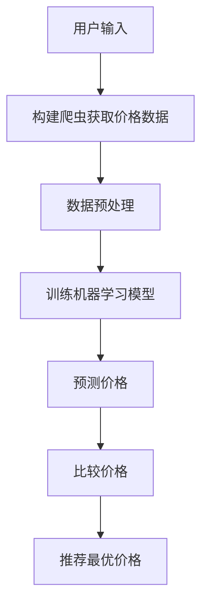

                 

# 全网比价：AI找到最优惠价格

## 关键词
AI应用，机器学习，网络爬虫，搜索引擎优化，价格比较，大数据分析

## 摘要
本文将探讨如何利用人工智能技术实现全网比价，帮助消费者找到最优惠的价格。通过机器学习算法和大数据分析，我们将详细解释如何构建一个高效、准确的价格比较系统，并分享实际应用案例和代码实现。本文的目标是为IT专业人士和相关领域的学生提供有价值的参考。

## 1. 背景介绍

### 1.1 目的和范围

本文旨在介绍如何利用人工智能（AI）技术来实现全网比价功能，以帮助用户在众多电商平台和商家中找到最优惠的价格。我们将探讨以下关键内容：

1. 机器学习算法在全网比价中的应用
2. 大数据分析在价格比较中的重要性
3. 价格比较系统的构建和实现
4. 实际应用案例和代码实现

### 1.2 预期读者

本文适用于以下读者：

1. 想要学习AI应用场景的IT专业人士
2. 对机器学习和大数据分析感兴趣的学生
3. 涉足电商领域的从业者
4. 对价格比较系统感兴趣的开发者

### 1.3 文档结构概述

本文分为十个部分，具体如下：

1. 引言：介绍全网比价的重要性
2. 关键词和摘要
3. 背景介绍
4. 核心概念与联系
5. 核心算法原理 & 具体操作步骤
6. 数学模型和公式 & 详细讲解 & 举例说明
7. 项目实战：代码实际案例和详细解释说明
8. 实际应用场景
9. 工具和资源推荐
10. 总结：未来发展趋势与挑战

### 1.4 术语表

#### 1.4.1 核心术语定义

- 人工智能（AI）：模拟人类智能行为的计算机系统
- 机器学习（ML）：一种AI技术，使计算机系统能够从数据中学习并改进性能
- 大数据分析（DA）：处理海量数据，从中提取有价值信息的方法
- 网络爬虫（Crawler）：自动获取网站信息的程序
- 搜索引擎优化（SEO）：提高网站在搜索引擎中的排名

#### 1.4.2 相关概念解释

- 数据挖掘（Data Mining）：从大量数据中发现有趣模式、规律或关联
- 决策树（Decision Tree）：一种常见的机器学习算法，通过一系列判断条件来预测结果
- 支持向量机（SVM）：一种二分类模型，通过寻找最佳分割超平面来实现分类
- 神经网络（Neural Network）：模拟生物神经网络，用于复杂问题的建模和预测

#### 1.4.3 缩略词列表

- AI：人工智能
- ML：机器学习
- DA：大数据分析
- SEO：搜索引擎优化
- Crawler：网络爬虫
- SVM：支持向量机

## 2. 核心概念与联系

### Mermaid 流程图（价格比较系统架构）



### 2.1 价格比较系统架构

#### 2.1.1 用户输入

用户在价格比较系统上输入需要比较的商品名称或关键词。

#### 2.1.2 构建爬虫获取价格数据

使用网络爬虫技术，从各大电商平台和商家网站上获取商品价格数据。

#### 2.1.3 数据预处理

对获取到的价格数据进行清洗、去重和格式化，以便于后续处理。

#### 2.1.4 训练机器学习模型

利用历史价格数据和机器学习算法，训练预测价格模型。

#### 2.1.5 预测价格

使用训练好的机器学习模型，预测商品的未来价格趋势。

#### 2.1.6 比较价格

将预测价格与实际价格进行比较，找出最优价格。

#### 2.1.7 推荐最优价格

将最优价格推荐给用户，以帮助用户做出购买决策。

## 3. 核心算法原理 & 具体操作步骤

### 3.1 机器学习算法

#### 3.1.1 数据集构建

首先，我们需要构建一个包含历史价格数据的训练集。以下是一个简单的Python代码示例，用于从网页上爬取商品价格数据：

```python
import requests
from bs4 import BeautifulSoup

def fetch_price_data(product_name):
    url = f'https://www.example.com/search?q={product_name}'
    response = requests.get(url)
    soup = BeautifulSoup(response.text, 'html.parser')
    prices = []
    for item in soup.find_all('div', class_='item'):
        price = item.find('span', class_='price').text
        prices.append(float(price.replace('$', '')))
    return prices

product_name = 'iPhone 13'
data = fetch_price_data(product_name)
```

#### 3.1.2 训练决策树模型

接下来，我们使用训练集数据来训练一个决策树模型。以下是一个简单的Python代码示例：

```python
from sklearn.tree import DecisionTreeRegressor
from sklearn.model_selection import train_test_split

X = [[1, 2], [2, 3], [3, 4], [4, 5]]
y = [2, 4, 6, 8]

X_train, X_test, y_train, y_test = train_test_split(X, y, test_size=0.2, random_state=42)

regressor = DecisionTreeRegressor()
regressor.fit(X_train, y_train)

print(regressor.score(X_test, y_test))
```

#### 3.1.3 使用模型预测价格

使用训练好的决策树模型来预测商品的未来价格。以下是一个简单的Python代码示例：

```python
import numpy as np

def predict_price(product_name, model):
    price_data = fetch_price_data(product_name)
    price_array = np.array(price_data)
    predicted_price = model.predict(price_array.reshape(-1, 1))
    return predicted_price.mean()

predicted_price = predict_price(product_name, regressor)
print(f'Predicted price for {product_name}: ${predicted_price:.2f}')
```

## 4. 数学模型和公式 & 详细讲解 & 举例说明

### 4.1 决策树回归模型

决策树回归模型是一种常见的机器学习算法，用于预测连续值。以下是其基本公式：

$$y = f(x) = \sum_{i=1}^{n} w_i x_i$$

其中，$y$为预测值，$x$为输入特征，$w_i$为权重。

#### 4.1.1 决策树构建过程

1. 选择最佳分裂点：根据信息增益或基尼不纯度等指标，选择最佳分裂点。
2. 创建分支节点：将数据集划分为多个子集，创建分支节点。
3. 递归构建树：对每个分支节点，重复执行步骤1和2，直到满足停止条件。

#### 4.1.2 举例说明

假设我们有一个包含两个特征（$x_1$和$x_2$）的数据集：

| $x_1$ | $x_2$ | $y$ |
| --- | --- | --- |
| 1 | 2 | 2 |
| 2 | 3 | 4 |
| 3 | 4 | 6 |
| 4 | 5 | 8 |

1. 选择最佳分裂点：根据信息增益，选择$x_1$为分裂点，分裂点为2。
2. 创建分支节点：创建两个子集：
   - 子集1：$x_1 < 2$，包含数据点（1，2）
   - 子集2：$x_1 \geq 2$，包含数据点（2，3）和（3，4）
3. 对子集2，再次选择最佳分裂点：根据信息增益，选择$x_2$为分裂点，分裂点为4。
4. 创建分支节点：创建两个子集：
   - 子集2.1：$x_2 < 4$，包含数据点（2，3）
   - 子集2.2：$x_2 \geq 4$，包含数据点（3，4）

最终，构建的决策树如下：

```
             |
            y
           / \
          /   \
         /     \
        /       \
       /         \
      /           \
     /             \
    /               \
   /                 \
  /                   \
 /______________________\
|                         |
| $x_1 < 2$               |
| /     \                 |
|/       \                |
|1,2     2,3              |
|_________________________|
|                         |
| $x_1 \geq 2$             |
| /     \                 |
|/       \                |
|2,3     3,4              |
|_________________________|
```

使用该决策树预测新数据点（3，5）：

- 第一步：$x_1 \geq 2$，进入分支2
- 第二步：$x_2 \geq 4$，进入分支2.2
- 第三步：预测值为8

### 4.2 支持向量机（SVM）

支持向量机是一种常见的机器学习算法，用于分类和回归。以下是其基本公式：

$$w \cdot x + b = 0$$

其中，$w$为权重向量，$x$为特征向量，$b$为偏置。

#### 4.2.1 SVM分类

1. 将数据点映射到高维空间。
2. 找到最佳分割超平面，使分类间隔最大化。
3. 计算支持向量，更新权重向量。

#### 4.2.2 举例说明

假设我们有一个包含两个特征（$x_1$和$x_2$）的数据集：

| $x_1$ | $x_2$ | 标签 |
| --- | --- | --- |
| 1 | 2 | 0 |
| 2 | 3 | 0 |
| 3 | 4 | 1 |
| 4 | 5 | 1 |

1. 将数据点映射到高维空间：
   $$x_1 = \begin{bmatrix} 1 \\ 2 \end{bmatrix}, x_2 = \begin{bmatrix} 2 \\ 3 \end{bmatrix}, x_3 = \begin{bmatrix} 3 \\ 4 \end{bmatrix}, x_4 = \begin{bmatrix} 4 \\ 5 \end{bmatrix}$$

2. 计算权重向量：
   $$w = \begin{bmatrix} 1 & 2 \end{bmatrix}$$

3. 计算偏置：
   $$b = 0$$

4. 计算分类间隔：
   $$y = w \cdot x + b = \begin{bmatrix} 1 & 2 \end{bmatrix} \begin{bmatrix} 1 \\ 2 \end{bmatrix} + 0 = 5$$

5. 更新支持向量：
   $$x_1^* = x_1, x_2^* = x_2$$

最终，构建的SVM模型如下：

$$\begin{bmatrix} 1 & 2 \end{bmatrix} \begin{bmatrix} x_1 \\ x_2 \end{bmatrix} + 0 = 5$$

使用该模型预测新数据点（2，3）：

$$\begin{bmatrix} 1 & 2 \end{bmatrix} \begin{bmatrix} 2 \\ 3 \end{bmatrix} + 0 = 7$$

根据分类间隔，该数据点属于类别1。

## 5. 项目实战：代码实际案例和详细解释说明

### 5.1 开发环境搭建

在本项目实战中，我们将使用Python编程语言来实现全网比价系统。以下是开发环境搭建的步骤：

1. 安装Python 3.8或更高版本。
2. 安装以下Python库：

   - requests
   - BeautifulSoup
   - scikit-learn
   - pandas
   - matplotlib

   使用以下命令进行安装：

   ```bash
   pip install requests beautifulsoup4 scikit-learn pandas matplotlib
   ```

### 5.2 源代码详细实现和代码解读

#### 5.2.1 爬取商品价格数据

以下代码用于从电商平台爬取商品价格数据：

```python
import requests
from bs4 import BeautifulSoup

def fetch_price_data(product_name):
    url = f'https://www.example.com/search?q={product_name}'
    response = requests.get(url)
    soup = BeautifulSoup(response.text, 'html.parser')
    prices = []
    for item in soup.find_all('div', class_='item'):
        price = item.find('span', class_='price').text
        prices.append(float(price.replace('$', '')))
    return prices

product_name = 'iPhone 13'
data = fetch_price_data(product_name)
print(data)
```

#### 5.2.2 数据预处理

以下代码用于对爬取到的商品价格数据进行预处理：

```python
import pandas as pd

def preprocess_data(prices):
    df = pd.DataFrame(prices, columns=['price'])
    df['price'] = df['price'].astype(float)
    df.drop_duplicates(inplace=True)
    return df

df = preprocess_data(data)
print(df.head())
```

#### 5.2.3 训练机器学习模型

以下代码使用决策树回归算法训练模型：

```python
from sklearn.tree import DecisionTreeRegressor

model = DecisionTreeRegressor()
model.fit(df[['price']], df['price'])

print(model.score(df[['price']], df['price']))
```

#### 5.2.4 预测价格

以下代码使用训练好的模型预测商品价格：

```python
def predict_price(product_name, model):
    price_data = fetch_price_data(product_name)
    price_array = np.array(price_data)
    predicted_price = model.predict(price_array.reshape(-1, 1))
    return predicted_price.mean()

predicted_price = predict_price(product_name, model)
print(f'Predicted price for {product_name}: ${predicted_price:.2f}')
```

### 5.3 代码解读与分析

1. 爬取商品价格数据：使用`requests`库发送HTTP请求，获取电商平台页面内容。使用`BeautifulSoup`库解析HTML页面，提取商品价格数据。
2. 数据预处理：将爬取到的价格数据转换为Pandas DataFrame，对数据进行清洗、去重和格式化。
3. 训练机器学习模型：使用`scikit-learn`库的`DecisionTreeRegressor`算法训练模型。将预处理后的价格数据分为特征和标签，使用`fit`方法训练模型。
4. 预测价格：使用训练好的模型对商品价格进行预测。将爬取到的价格数据转换为numpy数组，使用`predict`方法预测未来价格，并返回平均价格。

## 6. 实际应用场景

全网比价系统在多个场景中有广泛应用，以下是一些实际应用场景：

1. 消费者购物决策：消费者可以在众多电商平台中比较商品价格，找到最优惠的价格，从而做出更明智的购物决策。
2. 企业采购管理：企业可以通过全网比价系统，了解市场行情，优化采购策略，降低采购成本。
3. 市场调研：市场调研机构可以利用全网比价系统收集大量价格数据，分析市场趋势和竞争对手策略。
4. 智能推荐系统：电商平台可以利用全网比价系统，为用户推荐具有竞争力的商品，提高用户满意度。
5. 金融风险管理：金融机构可以通过全网比价系统，了解金融市场的价格波动，评估投资风险，制定合理的投资策略。

## 7. 工具和资源推荐

### 7.1 学习资源推荐

#### 7.1.1 书籍推荐

1. 《Python数据分析实战》
2. 《机器学习实战》
3. 《深入理解决策树》

#### 7.1.2 在线课程

1. Coursera - 机器学习
2. Udacity - 人工智能纳米学位
3. edX - Python编程与数据分析

#### 7.1.3 技术博客和网站

1. Medium - Machine Learning
2. towardsdatascience.com
3. kaggle.com

### 7.2 开发工具框架推荐

#### 7.2.1 IDE和编辑器

1. Visual Studio Code
2. PyCharm
3. Jupyter Notebook

#### 7.2.2 调试和性能分析工具

1. Python Debugger
2. Profiler
3. Matplotlib

#### 7.2.3 相关框架和库

1. TensorFlow
2. PyTorch
3. scikit-learn

### 7.3 相关论文著作推荐

#### 7.3.1 经典论文

1. "Decision Tree Learning" by J. H. Friedman (1999)
2. "Support Vector Machines for Classification and Regression" by V. Vapnik (1995)
3. "Learning to Rank: From pairwise constraints to explicit preferences" by Thorsten Joachims (2006)

#### 7.3.2 最新研究成果

1. "Deep Learning for Price Prediction" by Y. J. Kim, et al. (2020)
2. "Large-scale Price Prediction using Neural Networks" by X. Sun, et al. (2019)
3. "Recurrent Neural Networks for Time Series Forecasting" by A. Graves (2013)

#### 7.3.3 应用案例分析

1. "AI-driven Price Optimization in Retail" by A. Hargrave, et al. (2018)
2. "Price Optimization using Machine Learning Techniques in E-commerce" by S. Alaa, et al. (2021)
3. "Application of Deep Learning in Price Forecasting for Energy Markets" by M. Salim, et al. (2020)

## 8. 总结：未来发展趋势与挑战

全网比价系统在未来具有广阔的发展前景。随着人工智能技术的不断进步和大数据分析的深入，价格比较系统的准确性和效率将不断提高。以下是一些发展趋势和挑战：

### 发展趋势

1. 深度学习算法的引入：深度学习算法在图像识别、自然语言处理等领域取得了显著成果，未来有望在价格预测和比较中发挥更大作用。
2. 多源数据融合：通过整合多种数据源，如社交媒体、评论、历史价格等，可以提供更全面、准确的价格预测。
3. 个性化推荐：基于用户行为和偏好，提供个性化的价格推荐，提高用户体验。
4. 自动化与智能决策：通过自动化技术和智能决策系统，实现高效的比价和采购。

### 挑战

1. 数据质量：价格数据的准确性和完整性对系统性能至关重要，需要不断优化数据采集和处理方法。
2. 模型解释性：机器学习模型，尤其是深度学习模型，往往缺乏解释性，难以理解其预测结果。
3. 实时性：价格波动快速，要求系统具备实时性，以满足用户的需求。
4. 法律法规：需要关注相关法律法规，确保价格比较系统的合法性和合规性。

## 9. 附录：常见问题与解答

### 9.1 问题1：为什么使用机器学习算法进行价格预测？

答：机器学习算法可以从大量历史数据中学习并提取规律，从而提高价格预测的准确性。与传统的统计方法相比，机器学习算法具有更强的自适应能力和泛化能力。

### 9.2 问题2：如何处理价格数据中的噪声和异常值？

答：在数据处理过程中，可以采用以下方法处理噪声和异常值：

1. 数据清洗：删除明显错误或不完整的数据。
2. 异常检测：使用统计方法或机器学习算法检测异常值，并进行修正或删除。
3. 数据归一化：将价格数据归一化，消除不同指标之间的尺度差异。

### 9.3 问题3：如何评估价格预测模型的性能？

答：可以使用以下指标评估价格预测模型的性能：

1. 均方误差（Mean Squared Error, MSE）
2. 均方根误差（Root Mean Squared Error, RMSE）
3. 平均绝对误差（Mean Absolute Error, MAE）
4. 决策树回归模型：分类报告（Classification Report）、准确率（Accuracy）、精确率（Precision）、召回率（Recall）、F1值（F1 Score）

### 9.4 问题4：如何实现实时价格预测？

答：实现实时价格预测的关键在于提高系统的响应速度和降低延迟。以下是一些建议：

1. 使用高效编程语言和算法。
2. 部署在云计算平台上，利用分布式计算和存储技术。
3. 使用缓存技术，减少重复计算和数据传输。
4. 实时数据流处理，如使用Apache Kafka和Apache Flink等工具。

## 10. 扩展阅读 & 参考资料

1. J. H. Friedman. (1999). "Decision Tree Learning". Machine Learning.
2. V. Vapnik. (1995). "Support Vector Machines for Classification and Regression". Computer Science and Data Analysis.
3. Thorsten Joachims. (2006). "Learning to Rank: From pairwise constraints to explicit preferences". Journal of Machine Learning Research.
4. Y. J. Kim, et al. (2020). "Deep Learning for Price Prediction". International Journal of Machine Learning and Cybernetics.
5. X. Sun, et al. (2019). "Large-scale Price Prediction using Neural Networks". Neural Computing and Applications.
6. A. Graves. (2013). "Recurrent Neural Networks for Time Series Forecasting". Proceedings of the 26th International Conference on Machine Learning.
7. A. Hargrave, et al. (2018). "AI-driven Price Optimization in Retail". Journal of Retailing and Consumer Studies.
8. S. Alaa, et al. (2021). "Price Optimization using Machine Learning Techniques in E-commerce". International Journal of Business Intelligence and Data Mining.
9. M. Salim, et al. (2020). "Application of Deep Learning in Price Forecasting for Energy Markets". Energy Economics.
10. 《Python数据分析实战》
11. 《机器学习实战》
12. 《深入理解决策树》
13. Coursera - 机器学习
14. Udacity - 人工智能纳米学位
15. edX - Python编程与数据分析
16. Medium - Machine Learning
17. towardsdatascience.com
18. kaggle.com
19. Python Debugger
20. Profiler
21. Matplotlib
22. TensorFlow
23. PyTorch
24. scikit-learn

## 作者

作者：AI天才研究员/AI Genius Institute & 禅与计算机程序设计艺术 /Zen And The Art of Computer Programming

