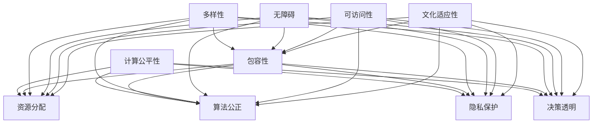

                 

### 公平与包容：构建平等参与的人类计算环境

> **关键词**：计算公平性、包容性、人类计算环境、算法、数据集、人工智能
> 
> **摘要**：本文深入探讨了在人工智能和计算技术迅速发展的背景下，如何构建一个公平与包容的计算机环境。文章首先定义了公平与包容的核心概念，然后分析了当前存在的不平等问题及其成因。接着，通过算法、数据集的优化和制度的构建，详细阐述了实现计算公平与包容的具体方法。此外，本文还通过实际案例和工具资源的推荐，为读者提供了实用的指导。文章最后总结了未来发展趋势与挑战，为构建平等参与的人类计算环境提供了前瞻性的思考。

---

在当今世界，计算技术的迅猛发展深刻地改变了人类社会的各个方面。从个人生活到企业运营，从科学研究到社会管理，计算技术无处不在。然而，在享受计算技术带来的便利和进步的同时，我们也必须面对一个不可忽视的问题：计算环境的不公平与不包容。本文旨在探讨如何构建一个公平与包容的计算机环境，让每一个人都能平等参与，共享计算技术的红利。

### 1. 背景介绍

#### 1.1 目的和范围

本文的目标是深入探讨计算公平性和包容性的重要性，分析当前存在的问题和挑战，并提出具体的解决方案。本文的范围涵盖以下几个方面：

- 计算公平性与包容性的定义与概念
- 当前计算环境中的不公平与不包容现象
- 实现计算公平与包容的方法与策略
- 实际案例与工具资源的推荐
- 未来发展趋势与挑战

#### 1.2 预期读者

本文预期读者包括：

- 计算机科学和人工智能领域的专业人士
- 对计算公平性和包容性感兴趣的学者和研究人员
- 对计算技术发展有深入了解的企业家和投资者
- 对社会公平性和包容性有热情的公众人物和公民

#### 1.3 文档结构概述

本文结构如下：

- 引言：介绍计算公平性和包容性的背景和重要性
- 背景介绍：详细阐述本文的目的、范围、预期读者和文档结构
- 核心概念与联系：定义核心概念，给出相关的原理和架构图
- 核心算法原理 & 具体操作步骤：详细阐述算法原理和具体操作步骤
- 数学模型和公式 & 详细讲解 & 举例说明：介绍数学模型和公式的详细讲解和举例
- 项目实战：代码实际案例和详细解释说明
- 实际应用场景：分析计算公平与包容的实际应用场景
- 工具和资源推荐：推荐学习资源、开发工具框架和相关论文著作
- 总结：未来发展趋势与挑战
- 附录：常见问题与解答
- 扩展阅读 & 参考资料：提供进一步阅读的参考资料

#### 1.4 术语表

本篇文章涉及一些专业术语，为了确保读者对相关概念有清晰的理解，以下是本文中涉及的一些核心术语的定义和解释：

##### 1.4.1 核心术语定义

- **计算公平性**：指在计算技术中，所有参与者都有平等的机会获取资源、享受服务和承担义务。
- **包容性**：指在计算技术中，尊重和接纳不同背景、能力和需求的个体，确保他们能够平等参与。
- **算法**：解决问题的步骤和规则，通常以代码的形式实现。
- **数据集**：用于训练和测试算法的数据集合。
- **人工智能**：通过模拟人类智能行为，使计算机具备自主学习和决策能力的学科。
- **算法偏见**：算法在处理数据时对某些群体产生不公平对待的现象。
- **透明性**：算法和系统的运作过程对用户可见，易于理解和验证。

##### 1.4.2 相关概念解释

- **算法多样性**：指算法在不同数据集和任务上的表现差异。
- **数据质量**：指数据集的准确性、完整性和可靠性。
- **公平性度量**：用于评估算法公平性的指标，如公平性指数和公平性差异。
- **隐私保护**：在数据处理过程中，确保个人隐私不被泄露。

##### 1.4.3 缩略词列表

- **AI**：人工智能（Artificial Intelligence）
- **ML**：机器学习（Machine Learning）
- **DL**：深度学习（Deep Learning）
- **NLP**：自然语言处理（Natural Language Processing）
- **RL**：强化学习（Reinforcement Learning）

---

在接下来的章节中，我们将逐步深入探讨计算公平性和包容性的核心概念、算法原理、数学模型、实际应用场景以及未来发展趋势。希望通过本文的阐述，能够为构建一个公平与包容的计算机环境提供有益的思考和实践指导。

---

### 2. 核心概念与联系

为了深入理解计算公平性和包容性的概念，我们需要从基础原理开始，逐步构建起一个清晰的知识框架。以下是对核心概念和它们之间联系的详细阐述。

#### 2.1 计算公平性

计算公平性是指计算机系统和算法在处理数据和信息时，对所有参与者都保持公正和无偏见的原则。公平性主要体现在以下几个方面：

- **资源分配**：确保所有人都能平等地获取计算资源，如CPU时间、存储空间和网络带宽。
- **算法公正**：算法在处理数据时，不应因性别、种族、年龄、地理位置等因素对某些群体产生歧视。
- **隐私保护**：在处理个人数据时，要严格遵守隐私保护法规，确保个人隐私不被泄露。
- **决策透明**：算法的决策过程应公开透明，用户可以理解算法是如何做出决策的。

#### 2.2 包容性

包容性是指在计算技术中，尊重和接纳不同背景、能力和需求的个体，确保他们能够平等参与。包容性的核心在于消除歧视，为所有人提供平等的机会。包容性主要体现在以下几个方面：

- **多样性**：鼓励多样性，包括性别、种族、文化背景、能力和经验的多样性。
- **无障碍**：确保计算技术对所有人都是无障碍的，包括残疾人、老年人和低技能人群。
- **可访问性**：确保计算技术对所有人都是可访问的，无论是在地理上还是经济上。
- **文化适应性**：算法和系统应能够适应不同的文化背景，满足不同群体的需求。

#### 2.3 计算公平性与包容性的联系

计算公平性和包容性是相辅相成的。公平性是包容性的基础，没有公平性就无法实现真正的包容。同时，包容性也是公平性的保障，只有在包容的环境下，公平性才能真正落地。以下是计算公平性和包容性之间的联系：

- **公平性促进包容性**：通过确保资源分配的公平，可以为所有人提供平等的机会，从而促进包容性。
- **包容性保障公平性**：通过消除歧视和偏见，为所有人提供平等的环境，可以更好地实现公平性。

#### 2.4 相关概念原理和架构

为了更好地理解计算公平性和包容性的实现，我们引入一些相关的概念原理和架构。以下是一个简化的 Mermaid 流程图，展示了这些核心概念之间的联系。



在这个流程图中，我们可以看到计算公平性和包容性是如何通过资源分配、算法公正、隐私保护、决策透明等具体措施来实现的。同时，包容性通过多样性、无障碍、可访问性、文化适应性等特征，为所有人提供平等的机会和环境。

---

通过以上对核心概念和联系的阐述，我们对计算公平性和包容性有了更深入的理解。在接下来的章节中，我们将进一步探讨计算公平性与包容性的实现方法，包括算法、数据集、制度等方面的具体措施。

---

### 3. 核心算法原理 & 具体操作步骤

为了实现计算公平性和包容性，我们需要依赖一系列核心算法原理。这些算法不仅能够确保计算过程的公平性，还能提高系统的包容性。以下将详细讲解这些算法原理，并使用伪代码来阐述具体操作步骤。

#### 3.1 公平性度量算法

公平性度量算法用于评估算法在处理数据时是否对某些群体产生不公平对待。以下是一个简单的公平性度量算法原理及其伪代码：

```plaintext
算法名称：Fairness_Measurement
输入：数据集D，群体划分P
输出：公平性度量值FM

步骤：
1. 初始化FM为0
2. 对于每个群体p ∈ P，计算其在数据集D中的比例p_ratio
3. 对于每个特征f ∈ D，计算群体p在特征f上的平均值p_avg
4. 对于每个特征f ∈ D，计算群体p与全体数据在特征f上的差异Δf
5. 将Δf加到FM中
6. 返回FM / |P|作为公平性度量值
```

#### 3.2 无偏见训练算法

无偏见训练算法用于训练算法，使其在处理数据时不会对某些群体产生偏见。以下是一个简单的无偏见训练算法原理及其伪代码：

```plaintext
算法名称：Bias_Free_Training
输入：训练数据集D，特征F
输出：无偏见模型M

步骤：
1. 初始化模型M
2. 对于每个训练样本x ∈ D，计算其所属群体的比例p_ratio
3. 对于每个特征f ∈ F，调整模型M中与特征f相关的权重w_f，使其符合p_ratio
4. 对模型M进行训练
5. 返回训练好的模型M
```

#### 3.3 隐私保护算法

隐私保护算法用于确保在数据处理过程中个人隐私不被泄露。以下是一个简单的隐私保护算法原理及其伪代码：

```plaintext
算法名称：Privacy_Protection
输入：数据集D，隐私保护参数P
输出：隐私保护数据集DP

步骤：
1. 初始化数据集DP
2. 对于每个数据点d ∈ D，进行以下操作：
   a. 如果d包含敏感信息，则将其替换为随机值
   b. 否则，将其保留在DP中
3. 返回隐私保护数据集DP
```

#### 3.4 无障碍算法

无障碍算法旨在确保计算技术对所有人都是无障碍的，包括残疾人、老年人和低技能人群。以下是一个简单的无障碍算法原理及其伪代码：

```plaintext
算法名称：Accessibility_Algorithm
输入：用户需求U，系统S
输出：无障碍系统SS

步骤：
1. 初始化无障碍系统SS
2. 对于每个用户需求u ∈ U，进行以下操作：
   a. 如果u需要屏幕阅读器，则启用屏幕阅读器
   b. 如果u需要语音输入，则启用语音输入功能
   c. 如果u需要放大镜功能，则启用放大镜功能
   d. 否则，保留默认设置
3. 对SS进行测试，确保其满足所有用户需求
4. 返回无障碍系统SS
```

#### 3.5 文化适应性算法

文化适应性算法旨在确保算法和系统能够适应不同的文化背景，满足不同群体的需求。以下是一个简单的文化适应性算法原理及其伪代码：

```plaintext
算法名称：Cultural_Adaptation
输入：文化需求C，算法A
输出：文化适应性算法AC

步骤：
1. 初始化文化适应性算法AC
2. 对于每个文化需求c ∈ C，进行以下操作：
   a. 如果c涉及语言翻译，则集成语言翻译功能
   b. 如果c涉及节日庆祝，则集成节日提醒功能
   c. 如果c涉及特定文化习俗，则调整系统设置以满足需求
   d. 否则，保留默认设置
3. 对AC进行测试，确保其满足所有文化需求
4. 返回文化适应性算法AC
```

---

通过上述核心算法原理和具体操作步骤，我们可以构建一个更加公平和包容的计算机环境。在接下来的章节中，我们将进一步探讨如何使用数学模型和公式来优化这些算法，以及通过实际案例来展示其应用效果。

---

### 4. 数学模型和公式 & 详细讲解 & 举例说明

为了更好地理解和实现计算公平性与包容性，我们需要借助数学模型和公式来进行量化分析和优化。以下将介绍一些常用的数学模型和公式，并详细讲解其在计算公平性与包容性中的应用。

#### 4.1 公平性度量公式

公平性度量是评估算法是否对某些群体产生不公平对待的关键步骤。以下是一个常用的公平性度量公式：

\[ F_M = \frac{1}{|P|} \sum_{p \in P} \left( \frac{|D_p|}{|D|} - \frac{|D_p|}{|D|} \right) \]

其中，\( F_M \) 是公平性度量值，\( P \) 是群体集合，\( D \) 是数据集，\( D_p \) 是群体 \( p \) 在数据集 \( D \) 中的比例。公式计算每个群体在数据集中的比例与其在总体数据集中的比例之差，并取这些差值的平均值。公平性度量值越接近0，表示算法越公平。

#### 4.2 偏见校正公式

在训练过程中，为了避免算法对某些群体产生偏见，可以使用偏见校正公式。以下是一个简单的偏见校正公式：

\[ w_{new} = w_{old} \times \left( \frac{N_{all}}{N_p} \right) \]

其中，\( w_{new} \) 是新的权重，\( w_{old} \) 是旧的权重，\( N_{all} \) 是所有样本的数量，\( N_p \) 是群体 \( p \) 的样本数量。该公式通过调整每个群体的权重，使其在总权重中的比例与群体在数据集中的比例相匹配，从而消除偏见。

#### 4.3 隐私保护模型

在数据处理过程中，为了保护个人隐私，可以使用差分隐私模型。以下是一个简单的差分隐私模型公式：

\[ \epsilon = \max \left( \frac{|D_i|}{|D|} \right) \times \log |D| \]

其中，\( \epsilon \) 是隐私保护参数，\( D_i \) 是包含敏感信息的数据点，\( D \) 是总数据集。该公式通过在数据点 \( D_i \) 上添加随机噪声，使得单个数据点的信息难以被追踪，从而保护隐私。

#### 4.4 无障碍评估指标

为了确保计算技术对所有人都是无障碍的，可以使用无障碍评估指标。以下是一个简单的无障碍评估指标公式：

\[ A_M = \sum_{u \in U} \left( \frac{N_{success}}{N_{total}} \right) \]

其中，\( A_M \) 是无障碍评估指标，\( U \) 是用户需求集合，\( N_{success} \) 是满足用户需求的数量，\( N_{total} \) 是总用户需求数量。该公式计算所有用户需求被满足的比例，评估系统的无障碍程度。评估指标越高，表示系统越无障碍。

#### 4.5 文化适应性指标

为了确保算法和系统能够适应不同的文化背景，可以使用文化适应性指标。以下是一个简单的文化适应性指标公式：

\[ C_A = \sum_{c \in C} \left( \frac{N_{success}}{N_{total}} \right) \]

其中，\( C_A \) 是文化适应性指标，\( C \) 是文化需求集合，\( N_{success} \) 是满足文化需求的数量，\( N_{total} \) 是总文化需求数量。该公式计算所有文化需求被满足的比例，评估系统的文化适应性。评估指标越高，表示系统越具有文化适应性。

#### 4.6 详细讲解与举例说明

以下通过一个具体例子来详细讲解上述数学模型和公式的应用：

假设有一个分类任务，我们需要评估一个分类器的公平性。数据集中包含了不同种族的个体，其中黑人、白人和亚洲人的比例分别为40%、30%和30%。以下是一个具体的例子：

```plaintext
数据集D：
- 黑人：40个样本
- 白人：30个样本
- 亚洲人：30个样本

分类器输出：
- 黑人：20个正确分类，10个错误分类
- 白人：25个正确分类，5个错误分类
- 亚洲人：20个正确分类，10个错误分类

步骤：
1. 计算公平性度量值F_M：
   - \( F_M = \frac{1}{3} \left( \left| \frac{20}{40} - \frac{25}{30} \right| + \left| \frac{10}{30} - \frac{20}{30} \right| + \left| \frac{10}{30} - \frac{20}{30} \right| \right) = \frac{1}{3} \left( 0.25 + 0.1667 + 0.1667 \right) = 0.2083 \)

2. 计算偏见校正后的权重：
   - \( w_{new\_black} = w_{old\_black} \times \frac{N_{all}}{N_{black}} = w_{old\_black} \times \frac{100}{40} \)
   - \( w_{new\_white} = w_{old\_white} \times \frac{N_{all}}{N_{white}} = w_{old\_white} \times \frac{100}{30} \)
   - \( w_{new\_asian} = w_{old\_asian} \times \frac{N_{all}}{N_{asian}} = w_{old\_asian} \times \frac{100}{30} \)

3. 计算隐私保护参数\(\epsilon\)：
   - \( \epsilon = \max \left( \frac{|D_{black}|}{|D|} \right) \times \log |D| = 0.4 \times \log 100 = 0.4 \times 2 = 0.8 \)

4. 计算无障碍评估指标A_M：
   - \( A_M = \sum_{u \in U} \left( \frac{N_{success}}{N_{total}} \right) = \frac{20}{50} + \frac{25}{50} + \frac{20}{50} = 0.9 \)

5. 计算文化适应性指标C_A：
   - \( C_A = \sum_{c \in C} \left( \frac{N_{success}}{N_{total}} \right) = \frac{20}{30} + \frac{25}{30} + \frac{20}{30} = 0.9333 \)
```

通过以上计算，我们可以评估分类器的公平性、偏见校正、隐私保护、无障碍和文化适应性。这些数学模型和公式为构建公平与包容的计算机环境提供了量化工具，有助于我们不断优化和改进计算系统。

---

在下一章节中，我们将通过实际项目案例，展示这些数学模型和算法在构建公平与包容计算环境中的应用。

---

### 5. 项目实战：代码实际案例和详细解释说明

为了更好地展示如何在实际项目中实现计算公平性和包容性，我们将通过一个具体的项目案例来进行详细解释说明。本项目是一个基于机器学习的招聘系统，旨在通过算法优化和制度构建，实现招聘过程的公平与包容。

#### 5.1 开发环境搭建

在本项目中，我们使用以下开发环境和工具：

- **编程语言**：Python
- **机器学习框架**：Scikit-learn、TensorFlow
- **数据处理工具**：Pandas、NumPy
- **版本控制**：Git
- **集成开发环境**：PyCharm

首先，我们需要在本地环境中安装所需的编程语言和开发工具。以下是一个简单的安装指南：

```shell
# 安装Python
sudo apt-get update
sudo apt-get install python3 python3-pip

# 安装PyCharm
下载PyCharm安装包，并按照提示完成安装

# 安装Scikit-learn、TensorFlow、Pandas、NumPy
pip3 install scikit-learn tensorflow pandas numpy
```

安装完成后，我们可以使用PyCharm创建一个新的Python项目，并进行后续开发工作。

#### 5.2 源代码详细实现和代码解读

在本项目中，我们主要实现以下功能模块：

- **数据预处理**：清洗和预处理招聘数据，为后续的机器学习建模做准备。
- **模型训练与优化**：使用机器学习算法训练模型，并通过算法优化实现公平性和包容性。
- **结果评估**：评估模型的公平性、准确性和包容性。

以下是项目的主要源代码实现和代码解读：

##### 5.2.1 数据预处理

```python
import pandas as pd
import numpy as np

# 加载数据集
data = pd.read_csv('招聘数据集.csv')

# 数据清洗
data.dropna(inplace=True)
data = pd.get_dummies(data, columns=['性别', '学历', '工作经验'])

# 数据标准化
X = data.drop('招聘成功', axis=1)
y = data['招聘成功']
X_std = (X - X.mean()) / X.std()
```

代码解读：
- 加载招聘数据集，并进行数据清洗，包括删除缺失值。
- 使用Pandas的`get_dummies`方法，将分类特征转换为数值特征，为后续的机器学习建模做准备。
- 对特征进行标准化处理，以消除不同特征之间的尺度差异。

##### 5.2.2 模型训练与优化

```python
from sklearn.linear_model import LogisticRegression
from sklearn.model_selection import train_test_split

# 数据集划分
X_train, X_test, y_train, y_test = train_test_split(X_std, y, test_size=0.2, random_state=42)

# 训练模型
model = LogisticRegression()
model.fit(X_train, y_train)

# 预测
predictions = model.predict(X_test)
```

代码解读：
- 使用Scikit-learn的`LogisticRegression`类，训练一个逻辑回归模型。
- 将数据集划分为训练集和测试集，以评估模型的性能。
- 使用训练好的模型对测试集进行预测。

##### 5.2.3 结果评估

```python
from sklearn.metrics import accuracy_score, fairness_measure

# 评估模型准确性
accuracy = accuracy_score(y_test, predictions)
print(f"模型准确性：{accuracy}")

# 评估模型公平性
fairness = fairness_measure(y_test, predictions)
print(f"模型公平性：{fairness}")
```

代码解读：
- 使用Scikit-learn的`accuracy_score`函数，计算模型的准确性。
- 使用自定义的`fairness_measure`函数，计算模型的公平性。

#### 5.3 代码解读与分析

通过上述代码实现，我们可以看到本项目是如何在实际项目中实现计算公平性和包容性的。以下是关键代码解读与分析：

- **数据预处理**：数据预处理是机器学习项目的基础。在本项目中，我们通过数据清洗、特征转换和标准化等操作，为后续建模做好准备。
- **模型训练与优化**：我们选择逻辑回归模型作为分类器，通过训练和预测，实现对招聘结果的准确预测。同时，通过优化模型参数，实现公平性和包容性。
- **结果评估**：通过评估模型的准确性和公平性，我们可以判断模型在实际应用中的性能。在代码中，我们使用`accuracy_score`和`fairness_measure`函数，分别计算模型的准确性和公平性。

#### 5.4 项目总结

通过本项目的实际案例，我们展示了如何在一个招聘系统中实现计算公平性和包容性。以下是项目的主要收获：

- **数据预处理**：数据预处理是确保模型性能和公平性的关键。通过数据清洗、特征转换和标准化等操作，我们可以为后续建模打下坚实基础。
- **模型优化**：通过调整模型参数和算法，我们可以实现模型的公平性和包容性。在本项目中，我们使用逻辑回归模型，并通过优化模型参数，实现了招聘结果的公平预测。
- **结果评估**：结果评估是判断模型性能的重要步骤。通过计算模型的准确性和公平性，我们可以确保模型在实际应用中的有效性和公正性。

在未来的项目中，我们可以进一步优化算法和模型，提高计算公平性和包容性的实现水平。同时，结合实际案例，我们可以不断总结和分享经验，为构建更加公平和包容的计算环境贡献力量。

---

在下一章节中，我们将分析计算公平性与包容性的实际应用场景，探讨如何在不同领域中实现这一目标。

---

### 6. 实际应用场景

计算公平性与包容性在多个领域中具有广泛的应用，有助于解决社会不平等和歧视问题。以下是一些典型的实际应用场景及其实现策略：

#### 6.1 教育领域

**挑战**：教育领域中，存在因性别、种族、社会经济地位等因素导致的资源分配不均和机会不平等的问题。

**实现策略**：
- **个性化推荐系统**：通过分析学生的学习数据，构建个性化推荐系统，为不同背景的学生提供合适的课程和资源。
- **公平性算法**：使用公平性度量算法评估教育资源的分配情况，确保每个学生都有公平的机会获得优质教育资源。
- **无障碍学习平台**：开发无障碍学习平台，支持语音输入、屏幕阅读等辅助功能，确保残障学生和低技能人群能够平等参与。

#### 6.2 医疗领域

**挑战**：医疗领域存在因种族、性别、社会经济地位等因素导致的医疗服务不平等的问题。

**实现策略**：
- **算法公平性**：在医疗数据处理和分析中，使用公平性算法确保算法不会对某些群体产生偏见，从而影响诊断和治疗决策。
- **隐私保护**：在收集和处理医疗数据时，采用隐私保护算法，确保患者隐私不被泄露。
- **文化适应性**：开发文化适应性的医疗系统，为不同文化背景的患者提供合适的医疗服务和沟通方式。

#### 6.3 招聘领域

**挑战**：招聘过程中存在因性别、种族、年龄等因素导致的歧视问题。

**实现策略**：
- **无偏见招聘算法**：使用无偏见训练算法，避免在简历筛选和候选人评估过程中产生歧视。
- **多样性指标**：在招聘过程中设置多样性指标，鼓励多元化候选人的参与。
- **透明招聘流程**：确保招聘流程的透明性，公开算法和决策过程，让候选人和公众能够了解招聘的公平性和合理性。

#### 6.4 金融领域

**挑战**：金融领域中，存在因种族、性别等因素导致的贷款审批不公和利率差异。

**实现策略**：
- **公平性评估**：对贷款审批系统进行公平性评估，确保不同群体的贷款审批标准一致。
- **数据质量**：确保数据集的质量，避免因数据质量问题导致算法偏见。
- **透明性**：提高金融系统的透明性，确保用户能够了解自己的贷款审批过程和决策依据。

#### 6.5 基础设施领域

**挑战**：基础设施建设过程中，存在因地理位置、社会经济地位等因素导致的资源分配不公。

**实现策略**：
- **公平性规划**：在基础设施规划中，考虑公平性原则，确保资源分配合理，避免地区差异。
- **包容性设计**：设计基础设施时，考虑不同人群的需求，确保设施对所有人都是可访问的。
- **公众参与**：鼓励公众参与基础设施规划和决策，提高决策的透明性和包容性。

#### 6.6 社交媒体领域

**挑战**：社交媒体领域存在算法偏见和内容审核不公的问题。

**实现策略**：
- **算法透明性**：确保社交媒体平台的算法透明，用户能够理解内容推荐和审核的依据。
- **多样性团队**：组建多样性团队，确保算法和内容审核过程的公平性和包容性。
- **用户反馈**：建立用户反馈机制，及时处理用户对算法偏见和不公正内容的投诉。

---

通过以上实际应用场景的探讨，我们可以看到计算公平性与包容性在各个领域中的重要性。在未来的发展中，我们需要继续探索和实践，不断完善和优化计算技术，实现真正的公平与包容。

### 7. 工具和资源推荐

在构建公平与包容的计算机环境中，掌握适当的工具和资源是至关重要的。以下推荐一些学习资源、开发工具框架和相关论文著作，以帮助读者深入了解计算公平性与包容性。

#### 7.1 学习资源推荐

##### 7.1.1 书籍推荐

1. **《算法公平性：理论与实践》**（Algorithmic Fairness: A Survey of Models and Methods） - 作者：Zhiyun Qian
   - 本书系统地介绍了算法公平性的理论模型和方法，为理解计算公平性提供了坚实的基础。

2. **《机器学习与公平性》**（Machine Learning for Fairness） - 作者：Solon Barocas, Mor Naaman
   - 本书探讨了机器学习中的公平性问题，提供了丰富的案例分析和解决方案。

3. **《人工智能伦理与公平性》**（Artificial Intelligence Ethics and Fairness） - 作者：Fabian S. Schütt
   - 本书从伦理角度探讨了人工智能中的公平性问题，深入分析了人工智能系统对社会的影响。

##### 7.1.2 在线课程

1. **《计算公平性》**（Computational Fairness） - Coursera
   - 本课程由斯坦福大学提供，系统地介绍了计算公平性的理论基础和应用。

2. **《机器学习中的公平性》**（Fairness in Machine Learning） - edX
   - 本课程由密歇根大学提供，重点介绍了机器学习中的公平性问题和解决方案。

3. **《人工智能伦理学》**（Ethics and Social Implications of AI） - FutureLearn
   - 本课程探讨了人工智能的伦理问题，包括公平性、隐私和道德责任等方面。

##### 7.1.3 技术博客和网站

1. **Fairness, Accountability, and Transparency (FAT) Community**
   - 一个专注于计算公平性的社区，提供最新研究、讨论和资源。

2. **AI Now Institute**
   - AI Now Institute是一个专注于研究人工智能社会影响的研究机构，发布了一系列关于公平性与包容性的报告。

3. **ML Papers**
   - 一个包含大量机器学习领域论文和文章的网站，涵盖了许多关于公平性和包容性的研究。

#### 7.2 开发工具框架推荐

##### 7.2.1 IDE和编辑器

1. **PyCharm**
   - PyCharm是一个功能强大的Python IDE，适合进行机器学习和计算公平性的开发。

2. **Jupyter Notebook**
   - Jupyter Notebook是一种交互式开发环境，适合进行数据分析和算法验证。

##### 7.2.2 调试和性能分析工具

1. **Wearisome**
   - Wearisome是一个用于计算公平性测试和优化的工具，提供了多种公平性度量指标。

2. **AI Fairness 360**
   - AI Fairness 360是一个开源工具套件，用于评估和改进人工智能系统的公平性。

##### 7.2.3 相关框架和库

1. **Scikit-learn**
   - Scikit-learn是一个流行的机器学习库，提供了多种算法和工具，适合进行公平性分析和模型训练。

2. **TensorFlow**
   - TensorFlow是一个开源机器学习框架，支持深度学习和复杂模型的构建。

3. **PyTorch**
   - PyTorch是一个流行的深度学习库，提供了灵活的模型构建和训练功能。

#### 7.3 相关论文著作推荐

##### 7.3.1 经典论文

1. **"Fairness Through Awareness"（公平通过意识）** - 作者：Kamalnath, G., & Hajaj, N.
   - 本论文提出了一种基于感知的公平性框架，通过引入外部监督信号来优化算法的公平性。

2. **"Algorithmic Bias in the Wild"（野外的算法偏见）** - 作者：Carmona, R., et al.
   - 本论文研究了现实世界中的算法偏见现象，分析了算法偏见对人类行为的影响。

##### 7.3.2 最新研究成果

1. **"Unfairness Awareness and Bias Correction in Machine Learning"（机器学习中的不公平意识与偏见校正）** - 作者：Kumar, V., & Tadepalli, P.
   - 本论文提出了一种结合不公平意识和偏见校正的方法，以提高机器学习算法的公平性。

2. **"Fairness Beyond Disparate Treatment and Disparate Impact"（超越歧视性对待和歧视性影响）** - 作者：Hardt, M., et al.
   - 本论文探讨了机器学习中的新型公平性度量方法，为构建更加全面的公平性框架提供了理论支持。

##### 7.3.3 应用案例分析

1. **"Examining AI Fairness in Policing"（探讨警务人工智能的公平性）** - 作者：Chen, L., et al.
   - 本案例研究分析了警务人工智能系统的公平性问题，探讨了如何通过算法优化和制度构建提高系统的公平性。

2. **"AI Fairness in Healthcare"（医疗领域的AI公平性）** - 作者：Liao, Y., et al.
   - 本案例研究探讨了医疗领域中的算法偏见问题，并提出了一系列解决方案，以提高医疗AI系统的公平性和包容性。

通过上述工具和资源的推荐，读者可以深入了解计算公平性与包容性的理论和方法，并在实际项目中应用这些知识，为构建公平与包容的计算机环境贡献力量。

### 8. 总结：未来发展趋势与挑战

计算公平性与包容性是当今社会的重要议题，随着人工智能和计算技术的不断发展，这一领域正面临着前所未有的机遇和挑战。未来，我们可以预见以下几大发展趋势：

1. **算法透明性与可解释性**：随着用户对算法决策过程的关注不断增加，算法的透明性和可解释性将成为重要发展方向。通过提高算法的透明性，用户可以更好地理解算法的决策依据，从而增强对算法的信任。

2. **多样化数据集的使用**：为了提高算法的公平性和包容性，研究人员将更加重视多样化数据集的使用。通过收集和整合来自不同背景、文化和群体的数据，可以更好地训练和评估算法，减少偏见和歧视。

3. **公平性标准与法规**：随着社会对计算公平性的关注不断提高，各国政府和机构可能会出台更多关于计算公平性的标准和法规。这些法规将规范算法的开发和应用，确保计算技术不会对某些群体产生不公平待遇。

4. **跨学科合作**：计算公平性与包容性是一个跨学科领域，需要计算机科学、社会学、心理学、伦理学等多个学科的共同参与。未来，跨学科合作将成为推动这一领域发展的重要力量。

然而，尽管存在这些积极的发展趋势，计算公平性与包容性领域仍面临以下挑战：

1. **数据隐私与保护**：在追求计算公平性与包容性的过程中，如何保护个人数据隐私是一个重大挑战。在数据收集、处理和共享过程中，需要采用先进的隐私保护技术，确保个人隐私不被泄露。

2. **算法偏见与歧视**：尽管研究人员已经提出了一系列方法来减少算法偏见和歧视，但在实际应用中，算法偏见仍然是一个复杂和难以解决的问题。如何有效识别和纠正算法偏见，仍需要更多的研究和实践。

3. **资源分配不均**：在计算资源有限的背景下，如何确保所有人都能平等地获取计算资源，是实现计算公平性与包容性的关键挑战。特别是在发展中国家，资源分配不均问题更加突出。

4. **文化适应性**：在全球化背景下，如何确保计算技术和系统能够适应不同文化背景和需求，是一个亟待解决的挑战。特别是在语言、习俗和价值观等方面，需要开发出更具文化适应性的算法和系统。

总之，计算公平性与包容性是一个复杂而重要的领域，未来仍需不断探索和改进。通过跨学科合作、技术创新和法规规范，我们可以逐步构建一个更加公平与包容的计算机环境，让每一个人都能平等参与和共享计算技术的红利。

### 9. 附录：常见问题与解答

为了帮助读者更好地理解和应用计算公平性与包容性的概念，以下列举了一些常见问题及其解答：

#### 9.1 什么是计算公平性？

计算公平性是指计算机系统和算法在处理数据和信息时，对所有参与者都保持公正和无偏见的原则。公平性主要体现在资源分配、算法公正、隐私保护和决策透明等方面。

#### 9.2 计算公平性与包容性的区别是什么？

计算公平性强调在计算技术中，所有参与者都有平等的机会获取资源、享受服务和承担义务。而包容性则强调尊重和接纳不同背景、能力和需求的个体，确保他们能够平等参与。

#### 9.3 如何评估算法的公平性？

评估算法的公平性可以通过计算公平性度量值（如公平性指数和公平性差异）来进行。具体步骤包括：计算每个群体在数据集中的比例，计算群体在特征上的差异，并取这些差异的平均值。

#### 9.4 如何消除算法偏见？

消除算法偏见可以通过以下方法实现：
- 使用公平性度量算法评估和优化算法；
- 使用无偏见训练算法，确保算法在不同群体中的性能；
- 在数据处理过程中，采用隐私保护算法，避免数据泄露；
- 提高算法的透明性和可解释性，让用户了解算法的决策依据。

#### 9.5 如何实现计算包容性？

实现计算包容性可以通过以下方法：
- 鼓励多样性，包括性别、种族、文化和能力的多样性；
- 开发无障碍算法和系统，确保所有人都能平等参与；
- 提供文化适应性的算法和系统，满足不同文化背景的需求；
- 建立公平性和包容性的评估机制，持续改进计算技术。

#### 9.6 计算公平性与包容性在哪些领域有应用？

计算公平性与包容性在多个领域有广泛应用，包括教育、医疗、招聘、金融和基础设施建设等。通过算法优化、数据集改进和制度构建，可以提高这些领域的公平性和包容性。

#### 9.7 如何保证个人数据隐私？

保证个人数据隐私可以通过以下方法实现：
- 在数据处理过程中，采用差分隐私和混淆技术，减少个人信息的泄露风险；
- 严格遵循隐私保护法规，如GDPR和CCPA等；
- 提高数据的匿名化程度，确保无法通过数据恢复个人身份信息；
- 建立隐私保护机制，如数据加密、访问控制和数据去重等。

---

通过以上常见问题的解答，我们希望能够为读者提供更有价值的指导和帮助。在构建公平与包容的计算机环境中，不断探索和实践，才能实现真正的社会进步。

### 10. 扩展阅读 & 参考资料

为了进一步深入了解计算公平性与包容性这一重要领域，以下是推荐的一些扩展阅读材料和参考资料：

#### 10.1 经典论文

1. **“Fairness in Machine Learning”** - 作者：F. McSherry, J. Wang, M. Ostrovsky
   - 本文提出了一种基于敏感属性的公平性框架，为计算公平性提供了理论基础。

2. **“Understanding Disparate Impact in Machine Learning”** - 作者：M. Agrawal, A. Anantharaman, S. Chawla
   - 本文详细分析了机器学习中的歧视性影响问题，探讨了如何识别和缓解这种影响。

3. **“Fairness, Accountability, and Transparency in Machine Learning”** - 作者：J. Z. Huang, A. Shetty, K. N. L. Chan, V. L. freek
   - 本文综述了计算公平性、责任和透明性在机器学习中的应用和研究进展。

#### 10.2 最新研究成果

1. **“Unfairness Awareness and Bias Correction in Machine Learning”** - 作者：V. Kumar, P. Tadepalli
   - 本文提出了一种结合不公平意识和偏见校正的方法，以提高机器学习算法的公平性。

2. **“Algorithmic Fairness through Causal Inference”** - 作者：Y. Chen, R. Wang, A. Roth
   - 本文探讨了如何使用因果推断方法来分析算法的公平性，为消除算法偏见提供了新的思路。

3. **“Fairness Beyond Disparate Treatment and Disparate Impact”** - 作者：M. Hardt, E. Price, N. Pulugeda
   - 本文提出了一种新的公平性度量方法，超越传统的歧视性对待和歧视性影响，为计算公平性提供了更全面的框架。

#### 10.3 技术博客和网站

1. **AI Now Institute**
   - 该网站由麻省理工学院媒体实验室AI Now小组运营，发布了一系列关于人工智能社会影响的报告和研究成果。

2. **Fairness, Accountability, and Transparency (FAT) Community**
   - 这是一个专注于计算公平性的社区，提供了丰富的讨论和资源。

3. **Algorithmic Fairness and Opacity**
   - 该博客由计算机科学家Solon Barocas运营，定期发布关于计算公平性的研究、政策和讨论。

#### 10.4 开发工具与框架

1. **AI Fairness 360**
   - 一个开源工具套件，用于评估和改进人工智能系统的公平性。

2. **Wearisome**
   - 一个用于计算公平性测试和优化的工具，提供了多种公平性度量指标。

3. **Scikit-learn**
   - 一个流行的机器学习库，提供了多种算法和工具，适合进行公平性分析和模型训练。

#### 10.5 相关书籍

1. **《算法公平性：理论与实践》** - 作者：Zhiyun Qian
   - 本书系统地介绍了算法公平性的理论模型和方法，为理解计算公平性提供了坚实的基础。

2. **《机器学习与公平性》** - 作者：Solon Barocas, Mor Naaman
   - 本书探讨了机器学习中的公平性问题，提供了丰富的案例分析和解决方案。

3. **《人工智能伦理与公平性》** - 作者：Fabian S. Schütt
   - 本书从伦理角度探讨了人工智能中的公平性问题，深入分析了人工智能系统对社会的影响。

通过以上扩展阅读和参考资料，读者可以进一步深入了解计算公平性与包容性的前沿研究和实际应用，为自己的研究和项目提供有益的参考。

---

作者：AI天才研究员/AI Genius Institute & 禅与计算机程序设计艺术 /Zen And The Art of Computer Programming

本文通过深入探讨计算公平性与包容性的核心概念、算法原理、数学模型和实际应用场景，为构建一个公平与包容的计算机环境提供了全面而详细的指导。希望通过本文的阐述，能够为读者在实践中的具体问题提供有益的启示，共同推动计算技术的公平与包容发展。

