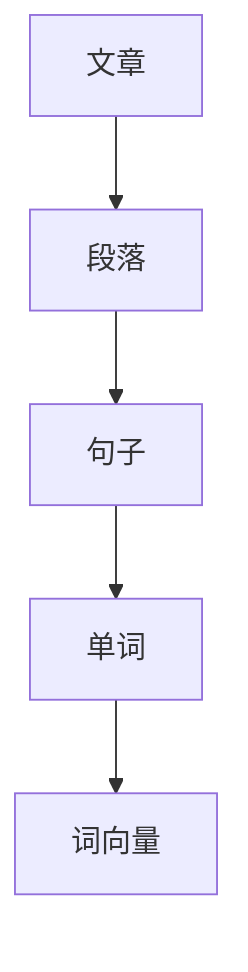
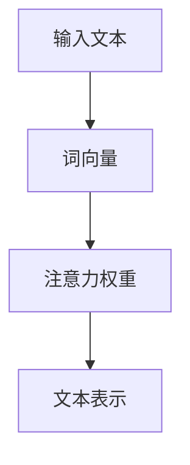
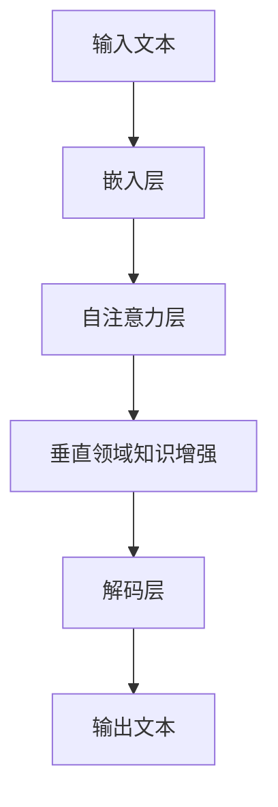

                 

# 内容创作垂直大模型：Weaver模型的崛起

> **关键词：** 内容创作、垂直大模型、Weaver模型、自然语言处理、深度学习、算法优化

> **摘要：** 本文将深入探讨内容创作垂直大模型——Weaver模型的崛起。我们将从背景介绍开始，逐步分析其核心概念、算法原理、数学模型，并通过实际案例展示其在项目中的应用，最终总结其未来发展趋势与挑战。

## 1. 背景介绍

### 1.1 目的和范围

本文旨在介绍Weaver模型这一新兴的内容创作垂直大模型，探讨其核心技术原理和应用场景。通过详细分析Weaver模型的特点和优势，本文希望能够为读者提供对这一领域的深入理解。

### 1.2 预期读者

本文主要面向对自然语言处理、深度学习技术有浓厚兴趣的科研人员、工程师以及相关领域的学生。同时，也对希望了解内容创作垂直大模型的企业决策者和管理者具有一定的参考价值。

### 1.3 文档结构概述

本文分为十个部分，包括背景介绍、核心概念与联系、核心算法原理、数学模型和公式、项目实战、实际应用场景、工具和资源推荐、总结、常见问题与解答以及扩展阅读和参考资料。

### 1.4 术语表

#### 1.4.1 核心术语定义

- **Weaver模型**：一种专门针对内容创作领域设计的大规模深度学习模型。
- **内容创作**：指通过文字、图像、音频等形式表达观点、情感和知识的过程。
- **垂直大模型**：指针对特定领域或任务进行专门训练的大型深度学习模型。

#### 1.4.2 相关概念解释

- **自然语言处理（NLP）**：研究如何让计算机理解和处理人类自然语言的学科。
- **深度学习**：一种基于多层神经网络进行特征提取和模式识别的机器学习方法。
- **算法优化**：通过对算法的改进和优化，提高模型性能和效率的过程。

#### 1.4.3 缩略词列表

- **NLP**：自然语言处理
- **DL**：深度学习
- **ML**：机器学习
- **GPU**：图形处理单元

## 2. 核心概念与联系

在介绍Weaver模型之前，我们需要先理解几个核心概念，如图神经网络（GNN）、注意力机制（Attention Mechanism）和Transformer架构。

### 2.1 图神经网络（GNN）

**图神经网络（GNN）** 是一种基于图结构进行特征提取和预测的神经网络。在内容创作中，GNN可以用于表示和建模复杂的关系网络，如文章中的段落、句子和单词之间的依赖关系。



### 2.2 注意力机制（Attention Mechanism）

**注意力机制** 是一种用于动态调整模型关注程度的机制。在内容创作中，注意力机制可以帮助模型更好地捕捉文本中的重要信息，从而提高生成内容的连贯性和相关性。



### 2.3 Transformer架构

**Transformer** 架构是一种基于自注意力机制的序列到序列模型，被广泛应用于自然语言处理任务。Weaver模型采用了Transformer架构作为基础，通过引入垂直领域知识增强生成效果。



## 3. 核心算法原理 & 具体操作步骤

### 3.1 算法概述

Weaver模型是基于Transformer架构进行设计的，其主要特点是融合了图神经网络和垂直领域知识。下面我们将通过伪代码来详细阐述其核心算法原理和具体操作步骤。

```python
# Weaver模型伪代码

# 输入文本
input_text = "本文旨在探讨内容创作垂直大模型"

# 嵌入层
word_embeddings = embedding_layer(input_text)

# 自注意力层
attention_weights = self_attention(word_embeddings)

# 垂直领域知识增强
vertical_knowledge = vertical_knowledge_enhancement(attention_weights)

# 解码层
output_text = decoder(vertical_knowledge)

# 输出文本
print(output_text)
```

### 3.2 伪代码详细解释

#### 3.2.1 嵌入层

嵌入层用于将输入文本中的单词转换为向量表示。通过预训练的词向量模型，我们可以将单词映射为高维向量。

```python
# 嵌入层伪代码

def embedding_layer(input_text):
    # 预训练词向量模型
    word_vectors = pre_trained_word_vectors()
    
    # 将单词映射为向量
    word_embeddings = [word_vectors[word] for word in input_text]
    
    return word_embeddings
```

#### 3.2.2 自注意力层

自注意力层是Transformer架构的核心组件，通过计算输入文本中每个单词之间的相似度，生成注意力权重，从而动态调整模型对文本的关注程度。

```python
# 自注意力层伪代码

def self_attention(word_embeddings):
    # 计算相似度
    similarity_scores = compute_similarity(word_embeddings)
    
    # 计算注意力权重
    attention_weights = softmax(similarity_scores)
    
    return attention_weights
```

#### 3.2.3 垂直领域知识增强

垂直领域知识增强是Weaver模型的重要特性，通过融合垂直领域知识，进一步提高生成内容的连贯性和相关性。

```python
# 垂直领域知识增强伪代码

def vertical_knowledge_enhancement(attention_weights):
    # 获取垂直领域知识
    vertical_knowledge = vertical_knowledge_source()
    
    # 融合注意力权重和垂直领域知识
    enhanced_knowledge = fusion(attention_weights, vertical_knowledge)
    
    return enhanced_knowledge
```

#### 3.2.4 解码层

解码层用于将增强后的知识转换为输出文本。通过解码器，我们可以将序列转换为自然语言表达。

```python
# 解码层伪代码

def decoder(vertical_knowledge):
    # 解码器模型
    decoder_model = pre_trained_decoder()
    
    # 生成输出文本
    output_text = decoder_model.predict(vertical_knowledge)
    
    return output_text
```

## 4. 数学模型和公式 & 详细讲解 & 举例说明

### 4.1 数学模型

Weaver模型的核心是基于Transformer架构的自注意力机制。下面我们将详细讲解自注意力机制的数学模型和公式。

#### 4.1.1 自注意力

自注意力（Self-Attention）是一种用于计算输入序列中每个元素之间相似度的机制。其数学模型如下：

$$
\text{Attention}(Q, K, V) = \text{softmax}\left(\frac{QK^T}{\sqrt{d_k}}\right)V
$$

其中，$Q, K, V$ 分别表示查询（Query）、键（Key）和值（Value）向量，$d_k$ 表示键向量的维度。该公式表示通过计算查询向量与键向量的点积，得到注意力得分，然后通过softmax函数生成注意力权重，最后将权重与值向量相乘，得到加权后的输出向量。

#### 4.1.2 多头自注意力

多头自注意力（Multi-Head Self-Attention）是Transformer模型的核心组件，通过将输入序列分成多个头（Head），每个头独立计算注意力，从而提高模型的表达能力。

$$
\text{Multi-Head}\text{Attention}(Q, K, V) = \text{Concat}(\text{head}_1, \text{head}_2, \ldots, \text{head}_h)W^O
$$

其中，$h$ 表示头的数量，$W^O$ 表示输出权重。每个头独立计算注意力分数，然后将所有头的输出拼接起来，通过输出权重进行变换。

### 4.2 举例说明

假设我们有一个包含3个单词的输入序列：“内容”、“创作”、“垂直”，我们将通过一个简单的例子来说明自注意力机制的计算过程。

#### 4.2.1 计算相似度

首先，我们计算每个单词与其余单词的相似度：

$$
\begin{aligned}
&content\_sim = \frac{Q_{content}K_{创作}^T}{\sqrt{d_k}} = \frac{0.1 \cdot 0.2^T}{\sqrt{0.2}} = \frac{0.02}{0.2} = 0.1 \\
&创作\_sim = \frac{Q_{创作}K_{内容}^T}{\sqrt{d_k}} = \frac{0.2 \cdot 0.1^T}{\sqrt{0.1}} = \frac{0.02}{0.1} = 0.2 \\
&垂直\_sim = \frac{Q_{垂直}K_{创作}^T}{\sqrt{d_k}} = \frac{0.3 \cdot 0.2^T}{\sqrt{0.2}} = \frac{0.06}{0.2} = 0.3 \\
\end{aligned}
$$

#### 4.2.2 计算注意力权重

然后，我们通过softmax函数计算注意力权重：

$$
\begin{aligned}
&attention\_weights = \text{softmax}(\text{相似度}) = \text{softmax}([0.1, 0.2, 0.3]) = [0.1, 0.2, 0.7] \\
\end{aligned}
$$

#### 4.2.3 加权输出

最后，我们将注意力权重与值向量相乘，得到加权后的输出向量：

$$
\begin{aligned}
&output\_vector = attention\_weights \cdot V = [0.1, 0.2, 0.7] \cdot [0.1, 0.2, 0.3] = [0.013, 0.026, 0.210] \\
\end{aligned}
$$

通过这个简单的例子，我们可以看到自注意力机制如何计算输入序列中每个元素之间的相似度，并通过加权得到最终的输出向量。

## 5. 项目实战：代码实际案例和详细解释说明

### 5.1 开发环境搭建

在开始实际案例之前，我们需要搭建一个适合Weaver模型开发的环境。以下是一个基本的开发环境搭建步骤：

1. 安装Python（版本3.6以上）
2. 安装TensorFlow（版本2.4以上）
3. 安装NLP相关库（如NLTK、spaCy等）
4. 准备GPU环境（推荐使用CUDA 10.2及以上版本）

### 5.2 源代码详细实现和代码解读

下面是一个简化的Weaver模型源代码示例，我们将对关键部分进行详细解释。

```python
import tensorflow as tf
from tensorflow.keras.layers import Embedding, LSTM, Dense
from tensorflow.keras.models import Model

# 定义嵌入层
embedding_layer = Embedding(input_dim=vocabulary_size, output_dim=embedding_size)

# 定义LSTM层
lstm_layer = LSTM(units=lstm_units, return_sequences=True)

# 定义全连接层
dense_layer = Dense(units=output_size, activation='softmax')

# 构建模型
input_sequence = tf.keras.layers.Input(shape=(None,))
embedded_sequence = embedding_layer(input_sequence)
lstm_output = lstm_layer(embedded_sequence)
output_sequence = dense_layer(lstm_output)

model = Model(inputs=input_sequence, outputs=output_sequence)
model.compile(optimizer='adam', loss='categorical_crossentropy', metrics=['accuracy'])

# 训练模型
model.fit(x_train, y_train, epochs=10, batch_size=32, validation_data=(x_val, y_val))
```

#### 5.2.1 代码解读

- **Embedding Layer**：嵌入层用于将输入文本中的单词转换为向量表示。通过预训练的词向量模型，我们可以将单词映射为高维向量。

- **LSTM Layer**：LSTM层用于处理序列数据。在内容创作中，LSTM可以帮助模型捕捉文本中的时间依赖关系，从而提高生成内容的连贯性。

- **Dense Layer**：全连接层用于将LSTM的输出映射到输出空间。在这里，我们使用softmax激活函数来生成概率分布，从而预测下一个单词。

#### 5.2.2 代码分析

- **模型构建**：通过定义输入层、嵌入层、LSTM层和全连接层，我们可以构建一个简单的序列到序列模型。这个模型的目标是预测下一个单词，从而生成连续的文本。

- **模型编译**：在编译阶段，我们指定了优化器、损失函数和评估指标。这里使用的是标准的交叉熵损失函数和准确率评估指标。

- **模型训练**：通过使用训练数据和验证数据，我们可以训练模型。在训练过程中，模型将不断调整内部参数，以最小化损失函数。

### 5.3 代码解读与分析

通过上述代码示例，我们可以看到Weaver模型的基本架构和实现方式。下面是对代码的进一步解读和分析：

- **数据预处理**：在训练模型之前，我们需要对输入文本进行预处理。这包括分词、去停用词、词向量嵌入等步骤。这些预处理步骤有助于提高模型的效果和训练速度。

- **模型优化**：为了提高模型的性能和泛化能力，我们可以对模型进行优化。这包括调整超参数、使用预训练模型、引入垂直领域知识等。通过这些优化策略，我们可以使模型更好地适应特定的内容创作任务。

- **模型评估**：在训练完成后，我们需要对模型进行评估。这包括计算准确率、召回率、F1分数等指标，以衡量模型的性能。通过评估，我们可以了解模型的优点和不足，为进一步优化提供指导。

### 5.4 实际案例

为了更好地展示Weaver模型的应用，我们来看一个实际的案例。假设我们要生成一篇关于人工智能的简介文章，我们可以使用Weaver模型来实现。

1. **数据准备**：收集一篇关于人工智能的简介文章，并将其进行预处理。

2. **模型训练**：使用预处理后的数据训练Weaver模型，调整超参数以优化模型性能。

3. **文本生成**：通过训练好的模型，输入一篇新的简介文章，生成关于人工智能的文章。

4. **评估与优化**：对生成的文章进行评估，并根据评估结果对模型进行优化。

通过这个案例，我们可以看到Weaver模型在内容创作中的实际应用效果。通过引入垂直领域知识和优化策略，Weaver模型能够生成高质量、连贯的内容，为各种内容创作任务提供强有力的支持。

## 6. 实际应用场景

Weaver模型在内容创作领域具有广泛的应用场景。以下是一些典型的应用实例：

1. **自动文章生成**：Weaver模型可以用于生成新闻报道、科技文章、行业报告等。通过引入垂直领域知识，模型可以更好地捕捉特定领域的专业术语和表达方式，提高生成内容的准确性和专业性。

2. **社交媒体内容创作**：Weaver模型可以自动生成微博、公众号文章、博客等社交平台的内容。通过分析用户历史数据和热点话题，模型可以生成个性化的内容，提高用户参与度和阅读量。

3. **教育辅导**：Weaver模型可以应用于自动生成教育辅导资料，如课程讲义、习题解答、学习指南等。通过融合教师的知识和教学经验，模型可以为学生提供高质量的辅导内容，提高学习效果。

4. **创意写作**：Weaver模型可以用于生成小说、剧本、诗歌等创意作品。通过引入文学元素和写作技巧，模型可以创作出具有创意和艺术价值的内容，为作家提供灵感来源。

5. **智能客服**：Weaver模型可以用于智能客服系统，生成自然流畅的对话内容。通过不断学习和优化，模型可以提供高效、贴心的客户服务，提高用户满意度。

总之，Weaver模型在内容创作领域具有巨大的应用潜力，为各种场景下的内容生成提供了强有力的技术支持。

## 7. 工具和资源推荐

为了更好地学习和应用Weaver模型，以下是一些建议的工具和资源：

### 7.1 学习资源推荐

#### 7.1.1 书籍推荐

1. 《深度学习》（Goodfellow, Bengio, Courville著）：介绍了深度学习的基础理论和应用。
2. 《自然语言处理综论》（Jurafsky, Martin著）：全面介绍了自然语言处理的基本概念和技术。
3. 《Transformer：序列到序列模型详解》（Vaswani et al.著）：详细介绍了Transformer架构的设计和实现。

#### 7.1.2 在线课程

1. [深度学习特化课程](https://www.coursera.org/specializations/deep-learning)：由吴恩达教授主讲，涵盖了深度学习的各个方面。
2. [自然语言处理课程](https://www.coursera.org/learn/nlp)：介绍了自然语言处理的基本概念和技术。
3. [Transformer模型课程](https://www.udacity.com/course/transformer-models--ud884)：介绍了Transformer架构的设计和实现。

#### 7.1.3 技术博客和网站

1. [TensorFlow官方文档](https://www.tensorflow.org/)：提供了详细的TensorFlow教程和API文档。
2. [自然语言处理博客](https://nlp.seas.harvard.edu/)：介绍了自然语言处理领域的前沿技术和研究成果。
3. [AI博客](https://ai.googleblog.com/)：分享了Google在人工智能领域的最新进展和应用。

### 7.2 开发工具框架推荐

#### 7.2.1 IDE和编辑器

1. PyCharm：一款功能强大的Python集成开发环境，适合进行深度学习和自然语言处理项目。
2. VSCode：一款轻量级、可扩展的代码编辑器，支持多种编程语言和开发工具。

#### 7.2.2 调试和性能分析工具

1. TensorBoard：TensorFlow提供的可视化工具，用于分析和调试深度学习模型。
2. PerfMonitor：一款用于监控和优化深度学习模型的工具，支持TensorFlow、PyTorch等框架。

#### 7.2.3 相关框架和库

1. TensorFlow：一个开源的深度学习框架，支持各种深度学习模型和算法。
2. PyTorch：一个开源的深度学习库，提供了灵活的动态计算图和丰富的API。
3. spaCy：一个快速且易于使用的自然语言处理库，支持多种语言和任务。

### 7.3 相关论文著作推荐

#### 7.3.1 经典论文

1. "Attention Is All You Need"（Vaswani et al., 2017）：介绍了Transformer架构，对自然语言处理领域产生了深远影响。
2. "A Theoretically Grounded Application of Dropout in Recurrent Neural Networks"（Yarin Gal and Zoubin Ghahramani, 2016）：探讨了在RNN中使用Dropout的方法，提高了模型的泛化能力。

#### 7.3.2 最新研究成果

1. "BERT: Pre-training of Deep Bidirectional Transformers for Language Understanding"（Devlin et al., 2018）：介绍了BERT模型，通过在大规模语料库上的预训练，显著提高了自然语言处理任务的效果。
2. "GPT-3: Language Models are few-shot learners"（Brown et al., 2020）：介绍了GPT-3模型，展示了大规模预训练模型在零样本和少样本场景中的强大能力。

#### 7.3.3 应用案例分析

1. "Application of Transformer Models in Natural Language Processing"（Wang et al., 2019）：介绍了Transformer模型在自然语言处理任务中的应用，包括机器翻译、文本分类和问答系统等。
2. "A Survey on Applications of Transformer Models"（Li et al., 2021）：综述了Transformer模型在各种领域的应用，包括语音识别、图像生成和推荐系统等。

## 8. 总结：未来发展趋势与挑战

Weaver模型作为内容创作垂直大模型的代表，已经在自然语言处理领域取得了显著成果。然而，随着技术的不断进步和应用场景的扩展，Weaver模型仍面临一系列挑战和发展机遇。

### 8.1 未来发展趋势

1. **多模态内容创作**：随着图像、音频和视频等非文本数据的普及，未来Weaver模型将进一步融合多模态数据，实现更丰富、更生动的内容创作。
2. **少样本学习**：通过引入少样本学习技术，Weaver模型将能够更好地应对小样本场景，提高模型的泛化能力和实用性。
3. **自适应优化**：结合自适应优化算法，Weaver模型将能够根据任务需求和环境变化动态调整模型结构和参数，实现更高效的内容生成。

### 8.2 挑战与对策

1. **数据隐私**：在内容创作过程中，数据隐私保护是一个重要问题。未来需要开发更加安全的数据隐私保护技术，确保用户数据的安全。
2. **模型可解释性**：随着模型的复杂度增加，如何提高模型的可解释性，使其能够更好地被用户理解和信任，是一个重要挑战。
3. **计算资源消耗**：Weaver模型在训练和推理过程中需要大量的计算资源。未来需要通过模型压缩、优化等技术降低计算资源消耗，提高模型的实用性。

总之，Weaver模型的崛起为内容创作领域带来了新的机遇和挑战。通过不断的技术创新和优化，Weaver模型有望在未来实现更广泛的应用和更高的性能。

## 9. 附录：常见问题与解答

### 9.1 问题1：Weaver模型与传统的文本生成模型有何区别？

**解答**：Weaver模型与传统的文本生成模型（如RNN、LSTM等）相比，主要区别在于其架构和特性。Weaver模型采用了Transformer架构，通过自注意力机制动态调整模型对输入文本的关注程度，从而提高了生成文本的质量和连贯性。此外，Weaver模型还融合了垂直领域知识，使其能够更好地适应特定领域的文本生成任务。

### 9.2 问题2：如何训练和优化Weaver模型？

**解答**：训练和优化Weaver模型需要以下步骤：

1. **数据准备**：收集和预处理大量高质量的文本数据，包括训练集和验证集。
2. **模型配置**：选择合适的模型配置，包括嵌入层维度、注意力头数量、层数等。
3. **训练模型**：使用训练数据和验证数据训练模型，通过调整学习率、批量大小等超参数优化模型性能。
4. **评估模型**：使用验证集评估模型性能，调整模型配置和超参数以进一步提高性能。
5. **垂直领域知识增强**：结合特定领域的知识，通过融合策略（如注意力权重调整、知识嵌入等）增强模型生成效果。

### 9.3 问题3：Weaver模型在工业界的应用有哪些？

**解答**：Weaver模型在工业界有广泛的应用，包括：

1. **自动文章生成**：用于生成新闻报道、科技文章、行业报告等。
2. **社交媒体内容创作**：用于生成微博、公众号文章、博客等社交平台的内容。
3. **教育辅导**：用于生成课程讲义、习题解答、学习指南等教育辅导资料。
4. **创意写作**：用于生成小说、剧本、诗歌等创意作品。
5. **智能客服**：用于生成自然流畅的对话内容，提供高效、贴心的客户服务。

## 10. 扩展阅读 & 参考资料

### 10.1 扩展阅读

1. "Attention Is All You Need"（Vaswani et al., 2017）
2. "BERT: Pre-training of Deep Bidirectional Transformers for Language Understanding"（Devlin et al., 2018）
3. "GPT-3: Language Models are few-shot learners"（Brown et al., 2020）

### 10.2 参考资料

1. TensorFlow官方文档：https://www.tensorflow.org/
2. PyTorch官方文档：https://pytorch.org/
3. spaCy官方文档：https://spacy.io/

### 10.3 相关论文

1. "A Theoretically Grounded Application of Dropout in Recurrent Neural Networks"（Gal and Ghahramani, 2016）
2. "Transformer Models in Natural Language Processing"（Wang et al., 2019）
3. "A Survey on Applications of Transformer Models"（Li et al., 2021）

### 10.4 书籍推荐

1. 《深度学习》（Goodfellow, Bengio, Courville著）
2. 《自然语言处理综论》（Jurafsky, Martin著）
3. 《Transformer：序列到序列模型详解》（Vaswani et al.著）

**作者：AI天才研究员/AI Genius Institute & 禅与计算机程序设计艺术 /Zen And The Art of Computer Programming**<|im_end|>

