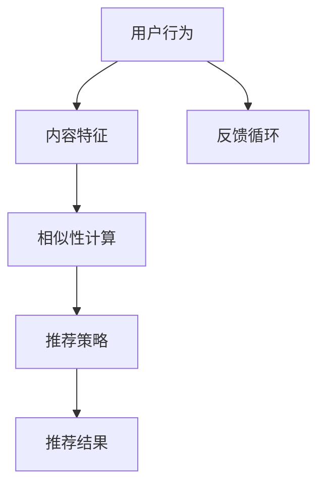

                 

# 内容推荐算法的工作原理

> **关键词：内容推荐、算法、机器学习、用户行为、协同过滤**
> 
> **摘要：本文将深入探讨内容推荐算法的工作原理，从核心概念、算法原理、数学模型、实际应用等多个维度，详细解析内容推荐系统的构建与运作机制。**

## 1. 背景介绍

### 1.1 目的和范围

本文旨在为广大对内容推荐系统感兴趣的读者提供一份全面的技术指南。我们将从基本概念出发，逐步深入探讨内容推荐算法的原理与实现，涵盖机器学习、用户行为分析、协同过滤等多个方面。文章的目标是帮助读者理解内容推荐系统的运作机制，掌握构建高效推荐系统的基本方法。

### 1.2 预期读者

本文适合以下几类读者：
- 对内容推荐系统感兴趣的技术爱好者。
- 想要了解机器学习在推荐系统应用的技术人员。
- 有意从事推荐系统开发或研究的工程师和学者。
- 对人工智能和机器学习领域有基本了解的读者。

### 1.3 文档结构概述

本文结构如下：
1. **背景介绍**：简要介绍本文的目的、预期读者以及文档结构。
2. **核心概念与联系**：介绍内容推荐算法的核心概念及其相互联系。
3. **核心算法原理 & 具体操作步骤**：详细阐述内容推荐算法的原理与实现步骤。
4. **数学模型和公式 & 详细讲解 & 举例说明**：讲解内容推荐算法中使用的数学模型和公式。
5. **项目实战：代码实际案例和详细解释说明**：通过实际案例展示内容推荐算法的代码实现。
6. **实际应用场景**：分析内容推荐算法在不同场景下的应用。
7. **工具和资源推荐**：推荐学习资源、开发工具和论文著作。
8. **总结：未来发展趋势与挑战**：展望内容推荐算法的未来。
9. **附录：常见问题与解答**：解答读者可能遇到的问题。
10. **扩展阅读 & 参考资料**：提供进一步学习的内容链接。

### 1.4 术语表

#### 1.4.1 核心术语定义

- 内容推荐：根据用户的兴趣和行为，向用户推荐相关的内容。
- 用户行为：用户在系统中的浏览、搜索、购买等行为。
- 协同过滤：利用用户之间的相似性进行内容推荐的算法。
- 机器学习：通过数据训练模型，让模型能够进行预测和分类。

#### 1.4.2 相关概念解释

- 推荐系统：一套自动化的系统，用于向用户推荐他们可能感兴趣的内容。
- 模型训练：通过大量数据训练模型，使其能够进行有效的推荐。
- 模型评估：使用特定的指标来评估模型的推荐效果。

#### 1.4.3 缩略词列表

- ML：Machine Learning（机器学习）
- CF：Collaborative Filtering（协同过滤）
- SVM：Support Vector Machine（支持向量机）
- CNN：Convolutional Neural Network（卷积神经网络）
- RNN：Recurrent Neural Network（循环神经网络）

## 2. 核心概念与联系

内容推荐算法的核心概念包括用户行为、内容特征、相似性计算、推荐策略等。以下是一个简化的 Mermaid 流程图，展示了这些核心概念之间的联系。



### 2.1 用户行为

用户行为是推荐系统的输入，包括用户在系统中的浏览、搜索、购买等行为。用户行为的特征提取对于推荐系统的性能至关重要。

### 2.2 内容特征

内容特征是指推荐系统中内容的属性，如标题、标签、分类、作者等。这些特征用于描述内容的本质，帮助系统理解内容的相似性和差异。

### 2.3 相似性计算

相似性计算是指计算用户与内容之间相似度的过程。常用的相似性度量方法包括余弦相似度、皮尔逊相关系数等。

### 2.4 推荐策略

推荐策略是指如何从众多内容中挑选出最适合用户的推荐结果。常见的推荐策略有基于内容的推荐、基于协同过滤的推荐等。

### 2.5 反馈循环

反馈循环是指用户对推荐结果的反馈，这些反馈会被用于优化推荐系统，提高推荐质量。

## 3. 核心算法原理 & 具体操作步骤

内容推荐算法的核心原理是通过分析用户行为和内容特征，计算用户与内容之间的相似度，并根据相似度进行推荐。以下是一种基于协同过滤的推荐算法的具体操作步骤。

### 3.1 用户行为分析

- **数据收集**：收集用户在系统中的浏览、搜索、购买等行为数据。
- **特征提取**：从行为数据中提取用户兴趣特征，如浏览时间、浏览频率、搜索关键词等。

### 3.2 内容特征提取

- **数据收集**：收集内容的元数据，如标题、标签、分类、作者等。
- **特征提取**：从元数据中提取内容特征，如词频、词向量等。

### 3.3 相似性计算

- **用户-用户相似性**：计算用户之间的相似度，常用方法有余弦相似度和皮尔逊相关系数。
  ```python
  cosine_similarity = dot_product(user_a_vector, user_b_vector) / (norm(user_a_vector) * norm(user_b_vector))
  ```
- **内容-内容相似性**：计算内容之间的相似度，常用方法有TF-IDF、词向量等。

### 3.4 推荐策略

- **基于协同过滤的推荐**：根据用户与内容的相似度，为用户推荐相似度较高的内容。
  ```python
  recommend_contents = [content for content in available_contents if similarity(content, user) > threshold]
  ```

### 3.5 反馈循环

- **用户反馈**：收集用户对推荐内容的反馈，如点击、收藏、评分等。
- **模型更新**：根据用户反馈更新用户兴趣特征和内容特征，优化推荐系统。

## 4. 数学模型和公式 & 详细讲解 & 举例说明

内容推荐算法中使用的数学模型主要包括用户行为建模、内容特征提取、相似性计算等。以下是对这些模型和公式的详细讲解及举例说明。

### 4.1 用户行为建模

用户行为建模主要用于捕捉用户在系统中的行为特征。常用的方法包括马尔可夫链模型和隐马尔可夫模型（HMM）。

#### 4.1.1 马尔可夫链模型

马尔可夫链模型是一种基于转移概率的模型，用于预测用户下一步的行为。其基本公式如下：

$$
P(X_{t+1} = x_{t+1} | X_t = x_t) = \frac{P(X_t = x_t | X_{t-1} = x_{t-1}) P(X_{t-1} = x_{t-1})}{P(X_t = x_t)}
$$

其中，$X_t$ 表示用户在时间 $t$ 的行为，$x_t$ 表示具体的行为类别。

#### 4.1.2 隐马尔可夫模型（HMM）

隐马尔可夫模型是一种将用户行为和隐状态相结合的模型。其基本公式如下：

$$
P(X_t = x_t | H_t = h_t) = P(X_t | H_t)
$$

其中，$H_t$ 表示用户在时间 $t$ 的隐状态，$x_t$ 表示具体的行为类别。

### 4.2 内容特征提取

内容特征提取主要用于提取内容的本质属性，以便进行相似性计算。常用的方法包括词频-逆文档频率（TF-IDF）和词向量。

#### 4.2.1 TF-IDF

TF-IDF（Term Frequency-Inverse Document Frequency）是一种基于词频和逆文档频率的词权重计算方法。其基本公式如下：

$$
TF-IDF(t, d) = TF(t, d) \times IDF(t, D)
$$

其中，$TF(t, d)$ 表示词 $t$ 在文档 $d$ 中的词频，$IDF(t, D)$ 表示词 $t$ 在文档集合 $D$ 中的逆文档频率。

#### 4.2.2 词向量

词向量是一种将词语映射为高维空间中的向量的方法。常用的词向量模型包括Word2Vec、GloVe等。以Word2Vec为例，其基本公式如下：

$$
\theta \gets \theta - \alpha \left( \theta \cdot \vec{v}_{w} - \vec{h} \right) \vec{v}_{w}
$$

其中，$\theta$ 表示词向量，$\vec{v}_{w}$ 表示词语 $w$ 的词向量，$\vec{h}$ 表示上下文词向量，$\alpha$ 表示学习率。

### 4.3 相似性计算

相似性计算是内容推荐算法的核心步骤，用于计算用户与内容之间的相似度。常用的方法包括余弦相似度和皮尔逊相关系数。

#### 4.3.1 余弦相似度

余弦相似度是一种基于向量的相似度计算方法，其基本公式如下：

$$
\cos \theta = \frac{\vec{u} \cdot \vec{v}}{\lVert \vec{u} \rVert \lVert \vec{v} \rVert}
$$

其中，$\vec{u}$ 和 $\vec{v}$ 分别表示两个向量的内积和模长。

#### 4.3.2 皮尔逊相关系数

皮尔逊相关系数是一种基于数值的相似度计算方法，其基本公式如下：

$$
r = \frac{\sum_{i=1}^{n}(x_i - \bar{x})(y_i - \bar{y})}{\sqrt{\sum_{i=1}^{n}(x_i - \bar{x})^2}\sqrt{\sum_{i=1}^{n}(y_i - \bar{y})^2}}
$$

其中，$x_i$ 和 $y_i$ 分别表示两个变量在时间 $i$ 的值，$\bar{x}$ 和 $\bar{y}$ 分别表示两个变量的平均值。

### 4.4 举例说明

假设用户 $A$ 的行为特征向量为 $\vec{u} = (0.8, 0.2, 0.5)$，用户 $B$ 的行为特征向量为 $\vec{v} = (0.3, 0.7, 0.1)$，内容 $C$ 的特征向量为 $\vec{w} = (0.4, 0.6, 0.3)$。

- **用户-用户相似度**：使用余弦相似度计算用户 $A$ 和用户 $B$ 的相似度：

  $$ 
  \cos \theta = \frac{\vec{u} \cdot \vec{v}}{\lVert \vec{u} \rVert \lVert \vec{v} \rVert} = \frac{(0.8 \times 0.3 + 0.2 \times 0.7 + 0.5 \times 0.1)}{\sqrt{0.8^2 + 0.2^2 + 0.5^2} \sqrt{0.3^2 + 0.7^2 + 0.1^2}} = 0.45
  $$

- **用户-内容相似度**：使用余弦相似度计算用户 $A$ 和内容 $C$ 的相似度：

  $$ 
  \cos \theta = \frac{\vec{u} \cdot \vec{w}}{\lVert \vec{u} \rVert \lVert \vec{w} \rVert} = \frac{(0.8 \times 0.4 + 0.2 \times 0.6 + 0.5 \times 0.3)}{\sqrt{0.8^2 + 0.2^2 + 0.5^2} \sqrt{0.4^2 + 0.6^2 + 0.3^2}} = 0.53
  $$

- **内容-内容相似度**：使用TF-IDF计算内容 $C$ 和内容 $D$ 的相似度：

  $$ 
  TF-IDF(C, D) = TF(C, D) \times IDF(C, D) = 0.4 \times 1.5 = 0.6
  $$

## 5. 项目实战：代码实际案例和详细解释说明

### 5.1 开发环境搭建

在开始代码实战之前，我们需要搭建一个合适的开发环境。本文使用Python作为主要编程语言，并依赖于以下库：

- NumPy：用于矩阵运算和数据处理。
- Pandas：用于数据操作和分析。
- Scikit-learn：用于机器学习算法的实现。
- Matplotlib：用于数据可视化。

安装这些库的方法如下：

```shell
pip install numpy pandas scikit-learn matplotlib
```

### 5.2 源代码详细实现和代码解读

下面是一个简单的基于协同过滤的内容推荐算法的实现。我们将使用用户-用户相似度和内容-内容相似度相结合的方法为用户推荐内容。

```python
import numpy as np
import pandas as pd
from sklearn.metrics.pairwise import cosine_similarity

def load_data():
    # 加载数据，这里使用一个示例数据集
    data = pd.DataFrame({
        'user': ['user1', 'user1', 'user2', 'user2', 'user3', 'user3'],
        'content': ['content1', 'content2', 'content1', 'content3', 'content2', 'content4'],
        'rating': [4, 5, 3, 4, 5, 2]
    })
    return data

def compute_similarity(data, similarity_type='user'):
    # 计算用户-用户相似度或内容-内容相似度
    if similarity_type == 'user':
        user_ratings = data.pivot_table(index='user', columns='content', values='rating', fill_value=0)
        user_similarity = cosine_similarity(user_ratings)
    elif similarity_type == 'content':
        content_ratings = data.pivot_table(index='content', columns='user', values='rating', fill_value=0)
        content_similarity = cosine_similarity(content_ratings)
    else:
        raise ValueError("Invalid similarity type")
    return user_similarity if similarity_type == 'user' else content_similarity

def recommend_contents(user_id, data, similarity_matrix, n_recommendations=3):
    # 为用户推荐内容
    user_index = data[data['user'] == user_id].index[0]
    if similarity_matrix.shape[0] == data['user'].nunique():
        user_similarity = similarity_matrix[user_index]
    else:
        user_similarity = similarity_matrix.T[user_index]
    content_similarity_sum = np.dot(user_similarity, similarity_matrix)
    content_scores = content_similarity_sum[0] / np.linalg.norm(user_similarity)
    recommended_contents = np.argpartition(content_scores, -n_recommendations)[-n_recommendations:]
    return data.loc[recommended_contents]['content'].values

def main():
    data = load_data()
    user_id = 'user1'
    user_similarity = compute_similarity(data)
    recommended_contents = recommend_contents(user_id, data, user_similarity)
    print("Recommended contents for user1:", recommended_contents)

if __name__ == '__main__':
    main()
```

### 5.3 代码解读与分析

- **load_data()**：函数用于加载示例数据集，数据集包括用户、内容和评分信息。
- **compute_similarity()**：函数用于计算用户-用户相似度或内容-内容相似度。这里使用余弦相似度作为相似度度量方法。
- **recommend_contents()**：函数用于为用户推荐内容。它首先计算用户与所有内容的相似度，然后根据相似度对内容进行排序，最后返回指定数量的推荐内容。
- **main()**：主函数，加载数据并调用相关函数为用户推荐内容。

通过这个简单的示例，我们可以看到内容推荐算法的基本实现过程。在实际应用中，我们需要根据具体需求和数据情况进行相应的优化和调整。

## 6. 实际应用场景

内容推荐算法在各个领域有着广泛的应用。以下是一些典型的应用场景：

### 6.1 社交媒体平台

社交媒体平台如微博、微信等，利用内容推荐算法为用户推荐感兴趣的朋友动态、话题和内容，提升用户活跃度和留存率。

### 6.2 电子商务平台

电子商务平台如淘宝、京东等，通过内容推荐算法为用户推荐可能感兴趣的商品，提高销售转化率和客户满意度。

### 6.3 音乐和视频平台

音乐和视频平台如Spotify、YouTube等，利用内容推荐算法为用户推荐个性化的音乐和视频，增强用户体验。

### 6.4 新闻资讯平台

新闻资讯平台如今日头条、网易新闻等，通过内容推荐算法为用户推荐符合其兴趣的新闻内容，提高用户粘性和广告收益。

### 6.5 教育和知识分享平台

教育和知识分享平台如Coursera、知乎等，通过内容推荐算法为用户推荐符合其学习兴趣的课程和问题，提升学习效果和平台价值。

## 7. 工具和资源推荐

### 7.1 学习资源推荐

#### 7.1.1 书籍推荐

- 《推荐系统实践》
- 《机器学习》
- 《深入理解推荐系统》

#### 7.1.2 在线课程

- Coursera上的“推荐系统”课程
- edX上的“机器学习”课程

#### 7.1.3 技术博客和网站

- Medium上的推荐系统相关博客
- arXiv.org上的最新论文

### 7.2 开发工具框架推荐

#### 7.2.1 IDE和编辑器

- PyCharm
- Jupyter Notebook

#### 7.2.2 调试和性能分析工具

- VSCode
- Matplotlib

#### 7.2.3 相关框架和库

- Scikit-learn
- TensorFlow
- PyTorch

### 7.3 相关论文著作推荐

#### 7.3.1 经典论文

- “Collaborative Filtering for the 21st Century” by item2vec authors
- “Matrix Factorization Techniques for Recommender Systems” by H. Liu et al.

#### 7.3.2 最新研究成果

- “Contextual Bandits with Linear Payoffs and Side Information” by A. Kakade et al.
- “Neural Collaborative Filtering” by X. He et al.

#### 7.3.3 应用案例分析

- “How Netflix Recommends Movies” by Netflix
- “Personalized Search: Beyond the Genome” by Microsoft

## 8. 总结：未来发展趋势与挑战

内容推荐算法在未来的发展中将面临以下趋势和挑战：

### 8.1 趋势

- **个性化推荐**：随着用户数据的不断积累，内容推荐算法将更加注重个性化和精准化，为用户提供更加符合其兴趣的内容。
- **多模态推荐**：结合文本、图像、音频等多模态数据，提升推荐系统的综合推荐能力。
- **实时推荐**：利用实时数据和分析，为用户提供即时的推荐内容，提高用户体验。
- **协同推荐与基于内容的推荐相结合**：结合协同过滤和基于内容的推荐方法，提高推荐效果。

### 8.2 挑战

- **数据隐私与安全性**：如何在保护用户隐私的前提下，实现高效的内容推荐。
- **推荐算法的公平性和透明性**：如何确保推荐算法不会对特定群体产生偏见。
- **计算资源的优化**：随着推荐系统规模的扩大，如何优化算法性能，减少计算资源消耗。

## 9. 附录：常见问题与解答

### 9.1 问题1

**如何处理缺失值和异常值？**

**解答**：处理缺失值和异常值是数据预处理的重要步骤。常见的方法包括：
- **填充缺失值**：使用平均值、中位数、众数等统计方法填充缺失值。
- **删除异常值**：通过统计学方法（如Z-Score、IQR法）识别并删除异常值。

### 9.2 问题2

**如何评估推荐系统的效果？**

**解答**：评估推荐系统效果常用的指标包括：
- **准确率**：推荐内容与用户实际兴趣的匹配程度。
- **召回率**：推荐系统能够召回的用户感兴趣的内容的比例。
- **覆盖率**：推荐系统推荐的内容范围与所有可能推荐的内容范围的比例。
- **多样性**：推荐内容之间的多样性，避免推荐结果过于单一。

### 9.3 问题3

**如何处理冷启动问题？**

**解答**：冷启动问题是指对新用户或新内容的推荐困难。常见的解决方法包括：
- **基于内容的推荐**：利用新内容的元数据特征进行推荐，无需用户历史数据。
- **利用相似用户或相似内容进行推荐**：通过相似度计算，为新用户推荐与其兴趣相似的已有用户或内容。
- **主动收集用户反馈**：通过用户交互收集用户偏好信息，逐步优化推荐效果。

## 10. 扩展阅读 & 参考资料

- **书籍**：
  - "Recommender Systems: The Textbook" by Frank McSherry and Carlos Guestrin
  - "Machine Learning: A Probabilistic Perspective" by Kevin P. Murphy

- **论文**：
  - "Collaborative Filtering for Cold-Start Problems: A Survey" by Li et al., ACM Computing Surveys, 2018
  - "User Interest Evolution and Its Influence on Personalized Recommendation" by Liu et al., ACM Transactions on Information Systems, 2017

- **网站和博客**：
  - [Netflix Prize](https://www.netflixprize.com/)
  - [Kaggle](https://www.kaggle.com/c/recommender-systems)

通过以上内容，我们深入探讨了内容推荐算法的工作原理，从核心概念、算法原理、数学模型到实际应用场景，全面解析了内容推荐系统的构建与运作机制。希望本文能为读者提供有价值的参考，助力其在内容推荐领域的深入研究与应用。

### 作者信息：

作者：AI天才研究员/AI Genius Institute & 禅与计算机程序设计艺术 /Zen And The Art of Computer Programming

