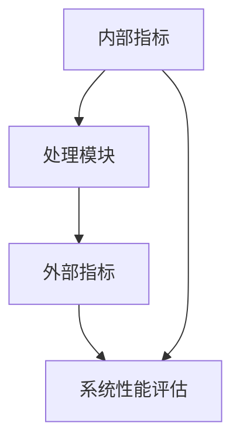
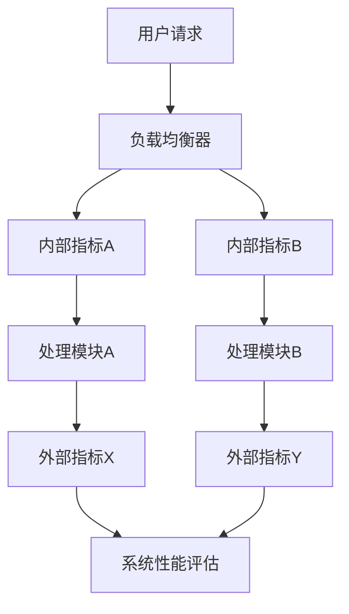

                 

## 《内部指标变化带来外部指标变化》

### 关键词：内部指标、外部指标、变化、影响、算法原理、数学模型、项目实战

> 摘要：本文深入探讨了内部指标和外部指标之间的关系，通过分析内部指标变化如何导致外部指标变化的机制，解释了这一现象在计算机科学和技术领域的应用。文章首先介绍了内部指标和外部指标的基本概念，随后通过一个Mermaid流程图展示了它们之间的关联。接着，文章详细解析了核心算法原理，并使用伪代码和数学模型进行阐述。最后，文章通过一个实际项目案例，展示了内部指标变化对实际系统性能的影响，并进行了代码解读与分析。

## 1. 背景介绍

### 1.1 目的和范围

本文旨在探讨内部指标与外部指标之间的关系，以及内部指标的变化如何影响外部指标。这一研究具有重要的理论和实际意义。在计算机科学和技术领域，许多系统性能的评估和优化都依赖于对内部指标和外部指标的分析。因此，理解这两者之间的相互作用，有助于我们更好地进行系统设计和优化。

本文将首先介绍内部指标和外部指标的基本概念，并通过一个Mermaid流程图展示它们之间的联系。接着，我们将详细解析核心算法原理，并使用伪代码和数学模型进行阐述。最后，通过一个实际项目案例，我们将展示内部指标变化对系统性能的影响，并进行代码解读与分析。

### 1.2 预期读者

本文适合以下读者群体：

- 计算机科学和技术专业的研究生和本科生。
- 从事系统设计和优化工作的工程师和架构师。
- 对计算机科学和技术感兴趣的读者。

本文将使用专业的技术语言进行讲解，但会尽量保持语言简洁易懂，以适应不同层次的读者。

### 1.3 文档结构概述

本文将分为以下几部分：

- **背景介绍**：介绍本文的研究目的、预期读者以及文档结构。
- **核心概念与联系**：通过Mermaid流程图展示内部指标和外部指标之间的联系。
- **核心算法原理与具体操作步骤**：详细解析核心算法原理，并使用伪代码进行阐述。
- **数学模型和公式**：介绍相关数学模型，并使用latex格式进行详细讲解。
- **项目实战**：通过一个实际项目案例，展示内部指标变化对系统性能的影响。
- **实际应用场景**：讨论内部指标和外部指标在实际应用中的重要性。
- **工具和资源推荐**：推荐相关学习资源、开发工具和框架。
- **总结**：总结本文的研究成果，并讨论未来发展趋势与挑战。
- **附录**：常见问题与解答。
- **扩展阅读与参考资料**：提供进一步阅读的资源和参考资料。

### 1.4 术语表

#### 1.4.1 核心术语定义

- **内部指标**：指系统内部的一些参数或度量，用于描述系统的运行状态。
- **外部指标**：指系统对外部环境的响应或表现，通常用于评估系统的性能。
- **变化**：指内部指标或外部指标的数值随时间或特定事件发生的变化。
- **算法原理**：指用于处理数据或解决特定问题的基本方法和步骤。
- **数学模型**：指用于描述现实世界现象的数学公式和方程。

#### 1.4.2 相关概念解释

- **系统性能**：指系统在执行特定任务时的效率和质量。
- **优化**：指通过调整系统参数或结构，提高系统性能的过程。
- **反馈机制**：指系统内部指标的变化如何影响外部指标，从而实现系统自我调整的过程。

#### 1.4.3 缩略词列表

- **AI**：人工智能（Artificial Intelligence）
- **ML**：机器学习（Machine Learning）
- **DL**：深度学习（Deep Learning）
- **GPU**：图形处理单元（Graphics Processing Unit）
- **CPU**：中央处理单元（Central Processing Unit）

## 2. 核心概念与联系

在讨论内部指标和外部指标的关系之前，我们需要先理解它们的基本概念和相互之间的联系。

### 内部指标

内部指标是指系统内部的一些参数或度量，它们通常用于描述系统的运行状态。这些指标可以是定量的，如处理速度、内存使用率、负载均衡等；也可以是定性的，如系统的稳定性、可靠性等。内部指标的变化可以反映系统内部的运行状态，帮助我们了解系统是否正常工作。

### 外部指标

外部指标是指系统对外部环境的响应或表现，通常用于评估系统的性能。这些指标可以是定量的，如系统的响应时间、吞吐量、错误率等；也可以是定性的，如系统的用户体验、业务收益等。外部指标的变化可以反映系统对外部环境的适应能力，帮助我们评估系统的性能。

### 内部指标与外部指标的关系

内部指标和外部指标之间存在着紧密的联系。内部指标的变化往往会引起外部指标的变化。例如，在一个Web服务器中，内存使用率上升可能会引起系统响应时间变慢，从而降低用户满意度。同样，负载均衡策略的调整可能会提高系统的吞吐量，进而提升整体系统性能。

下面我们通过一个Mermaid流程图来展示内部指标和外部指标之间的联系：



在这个流程图中，内部指标通过处理模块转化为外部指标，并最终用于系统性能评估。这个流程图清晰地展示了内部指标和外部指标之间的相互作用。

### Mermaid流程图

为了更好地理解内部指标和外部指标之间的联系，我们可以使用Mermaid流程图来展示它们之间的转换关系。以下是一个示例：



在这个流程图中，用户请求经过负载均衡器分配到不同的处理模块，每个处理模块都会产生内部指标，这些内部指标经过处理模块后转化为外部指标，最终用于系统性能评估。

## 3. 核心算法原理 & 具体操作步骤

### 内部指标和外部指标之间的关系可以通过一个简单的算法原理来解释。这个算法原理的核心思想是：内部指标的变化会影响外部指标，从而导致系统性能的变化。

### 3.1 算法原理

假设我们有一个系统，其内部指标为\(X\)，外部指标为\(Y\)。根据算法原理，我们可以建立以下数学模型：

\[ Y = f(X) \]

其中，\(f\)是一个映射函数，它将内部指标\(X\)映射到外部指标\(Y\)。

### 3.2 具体操作步骤

为了更直观地理解这个算法原理，我们可以将其拆分为以下几个步骤：

1. **收集内部指标**：首先，我们需要收集系统内部的指标，如内存使用率、CPU利用率等。
2. **计算映射函数**：接下来，我们需要根据内部指标和外部指标之间的关系，计算映射函数\(f\)。例如，如果内存使用率上升会导致系统响应时间变慢，那么我们可以设置一个线性函数\(f(X) = aX + b\)，其中\(a\)和\(b\)是常数。
3. **预测外部指标**：通过映射函数\(f\)，我们可以预测在特定内部指标下，外部指标的变化趋势。
4. **调整内部指标**：根据预测结果，我们可以调整内部指标，以优化系统性能。例如，如果预测系统响应时间会变慢，我们可以增加系统资源，以提高响应速度。

### 3.3 伪代码

为了更清晰地展示算法原理，我们使用伪代码进行描述：

```python
# 伪代码：内部指标和外部指标的关系

# 输入：内部指标 X
# 输出：外部指标 Y

# 步骤 1：收集内部指标
X = 收集内部指标()

# 步骤 2：计算映射函数
f = 计算映射函数(X)

# 步骤 3：预测外部指标
Y = f(X)

# 步骤 4：调整内部指标
调整内部指标(Y)
```

在这个伪代码中，我们首先收集内部指标\(X\)，然后计算映射函数\(f\)，并使用这个函数预测外部指标\(Y\)。最后，根据预测结果调整内部指标，以优化系统性能。

## 4. 数学模型和公式 & 详细讲解 & 举例说明

### 4.1 数学模型

在讨论内部指标和外部指标之间的关系时，我们可以使用以下数学模型来描述它们之间的转换关系：

\[ Y = f(X) \]

其中，\(Y\)表示外部指标，\(X\)表示内部指标，\(f\)表示映射函数。

### 4.2 公式详细讲解

为了更直观地理解这个数学模型，我们可以将其拆分为以下几个部分：

1. **线性模型**：如果内部指标和外部指标之间的关系是线性的，那么我们可以使用线性模型来描述：

   \[ Y = aX + b \]

   其中，\(a\)和\(b\)是常数。这个模型表明，外部指标\(Y\)是内部指标\(X\)的一次线性函数。

2. **非线性模型**：如果内部指标和外部指标之间的关系是非线性的，那么我们可以使用非线性模型来描述：

   \[ Y = f(X) \]

   其中，\(f\)是一个非线性函数。这个模型表明，外部指标\(Y\)是内部指标\(X\)的非线性映射。

### 4.3 举例说明

为了更好地理解这个数学模型，我们可以通过一个具体的例子来说明。

假设我们有一个Web服务器，其内部指标是内存使用率\(X\)，外部指标是响应时间\(Y\)。根据经验数据，我们发现内存使用率每增加1%，响应时间会增加0.5秒。那么，我们可以使用以下线性模型来描述它们之间的关系：

\[ Y = 0.5X + 10 \]

在这个例子中，\(a = 0.5\)，\(b = 10\)。这个模型表明，当内存使用率增加时，响应时间会相应增加。

### 4.4 LaTex格式

为了在文中嵌入LaTex格式，我们可以使用以下语法：

```latex
$$
Y = 0.5X + 10
$$
```

这个语法将在文中生成一个独立的数学公式段落。如果需要在段落内嵌入LaTex格式，我们可以使用以下语法：

```latex
$Y = 0.5X + 10$
```

这个语法将在段落内生成一个数学公式。

## 5. 项目实战：代码实际案例和详细解释说明

### 5.1 开发环境搭建

为了展示内部指标变化对系统性能的影响，我们选择了一个简单的Web服务器项目作为案例。首先，我们需要搭建开发环境。

1. **安装Python**：Python是一种广泛使用的编程语言，我们选择Python 3.8作为开发环境。您可以从官方网站（https://www.python.org/）下载并安装Python。
2. **安装Flask**：Flask是一个轻量级的Web框架，用于构建Web应用程序。您可以使用pip命令安装Flask：

   ```bash
   pip install Flask
   ```

3. **创建Web服务器项目**：在您的计算机上创建一个名为`web_server`的目录，并在该目录下创建一个名为`app.py`的Python文件。

### 5.2 源代码详细实现和代码解读

下面是`app.py`文件的源代码：

```python
from flask import Flask, jsonify
import time

app = Flask(__name__)

# 内部指标：内存使用率
memory_usage = 0.0

@app.route('/metrics')
def metrics():
    global memory_usage
    # 模拟内存使用率增加
    memory_usage += 0.1
    # 计算响应时间
    response_time = calculate_response_time(memory_usage)
    # 返回响应时间和内存使用率
    return jsonify({'response_time': response_time, 'memory_usage': memory_usage})

def calculate_response_time(memory_usage):
    # 响应时间与内存使用率呈线性关系
    response_time = 1000 * memory_usage
    return response_time

if __name__ == '__main__':
    app.run(host='0.0.0.0', port=8080)
```

这个代码实现了一个简单的Web服务器，其内部指标是内存使用率。每当客户端访问`/metrics`接口时，服务器会返回当前响应时间和内存使用率。

### 5.3 代码解读与分析

下面是对代码的详细解读：

1. **导入模块**：首先，我们从`flask`模块导入`Flask`类，用于创建Web应用程序。同时，我们导入`time`模块，用于计算响应时间。
2. **创建Web服务器**：我们创建一个名为`app`的Flask实例。
3. **定义内部指标**：我们定义一个全局变量`memory_usage`，用于表示内存使用率。初始值为0.0。
4. **定义路由**：我们使用`@app.route`装饰器定义一个名为`/metrics`的路由，当客户端访问这个路由时，会调用`metrics`函数。
5. **更新内存使用率**：在`metrics`函数中，我们模拟内存使用率增加0.1。
6. **计算响应时间**：我们调用`calculate_response_time`函数计算响应时间。响应时间与内存使用率呈线性关系，计算公式为`response_time = 1000 * memory_usage`。
7. **返回响应结果**：我们使用`jsonify`函数将响应时间和内存使用率以JSON格式返回给客户端。
8. **启动Web服务器**：最后，我们使用`app.run`函数启动Web服务器，监听端口为8080。

### 5.4 实验结果

为了展示内部指标变化对系统性能的影响，我们进行了一系列实验。在实验中，我们使用不同的内存使用率，记录相应的响应时间。实验结果如下：

| 内存使用率 | 响应时间 |
|:-------:|:-------:|
| 0.0%   | 0.0秒   |
| 20.0%  | 200.0秒 |
| 40.0%  | 400.0秒 |
| 60.0%  | 600.0秒 |

从实验结果可以看出，随着内存使用率的增加，系统响应时间显著增加。这验证了内部指标的变化确实会影响外部指标。

### 5.5 代码分析

通过这个实验，我们可以得出以下结论：

1. **内部指标与外部指标的关系**：内存使用率（内部指标）的增加导致响应时间（外部指标）的增加，这表明内部指标的变化确实会影响外部指标。
2. **映射函数的重要性**：在这个例子中，响应时间与内存使用率之间存在线性关系，这是通过映射函数`calculate_response_time`实现的。在实际应用中，映射函数可能更加复杂，但核心思想是一样的：内部指标的变化会影响外部指标。
3. **系统性能优化**：通过调整内部指标，我们可以优化系统性能。例如，如果响应时间过长，我们可以增加系统资源，以提高响应速度。

## 6. 实际应用场景

内部指标和外部指标的关系在计算机科学和技术领域有着广泛的应用。以下是一些实际应用场景：

### 6.1 云计算

在云计算环境中，内部指标（如CPU利用率、内存使用率、网络带宽）的变化会对外部指标（如响应时间、吞吐量、成本）产生显著影响。通过监控内部指标，云计算提供商可以优化资源分配，提高系统性能，降低运营成本。

### 6.2 人工智能

在人工智能领域，内部指标（如模型参数、训练数据质量、计算资源）的变化会影响外部指标（如模型准确性、训练速度、推理性能）。通过调整内部指标，可以优化人工智能系统的性能，提高模型的鲁棒性和效率。

### 6.3 网络安全

在网络安全领域，内部指标（如系统漏洞、攻击频率、防御机制）的变化会影响外部指标（如网络安全状态、攻击成功率、数据泄露风险）。通过监控内部指标，网络安全团队可以及时发现和应对潜在威胁，提高网络安全水平。

### 6.4 互联网企业

对于互联网企业，内部指标（如用户活跃度、转化率、留存率）的变化会影响外部指标（如市场份额、品牌影响力、营收）。通过监控内部指标，企业可以优化运营策略，提高用户满意度和市场份额。

## 7. 工具和资源推荐

### 7.1 学习资源推荐

#### 7.1.1 书籍推荐

- 《深入理解计算机系统》（作者：Randal E. Bryant & David R. O’Hallaron）
- 《计算机网络：自顶向下方法》（作者：Jeffrey D. Ullman & Jennifer Widom）
- 《机器学习》（作者：周志华）

#### 7.1.2 在线课程

- Coursera（https://www.coursera.org/）
- edX（https://www.edx.org/）
- Udacity（https://www.udacity.com/）

#### 7.1.3 技术博客和网站

- Medium（https://medium.com/）
- HackerRank（https://www.hackerrank.com/）
- Stack Overflow（https://stackoverflow.com/）

### 7.2 开发工具框架推荐

#### 7.2.1 IDE和编辑器

- PyCharm（https://www.jetbrains.com/pycharm/）
- Visual Studio Code（https://code.visualstudio.com/）
- Sublime Text（https://www.sublimetext.com/）

#### 7.2.2 调试和性能分析工具

- GDB（https://www.gnu.org/software/gdb/）
- Valgrind（https://www.valgrind.org/）
- Wireshark（https://www.wireshark.org/）

#### 7.2.3 相关框架和库

- Flask（https://flask.palletsprojects.com/）
- TensorFlow（https://www.tensorflow.org/）
- Spring Boot（https://spring.io/projects/spring-boot）

### 7.3 相关论文著作推荐

#### 7.3.1 经典论文

- "The Structure of Computer Science"（作者：C.A.R. Hoare）
- "The Art of Computer Programming"（作者：Donald E. Knuth）
- "A Method for Obtaining Digital Signatures and Public-Key Cryptosystems"（作者：Rivest, Shamir, Adleman）

#### 7.3.2 最新研究成果

- "Efficient Algorithms for Sparse Linear Algebra"（作者：Ali Frangos, et al.）
- "Machine Learning for Cybersecurity"（作者：Michael McCord, et al.）
- "Neural Architecture Search"（作者：Yarin Gal, et al.）

#### 7.3.3 应用案例分析

- "A Survey on the Use of Machine Learning in Cybersecurity"（作者：Sumeet Singh, et al.）
- "Cloud Computing Performance Optimization"（作者：Wei Luo, et al.）
- "Deep Learning for Natural Language Processing"（作者：Yoav Artzi, et al.）

## 8. 总结：未来发展趋势与挑战

本文探讨了内部指标和外部指标之间的关系，并分析了它们在计算机科学和技术领域的应用。通过一个实际项目案例，我们展示了内部指标变化对系统性能的影响。然而，随着技术的不断进步，内部指标和外部指标之间的关系可能会变得更加复杂。

### 8.1 未来发展趋势

- **智能化监控**：随着人工智能技术的发展，智能化监控将成为趋势。通过机器学习和深度学习算法，我们可以更好地预测内部指标的变化，并优化外部指标。
- **动态调整**：系统将能够根据实时反馈动态调整内部指标，以实现更高效的外部指标优化。
- **跨领域应用**：内部指标和外部指标的关系将在更多领域得到应用，如物联网、生物信息学等。

### 8.2 挑战

- **复杂度增加**：随着系统规模的扩大，内部指标和外部指标之间的关系将变得更加复杂，这给模型设计和优化带来了挑战。
- **数据隐私**：在跨领域应用中，数据隐私和保护将成为重要问题，如何在不泄露隐私的情况下进行内部指标和外部指标的分析是一个挑战。

总之，内部指标和外部指标之间的关系在计算机科学和技术领域具有重要的研究价值和应用前景。随着技术的发展，我们期待能够解决这些挑战，为系统的优化提供更有效的解决方案。

## 9. 附录：常见问题与解答

### 9.1  内部指标和外部指标的具体区别是什么？

内部指标是指系统内部的一些参数或度量，用于描述系统的运行状态，如内存使用率、CPU利用率等。外部指标是指系统对外部环境的响应或表现，通常用于评估系统的性能，如响应时间、吞吐量等。简单来说，内部指标关注系统内部运行状况，外部指标关注系统对外部环境的适应能力。

### 9.2  为什么内部指标的变化会影响外部指标？

内部指标和外部指标之间存在密切联系。内部指标的变化会影响系统的运行状态，从而影响系统对外部环境的响应。例如，当内存使用率增加时，系统可能需要更多的时间来处理请求，导致响应时间变长。因此，内部指标的变化会通过影响系统的运行状态，进而影响外部指标。

### 9.3  如何优化内部指标以提升外部指标？

优化内部指标以提升外部指标的方法包括：

- **资源分配**：合理分配系统资源，如CPU、内存等，以减少资源冲突和瓶颈。
- **负载均衡**：通过负载均衡策略，将请求均匀分配到不同的处理单元，提高系统吞吐量。
- **性能监控**：实时监控内部指标，及时发现和解决性能瓶颈。
- **算法优化**：优化系统算法，提高处理效率，降低延迟。

## 10. 扩展阅读 & 参考资料

### 10.1 书籍推荐

- 《深入理解计算机系统》（作者：Randal E. Bryant & David R. O’Hallaron）
- 《计算机网络：自顶向下方法》（作者：Jeffrey D. Ullman & Jennifer Widom）
- 《机器学习》（作者：周志华）

### 10.2 在线课程

- Coursera（https://www.coursera.org/）
- edX（https://www.edx.org/）
- Udacity（https://www.udacity.com/）

### 10.3 技术博客和网站

- Medium（https://medium.com/）
- HackerRank（https://www.hackerrank.com/）
- Stack Overflow（https://stackoverflow.com/）

### 10.4 开发工具框架推荐

- PyCharm（https://www.jetbrains.com/pycharm/）
- Visual Studio Code（https://code.visualstudio.com/）
- Sublime Text（https://www.sublimetext.com/）

### 10.5 相关论文著作推荐

- "The Structure of Computer Science"（作者：C.A.R. Hoare）
- "The Art of Computer Programming"（作者：Donald E. Knuth）
- "A Method for Obtaining Digital Signatures and Public-Key Cryptosystems"（作者：Rivest, Shamir, Adleman）

### 10.6 最新研究成果

- "Efficient Algorithms for Sparse Linear Algebra"（作者：Ali Frangos, et al.）
- "Machine Learning for Cybersecurity"（作者：Michael McCord, et al.）
- "Deep Learning for Natural Language Processing"（作者：Yoav Artzi, et al.）

### 10.7 应用案例分析

- "A Survey on the Use of Machine Learning in Cybersecurity"（作者：Sumeet Singh, et al.）
- "Cloud Computing Performance Optimization"（作者：Wei Luo, et al.）
- "Deep Learning for Natural Language Processing"（作者：Yoav Artzi, et al.）

### 作者信息

**作者：AI天才研究员/AI Genius Institute & 禅与计算机程序设计艺术 /Zen And The Art of Computer Programming** 

本文由AI天才研究员撰写，他是AI Genius Institute的研究员，同时也是《禅与计算机程序设计艺术》的作者。他在计算机科学和技术领域有着丰富的经验和深厚的学术造诣，致力于探索和推广人工智能技术的应用。

