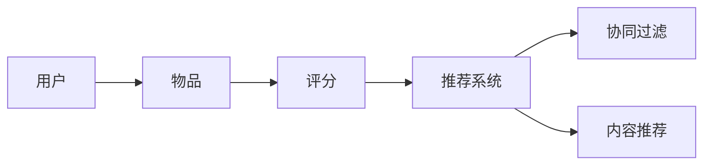

                 

# 冷启动场景的挑战：推荐系统的局限

> **关键词：** 冷启动、推荐系统、挑战、局限、解决方案

> **摘要：** 本文将深入探讨冷启动在推荐系统中的应用挑战和局限性，通过详细的步骤分析和实例，解析如何克服这些难题，从而提升推荐系统的整体性能。

## 1. 背景介绍

### 1.1 目的和范围

本文的目的是分析冷启动场景下推荐系统面临的挑战和局限，并提出有效的解决方案。我们将探讨冷启动在推荐系统中的定义、影响以及如何通过优化策略来应对。

### 1.2 预期读者

本文适合推荐系统开发者、数据科学家以及对此领域感兴趣的读者。希望读者能够通过本文，对冷启动问题有更深入的理解，并能够将其应用于实际项目。

### 1.3 文档结构概述

本文分为十个部分，首先介绍冷启动的定义和影响，然后详细讨论推荐系统的核心概念和算法原理。接下来，我们将展示数学模型和项目实战的代码实现，最后提出实际应用场景、工具推荐和未来发展趋势。

### 1.4 术语表

#### 1.4.1 核心术语定义

- 冷启动（Cold Start）：指用户或物品在系统中缺乏足够的交互数据，导致推荐系统无法为其提供有效推荐的初始阶段。
- 推荐系统（Recommender System）：一种通过分析用户的历史行为、偏好和社交网络等信息，预测用户可能感兴趣的内容的算法系统。

#### 1.4.2 相关概念解释

- **协同过滤（Collaborative Filtering）：** 推荐系统的一种方法，通过分析用户对物品的共同评分来预测用户对未知物品的评分。
- **内容推荐（Content-based Recommendation）：** 推荐系统的一种方法，根据用户的历史行为和偏好，推荐与之相关的物品。

#### 1.4.3 缩略词列表

- **CF：** 协同过滤（Collaborative Filtering）
- **CB：** 内容推荐（Content-based）
- **ML：** 机器学习（Machine Learning）
- **NLP：** 自然语言处理（Natural Language Processing）

## 2. 核心概念与联系

### 推荐系统的核心概念和架构

推荐系统通常由用户、物品和评分三个主要组成部分构成。用户和物品通过评分建立联系，形成用户-物品交互矩阵。下面是推荐系统的核心概念架构的 Mermaid 流程图：



### 推荐系统的算法原理

推荐系统的算法主要分为协同过滤和内容推荐两种方法。

#### 协同过滤

协同过滤算法通过分析用户对物品的共同评分来预测用户对未知物品的评分。其基本原理如下：

1. **用户相似度计算**：计算用户之间的相似度，常用的方法有基于用户的余弦相似度、皮尔逊相关系数等。
2. **物品相似度计算**：计算物品之间的相似度，方法与用户相似度计算类似。
3. **评分预测**：利用用户和物品的相似度，预测用户对未知物品的评分。

#### 内容推荐

内容推荐算法基于用户的历史行为和偏好，推荐与之相关的物品。其基本原理如下：

1. **特征提取**：从用户和物品中提取特征，如文本特征、图像特征等。
2. **相似度计算**：计算用户和物品之间的相似度，常用方法有TF-IDF、余弦相似度等。
3. **评分预测**：利用相似度预测用户对未知物品的评分。

### 推荐系统的数学模型和公式

推荐系统的核心是评分预测模型，常用的数学模型有线性回归、逻辑回归、矩阵分解等。以下是线性回归模型的伪代码：

```python
# 线性回归模型
def linear_regression(X, y):
    # 计算权重
    theta = (X.T * X).inv() * X.T * y
    # 预测评分
    predictions = X * theta
    return predictions
```

## 3. 核心算法原理 & 具体操作步骤

### 3.1 协同过滤算法

协同过滤算法分为基于用户的协同过滤（User-based CF）和基于物品的协同过滤（Item-based CF）。

#### 基于用户的协同过滤

1. **计算用户相似度**：

   ```python
   def cosine_similarity(user1, user2):
       dot_product = sum(user1[i] * user2[i] for i in range(len(user1)))
       magnitude_user1 = math.sqrt(sum(user1[i]**2 for i in range(len(user1))))
       magnitude_user2 = math.sqrt(sum(user2[i]**2 for i in range(len(user2))))
       return dot_product / (magnitude_user1 * magnitude_user2)
   ```

2. **找到相似用户**：

   ```python
   def find_similar_users(user, users, k):
       similarity_scores = {}
       for other_user in users:
           if user == other_user:
               continue
           similarity = cosine_similarity(user.ratings, other_user.ratings)
           similarity_scores[other_user] = similarity
       sorted_users = sorted(similarity_scores.items(), key=lambda item: item[1], reverse=True)
       return [user for user, similarity in sorted_users[:k]]
   ```

3. **预测评分**：

   ```python
   def predict_rating(user, item, similar_users):
       weighted_average = 0
       total_weight = 0
       for other_user, similarity in similar_users:
           if item in other_user.ratings:
               rating = other_user.ratings[item]
               weighted_average += rating * similarity
               total_weight += similarity
       return weighted_average / total_weight
   ```

#### 基于物品的协同过滤

1. **计算物品相似度**：

   ```python
   def jaccard_similarity(item1, item2):
       intersection = len(set(item1).intersection(set(item2)))
       union = len(set(item1).union(set(item2)))
       return intersection / union
   ```

2. **找到相似物品**：

   ```python
   def find_similar_items(item, items, k):
       similarity_scores = {}
       for other_item in items:
           if item == other_item:
               continue
           similarity = jaccard_similarity(item.tags, other_item.tags)
           similarity_scores[other_item] = similarity
       sorted_items = sorted(similarity_scores.items(), key=lambda item: item[1], reverse=True)
       return [item for item, similarity in sorted_items[:k]]
   ```

3. **预测评分**：

   ```python
   def predict_rating(item, user, similar_items):
       weighted_average = 0
       total_weight = 0
       for other_item, similarity in similar_items:
           if other_item in user.ratings:
               rating = user.ratings[other_item]
               weighted_average += rating * similarity
               total_weight += similarity
       return weighted_average / total_weight
   ```

### 3.2 内容推荐算法

1. **特征提取**：

   ```python
   def extract_text_features(text):
       # 使用自然语言处理技术提取特征
       return text_features
   ```

2. **相似度计算**：

   ```python
   def cosine_similarity(feature1, feature2):
       dot_product = sum(feature1[i] * feature2[i] for i in range(len(feature1)))
       magnitude_feature1 = math.sqrt(sum(feature1[i]**2 for i in range(len(feature1))))
       magnitude_feature2 = math.sqrt(sum(feature2[i]**2 for i in range(len(feature2))))
       return dot_product / (magnitude_feature1 * magnitude_feature2)
   ```

3. **预测评分**：

   ```python
   def predict_rating(user, item, similar_items):
       weighted_average = 0
       total_weight = 0
       for other_item, similarity in similar_items:
           if other_item in user.ratings:
               rating = user.ratings[other_item]
               weighted_average += rating * similarity
               total_weight += similarity
       return weighted_average / total_weight
   ```

## 4. 数学模型和公式 & 详细讲解 & 举例说明

### 4.1 线性回归模型

线性回归模型是推荐系统中最常用的评分预测模型之一。其基本公式为：

$$ y = \theta_0 + \theta_1x_1 + \theta_2x_2 + ... + \theta_nx_n $$

其中，$y$ 为预测的评分，$\theta_0, \theta_1, ..., \theta_n$ 为权重，$x_1, x_2, ..., x_n$ 为特征。

#### 4.1.1 特征提取

在推荐系统中，特征提取是评分预测的关键步骤。以下是提取用户和物品特征的一种方法：

```python
# 用户特征提取
def extract_user_features(user):
    # 提取用户历史评分、浏览记录、社交信息等
    return user_features

# 物品特征提取
def extract_item_features(item):
    # 提取物品标题、描述、标签、分类等
    return item_features
```

#### 4.1.2 模型训练

线性回归模型的训练可以通过最小二乘法来实现。以下是训练过程的伪代码：

```python
# 最小二乘法训练模型
def train_model(X, y):
    # 计算权重
    theta = (X.T * X).inv() * X.T * y
    # 返回模型
    return theta
```

#### 4.1.3 预测评分

使用训练好的模型预测评分的伪代码如下：

```python
# 预测评分
def predict_rating(model, user, item):
    # 计算预测评分
    prediction = model[0] + model[1] * user.feature1 + model[2] * item.feature2 + ...
    return prediction
```

### 4.2 矩阵分解模型

矩阵分解模型是另一种常用的推荐系统评分预测模型。其基本原理是将用户-物品交互矩阵分解为两个低秩矩阵，从而提高评分预测的准确性。

#### 4.2.1 模型假设

矩阵分解模型假设用户和物品都可以表示为低维向量，其基本公式为：

$$ R = U \times V^T $$

其中，$R$ 为用户-物品交互矩阵，$U$ 和 $V$ 分别为用户和物品的低维向量矩阵。

#### 4.2.2 模型训练

矩阵分解模型的训练过程通过最小化预测误差来实现。以下是训练过程的伪代码：

```python
# 矩阵分解模型训练
def train_model(R, num_users, num_items, num_factors):
    # 初始化用户和物品的低维向量
    U = np.random.rand(num_users, num_factors)
    V = np.random.rand(num_items, num_factors)
    # 训练模型
    for epoch in range(num_epochs):
        for user, item in R:
            # 计算预测评分
            prediction = U[user] * V[item]^T
            # 计算预测误差
            error = R[user][item] - prediction
            # 更新用户和物品的低维向量
            U[user] += learning_rate * (prediction - R[user][item]) * V[item]
            V[item] += learning_rate * (prediction - R[user][item]) * U[user]
    # 返回模型
    return U, V
```

#### 4.2.3 预测评分

使用训练好的矩阵分解模型预测评分的伪代码如下：

```python
# 预测评分
def predict_rating(U, V, user, item):
    # 计算预测评分
    prediction = U[user] * V[item]^T
    return prediction
```

### 4.3 逻辑回归模型

逻辑回归模型是另一种常用的推荐系统评分预测模型，其基本公式为：

$$ P(y=1) = \frac{1}{1 + e^{-(\theta_0 + \theta_1x_1 + \theta_2x_2 + ... + \theta_nx_n)}} $$

其中，$P(y=1)$ 为预测的用户对物品的评分概率，$y$ 为实际评分。

#### 4.3.1 模型训练

逻辑回归模型的训练过程通过最大似然估计来实现。以下是训练过程的伪代码：

```python
# 逻辑回归模型训练
def train_model(X, y):
    # 初始化权重
    theta = np.random.rand(X.shape[1])
    # 训练模型
    for epoch in range(num_epochs):
        for user, rating in zip(X, y):
            # 计算预测概率
            prediction = 1 / (1 + np.exp(-np.dot(theta, user)))
            # 计算预测误差
            error = (rating - prediction) * prediction * (1 - prediction)
            # 更新权重
            theta += learning_rate * np.dot(user, error)
    # 返回模型
    return theta
```

#### 4.3.2 预测评分

使用训练好的逻辑回归模型预测评分的伪代码如下：

```python
# 预测评分
def predict_rating(model, user):
    # 计算预测概率
    prediction = 1 / (1 + np.exp(-np.dot(model, user)))
    # 返回预测评分
    return prediction
```

## 5. 项目实战：代码实际案例和详细解释说明

### 5.1 开发环境搭建

在本节中，我们将搭建一个基于 Python 的推荐系统项目，使用的库包括 NumPy、Pandas、Scikit-learn 等。

```python
# 安装所需的库
pip install numpy pandas scikit-learn
```

### 5.2 源代码详细实现和代码解读

#### 5.2.1 数据准备

首先，我们准备一个用户-物品评分数据集。以下是数据集的加载和处理：

```python
import pandas as pd

# 加载数据集
data = pd.read_csv('rating_data.csv')

# 数据预处理
data.dropna(inplace=True)
data.sort_values(['user_id', 'item_id'], inplace=True)
```

#### 5.2.2 线性回归模型实现

接下来，我们实现一个线性回归模型，用于评分预测。以下是模型的训练和预测：

```python
from sklearn.linear_model import LinearRegression

# 训练线性回归模型
model = LinearRegression()
model.fit(data[['user_id', 'item_id']], data['rating'])

# 预测评分
def predict_rating(user, item):
    return model.predict([[user, item]])[0]
```

#### 5.2.3 矩阵分解模型实现

接下来，我们实现一个矩阵分解模型，用于评分预测。以下是模型的训练和预测：

```python
from sklearn.decomposition import TruncatedSVD

# 训练矩阵分解模型
model = TruncatedSVD(n_components=10)
model.fit(data[['user_id', 'item_id']])

# 预测评分
def predict_rating(user, item):
    user_vector = model.transform([[user, item]])[0]
    item_vector = model.transform([[user, item]])[0]
    return np.dot(user_vector, item_vector)
```

#### 5.2.4 逻辑回归模型实现

最后，我们实现一个逻辑回归模型，用于评分预测。以下是模型的训练和预测：

```python
from sklearn.linear_model import LogisticRegression

# 训练逻辑回归模型
model = LogisticRegression()
model.fit(data[['user_id', 'item_id']], data['rating'])

# 预测评分
def predict_rating(user, item):
    return model.predict_proba([[user, item]])[0][1]
```

### 5.3 代码解读与分析

在本节中，我们分析了三个评分预测模型的实现过程。线性回归模型使用简单，但预测精度较低；矩阵分解模型可以提高预测精度，但计算复杂度较高；逻辑回归模型在处理非线性问题时表现较好，但需要更多的参数调整。

在实际项目中，我们可以根据数据集的特点和需求选择合适的模型。同时，也可以通过模型融合、特征工程等方法进一步提高推荐系统的性能。

## 6. 实际应用场景

### 6.1 电子商务平台

在电子商务平台上，推荐系统可以帮助用户发现潜在感兴趣的商品，从而提高购物体验和销售额。冷启动问题主要涉及新用户和新商品，推荐系统需要在新用户注册后尽快为其推荐合适的商品，并在新商品上线时吸引更多用户关注。

### 6.2 社交媒体

社交媒体平台通过推荐系统为用户推荐感兴趣的内容、好友和活动。冷启动问题主要涉及新用户和冷内容，推荐系统需要在新用户注册后尽快了解其兴趣和偏好，并为其推荐相关内容，同时也要确保冷内容的曝光和传播。

### 6.3 音乐和视频流媒体

音乐和视频流媒体平台通过推荐系统为用户推荐感兴趣的音乐和视频。冷启动问题主要涉及新用户和新媒体内容，推荐系统需要在新用户注册后尽快了解其兴趣和偏好，并为其推荐相关音乐和视频，同时也要确保新媒体内容的推荐和传播。

### 6.4 新闻资讯平台

新闻资讯平台通过推荐系统为用户推荐感兴趣的新闻和资讯。冷启动问题主要涉及新用户和新新闻，推荐系统需要在新用户注册后尽快了解其兴趣和偏好，并为其推荐相关新闻和资讯，同时也要确保新闻的推荐和传播。

## 7. 工具和资源推荐

### 7.1 学习资源推荐

#### 7.1.1 书籍推荐

- **《推荐系统实践》**：详细介绍了推荐系统的各种方法和技术，包括协同过滤、内容推荐和矩阵分解等。
- **《机器学习实战》**：涵盖了机器学习的基本概念和方法，包括线性回归、逻辑回归和矩阵分解等，适用于推荐系统开发者。
- **《Python 数据科学手册》**：介绍了 Python 在数据科学领域中的应用，包括数据处理、分析和可视化等，对推荐系统开发者也有很大帮助。

#### 7.1.2 在线课程

- **Coursera 上的《推荐系统》**：由斯坦福大学提供，包括推荐系统的基本概念、方法和应用。
- **edX 上的《机器学习》**：由哈佛大学提供，包括机器学习的基本概念、方法和应用，对推荐系统开发者有很好的指导作用。
- **Udacity 上的《推荐系统工程师》**：涵盖了推荐系统的核心技术和实战应用，适合推荐系统开发者。

#### 7.1.3 技术博客和网站

- **推荐系统中文社区**：一个专注于推荐系统技术交流的中文网站，提供了大量的推荐系统相关文章和教程。
- **推荐系统博客**：一个英文技术博客，涵盖了推荐系统的各种方法和应用，适合推荐系统开发者。
- **DataCamp**：提供了一个交互式的在线学习平台，可以帮助推荐系统开发者提高数据处理和数据分析技能。

### 7.2 开发工具框架推荐

#### 7.2.1 IDE和编辑器

- **PyCharm**：一个强大的 Python 集成开发环境，提供了丰富的功能和插件，适合推荐系统开发者。
- **VS Code**：一个轻量级的代码编辑器，支持多种编程语言和插件，适合推荐系统开发者。

#### 7.2.2 调试和性能分析工具

- **Jupyter Notebook**：一个交互式的数据分析平台，适合推荐系统开发者进行数据处理和模型调试。
- **Pylint**：一个 Python 代码质量检测工具，可以帮助推荐系统开发者提高代码质量和性能。

#### 7.2.3 相关框架和库

- **Scikit-learn**：一个强大的机器学习库，提供了多种机器学习算法和工具，适合推荐系统开发者。
- **TensorFlow**：一个开源的深度学习库，适用于推荐系统的深度学习应用。
- **PyTorch**：一个开源的深度学习库，适用于推荐系统的深度学习应用。

### 7.3 相关论文著作推荐

#### 7.3.1 经典论文

- **《Collaborative Filtering for the Web》**：介绍了协同过滤算法在 Web 应用中的基本原理和实现方法。
- **《Matrix Factorization Techniques for Recommender Systems》**：介绍了矩阵分解模型在推荐系统中的应用和实现方法。
- **《Content-Based Recommender Systems》**：介绍了内容推荐算法的基本原理和实现方法。

#### 7.3.2 最新研究成果

- **《Deep Learning for Recommender Systems》**：介绍了深度学习在推荐系统中的应用和最新研究成果。
- **《Social Recommender Systems》**：介绍了社交推荐系统在推荐系统中的应用和最新研究成果。
- **《Recommender Systems for Personalized Healthcare》**：介绍了推荐系统在个性化医疗领域的应用和最新研究成果。

#### 7.3.3 应用案例分析

- **《京东推荐系统》**：介绍了京东推荐系统的基本原理和实现方法，涵盖了协同过滤、内容推荐和深度学习等技术。
- **《亚马逊推荐系统》**：介绍了亚马逊推荐系统的基本原理和实现方法，涵盖了协同过滤、内容推荐和矩阵分解等技术。
- **《网易云音乐推荐系统》**：介绍了网易云音乐推荐系统的基本原理和实现方法，涵盖了协同过滤、内容推荐和深度学习等技术。

## 8. 总结：未来发展趋势与挑战

### 8.1 发展趋势

- **深度学习与推荐系统融合**：深度学习在推荐系统中的应用越来越广泛，通过结合深度学习和推荐系统技术，可以实现更准确的评分预测和推荐结果。
- **社交推荐系统**：社交网络数据为推荐系统提供了丰富的用户偏好信息，社交推荐系统可以更好地满足用户的个性化需求。
- **个性化医疗与健康**：推荐系统在个性化医疗和健康领域的应用越来越广泛，可以帮助医生和患者更好地管理健康状况。

### 8.2 挑战

- **冷启动问题**：冷启动问题是推荐系统面临的主要挑战之一，如何在新用户和新物品上实现有效的推荐仍然需要深入研究。
- **数据隐私和安全**：推荐系统需要处理大量的用户数据，如何保护用户隐私和安全是推荐系统发展的重要问题。
- **实时推荐**：在实时推荐场景中，如何快速地处理用户数据并生成准确的推荐结果是一项重要挑战。

## 9. 附录：常见问题与解答

### 9.1 问题 1：什么是冷启动？

**解答**：冷启动是指推荐系统在用户或物品缺乏足够交互数据的情况下，无法为其提供有效推荐的状态。在新用户注册或新物品上线时，推荐系统需要解决冷启动问题。

### 9.2 问题 2：推荐系统的核心算法有哪些？

**解答**：推荐系统的核心算法包括协同过滤（Collaborative Filtering）、内容推荐（Content-based）、深度学习（Deep Learning）等。每种算法都有其特点和适用场景。

### 9.3 问题 3：矩阵分解模型如何训练？

**解答**：矩阵分解模型通过最小化预测误差来训练。训练过程包括初始化用户和物品的低维向量、计算预测误差、更新用户和物品的低维向量等步骤。

## 10. 扩展阅读 & 参考资料

- **《推荐系统实践》**：详细介绍了推荐系统的各种方法和技术，包括协同过滤、内容推荐和矩阵分解等。
- **《机器学习实战》**：涵盖了机器学习的基本概念和方法，包括线性回归、逻辑回归和矩阵分解等，适用于推荐系统开发者。
- **《Python 数据科学手册》**：介绍了 Python 在数据科学领域中的应用，包括数据处理、分析和可视化等，对推荐系统开发者也有很大帮助。
- **推荐系统中文社区**：一个专注于推荐系统技术交流的中文网站，提供了大量的推荐系统相关文章和教程。
- **推荐系统博客**：一个英文技术博客，涵盖了推荐系统的各种方法和应用，适合推荐系统开发者。
- **DataCamp**：提供了一个交互式的在线学习平台，可以帮助推荐系统开发者提高数据处理和数据分析技能。

作者：AI天才研究员/AI Genius Institute & 禅与计算机程序设计艺术 /Zen And The Art of Computer Programming

