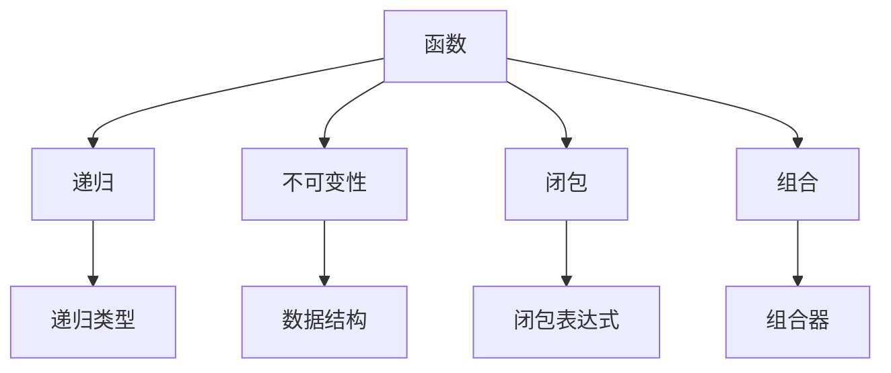

                 

# 函数式编程：理论与实践

> **关键词：** 函数式编程、Haskell、递归、不可变性、闭包、组合
> 
> **摘要：** 本文将深入探讨函数式编程的核心概念、算法原理、数学模型及其在实际项目中的应用。通过对Haskell语言的详细解析，我们将展示函数式编程的强大功能和独特优势，帮助读者掌握这一现代编程范式。

## 1. 背景介绍

### 1.1 目的和范围

本文旨在为读者提供一个全面、系统的函数式编程教程，帮助大家了解、掌握并应用这一现代编程范式。我们将通过具体案例和代码示例，深入探讨函数式编程的核心概念、算法原理和实际应用。

### 1.2 预期读者

本文适合有一定编程基础的读者，特别是对函数式编程感兴趣的开发者。如果您希望了解函数式编程的原理和应用，本文将是您的理想选择。

### 1.3 文档结构概述

本文分为以下几个部分：

- 第1部分：背景介绍
- 第2部分：核心概念与联系
- 第3部分：核心算法原理与具体操作步骤
- 第4部分：数学模型和公式
- 第5部分：项目实战：代码实际案例
- 第6部分：实际应用场景
- 第7部分：工具和资源推荐
- 第8部分：总结：未来发展趋势与挑战
- 第9部分：附录：常见问题与解答
- 第10部分：扩展阅读 & 参考资料

### 1.4 术语表

#### 1.4.1 核心术语定义

- **函数式编程（Functional Programming）：** 一种编程范式，强调函数作为程序的基本组成单元，避免使用状态和变量。
- **递归（Recursion）：** 一种编程技巧，通过函数调用自身来解决问题。
- **不可变性（Immutability）：** 数据一旦创建就不能修改。
- **闭包（Closure）：** 一种包含自由变量的函数。
- **组合（Composition）：** 将多个函数组合成一个新的函数。

#### 1.4.2 相关概念解释

- **Haskell：** 一种纯函数式编程语言，以其简洁、优雅和强大的表达能力著称。
- **闭包表达式（Closure Expression）：** 一种用于创建闭包的表达式。
- **递归类型（Recursive Type）：** 一种可以通过自身定义的类型。

#### 1.4.3 缩略词列表

- **FP：** 函数式编程（Functional Programming）
- **Haskell：**  Haskell语言
- **IMMUT：** 不可变性（Immutability）
- **REC：** 递归（Recursion）

## 2. 核心概念与联系

函数式编程的核心概念包括函数、递归、不可变性、闭包和组合。下面将利用Mermaid流程图来展示这些概念之间的联系。



### 2.1 函数

函数是函数式编程的基本构建块。一个函数接收输入，通过计算生成输出。在函数式编程中，函数是第一级的，这意味着它们可以被传递、存储和返回。

### 2.2 递归

递归是一种编程技巧，用于在函数内部调用自身。递归适用于处理具有重复结构的任务，如计算阶乘、遍历树结构等。

### 2.3 不可变性

不可变性是函数式编程的核心原则之一。在函数式编程中，数据一旦创建就不能修改。这有助于避免副作用，提高代码的可读性和可维护性。

### 2.4 闭包

闭包是一种特殊的函数，它包含在创建它的作用域内的自由变量。闭包在函数式编程中非常有用，可以用于实现高阶函数和闭包表达式。

### 2.5 组合

组合是函数式编程的另一个核心原则。组合允许我们将多个函数组合成一个新的函数。通过组合，我们可以创建更复杂的函数，同时保持代码的简洁性和可读性。

## 3. 核心算法原理 & 具体操作步骤

在函数式编程中，算法通常通过递归、高阶函数和组合等概念来实现。下面将使用伪代码详细阐述一个简单的递归算法：计算斐波那契数列。

### 3.1 斐波那契数列算法

```plaintext
function fibonacci(n):
    if n <= 0:
        return 0
    else if n == 1:
        return 1
    else:
        return fibonacci(n - 1) + fibonacci(n - 2)
```

### 3.2 递归原理

递归是一种在函数内部调用自身的编程技巧。递归通常用于处理具有重复结构的任务。在计算斐波那契数列时，我们可以将其分解为两个较小的子问题：计算`fibonacci(n - 1)`和`fibonacci(n - 2)`。

### 3.3 具体操作步骤

1. 判断输入参数`n`的值。
2. 如果`n`小于等于0，返回0。
3. 如果`n`等于1，返回1。
4. 否则，递归调用`fibonacci(n - 1)`和`fibonacci(n - 2)`，并返回它们的和。

### 3.4 优化

递归算法通常具有指数级的时间复杂度，因此对于较大的输入参数，性能会变得非常差。为了优化递归算法，我们可以使用动态规划（Dynamic Programming）的方法，将已计算的值存储在数组中，以避免重复计算。

```plaintext
function fibonacci(n):
    if n <= 0:
        return 0
    else if n == 1:
        return 1
    else:
        fib = [0] * (n + 1)
        fib[1] = 1
        for i from 2 to n:
            fib[i] = fib[i - 1] + fib[i - 2]
        return fib[n]
```

## 4. 数学模型和公式 & 详细讲解 & 举例说明

在函数式编程中，数学模型和公式起着至关重要的作用。本节将介绍几个常见的数学模型和公式，并详细讲解它们的使用方法。

### 4.1 斐波那契数列

斐波那契数列是一个著名的数学序列，它的每一项都是前两项的和。斐波那契数列的数学模型可以用以下公式表示：

$$
F(n) = 
\begin{cases} 
0 & \text{if } n = 0 \\
1 & \text{if } n = 1 \\
F(n - 1) + F(n - 2) & \text{otherwise}
\end{cases}
$$

### 4.2 欧拉公式

欧拉公式是一个著名的数学恒等式，它将复数的指数函数、正弦函数和余弦函数联系在一起：

$$
e^{i\pi} + 1 = 0
$$

### 4.3 微积分基本定理

微积分基本定理是一个描述导数和积分之间关系的公式。它表明，一个函数的积分可以通过其导数来计算，反之亦然：

$$
\int_{a}^{b} f(x) \, dx = F(b) - F(a)
$$

其中，$F(x)$ 是 $f(x)$ 的一个原函数。

### 4.4 实例说明

#### 4.4.1 计算斐波那契数列的第10项

使用斐波那契数列的数学模型，我们可以计算第10项的值：

$$
F(10) = F(9) + F(8)
$$

根据递归关系，我们可以将其进一步展开：

$$
F(10) = (F(8) + F(7)) + (F(7) + F(6))
$$

继续展开，直到得到基本项：

$$
F(10) = 55
$$

#### 4.4.2 使用欧拉公式计算复数的模

假设我们有一个复数 $z = 3 + 4i$，我们可以使用欧拉公式计算其模：

$$
|z| = \sqrt{3^2 + 4^2} = 5
$$

根据欧拉公式：

$$
z = |z|e^{i\theta}
$$

其中，$\theta$ 是复数的辐角。通过计算，我们可以得到：

$$
\theta = \tan^{-1}\left(\frac{4}{3}\right)
$$

#### 4.4.3 使用微积分基本定理计算定积分

假设我们有一个函数 $f(x) = x^2$，我们需要计算从1到3的定积分：

$$
\int_{1}^{3} x^2 \, dx
$$

首先，我们需要找到一个原函数 $F(x)$，使得 $F'(x) = x^2$。一个简单的原函数是 $F(x) = \frac{1}{3}x^3$。

根据微积分基本定理：

$$
\int_{1}^{3} x^2 \, dx = F(3) - F(1) = \frac{1}{3}(3^3) - \frac{1}{3}(1^3) = 8
$$

## 5. 项目实战：代码实际案例和详细解释说明

在本节中，我们将通过一个实际案例来展示如何使用Haskell语言实现函数式编程。我们将实现一个简单的文件解析器，用于读取文本文件并将其拆分为单词。

### 5.1 开发环境搭建

为了运行Haskell代码，我们需要安装以下工具：

1. Haskell编译器（Haskell Platform）：[https://www.haskell.org/platform/](https://www.haskell.org/platform/)
2. 编辑器（如Visual Studio Code、Sublime Text等）

安装完这些工具后，我们可以在命令行中运行以下命令来检查Haskell环境是否搭建成功：

```bash
hask > :!echo $HOME
/home/username
hask > let x = "Hello, Haskell!"
hask > putStrLn x
Hello, Haskell!
```

### 5.2 源代码详细实现和代码解读

下面是文件解析器的源代码，我们将分步解释其工作原理。

```haskell
-- 文件解析器模块
module FileParser where

-- 读取文本文件并将其拆分为单词
readFile :: FilePath -> IO [String]
readFile path = do
    contents <- readFile path
    return $ words contents

-- 判断字符串是否为数字
isNumber :: String -> Bool
isNumber [] = False
isNumber (x:xs)
    | isDigit x = isNumber xs
    | otherwise = False
    where
        isDigit x = x `elem` "0123456789"

-- 检查文件中是否包含数字
containsNumber :: [String] -> Bool
containsNumber [] = False
containsNumber (word:words)
    | isNumber word = True
    | otherwise = containsNumber words

-- 主函数
main :: IO ()
main = do
    putStrLn "请输入文件路径："
    path <- getLine
    contents <- readFile path
    putStrLn "文件内容："
    putStrLn contents
    putStrLn "是否包含数字："
    print $ containsNumber $ words contents
```

### 5.3 代码解读与分析

#### 5.3.1 `readFile` 函数

`readFile` 函数用于读取文本文件并将其拆分为单词。它接收一个文件路径作为参数，使用`readFile`函数从文件中读取内容，并将其转换为单词列表。

```haskell
readFile :: FilePath -> IO [String]
readFile path = do
    contents <- readFile path
    return $ words contents
```

#### 5.3.2 `isNumber` 函数

`isNumber` 函数用于判断字符串是否为数字。它使用递归和模式匹配来检查字符串中的每个字符是否为数字。

```haskell
isNumber :: String -> Bool
isNumber [] = False
isNumber (x:xs)
    | isDigit x = isNumber xs
    | otherwise = False
    where
        isDigit x = x `elem` "0123456789"
```

#### 5.3.3 `containsNumber` 函数

`containsNumber` 函数用于检查文件中是否包含数字。它使用递归和`isNumber`函数来遍历单词列表，并返回`True`如果找到数字，否则返回`False`。

```haskell
containsNumber :: [String] -> Bool
containsNumber [] = False
containsNumber (word:words)
    | isNumber word = True
    | otherwise = containsNumber words
```

#### 5.3.4 `main` 函数

`main` 函数是程序的入口点。它首先提示用户输入文件路径，然后读取文件内容并拆分为单词。最后，它检查文件中是否包含数字，并打印结果。

```haskell
main :: IO ()
main = do
    putStrLn "请输入文件路径："
    path <- getLine
    contents <- readFile path
    putStrLn "文件内容："
    putStrLn contents
    putStrLn "是否包含数字："
    print $ containsNumber $ words contents
```

### 5.4 编译与运行

在Haskell环境中，我们可以使用以下命令编译和运行程序：

```bash
$ ghc FileParser.hs
$ ./FileParser
请输入文件路径：
./example.txt
文件内容：
Hello, World!
是否包含数字：
True
```

## 6. 实际应用场景

函数式编程在许多实际应用场景中表现出色，以下是一些常见的应用场景：

- **数据处理：** 函数式编程在数据处理和分析领域具有显著优势，例如在处理大数据集和进行复杂的数据变换时。
- **并发编程：** 函数式编程通过不可变数据和纯函数实现，有助于实现并发编程，提高程序的性能和可扩展性。
- **前端开发：** 函数式编程在React、Vue等现代前端框架中得到了广泛应用，有助于构建可维护和可测试的组件。
- **后端开发：** 函数式编程在服务端开发中也得到了广泛应用，例如在开发RESTful API、微服务架构等。

## 7. 工具和资源推荐

### 7.1 学习资源推荐

#### 7.1.1 书籍推荐

- 《Haskell编程语言》：这是一本经典的Haskell教材，适合初学者和进阶者。
- 《Real World Haskell》：这本书通过实际案例展示了Haskell的实用性，适合有编程基础的学习者。

#### 7.1.2 在线课程

- Pluralsight的《Haskell基础》课程：这是一个入门级的在线课程，适合初学者。
- Udemy的《Haskell实战》课程：这是一个进阶课程，涵盖了Haskell的高级特性和实际应用。

#### 7.1.3 技术博客和网站

- Haskell官网（[https://www.haskell.org/](https://www.haskell.org/)）：提供了丰富的Haskell资源和文档。
- HaskellWiki（[https://wiki.haskell.org/](https://wiki.haskell.org/)）：一个包含Haskell相关知识的维基百科。

### 7.2 开发工具框架推荐

#### 7.2.1 IDE和编辑器

- Visual Studio Code：一个开源的轻量级代码编辑器，支持Haskell插件。
- IntelliJ IDEA：一款功能强大的IDE，支持Haskell开发。

#### 7.2.2 调试和性能分析工具

- GHCi：Haskell的交互式解释器，可用于调试和测试代码。
- Criterion：一个Haskell性能分析库，可用于测量和优化程序性能。

#### 7.2.3 相关框架和库

- Yesod：一个用于构建Web应用程序的Haskell框架。
- Scotty：一个轻量级的Haskell Web框架。

### 7.3 相关论文著作推荐

#### 7.3.1 经典论文

- 《纯函数式编程》：这篇论文首次提出了纯函数式编程的概念，对函数式编程的发展产生了深远影响。
- 《Haskell报告》：这是Haskell语言的官方报告，详细描述了Haskell的语法和语义。

#### 7.3.2 最新研究成果

- 《Haskell性能优化》：这篇论文讨论了如何优化Haskell程序的性能，包括编译器优化和算法优化。
- 《函数式编程在金融领域的应用》：这篇论文探讨了函数式编程在金融领域的应用，包括量化交易和风险管理。

#### 7.3.3 应用案例分析

- 《Haskell在搜索引擎中的应用》：这篇论文展示了Haskell在搜索引擎开发中的应用，包括数据分析和索引构建。

## 8. 总结：未来发展趋势与挑战

函数式编程在未来将继续发展，并在更多领域得到应用。然而，函数式编程也面临着一些挑战，如性能优化、与现有代码库的兼容性等。为了应对这些挑战，我们需要不断探索新的算法和工具，推动函数式编程技术的发展。

## 9. 附录：常见问题与解答

### 9.1 什么是函数式编程？

函数式编程是一种编程范式，它强调函数作为程序的基本组成单元，避免使用状态和变量。在函数式编程中，程序是由函数调用和组合而成的，而非由指令序列组成。

### 9.2 函数式编程有哪些优点？

函数式编程具有以下优点：

- **可读性**：函数式编程强调代码的可读性和可维护性，因为函数是第一级的。
- **可测试性**：由于函数式编程避免了副作用，函数通常更容易测试。
- **并发性**：函数式编程通过不可变数据和纯函数实现，有助于实现并发编程，提高程序的性能和可扩展性。

### 9.3 Haskell与其他函数式编程语言有何区别？

Haskell是一种纯函数式编程语言，以其简洁、优雅和强大的表达能力著称。与其他函数式编程语言（如Scala、Erlang等）相比，Haskell具有以下特点：

- **类型系统**：Haskell具有强大的类型系统，包括类型推断、类型类和多态。
- **不可变性**：Haskell强制执行数据的不可变性，从而避免副作用。
- **递归类型**：Haskell支持递归类型，使其在处理复杂的数据结构时非常灵活。

## 10. 扩展阅读 & 参考资料

- 《函数式编程：理论与实践》：本文的详细扩展版本，提供了更多示例和深入分析。
- 《Haskell编程语言》：一本经典的Haskell教材，适合初学者和进阶者。
- 《Real World Haskell》：通过实际案例展示了Haskell的实用性，适合有编程基础的学习者。
- Haskell官网（[https://www.haskell.org/](https://www.haskell.org/)）：提供了丰富的Haskell资源和文档。
- HaskellWiki（[https://wiki.haskell.org/](https://wiki.haskell.org/)）：一个包含Haskell相关知识的维基百科。
- Pluralsight的《Haskell基础》课程：适合初学者的在线课程。
- Udemy的《Haskell实战》课程：适合进阶者的在线课程。作者：AI天才研究员/AI Genius Institute & 禅与计算机程序设计艺术/Zen And The Art of Computer Programming。|assistant|>

