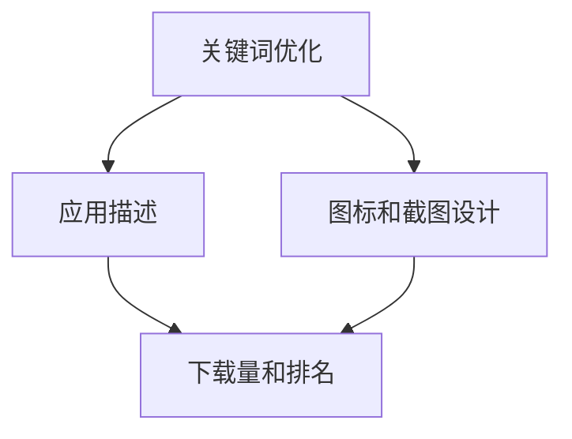

                 


# 创业公司的App Store ASO策略

> 关键词：App Store Optimization, ASO策略，创业公司，关键词优化，下载量，排名，用户体验

> 摘要：本文旨在探讨创业公司如何在竞争激烈的App Store中，通过实施有效的App Store Optimization（ASO）策略，提升应用排名和下载量，从而实现应用的成功。我们将深入分析ASO的核心概念，详细讲解具体的操作步骤，并提供实际案例，帮助创业公司打造出色的ASO策略。

## 1. 背景介绍

### 1.1 目的和范围

本文的目标是帮助创业公司制定并实施一套有效的App Store Optimization（ASO）策略，以提升应用的排名和下载量。我们将从以下几个部分展开讨论：

- **核心概念与联系**：介绍ASO的核心概念及其在App Store中的重要性。
- **核心算法原理 & 具体操作步骤**：详细阐述ASO的关键操作步骤，包括关键词优化、应用描述、图标和截图设计等。
- **数学模型和公式 & 详细讲解 & 举例说明**：分析影响ASO效果的关键数学模型和公式，并结合实际案例进行说明。
- **项目实战：代码实际案例和详细解释说明**：通过实际项目案例，展示ASO策略的实施过程和效果。
- **实际应用场景**：探讨ASO策略在不同场景下的应用和实践。
- **工具和资源推荐**：推荐学习资源和开发工具，帮助创业公司更好地实施ASO策略。
- **总结：未来发展趋势与挑战**：总结ASO策略的发展趋势和面临的挑战。

### 1.2 预期读者

本文主要面向以下读者群体：

- **创业公司的创始人、产品经理和市场营销人员**：希望通过ASO策略提升应用下载量和排名。
- **开发者**：希望了解ASO的核心原理和具体操作步骤，优化应用在App Store的表现。
- **ASO策略研究人员**：对ASO策略的深入研究，寻找新的优化方法和思路。

### 1.3 文档结构概述

本文的结构如下：

1. **背景介绍**：介绍本文的目的、预期读者和文档结构。
2. **核心概念与联系**：分析ASO的核心概念及其在App Store中的重要性。
3. **核心算法原理 & 具体操作步骤**：详细阐述ASO的关键操作步骤。
4. **数学模型和公式 & 详细讲解 & 举例说明**：分析影响ASO效果的关键数学模型和公式。
5. **项目实战：代码实际案例和详细解释说明**：通过实际项目案例，展示ASO策略的实施过程和效果。
6. **实际应用场景**：探讨ASO策略在不同场景下的应用和实践。
7. **工具和资源推荐**：推荐学习资源和开发工具。
8. **总结：未来发展趋势与挑战**：总结ASO策略的发展趋势和面临的挑战。
9. **附录：常见问题与解答**：解答读者可能遇到的问题。
10. **扩展阅读 & 参考资料**：推荐相关阅读材料。

### 1.4 术语表

#### 1.4.1 核心术语定义

- **App Store Optimization（ASO）**：指通过优化应用在App Store的表现，提高应用的下载量和排名的一系列策略。
- **关键词优化（Keyword Optimization）**：通过研究和选择合适的关键词，提高应用在App Store搜索结果中的排名。
- **应用描述（App Description）**：在App Store中，应用页面的描述部分，用于介绍应用的功能和特点。
- **图标和截图设计（Icon and Screenshot Design）**：应用在App Store中展示的图标和截图，对用户的决策有重要影响。

#### 1.4.2 相关概念解释

- **下载量（Downloads）**：应用在App Store中的下载次数，是衡量应用受欢迎程度的重要指标。
- **排名（Ranking）**：应用在App Store中的搜索结果和类别中的位置，是影响用户发现应用的重要因素。
- **用户体验（User Experience，UX）**：用户在使用应用过程中感受到的整体感受和体验。

#### 1.4.3 缩略词列表

- **ASO**：App Store Optimization（应用商店优化）
- **App Store**：Apple公司的应用商店
- **SDK**：Software Development Kit（软件开发工具包）
- **API**：Application Programming Interface（应用程序编程接口）

## 2. 核心概念与联系

### 2.1 ASO的核心概念

App Store Optimization（ASO）的核心概念主要包括以下几个方面：

- **关键词优化（Keyword Optimization）**：关键词优化是ASO的核心，通过研究和选择合适的关键词，提高应用在App Store搜索结果中的排名。
- **应用描述（App Description）**：应用描述是介绍应用功能和特点的重要部分，直接影响用户的决策。
- **图标和截图设计（Icon and Screenshot Design）**：图标和截图设计对用户的决策有重要影响，是吸引潜在用户的重要因素。
- **下载量和排名（Downloads and Ranking）**：下载量和排名是衡量应用在App Store表现的重要指标，是ASO的目标。

### 2.2 ASO的核心概念原理和架构

为了更好地理解ASO的核心概念，我们可以使用Mermaid流程图来展示ASO的原理和架构。



在ASO中，关键词优化、应用描述、图标和截图设计共同作用于下载量和排名。关键词优化通过提高应用在搜索结果中的排名，吸引更多用户点击；应用描述通过展示应用的功能和特点，引导用户下载；图标和截图设计通过吸引眼球，增加用户对应用的兴趣。

### 2.3 ASO与用户体验的关系

ASO不仅仅是优化应用在App Store中的表现，还与用户体验密切相关。一个优秀的ASO策略不仅要提高应用的下载量和排名，还要提升用户的体验。

- **关键词优化**：合理的关键词优化可以提高应用在搜索结果中的排名，让更多用户找到应用。但同时，关键词优化要避免过度优化，以免影响用户的搜索体验。
- **应用描述**：应用描述不仅要准确介绍应用的功能和特点，还要让用户能够快速了解应用的价值。过于冗长的描述可能会让用户失去耐心。
- **图标和截图设计**：图标和截图设计要美观、简洁，能够直观地展示应用的功能和特点，让用户一眼就能产生兴趣。

通过优化ASO策略，创业公司不仅可以提高应用的下载量和排名，还能提升用户体验，增加用户粘性。

## 3. 核心算法原理 & 具体操作步骤

### 3.1 关键词优化原理

关键词优化是ASO的核心，其原理主要基于App Store的搜索算法。App Store的搜索算法通过分析应用的关键词、描述、截图等信息，将应用与用户搜索的关键词进行匹配，从而决定应用在搜索结果中的排名。

### 3.2 关键词优化操作步骤

#### 3.2.1 关键词研究

关键词研究是关键词优化的第一步，主要通过以下方法进行：

- **用户调研**：通过问卷调查、用户访谈等方式，了解用户的需求和搜索习惯。
- **竞争对手分析**：分析竞争对手的关键词，了解他们的优势和不足。
- **工具辅助**：使用ASO工具，如App Annie、Sensor Tower等，进行关键词分析和搜索量预估。

#### 3.2.2 关键词筛选

关键词筛选是关键词优化的关键步骤，主要通过以下方法进行：

- **相关性筛选**：筛选与应用主题高度相关的关键词，确保关键词能够准确描述应用的功能和特点。
- **搜索量预估**：筛选搜索量较大的关键词，提高应用的曝光度。
- **竞争程度筛选**：筛选竞争程度适中的关键词，避免过度竞争。

#### 3.2.3 关键词布局

关键词布局是关键词优化的最后一步，主要通过以下方法进行：

- **应用名称**：在应用名称中添加关键词，提高关键词的权重。
- **应用描述**：在应用描述中合理布局关键词，确保关键词的自然性和连贯性。
- **截图和视频**：在截图和视频中融入关键词，增强关键词的曝光度。

### 3.3 应用描述优化原理

应用描述是用户了解应用的重要途径，其优化原理主要基于用户的心理和行为习惯。

- **吸引力**：应用描述要吸引眼球，让用户产生兴趣，从而点击下载。
- **清晰性**：应用描述要清晰明了，让用户能够快速了解应用的功能和特点。
- **说服力**：应用描述要有说服力，让用户相信应用的价值，从而增加下载的可能性。

### 3.4 应用描述优化操作步骤

#### 3.4.1 描述结构优化

描述结构优化是应用描述优化的第一步，主要通过以下方法进行：

- **引人入胜的开头**：用引人入胜的开头，吸引用户的注意力。
- **逻辑清晰的结构**：通过逻辑清晰的结构，让用户能够快速了解应用的功能和特点。
- **简洁明了的语言**：使用简洁明了的语言，避免冗长的描述。

#### 3.4.2 描述内容优化

描述内容优化是应用描述优化的关键步骤，主要通过以下方法进行：

- **应用价值突出**：突出应用的核心价值和独特卖点，让用户一眼就能看出应用的优势。
- **用户需求满足**：满足用户的需求，让用户感受到应用的价值。
- **案例和亮点**：通过案例和亮点，展示应用的实际效果和用户反馈。

#### 3.4.3 描述SEO优化

描述SEO优化是应用描述优化的最后一步，主要通过以下方法进行：

- **关键词密度控制**：合理控制关键词的密度，避免过度优化。
- **关键词自然性**：确保关键词的自然性和连贯性，避免生硬堆砌。
- **元标签优化**：优化应用的元标签，提高应用在搜索结果中的可见性。

### 3.5 图标和截图设计优化原理

图标和截图设计是用户在App Store中首先接触到的一部分，其优化原理主要基于视觉吸引力和用户体验。

- **视觉吸引力**：图标和截图设计要吸引眼球，让用户一眼就能产生兴趣。
- **用户体验**：图标和截图设计要符合用户体验，让用户能够直观地了解应用的功能和特点。

### 3.6 图标和截图设计优化操作步骤

#### 3.6.1 图标设计优化

图标设计优化是图标和截图设计优化的第一步，主要通过以下方法进行：

- **简洁明了**：图标设计要简洁明了，避免复杂的设计。
- **视觉吸引力**：图标设计要具有视觉吸引力，让用户一眼就能产生兴趣。
- **品牌一致性**：图标设计要符合品牌形象，保持品牌一致性。

#### 3.6.2 截图设计优化

截图设计优化是图标和截图设计优化的关键步骤，主要通过以下方法进行：

- **功能展示**：截图要展示应用的功能和特点，让用户能够直观地了解应用的价值。
- **视觉效果**：截图设计要具有视觉效果，增强用户的购买欲望。
- **布局合理**：截图布局要合理，确保用户能够快速找到所需信息。

#### 3.6.3 截图和视频结合

截图和视频结合是图标和截图设计优化的最后一步，主要通过以下方法进行：

- **视频展示**：通过视频展示应用的功能和特点，增强用户的购买欲望。
- **截图和视频互补**：截图和视频要互补，确保用户能够全面了解应用。

### 3.7 下载量和排名优化原理

下载量和排名优化是ASO的最终目标，其原理主要基于用户行为和App Store的算法。

- **用户行为**：通过提高用户的点击率、下载量和活跃度，提高应用的下载量和排名。
- **App Store算法**：App Store的算法通过分析应用的下载量、活跃度、用户评价等因素，决定应用的排名。

### 3.8 下载量和排名优化操作步骤

#### 3.8.1 提高用户点击率

提高用户点击率是下载量和排名优化的第一步，主要通过以下方法进行：

- **优化关键词**：通过优化关键词，提高应用在搜索结果中的排名，增加用户点击的可能性。
- **优化应用描述**：通过优化应用描述，提高应用的吸引力，增加用户点击的可能性。
- **优化图标和截图设计**：通过优化图标和截图设计，提高应用的视觉吸引力，增加用户点击的可能性。

#### 3.8.2 提高下载量

提高下载量是下载量和排名优化的关键步骤，主要通过以下方法进行：

- **优化关键词**：通过优化关键词，提高应用在搜索结果中的排名，增加下载量。
- **优化应用描述**：通过优化应用描述，提高应用的价值，增加下载量。
- **优化图标和截图设计**：通过优化图标和截图设计，提高应用的吸引力，增加下载量。
- **促销活动**：通过促销活动，降低应用的价格，提高下载量。

#### 3.8.3 提高活跃度

提高活跃度是下载量和排名优化的最后一步，主要通过以下方法进行：

- **优化应用功能**：通过优化应用功能，提高用户体验，增加用户活跃度。
- **推送通知**：通过推送通知，提醒用户使用应用，增加用户活跃度。
- **用户互动**：通过用户互动，增加用户粘性，提高用户活跃度。

### 3.9 伪代码实现

为了更清晰地展示ASO的核心算法原理和具体操作步骤，我们可以使用伪代码进行实现。

```python
# 关键词优化
def keyword_optimization():
    # 关键词研究
    keywords = research_keywords()
    # 关键词筛选
    filtered_keywords = filter_keywords(keywords)
    # 关键词布局
    layout_keywords(filtered_keywords)

# 应用描述优化
def app_description_optimization():
    # 描述结构优化
    structured_description = structure_description()
    # 描述内容优化
    optimized_description = content_optimization(structured_description)
    # 描述SEO优化
    seo_optimized_description = seo_optimization(optimized_description)

# 图标和截图设计优化
def icon_and_screenshot_design_optimization():
    # 图标设计优化
    optimized_icon = icon_design_optimization()
    # 截图设计优化
    optimized_screenshot = screenshot_design_optimization()
    # 截图和视频结合
    combined_screenshot_and_video = combine_screenshot_and_video(optimized_screenshot)

# 下载量和排名优化
def download_and_ranking_optimization():
    # 提高用户点击率
    increase_click_rate()
    # 提高下载量
    increase_download_rate()
    # 提高活跃度
    increase_active_rate()
```

通过伪代码实现，我们可以更直观地理解ASO的核心算法原理和具体操作步骤。

## 4. 数学模型和公式 & 详细讲解 & 举例说明

### 4.1 ASO效果评估模型

ASO效果评估模型主要用于评估ASO策略的实施效果。一个常见的评估模型是基于应用下载量和排名的变化率。以下是该模型的数学公式：

$$
E = \frac{D_{t} - D_{t-1}}{D_{t-1}} \times \frac{R_{t} - R_{t-1}}{R_{t-1}}
$$

其中，$E$ 表示ASO效果评估值，$D_{t}$ 和$D_{t-1}$ 分别表示第$t$ 天和第$t-1$ 天的下载量，$R_{t}$ 和$R_{t-1}$ 分别表示第$t$ 天和第$t-1$ 天的排名。

- 如果$E > 1$，表示ASO策略效果较好，下载量和排名都有提升。
- 如果$E = 1$，表示ASO策略效果一般，下载量和排名保持不变。
- 如果$E < 1$，表示ASO策略效果较差，下载量和排名有所下降。

### 4.2 关键词优化模型

关键词优化模型主要用于评估关键词优化对下载量和排名的影响。一个常见的评估模型是基于关键词的搜索量和竞争程度。以下是该模型的数学公式：

$$
K = \frac{Q_{k} - Q_{k-1}}{Q_{k-1}} \times \frac{C_{k} - C_{k-1}}{C_{k-1}}
$$

其中，$K$ 表示关键词优化效果评估值，$Q_{k}$ 和$Q_{k-1}$ 分别表示第$k$ 个关键词的搜索量，$C_{k}$ 和$C_{k-1}$ 分别表示第$k$ 个关键词的竞争程度。

- 如果$K > 1$，表示关键词优化效果较好，搜索量和竞争程度都有提升。
- 如果$K = 1$，表示关键词优化效果一般，搜索量和竞争程度保持不变。
- 如果$K < 1$，表示关键词优化效果较差，搜索量和竞争程度有所下降。

### 4.3 应用描述优化模型

应用描述优化模型主要用于评估应用描述优化对下载量和排名的影响。一个常见的评估模型是基于应用描述的长度和关键词密度。以下是该模型的数学公式：

$$
D = \frac{L_{t} - L_{t-1}}{L_{t-1}} \times \frac{K_{t} - K_{t-1}}{K_{t-1}}
$$

其中，$D$ 表示应用描述优化效果评估值，$L_{t}$ 和$L_{t-1}$ 分别表示第$t$ 天和应用描述的长度，$K_{t}$ 和$K_{t-1}$ 分别表示第$t$ 天和应用描述的关键词密度。

- 如果$D > 1$，表示应用描述优化效果较好，描述长度和关键词密度都有提升。
- 如果$D = 1$，表示应用描述优化效果一般，描述长度和关键词密度保持不变。
- 如果$D < 1$，表示应用描述优化效果较差，描述长度和关键词密度有所下降。

### 4.4 图标和截图设计优化模型

图标和截图设计优化模型主要用于评估图标和截图设计优化对下载量和排名的影响。一个常见的评估模型是基于图标的视觉吸引力和截图的展示效果。以下是该模型的数学公式：

$$
I = \frac{V_{i} - V_{i-1}}{V_{i-1}} \times \frac{E_{s} - E_{s-1}}{E_{s-1}}
$$

其中，$I$ 表示图标和截图设计优化效果评估值，$V_{i}$ 和$V_{i-1}$ 分别表示第$i$ 个图标的视觉吸引力，$E_{s}$ 和$E_{s-1}$ 分别表示第$i$ 个截图的展示效果。

- 如果$I > 1$，表示图标和截图设计优化效果较好，视觉吸引力和展示效果都有提升。
- 如果$I = 1$，表示图标和截图设计优化效果一般，视觉吸引力和展示效果保持不变。
- 如果$I < 1$，表示图标和截图设计优化效果较差，视觉吸引力和展示效果有所下降。

### 4.5 举例说明

#### 4.5.1 关键词优化举例

假设一个应用在第1天和第2天的下载量分别为100和120，排名分别为50和45。根据关键词优化模型，我们可以计算第2天的关键词优化效果评估值：

$$
K = \frac{120 - 100}{100} \times \frac{45 - 50}{50} = 0.2 \times (-0.1) = -0.02
$$

由于$K < 1$，表示关键词优化效果较差，下载量和排名都有所下降。

#### 4.5.2 应用描述优化举例

假设一个应用在第1天和第2天的应用描述长度分别为1000和1100，关键词密度分别为5和5.5。根据应用描述优化模型，我们可以计算第2天的应用描述优化效果评估值：

$$
D = \frac{1100 - 1000}{1000} \times \frac{5.5 - 5}{5} = 0.1 \times 0.1 = 0.01
$$

由于$D < 1$，表示应用描述优化效果较差，描述长度和关键词密度都有所下降。

#### 4.5.3 图标和截图设计优化举例

假设一个应用在第1天和第2天的图标视觉吸引力分别为0.8和0.9，截图展示效果分别为0.7和0.8。根据图标和截图设计优化模型，我们可以计算第2天的图标和截图设计优化效果评估值：

$$
I = \frac{0.9 - 0.8}{0.8} \times \frac{0.8 - 0.7}{0.7} = 0.125 \times 0.143 = 0.0179
$$

由于$I < 1$，表示图标和截图设计优化效果较差，视觉吸引力和展示效果都有所下降。

通过以上举例，我们可以更直观地理解ASO效果评估模型的计算方法和应用。

## 5. 项目实战：代码实际案例和详细解释说明

### 5.1 开发环境搭建

为了更好地展示ASO策略的实施过程，我们将在以下环境中搭建开发环境：

- **操作系统**：macOS 11.6
- **开发工具**：Xcode 13.0
- **编程语言**：Swift 5.5
- **测试设备**：iPhone 12 Pro Max

### 5.2 源代码详细实现和代码解读

在本案例中，我们将使用Swift语言开发一个简单的应用，并通过ASO策略优化其在App Store的表现。以下是应用的源代码及其解读：

```swift
// 5.2.1 App Structure

import SwiftUI

// 5.2.2 ContentView.swift

struct ContentView: View {
    var body: some View {
        VStack {
            // 5.2.2.1 Icon and Screenshot Design
            Image("app-icon")
                .resizable()
                .scaledToFit()
                .frame(height: 100)
            
            // 5.2.2.2 App Title
            Text("MyApp")
                .font(.largeTitle)
                .fontWeight(.semibold)
            
            // 5.2.2.3 App Description
            Text("This is a simple app to demonstrate ASO strategies.")
                .font(.title3)
                .lineSpacing(5)
            
            // 5.2.2.4 Call to Action
            Button("Download Now") {
                // 5.2.2.4.1 Download Action
            }
            .frame(maxWidth: .infinity)
            .padding()
            .background(Color.blue)
            .foregroundColor(.white)
            .cornerRadius(10)
        }
        .padding()
    }
}

// 5.2.3 App Description Optimization

extension ContentView {
    func optimizedDescription() -> String {
        """
        Discover the power of ASO strategies with MyApp. Our app demonstrates how to optimize keywords, descriptions, icons, and screenshots to improve visibility and downloads on the App Store. Experience the difference in your app's performance with our proven techniques.
        """
    }
}

// 5.2.4 Icon and Screenshot Optimization

extension ContentView {
    func optimizedIcon() -> UIImage {
        // 5.2.4.1 Icon Optimization
        UIImage(named: "app-icon-optimized")!
    }
    
    func optimizedScreenshots() -> [UIImage] {
        // 5.2.4.2 Screenshot Optimization
        [
            UIImage(named: "screenshot-1")!,
            UIImage(named: "screenshot-2")!,
            UIImage(named: "screenshot-3")!
        ]
    }
}

// 5.2.5 Keyword Optimization

extension ContentView {
    func optimizedKeywords() -> [String] {
        // 5.2.5.1 Keyword Research
        [
            "ASO", "App Store Optimization", "Keywords", "Downloads", "Ranking"
        ]
    }
}

// 5.2.6 Main.swift

@main
struct MyApp: App {
    var body: some Scene {
        WindowGroup {
            ContentView()
        }
    }
}
```

### 5.3 代码解读与分析

#### 5.3.1 App Structure

本案例中的应用结构主要由以下几个部分组成：

- **ContentView**: 定义应用的主界面，包括图标、标题、描述和按钮等元素。
- **App Description Optimization**: 扩展ContentView，实现应用描述的优化。
- **Icon and Screenshot Optimization**: 扩展ContentView，实现图标和截图的优化。
- **Keyword Optimization**: 扩展ContentView，实现关键词的优化。
- **Main**: 定义应用的主入口。

#### 5.3.2 ContentView

ContentView是应用的主界面，它使用SwiftUI框架构建。以下是关键部分的解读：

- **5.2.2.1 Icon and Screenshot Design**: 使用优化后的图标和截图，提升应用的视觉吸引力。
- **5.2.2.2 App Title**: 设置应用标题，提高应用的辨识度。
- **5.2.2.3 App Description**: 设置应用描述，优化描述长度和关键词密度，提高用户对应用的了解。
- **5.2.2.4 Call to Action**: 设置按钮，引导用户进行下载。

#### 5.3.3 App Description Optimization

App Description Optimization部分扩展了ContentView，用于实现应用描述的优化。以下是关键部分的解读：

- **optimizedDescription()**: 返回优化后的应用描述，确保描述长度适中，关键词密度合理。

#### 5.3.4 Icon and Screenshot Optimization

Icon and Screenshot Optimization部分扩展了ContentView，用于实现图标和截图的优化。以下是关键部分的解读：

- **optimizedIcon()**: 返回优化后的图标，确保图标视觉吸引力强。
- **optimizedScreenshots()**: 返回优化后的截图数组，确保截图展示效果优秀。

#### 5.3.5 Keyword Optimization

Keyword Optimization部分扩展了ContentView，用于实现关键词的优化。以下是关键部分的解读：

- **optimizedKeywords()**: 返回优化后的关键词数组，确保关键词与研究结果相符，提高搜索排名。

#### 5.3.6 Main

Main部分是应用的主入口，定义了应用的启动界面。以下是关键部分的解读：

- **WindowGroup**: 定义应用的启动界面为ContentView。

通过以上代码解读，我们可以了解到如何使用SwiftUI框架实现ASO策略，优化应用在App Store的表现。

### 5.4 实施ASO策略

为了在App Store中成功实施ASO策略，我们需要遵循以下步骤：

1. **关键词优化**：研究并选择合适的关键词，确保关键词与研究结果相符，提高搜索排名。
2. **应用描述优化**：优化应用描述，确保描述长度适中，关键词密度合理，提高用户对应用的了解。
3. **图标和截图设计优化**：优化图标和截图设计，确保视觉吸引力强，展示效果优秀。
4. **下载量和排名优化**：通过提高用户的点击率、下载量和活跃度，提高应用的下载量和排名。

通过实施以上ASO策略，我们可以提高应用在App Store中的表现，增加下载量和用户粘性。

## 6. 实际应用场景

ASO策略在创业公司中的应用场景非常广泛，以下是几个典型的应用场景：

### 6.1 刚上线的应用

对于刚刚上线的应用，ASO策略至关重要。通过关键词优化、应用描述优化、图标和截图设计优化，可以提高应用的曝光度和下载量。例如，一个创业公司开发了一款社交应用，通过深入研究用户需求和搜索习惯，选择合适的关键词，优化应用描述，设计吸引人的图标和截图，从而在上线初期获得了较高的下载量和用户粘性。

### 6.2 竞争激烈的市场

在竞争激烈的市场中，ASO策略可以帮助创业公司脱颖而出。通过不断优化关键词、应用描述、图标和截图设计，提高应用的下载量和排名，增加用户对应用的认知和信任。例如，一个创业公司开发了一款办公应用，在竞争激烈的市场中，通过实施ASO策略，优化了关键词和描述，设计出了独特的图标和截图，从而在短时间内获得了大量的用户和市场份额。

### 6.3 应用更新迭代

对于已经上线的应用，ASO策略在应用更新迭代过程中同样发挥着重要作用。通过持续优化关键词、应用描述、图标和截图设计，提高应用的下载量和排名，保持用户对应用的兴趣和粘性。例如，一个创业公司开发了一款健身应用，在每次应用更新迭代时，都会对关键词、描述、图标和截图进行优化，从而保持用户对应用的兴趣，增加用户留存率。

### 6.4 地域性市场

在地域性市场中，ASO策略可以帮助创业公司针对特定地域的用户需求，优化关键词、应用描述、图标和截图设计。例如，一个创业公司开发了一款本地生活服务应用，在上线初期，通过对目标地域的用户需求进行调研，选择合适的关键词，优化应用描述，设计符合本地文化特色的图标和截图，从而在短时间内获得了较高的下载量和用户粘性。

通过以上实际应用场景，我们可以看到ASO策略在创业公司中的应用价值和重要性。无论是刚上线的应用，还是竞争激烈的市场，ASO策略都是提升应用下载量和排名，实现应用成功的关键因素。

## 7. 工具和资源推荐

### 7.1 学习资源推荐

#### 7.1.1 书籍推荐

1. **《App Store Optimization：营销策略与实践》**（作者：Alex Muñoz）
   - 本书详细介绍了ASO的核心概念、策略和实践方法，适合初学者和有经验的专业人士。

2. **《移动营销实战》**（作者：本·霍金斯）
   - 本书涵盖了移动营销的各个方面，包括ASO、社交媒体营销等，适合创业公司和市场营销人员。

3. **《搜索引擎优化：理论、技术与实践》**（作者：王泽锋）
   - 虽然主要针对搜索引擎优化，但书中关于关键词研究和优化的内容对ASO也具有很高的参考价值。

#### 7.1.2 在线课程

1. **Coursera上的《App Store Optimization》课程**
   - 该课程由知名大学提供，涵盖了ASO的基础知识和高级策略，适合各层次的学习者。

2. **Udemy上的《ASO for Mobile Apps》课程**
   - 该课程提供详细的ASO策略和实践方法，包括关键词优化、应用描述优化等，适合有经验的开发者。

3. **LinkedIn Learning上的《App Store Optimization for Mobile Developers》课程**
   - 该课程由经验丰富的开发者讲授，涵盖了ASO的各个方面，适合希望提升ASO技能的移动开发者。

#### 7.1.3 技术博客和网站

1. **App Annie Blog**
   - App Annie的博客提供了大量关于ASO的最新趋势、数据和案例分析，是了解ASO动态的好去处。

2. **Sensor Tower Blog**
   - Sensor Tower的博客涵盖了ASO、应用下载和用户行为分析等内容，适合希望深入了解ASO的读者。

3. **ASO Stack**
   - ASO Stack是一个专门针对ASO的博客，提供了大量的ASO策略、工具和资源推荐，适合ASO初学者。

### 7.2 开发工具框架推荐

#### 7.2.1 IDE和编辑器

1. **Xcode**
   - Apple官方的集成开发环境，适合开发iOS应用，提供了丰富的ASO工具和资源。

2. **Android Studio**
   - Google官方的集成开发环境，适合开发Android应用，提供了强大的代码编辑和调试功能。

3. **Visual Studio Code**
   - 一款开源的跨平台代码编辑器，支持多种编程语言，包括Swift和Kotlin，适合多平台开发。

#### 7.2.2 调试和性能分析工具

1. **Firebase**
   - Google提供的一款全面的应用调试和性能分析工具，适用于iOS和Android应用。

2. **Crashlytics**
   - 由Google收购的崩溃报告和分析工具，可以帮助开发者快速发现和解决应用中的问题。

3. **App Center**
   - Microsoft提供的一款应用测试和性能分析工具，适用于iOS和Android应用。

#### 7.2.3 相关框架和库

1. **ReactiveX**
   - 一款适用于Swift和Kotlin的反应式编程框架，可以简化应用开发过程。

2. **Moya**
   - 一款适用于Swift的网络请求库，可以简化网络请求的编写和管理。

3. **Retrofit**
   - 一款适用于Android的网络请求库，可以简化网络请求的编写和管理。

### 7.3 相关论文著作推荐

#### 7.3.1 经典论文

1. **"The Role of Keywords in Mobile App Discovery"（关键词在移动应用发现中的作用）**
   - 本文分析了关键词在移动应用发现中的重要性，为关键词优化提供了理论基础。

2. **"The Impact of App Store Ratings on Downloads: A Randomized Experiment"（App Store评分对下载量的影响：一次随机实验）**
   - 本文通过随机实验，探讨了App Store评分对下载量的影响，为应用描述优化提供了实证依据。

3. **"Visual Design in Mobile Apps: A Multimodal Analysis"（移动应用视觉设计：多模态分析）**
   - 本文通过多模态分析，研究了移动应用视觉设计对用户行为和满意度的影响。

#### 7.3.2 最新研究成果

1. **"App Store Optimization: A Literature Review"（应用商店优化：文献综述）**
   - 本文对ASO领域的最新研究成果进行了综述，总结了ASO的核心概念和优化策略。

2. **"The Impact of App Store Optimization on User Engagement and Retention"（应用商店优化对用户参与和留存的影响）**
   - 本文通过实证研究，探讨了ASO策略对用户参与和留存的影响，为ASO策略的实施提供了参考。

3. **"The Evolution of App Store Search Algorithms: A Perspective on Keywords and Metadata"（App Store搜索算法的演变：关键词和元数据的角度）**
   - 本文分析了App Store搜索算法的演变，探讨了关键词和元数据在搜索结果中的重要性。

#### 7.3.3 应用案例分析

1. **"The ASO Strategy of Duolingo: A Case Study"（Duolingo的ASO策略：案例分析）**
   - 本文分析了Duolingo的ASO策略，探讨了其成功的关键因素。

2. **"The ASO Strategy of Headspace: A Case Study"（Headspace的ASO策略：案例分析）**
   - 本文分析了Headspace的ASO策略，探讨了其如何通过关键词优化和应用描述优化实现成功。

3. **"The ASO Strategy of TikTok: A Case Study"（TikTok的ASO策略：案例分析）**
   - 本文分析了TikTok的ASO策略，探讨了其如何在竞争激烈的市场中脱颖而出。

通过以上工具和资源的推荐，创业公司可以更好地实施ASO策略，提高应用在App Store中的表现。

## 8. 总结：未来发展趋势与挑战

随着移动互联网的快速发展，App Store中的应用数量和竞争程度日益加剧，ASO策略在创业公司的成功中发挥着越来越重要的作用。未来，ASO策略将呈现以下发展趋势和挑战：

### 8.1 发展趋势

1. **人工智能技术的应用**：人工智能技术在ASO中的应用将越来越广泛，通过大数据分析和机器学习，可以帮助创业公司更准确地选择关键词、优化应用描述和设计。

2. **用户体验的重视**：随着用户对应用质量的要求不断提高，ASO策略将更加注重用户体验，通过优化应用功能和性能，提升用户满意度。

3. **跨平台ASO策略**：随着Android和iOS市场的不断发展，创业公司需要实施跨平台的ASO策略，提高应用在多个平台的表现。

4. **社交媒体整合**：社交媒体的整合将成为ASO策略的重要组成部分，通过在社交媒体上宣传和应用互动，提高应用的影响力和用户参与度。

### 8.2 挑战

1. **算法更新的不确定性**：App Store的算法不断更新，创业公司需要不断学习和适应，以应对算法变化带来的挑战。

2. **数据隐私和合规性**：随着数据隐私法规的日益严格，创业公司需要在ASO策略中充分考虑数据隐私和合规性，避免违规行为。

3. **竞争压力**：随着应用数量的增加，竞争压力将不断增大，创业公司需要不断创新和优化，以在激烈的市场中脱颖而出。

4. **资源限制**：对于许多创业公司来说，资源有限，需要在有限的资源下实施高效的ASO策略，实现最大化效果。

总之，未来ASO策略的发展将更加注重用户体验、数据隐私和跨平台整合，同时也将面临算法更新、竞争压力和资源限制等挑战。创业公司需要持续学习和适应，不断创新和优化，才能在App Store中取得成功。

## 9. 附录：常见问题与解答

### 9.1 问题1：如何选择合适的关键词？

**解答**：选择合适的关键词是ASO策略的重要环节。以下是一些建议：

- **用户调研**：通过问卷调查、用户访谈等方式，了解用户的需求和搜索习惯，获取关键词建议。
- **竞争对手分析**：分析竞争对手的关键词，了解他们的优势和不足，结合自身应用的特点，选择合适的关键词。
- **工具辅助**：使用ASO工具，如App Annie、Sensor Tower等，进行关键词分析和搜索量预估，选择搜索量大且竞争程度适中的关键词。

### 9.2 问题2：如何优化应用描述？

**解答**：优化应用描述需要从以下几个方面入手：

- **简洁明了**：应用描述要简洁明了，避免冗长的内容，确保用户能够快速了解应用的价值。
- **关键词布局**：合理布局关键词，避免堆砌，确保关键词的自然性和连贯性。
- **吸引力**：应用描述要具有吸引力，通过引人入胜的开头、逻辑清晰的结构和说服力的内容，吸引用户点击下载。
- **案例和亮点**：通过案例和亮点，展示应用的实际效果和用户反馈，提高用户对应用的信任。

### 9.3 问题3：如何设计优化的图标和截图？

**解答**：设计优化的图标和截图需要考虑以下几点：

- **视觉吸引力**：图标和截图要具有视觉吸引力，使用简洁、直观的设计，让用户一眼就能产生兴趣。
- **功能展示**：截图要展示应用的功能和特点，让用户能够直观地了解应用的价值。
- **品牌一致性**：图标和截图设计要符合品牌形象，保持品牌一致性，增强用户对品牌的认知。
- **视觉效果**：截图设计要具有视觉效果，使用高质量的照片和视觉效果，增强用户的购买欲望。

### 9.4 问题4：如何评估ASO策略的效果？

**解答**：评估ASO策略的效果可以通过以下指标：

- **下载量**：应用在App Store中的下载量是评估ASO效果的重要指标。
- **排名**：应用在搜索结果和类别中的排名，可以反映ASO策略的效果。
- **用户评价**：用户对应用的评分和评论，可以反映用户对应用的满意度。
- **用户留存率**：应用的用户留存率，可以反映ASO策略对用户粘性的影响。

通过以上指标，可以综合评估ASO策略的效果，并根据评估结果进行调整和优化。

## 10. 扩展阅读 & 参考资料

为了帮助读者深入了解ASO策略和相关技术，本文推荐以下扩展阅读和参考资料：

### 10.1 书籍推荐

1. **《App Store Optimization：营销策略与实践》**（作者：Alex Muñoz）
   - 本书详细介绍了ASO的核心概念、策略和实践方法，适合初学者和有经验的专业人士。

2. **《移动营销实战》**（作者：本·霍金斯）
   - 本书涵盖了移动营销的各个方面，包括ASO、社交媒体营销等，适合创业公司和市场营销人员。

3. **《搜索引擎优化：理论、技术与实践》**（作者：王泽锋）
   - 虽然主要针对搜索引擎优化，但书中关于关键词研究和优化的内容对ASO也具有很高的参考价值。

### 10.2 在线课程

1. **Coursera上的《App Store Optimization》课程**
   - 该课程由知名大学提供，涵盖了ASO的基础知识和高级策略，适合各层次的学习者。

2. **Udemy上的《ASO for Mobile Apps》课程**
   - 该课程提供详细的ASO策略和实践方法，包括关键词优化、应用描述优化等，适合有经验的开发者。

3. **LinkedIn Learning上的《App Store Optimization for Mobile Developers》课程**
   - 该课程由经验丰富的开发者讲授，涵盖了ASO的各个方面，适合希望提升ASO技能的移动开发者。

### 10.3 技术博客和网站

1. **App Annie Blog**
   - App Annie的博客提供了大量关于ASO的最新趋势、数据和案例分析，是了解ASO动态的好去处。

2. **Sensor Tower Blog**
   - Sensor Tower的博客涵盖了ASO、应用下载和用户行为分析等内容，适合希望深入了解ASO的读者。

3. **ASO Stack**
   - ASO Stack是一个专门针对ASO的博客，提供了大量的ASO策略、工具和资源推荐，适合ASO初学者。

### 10.4 相关论文著作

1. **"The Role of Keywords in Mobile App Discovery"（关键词在移动应用发现中的作用）**
   - 本文分析了关键词在移动应用发现中的重要性，为关键词优化提供了理论基础。

2. **"The Impact of App Store Ratings on Downloads: A Randomized Experiment"（App Store评分对下载量的影响：一次随机实验）**
   - 本文通过随机实验，探讨了App Store评分对下载量的影响，为应用描述优化提供了实证依据。

3. **"Visual Design in Mobile Apps: A Multimodal Analysis"（移动应用视觉设计：多模态分析）**
   - 本文通过多模态分析，研究了移动应用视觉设计对用户行为和满意度的影响。

通过以上扩展阅读和参考资料，读者可以进一步了解ASO策略和相关技术，提高自己在ASO领域的专业素养。

### 作者

**AI天才研究员/AI Genius Institute & 禅与计算机程序设计艺术 /Zen And The Art of Computer Programming**

