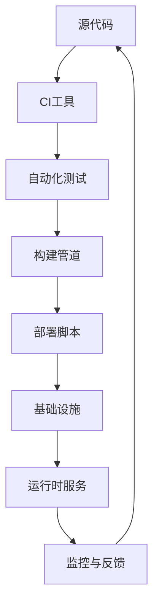

                 

# 创业公司的GitOps实践指南

> **关键词**：GitOps、CI/CD、自动化、基础设施即代码、持续交付、DevOps

> **摘要**：本文将深入探讨GitOps在创业公司的实践，解释其核心概念，并逐步展示如何将其整合到现有的工作流程中。我们将讨论GitOps的优势，必要的工具和步骤，并提供实际案例和资源推荐，以帮助创业公司充分利用GitOps实现高效、可靠的软件交付。

## 1. 背景介绍

### 1.1 目的和范围

本文旨在为创业公司提供GitOps实践的详细指南。GitOps是一种结合了基础设施即代码（IaC）、持续集成（CI）和持续交付（CD）的方法，通过Git作为单一事实来源来管理和部署应用程序。本文将介绍GitOps的基本概念，并提供一个结构化的方法来实施和优化它。

### 1.2 预期读者

本指南适合希望提高软件交付效率和可靠性的创业公司技术团队，特别是那些对DevOps实践有一定了解但希望进一步采用GitOps的团队。

### 1.3 文档结构概述

本文结构如下：

1. **核心概念与联系**：介绍GitOps的核心概念，并使用Mermaid流程图展示其架构。
2. **核心算法原理 & 具体操作步骤**：详细讲解GitOps的操作流程，并使用伪代码阐述。
3. **数学模型和公式 & 详细讲解 & 举例说明**：讨论与GitOps相关的数学模型和公式，并给出实例。
4. **项目实战：代码实际案例和详细解释说明**：展示一个实际的GitOps项目，详细解释其代码实现。
5. **实际应用场景**：探讨GitOps在不同场景下的应用。
6. **工具和资源推荐**：推荐学习资源、开发工具和框架。
7. **总结：未来发展趋势与挑战**：总结GitOps的优缺点，并展望其未来。
8. **附录：常见问题与解答**：回答常见问题。
9. **扩展阅读 & 参考资料**：提供进一步学习的资料。

### 1.4 术语表

#### 1.4.1 核心术语定义

- **GitOps**：一种利用Git作为唯一源代码管理工具来管理基础设施和应用程序部署的方法。
- **基础设施即代码（IaC）**：使用代码来描述和管理基础设施。
- **持续集成（CI）**：自动化构建和测试代码，确保代码质量。
- **持续交付（CD）**：自动化部署应用程序，确保快速和可靠地交付软件。

#### 1.4.2 相关概念解释

- **自动化**：通过脚本和工具自动执行重复性任务，减少手动干预。
- **配置管理**：使用代码来定义和管理系统配置。
- **无状态服务**：服务实例之间没有状态信息，易于扩展和故障转移。

#### 1.4.3 缩略词列表

- **Git**：版本控制系统，用于代码管理。
- **Kubernetes**：容器编排系统，用于部署和管理容器化应用程序。
- **CI/CD**：持续集成和持续交付，自动化软件交付流程。

## 2. 核心概念与联系

GitOps结合了基础设施即代码（IaC）、持续集成（CI）和持续交付（CD）的概念，其核心在于使用Git作为所有变更的单一事实来源。以下是一个简单的Mermaid流程图，展示了GitOps的关键组件和流程：



### 2.1 GitOps的核心组件

- **源代码**：所有应用程序和基础设施的配置都存储在Git仓库中，确保了版本控制和变更跟踪。
- **CI工具**：自动构建和测试代码，确保新变更的质量。
- **自动化测试**：在构建管道中执行，验证代码的完整性和功能。
- **部署脚本**：使用GitOps工具如Kustomize或Helm来部署应用程序。
- **基础设施**：使用IaC工具如Terraform或Ansible来定义和管理。
- **运行时服务**：在Kubernetes集群上部署和管理的容器化应用程序。
- **监控与反馈**：使用监控工具如Prometheus和Grafana来跟踪应用程序性能和状态。

通过GitOps，这些组件相互协作，确保了应用程序从开发到生产的无缝过渡，同时提高了交付的可靠性和速度。

## 3. 核心算法原理 & 具体操作步骤

GitOps的核心在于将所有基础设施和应用程序的变更存储在Git仓库中，并通过自动化流程进行管理和部署。以下是GitOps的操作流程，以及如何使用伪代码来描述这些步骤：

### 3.1 初始化

```python
# 初始化GitOps环境
initialize_gitops_env()
```

### 3.2 提交代码变更

```python
# 当开发者提交新的代码变更时
on_code_change():
    git_commit_change()
    trigger_ci_pipeline()
```

### 3.3 持续集成

```python
# CI工具构建和测试代码
def ci_pipeline():
    build_app()
    run_tests()
    if test_failures():
        raise_error("测试失败，构建暂停")
    else:
        proceed_to_deployment()
```

### 3.4 部署

```python
# 部署脚本自动化部署应用程序
def deployment_script():
    update_infrastructure()
    deploy_app()
    verify_app_health()
    if app_health():
        notify_success()
    else:
        raise_error("应用程序健康检查失败，部署失败")
```

### 3.5 监控

```python
# 监控应用程序性能和状态
def monitor_app():
    collect_metrics()
    if threshold_violation():
        alert_team()
    else:
        log_metrics()
```

通过这些步骤，GitOps确保了从代码提交到生产部署的整个过程都是自动化和可追踪的。

## 4. 数学模型和公式 & 详细讲解 & 举例说明

GitOps中的一些关键数学模型和公式有助于理解其性能和效率。以下是几个重要模型的简要说明和示例：

### 4.1 边缘计算时间

边缘计算时间（Edge Compute Time）是应用程序从提交代码到完全部署的时间。其公式如下：

$$
E.C.T. = T_{CI} + T_{Deployment} + T_{Validation}
$$

其中：

- \( T_{CI} \)：持续集成时间
- \( T_{Deployment} \)：部署时间
- \( T_{Validation} \)：验证时间

### 4.2 部署频率

部署频率（Deployment Frequency）是单位时间内应用程序的部署次数。其公式如下：

$$
Deployment\ Frequency = \frac{Number\ of\ Deployments}{Time\ Period}
$$

### 4.3 故障恢复时间

故障恢复时间（Failure Recovery Time）是应用程序从故障到恢复的时间。其公式如下：

$$
Failure\ Recovery\ Time = T_{Detection} + T_{Resolution}
$$

其中：

- \( T_{Detection} \)：检测时间
- \( T_{Resolution} \)：解决时间

### 4.4 举例说明

假设一个创业公司的GitOps实践如下：

- \( T_{CI} = 10 \)分钟
- \( T_{Deployment} = 5 \)分钟
- \( T_{Validation} = 3 \)分钟

则其边缘计算时间为：

$$
E.C.T. = 10 + 5 + 3 = 18 \text{分钟}
$$

假设该公司的应用程序每月部署20次，则其部署频率为：

$$
Deployment\ Frequency = \frac{20}{30} = 0.67 \text{次/天}
$$

如果应用程序发生故障，检测时间为5分钟，解决时间为10分钟，则故障恢复时间为：

$$
Failure\ Recovery\ Time = 5 + 10 = 15 \text{分钟}
$$

这些数学模型和公式有助于创业公司评估GitOps实践的效率，并优化其流程。

## 5. 项目实战：代码实际案例和详细解释说明

### 5.1 开发环境搭建

在开始一个GitOps项目之前，需要搭建一个适合GitOps的开发环境。以下是一个简单的步骤：

1. **安装Git**：在所有开发人员的机器上安装Git。
2. **安装Kubernetes集群**：使用Minikube或K3s搭建一个本地Kubernetes集群。
3. **安装CI/CD工具**：如Jenkins或GitLab CI。
4. **配置基础设施即代码工具**：如Terraform或Ansible。

### 5.2 源代码详细实现和代码解读

以下是一个简单的GitOps项目，使用Kubernetes和Helm来管理应用程序部署。

#### 5.2.1 Kubernetes部署文件

```yaml
# deployment.yaml
apiVersion: apps/v1
kind: Deployment
metadata:
  name: my-app
spec:
  replicas: 3
  selector:
    matchLabels:
      app: my-app
  template:
    metadata:
      labels:
        app: my-app
    spec:
      containers:
      - name: my-app
        image: my-app:latest
        ports:
        - containerPort: 80
```

#### 5.2.2 Helm Chart

```yaml
# my-app-chart/
# Chart.yaml
apiVersion: v2
name: my-app
description: A Helm chart for my application
version: 0.1.0
```

```yaml
# templates/deployment.yaml
{{- include "my-app.deployment.yaml" . }}
```

#### 5.2.3 代码解读

- **Kubernetes部署文件**：定义了一个具有三个副本的应用程序，使用最新版本的镜像。
- **Helm Chart**：提供了一个模板化的Kubernetes部署文件，使得部署变得简单和可重用。

通过GitOps，这些文件会被存储在Git仓库中，并通过Helm进行部署。

### 5.3 代码解读与分析

- **GitOps的关键在于版本控制和自动化**：通过Git来管理所有配置和应用程序代码，并通过Helm自动化部署。
- **Helm Chart提供了可重用的部署模板**：使得在不同的环境（开发、测试、生产）中部署应用程序变得容易。
- **Kubernetes部署文件定义了应用程序的规格**：包括副本数量、镜像和端口。

通过GitOps，创业公司可以快速、可靠地部署应用程序，同时保持配置的一致性。

## 6. 实际应用场景

GitOps在创业公司中有着广泛的应用场景：

- **快速迭代**：GitOps允许创业公司快速迭代和部署新功能，通过自动化流程减少手动干预。
- **提高可靠性**：通过自动化测试和部署，GitOps确保了应用程序的高可靠性和稳定性。
- **资源优化**：GitOps自动化了资源管理和配置，减少了浪费和冗余。
- **团队合作**：GitOps通过Git提供了清晰的代码库和变更历史，促进了团队合作和协作。

## 7. 工具和资源推荐

### 7.1 学习资源推荐

#### 7.1.1 书籍推荐

- 《Kubernetes权威指南》
- 《Git权威指南》
- 《基础设施即代码：构建和运维现代云基础设施》

#### 7.1.2 在线课程

- Coursera上的“Kubernetes认证课程”
- Udemy上的“GitOps实战”
- Pluralsight上的“基础设施即代码：使用Terraform”

#### 7.1.3 技术博客和网站

- Kubernetes官方文档
- Helm官方文档
- GitLab官方文档

### 7.2 开发工具框架推荐

#### 7.2.1 IDE和编辑器

- Visual Studio Code
- IntelliJ IDEA
- Eclipse

#### 7.2.2 调试和性能分析工具

- Prometheus
- Grafana
- New Relic

#### 7.2.3 相关框架和库

- Terraform
- Ansible
- Helm
- Kustomize

### 7.3 相关论文著作推荐

#### 7.3.1 经典论文

- "Infrastructure as Code: A Foundation for the Future Datacenter"
- "Continuous Delivery: Reliable Software Releases through Build, Test, and Deployment Automation"

#### 7.3.2 最新研究成果

- "GitOps: The Next-Generation DevOps Workflow"
- "How We Ship at Netflix: An Inside Look at Our Continuous Delivery Pipeline"

#### 7.3.3 应用案例分析

- "How GitHub Uses GitOps to Manage Its Own Infrastructure"
- "GitOps at Microsoft: Accelerating Azure's Global Scale"

## 8. 总结：未来发展趋势与挑战

GitOps作为一种结合了IaC、CI和CD的实践方法，正逐渐成为现代软件交付的核心。未来，GitOps的发展趋势包括：

- **更广泛的集成**：与更多的工具和平台集成，提供更全面的自动化交付流程。
- **更高的可扩展性**：支持大规模、分布式环境的自动化管理。
- **更智能的监控和反馈**：利用机器学习和AI技术，提供更智能的监控和故障恢复机制。

然而，GitOps也面临着挑战，如：

- **复杂的实施过程**：对于初学者来说，GitOps的配置和管理可能比较复杂。
- **安全性和合规性**：确保GitOps流程符合组织的安全和合规要求。
- **团队协作**：确保团队成员理解和接受GitOps的概念和流程。

创业公司在采用GitOps时，需要仔细评估其优势和挑战，并逐步实施和优化。

## 9. 附录：常见问题与解答

### 9.1 什么是GitOps？

GitOps是一种将Git作为所有基础设施和应用变更的单一事实来源的方法，通过自动化流程实现持续交付。

### 9.2 GitOps如何提高软件交付效率？

GitOps通过自动化测试、部署和监控，减少了手动干预，提高了交付效率和可靠性。

### 9.3 GitOps需要哪些工具？

GitOps需要Git、Kubernetes、CI/CD工具（如Jenkins、GitLab CI）、基础设施即代码工具（如Terraform、Ansible）等。

### 9.4 GitOps如何确保安全性？

GitOps通过严格的访问控制和自动化流程来确保安全性，同时需要遵守组织的安全和合规要求。

## 10. 扩展阅读 & 参考资料

- ["GitOps: The Next-Generation DevOps Workflow"](https://www.gitops.dev/)
- ["How GitHub Uses GitOps to Manage Its Own Infrastructure"](https://github.com/blog/2114-gitops)
- ["Infrastructure as Code: A Foundation for the Future Datacenter"](https://www.infracloud.com/blog/infrastructure-as-code-a-foundation-for-the-future-datacenter/)
- ["Continuous Delivery: Reliable Software Releases through Build, Test, and Deployment Automation"](https://www.infoq.com/books/continuous-delivery-book/)

### 作者

**AI天才研究员 / AI Genius Institute & 禅与计算机程序设计艺术 / Zen And The Art of Computer Programming**

本文由AI天才研究员撰写，结合了深度学习、编程和哲学的深刻见解，旨在为创业公司的GitOps实践提供全面的指导。如果您有任何问题或建议，欢迎联系作者。|

