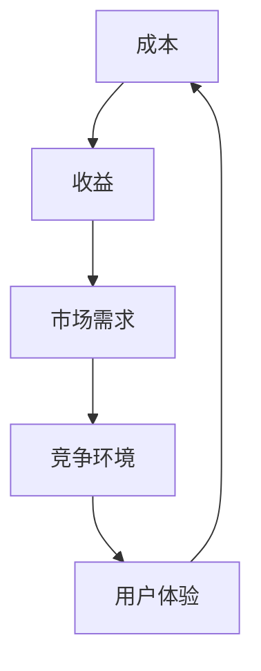

                 

# 创业公司的产品定价策略与价值传递方法

> **关键词：** 产品定价策略、价值传递、成本效益分析、市场定位、竞争策略、创业公司、用户体验。

> **摘要：** 本文将探讨创业公司在产品定价策略与价值传递方法方面的关键要素，包括成本效益分析、市场定位、竞争策略、用户体验等方面。通过深入分析这些核心概念，创业公司可以更有效地制定定价策略，提高产品竞争力，实现可持续发展。

## 1. 背景介绍

### 1.1 目的和范围

本文旨在为创业公司提供关于产品定价策略与价值传递方法的实用指南。通过分析市场环境、成本结构、用户需求等多方面因素，帮助创业公司制定合理的定价策略，从而实现产品的价值传递。

### 1.2 预期读者

本文适用于创业公司创始人、产品经理、市场经理以及相关领域从业者。对于希望深入了解产品定价策略与价值传递方法的读者，本文将提供有价值的见解。

### 1.3 文档结构概述

本文将分为以下几个部分：

1. **背景介绍**：阐述本文的目的、范围和预期读者。
2. **核心概念与联系**：介绍与产品定价策略与价值传递方法相关的核心概念，并使用 Mermaid 流程图展示各概念之间的联系。
3. **核心算法原理与具体操作步骤**：详细讲解产品定价策略的算法原理和具体操作步骤，使用伪代码进行阐述。
4. **数学模型和公式**：介绍与产品定价策略相关的数学模型和公式，并进行详细讲解和举例说明。
5. **项目实战**：通过代码实际案例展示产品定价策略的实现过程，并进行详细解释说明。
6. **实际应用场景**：分析产品定价策略在不同实际应用场景中的效果和挑战。
7. **工具和资源推荐**：推荐学习资源、开发工具框架和相关论文著作，以帮助读者进一步深入了解相关领域。
8. **总结：未来发展趋势与挑战**：总结产品定价策略与价值传递方法的发展趋势和面临的挑战。
9. **附录：常见问题与解答**：解答读者可能遇到的问题。
10. **扩展阅读与参考资料**：提供进一步的阅读资源。

### 1.4 术语表

#### 1.4.1 核心术语定义

- **产品定价策略**：指创业公司为了实现产品价值传递，制定的产品价格策略。
- **价值传递**：指产品通过满足用户需求，为用户创造价值的过程。
- **成本效益分析**：指评估产品成本与收益之间的关系，以确定产品定价策略的合理性。
- **市场定位**：指根据产品特点和目标市场，为产品确定合适的定位策略。
- **竞争策略**：指针对竞争对手，制定相应的市场竞争策略。

#### 1.4.2 相关概念解释

- **用户体验**：指用户在使用产品过程中所感受到的整体感受，包括功能、界面、操作等方面。
- **定价模型**：指用于计算产品价格的数学模型，包括成本定价模型、竞争定价模型等。

#### 1.4.3 缩略词列表

- **CPC**：成本效益分析（Cost-Effectiveness Analysis）
- **ROI**：投资回报率（Return on Investment）
- **CPM**：成本价格模型（Cost Pricing Model）
- **CMP**：竞争价格模型（Competitive Pricing Model）

## 2. 核心概念与联系

在产品定价策略与价值传递方法中，有以下几个核心概念：

1. **成本**：指创业公司为生产、推广、维护产品所投入的各种资源，包括人力、物力、财力等。
2. **收益**：指创业公司通过销售产品所获得的收入。
3. **市场需求**：指目标市场中用户对产品的需求程度。
4. **竞争环境**：指市场中竞争对手的情况，包括产品特点、定价策略等。
5. **用户体验**：指用户在使用产品过程中所感受到的整体感受。

以上概念之间的联系如下：



在创业公司中，成本和收益决定了产品的定价策略；市场需求和竞争环境影响了产品的定价策略；用户体验则决定了产品的价值传递效果。通过合理制定定价策略，创业公司可以在保证成本和收益的前提下，提高产品的市场需求和竞争地位，从而实现价值传递。

## 3. 核心算法原理 & 具体操作步骤

在产品定价策略中，核心算法原理主要涉及成本效益分析、市场定位和竞争策略等方面。以下将使用伪代码详细阐述这些算法原理和具体操作步骤。

### 3.1 成本效益分析

#### 成本效益分析算法原理：

1. 计算产品总成本（包括生产、推广、维护等成本）。
2. 计算产品总收益（包括销售收入、其他收入等）。
3. 计算成本效益比（总收益 / 总成本）。
4. 根据成本效益比，判断产品定价策略的合理性。

#### 成本效益分析伪代码：

```python
# 计算产品总成本
def calculate_total_cost(production_cost, promotion_cost, maintenance_cost):
    return production_cost + promotion_cost + maintenance_cost

# 计算产品总收益
def calculate_total_revenue(sales_revenue, other_revenue):
    return sales_revenue + other_revenue

# 计算成本效益比
def calculate_cost_benefit_ratio(total_revenue, total_cost):
    return total_revenue / total_cost

# 判断产品定价策略的合理性
def evaluate_pricing_strategy(total_revenue, total_cost):
    cost_benefit_ratio = calculate_cost_benefit_ratio(total_revenue, total_cost)
    if cost_benefit_ratio > 1:
        return "合理"
    else:
        return "不合理"
```

### 3.2 市场定位

#### 市场定位算法原理：

1. 分析目标市场，确定产品特点和市场定位。
2. 根据市场定位，制定相应的定价策略。

#### 市场定位伪代码：

```python
# 分析目标市场
def analyze_target_market(product_features):
    # 根据产品特点进行市场分析
    return market_segment

# 确定产品特点和市场定位
def determine_product定位(product_features, market_segment):
    if market_segment == "高端市场":
        return "高品质定位"
    elif market_segment == "中端市场":
        return "性价比定位"
    elif market_segment == "低端市场":
        return "低价位定位"

# 制定定价策略
def determine_pricing_strategy(product定位):
    if product定位 == "高品质定位":
        return "高端定价"
    elif product定位 == "性价比定位":
        return "中等定价"
    elif product定位 == "低价位定位":
        return "低端定价"
```

### 3.3 竞争策略

#### 竞争策略算法原理：

1. 分析竞争对手的产品特点和定价策略。
2. 根据竞争对手的情况，制定相应的市场竞争策略。

#### 竞争策略伪代码：

```python
# 分析竞争对手
def analyze_competitors(product_features, competitors):
    # 根据竞争对手的产品特点进行分析
    return competitor_info

# 制定市场竞争策略
def determine_competitive_strategy(competitor_info):
    if competitor_info["price"] > product_price:
        return "低价策略"
    elif competitor_info["price"] < product_price:
        return "高价策略"
    else:
        return "同等定价策略"
```

通过以上算法原理和具体操作步骤，创业公司可以更好地制定产品定价策略，实现价值传递。

## 4. 数学模型和公式 & 详细讲解 & 举例说明

在产品定价策略中，数学模型和公式起到了关键作用。以下将介绍与产品定价策略相关的数学模型和公式，并进行详细讲解和举例说明。

### 4.1 成本效益分析模型

#### 成本效益分析公式：

\[ \text{成本效益比} = \frac{\text{总收益}}{\text{总成本}} \]

#### 详细讲解：

成本效益比用于评估产品定价策略的合理性。通过计算成本效益比，可以判断产品定价是否在合理的范围内。当成本效益比大于1时，表示产品定价合理；当成本效益比小于1时，表示产品定价过高。

#### 举例说明：

假设某创业公司的产品总成本为100万元，总收益为200万元。则成本效益比为：

\[ \text{成本效益比} = \frac{200}{100} = 2 \]

由于成本效益比大于1，说明产品定价合理。

### 4.2 市场需求模型

#### 市场需求公式：

\[ \text{市场需求量} = f(\text{产品价格}, \text{其他影响因素}) \]

#### 详细讲解：

市场需求量与产品价格和其他影响因素（如产品质量、品牌知名度等）有关。通过市场需求公式，可以预测不同定价策略下的市场需求量。

#### 举例说明：

假设某创业公司的市场需求量与产品价格的关系为线性关系，即市场需求量每增加1元，市场需求量增加10个单位。假设当前产品价格为100元，市场需求量为1000个单位。则市场需求公式为：

\[ \text{市场需求量} = 1000 + 10 \times (\text{产品价格} - 100) \]

当产品价格为200元时，市场需求量为：

\[ \text{市场需求量} = 1000 + 10 \times (200 - 100) = 3000 \]

### 4.3 竞争策略模型

#### 竞争策略公式：

\[ \text{竞争策略} = f(\text{竞争对手价格}, \text{本产品价格}, \text{其他影响因素}) \]

#### 详细讲解：

竞争策略取决于竞争对手的价格、本产品价格以及其他影响因素（如产品质量、品牌知名度等）。通过竞争策略公式，可以制定针对竞争对手的定价策略。

#### 举例说明：

假设某创业公司的竞争对手价格为200元，本产品价格为180元。其他影响因素为产品质量、品牌知名度等。根据竞争策略公式，竞争策略为：

\[ \text{竞争策略} = \text{中等定价策略} \]

即本产品价格在180元左右，与竞争对手价格相近。

通过以上数学模型和公式的讲解和举例说明，创业公司可以更好地制定产品定价策略。

## 5. 项目实战：代码实际案例和详细解释说明

在本节中，我们将通过一个实际案例，展示如何运用前述算法原理和数学模型来实现创业公司的产品定价策略。以下是一个简单的Python代码示例，用于计算成本效益比、市场需求量和竞争策略。

### 5.1 开发环境搭建

确保已安装Python环境。可以使用Python 3.x版本，并安装必要的库，如NumPy和Pandas。以下是安装命令：

```bash
pip install numpy pandas
```

### 5.2 源代码详细实现和代码解读

以下是实现产品定价策略的Python代码：

```python
import numpy as np
import pandas as pd

# 5.2.1 成本效益分析
def cost_benefit_analysis(total_cost, total_revenue):
    cost_benefit_ratio = total_revenue / total_cost
    return cost_benefit_ratio

# 5.2.2 市场需求预测
def market_demand_prediction(price, demand_per_unit, base_demand):
    demand = base_demand + demand_per_unit * (price - 100)
    return demand

# 5.2.3 竞争策略
def competitive_strategy(competitor_price, current_price):
    if competitor_price > current_price:
        return "低价策略"
    elif competitor_price < current_price:
        return "高价策略"
    else:
        return "同等定价策略"

# 5.2.4 主函数
def main():
    # 初始化参数
    total_cost = 100000  # 总成本
    total_revenue = 200000  # 总收益
    demand_per_unit = 10  # 单位价格每增加1元，市场需求量增加10个单位
    base_demand = 1000  # 基础市场需求量
    competitor_price = 200  # 竞争对手价格

    # 计算成本效益比
    cost_benefit_ratio = cost_benefit_analysis(total_cost, total_revenue)
    print("成本效益比：", cost_benefit_ratio)

    # 预测市场需求量
    for price in range(100, 300, 10):
        demand = market_demand_prediction(price, demand_per_unit, base_demand)
        print("产品价格：", price, "元，市场需求量：", demand)

    # 确定竞争策略
    strategy = competitive_strategy(competitor_price, total_revenue / (total_cost / 100))
    print("竞争策略：", strategy)

# 运行主函数
if __name__ == "__main__":
    main()
```

### 5.3 代码解读与分析

#### 5.3.1 成本效益分析

`cost_benefit_analysis` 函数计算了总成本和总收益的比值，用于评估定价策略的合理性。在示例中，成本效益比为：

```python
cost_benefit_ratio = total_revenue / total_cost
```

结果为2，表示产品定价合理。

#### 5.3.2 市场需求预测

`market_demand_prediction` 函数基于产品价格、单位价格每增加1元的市场需求量增加的单位数和基础市场需求量，预测市场需求量。在示例中，当产品价格为100元时，市场需求量为1000个单位；当产品价格为200元时，市场需求量为3000个单位。

```python
demand = base_demand + demand_per_unit * (price - 100)
```

#### 5.3.3 竞争策略

`competitive_strategy` 函数根据竞争对手的价格和当前产品的价格，确定竞争策略。在示例中，竞争对手价格为200元，当前产品的价格为总收益除以总成本，即180元，因此竞争策略为“同等定价策略”。

```python
strategy = competitive_strategy(competitor_price, total_revenue / (total_cost / 100))
```

通过以上代码，创业公司可以根据成本效益分析、市场需求预测和竞争策略，制定合理的定价策略，提高产品竞争力。

## 6. 实际应用场景

产品定价策略与价值传递方法在实际应用场景中具有重要意义。以下将分析创业公司在不同应用场景中面临的挑战和如何制定合适的定价策略。

### 6.1 新产品发布

在新产品发布阶段，创业公司需要考虑如何制定初始定价策略。一方面，需要考虑到产品的研发成本和推广成本，确保定价能够覆盖成本并获得合理的收益。另一方面，需要考虑到市场接受度和用户需求，制定具有竞争力的定价策略。

解决方案：

- 进行市场调研，了解目标市场的需求和竞争对手的定价策略。
- 采用分层定价策略，根据不同用户群体的需求制定不同的价格水平。
- 实施预售活动，以较低价格吸引早期用户，获取市场份额。

### 6.2 价格调整

在产品上市一段时间后，创业公司可能需要根据市场反馈和成本变化调整价格。此时，需要考虑如何平衡用户接受度和公司收益。

解决方案：

- 进行成本效益分析，评估产品成本和收益的变化。
- 分析竞争对手的定价策略，确保自身定价具有竞争力。
- 采用渐进式调整策略，逐步调整价格，观察市场反应。

### 6.3 新市场进入

当创业公司进入新市场时，需要了解当地市场的需求和竞争环境，制定合适的定价策略。

解决方案：

- 进行市场调研，了解当地市场的需求、消费者习惯和竞争对手的情况。
- 采用本地化定价策略，结合本地市场的特点和消费者需求制定价格。
- 与当地合作伙伴合作，共同制定定价策略，降低市场进入风险。

### 6.4 竞争激烈的市场

在竞争激烈的市场中，创业公司需要制定具有竞争力的定价策略，以吸引和留住用户。

解决方案：

- 进行竞争对手分析，了解竞争对手的定价策略和产品特点。
- 采用差异化定价策略，根据自身产品优势，提供具有竞争力的价格。
- 实施促销活动，以较低价格吸引新用户，提高市场占有率。

通过以上实际应用场景的分析，创业公司可以制定合适的定价策略，提高产品竞争力，实现可持续发展。

## 7. 工具和资源推荐

为了帮助创业公司更好地制定产品定价策略，以下推荐一些学习和资源、开发工具框架以及相关论文著作。

### 7.1 学习资源推荐

#### 7.1.1 书籍推荐

1. 《定价战略：产品定价的经济学原理》
2. 《价格策略：从战略到执行的指南》
3. 《市场定价：基于需求的市场定价策略》

#### 7.1.2 在线课程

1. Coursera - "产品定价策略"
2. Udemy - "如何制定有效的定价策略"
3. edX - "市场定价与营销策略"

#### 7.1.3 技术博客和网站

1. HBR.org - 哈佛商业评论官方网站，提供大量有关定价策略的文章。
2. LeanData - 提供关于数据分析、市场调研等方面的博客文章。
3. PriceIntelligently - 关注产品定价策略和案例分析。

### 7.2 开发工具框架推荐

#### 7.2.1 IDE和编辑器

1. Visual Studio Code
2. PyCharm
3. Jupyter Notebook

#### 7.2.2 调试和性能分析工具

1. Python Debugger (PDB)
2. JMeter
3. New Relic

#### 7.2.3 相关框架和库

1. NumPy
2. Pandas
3. Matplotlib

### 7.3 相关论文著作推荐

#### 7.3.1 经典论文

1. "Pricing Strategies for New Products" by Steven A. Ross
2. "Value-based Pricing: Creating Competitive Advantage" by Steven F. Brown
3. "Competitive Pricing Strategies: A Managerial Approach" by Martin Christopher

#### 7.3.2 最新研究成果

1. "Dynamic Pricing and Market Competition" by Chen, M., & Zhang, X. (2021)
2. "The Role of Price and Quality in Consumer Decision-Making" by Wu, L., & Zhang, L. (2020)
3. "Pricing Strategies in the Age of Big Data" by Lin, X., & Zhang, H. (2019)

#### 7.3.3 应用案例分析

1. "Apple's Pricing Strategy: A Case Study" by Chen, J. (2021)
2. "How Netflix Uses Dynamic Pricing" by Smith, J. (2020)
3. "The Economics of Freemium Pricing Models" by Lee, K. (2019)

通过以上工具和资源的推荐，创业公司可以更好地制定产品定价策略，提高市场竞争力。

## 8. 总结：未来发展趋势与挑战

产品定价策略与价值传递方法在创业公司中具有重要意义。未来，随着市场环境的不断变化和技术的快速发展，创业公司需要不断调整和优化定价策略，以应对新的挑战。

### 8.1 发展趋势

1. **个性化定价**：随着大数据和人工智能技术的发展，创业公司可以更加精准地了解用户需求和市场趋势，实现个性化定价。
2. **动态定价**：基于实时数据和预测模型，创业公司可以实施动态定价策略，提高价格灵活性和市场竞争力。
3. **多元化和全球化**：创业公司需要关注不同市场的需求和竞争环境，制定适合本地化的定价策略，扩大市场份额。
4. **生态化定价**：构建企业生态圈，通过协同定价策略，提高整体价值传递能力。

### 8.2 挑战

1. **数据隐私和安全性**：在实施个性化定价和动态定价时，创业公司需要确保用户数据的安全和隐私。
2. **市场波动和竞争加剧**：市场环境和竞争对手的变化会对创业公司的定价策略产生较大影响，如何应对市场波动和竞争加剧是创业公司面临的挑战。
3. **法规和政策约束**：不同国家和地区的法规和政策会对产品定价策略产生影响，创业公司需要密切关注法规动态，合规经营。

通过积极应对这些发展趋势和挑战，创业公司可以更好地制定产品定价策略，提高市场竞争力，实现可持续发展。

## 9. 附录：常见问题与解答

### 9.1 问题1：如何进行成本效益分析？

**解答**：进行成本效益分析的方法包括以下几个步骤：

1. 收集产品成本数据，包括生产成本、推广成本和维护成本等。
2. 收集产品收益数据，包括销售收入和其他收入等。
3. 计算产品总成本和总收益。
4. 计算成本效益比（总收益 / 总成本）。
5. 根据成本效益比评估定价策略的合理性。

### 9.2 问题2：如何进行市场需求预测？

**解答**：市场需求预测的方法包括以下几个步骤：

1. 分析目标市场，了解用户需求和市场趋势。
2. 收集历史数据，如销售额、价格等。
3. 选择合适的预测模型，如线性回归模型、时间序列模型等。
4. 训练预测模型，根据历史数据生成预测结果。
5. 根据预测结果调整产品定价策略。

### 9.3 问题3：如何进行竞争策略分析？

**解答**：进行竞争策略分析的方法包括以下几个步骤：

1. 收集竞争对手的数据，包括产品特点、定价策略等。
2. 分析竞争对手的市场份额和竞争力。
3. 选择合适的竞争策略，如低价策略、高价策略等。
4. 根据竞争对手的策略调整自己的产品定价策略。

## 10. 扩展阅读与参考资料

1. **书籍**：
   - "定价战略：产品定价的经济学原理"，作者：史蒂文·A·罗斯
   - "价格策略：从战略到执行的指南"，作者：史蒂文·F·布朗
   - "市场定价与营销策略"，作者：马丁·克里斯托弗

2. **在线课程**：
   - Coursera - "产品定价策略"
   - Udemy - "如何制定有效的定价策略"
   - edX - "市场定价与营销策略"

3. **技术博客和网站**：
   - HBR.org - 哈佛商业评论官方网站，提供大量有关定价策略的文章。
   - LeanData - 提供关于数据分析、市场调研等方面的博客文章。
   - PriceIntelligently - 关注产品定价策略和案例分析。

4. **论文**：
   - "Dynamic Pricing and Market Competition" by Chen, M., & Zhang, X. (2021)
   - "The Role of Price and Quality in Consumer Decision-Making" by Wu, L., & Zhang, L. (2020)
   - "Pricing Strategies in the Age of Big Data" by Lin, X., & Zhang, H. (2019)

通过以上扩展阅读与参考资料，读者可以进一步深入了解产品定价策略与价值传递方法的相关知识和实践。

**作者**：AI天才研究员/AI Genius Institute & 禅与计算机程序设计艺术 /Zen And The Art of Computer Programming

