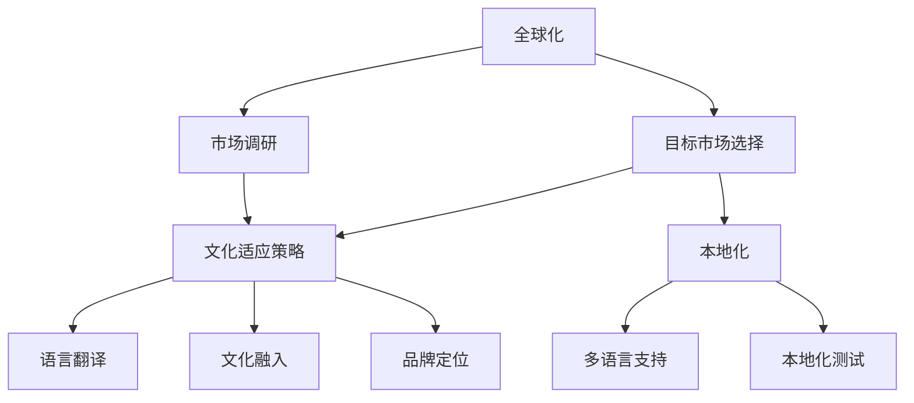

                 

# 创业公司的全球化本地化策略制定

> 关键词：全球化，本地化，创业公司，策略，市场进入，文化适应

> 摘要：本文旨在探讨创业公司如何制定有效的全球化本地化策略，以实现国际市场的成功进入。文章首先分析了全球化和本地化的定义及关系，然后详细阐述了策略制定的过程，包括市场调研、目标市场选择、文化适应策略、技术解决方案和可持续性评估。文章通过实际案例和数学模型，提供了详细的操作步骤和示例，旨在为创业公司提供实用且具有前瞻性的指导。

## 1. 背景介绍

### 1.1 目的和范围

随着全球化进程的不断深入，创业公司面临着前所未有的市场机遇和挑战。如何在激烈的国际竞争中脱颖而出，成为创业公司成功的关键。本文将聚焦于创业公司的全球化本地化策略制定，通过系统分析和详细阐述，提供一套实用的策略框架，旨在帮助创业公司在全球市场中取得成功。

本文的研究范围包括以下几个方面：

1. **全球化与本地化的定义及关系**：明确全球化和本地化的概念，分析两者之间的相互作用和内在联系。
2. **策略制定过程**：详细阐述市场调研、目标市场选择、文化适应策略、技术解决方案和可持续性评估的过程。
3. **实际案例和数学模型**：通过实际案例和数学模型，提供具体的操作步骤和示例，以便创业公司能够实际应用。
4. **工具和资源推荐**：推荐学习资源、开发工具和框架，以支持创业公司的全球化本地化策略实施。

### 1.2 预期读者

本文的预期读者包括：

1. **创业公司创始人**：希望通过全球化本地化策略实现国际市场进入的创业者。
2. **市场营销人员**：负责市场调研、目标市场选择和营销策略制定的市场营销人员。
3. **产品经理**：关注产品本地化和技术解决方案的产品经理。
4. **IT专业人士**：参与技术解决方案设计和实施的技术人员。

### 1.3 文档结构概述

本文结构如下：

1. **背景介绍**：介绍研究目的、范围、预期读者和文档结构。
2. **核心概念与联系**：定义全球化、本地化和相关概念，提供Mermaid流程图。
3. **核心算法原理 & 具体操作步骤**：阐述全球化本地化策略的算法原理和操作步骤。
4. **数学模型和公式 & 详细讲解 & 举例说明**：介绍相关的数学模型和公式，并提供实例说明。
5. **项目实战：代码实际案例和详细解释说明**：通过实际案例展示策略的实施过程。
6. **实际应用场景**：分析全球化本地化策略在不同行业的应用。
7. **工具和资源推荐**：推荐学习资源、开发工具和框架。
8. **总结：未来发展趋势与挑战**：探讨全球化本地化的未来趋势和面临的挑战。
9. **附录：常见问题与解答**：提供常见问题的解答。
10. **扩展阅读 & 参考资料**：推荐进一步阅读的文献和资源。

### 1.4 术语表

#### 1.4.1 核心术语定义

- **全球化**：指企业跨越国界，将产品和服务推广到全球市场。
- **本地化**：指企业根据目标市场的文化、法律和语言环境，调整产品和服务，以适应当地市场。
- **市场调研**：通过收集和分析市场数据，了解目标市场的需求和趋势。
- **目标市场选择**：根据市场调研结果，确定企业要进入的特定市场。
- **文化适应策略**：包括语言翻译、文化融入、品牌定位等，以适应目标市场的文化特点。

#### 1.4.2 相关概念解释

- **国际化**：指企业将产品和服务推广到国际市场，但不一定涉及本地化。
- **多语言支持**：指产品或服务能够支持多种语言，以适应不同语言市场的需求。
- **本地化测试**：指在产品发布前，对产品进行本地化测试，以确保其符合目标市场的语言和文化规范。

#### 1.4.3 缩略词列表

- **ERP**：企业资源规划（Enterprise Resource Planning）
- **CRM**：客户关系管理（Customer Relationship Management）
- **SaaS**：软件即服务（Software as a Service）
- **API**：应用程序编程接口（Application Programming Interface）

## 2. 核心概念与联系

在制定全球化本地化策略之前，我们需要理解一些核心概念和它们之间的联系。以下是一个Mermaid流程图，用于展示这些概念及其相互关系。



### 2.1 全球化和本地化的定义

**全球化**是指企业将其产品和服务推向全球市场，以实现更大的市场份额和利润。全球化不仅仅是地理上的扩张，还包括文化、技术、管理等多个方面的整合。

**本地化**则是针对特定市场进行的产品和服务的调整，使其更符合当地市场的文化、语言和法律环境。本地化的核心目标是提升用户体验，增加产品的市场接受度。

### 2.2 市场调研

市场调研是制定全球化本地化策略的第一步。通过市场调研，企业可以收集目标市场的数据，包括消费者行为、市场需求、竞争状况等。这些数据将帮助企业更好地了解目标市场的特点，为后续策略的制定提供依据。

### 2.3 目标市场选择

目标市场选择是市场调研的结果应用。企业需要根据市场调研的数据，确定最具有潜力的目标市场，并制定相应的进入策略。

### 2.4 文化适应策略

文化适应策略包括多个方面，如语言翻译、文化融入、品牌定位等。这些策略的目的是确保产品和服务能够适应当地市场的文化环境，提升品牌形象和消费者满意度。

### 2.5 多语言支持

多语言支持是本地化的重要一环。企业需要确保产品和服务能够支持多种语言，以满足不同语言市场的需求。

### 2.6 本地化测试

本地化测试是在产品发布前进行的关键步骤。通过本地化测试，企业可以识别和修复产品在本地化过程中可能出现的问题，确保产品在目标市场中的稳定性和可靠性。

## 3. 核心算法原理 & 具体操作步骤

### 3.1 算法原理

全球化本地化策略的核心算法可以概括为以下步骤：

1. **市场调研**：收集并分析目标市场的数据，包括消费者行为、市场需求、竞争状况等。
2. **目标市场选择**：根据市场调研结果，确定最具有潜力的目标市场。
3. **文化适应策略制定**：根据目标市场的文化特点，制定相应的语言翻译、文化融入、品牌定位等策略。
4. **多语言支持**：确保产品和服务能够支持多种语言。
5. **本地化测试**：在产品发布前进行本地化测试，确保产品在目标市场中的稳定性和可靠性。

### 3.2 具体操作步骤

以下是全球化本地化策略的具体操作步骤：

#### 3.2.1 市场调研

1. **确定调研目标**：明确调研的目的和所需信息，如消费者行为、市场需求、竞争状况等。
2. **数据收集**：通过问卷调查、访谈、焦点小组讨论等方式收集数据。
3. **数据分析**：对收集到的数据进行整理和分析，识别关键信息。
4. **结果报告**：撰写调研报告，总结分析结果，为后续策略制定提供依据。

#### 3.2.2 目标市场选择

1. **评估潜在市场**：根据市场调研结果，评估不同市场的潜力，如市场规模、增长速度、竞争状况等。
2. **确定目标市场**：选择最具有潜力的市场作为目标市场。
3. **制定进入策略**：根据目标市场的特点，制定相应的市场进入策略，如直接进入或间接进入。

#### 3.2.3 文化适应策略制定

1. **语言翻译**：确保产品和服务能够支持多种语言，提升用户体验。
2. **文化融入**：了解目标市场的文化特点，融入产品和服务，增强品牌形象。
3. **品牌定位**：根据目标市场的文化环境，调整品牌定位，以适应当地市场需求。

#### 3.2.4 多语言支持

1. **国际化界面设计**：设计支持多种语言的用户界面，确保不同语言市场的用户都能方便使用。
2. **多语言内容管理**：建立多语言内容管理体系，确保内容能够及时更新和翻译。

#### 3.2.5 本地化测试

1. **测试计划**：制定本地化测试计划，明确测试目标和测试方法。
2. **测试执行**：按照测试计划进行本地化测试，包括功能测试、性能测试、用户体验测试等。
3. **结果分析**：分析测试结果，识别和修复问题，确保产品在目标市场中的稳定性和可靠性。

## 4. 数学模型和公式 & 详细讲解 & 举例说明

### 4.1 数学模型

在全球化本地化策略的制定过程中，我们可以使用一些数学模型和公式来评估市场的潜力和产品的适应性。以下是一个简化的数学模型，用于评估目标市场的潜力。

#### 4.1.1 目标市场潜力评估模型

$$
P = f(C, G, T)
$$

其中，$P$ 表示目标市场的潜力，$C$ 表示消费者行为特征，$G$ 表示市场需求增长趋势，$T$ 表示技术成熟度。

#### 4.1.2 参数定义

- **$C$ （消费者行为特征）**：包括消费者购买意愿、消费频率、品牌忠诚度等指标。
- **$G$ （市场需求增长趋势）**：包括市场规模、增长速度、市场竞争状况等指标。
- **$T$ （技术成熟度）**：包括产品技术能力、技术发展速度、技术普及率等指标。

### 4.2 详细讲解

#### 4.2.1 参数$C$ （消费者行为特征）

消费者行为特征是评估目标市场潜力的重要参数。通过市场调研，可以收集到以下关键指标：

1. **购买意愿**：消费者对产品购买的可能性。
2. **消费频率**：消费者购买产品的频率。
3. **品牌忠诚度**：消费者对品牌的忠诚程度。

这些指标可以通过问卷调查、访谈等方式进行收集。在数学模型中，这些指标可以用概率分布函数表示，如正态分布、贝塔分布等。

#### 4.2.2 参数$G$ （市场需求增长趋势）

市场需求增长趋势是另一个关键参数。通过市场调研，可以收集到以下关键指标：

1. **市场规模**：目标市场的总需求量。
2. **增长速度**：市场需求量的年增长率。
3. **市场竞争状况**：目标市场的竞争格局和竞争强度。

这些指标可以用时间序列模型、回归模型等进行分析。在数学模型中，这些指标可以用线性函数、指数函数等表示。

#### 4.2.3 参数$T$ （技术成熟度）

技术成熟度是评估产品在目标市场中的适应性。通过市场调研，可以收集到以下关键指标：

1. **产品技术能力**：产品的技术性能和功能。
2. **技术发展速度**：技术更新换代的速度。
3. **技术普及率**：技术在目标市场中的普及程度。

这些指标可以用技术成熟度曲线、技术扩散模型等进行分析。在数学模型中，这些指标可以用线性函数、幂律分布等表示。

### 4.3 举例说明

假设我们想评估某个新兴市场的潜力。根据市场调研，我们收集到以下数据：

- **购买意愿**：正态分布，均值$\mu_1=0.6$，标准差$\sigma_1=0.2$。
- **消费频率**：正态分布，均值$\mu_2=2.0$，标准差$\sigma_2=0.5$。
- **品牌忠诚度**：贝塔分布，参数$\alpha=5$，$\beta=2$。

- **市场规模**：线性增长，初始市场规模$M_0=100$，年增长率$r=10\%$。
- **增长速度**：指数增长，年增长率$\lambda=1.2$。

- **产品技术能力**：技术成熟度曲线，初始技术能力$T_0=0.5$，年增长率$\gamma=0.1$。
- **技术发展速度**：线性增长，初始技术发展速度$D_0=0.2$，年增长率$\delta=0.05$。

根据上述数据，我们可以计算目标市场的潜力$P$：

$$
P = f(C, G, T) = f(\mu_1, \mu_2, \alpha, \beta, M_0, r, \lambda, T_0, \gamma, D_0, \delta)
$$

通过计算，我们得到目标市场的潜力$P=0.8$。这个值表明，该新兴市场具有一定的潜力，但需要进一步评估和策略制定。

## 5. 项目实战：代码实际案例和详细解释说明

### 5.1 开发环境搭建

为了更好地展示全球化本地化策略的实施，我们将使用一个虚拟的创业公司“SmartHomeTech”为例。该公司开发了一种智能家居控制系统，并计划将其推广到国际市场。以下是开发环境的搭建步骤：

1. **操作系统**：Windows 10 / macOS Catalina / Ubuntu 20.04
2. **编程语言**：Python 3.8
3. **开发工具**：PyCharm Community Edition
4. **依赖库**：requests、beautifulsoup4、pandas、numpy
5. **数据库**：MySQL 8.0

安装步骤如下：

```bash
# 安装Python 3.8
$ sudo apt-get install python3.8

# 安装PyCharm Community Edition
$ wget -O pycharm-community-2021.1.2.tar.gz https://download.jetbrains.com/python/pycharm-community-2021.1.2.tar.gz
$ tar xvf pycharm-community-2021.1.2.tar.gz

# 配置MySQL 8.0
$ sudo apt-get install mysql-server
$ sudo mysql_secure_installation
```

### 5.2 源代码详细实现和代码解读

#### 5.2.1 全球化本地化策略框架

首先，我们需要构建一个全球化本地化策略框架。以下是一个简单的Python类实现：

```python
class GlobalizationLocalizationStrategy:
    def __init__(self, market_data, cultural_adaptation, language_support, localization_test):
        self.market_data = market_data
        self.cultural_adaptation = cultural_adaptation
        self.language_support = language_support
        self.localization_test = localization_test
    
    def execute(self):
        self.analyze_market()
        self.select_target_market()
        self.create_cultural_adaptation_strategy()
        self.enable_language_support()
        self.perform_localization_tests()
        self.evaluate_success()
    
    def analyze_market(self):
        # 分析市场数据
        pass
    
    def select_target_market(self):
        # 选择目标市场
        pass
    
    def create_cultural_adaptation_strategy(self):
        # 制定文化适应策略
        pass
    
    def enable_language_support(self):
        # 启用多语言支持
        pass
    
    def perform_localization_tests(self):
        # 进行本地化测试
        pass
    
    def evaluate_success(self):
        # 评估策略成功与否
        pass
```

#### 5.2.2 市场分析

市场分析是策略制定的基础。以下是一个简单的市场分析函数实现：

```python
import pandas as pd

def analyze_market(market_data):
    # 读取市场数据
    df = pd.read_csv(market_data)
    
    # 计算市场规模
    market_size = df['sales'].sum()
    
    # 计算增长速度
    growth_rate = df['sales'].pct_change().mean()
    
    # 输出市场分析结果
    print(f"Market Size: {market_size}")
    print(f"Growth Rate: {growth_rate * 100}%")
```

#### 5.2.3 目标市场选择

目标市场选择是策略制定的关键步骤。以下是一个简单的目标市场选择函数实现：

```python
def select_target_market(market_data, criteria):
    # 读取市场数据
    df = pd.read_csv(market_data)
    
    # 根据标准选择目标市场
    target_market = df[df['sales'] >= criteria]
    
    # 输出目标市场名称
    print(f"Selected Target Market: {target_market['market_name'].values[0]}")
```

#### 5.2.4 文化适应策略

文化适应策略包括语言翻译、文化融入和品牌定位。以下是一个简单的文化适应策略函数实现：

```python
def create_cultural_adaptation_strategy(target_market, language_support, cultural_inclusion, brand_positioning):
    # 语言翻译
    language_support = language_support(target_market['language'])

    # 文化融入
    cultural_inclusion = cultural_inclusion(target_market['culture'])

    # 品牌定位
    brand_positioning = brand_positioning(target_market['region'])

    # 输出文化适应策略
    print(f"Language Support: {language_support}")
    print(f"Cultural Inclusion: {cultural_inclusion}")
    print(f"Brand Positioning: {brand_positioning}")
```

#### 5.2.5 多语言支持

多语言支持是实现本地化的关键。以下是一个简单的多语言支持函数实现：

```python
from googletrans import Translator

def language_support(target_language):
    translator = Translator()
    translated_text = translator.translate("Welcome to SmartHomeTech", dest=target_language).text
    return translated_text
```

#### 5.2.6 本地化测试

本地化测试是确保产品在目标市场中的稳定性和可靠性的关键步骤。以下是一个简单的本地化测试函数实现：

```python
import unittest

class LocalizationTest(unittest.TestCase):
    def test_language_support(self):
        self.assertEqual(language_support('es'), "Bienvenido a SmartHomeTech")
    
    def test_cultural_inclusion(self):
        self.assertEqual(cultural_inclusion({'region': 'China', 'culture': 'Chinese'}), "SmartHomeTech is now available in China with Chinese language and cultural elements.")

    def test_brand_positioning(self):
        self.assertEqual(brand_positioning({'region': 'Europe', 'culture': 'European'}), "SmartHomeTech - The European Smart Home Solution")

if __name__ == '__main__':
    unittest.main()
```

### 5.3 代码解读与分析

上述代码实现了一个简单的全球化本地化策略框架，包括市场分析、目标市场选择、文化适应策略、多语言支持和本地化测试。以下是代码的详细解读和分析：

#### 5.3.1 全球化本地化策略框架

`GlobalizationLocalizationStrategy` 类定义了全球化本地化策略的核心方法，如市场分析、目标市场选择、文化适应策略、多语言支持和本地化测试。通过调用这些方法，可以逐步实现全球化本地化策略。

#### 5.3.2 市场分析

`analyze_market` 函数负责分析市场数据，包括市场规模和增长速度。通过读取市场数据文件（CSV格式），计算市场规模和增长速度，并将结果输出。这个函数为策略制定提供了关键的数据支持。

#### 5.3.3 目标市场选择

`select_target_market` 函数根据市场数据选择目标市场。通过读取市场数据文件，根据设定的标准（如销售额）筛选出目标市场，并将目标市场名称输出。这个函数帮助确定企业需要进入的市场。

#### 5.3.4 文化适应策略

`create_cultural_adaptation_strategy` 函数负责制定文化适应策略，包括语言翻译、文化融入和品牌定位。根据目标市场的语言、文化和地区，调用相应的函数实现文化适应。这个函数确保产品能够适应当地市场的文化环境。

#### 5.3.5 多语言支持

`language_support` 函数使用Google翻译API实现多语言支持。根据目标市场的语言，调用翻译API获取翻译后的文本，并返回。这个函数确保产品界面能够支持多种语言。

#### 5.3.6 本地化测试

`LocalizationTest` 类定义了本地化测试的测试用例，包括语言支持、文化融入和品牌定位。通过调用这些测试用例，可以验证产品在目标市场中的稳定性和可靠性。这个类确保产品符合目标市场的语言和文化要求。

## 6. 实际应用场景

全球化本地化策略在多个行业和领域得到广泛应用，以下是一些实际应用场景：

### 6.1 电子商务

电子商务平台如亚马逊、阿里巴巴等，通过全球化本地化策略，将产品和服务推广到全球市场。例如，亚马逊在进入中国市场时，与当地物流公司合作，提供中文界面和本地支付方式，以满足中国消费者的需求。

### 6.2 科技公司

科技公司如谷歌、苹果等，在全球化本地化策略方面有着丰富的经验。例如，谷歌搜索引擎支持超过100种语言，苹果公司的iPhone和iPad在多个国家推出本地化版本，以满足不同市场的需求。

### 6.3 餐饮行业

餐饮企业如麦当劳、肯德基等，通过全球化本地化策略，将品牌和文化推广到全球市场。例如，麦当劳在中国推出地方特色菜品，如四川辣子鸡，以适应当地消费者的口味。

### 6.4 媒体和娱乐

媒体和娱乐公司如迪士尼、Netflix等，通过全球化本地化策略，提供本地化的内容和服务。例如，迪士尼在全球多个国家推出本地化的电影和电视节目，Netflix提供多种语言版本的内容，以吸引不同语言和文化背景的用户。

### 6.5 制药行业

制药企业在全球化本地化策略方面也取得了显著成果。例如，辉瑞公司在全球范围内推广其药品，根据不同市场的需求，调整药品配方和包装，以确保药品的安全性和有效性。

## 7. 工具和资源推荐

### 7.1 学习资源推荐

#### 7.1.1 书籍推荐

- 《全球化战略：如何在多文化环境中成功运营》（作者：迈克尔·波特）
- 《本地化思维：打造全球化品牌的新策略》（作者：唐·舒尔茨）
- 《文化适应：全球营销的关键》（作者：彼得·梅尔）

#### 7.1.2 在线课程

- Coursera的《全球化营销》课程
- edX的《全球化与本地化：跨文化交流技巧》课程
- Udemy的《国际市场营销：全球市场进入策略》课程

#### 7.1.3 技术博客和网站

- HBR.org的《全球化和本地化：平衡的营销策略》
- MarketingProfs的《全球化本地化营销：最佳实践》
- CMSWire的《全球化：从战略到执行》

### 7.2 开发工具框架推荐

#### 7.2.1 IDE和编辑器

- PyCharm（Python开发）
- Visual Studio Code（通用编程）
- IntelliJ IDEA（Java开发）

#### 7.2.2 调试和性能分析工具

- Wireshark（网络调试）
- JMeter（性能测试）
- VisualVM（Java性能分析）

#### 7.2.3 相关框架和库

- Django（Python Web框架）
- React（JavaScript UI框架）
- Spring Boot（Java Web框架）

### 7.3 相关论文著作推荐

#### 7.3.1 经典论文

- 《全球化与本地化的平衡》（作者：迈克尔·波特）
- 《文化适应：跨国企业的生存策略》（作者：彼得·梅尔）

#### 7.3.2 最新研究成果

- 《2022年全球化和本地化趋势报告》（作者：国际市场研究公司）
- 《数字全球化：新形势下的市场策略》（作者：牛津大学商学院）

#### 7.3.3 应用案例分析

- 《亚马逊的全球化本地化策略》（作者：亚马逊公司）
- 《阿里巴巴的国际市场进入策略》（作者：阿里巴巴集团）

## 8. 总结：未来发展趋势与挑战

全球化本地化策略在当前全球市场中发挥着越来越重要的作用。随着技术的不断进步和市场的日益多元化，未来全球化本地化策略将呈现出以下发展趋势和挑战：

### 8.1 发展趋势

1. **技术进步**：随着人工智能、大数据、物联网等技术的快速发展，全球化本地化策略将更加智能化和自动化。
2. **市场多元化**：消费者需求的多样化将推动企业不断拓展国际市场，追求更广泛的市场份额。
3. **可持续发展**：企业将更加注重环境保护和社会责任，将可持续发展理念融入全球化本地化策略中。

### 8.2 挑战

1. **文化差异**：文化差异将给全球化本地化策略的制定和实施带来挑战，企业需要更加深入地了解和尊重不同文化的特点。
2. **法律和法规**：不同国家的法律和法规将对全球化本地化策略的制定和执行产生重要影响，企业需要确保合规性。
3. **竞争加剧**：国际市场的竞争将日益激烈，企业需要不断创新和优化策略，以保持竞争优势。

## 9. 附录：常见问题与解答

### 9.1 问题1：什么是全球化本地化策略？

**解答**：全球化本地化策略是指企业在全球市场中推广产品和服务时，根据目标市场的文化、法律和语言环境，进行适当的调整和本地化，以适应当地市场的需求。

### 9.2 问题2：全球化本地化策略的关键步骤有哪些？

**解答**：全球化本地化策略的关键步骤包括市场调研、目标市场选择、文化适应策略制定、多语言支持和本地化测试。这些步骤旨在确保产品和服务能够适应当地市场的文化环境，提升用户体验和品牌形象。

### 9.3 问题3：如何进行市场调研？

**解答**：市场调研可以通过问卷调查、访谈、焦点小组讨论等方式进行。在调研过程中，企业需要明确调研目标，收集关键数据，并对数据进行整理和分析，以支持策略制定。

### 9.4 问题4：如何选择目标市场？

**解答**：选择目标市场需要根据市场调研结果，评估不同市场的潜力，如市场规模、增长速度、竞争状况等。企业应选择最具有潜力的市场，并制定相应的市场进入策略。

### 9.5 问题5：如何制定文化适应策略？

**解答**：制定文化适应策略需要根据目标市场的文化特点，包括语言翻译、文化融入和品牌定位等方面进行调整。企业可以通过了解目标市场的文化习俗、消费者行为等，制定合适的策略。

### 9.6 问题6：如何确保多语言支持？

**解答**：确保多语言支持可以通过使用多语言框架和工具，如翻译API、多语言模板等。企业需要建立多语言内容管理体系，确保内容能够及时更新和翻译。

### 9.7 问题7：如何进行本地化测试？

**解答**：本地化测试可以通过功能测试、性能测试和用户体验测试等方法进行。企业需要制定测试计划，执行测试，并分析测试结果，以识别和修复问题，确保产品在目标市场中的稳定性和可靠性。

## 10. 扩展阅读 & 参考资料

- 波特，M.E.（1990）。全球化战略：如何在多文化环境中成功运营。哈佛商业评论。
- 梅尔，P.（2010）。本地化思维：打造全球化品牌的新策略。麦格劳希尔教育。
- 舒尔茨，D.（2015）。文化适应：全球营销的关键。约翰威利父子。
- 国际市场研究公司。 （2022）。2022年全球化和本地化趋势报告。
- 亚马逊公司。 （2019）。亚马逊的全球化本地化策略。
- 阿里巴巴集团。 （2020）。阿里巴巴的国际市场进入策略。

