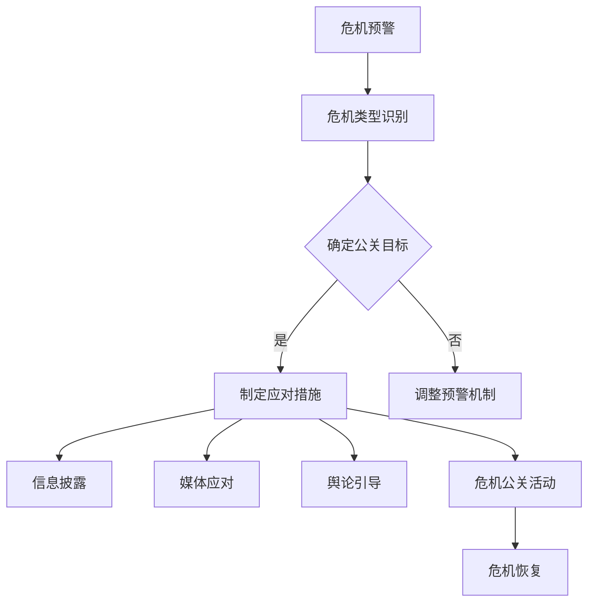

                 

# 创业公司的危机公关策略

> **关键词：** 创业公司、危机公关、策略、沟通、社交媒体、品牌形象
> 
> **摘要：** 本文将深入探讨创业公司在面对危机时的公关策略。通过分析危机类型、公关目标、沟通原则以及应对措施，帮助创业公司建立有效的危机管理机制，保障品牌形象，实现可持续发展。

## 1. 背景介绍

### 1.1 目的和范围

本文旨在为创业公司提供一套系统性、可操作的危机公关策略。通过对危机公关的核心概念、基本原则和实践方法进行详细阐述，旨在帮助创业公司在面对突发危机时，能够迅速反应，采取有效的措施，将负面影响降至最低，甚至转化为品牌提升的机会。

### 1.2 预期读者

本文适合创业公司创始人、高层管理者、公关团队成员以及希望提升危机应对能力的专业人士阅读。无论您是初创企业还是有一定规模的公司，本文都将为您提供实用的指导。

### 1.3 文档结构概述

本文结构分为以下几个部分：

1. 背景介绍：介绍本文的目的、读者对象及文章结构。
2. 核心概念与联系：阐述危机公关的核心概念及其相互关系。
3. 核心算法原理 & 具体操作步骤：详细讲解危机公关的基本原则和操作步骤。
4. 数学模型和公式 & 详细讲解 & 举例说明：通过数学模型和公式，解释危机公关的关键点。
5. 项目实战：通过实际案例，展示危机公关策略的应用。
6. 实际应用场景：分析不同类型的危机及其应对策略。
7. 工具和资源推荐：推荐学习资源和工具。
8. 总结：对未来发展趋势与挑战的展望。
9. 附录：常见问题与解答。
10. 扩展阅读 & 参考资料：提供进一步学习的资料。

### 1.4 术语表

#### 1.4.1 核心术语定义

- **危机公关：** 指企业在面临突发事件、负面信息或其他危机时，通过一系列策略和措施，维护企业声誉、减少损失并重塑企业形象的过程。
- **品牌形象：** 消费者对企业的整体感知和评价，包括企业的信誉、声誉和公众形象等。
- **危机类型：** 指企业可能面临的危机类别，如产品缺陷、负面舆论、财务危机等。
- **沟通原则：** 包括透明性、及时性、真实性、一致性等，指导企业如何与内外部沟通。

#### 1.4.2 相关概念解释

- **突发事件：** 突发事件是指突然发生的、对企业的运营和声誉产生重大影响的意外事件。
- **危机管理：** 是指企业为预防和应对危机而采取的一系列措施和策略。
- **媒体关系：** 指企业与媒体之间的互动和沟通，包括新闻报道、媒体采访、媒体合作等。

#### 1.4.3 缩略词列表

- **PR：** 公关（Public Relations）
- **CRM：** 客户关系管理（Customer Relationship Management）
- **SEO：** 搜索引擎优化（Search Engine Optimization）
- **SMM：** 社交媒体营销（Social Media Marketing）
- **Crisis：** 危机（Crisis）

## 2. 核心概念与联系

### 2.1 危机公关的概念与作用

危机公关是指企业在面临各种危机时，通过积极的沟通、宣传和管理手段，维护企业声誉、降低损失并重塑企业形象的过程。危机公关不仅是对企业声誉的保护，更是对企业核心价值观的传承和巩固。

危机公关的核心作用体现在以下几个方面：

1. **危机预警：** 通过对市场、消费者、媒体等外部环境的监测，及时发现潜在危机，提前采取措施。
2. **危机应对：** 在危机爆发时，迅速反应，采取有效的措施，防止危机扩大。
3. **危机恢复：** 危机过后，通过一系列公关活动，重塑企业形象，恢复品牌信誉。

### 2.2 危机公关的核心概念及其关系

危机公关涉及多个核心概念，包括危机类型、公关目标、沟通原则和应对措施。这些概念相互关联，共同构成一个完整的危机公关体系。

1. **危机类型：** 包括产品缺陷、负面舆论、财务危机、管理层变动等。不同类型的危机需要采取不同的应对策略。
2. **公关目标：** 包括防止危机扩大、降低损失、重塑企业形象等。公关目标的实现是危机公关的核心。
3. **沟通原则：** 包括透明性、及时性、真实性、一致性等。沟通原则是危机公关的基本指导方针。
4. **应对措施：** 包括信息披露、媒体应对、舆论引导、危机公关活动等。应对措施是实现公关目标的具体手段。

### 2.3 核心概念原理和架构的 Mermaid 流程图



## 3. 核心算法原理 & 具体操作步骤

### 3.1 危机公关算法原理

危机公关的算法原理可以概括为四个阶段：危机预警、危机应对、危机恢复和反馈优化。每个阶段都有相应的算法和操作步骤。

1. **危机预警：** 利用数据分析和监测技术，及时发现潜在危机。
2. **危机应对：** 根据危机类型和公关目标，制定具体的应对措施。
3. **危机恢复：** 通过一系列公关活动，恢复企业形象。
4. **反馈优化：** 对危机公关效果进行评估，优化预警和应对策略。

### 3.2 具体操作步骤

#### 3.2.1 危机预警

1. **数据收集：** 收集市场、消费者、媒体等外部环境的数据。
2. **数据分析：** 利用数据分析技术，识别潜在危机。
3. **预警机制：** 建立预警机制，及时发现问题。

#### 3.2.2 危机应对

1. **危机类型识别：** 根据危机特点，确定危机类型。
2. **确定公关目标：** 根据企业战略和危机特点，确定公关目标。
3. **制定应对措施：** 制定具体应对措施，包括信息披露、媒体应对、舆论引导等。

#### 3.2.3 危机恢复

1. **信息披露：** 及时、透明地披露危机相关信息。
2. **媒体应对：** 与媒体建立良好关系，引导舆论方向。
3. **舆论引导：** 通过公关活动，重塑企业形象。
4. **危机公关活动：** 组织危机公关活动，恢复品牌信誉。

#### 3.2.4 反馈优化

1. **效果评估：** 对危机公关效果进行评估。
2. **反馈收集：** 收集消费者、媒体、员工的反馈。
3. **优化策略：** 根据反馈，优化预警和应对策略。

### 3.3 伪代码示例

```python
def crisis_public_relation():
    data = collect_data()
    potential_crisis = analyze_data(data)
    if potential_crisis:
        crisis_type = identify_crisis_type(potential_crisis)
        public_relation_objective = determine_public_relation_objective(crisis_type)
        response_measures = develop_response_measures(public_relation_objective)
        implement_response_measures(response_measures)
        public_relation_effect = evaluate_public_relation_effect()
        feedback = collect_feedback(public_relation_effect)
        optimize_strategy(feedback)
```

## 4. 数学模型和公式 & 详细讲解 & 举例说明

### 4.1 数学模型和公式

在危机公关中，可以使用以下数学模型和公式来分析和评估危机的影响和公关效果：

1. **危机影响评估模型：**

   $$ I = f(C, S, O) $$

   其中，$I$ 代表危机影响，$C$ 代表危机严重程度，$S$ 代表危机扩散速度，$O$ 代表危机舆论倾向。

2. **公关效果评估模型：**

   $$ E = f(R, M, A) $$

   其中，$E$ 代表公关效果，$R$ 代表信息传播效果，$M$ 代表媒体关注度，$A$ 代表公众态度。

### 4.2 详细讲解

1. **危机影响评估模型：**

   - $C$：危机严重程度，可以通过评估危机的规模、影响范围、损失程度等因素来确定。
   - $S$：危机扩散速度，可以通过评估危机信息的传播速度、扩散范围等因素来确定。
   - $O$：危机舆论倾向，可以通过评估媒体和公众对危机的舆论倾向来确定。

   该模型可以帮助企业评估危机的潜在影响，为制定应对措施提供依据。

2. **公关效果评估模型：**

   - $R$：信息传播效果，可以通过评估信息的传播范围、传播速度等因素来确定。
   - $M$：媒体关注度，可以通过评估媒体对危机的关注程度、报道频率等因素来确定。
   - $A$：公众态度，可以通过评估公众对危机的态度、舆情变化等因素来确定。

   该模型可以帮助企业评估公关活动的效果，为优化公关策略提供依据。

### 4.3 举例说明

#### 4.3.1 危机影响评估

假设某创业公司发布一款新产品，但由于产品质量问题，导致部分用户投诉。根据危机影响评估模型，可以计算出危机的影响：

- $C$：危机严重程度为3（1-5分，3表示较为严重）
- $S$：危机扩散速度为4（1-5分，4表示较快）
- $O$：危机舆论倾向为2（1-5分，2表示负面）

代入公式：

$$ I = f(C, S, O) = f(3, 4, 2) = 3*4*2 = 24 $$

危机影响得分为24分，表示危机较为严重，需要采取紧急应对措施。

#### 4.3.2 公关效果评估

假设创业公司通过一系列公关活动，包括信息披露、媒体应对、舆论引导等，成功缓解了危机。根据公关效果评估模型，可以计算出公关效果：

- $R$：信息传播效果为4（1-5分，4表示较好）
- $M$：媒体关注度

