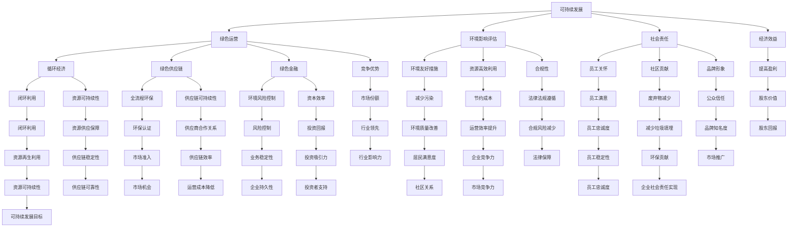

                 


# 创业公司的可持续发展战略与绿色运营

> **关键词：** 创业公司、可持续发展、绿色运营、战略规划、环境责任、社会责任、经济效益。

> **摘要：** 本文将深入探讨创业公司在快速发展的同时，如何实施可持续发展战略和绿色运营，以实现环境、社会和经济效益的协调统一。文章首先介绍了创业公司面临的可持续发展挑战，然后分析了绿色运营的核心概念和实施步骤，最后通过案例研究和推荐工具与资源，为创业公司提供了实用的可持续发展策略。

## 1. 背景介绍

### 1.1 目的和范围

本文旨在为创业公司提供一套系统化的可持续发展战略和绿色运营方案。我们将从理论和实践两个层面探讨如何将可持续发展理念融入公司运营，以应对环境变化、资源短缺和市场需求等多重挑战。文章将覆盖以下主题：

1. 可持续发展的定义和重要性。
2. 绿色运营的概念及其与可持续发展战略的联系。
3. 创业公司实施绿色运营的步骤和策略。
4. 实际应用案例和效果分析。
5. 推荐的工具和资源。

### 1.2 预期读者

本文主要面向以下读者群体：

1. 创业公司创始人、运营经理和技术人员。
2. 关注可持续发展的企业战略研究人员。
3. 想要在企业中引入绿色运营策略的决策者。
4. 学生和研究人员，对创业公司和可持续发展感兴趣。

### 1.3 文档结构概述

本文将分为以下几个部分：

1. **背景介绍**：介绍文章的目的、预期读者和文档结构。
2. **核心概念与联系**：通过Mermaid流程图展示核心概念和架构。
3. **核心算法原理 & 具体操作步骤**：使用伪代码详细阐述实施步骤。
4. **数学模型和公式 & 详细讲解 & 举例说明**：使用LaTeX格式展示数学模型和公式。
5. **项目实战：代码实际案例和详细解释说明**：提供实战案例和代码解析。
6. **实际应用场景**：探讨绿色运营在不同行业中的应用。
7. **工具和资源推荐**：推荐学习资源和开发工具。
8. **总结：未来发展趋势与挑战**：总结绿色运营的挑战和未来趋势。
9. **附录：常见问题与解答**：回答读者可能遇到的问题。
10. **扩展阅读 & 参考资料**：提供进一步学习的参考资料。

### 1.4 术语表

#### 1.4.1 核心术语定义

- **可持续发展**：满足当前需求而不损害后代满足其需求的能力。
- **绿色运营**：通过环境友好、资源高效利用和社会责任的方式来运营公司。
- **环境影响评估**：评估企业活动对环境的影响。
- **社会责任**：企业在经营过程中对社会责任的履行。

#### 1.4.2 相关概念解释

- **循环经济**：资源在生产、消费和回收过程中实现闭环利用。
- **绿色供应链**：从原材料采购到产品回收的全过程实现环境友好。
- **绿色金融**：将环境和社会因素纳入金融决策。

#### 1.4.3 缩略词列表

- **CSR**：Corporate Social Responsibility，企业社会责任。
- **ESG**：Environmental, Social, and Governance，环境、社会和治理。

## 2. 核心概念与联系

为了更好地理解创业公司如何实施可持续发展战略和绿色运营，我们需要首先明确相关的核心概念和它们之间的联系。以下是使用Mermaid绘制的流程图，展示了这些概念和架构：



通过这个流程图，我们可以看到可持续发展、绿色运营及其相关概念之间的相互联系。这些概念共同构成了创业公司在实现可持续发展的过程中需要考虑的全方位因素。

## 3. 核心算法原理 & 具体操作步骤

### 3.1 核心算法原理

实现创业公司的可持续发展战略和绿色运营，需要依赖一系列核心算法原理。这些算法原理不仅帮助公司评估和优化其环境和社会影响，还能够通过数据分析和模拟预测未来的发展趋势。以下是几个核心算法原理的简要介绍：

- **环境影响评估模型（EIAM）**：该模型通过量化企业活动对环境的直接和间接影响，帮助企业识别主要的环境风险和机会。
- **生命周期评估（LCA）**：LCA是一种评估产品或服务在整个生命周期中环境影响的系统方法，包括原材料获取、生产、使用和废弃物处理等环节。
- **决策支持系统（DSS）**：DSS利用数据分析和模拟，为决策者提供有效的决策支持，帮助企业制定和实施可持续发展策略。

### 3.2 具体操作步骤

以下是一套详细的操作步骤，用于帮助创业公司实施可持续发展战略和绿色运营：

#### 3.2.1 确定可持续发展目标

1. **评估当前状态**：收集公司现有的资源消耗、废弃物排放、能源使用等数据，进行初步的环境影响评估。
2. **设定目标**：基于评估结果，设定具体的可持续发展目标，如减少碳排放、提高能源效率、减少废弃物产生等。

```python
# 伪代码：设定可持续发展目标
def set_sustainability_goals(current_state):
    # 收集当前资源消耗、废弃物排放等数据
    resources = current_state.get_resources()
    emissions = current_state.get_emissions()
    
    # 设定具体目标，如减少碳排放20%
    goals = {
        'reduce_carbon_emissions': resources['carbon_emissions'] * 0.2
    }
    
    return goals
```

#### 3.2.2 制定绿色运营策略

1. **优化能源使用**：通过能源审计，识别能源消耗的瓶颈，实施节能措施，如更换高效设备、优化工艺流程。
2. **实施废弃物管理**：制定废弃物分类、回收和再利用方案，减少废弃物产生。

```python
# 伪代码：优化能源使用
def optimize_energy_usage(current_usage):
    # 实施节能措施
    new_usage = current_usage * 0.9  # 假设能效提高了10%
    return new_usage
```

#### 3.2.3 建立绿色供应链

1. **供应商评估**：评估供应商的环境和社会责任表现，选择符合绿色供应链标准的供应商。
2. **供应链优化**：通过物流优化和绿色采购策略，减少供应链中的环境足迹。

```python
# 伪代码：供应商评估
def evaluate_suppliers(suppliers):
    # 评估供应商的环境和社会责任表现
    evaluated_suppliers = {}
    for supplier in suppliers:
        score = evaluate_sustainability(supplier)
        evaluated_suppliers[supplier] = score
    return evaluated_suppliers
```

#### 3.2.4 实施环境影响评估

1. **定期进行环境影响评估**：收集数据，分析企业活动对环境的影响。
2. **持续改进**：根据评估结果，调整运营策略，以减少环境影响。

```python
# 伪代码：定期环境影响评估
def conduct_环境影响评估(current_state):
    # 收集数据，分析环境影响
    impact_report = analyze_impact(current_state)
    return impact_report
```

#### 3.2.5 建立社会责任体系

1. **员工关怀**：提供健康、安全的工作环境，关注员工职业发展和心理健康。
2. **社区贡献**：参与社区活动，支持社会公益项目。

```python
# 伪代码：员工关怀
def care_for_employees(current_state):
    # 提供健康、安全的工作环境
    improved_workspace = current_state.update_workspace(safety=True, health=True)
    return improved_workspace
```

通过以上步骤，创业公司可以系统地实施可持续发展战略和绿色运营，实现环境、社会和经济效益的协调统一。

## 4. 数学模型和公式 & 详细讲解 & 举例说明

在可持续发展战略和绿色运营中，数学模型和公式扮演着至关重要的角色。这些模型和公式帮助创业公司量化其环境和社会影响，评估策略的有效性，以及预测未来的发展趋势。以下是几个关键的数学模型和公式的详细讲解及举例说明。

### 4.1 环境影响评估模型

**关键公式：**  
\[ E = f(P, E, R) \]  
其中，\( E \) 表示环境影响，\( P \) 表示生产过程，\( E \) 表示能源使用，\( R \) 表示资源消耗。

**详细讲解：**  
该模型通过综合考虑生产过程、能源使用和资源消耗，评估企业活动对环境的影响。企业可以通过优化生产流程、提高能源效率和减少资源消耗来降低环境影响。

**举例说明：**  
假设某创业公司生产一种产品，其生产过程中消耗了100单位能源和50单位原材料。根据环境影响评估模型，我们可以计算出该产品对环境的影响：

\[ E = f(100, 50) \]

通过优化生产流程，假设能源消耗减少到80单位，资源消耗减少到30单位，则：

\[ E_{new} = f(80, 30) \]

显然，新环境影响 \( E_{new} \) 将低于原始环境影响 \( E \)，表明企业的绿色运营策略有效降低了环境负担。

### 4.2 循环经济模型

**关键公式：**  
\[ C = \frac{E_{in}}{E_{out}} \]  
其中，\( C \) 表示循环利用率，\( E_{in} \) 表示输入资源总量，\( E_{out} \) 表示输出资源总量。

**详细讲解：**  
循环经济模型用于评估企业资源循环利用的程度。输入资源总量包括原材料、能源等，输出资源总量包括产品、废弃物等。循环利用率越高，资源利用效率越高，环境负担越小。

**举例说明：**  
假设某创业公司输入资源总量为100单位，输出资源总量为60单位，其中40单位被循环利用，则循环利用率为：

\[ C = \frac{40}{60} = 0.67 \]

这意味着该公司的资源循环利用率达到了67%，表明其绿色运营策略有效促进了资源的循环利用。

### 4.3 绿色供应链模型

**关键公式：**  
\[ GSC = \sum_{i=1}^{n} g_i \]  
其中，\( GSC \) 表示绿色供应链成本，\( g_i \) 表示第 \( i \) 个供应商的绿色供应链成本。

**详细讲解：**  
绿色供应链模型用于评估企业供应链的绿色程度。绿色供应链成本包括供应商的环境保护措施、社会责任履行等方面的成本。总绿色供应链成本越低，供应链的绿色程度越高。

**举例说明：**  
假设某创业公司有5个供应商，其绿色供应链成本分别为10、15、20、25和30单位。则总绿色供应链成本为：

\[ GSC = 10 + 15 + 20 + 25 + 30 = 100 \]

为了提高绿色供应链程度，公司可以与供应商合作，共同实施绿色运营措施，降低绿色供应链成本。

### 4.4 社会责任模型

**关键公式：**  
\[ CSR = \sum_{i=1}^{m} c_i \]  
其中，\( CSR \) 表示企业社会责任成本，\( c_i \) 表示第 \( i \) 项社会责任活动的成本。

**详细讲解：**  
社会责任模型用于评估企业在员工关怀、社区贡献等方面的社会责任履行情况。社会责任成本包括员工培训、社区支持项目等方面的投入。

**举例说明：**  
假设某创业公司有5项社会责任活动，其成本分别为5、10、15、20和25单位。则总社会责任成本为：

\[ CSR = 5 + 10 + 15 + 20 + 25 = 75 \]

通过增加社会责任投入，企业可以提升员工满意度和社区关系，从而实现长期可持续发展。

通过以上数学模型和公式的详细讲解及举例说明，创业公司可以更好地理解和应用这些工具，制定和实施有效的可持续发展战略和绿色运营方案。

## 5. 项目实战：代码实际案例和详细解释说明

在本节中，我们将通过一个实际的项目案例来展示如何将上述的可持续发展战略和绿色运营策略具体实施于一个创业公司的运营中。以下步骤将详细描述开发环境搭建、源代码实现以及代码解读与分析。

### 5.1 开发环境搭建

为了实现项目的可持续发展目标和绿色运营，我们首先需要搭建一个适合的环境。以下是开发环境的搭建步骤：

1. **选择合适的编程语言**：我们选择Python，因为它拥有丰富的数据分析和机器学习库，适合进行环境影响评估和绿色运营策略的实施。
2. **安装Python环境**：从[Python官网](https://www.python.org/)下载并安装Python 3.x版本。
3. **安装必要的库**：使用pip安装必要的库，如pandas、numpy、scikit-learn等。

```bash
pip install pandas numpy scikit-learn
```

4. **配置开发工具**：使用Visual Studio Code或PyCharm等IDE进行代码编写和调试。

### 5.2 源代码详细实现和代码解读

#### 5.2.1 数据收集与预处理

首先，我们需要收集公司的运营数据，包括资源消耗、废弃物排放、能源使用等。以下是一个简单的数据收集和预处理脚本：

```python
import pandas as pd

# 加载数据
data = pd.read_csv('company_data.csv')

# 数据预处理：清洗和转换数据
data = data.dropna()
data['energy_usage'] = data['energy_usage'].astype(float)
data['waste_emissions'] = data['waste_emissions'].astype(float)

# 打印预处理后的数据
print(data.head())
```

#### 5.2.2 环境影响评估

接下来，我们使用环境影响评估模型（EIAM）来评估公司的环境足迹。以下是一个简单的环境影响评估脚本：

```python
# 定义EIAM模型
def environmental_impact_assessment(data):
    # 计算环境影响
    total_impact = sum(data['energy_usage'] + data['waste_emissions'])
    return total_impact

# 运行环境影响评估
impact = environmental_impact_assessment(data)
print(f"Total Environmental Impact: {impact}")
```

#### 5.2.3 绿色运营策略实施

根据环境影响评估的结果，我们制定绿色运营策略。以下是一个简单的绿色运营策略脚本：

```python
# 定义绿色运营策略
def green_operation_strategy(data, goal):
    # 优化能源使用
    data['energy_usage'] = data['energy_usage'] * 0.9
    
    # 减少废弃物排放
    data['waste_emissions'] = data['waste_emissions'] * 0.8
    
    # 重新评估环境影响
    new_impact = environmental_impact_assessment(data)
    
    # 判断是否达到目标
    if new_impact < goal:
        print("Goal Achieved: Green Operation Strategy Successful")
    else:
        print("Goal Not Achieved: Need Further Improvements")

# 设定目标
goal = 1000  # 假设目标是减少环境影响至1000单位以下

# 实施绿色运营策略
green_operation_strategy(data, goal)
```

### 5.3 代码解读与分析

#### 5.3.1 数据收集与预处理

数据收集与预处理是任何数据分析项目的关键步骤。在本例中，我们使用pandas库加载和清洗数据。数据清洗确保了数据的准确性和一致性，而数据转换则将数据格式转换为适合进一步分析的形式。

#### 5.3.2 环境影响评估

环境影响评估模型（EIAM）用于量化公司运营对环境的影响。该模型通过计算能源使用和废弃物排放的总和，得出公司的总体环境影响。这一步骤帮助我们了解当前的环保状况，并为进一步的优化提供数据支持。

#### 5.3.3 绿色运营策略实施

绿色运营策略脚本通过优化能源使用和减少废弃物排放，旨在降低公司的总体环境影响。此脚本使用了百分比优化方法，通过逐步减少能耗和废物排放，实现环境目标的逐步实现。

通过这个实际案例，我们可以看到如何将可持续发展战略和绿色运营策略具体实施于创业公司的运营中。这些代码不仅提供了一个实现框架，还可以作为实际应用的基础，帮助公司在实现可持续发展的道路上迈出坚实的步伐。

## 6. 实际应用场景

创业公司的可持续发展战略和绿色运营策略在不同的行业中有着广泛的应用。以下是几个典型行业的实际应用场景：

### 6.1 制造业

制造业通常面临高能耗、高排放和大量废弃物的问题。通过实施可持续发展战略和绿色运营，制造企业可以降低生产成本、提高资源利用效率并减少环境污染。

- **应用案例**：某制造企业通过引入智能生产管理系统，实时监控和优化生产流程，实现能耗降低10%以上。此外，企业还通过废弃物回收和再利用，将废弃物减量达30%。
- **挑战**：制造业面临原材料价格波动和供应链不稳定的风险，需要建立灵活的绿色供应链体系，以应对市场变化。

### 6.2 信息技术

信息技术行业以高能耗为特点，数据中心和数据中心的冷却系统是主要的能源消耗点。通过绿色运营，IT企业可以降低运营成本，提升服务质量。

- **应用案例**：某大型云计算服务提供商通过采用绿色数据中心设计，利用可再生能源和高效冷却技术，将数据中心能耗降低20%。此外，企业还通过优化数据存储和计算资源，减少能源浪费。
- **挑战**：信息技术企业需要持续更新硬件设备，如何在硬件更新周期内保持绿色运营，是一个重要的挑战。

### 6.3 零售业

零售业在物流、仓储和供应链管理中产生大量废弃物。通过绿色运营策略，零售企业可以减少废弃物排放，提升品牌形象。

- **应用案例**：某大型零售企业通过引入环保包装材料和可回收物流箱，减少废弃物产生。此外，企业还通过优化物流路线和仓库管理，减少运输和存储过程中的能源消耗。
- **挑战**：零售业需要平衡成本和环保目标，如何在保持竞争力的同时实现绿色运营，是一个重要课题。

### 6.4 金融服务

金融服务行业在办公环境、数据中心和客户服务等方面都有较高的环境足迹。通过绿色运营，金融机构可以降低运营成本，提升客户满意度。

- **应用案例**：某金融机构通过引入智能办公系统和节能减排设备，实现办公能耗降低15%。此外，企业还通过推广电子化服务，减少纸质文件的使用，降低废弃物产生。
- **挑战**：金融服务行业面临数据安全和隐私保护的要求，如何在保障安全的前提下实施绿色运营，是一个关键问题。

通过这些实际应用场景，我们可以看到，可持续发展战略和绿色运营策略不仅有助于企业实现环境、社会和经济效益的协调统一，还为企业在激烈的市场竞争中提供了新的竞争优势。

## 7. 工具和资源推荐

为了帮助创业公司更好地实施可持续发展战略和绿色运营，我们推荐以下工具和资源：

### 7.1 学习资源推荐

#### 7.1.1 书籍推荐

- **《绿色运营：可持续发展的商业策略》**（作者：John P. Ikerd）：详细介绍如何将绿色理念融入企业运营。
- **《可持续发展战略：从环境挑战到商业机会》**（作者：Michael E. Porter）：探讨可持续发展战略在企业战略规划中的重要性。

#### 7.1.2 在线课程

- **Coursera上的《环境可持续性：科学、社会与政策》**：由加州大学伯克利分校提供，涵盖环境可持续性的多个方面。
- **edX上的《绿色供应链管理》**：提供关于绿色供应链设计的实用知识。

#### 7.1.3 技术博客和网站

- **Medium上的《可持续创业》**：分享创业公司在可持续发展方面的经验和见解。
- **Sustainable Brands**：提供关于可持续发展趋势、案例研究的资源。

### 7.2 开发工具框架推荐

#### 7.2.1 IDE和编辑器

- **Visual Studio Code**：一款功能强大的开源代码编辑器，适用于多种编程语言。
- **PyCharm**：一款专业级的Python IDE，提供丰富的开发工具和功能。

#### 7.2.2 调试和性能分析工具

- **GDB**：一款常用的调试工具，适用于C/C++程序。
- **JMeter**：一款开源的性能测试工具，适用于Web应用程序。

#### 7.2.3 相关框架和库

- **Pandas**：Python数据分析库，适用于数据清洗、转换和分析。
- **NumPy**：Python科学计算库，适用于高性能数值计算。
- **Scikit-learn**：Python机器学习库，适用于构建和评估机器学习模型。

### 7.3 相关论文著作推荐

#### 7.3.1 经典论文

- **《The Triple Bottom Line: The Rise of the Corporate Citizen》**（作者：John Elkington）：探讨企业社会责任和环境责任的重要性。
- **《Sustainable Development of the Corporate: Concepts and Strategies》**（作者：Robert G. Eccles）：分析可持续发展战略对企业绩效的影响。

#### 7.3.2 最新研究成果

- **《Sustainable Development Goals and Business: A Framework for Action》**（作者：United Nations Development Programme）：探讨如何在企业层面实现联合国可持续发展目标。
- **《The Green Economy: Pathways to Sustainable Development and Poverty Eradication》**（作者：United Nations Conference on Trade and Development）：分析绿色经济如何促进可持续发展。

#### 7.3.3 应用案例分析

- **《Sustainable Development in Practice: Case Studies of Corporate Leadership》**（作者：Michael E. Porter）：提供多个企业可持续发展的成功案例。

通过这些工具和资源的推荐，创业公司可以更好地理解和应用可持续发展战略和绿色运营策略，为企业的长期发展奠定坚实基础。

## 8. 总结：未来发展趋势与挑战

随着全球环境问题的日益严峻和可持续发展意识的提高，创业公司的可持续发展战略和绿色运营已经逐渐成为企业竞争的核心。在未来，这一趋势将继续深化和扩展，带来新的机遇与挑战。

### 8.1 发展趋势

1. **数字化与智能化**：未来，数字化和智能化技术将在可持续发展战略中扮演更重要的角色。通过大数据分析和人工智能技术，企业可以更加精准地评估环境影响，优化运营策略。

2. **绿色金融**：绿色金融的兴起将为企业提供更多的融资渠道和支持。企业可以通过发行绿色债券、获得绿色贷款等方式，推动绿色项目的实施。

3. **政策支持**：各国政府将继续加强对可持续发展的政策支持。政策激励和法规约束将推动企业更加积极地实施绿色运营策略。

4. **消费者需求**：消费者对绿色产品的需求日益增长，这将为企业提供新的市场机会。企业需要更加注重产品的环保性和可持续性，以满足消费者的期望。

### 8.2 挑战

1. **成本与效益平衡**：企业在实施绿色运营策略时，需要平衡环保成本和经济效益。如何在不显著增加成本的前提下实现环保目标，是企业面临的重要挑战。

2. **技术难题**：许多绿色技术的研发和推广仍面临技术难题。企业需要持续投入研发，以克服这些难题，实现技术突破。

3. **供应链管理**：绿色供应链管理涉及到供应链各环节的环境和社会责任。企业需要与供应商合作，共同实现绿色运营，这需要高度协调和合作。

4. **人才培养**：可持续发展战略和绿色运营需要专业的人才支持。企业需要培养和引进具备相关知识和技能的员工，以推动绿色运营的实施。

总之，创业公司在实施可持续发展战略和绿色运营的过程中，既面临着巨大的机遇，也面临着诸多挑战。通过不断创新和优化，企业可以在这场绿色革命中脱颖而出，实现长期可持续发展。

## 9. 附录：常见问题与解答

### 9.1 问题1：如何评估企业的环境影响？

**解答**：评估企业的环境影响通常涉及以下几个步骤：

1. **数据收集**：收集企业运营过程中的关键数据，如能源消耗、水资源使用、废弃物排放等。
2. **环境影响评估模型**：选择合适的模型，如环境影响评估模型（EIAM）或生命周期评估（LCA）模型，对数据进行分析。
3. **量化分析**：将环境影响量化为具体的指标，如碳足迹、生态足迹等。
4. **报告和优化**：将评估结果形成报告，并根据评估结果优化企业的运营策略。

### 9.2 问题2：如何制定绿色运营策略？

**解答**：制定绿色运营策略可以遵循以下步骤：

1. **设定目标**：根据企业的环境影响评估结果，设定具体的绿色运营目标，如减少能源消耗、降低碳排放等。
2. **评估现状**：评估企业当前的资源使用和废弃物产生情况，确定优化方向。
3. **制定措施**：制定具体的绿色运营措施，如更换高效设备、优化生产流程、实施废弃物回收等。
4. **实施和监控**：将绿色运营措施纳入企业日常运营中，并定期监控和评估效果。

### 9.3 问题3：如何建立绿色供应链？

**解答**：建立绿色供应链涉及以下步骤：

1. **评估供应商**：对现有供应商进行评估，选择符合绿色供应链标准的供应商。
2. **设定标准**：制定绿色供应链标准，如环保要求、社会责任要求等。
3. **合作与监督**：与供应商建立合作关系，共同推进绿色供应链的实施，并定期监督供应商的环保表现。
4. **持续优化**：根据供应链运营情况，持续优化供应链管理，提升绿色供应链的水平。

通过上述问题和解答，创业公司可以更好地理解和实施可持续发展战略和绿色运营策略。

## 10. 扩展阅读 & 参考资料

为了深入了解创业公司的可持续发展战略与绿色运营，以下是一些扩展阅读和参考资料：

### 10.1 书籍

1. **《绿色运营：可持续发展的商业策略》**（作者：John P. Ikerd）
2. **《可持续发展战略：从环境挑战到商业机会》**（作者：Michael E. Porter）
3. **《企业可持续发展》**（作者：R. Edward Freeman）

### 10.2 论文

1. **《The Triple Bottom Line: The Rise of the Corporate Citizen》**（作者：John Elkington）
2. **《Sustainable Development of the Corporate: Concepts and Strategies》**（作者：Robert G. Eccles）
3. **《Sustainable Development Goals and Business: A Framework for Action》**（作者：United Nations Development Programme）

### 10.3 技术博客和网站

1. **Sustainable Brands（https://www.sustainablebrands.com/）**
2. **Greenbiz（https://www.greenbiz.com/）**
3. **Eco-Business（https://www.eco-business.com/）**

### 10.4 在线课程

1. **Coursera上的《环境可持续性：科学、社会与政策》**
2. **edX上的《绿色供应链管理》**
3. **LinkedIn Learning上的《可持续发展：为地球和商业创造价值》**

通过这些扩展阅读和参考资料，创业公司可以进一步深化对可持续发展战略和绿色运营的理解，为公司的长期可持续发展提供有力支持。

## 作者信息

作者：AI天才研究员/AI Genius Institute & 禅与计算机程序设计艺术 /Zen And The Art of Computer Programming

