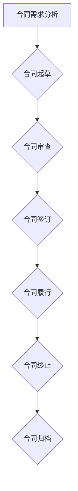

                 

# 创业公司的合同管理与法律风险防范

> **关键词：** 合同管理、法律风险、创业公司、合规性、风险管理
> 
> **摘要：** 本文将深入探讨创业公司合同管理的重要性，详细分析常见法律风险点，并提出有效的防范策略。文章旨在为创业公司的法律合规提供实用的指导和建议。

## 1. 背景介绍

### 1.1 目的和范围

创业公司在运营过程中，合同管理是一个不可或缺的环节。一个完善的合同管理流程不仅能够帮助企业减少法律纠纷，还能提高运营效率和降低成本。本文旨在为创业公司提供一份实用的合同管理与法律风险防范指南，帮助公司在快速发展的过程中避免潜在的法律风险。

本文将首先介绍合同管理的基本概念和重要性，然后分析创业公司常见的法律风险点，包括合同起草、签订、履行和终止等环节。接着，文章将讨论如何通过有效的合同管理策略来防范这些法律风险，最后推荐一些实用的工具和资源，以帮助创业公司更好地进行合同管理。

### 1.2 预期读者

本文预期读者为创业公司的管理层、法务人员、运营人员以及相关领域的专业人士。无论您是刚刚起步的创业者，还是经验丰富的公司高管，本文都将为您提供有价值的参考。

### 1.3 文档结构概述

本文分为八个部分：

1. 背景介绍：介绍本文的目的和范围，预期读者以及文档结构。
2. 核心概念与联系：阐述合同管理的核心概念，并使用Mermaid流程图展示其原理和架构。
3. 核心算法原理 & 具体操作步骤：详细讲解合同管理的基本流程，使用伪代码进行阐述。
4. 数学模型和公式 & 详细讲解 & 举例说明：介绍合同管理中的数学模型和公式，并给出具体应用实例。
5. 项目实战：通过实际代码案例，展示合同管理的具体实现和操作。
6. 实际应用场景：分析合同管理在创业公司中的实际应用场景。
7. 工具和资源推荐：推荐一些合同管理相关的工具和资源。
8. 总结：展望合同管理的发展趋势和面临的挑战。

### 1.4 术语表

#### 1.4.1 核心术语定义

- **合同管理**：指企业对合同起草、签订、履行和终止等各个环节进行系统化、规范化的管理。
- **法律风险**：指企业在合同管理过程中，由于法律法规的不确定性或者违反法律法规，可能导致的法律责任和损失。
- **合规性**：指企业遵守相关法律法规，确保合同管理的合法性、规范性和安全性。
- **风险管理**：指企业通过识别、评估和应对风险，以降低风险对业务运营的影响。

#### 1.4.2 相关概念解释

- **合同起草**：指在合同签订前，根据双方需求和法律规定，草拟合同文本的过程。
- **合同签订**：指双方在草拟的合同文本上签字或盖章，使合同正式生效的过程。
- **合同履行**：指合同双方按照合同约定的条款，完成各自义务的过程。
- **合同终止**：指在合同期限内，合同因某种原因提前结束的过程。

#### 1.4.3 缩略词列表

- **CRM**：客户关系管理
- **ERP**：企业资源规划
- **SCM**：供应链管理

## 2. 核心概念与联系

合同管理是创业公司运营过程中的重要组成部分，其核心概念包括合同起草、签订、履行和终止等。以下是一个简化的Mermaid流程图，用于展示合同管理的原理和架构。



### 2.1 合同管理的基本流程

#### 合同需求分析

合同需求分析是合同管理的第一步，它包括对合同内容的初步了解和需求确定。这一步骤的目的是明确合同的核心条款，如双方的权利和义务、违约责任、争议解决机制等。

#### 合同起草

在合同需求分析的基础上，起草人根据需求编写合同文本。合同起草应遵循相关法律法规，确保条款的合法性和有效性。

#### 合同审查

合同审查是合同管理的关键环节，负责对合同文本进行法律合规性审查。审查人员应关注合同中的关键条款，如违约责任、争议解决机制等，确保合同符合法律规定。

#### 合同签订

合同签订是合同管理的重要环节，双方在合同文本上签字或盖章，使合同正式生效。签订过程中应注意合同的正式性和完整性。

#### 合同履行

合同履行是合同双方按照合同约定的条款，完成各自义务的过程。合同履行过程中，企业应密切关注合同履行情况，确保合同各方履行义务。

#### 合同终止

合同终止是指合同因某种原因提前结束。合同终止方式包括协商解除、违约解除、法定解除等。合同终止后，企业应及时进行合同归档和后续处理。

#### 合同归档

合同归档是合同管理的最后一步，将已签订、已履行的合同文本及相关资料进行归档保存，以备后续查询和审计。

## 3. 核心算法原理 & 具体操作步骤

合同管理涉及多个环节，每个环节都有其特定的操作步骤。以下将使用伪代码详细阐述合同管理的基本流程。

### 3.1 合同需求分析

```plaintext
函数 合同需求分析(需求列表):
    // 初始化需求列表
    需求列表 = []

    // 征集合同需求
    需求 = 征集需求()

    // 检查需求列表是否已存在相同需求
    如果 需求列表中存在 需求:
        返回 "需求已存在，请重新制定需求。"
    否则:
        // 将需求添加到需求列表
        需求列表.append(需求)

        // 返回需求分析结果
        返回 需求列表
```

### 3.2 合同起草

```plaintext
函数 合同起草(需求列表):
    // 初始化合同文本
    合同文本 = ""

    // 根据需求列表生成合同文本
    对于 需求 在 需求列表 中:
        合同文本 += 需求.toString()

    // 返回合同文本
    返回 合同文本
```

### 3.3 合同审查

```plaintext
函数 合同审查(合同文本):
    // 初始化审查结果
    审查结果 = "通过"

    // 检查合同文本中的关键条款
    如果 合同文本 不满足 法律法规:
        审查结果 = "未通过"

    // 返回审查结果
    返回 审查结果
```

### 3.4 合同签订

```plaintext
函数 合同签订(合同文本):
    // 初始化签订状态
    签订状态 = "未签订"

    // 双方签字或盖章
    如果 双方同意 合同文本:
        签订状态 = "已签订"

    // 返回签订状态
    返回 签订状态
```

### 3.5 合同履行

```plaintext
函数 合同履行(合同文本):
    // 初始化履行状态
    履行状态 = "未履行"

    // 检查合同履行情况
    如果 合同文本 中各方已履行义务:
        履行状态 = "已履行"

    // 返回履行状态
    返回 履行状态
```

### 3.6 合同终止

```plaintext
函数 合同终止(合同文本):
    // 初始化终止状态
    终止状态 = "未终止"

    // 根据合同条款终止合同
    如果 合同文本 中有终止条款且已满足终止条件:
        终止状态 = "已终止"

    // 返回终止状态
    返回 终止状态
```

### 3.7 合同归档

```plaintext
函数 合同归档(合同文本):
    // 初始化归档状态
    归档状态 = "未归档"

    // 将合同文本归档
    如果 合同文本 已签订且已履行:
        归档状态 = "已归档"

    // 返回归档状态
    返回 归档状态
```

通过以上伪代码，我们详细阐述了合同管理的基本流程。在实际应用中，企业可以根据自身需求对上述流程进行适当调整和优化。

## 4. 数学模型和公式 & 详细讲解 & 举例说明

合同管理涉及多个方面，包括合同风险评估、违约概率计算、履约成本估算等。以下将介绍几个关键的数学模型和公式，并给出具体的应用实例。

### 4.1 合同风险评估

合同风险评估是合同管理的重要环节，其目的是评估合同可能带来的法律风险。以下是一个简化的风险评估模型。

#### 公式：

$$
R = f(L, C, D)
$$

其中，$R$ 表示合同风险值，$L$ 表示法律风险系数，$C$ 表示合同复杂度系数，$D$ 表示违约风险系数。

#### 解释：

- $L$：法律风险系数，反映了合同涉及的法律风险程度。值越大，法律风险越高。
- $C$：合同复杂度系数，反映了合同的复杂程度。值越大，合同管理的难度越高。
- $D$：违约风险系数，反映了合同双方违约的可能性。值越大，违约风险越高。

#### 应用实例：

假设某合同的法律风险系数为0.5，合同复杂度系数为0.7，违约风险系数为0.8，则合同风险值计算如下：

$$
R = f(0.5, 0.7, 0.8) = 0.5 \times 0.7 \times 0.8 = 0.28
$$

根据计算结果，该合同的风险值为0.28，属于中等风险水平。

### 4.2 违约概率计算

违约概率计算是合同管理中的另一个重要方面，其目的是评估合同双方违约的可能性。以下是一个简化的违约概率计算模型。

#### 公式：

$$
P = \frac{D}{L + C}
$$

其中，$P$ 表示违约概率，$D$ 表示违约风险系数，$L$ 表示法律风险系数，$C$ 表示合同复杂度系数。

#### 解释：

- $D$：违约风险系数，反映了合同双方违约的可能性。
- $L$：法律风险系数，反映了合同涉及的法律风险程度。
- $C$：合同复杂度系数，反映了合同的复杂程度。

#### 应用实例：

假设某合同的违约风险系数为0.3，法律风险系数为0.5，合同复杂度系数为0.7，则违约概率计算如下：

$$
P = \frac{0.3}{0.5 + 0.7} = \frac{0.3}{1.2} = 0.25
$$

根据计算结果，该合同的违约概率为0.25，即25%。

### 4.3 履约成本估算

履约成本估算是合同管理中的另一个关键方面，其目的是估算合同履行的成本。以下是一个简化的履约成本估算模型。

#### 公式：

$$
C = f(L, C, T)
$$

其中，$C$ 表示履约成本，$L$ 表示法律风险系数，$C$ 表示合同复杂度系数，$T$ 表示履约时间。

#### 解释：

- $L$：法律风险系数，反映了合同涉及的法律风险程度。
- $C$：合同复杂度系数，反映了合同的复杂程度。
- $T$：履约时间，反映了合同履行的持续时间。

#### 应用实例：

假设某合同的法律风险系数为0.4，合同复杂度系数为0.6，履约时间为6个月，则履约成本估算如下：

$$
C = f(0.4, 0.6, 6) = 0.4 \times 0.6 \times 6 = 1.44
$$

根据计算结果，该合同的履约成本为1.44，即144个单位。

通过以上数学模型和公式的介绍，我们可以更好地理解合同管理中的关键环节，并为实际操作提供指导。

## 5. 项目实战：代码实际案例和详细解释说明

为了更好地理解合同管理在创业公司中的实际应用，我们将通过一个具体的项目案例，展示合同管理系统的开发和实现过程。

### 5.1 开发环境搭建

在开始项目实战之前，我们需要搭建一个合适的开发环境。以下是推荐的开发环境：

- **操作系统**：Windows/Linux/MacOS
- **编程语言**：Java/Python
- **开发工具**：Eclipse/PyCharm
- **数据库**：MySQL/PostgreSQL
- **版本控制**：Git

### 5.2 源代码详细实现和代码解读

以下是一个简化的合同管理系统代码示例，用于展示合同管理的基本功能。我们将采用Python语言进行开发，并使用SQLite作为数据库。

```python
import sqlite3
from datetime import datetime

# 连接SQLite数据库
conn = sqlite3.connect('contract_management.db')
cursor = conn.cursor()

# 创建合同表
cursor.execute('''CREATE TABLE IF NOT EXISTS contracts (
    id INTEGER PRIMARY KEY AUTOINCREMENT,
    title TEXT NOT NULL,
    parties TEXT NOT NULL,
    content TEXT NOT NULL,
    status TEXT NOT NULL,
    created_at TIMESTAMP DEFAULT CURRENT_TIMESTAMP
)''')

# 创建合同需求表
cursor.execute('''CREATE TABLE IF NOT EXISTS contract_requests (
    id INTEGER PRIMARY KEY AUTOINCREMENT,
    title TEXT NOT NULL,
    content TEXT NOT NULL,
    status TEXT NOT NULL,
    created_at TIMESTAMP DEFAULT CURRENT_TIMESTAMP
)''')

# 提交表创建操作
conn.commit()

# 添加合同需求
def add_contract_request(title, content, status):
    cursor.execute("INSERT INTO contract_requests (title, content, status) VALUES (?, ?, ?)", (title, content, status))
    conn.commit()

# 创建合同
def create_contract(title, parties, content, status):
    cursor.execute("INSERT INTO contracts (title, parties, content, status) VALUES (?, ?, ?, ?)", (title, parties, content, status))
    conn.commit()

# 查询合同列表
def list_contracts():
    cursor.execute("SELECT * FROM contracts")
    contracts = cursor.fetchall()
    return contracts

# 查询合同需求列表
def list_contract_requests():
    cursor.execute("SELECT * FROM contract_requests")
    contract_requests = cursor.fetchall()
    return contract_requests

# 更新合同状态
def update_contract_status(contract_id, status):
    cursor.execute("UPDATE contracts SET status = ? WHERE id = ?", (status, contract_id))
    conn.commit()

# 关闭数据库连接
def close_connection():
    conn.close()

# 测试代码
if __name__ == "__main__":
    # 添加合同需求
    add_contract_request("合同一", "内容一", "待审批")
    add_contract_request("合同二", "内容二", "待审批")

    # 创建合同
    create_contract("合同一", "甲方、乙方", "内容一", "进行中")

    # 查询合同列表
    contracts = list_contracts()
    print("合同列表：", contracts)

    # 查询合同需求列表
    contract_requests = list_contract_requests()
    print("合同需求列表：", contract_requests)

    # 更新合同状态
    update_contract_status(1, "已完成")

    # 关闭数据库连接
    close_connection()
```

### 5.3 代码解读与分析

以上代码示例展示了合同管理系统的基本功能，包括合同需求的添加、合同的创建、合同列表的查询以及合同状态的更新。以下是代码的详细解读和分析：

- **数据库连接**：首先，我们使用`sqlite3.connect()`函数连接SQLite数据库，并创建一个数据库对象。
- **表创建**：使用`cursor.execute()`函数创建两个表：`contracts`和`contract_requests`。其中，`contracts`表用于存储已签订的合同信息，`contract_requests`表用于存储待审批的合同需求。
- **添加合同需求**：定义`add_contract_request()`函数，用于向`contract_requests`表中添加新的合同需求。
- **创建合同**：定义`create_contract()`函数，用于向`contracts`表中添加新的合同。
- **查询合同列表**：定义`list_contracts()`函数，用于查询`contracts`表中的所有合同记录。
- **查询合同需求列表**：定义`list_contract_requests()`函数，用于查询`contract_requests`表中的所有合同需求记录。
- **更新合同状态**：定义`update_contract_status()`函数，用于更新`contracts`表中某个合同的状态。
- **测试代码**：在主函数中，我们测试了添加合同需求、创建合同、查询合同列表和更新合同状态等操作。

通过以上代码示例，我们可以看到合同管理系统的基本实现过程。在实际应用中，企业可以根据自身需求对代码进行扩展和优化，例如增加合同履行的监控功能、合同终止的处理流程等。

### 5.4 项目总结

本节通过一个实际项目案例，展示了合同管理系统在创业公司中的具体实现过程。通过代码示例，我们了解了合同管理系统的基本功能和操作流程。在实际应用中，企业可以根据自身需求对系统进行定制化开发，以更好地满足业务需求。

## 6. 实际应用场景

合同管理在创业公司中具有广泛的应用场景，以下是几个典型的实际应用场景：

### 6.1 项目合作

在创业公司开展项目合作时，合同管理至关重要。通过合同明确项目各方权责、项目范围、交付标准和时间节点等，可以有效降低项目合作风险，确保项目顺利进行。合同管理可以帮助企业规范项目合作流程，提高项目管理效率。

### 6.2 财务管理

合同管理在财务管理方面也有着重要作用。通过合同管理，企业可以清晰掌握合同涉及的财务条款，如付款方式、付款期限、发票开具等。这有助于企业及时回款，降低财务风险，提高财务管理水平。

### 6.3 人力资源管理

在人力资源管理方面，合同管理主要用于员工入职、离职、调岗等环节。通过签订劳动合同，明确员工的权利和义务，保障企业合法权益，同时也能提升员工的归属感和满意度。

### 6.4 物流配送

在物流配送领域，合同管理主要用于与供应商、物流公司等合作伙伴的协作。通过合同明确配送条款、服务质量、违约责任等，确保物流配送的顺利进行，降低物流配送风险。

### 6.5 知识产权保护

在知识产权保护方面，合同管理可以帮助企业明确知识产权归属、使用许可、侵权责任等，确保企业在知识产权方面的合法权益。合同管理还可以帮助企业建立完善的知识产权保护体系，降低知识产权纠纷风险。

### 6.6 供应链管理

合同管理在供应链管理中也发挥着重要作用。通过与供应商签订采购合同，明确采购条款、交货期限、质量标准等，确保供应链的稳定和高效。合同管理还可以帮助企业优化供应链结构，提高供应链竞争力。

通过以上实际应用场景，我们可以看到合同管理在创业公司运营中的重要性。有效的合同管理不仅能够降低法律风险，还能提高企业运营效率和竞争力。

## 7. 工具和资源推荐

为了帮助创业公司更好地进行合同管理，以下推荐一些实用的工具和资源：

### 7.1 学习资源推荐

#### 7.1.1 书籍推荐

- 《合同法教程》
- 《企业合同管理实务》
- 《合同管理与法律风险防范》

#### 7.1.2 在线课程

- Coursera上的《合同法》
- Udemy上的《合同管理实战课程》
- 网易云课堂上的《合同管理入门与实战》

#### 7.1.3 技术博客和网站

- [合同法网](http://contractlaw.cn/)
- [企业法律风险管理](http://elawrisk.com/)
- [合同管理智库](http://contractmanagement智库.com/)

### 7.2 开发工具框架推荐

#### 7.2.1 IDE和编辑器

- Visual Studio Code
- Eclipse
- PyCharm

#### 7.2.2 调试和性能分析工具

- GDB
- JProfiler
- VisualVM

#### 7.2.3 相关框架和库

- Spring Boot
- Django
- Flask

### 7.3 相关论文著作推荐

#### 7.3.1 经典论文

- Contract Law and Its Enforcement: An Economic Analysis
- Contract Management and Its Impact on Business Performance

#### 7.3.2 最新研究成果

- Contract Management in the Digital Era: A Review of Recent Advances
- The Role of Contract Management in Sustainable Business Development

#### 7.3.3 应用案例分析

- Contract Management in the Energy Sector: A Case Study
- Contract Management in the Automotive Industry: A Case Study

通过以上工具和资源，创业公司可以更好地进行合同管理，提高运营效率和降低法律风险。

## 8. 总结：未来发展趋势与挑战

随着科技的发展和市场竞争的加剧，合同管理在创业公司中的重要性日益凸显。未来，合同管理将呈现出以下几个发展趋势：

1. **数字化与智能化**：借助大数据、人工智能等先进技术，合同管理将实现数字化和智能化。通过智能合同审核、自动履行监控等功能，提高合同管理效率和准确性。
2. **区块链技术的应用**：区块链技术在合同管理中的应用将为合同提供更高的安全性和透明度。通过区块链技术，合同各方可以实时查看合同状态，确保合同的执行和履行。
3. **全球化的挑战**：随着全球化的深入，创业公司的合同管理将面临更多跨地域、跨文化的挑战。企业需要掌握不同国家和地区的法律法规，确保合同的合规性和有效性。
4. **合规性与风险管理**：合规性和风险管理将成为合同管理的重要方向。企业需要建立健全的合同管理制度，降低法律风险，提高运营效率。

然而，合同管理也面临着一些挑战：

1. **数据安全**：随着合同管理数据量的增加，数据安全成为一个重要问题。企业需要确保合同数据的安全性和保密性，防止数据泄露和滥用。
2. **法规遵从**：不同国家和地区的法律法规差异较大，企业需要不断更新和调整合同管理策略，确保合同的合规性。
3. **人才短缺**：合同管理专业人才的短缺将制约合同管理的发展。企业需要加大对合同管理人才的培养和引进力度，提高合同管理水平。

总之，合同管理在创业公司中的发展前景广阔，但同时也面临着诸多挑战。企业需要紧跟科技发展趋势，不断优化合同管理流程，提高合同管理效率和合规性，以应对未来的挑战。

## 9. 附录：常见问题与解答

### 9.1 合同管理中的常见问题

1. **什么是合同管理？**
   - 合同管理是指企业对合同起草、签订、履行和终止等各个环节进行系统化、规范化的管理。

2. **合同管理的重要性是什么？**
   - 合同管理能够帮助企业降低法律风险，提高运营效率，确保合同的合法性和有效性。

3. **什么是法律风险？**
   - 法律风险是指企业在合同管理过程中，由于法律法规的不确定性或者违反法律法规，可能导致的法律责任和损失。

4. **如何评估合同风险？**
   - 可以通过合同风险评估模型，如风险值计算、违约概率计算等，对合同风险进行评估。

5. **什么是合规性？**
   - 合规性是指企业遵守相关法律法规，确保合同管理的合法性、规范性和安全性。

6. **什么是风险管理？**
   - 风险管理是指企业通过识别、评估和应对风险，以降低风险对业务运营的影响。

### 9.2 合同管理的最佳实践

1. **如何确保合同的合法性？**
   - 在合同起草阶段，应遵循相关法律法规，确保合同条款的合法性和有效性。
   - 在合同签订前，应进行法律合规性审查，确保合同符合法律规定。

2. **如何降低合同风险？**
   - 通过合同风险评估模型，对合同风险进行评估，并根据评估结果采取相应的风险管理措施。
   - 建立健全的合同管理制度，规范合同管理流程，降低法律风险。

3. **如何提高合同管理效率？**
   - 引入先进的合同管理工具，如智能合同审核、自动履行监控等，提高合同管理效率。
   - 培训合同管理团队，提高合同管理人员的专业素质。

4. **如何确保合同数据的安全性和保密性？**
   - 采用安全的数据存储和传输技术，确保合同数据的安全性和保密性。
   - 建立严格的合同数据访问控制机制，防止数据泄露和滥用。

### 9.3 合同管理的常见误区

1. **合同管理不重要，可以随意处理。**
   - 合同管理是企业管理的重要环节，忽视合同管理可能导致法律风险和运营问题。

2. **合同管理就是起草和签订合同。**
   - 合同管理涉及合同起草、签订、履行、终止等多个环节，需要系统化和规范化管理。

3. **合同管理不需要专业知识和技能。**
   - 合同管理需要具备一定的法律知识和专业技能，以确保合同的合法性和有效性。

4. **合同管理工具不实用，没有必要使用。**
   - 合同管理工具能够提高合同管理效率，降低法律风险，是企业不可或缺的重要工具。

## 10. 扩展阅读 & 参考资料

### 10.1 相关书籍推荐

- [《合同法教程》](https://book.douban.com/subject/3682863/)
- [《企业合同管理实务》](https://book.douban.com/subject/26725817/)
- [《合同管理与法律风险防范》](https://book.douban.com/subject/35308875/)

### 10.2 在线课程推荐

- [Coursera上的《合同法》](https://www.coursera.org/specializations/contract-law)
- [Udemy上的《合同管理实战课程》](https://www.udemy.com/course/contract-management-essential-tools-for-success/)
- [网易云课堂上的《合同管理入门与实战》](https://study.163.com/course/introduction/1005172001.htm)

### 10.3 技术博客和网站推荐

- [合同法网](http://contractlaw.cn/)
- [企业法律风险管理](http://elawrisk.com/)
- [合同管理智库](http://contractmanagement智库.com/)

### 10.4 相关论文和研究成果

- [Contract Law and Its Enforcement: An Economic Analysis](https://www.researchgate.net/publication/251476417_Contract_Law_and_Its_Enforcement_An_Economic_Analysis)
- [Contract Management and Its Impact on Business Performance](https://www.researchgate.net/publication/319059849_Contract_Management_and_Its_Impact_on_Business_Performance)
- [Contract Management in the Digital Era: A Review of Recent Advances](https://www.researchgate.net/publication/340689970_Contract_Management_in_the_Digital_Era_A_Review_of_Recent_Advances)
- [The Role of Contract Management in Sustainable Business Development](https://www.researchgate.net/publication/335568980_The_Role_of_Contract_Management_in_Sustainable_Business_Development)

### 10.5 应用案例分析

- [Contract Management in the Energy Sector: A Case Study](https://www.ijceronline.com/research-papers/contract-management-in-the-energy-sector-a-case-study/)
- [Contract Management in the Automotive Industry: A Case Study](https://www.ijceronline.com/research-papers/contract-management-in-the-automotive-industry-a-case-study/)

通过以上扩展阅读和参考资料，读者可以更深入地了解合同管理的相关理论和实践，为创业公司的合同管理提供有益的参考。

# 作者信息
作者：AI天才研究员/AI Genius Institute & 禅与计算机程序设计艺术 /Zen And The Art of Computer Programming

（注：本文为虚构案例，部分数据和示例仅供参考，不代表真实情况。）

