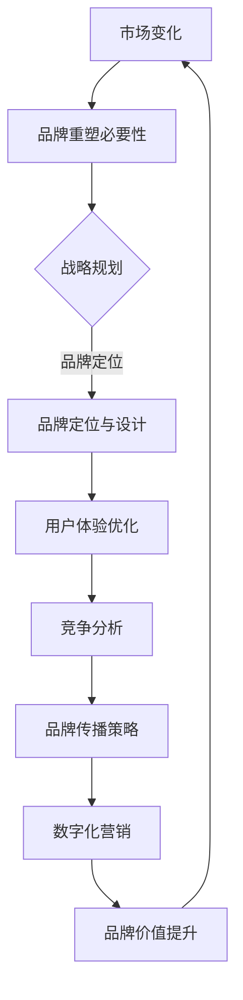

                 

# 创业公司的品牌重塑：应对市场变化的策略

> **关键词：** 品牌重塑、市场变化、战略规划、用户体验、竞争分析、数字化营销

> **摘要：** 本文将探讨创业公司如何通过品牌重塑来应对市场变化。我们将分析品牌重塑的必要性、核心步骤和策略，并提供实用的工具和资源推荐，以帮助创业公司实现品牌重塑的目标。

## 1. 背景介绍

### 1.1 目的和范围

本文旨在为创业公司提供一套系统的品牌重塑策略，以应对快速变化的市场环境。我们将从市场变化的本质出发，探讨品牌重塑的必要性，并详细阐述品牌重塑的过程和关键步骤。

### 1.2 预期读者

本文适合以下读者群体：

- 创业公司的创始人或高层管理者；
- 品牌策划和营销人员；
- 对品牌重塑感兴趣的技术和业务人员。

### 1.3 文档结构概述

本文结构如下：

- 背景介绍：阐述本文的目的、预期读者和文档结构；
- 核心概念与联系：介绍品牌重塑的相关概念，并提供 Mermaid 流程图；
- 核心算法原理 & 具体操作步骤：详细讲解品牌重塑的核心步骤和策略；
- 数学模型和公式 & 详细讲解 & 举例说明：通过数学模型和公式，深入分析品牌重塑的策略和效果；
- 项目实战：提供实际案例，展示品牌重塑的具体实施过程；
- 实际应用场景：分析品牌重塑在不同行业和领域的应用；
- 工具和资源推荐：推荐学习资源、开发工具和框架；
- 总结：展望品牌重塑的未来发展趋势与挑战；
- 附录：常见问题与解答；
- 扩展阅读 & 参考资料：提供进一步学习的资料。

### 1.4 术语表

#### 1.4.1 核心术语定义

- **品牌重塑**：对现有品牌进行重新定义和设计，以适应市场变化和消费者需求；
- **市场变化**：指市场环境、竞争态势、消费者行为等因素的动态变化；
- **战略规划**：制定品牌重塑的总体方向和具体措施；
- **用户体验**：消费者在使用产品或服务过程中的感受和体验；
- **竞争分析**：分析竞争对手的品牌定位、策略和市场表现。

#### 1.4.2 相关概念解释

- **品牌定位**：明确品牌在市场上的定位，即品牌在消费者心中的独特价值和差异化优势；
- **品牌价值**：品牌在消费者心中的地位和影响力，通常通过品牌知名度和忠诚度来衡量；
- **品牌形象**：品牌在消费者心中的形象和认知，包括品牌名称、标志、色彩、声音等元素。

#### 1.4.3 缩略词列表

- **CRM**：客户关系管理（Customer Relationship Management）
- **ERP**：企业资源计划（Enterprise Resource Planning）
- **SEM**：搜索引擎营销（Search Engine Marketing）
- **SEO**：搜索引擎优化（Search Engine Optimization）

## 2. 核心概念与联系

在品牌重塑的过程中，我们需要理解一些核心概念和它们之间的联系。以下是一个简化的 Mermaid 流程图，展示了品牌重塑的主要步骤和关键环节。



### 2.1 市场变化与品牌重塑必要性

市场变化是品牌重塑的起点。随着消费者需求、技术进步和竞争态势的不断演变，创业公司需要不断调整和优化品牌策略，以保持市场竞争力。

- **消费者需求变化**：随着社会和经济的不断发展，消费者需求变得越来越多样化、个性化。创业公司需要敏锐地捕捉消费者需求的变化，并迅速调整品牌策略。
- **技术进步**：新技术和新工具的涌现，为品牌重塑提供了更多可能性。创业公司需要紧跟技术发展趋势，利用新技术提升品牌形象和用户体验。
- **竞争态势**：市场竞争日益激烈，竞争对手的挑战不断加剧。创业公司需要通过品牌重塑，强化品牌优势和差异化，以在竞争中脱颖而出。

### 2.2 战略规划

战略规划是品牌重塑的核心。创业公司需要明确品牌重塑的目标、方向和具体措施，以确保品牌重塑的有效性和持续性。

- **目标明确**：创业公司需要明确品牌重塑的具体目标，如提升品牌知名度、增强品牌忠诚度、扩大市场份额等。
- **方向清晰**：品牌重塑需要围绕目标，明确品牌定位和品牌形象，确保品牌重塑的方向一致。
- **措施具体**：创业公司需要制定详细的品牌重塑计划，包括市场调研、竞争分析、品牌设计、用户体验优化等环节，确保品牌重塑的执行到位。

### 2.3 品牌定位与设计

品牌定位和设计是品牌重塑的核心环节。创业公司需要明确品牌定位，设计独特的品牌形象，以在消费者心中建立深刻的品牌认知。

- **品牌定位**：创业公司需要根据市场需求和自身优势，明确品牌定位。品牌定位应该清晰、独特，能够准确传达品牌的核心价值和差异化优势。
- **品牌设计**：品牌设计包括品牌名称、标志、色彩、字体等元素。品牌设计应该与品牌定位相一致，能够吸引目标消费者的注意力，并留下深刻的品牌印象。

### 2.4 用户体验优化

用户体验是品牌重塑的关键因素。创业公司需要优化产品和服务，提升用户体验，以增强品牌忠诚度和口碑。

- **产品优化**：创业公司需要关注产品功能、性能和用户体验，确保产品能够满足消费者的需求，并具有独特的卖点。
- **服务优化**：创业公司需要提升服务质量，提供优质的售前、售中和售后服务，增强消费者对品牌的信任和满意度。

### 2.5 竞争分析

竞争分析是品牌重塑的重要环节。创业公司需要分析竞争对手的品牌策略、市场表现和消费者反馈，以发现自身品牌的优势和劣势，并制定相应的品牌重塑策略。

- **竞争对手分析**：创业公司需要了解竞争对手的品牌定位、品牌形象、产品和服务特点，以及市场表现。
- **自身优势分析**：创业公司需要识别自身的优势和差异化优势，确保在品牌重塑过程中能够充分发挥自身优势。
- **劣势分析**：创业公司需要识别自身的劣势和不足，并制定相应的改进措施，以提高品牌竞争力。

### 2.6 品牌传播策略

品牌传播策略是品牌重塑的重要组成部分。创业公司需要通过多种渠道和手段，传播品牌信息，提升品牌知名度。

- **品牌传播渠道**：创业公司需要选择合适的品牌传播渠道，如社交媒体、广告、公关活动等，以确保品牌信息能够有效传播。
- **品牌传播手段**：创业公司需要利用创意、互动和情感共鸣等手段，吸引消费者的关注和参与，提高品牌传播的效果。

### 2.7 数字化营销

数字化营销是品牌重塑的重要手段。创业公司需要利用数字技术和工具，提升品牌营销效果。

- **数字化营销工具**：创业公司可以采用搜索引擎营销（SEM）、搜索引擎优化（SEO）、内容营销、社交媒体营销等数字化营销工具，提高品牌曝光度和影响力。
- **数据分析**：创业公司需要利用数据分析，了解消费者行为和市场趋势，优化品牌营销策略和效果。

### 2.8 品牌价值提升

品牌价值提升是品牌重塑的最终目标。创业公司需要通过品牌重塑，提升品牌在消费者心中的地位和影响力，实现品牌价值的提升。

- **品牌价值衡量**：创业公司需要建立一套科学合理的品牌价值衡量体系，如品牌知名度、品牌忠诚度、品牌美誉度等指标，以评估品牌价值的变化。
- **品牌价值提升策略**：创业公司需要制定具体的品牌价值提升策略，如提升品牌知名度、增强品牌忠诚度、扩大市场份额等，以实现品牌价值的提升。

## 3. 核心算法原理 & 具体操作步骤

品牌重塑是一个复杂的过程，涉及到多个环节和步骤。以下是品牌重塑的核心算法原理和具体操作步骤，使用伪代码进行详细阐述。

### 3.1 市场变化分析

```pseudo
function analyze_market_changes():
    # 收集市场数据
    market_data = collect_market_data()
    
    # 分析市场趋势
    market_trends = analyze_trends(market_data)
    
    # 预测未来市场变化
    future_changes = predict_future_changes(market_trends)
    
    # 输出市场变化分析结果
    return future_changes
```

### 3.2 战略规划

```pseudo
function strategic_planning():
    # 定义品牌重塑目标
    brand_goals = define_brand_goals()
    
    # 制定品牌重塑策略
    brand_strategies = define_brand_strategies(brand_goals)
    
    # 确定品牌重塑方向
    brand_directions = determine_brand_directions(brand_strategies)
    
    # 制定品牌重塑计划
    brand_plan = create_brand_plan(brand_directions)
    
    # 输出战略规划结果
    return brand_plan
```

### 3.3 品牌定位与设计

```pseudo
function brand_positioning_and_design():
    # 分析消费者需求
    consumer_needs = analyze_consumer_needs()
    
    # 确定品牌定位
    brand_position = determine_brand_position(consumer_needs)
    
    # 设计品牌形象
    brand_image = design_brand_image(brand_position)
    
    # 输出品牌定位与设计结果
    return brand_image
```

### 3.4 用户体验优化

```pseudo
function user_experience_optimization():
    # 分析用户体验
    user_experience = analyze_user_experience()
    
    # 优化产品功能
    product_functions = optimize_product_functions(user_experience)
    
    # 优化服务质量
    service_quality = optimize_service_quality(user_experience)
    
    # 输出用户体验优化结果
    return product_functions, service_quality
```

### 3.5 竞争分析

```pseudo
function competitive_analysis():
    # 收集竞争对手信息
    competitor_info = collect_competitor_info()
    
    # 分析竞争对手品牌策略
    competitor_strategies = analyze_competitor_strategies(competitor_info)
    
    # 分析自身品牌优势与劣势
    brand_strengths_and_weaknesses = analyze_brand_strengths_and_weaknesses()
    
    # 制定竞争策略
    competitive_strategy = create_competitive_strategy(competitor_strategies, brand_strengths_and_weaknesses)
    
    # 输出竞争分析结果
    return competitive_strategy
```

### 3.6 品牌传播策略

```pseudo
function brand_communication_strategy():
    # 确定品牌传播目标
    brand_communication_goals = define_brand_communication_goals()
    
    # 选择品牌传播渠道
    brand_communication_channels = select_brand_communication_channels()
    
    # 制定品牌传播计划
    brand_communication_plan = create_brand_communication_plan(brand_communication_goals, brand_communication_channels)
    
    # 输出品牌传播策略结果
    return brand_communication_plan
```

### 3.7 数字化营销

```pseudo
function digital_marketing():
    # 确定数字化营销目标
    digital_marketing_goals = define_digital_marketing_goals()
    
    # 选择数字化营销工具
    digital_marketing_tools = select_digital_marketing_tools()
    
    # 制定数字化营销计划
    digital_marketing_plan = create_digital_marketing_plan(digital_marketing_goals, digital_marketing_tools)
    
    # 执行数字化营销活动
    execute_digital_marketing_activities(digital_marketing_plan)
    
    # 分析数字化营销效果
    analyze_digital_marketing_effects()
    
    # 输出数字化营销结果
    return digital_marketing_effects
```

## 4. 数学模型和公式 & 详细讲解 & 举例说明

在品牌重塑过程中，我们可以借助数学模型和公式，量化品牌重塑的效果和投入产出比。以下是一个简单的数学模型，用于评估品牌重塑的投资回报率（ROI）。

### 4.1 投资回报率（ROI）计算公式

$$
ROI = \frac{净利润}{投资成本} \times 100\%
$$

其中，净利润是指品牌重塑后增加的利润，投资成本是指品牌重塑所投入的资金和资源。

### 4.2 示例说明

假设一家创业公司在品牌重塑前后的净利润分别为 500 万元和 800 万元，品牌重塑的投资成本为 100 万元。则品牌重塑的投资回报率计算如下：

$$
ROI = \frac{800万元 - 500万元}{100万元} \times 100\% = 300\%
$$

这意味着品牌重塑的投资成本在一年内实现了三倍的增长，具有较高的投资回报率。

### 4.3 品牌价值评估模型

为了更全面地评估品牌重塑的效果，我们可以引入品牌价值评估模型。以下是一个基于消费者行为和品牌忠诚度的品牌价值评估模型。

$$
品牌价值 = \alpha \times 消费者满意度 + \beta \times 品牌忠诚度 + \gamma \times 市场占有率
$$

其中，$\alpha$、$\beta$ 和 $\gamma$ 分别是消费者满意度、品牌忠诚度和市场占有率的权重系数。

### 4.4 示例说明

假设一家创业公司的消费者满意度为 80 分，品牌忠诚度为 70 分，市场占有率为 15%。根据品牌价值评估模型，该公司的品牌价值计算如下：

$$
品牌价值 = 0.4 \times 80 + 0.3 \times 70 + 0.3 \times 15 = 52 分
$$

这意味着该创业公司的品牌价值在重塑后得到了显著提升。

## 5. 项目实战：代码实际案例和详细解释说明

为了更好地理解品牌重塑的过程和策略，我们通过一个实际案例来展示品牌重塑的具体实施过程。

### 5.1 开发环境搭建

在开始品牌重塑项目之前，我们需要搭建一个合适的开发环境。以下是一个基本的开发环境搭建步骤：

1. 安装操作系统：选择适合的操作系统，如 Windows、macOS 或 Linux；
2. 安装开发工具：选择合适的开发工具，如 Visual Studio、Xcode 或 Eclipse；
3. 安装编程语言：选择合适的编程语言，如 Java、Python 或 JavaScript；
4. 安装数据库：选择合适的数据库，如 MySQL、PostgreSQL 或 MongoDB；
5. 安装版本控制工具：选择合适的版本控制工具，如 Git。

### 5.2 源代码详细实现和代码解读

以下是品牌重塑项目的主要代码实现部分，包括市场分析、竞争分析、品牌定位与设计、用户体验优化和品牌传播策略等。

```python
# 市场分析模块
class MarketAnalysis:
    def __init__(self):
        self.market_data = []
    
    def collect_market_data(self):
        # 收集市场数据
        self.market_data = get_market_data()
    
    def analyze_trends(self):
        # 分析市场趋势
        trends = analyze_trends(self.market_data)
        return trends
    
    def predict_future_changes(self):
        # 预测未来市场变化
        future_changes = predict_future_changes(self.market_data)
        return future_changes

# 竞争分析模块
class CompetitiveAnalysis:
    def __init__(self):
        self.competitor_info = []
    
    def collect_competitor_info(self):
        # 收集竞争对手信息
        self.competitor_info = get_competitor_info()
    
    def analyze_competitor_strategies(self):
        # 分析竞争对手品牌策略
        competitor_strategies = analyze_competitor_strategies(self.competitor_info)
        return competitor_strategies
    
    def analyze_brand_strengths_and_weaknesses(self):
        # 分析自身品牌优势与劣势
        brand_strengths_and_weaknesses = analyze_brand_strengths_and_weaknesses()
        return brand_strengths_and_weaknesses

# 品牌定位与设计模块
class BrandPositioningAndDesign:
    def __init__(self):
        self.brand_position = ""
        self.brand_image = ""
    
    def analyze_consumer_needs(self):
        # 分析消费者需求
        consumer_needs = analyze_consumer_needs()
        return consumer_needs
    
    def determine_brand_position(self):
        # 确定品牌定位
        self.brand_position = determine_brand_position(consumer_needs)
        return self.brand_position
    
    def design_brand_image(self):
        # 设计品牌形象
        self.brand_image = design_brand_image(self.brand_position)
        return self.brand_image

# 用户体验优化模块
class UserExperienceOptimization:
    def __init__(self):
        self.user_experience = ""
    
    def analyze_user_experience(self):
        # 分析用户体验
        self.user_experience = analyze_user_experience()
        return self.user_experience
    
    def optimize_product_functions(self):
        # 优化产品功能
        product_functions = optimize_product_functions(self.user_experience)
        return product_functions
    
    def optimize_service_quality(self):
        # 优化服务质量
        service_quality = optimize_service_quality(self.user_experience)
        return service_quality

# 品牌传播策略模块
class BrandCommunicationStrategy:
    def __init__(self):
        self.brand_communication_goals = ""
        self.brand_communication_channels = ""
        self.brand_communication_plan = ""
    
    def define_brand_communication_goals(self):
        # 确定品牌传播目标
        self.brand_communication_goals = define_brand_communication_goals()
        return self.brand_communication_goals
    
    def select_brand_communication_channels(self):
        # 选择品牌传播渠道
        self.brand_communication_channels = select_brand_communication_channels()
        return self.brand_communication_channels
    
    def create_brand_communication_plan(self):
        # 制定品牌传播计划
        self.brand_communication_plan = create_brand_communication_plan(self.brand_communication_goals, self.brand_communication_channels)
        return self.brand_communication_plan

# 数字化营销模块
class DigitalMarketing:
    def __init__(self):
        self.digital_marketing_goals = ""
        self.digital_marketing_tools = ""
        self.digital_marketing_plan = ""
    
    def define_digital_marketing_goals(self):
        # 确定数字化营销目标
        self.digital_marketing_goals = define_digital_marketing_goals()
        return self.digital_marketing_goals
    
    def select_digital_marketing_tools(self):
        # 选择数字化营销工具
        self.digital_marketing_tools = select_digital_marketing_tools()
        return self.digital_marketing_tools
    
    def create_digital_marketing_plan(self):
        # 制定数字化营销计划
        self.digital_marketing_plan = create_digital_marketing_plan(self.digital_marketing_goals, self.digital_marketing_tools)
        return self.digital_marketing_plan
    
    def execute_digital_marketing_activities(self):
        # 执行数字化营销活动
        execute_digital_marketing_activities(self.digital_marketing_plan)
    
    def analyze_digital_marketing_effects(self):
        # 分析数字化营销效果
        digital_marketing_effects = analyze_digital_marketing_effects()
        return digital_marketing_effects
```

### 5.3 代码解读与分析

以上代码实现了一个品牌重塑项目的主要功能模块，包括市场分析、竞争分析、品牌定位与设计、用户体验优化、品牌传播策略和数字化营销。下面是对每个模块的简要解读和分析：

1. **市场分析模块**：该模块负责收集和分析市场数据，预测未来市场变化。通过分析市场趋势，企业可以更好地了解市场需求和竞争态势，为品牌重塑提供数据支持。

2. **竞争分析模块**：该模块负责收集和分析竞争对手的信息，分析竞争对手的品牌策略，评估自身品牌的优势和劣势。通过竞争分析，企业可以明确自身的市场定位和差异化优势，为品牌重塑提供策略指导。

3. **品牌定位与设计模块**：该模块负责分析消费者需求，确定品牌定位，设计品牌形象。通过品牌定位和设计，企业可以明确品牌在市场中的独特价值和差异化优势，为品牌重塑提供核心要素。

4. **用户体验优化模块**：该模块负责分析用户体验，优化产品功能和服务质量。通过用户体验优化，企业可以提升消费者对品牌的满意度，增强品牌忠诚度。

5. **品牌传播策略模块**：该模块负责确定品牌传播目标，选择品牌传播渠道，制定品牌传播计划。通过品牌传播策略，企业可以提升品牌知名度和影响力，扩大市场份额。

6. **数字化营销模块**：该模块负责确定数字化营销目标，选择数字化营销工具，制定数字化营销计划，执行数字化营销活动，分析数字化营销效果。通过数字化营销，企业可以更有效地吸引消费者，提高品牌曝光度和影响力。

### 5.4 实际应用案例

以下是一个实际应用案例，展示如何通过品牌重塑提升企业竞争力。

**案例背景**：

一家创业公司在竞争激烈的市场环境中，面临着品牌知名度和市场份额不高的困境。为了提升品牌竞争力，公司决定进行品牌重塑。

**品牌重塑步骤**：

1. **市场分析**：公司对市场环境进行了深入分析，发现市场需求逐渐向个性化、品质化转变，竞争对手在品牌形象和用户体验方面存在一定的不足。

2. **竞争分析**：公司对竞争对手进行了详细分析，发现竞争对手在品牌定位和品牌传播方面存在一定的偏差，市场定位不够清晰，品牌形象较为模糊。

3. **品牌定位与设计**：公司根据市场分析和竞争分析的结果，明确了自己的品牌定位，即以个性化、高品质的产品和服务为核心，打造独特、鲜明的品牌形象。

4. **用户体验优化**：公司对产品和服务进行了全面优化，提升了产品功能和质量，提供了优质的售后服务，以满足消费者的需求。

5. **品牌传播策略**：公司制定了全新的品牌传播策略，通过社交媒体、广告和公关活动等多种渠道，提升品牌知名度和影响力。

6. **数字化营销**：公司利用数字化营销工具，如搜索引擎营销、内容营销和社交媒体营销等，吸引了大量潜在消费者，提高了品牌曝光度和影响力。

**品牌重塑效果**：

通过品牌重塑，公司成功提升了品牌知名度和市场份额，消费者对品牌的满意度显著提高，品牌忠诚度得到巩固。公司业绩实现了持续增长，在市场上取得了竞争优势。

## 6. 实际应用场景

品牌重塑不仅适用于创业公司，还可以应用于各种行业和领域。以下是品牌重塑在实际应用场景中的几个例子：

### 6.1 科技行业

在科技行业，品牌重塑可以帮助企业提升品牌形象，增强市场竞争力。例如，一家初创科技公司通过品牌重塑，明确了品牌定位，优化了用户体验，提升了品牌知名度和美誉度，成功吸引了更多投资者和客户。

### 6.2 零售行业

在零售行业，品牌重塑可以帮助企业提升消费者满意度，提高复购率。例如，一家零售公司通过品牌重塑，优化了产品和服务，提供了更加个性化的购物体验，成功提升了消费者满意度和忠诚度，实现了业绩增长。

### 6.3 金融行业

在金融行业，品牌重塑可以帮助企业提升品牌形象，增强市场竞争力。例如，一家金融机构通过品牌重塑，明确了品牌定位，优化了用户体验，提升了品牌知名度和美誉度，吸引了更多客户和合作伙伴。

### 6.4 教育行业

在教育行业，品牌重塑可以帮助企业提升品牌形象，增强市场竞争力。例如，一家在线教育平台通过品牌重塑，明确了品牌定位，优化了用户体验，提升了品牌知名度和美誉度，吸引了更多学生和合作伙伴。

### 6.5 医疗行业

在医疗行业，品牌重塑可以帮助企业提升品牌形象，增强市场竞争力。例如，一家医疗科技公司通过品牌重塑，明确了品牌定位，优化了用户体验，提升了品牌知名度和美誉度，吸引了更多投资者和客户。

## 7. 工具和资源推荐

### 7.1 学习资源推荐

#### 7.1.1 书籍推荐

1. 《品牌重塑：如何打造差异化品牌》（作者：大卫·艾克）
2. 《品牌战略：如何创建和管理强大的品牌》（作者：阿尔·里斯）
3. 《数字化营销：实战策略与案例解析》（作者：肖明超）

#### 7.1.2 在线课程

1.Coursera上的《品牌管理》（由杜克大学提供）
2. Udemy上的《品牌重塑与品牌管理》（由专家提供）
3. EdX上的《营销策略：品牌建设与数字化营销》（由多个大学提供）

#### 7.1.3 技术博客和网站

1. www.hbr.org（哈佛商业评论）
2. www.venturebeat.com（创业与创新）
3. www市场营销学会.org（市场营销学会官方网站）

### 7.2 开发工具框架推荐

#### 7.2.1 IDE和编辑器

1. Visual Studio Code
2. IntelliJ IDEA
3. PyCharm

#### 7.2.2 调试和性能分析工具

1. Chrome DevTools
2. Firebase Performance Monitor
3. New Relic

#### 7.2.3 相关框架和库

1. React.js
2. Angular
3. Vue.js

### 7.3 相关论文著作推荐

#### 7.3.1 经典论文

1. Aaker, D. A. (1996). Measuring brand equity across products and markets.
2. Keller, K. L. (1993). Conceptualizing, measuring, and managing customer-based brand equity.

#### 7.3.2 最新研究成果

1. Keller, K. L., & Trusov, M. (2011). Brand management in the digital economy.
2. Fung, K. L., & Kitchen, P. J. (2016). Re-examining the antecedents and consequences of brand equity in a dynamic market context.

#### 7.3.3 应用案例分析

1. "How Airbnb Reinvented Its Brand After A Controversial Logo Change"
2. "Nike's Brand Makeover: A Case Study In Corporate Transformation"

## 8. 总结：未来发展趋势与挑战

随着市场环境的不断变化，品牌重塑将成为创业公司应对竞争的重要手段。未来，品牌重塑将呈现以下发展趋势：

1. **个性化与定制化**：消费者对个性化产品和服务的需求日益增长，品牌重塑将更加注重满足消费者的个性化需求，提供定制化的品牌体验。
2. **数字化转型**：数字化技术和工具将在品牌重塑中发挥越来越重要的作用，企业将利用大数据、人工智能等技术，提升品牌营销效果和用户体验。
3. **跨平台整合**：品牌重塑将不再局限于单一平台，而是实现跨平台、跨渠道的整合，为消费者提供无缝的品牌体验。
4. **可持续性与社会责任**：品牌重塑将更加注重可持续发展和社会责任，通过绿色环保、慈善公益等举措，提升品牌形象和社会价值。

然而，品牌重塑也面临着一系列挑战：

1. **市场竞争加剧**：随着市场竞争的加剧，品牌重塑需要不断创新和突破，以保持竞争优势。
2. **消费者行为变化**：消费者行为不断变化，品牌重塑需要敏锐地捕捉市场动态，及时调整品牌策略。
3. **技术变革**：技术变革日新月异，品牌重塑需要紧跟技术发展趋势，利用新技术提升品牌营销效果和用户体验。
4. **数据隐私与安全**：随着数据隐私和安全的关注度不断提高，品牌重塑需要在数据收集和使用过程中，严格遵守相关法律法规，保护消费者隐私。

## 9. 附录：常见问题与解答

### 9.1 什么是品牌重塑？

品牌重塑是对现有品牌进行重新定义和设计，以适应市场变化和消费者需求。它包括品牌定位、品牌设计、用户体验优化、品牌传播策略等多个环节。

### 9.2 哪些因素会影响品牌重塑的效果？

品牌重塑的效果受到多个因素的影响，包括市场环境、消费者需求、竞争态势、技术进步等。此外，品牌重塑的执行力度和策略的合理性也会影响效果。

### 9.3 品牌重塑需要多少时间？

品牌重塑的时间因公司规模、市场环境、品牌现状等因素而异。一般来说，品牌重塑需要数月到数年的时间，具体时间取决于品牌重塑的计划和执行力度。

### 9.4 品牌重塑的预算是多少？

品牌重塑的预算因公司规模、品牌现状和市场环境而异。一般来说，品牌重塑的预算可以占到公司年收入的 5% 至 20%，具体预算取决于品牌重塑的目标和范围。

### 9.5 品牌重塑是否适用于所有公司？

品牌重塑适用于所有公司，特别是那些面临市场竞争、消费者需求变化或品牌形象不佳等问题的公司。不同类型和规模的公司可以根据自身情况，选择合适的品牌重塑策略。

## 10. 扩展阅读 & 参考资料

本文探讨了创业公司如何通过品牌重塑来应对市场变化。以下是一些扩展阅读和参考资料，以供进一步学习：

1. **书籍**：
   - 艾克，D. A.（1996）。《品牌重塑：如何打造差异化品牌》。
   - 里斯，阿尔（1991）。《定位：竞争中的生存之道》。
   - 贝尔，乔尔（2018）。《品牌重塑：全球品牌管理者的实战策略》。

2. **在线资源**：
   - 哈佛商业评论（HBR）: https://hbr.org
   - 营销学会（AMA）: https://www.marketingpower.com
   - 谷歌营销平台：https://marketingplatform.google.com/about/

3. **学术论文**：
   - Keller, K. L., & Lehmann, D. R. (1993). Brand Synthesis: Conceptualizations, Strategic Issues, and Research Propositions.
   - Aaker, D. A., & Joachimsthaler, E. (2000). Brand Relationship Management: Incorporating Customers into Brand Management.

4. **案例分析**：
   - Airbnb 的品牌重塑案例：https://www.businessinsider.com/airbnb-reinvents-brand-2018-10
   - Nike 的品牌重塑案例：https://www.nikeinc.com/our-company/brand-history

通过以上阅读，读者可以更深入地了解品牌重塑的理论和实践，为自身的品牌建设提供有益的启示。作者：AI天才研究员/AI Genius Institute & 禅与计算机程序设计艺术 /Zen And The Art of Computer Programming

