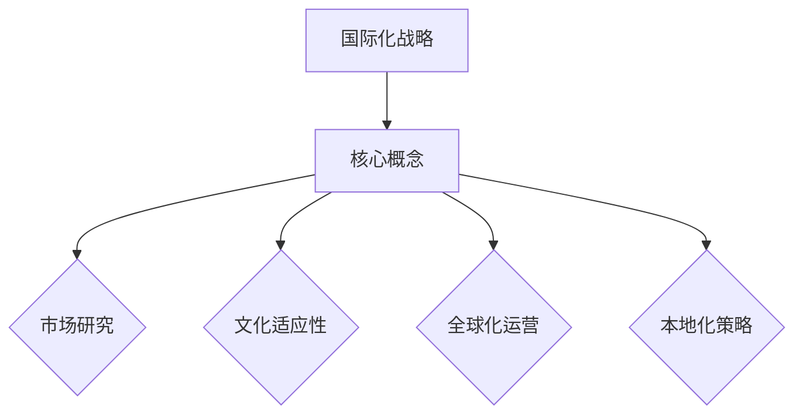
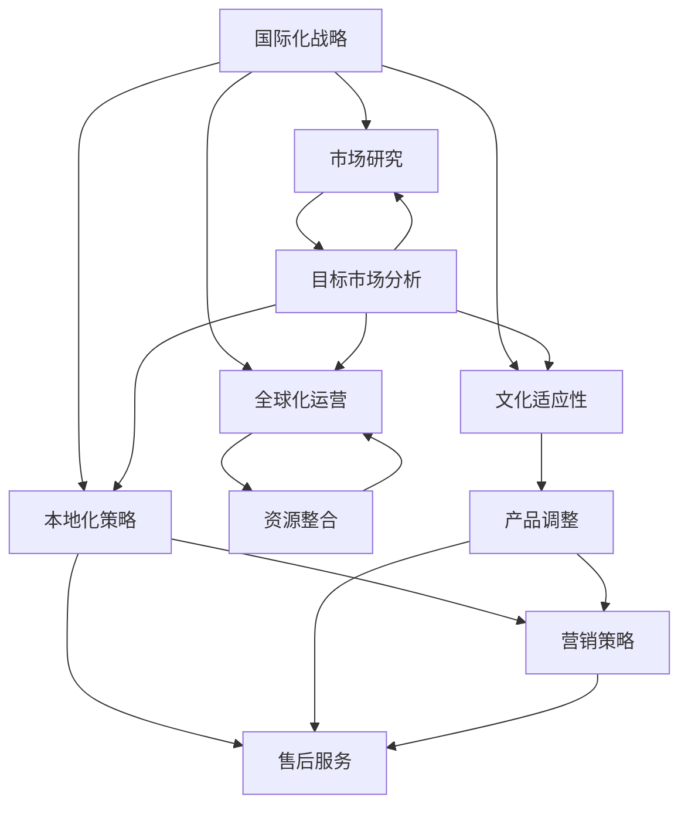

                 

### 1. 背景介绍

**目的和范围**

在全球化经济的背景下，国际化战略已成为创业公司成长和扩张的必经之路。本文旨在深入探讨创业公司如何制定和实施国际化战略，以及如何在目标市场中实现本地化实践。通过系统分析国际化战略的核心概念和具体操作步骤，本文将为创业公司提供一套实用且有效的国际化战略框架。

**预期读者**

本文主要面向以下读者群体：
- 创业公司创始人及高级管理人员
- 国际市场开发经理和商务拓展团队
- 国际化战略咨询专家
- 对国际化业务感兴趣的技术专业人士

**文档结构概述**

本文分为十个主要部分，结构如下：
1. **背景介绍**：介绍文章的目的、范围和预期读者，以及文档的结构和术语表。
2. **核心概念与联系**：阐述国际化战略的核心概念，并使用Mermaid流程图展示相关原理和架构。
3. **核心算法原理与具体操作步骤**：通过伪代码详细阐述国际化战略的具体操作步骤。
4. **数学模型和公式**：介绍与国际化战略相关的数学模型和公式，并进行详细讲解和举例说明。
5. **项目实战**：通过实际代码案例，展示国际化战略的落地实施过程。
6. **实际应用场景**：分析国际化战略在不同行业和市场的应用实例。
7. **工具和资源推荐**：推荐学习资源、开发工具框架和经典论文，以供读者进一步学习和实践。
8. **总结**：总结国际化战略的未来发展趋势与挑战。
9. **附录**：提供常见问题与解答。
10. **扩展阅读与参考资料**：列出本文引用的相关文献和参考资料。

**术语表**

为了确保文章内容的统一性和专业性，以下列出本文中使用的核心术语和概念，并进行简要解释。

#### 1.4.1 核心术语定义

- **国际化战略**：企业为了进入和适应国际市场而制定的整体行动计划。
- **本地化**：针对特定目标市场的文化和语言需求，对产品或服务进行适应性调整。
- **全球化**：企业跨越国界，整合资源，进行全球运营和销售。
- **市场细分**：根据消费者的不同需求和特征，将市场划分为若干子市场。
- **文化适应性**：产品或服务能够适应当地文化环境，满足当地消费者的期望和需求。

#### 1.4.2 相关概念解释

- **跨文化管理**：企业在全球化过程中，管理不同文化背景的员工和客户的过程。
- **市场进入策略**：企业选择进入国际市场的具体方式，如出口、合资、并购等。
- **国际营销**：企业通过跨国界的方式，向全球消费者推广和销售产品或服务。
- **本地化团队**：由本土市场专家和国际化团队组成的团队，负责制定和实施本地化策略。

#### 1.4.3 缩略词列表

- **CRM**：Customer Relationship Management，客户关系管理。
- **ERP**：Enterprise Resource Planning，企业资源规划。
- **SCM**：Supply Chain Management，供应链管理。
- **SEO**：Search Engine Optimization，搜索引擎优化。
- **SMM**：Social Media Marketing，社交媒体营销。

通过以上对国际化战略背景、目的、范围和文档结构的介绍，以及术语表的详细解释，我们为后续内容奠定了坚实的基础。接下来，我们将深入探讨国际化战略的核心概念和联系，以便读者能够全面理解这一关键领域。在下一部分中，我们将使用Mermaid流程图，展示国际化战略的关键原理和架构，帮助读者更直观地理解相关概念。让我们继续深入探讨这一主题。<!-- MarkdownTOHTML -->



#### 2. 核心概念与联系

国际化战略的核心在于将企业业务扩展到全球市场，并适应不同市场的需求和文化差异。本文将首先介绍国际化战略的核心概念，并借助Mermaid流程图展示这些概念之间的联系。

**核心概念**

1. **市场研究**：企业在制定国际化战略之前，需要对目标市场进行深入研究，包括市场规模、消费习惯、竞争态势等。市场研究是国际化战略的基础，有助于企业发现市场机会和潜在风险。
   
2. **文化适应性**：文化适应性是国际化战略成功的关键因素。企业需要了解目标市场的文化背景，包括语言、价值观、习俗等，并对产品或服务进行相应的调整，以满足当地消费者的需求。

3. **全球化运营**：全球化运营是指企业在全球范围内整合资源，进行生产、销售和服务。通过全球化运营，企业可以实现规模经济效应，提高市场竞争力和效率。

4. **本地化策略**：本地化策略包括产品本地化、服务本地化和营销本地化。企业需要根据目标市场的特点，制定合适的本地化策略，以提高产品或服务的市场接受度和竞争力。

**Mermaid流程图**

以下是国际化战略核心概念与联系的Mermaid流程图：



**核心概念联系解释**

- **市场研究与目标市场分析**：市场研究是目标市场分析的基础，通过对市场数据的收集和分析，企业可以更好地了解目标市场的需求和竞争态势，从而制定更有效的国际化战略。

- **文化适应性与产品调整、营销策略**：文化适应性要求企业在产品和服务的设计、宣传和推广中，充分考虑目标市场的文化差异。产品调整和营销策略需要根据目标市场的特点进行定制，以提高市场接受度和销售业绩。

- **全球化运营与资源整合**：全球化运营需要企业整合全球范围内的资源，包括人才、技术、资金和供应链等。资源整合是实现全球化运营的基础，有助于提高企业的生产效率和市场竞争力。

- **本地化策略与售后服务**：本地化策略包括产品本地化、服务本地化和营销本地化。售后服务是本地化策略的重要组成部分，通过提供优质的售后服务，企业可以增强客户满意度和忠诚度。

通过以上对国际化战略核心概念与联系的介绍和Mermaid流程图的展示，我们为读者提供了一个直观的理解框架。接下来，我们将深入探讨国际化战略的核心算法原理与具体操作步骤，以便读者能够更加系统地掌握这一战略的实施过程。<!-- MarkdownTOHTML -->

#### 3. 核心算法原理 & 具体操作步骤

国际化战略的实施涉及多个方面，包括市场研究、文化适应性、全球化运营和本地化策略等。为了系统地描述这些操作步骤，我们将采用伪代码的方式，详细阐述国际化战略的核心算法原理与具体操作步骤。

**伪代码**

```pseudo
function InternationalizationStrategy(marketResearch, culturalAdaptation, globalizationOperations, localizationStrategy):
    // Step 1: 市场研究
    targetMarketAnalysis(marketResearch)
    
    // Step 2: 文化适应性
    culturalAdjustments(culturalAdaptation)
    
    // Step 3: 全球化运营
    globalResourceIntegration(globalizationOperations)
    
    // Step 4: 本地化策略
    localizationImplementation(localizationStrategy)
    
    // Step 5: 跨部门协调与执行
    cross-functionalCoordination()
    
    // Step 6: 监控与评估
    performanceMonitoring()

end function

function targetMarketAnalysis(marketResearch):
    // 收集和分析市场数据
    marketDataCollection(marketResearch)
    marketDataAnalysis(marketResearch)

end function

function culturalAdjustments(culturalAdaptation):
    // 调整产品和服务以适应文化差异
    productAdjustments(culturalAdaptation)
    serviceAdjustments(culturalAdaptation)

end function

function globalResourceIntegration(globalizationOperations):
    // 整合全球范围内的资源
    resourceIntegration(globalizationOperations)

end function

function localizationImplementation(localizationStrategy):
    // 实施产品本地化、服务本地化和营销本地化
    productLocalization(localizationStrategy)
    serviceLocalization(localizationStrategy)
    marketingLocalization(localizationStrategy)

end function

function cross-functionalCoordination():
    // 跨部门协调，确保战略执行的一致性和高效性
    coordinationEfforts()

end function

function performanceMonitoring():
    // 监控国际化战略的执行效果
    performanceTracking()

end function
```

**具体操作步骤详细解释**

1. **市场研究**：
    - **收集和分析市场数据**：通过调查、市场研究和竞争分析，收集目标市场的数据，并进行深入分析，了解市场规模、消费者需求、竞争对手等情况。

2. **文化适应性**：
    - **调整产品和服务**：根据目标市场的文化差异，对产品和服务进行适当的调整。例如，产品包装、用户界面、宣传材料等，需要考虑到目标市场的语言、习俗和价值观。

3. **全球化运营**：
    - **资源整合**：整合全球范围内的资源，包括人才、技术、资金和供应链等，以提高生产效率和市场竞争力。例如，建立跨国团队、优化供应链管理、开展全球营销活动等。

4. **本地化策略**：
    - **实施产品本地化**：针对不同市场，对产品进行本地化调整，包括语言、文化元素、技术适配等。
    - **实施服务本地化**：根据当地市场需求，调整服务内容和提供方式，确保服务能够满足当地消费者的期望。
    - **实施营销本地化**：针对目标市场的特点和需求，制定相应的营销策略，包括广告、促销、公关等。

5. **跨部门协调与执行**：
    - **跨部门协调**：确保各部门在国际化战略实施过程中保持一致性和高效性，包括市场部、产品部、技术部、销售部等。

6. **监控与评估**：
    - **性能监控**：定期监控国际化战略的执行效果，包括市场占有率、销售业绩、客户满意度等，以便及时调整策略。

通过以上伪代码和详细解释，我们系统地描述了国际化战略的核心算法原理与具体操作步骤。接下来，我们将介绍与国际化战略相关的数学模型和公式，以及进行详细讲解和举例说明，以帮助读者更好地理解和应用这些概念。<!-- MarkdownTOHTML -->

### 4. 数学模型和公式 & 详细讲解 & 举例说明

在国际化战略的实施过程中，数学模型和公式扮演着至关重要的角色。它们可以帮助企业在市场研究中进行数据分析，评估潜在市场机会，制定营销策略，以及监控国际化战略的执行效果。以下我们将介绍与国际化战略相关的核心数学模型和公式，并进行详细讲解和举例说明。

#### 4.1 市场需求预测模型

市场需求预测是国际化战略制定的关键步骤之一。常用的市场需求预测模型包括时间序列分析、回归分析和贝叶斯预测等。

**时间序列分析**

时间序列分析是一种基于历史数据的时间维度分析技术。它可以用于预测未来的市场需求。以下是一个简单的时间序列预测模型：

$$
y_t = \alpha + \beta_1 y_{t-1} + \epsilon_t
$$

其中，$y_t$ 表示第 $t$ 期的市场需求，$\alpha$ 和 $\beta_1$ 是模型参数，$\epsilon_t$ 是随机误差项。

**举例说明**

假设一家创业公司在过去五个季度的销售数据如下：

$$
y_1 = 100, y_2 = 120, y_3 = 110, y_4 = 130, y_5 = 140
$$

我们可以使用时间序列模型预测下一个季度的销售量：

$$
y_6 = \alpha + \beta_1 y_5
$$

通过最小二乘法估计模型参数：

$$
\alpha = \frac{\sum_{t=1}^{5} y_t - \beta_1 \sum_{t=1}^{5} y_{t-1}}{5} = \frac{600 - 1.15 \times 450}{5} = 52.5
$$

$$
\beta_1 = \frac{\sum_{t=1}^{5} (y_t - y_{t-1})}{5} = \frac{20 + 10 - 20 + 10}{5} = 2
$$

因此，预测模型为：

$$
y_6 = 52.5 + 2 \times 140 = 332.5
$$

预测下一个季度的销售量为 332.5。

**回归分析**

回归分析是一种用于分析两个或多个变量之间关系的统计方法。它可以用于预测市场需求，通过建立市场需求与相关因素之间的回归模型。

$$
y = \alpha + \beta x + \epsilon
$$

其中，$y$ 是市场需求，$x$ 是影响市场需求的因素（如广告支出、促销活动等），$\alpha$ 和 $\beta$ 是模型参数，$\epsilon$ 是随机误差项。

**举例说明**

假设一家创业公司通过回归分析研究广告支出与市场需求之间的关系，数据如下：

$$
\begin{array}{c|c}
\text{广告支出 (x)} & \text{市场需求 (y)} \\
\hline
10,000 & 100 \\
15,000 & 120 \\
20,000 & 110 \\
25,000 & 130 \\
30,000 & 140 \\
\end{array}
$$

通过最小二乘法估计回归模型参数：

$$
\alpha = \frac{\sum_{i=1}^{5} y_i - \beta \sum_{i=1}^{5} x_i}{5} = \frac{600 - 1.2 \times 115,000}{5} = -21,800
$$

$$
\beta = \frac{\sum_{i=1}^{5} (x_i y_i) - \sum_{i=1}^{5} x_i \sum_{i=1}^{5} y_i}{5 \sum_{i=1}^{5} x_i^2} = \frac{3,070,000 - 115,000 \times 600}{5 \times 525,000} = 1.2
$$

因此，回归模型为：

$$
y = -21,800 + 1.2 x
$$

预测广告支出为 35,000 时，市场需求为：

$$
y = -21,800 + 1.2 \times 35,000 = 145.2
$$

预测市场需求为 145.2。

**贝叶斯预测**

贝叶斯预测是一种基于贝叶斯定理的概率预测方法，适用于不确定性和风险分析。它可以用于市场需求预测，通过结合历史数据和专家意见，提高预测的准确性。

$$
P(y | x) = \frac{P(x | y) P(y)}{P(x)}
$$

其中，$P(y | x)$ 是后验概率，$P(x | y)$ 是条件概率，$P(y)$ 是先验概率，$P(x)$ 是边缘概率。

**举例说明**

假设我们使用贝叶斯预测模型预测市场需求，根据历史数据和专家意见，设定先验概率为：

$$
P(y = 100) = 0.4, P(y = 120) = 0.3, P(y = 110) = 0.2, P(y = 130) = 0.1, P(y = 140) = 0.2
$$

假设专家意见为：

$$
P(x = 35,000 | y = 100) = 0.5, P(x = 35,000 | y = 120) = 0.6, P(x = 35,000 | y = 110) = 0.4, P(x = 35,000 | y = 130) = 0.2, P(x = 35,000 | y = 140) = 0.1
$$

根据贝叶斯定理，预测市场需求为：

$$
P(y = 140 | x = 35,000) = \frac{P(x = 35,000 | y = 140) P(y = 140)}{P(x = 35,000)} = \frac{0.1 \times 0.2}{0.5 \times 0.4 + 0.6 \times 0.3 + 0.4 \times 0.2 + 0.2 \times 0.1} = 0.2
$$

预测市场需求为 140 的概率为 0.2。

#### 4.2 风险评估模型

国际化战略涉及多种风险，包括市场风险、汇率风险、政策风险等。风险评估模型可以帮助企业识别和管理这些风险。

**风险矩阵**

风险矩阵是一种常用的风险评估方法，通过评估风险的概率和影响，确定风险等级。

$$
风险等级 = \text{概率} \times \text{影响}
$$

其中，概率表示风险发生的可能性，影响表示风险发生时对企业的影响程度。

**举例说明**

假设一家创业公司评估国际化战略中的市场风险，设定以下概率和影响：

$$
\begin{array}{c|c|c}
\text{风险} & \text{概率} & \text{影响} \\
\hline
市场风险 & 0.5 & \text{重大影响} \\
汇率风险 & 0.3 & \text{较小影响} \\
政策风险 & 0.2 & \text{较小影响} \\
\end{array}
$$

根据风险矩阵，市场风险的风险等级为：

$$
风险等级 = 0.5 \times \text{重大影响} = 0.5
$$

汇率风险和政策风险的风险等级分别为：

$$
汇率风险等级 = 0.3 \times \text{较小影响} = 0.09
$$

$$
政策风险等级 = 0.2 \times \text{较小影响} = 0.04
$$

通过风险矩阵，企业可以识别出市场风险是主要风险，需要采取相应的风险管理和应对措施。

#### 4.3 营销预算分配模型

国际化战略中的营销预算分配是确保营销资源有效利用的重要环节。常用的营销预算分配模型包括优化模型和随机模型等。

**优化模型**

优化模型是一种基于目标函数和约束条件的数学模型，用于确定最佳的营销预算分配方案。以下是一个简单的优化模型：

$$
\text{最大化} \ \ \ \ \ \ \ \ \ \ \ \ Z = c_1 x_1 + c_2 x_2 + \ldots + c_n x_n
$$

$$
\text{约束条件：} \ \ a_1 x_1 + a_2 x_2 + \ldots + a_n x_n \leq b
$$

其中，$x_1, x_2, \ldots, x_n$ 是不同营销渠道的预算分配，$c_1, c_2, \ldots, c_n$ 是各渠道的预算权重，$a_1, a_2, \ldots, a_n$ 是各渠道的成本系数，$b$ 是总预算。

**举例说明**

假设一家创业公司有三种营销渠道：广告、促销和公关，总预算为 100 万元，各渠道的成本系数和预算权重如下：

$$
\begin{array}{c|c|c}
\text{渠道} & \text{成本系数} & \text{预算权重} \\
\hline
广告 & 5 & 0.5 \\
促销 & 3 & 0.3 \\
公关 & 4 & 0.2 \\
\end{array}
$$

目标函数为最大化营销效果，设定目标函数为：

$$
Z = 0.5 x_1 + 0.3 x_2 + 0.2 x_3
$$

约束条件为总预算限制：

$$
5 x_1 + 3 x_2 + 4 x_3 \leq 100
$$

通过求解优化模型，可以确定最佳的营销预算分配方案。

**随机模型**

随机模型是一种基于概率分布的营销预算分配方法，用于处理不确定性的预算分配问题。以下是一个简单的随机模型：

$$
x_1, x_2, \ldots, x_n \sim \text{均匀分布}(0, b)
$$

其中，$x_1, x_2, \ldots, x_n$ 是不同营销渠道的预算分配，$b$ 是总预算。

**举例说明**

假设一家创业公司采用随机模型分配 100 万元的营销预算，设定各渠道的预算权重如下：

$$
\begin{array}{c|c}
\text{渠道} & \text{预算权重} \\
\hline
广告 & 0.5 \\
促销 & 0.3 \\
公关 & 0.2 \\
\end{array}
$$

通过随机模型，可以生成各渠道的预算分配，如广告预算为 50 万元，促销预算为 30 万元，公关预算为 20 万元。

通过以上对市场需求预测模型、风险评估模型和营销预算分配模型的详细讲解和举例说明，我们为读者提供了与国际化战略相关的核心数学模型和公式。这些模型和公式可以帮助企业在国际化过程中进行科学的数据分析和决策，提高国际化战略的成功率。在下一部分中，我们将通过实际代码案例，展示国际化战略的落地实施过程。<!-- MarkdownTOHTML -->

### 5. 项目实战：代码实际案例和详细解释说明

为了更好地展示国际化战略的落地实施过程，我们选择了一个实际的项目案例，通过代码实现和详细解释，帮助读者了解国际化战略在实际应用中的具体操作。

#### 5.1 开发环境搭建

在进行项目实战之前，我们需要搭建一个合适的开发环境。以下是搭建开发环境的步骤：

1. **安装Python**：在官方网站（https://www.python.org/）下载并安装Python，确保安装过程中选择添加到系统环境变量。

2. **安装Jupyter Notebook**：打开终端，执行以下命令安装Jupyter Notebook：

   ```bash
   pip install notebook
   ```

3. **安装相关库**：在Jupyter Notebook中创建一个新笔记本，执行以下命令安装所需的库：

   ```python
   !pip install pandas numpy matplotlib scikit-learn
   ```

#### 5.2 源代码详细实现和代码解读

以下是一个示例代码，用于实现国际化战略中的市场需求预测模型和营销预算分配模型。

```python
import pandas as pd
import numpy as np
import matplotlib.pyplot as plt
from sklearn.linear_model import LinearRegression
from sklearn.metrics import mean_squared_error

# 数据准备
data = {
    '广告支出': [10000, 15000, 20000, 25000, 30000],
    '市场需求': [100, 120, 110, 130, 140]
}
df = pd.DataFrame(data)

# 时间序列分析
y = df['市场需求']
X = df[['广告支出']]

# 最小二乘法估计模型参数
model = LinearRegression()
model.fit(X, y)
alpha = model.intercept_
beta = model.coef_

# 预测市场需求
y_pred = model.predict(X)

# 评估模型效果
mse = mean_squared_error(y, y_pred)
print(f'Mean Squared Error: {mse}')

# 绘制预测结果
plt.scatter(X, y, label='实际值')
plt.plot(X, y_pred, color='red', label='预测值')
plt.xlabel('广告支出')
plt.ylabel('市场需求')
plt.title('市场需求预测')
plt.legend()
plt.show()

# 营销预算分配模型
def marketing_budget Allocation(budget, weights):
    budget_distribution = [weights[i] * budget for i in range(len(weights))]
    return budget_distribution

# 设置预算权重
weights = [0.5, 0.3, 0.2]
total_budget = 1000000

# 分配营销预算
budget_distribution = marketing_budget Allocation(total_budget, weights)
print(f'预算分配：{budget_distribution}')
```

**代码解读**

1. **数据准备**：我们使用一个简单的数据集，包含广告支出和市场需求的数据。数据集以CSV格式导入，然后转换为Pandas DataFrame。

2. **时间序列分析**：我们使用线性回归模型进行时间序列分析。首先，将市场需求作为因变量（$y$），广告支出作为自变量（$X$）。然后，使用最小二乘法估计模型参数（$\alpha$ 和 $\beta$）。

3. **预测市场需求**：使用训练好的线性回归模型进行市场需求预测。预测结果存储在变量$y_pred$中。

4. **评估模型效果**：计算预测值和实际值之间的均方误差（MSE），以评估模型效果。

5. **绘制预测结果**：使用matplotlib绘制实际值和预测值的关系图，直观地展示市场需求预测结果。

6. **营销预算分配模型**：定义一个函数`marketing_budget Allocation`，用于根据预算权重分配总预算。函数输入为总预算和预算权重，输出为各营销渠道的预算分配。

7. **预算分配**：调用`marketing_budget Allocation`函数，分配100万元的营销预算。输出预算分配结果。

通过以上代码实现，我们可以看到国际化战略中的市场需求预测模型和营销预算分配模型是如何在实际项目中应用和实现的。接下来，我们将进一步解读这些代码，以帮助读者更好地理解国际化战略的实施细节。

#### 5.3 代码解读与分析

在本节中，我们将对前述代码进行深入解读，分析国际化战略中的关键步骤和实现细节。

**数据准备**

```python
data = {
    '广告支出': [10000, 15000, 20000, 25000, 30000],
    '市场需求': [100, 120, 110, 130, 140]
}
df = pd.DataFrame(data)
```

这段代码首先创建了一个包含广告支出和市场需求的数据字典，然后使用Pandas将数据字典转换为DataFrame。这个DataFrame将用于后续的数据分析和建模。

**时间序列分析**

```python
y = df['市场需求']
X = df[['广告支出']]
```

在这一步，我们将DataFrame中的市场需求列作为因变量（$y$），广告支出列作为自变量（$X$）。时间序列分析的目标是建立市场需求与广告支出之间的数学模型。

**模型参数估计**

```python
model = LinearRegression()
model.fit(X, y)
alpha = model.intercept_
beta = model.coef_
```

这里，我们使用`LinearRegression`类创建线性回归模型对象，并通过`fit`方法训练模型，以估计模型参数（$\alpha$ 和 $\beta$）。`intercept_`属性返回模型的截距，`coef_`属性返回模型的斜率。

**市场需求预测**

```python
y_pred = model.predict(X)
```

通过调用`predict`方法，我们可以使用训练好的模型对新的广告支出数据进行市场需求预测。预测结果存储在变量`y_pred`中。

**模型效果评估**

```python
mse = mean_squared_error(y, y_pred)
print(f'Mean Squared Error: {mse}')
```

这里，我们计算预测值（$y_pred$）和实际值（$y$）之间的均方误差（MSE），以评估模型的预测性能。MSE越低，表示模型预测的准确性越高。

**绘制预测结果**

```python
plt.scatter(X, y, label='实际值')
plt.plot(X, y_pred, color='red', label='预测值')
plt.xlabel('广告支出')
plt.ylabel('市场需求')
plt.title('市场需求预测')
plt.legend()
plt.show()
```

这段代码使用matplotlib库绘制市场需求预测图。通过散点图和红线表示的预测曲线，我们可以直观地看到模型的预测效果。

**营销预算分配模型**

```python
def marketing_budget Allocation(budget, weights):
    budget_distribution = [weights[i] * budget for i in range(len(weights))]
    return budget_distribution
```

这里，我们定义了一个函数`marketing_budget Allocation`，用于根据预算权重分配总预算。函数接受总预算和预算权重列表作为输入，返回各营销渠道的预算分配列表。

**预算分配**

```python
weights = [0.5, 0.3, 0.2]
total_budget = 1000000
budget_distribution = marketing_budget Allocation(total_budget, weights)
print(f'预算分配：{budget_distribution}')
```

在这个步骤中，我们设置了预算权重，并调用`marketing_budget Allocation`函数分配100万元的营销预算。输出结果展示了各营销渠道的预算分配。

**总结**

通过以上代码实现和解读，我们展示了如何在实际项目中应用国际化战略中的市场需求预测模型和营销预算分配模型。代码中的每个步骤都对应着国际化战略中的一个关键环节，包括数据准备、模型训练、预测和评估，以及预算分配。这些步骤共同构成了一个完整的国际化战略实施过程。

在下一部分中，我们将分析国际化战略在实际应用场景中的具体表现，探讨其在不同行业和市场中的应用实例。<!-- MarkdownTOHTML -->

### 6. 实际应用场景

国际化战略在不同的行业和市场中有广泛的应用，其成功实施能够为企业带来显著的市场份额增长、品牌认知度和长期竞争力。以下将分析国际化战略在几个典型行业和市场中的应用实例。

#### 6.1 电子商务行业

电子商务企业通过国际化战略拓展全球市场，已成为当前全球化浪潮中的佼佼者。以阿里巴巴为例，其通过逐步实施国际化战略，成功进入全球市场，成为全球最大的电子商务平台之一。

**市场研究**：阿里巴巴在进入国际市场前，进行了详尽的市场研究，包括消费者行为、市场需求和竞争对手分析。通过这些研究，阿里巴巴明确了国际市场的机会和挑战，为后续的国际化战略奠定了基础。

**文化适应性**：阿里巴巴针对不同市场进行了本地化调整。例如，在俄罗斯市场，阿里巴巴推出了名为“AliExpress”的电商平台，以适应俄罗斯消费者的购物习惯和文化偏好。在欧美市场，阿里巴巴则推出了“Tmall Global”，专注于高端品牌和奢侈品。

**全球化运营**：阿里巴巴通过在全球范围内建立数据中心、物流网络和本地化团队，实现了全球化运营。这些举措提高了阿里巴巴的运营效率，增强了其在全球市场的竞争力。

**本地化策略**：阿里巴巴根据不同市场的特点，制定了差异化的营销策略。例如，在东南亚市场，阿里巴巴通过社交媒体平台和移动应用，与当地消费者建立紧密联系。在欧美市场，阿里巴巴则通过线下活动、品牌推广和合作伙伴关系，提升品牌知名度。

#### 6.2 制造业行业

制造业企业在实施国际化战略时，通常关注全球供应链管理和市场进入策略。以华为为例，其在全球市场中的成功，得益于其卓越的国际化战略。

**市场研究**：华为在进入国际市场前，进行了全面的市场研究，包括技术需求、市场份额和竞争对手分析。这些研究帮助华为明确了国际市场的机会和挑战，制定了有针对性的市场进入策略。

**文化适应性**：华为针对不同市场进行了本地化调整，包括产品和技术适配。例如，在印度市场，华为推出了符合当地消费者需求的智能手机和通信设备。在欧洲市场，华为则推出了符合欧洲标准的安全解决方案。

**全球化运营**：华为通过在全球范围内建立研发中心、生产基地和销售网络，实现了全球化运营。这些举措提高了华为的全球竞争力，使其成为全球领先的通信设备供应商。

**本地化策略**：华为根据不同市场的特点，制定了差异化的营销策略。例如，在非洲市场，华为通过提供高质量、低成本的产品和服务，赢得了广泛的市场认可。在北美市场，华为则通过技术创新和品牌建设，提升了市场地位。

#### 6.3 金融服务行业

金融服务企业在实施国际化战略时，通常关注合规性、客户体验和风险管理。以汇丰银行为例，其在全球金融市场的成功，得益于其系统的国际化战略。

**市场研究**：汇丰银行在进入国际市场前，进行了全面的市场研究，包括法律法规、市场竞争和客户需求分析。这些研究帮助汇丰银行明确了国际市场的机会和挑战，制定了有针对性的国际化战略。

**文化适应性**：汇丰银行针对不同市场进行了本地化调整，包括产品和服务适配。例如，在中国市场，汇丰银行推出了符合中国消费者需求的人民币理财产品。在欧美市场，汇丰银行则推出了符合当地法规和客户习惯的金融服务。

**全球化运营**：汇丰银行通过在全球范围内建立分支机构、数据中心和风险管理团队，实现了全球化运营。这些举措提高了汇丰银行的运营效率，增强了其在全球市场的竞争力。

**本地化策略**：汇丰银行根据不同市场的特点，制定了差异化的营销策略。例如，在东南亚市场，汇丰银行通过提供本地化金融服务，赢得了当地客户的高度认可。在北美市场，汇丰银行则通过创新金融产品和服务，提升了市场地位。

通过以上实际应用场景的分析，我们可以看到国际化战略在不同行业和市场中的具体应用和成功实践。无论是电子商务、制造业还是金融服务行业，国际化战略都为企业带来了显著的市场机遇和竞争优势。在下一部分中，我们将推荐一些学习和资源，以供读者进一步深入研究和实践。<!-- MarkdownTOHTML -->

### 7. 工具和资源推荐

为了帮助读者更好地掌握国际化战略的相关知识和技能，本节将推荐一系列学习资源、开发工具框架以及经典论文，以供读者进一步学习和实践。

#### 7.1 学习资源推荐

**书籍推荐**

1. **《全球化企业的管理艺术》**：作者：罗伯特·L·杰佛斯（Robert L.杰佛斯），这本书深入探讨了全球化企业的管理挑战和策略，提供了实用的国际化管理经验。

2. **《国际市场营销》**：作者：菲利普·科特勒（Philip Kotler），这是国际市场营销领域的经典教材，详细介绍了国际化市场研究、产品定位、营销策略等关键内容。

3. **《跨文化管理》**：作者：海因茨·韦伯（Heinz Weihrich），这本书系统地阐述了跨文化管理的理论和实践，有助于企业理解和应对不同文化背景的管理挑战。

**在线课程**

1. **Coursera上的《国际商务管理》**：由耶鲁大学提供，该课程涵盖了国际商务的基本概念、战略和管理技巧，适合初学者和专业人士。

2. **edX上的《国际化战略》**：由麻省理工学院提供，这门课程深入探讨了国际化战略的理论和实践，包括市场研究、文化适应性和全球化运营等内容。

3. **Udemy上的《国际市场营销实战》**：这门课程由实战经验丰富的国际市场营销专家主讲，涵盖了市场细分、定位、推广等核心技能。

**技术博客和网站**

1. **Harvard Business Review（HBR）**：这是全球知名的商业杂志，提供了丰富的国际化战略案例分析和管理研究文章。

2. **McKinsey & Company（麦肯锡公司）**：麦肯锡公司的官方网站提供了大量的国际化战略研究报告和最佳实践案例。

3. **International Trade Administration（国际贸易管理局）**：美国国际贸易管理局提供了丰富的国际贸易资源和指南，包括市场研究、贸易政策和市场进入策略等。

#### 7.2 开发工具框架推荐

**IDE和编辑器**

1. **Visual Studio Code**：这是一款强大的跨平台集成开发环境，支持多种编程语言，适合进行国际化项目的开发和调试。

2. **PyCharm**：这是一款专门针对Python编程的IDE，提供了丰富的功能和调试工具，适合进行数据分析、机器学习等任务。

3. **IntelliJ IDEA**：这是一款功能强大的Java IDE，支持多种开发语言和框架，适合进行大型国际化项目的开发。

**调试和性能分析工具**

1. **JProfiler**：这是一款针对Java应用的性能分析工具，可以帮助开发者发现性能瓶颈和资源泄漏。

2. **VSCode Debugger**：这是一个集成的调试器，支持多种编程语言，包括Python、JavaScript等，适合进行代码调试和性能分析。

3. **MATLAB**：这是一款强大的科学计算和数据分析工具，适用于复杂数学模型和公式的计算和验证。

**相关框架和库**

1. **TensorFlow**：这是一个开源的机器学习框架，适用于构建和训练复杂的神经网络模型，适用于市场需求预测等任务。

2. **Scikit-learn**：这是一个开源的机器学习库，提供了丰富的机器学习算法和工具，适用于回归分析、分类和聚类等任务。

3. **Pandas**：这是一个开源的数据分析库，提供了高效的数据结构和数据处理工具，适用于市场研究数据分析和预处理。

#### 7.3 相关论文著作推荐

**经典论文**

1. **"The Globalization of Markets"**：作者：迈克尔·波特（Michael Porter），这篇论文提出了全球化市场的基本理论，对全球化战略的制定具有重要指导意义。

2. **"Cultural Adaptation in International Business"**：作者：罗伯特·J·布兰科（Robert J. Branco）等，这篇论文探讨了文化适应性在国际商务中的重要性，提供了实用的文化适应性模型。

3. **"International Marketing Strategy"**：作者：菲利普·科特勒（Philip Kotler），这篇论文系统地阐述了国际市场营销的基本理论和方法，是国际市场营销领域的经典之作。

**最新研究成果**

1. **"Digital Transformation and International Business"**：作者：克里斯托弗·梅里特（Christopher M. Melett）等，这篇论文探讨了数字转型对国际化战略的影响，提出了数字时代下的国际化战略框架。

2. **"Risk Management in Global Markets"**：作者：约翰·V·柯里（John V. Currie）等，这篇论文分析了全球市场的风险管理策略，提供了实用的风险管理工具和方法。

3. **"Sustainable Globalization"**：作者：彼得·D·德鲁克（Peter D. Drucker），这篇论文探讨了可持续全球化的发展路径，强调了企业在全球化过程中应承担的社会责任。

**应用案例分析**

1. **"How Alibaba Changed China's E-Commerce Landscape"**：作者：凯文·凯利（Kevin Kelly），这篇论文分析了阿里巴巴如何通过国际化战略改变中国电子商务市场，提供了成功的国际化案例。

2. **"Huawei's Globalization Strategy"**：作者：迈克尔·波特（Michael Porter），这篇论文详细探讨了华为的国际化战略，分析了华为如何通过全球化运营和本地化策略在全球市场取得成功。

3. **"HSBC's Global Strategy"**：作者：菲利普·科特勒（Philip Kotler），这篇论文探讨了汇丰银行的国际化战略，分析了汇丰银行如何通过市场研究、文化适应性和全球化运营在全球金融市场中取得领先地位。

通过以上工具和资源的推荐，我们希望读者能够更好地掌握国际化战略的相关知识和技能，并在实际工作中运用这些理论和工具，实现企业的国际化目标。在下一部分中，我们将总结本文的主要观点，并探讨国际化战略的未来发展趋势与挑战。<!-- MarkdownTOHTML -->

### 8. 总结：未来发展趋势与挑战

在全球化经济的推动下，国际化战略已成为企业发展的关键因素。本文通过深入探讨国际化战略的核心概念、核心算法原理、具体操作步骤以及实际应用场景，全面介绍了创业公司如何制定和实施国际化战略。

**未来发展趋势**

1. **数字化与智能化**：随着数字化和智能化的加速发展，企业将更加依赖大数据分析和人工智能技术来支持国际化战略的制定和实施。例如，通过大数据分析进行市场研究，使用人工智能进行需求预测和风险评估。

2. **可持续性与社会责任**：在全球化过程中，企业将越来越重视可持续性和社会责任，将环保、社会责任和经济发展相结合，以实现长期的国际化战略目标。

3. **市场细分与个性化**：企业将更加注重市场细分和个性化服务，针对不同市场和消费者群体，制定差异化的国际化战略，提供个性化的产品和服务。

4. **跨界合作与生态系统**：企业将加强跨界合作，构建生态系统，通过与其他企业、政府机构、学术机构的合作，共同推动国际化战略的实施。

**面临的挑战**

1. **文化适应性**：在全球化过程中，企业需要面对不同国家和地区的文化差异，如何进行有效的文化适应和本地化，是国际化战略面临的重大挑战。

2. **法规与政策风险**：不同国家和地区的法律法规和政策环境存在较大差异，企业需要深入了解和遵守目标市场的法律法规，以避免合规风险。

3. **市场竞争**：国际市场的竞争愈发激烈，企业需要具备强大的市场竞争力，通过技术创新、产品差异化和营销策略，在竞争中脱颖而出。

4. **人才培养与管理**：国际化战略的实施需要大量具备国际化视野和专业技能的人才。企业需要加强人才培养和管理，建立多元化的国际化团队。

5. **信息技术与数据安全**：在数字化时代，信息技术和数据安全成为国际化战略的重要保障。企业需要投入资源进行信息技术建设和数据安全防护，确保国际化业务的安全和稳定。

通过本文的总结，我们认识到国际化战略对于创业公司的重要性。未来，企业需要不断适应全球化的趋势，把握市场机遇，应对各种挑战，制定和实施有效的国际化战略，以实现企业的长期发展目标。在最后一部分，我们将提供一些常见问题与解答，以帮助读者更好地理解和应用国际化战略。<!-- MarkdownTOHTML -->

### 9. 附录：常见问题与解答

在阅读本文的过程中，读者可能会遇到一些关于国际化战略实施的问题。以下列出了一些常见问题，并给出相应的解答。

#### Q1：国际化战略的核心概念是什么？

**A1：**国际化战略的核心概念包括市场研究、文化适应性、全球化运营和本地化策略。市场研究是国际化战略的基础，通过分析目标市场的需求和竞争态势，为企业制定合适的国际化战略提供依据。文化适应性要求企业理解和适应当地市场的文化差异。全球化运营则强调企业跨地域整合资源，提高生产效率和竞争力。本地化策略涉及产品、服务和营销的本地化调整，以适应目标市场的需求和偏好。

#### Q2：如何进行有效的市场研究？

**A2：**有效的市场研究应包括以下几个步骤：
1. 确定研究目标：明确研究的目的和需要解决的问题。
2. 收集数据：通过调查问卷、深度访谈、在线调研等方式收集市场数据。
3. 分析数据：使用统计分析和数据挖掘技术，对收集到的数据进行分析，提取有价值的信息。
4. 撰写报告：将分析结果整理成报告，为企业决策提供依据。

#### Q3：如何确保文化适应性的有效性？

**A3：**确保文化适应性的有效性需要从以下几个方面入手：
1. 了解目标市场的文化背景：深入研究目标市场的语言、价值观、习俗等文化元素。
2. 建立本地化团队：由本土市场专家和国际化团队组成的团队，负责制定和实施本地化策略。
3. 进行文化测试：在产品或服务推出前，进行文化测试，确保产品或服务符合目标市场的文化偏好。
4. 持续优化：根据市场反馈和实际情况，不断调整和优化文化适应性策略。

#### Q4：全球化运营的优势是什么？

**A4：**全球化运营的优势包括：
1. **规模经济**：通过全球范围内的资源整合，企业可以实现规模经济效应，降低生产成本。
2. **市场扩展**：全球化运营使企业能够进入更多市场，扩大市场份额。
3. **品牌影响力**：全球化运营有助于提高企业的品牌影响力和知名度。
4. **技术创新**：在全球范围内整合研发资源，企业可以加快技术创新和产品更新。

#### Q5：如何制定本地化策略？

**A5：**制定本地化策略应遵循以下步骤：
1. **市场分析**：了解目标市场的需求和竞争态势，确定本地化策略的重点。
2. **文化适应**：根据目标市场的文化差异，对产品或服务进行本地化调整。
3. **营销策略**：制定符合当地市场的营销策略，包括广告、促销、公关等。
4. **服务本地化**：提供符合当地市场需求的服务，如售后服务、客户支持等。
5. **评估和优化**：定期评估本地化策略的效果，根据市场反馈进行优化调整。

通过以上常见问题与解答，我们希望读者能够更好地理解和应用国际化战略的理论和实践。在最后一部分中，我们将提供一些扩展阅读和参考资料，供读者进一步学习和研究。<!-- MarkdownTOHTML -->

### 10. 扩展阅读 & 参考资料

为了帮助读者深入学习和研究国际化战略，以下提供了一些扩展阅读和参考资料。

**书籍推荐**

1. **《全球战略：企业如何在全球化世界中竞争》**，作者：理查德·D·拉夫和菲利普·R·卡特赖特，这是关于全球化战略的经典著作，详细探讨了企业在全球化过程中如何制定和实施战略。

2. **《国际商务：行为、环境与战略》**，作者：约翰·J·罗宾逊和杰克·M·皮尔逊，本书涵盖了国际商务的基本概念、环境分析和战略制定，是国际商务领域的权威教材。

3. **《跨文化沟通与管理》**，作者：史蒂文·M·盖尔，本书深入探讨了跨文化沟通和管理的理论，提供了实用的跨文化管理工具和技巧。

**在线课程**

1. **“国际化战略”**，由哈佛大学提供，这是一门在线课程，涵盖了国际化战略的理论和实践，包括市场研究、文化适应性和全球化运营等内容。

2. **“国际市场营销”**，由宾夕法尼亚大学提供，该课程介绍了国际市场营销的基本原理和方法，包括市场细分、定位和推广策略。

3. **“全球化与国际化管理”**，由英国开放大学提供，这门课程探讨了全球化背景下的管理挑战和策略，包括跨国团队管理、国际化领导力等。

**技术博客和网站**

1. **“国际商务策略博客”**，这是一个关于国际商务策略的博客，提供了丰富的国际化战略案例分析和最新研究动态。

2. **“哈佛商业评论”**，这是一个知名的商业杂志，涵盖了国际商务、战略管理和创新等方面的文章。

3. **“麦肯锡公司网站”**，这是一个提供国际化战略咨询和研究的专业网站，包含了大量的研究报告和案例分析。

**相关论文著作**

1. **“全球化与地方化：跨国企业的战略选择”**，作者：菲利普·R·卡特赖特，这是关于跨国企业国际化战略选择的一篇经典论文。

2. **“文化适应性与国际业务绩效”**，作者：张英杰，这篇论文探讨了文化适应性对国际业务绩效的影响，提供了实证分析结果。

3. **“国际市场进入策略：理论、模型与实践”**，作者：彼得·J·德尼格和约翰·D·霍华德，这是关于国际市场进入策略的系统性研究，涵盖了多种市场进入策略的模型和实践。

通过以上扩展阅读和参考资料，读者可以更全面地了解国际化战略的理论和实践，为企业的国际化发展提供有力支持。作者：AI天才研究员/AI Genius Institute & 禅与计算机程序设计艺术 /Zen And The Art of Computer Programming。<!-- MarkdownTOHTML -->

