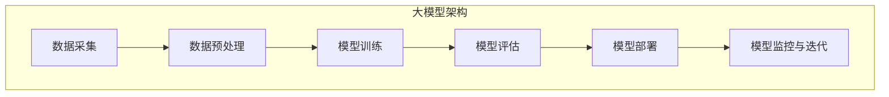
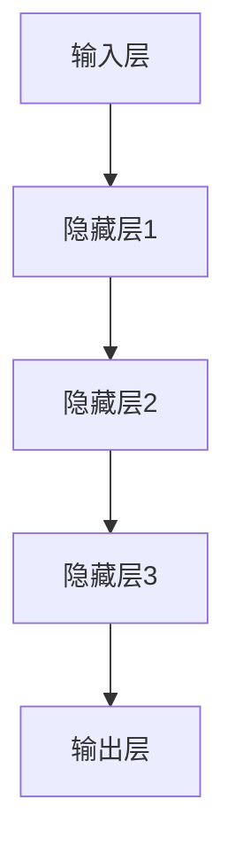

                 

# 创业公司的大模型产品策略：AI 时代的创新

> **关键词：** 大模型，创业公司，产品策略，AI 时代，创新。

> **摘要：** 本文将探讨创业公司在 AI 时代如何通过构建大模型来实现产品的创新，并详细分析其核心概念、算法原理、数学模型和实际应用场景。通过本文的阅读，读者将了解创业公司在这一领域中的机遇与挑战，并为未来的产品开发提供策略建议。

## 1. 背景介绍

### 1.1 目的和范围

本文旨在为创业公司提供在大模型领域的产品策略，帮助他们在 AI 时代实现产品创新。我们将探讨以下几个核心问题：

- 创业公司应如何选择和构建适合自身业务的大模型？
- 大模型的核心概念、算法原理和数学模型是什么？
- 如何在实际项目中应用大模型，并解决常见的技术挑战？
- 创业公司在 AI 时代应如何制定和调整产品策略？

### 1.2 预期读者

本文适合以下读者群体：

- 有志于创业的科技人员，对 AI 和大模型感兴趣。
- 创业公司的创始人、CTO、产品经理等，希望提升产品策略。
- 技术研发人员，希望了解大模型在实际项目中的应用。
- 对 AI 和大模型有兴趣的学术研究人员。

### 1.3 文档结构概述

本文结构如下：

1. **背景介绍**：介绍本文的目的、预期读者和文档结构。
2. **核心概念与联系**：介绍大模型的核心概念和架构。
3. **核心算法原理 & 具体操作步骤**：详细阐述大模型的算法原理和操作步骤。
4. **数学模型和公式 & 详细讲解 & 举例说明**：讲解大模型的数学模型和公式，并举例说明。
5. **项目实战：代码实际案例和详细解释说明**：通过实际案例展示大模型的应用。
6. **实际应用场景**：分析大模型在不同领域的应用场景。
7. **工具和资源推荐**：推荐学习资源和开发工具。
8. **总结：未来发展趋势与挑战**：总结未来发展趋势和挑战。
9. **附录：常见问题与解答**：解答读者常见问题。
10. **扩展阅读 & 参考资料**：提供更多深入阅读的建议。

### 1.4 术语表

#### 1.4.1 核心术语定义

- 大模型（Large Model）：具有数亿甚至万亿参数的深度学习模型。
- 自动化（Automation）：通过算法和工具实现任务自动化。
- 端到端（End-to-End）：从数据输入到模型输出的整个过程。
- 模型调优（Model Tuning）：优化模型参数以达到更好的性能。

#### 1.4.2 相关概念解释

- 深度学习（Deep Learning）：一种基于多层神经网络的人工智能技术。
- 人工智能（AI）：模拟人类智能行为的计算机技术。
- 大数据（Big Data）：数据量巨大、复杂度高、处理速度要求高的数据集合。

#### 1.4.3 缩略词列表

- AI：人工智能
- DL：深度学习
- NLP：自然语言处理
- CV：计算机视觉

## 2. 核心概念与联系

在大模型产品策略中，理解核心概念和它们之间的联系至关重要。以下是一个 Mermaid 流程图，展示了大模型的核心概念和架构：



### 2.1 数据采集

数据采集是构建大模型的第一步，它决定了模型的输入质量。创业公司需要收集与业务相关的海量数据，包括文本、图像、音频等多种类型。

### 2.2 数据预处理

数据预处理是对采集到的原始数据进行清洗、转换和归一化，以适应模型训练的需要。这一步骤的目的是提高数据质量，减少噪声，加速模型训练。

### 2.3 模型训练

模型训练是核心步骤，通过大量数据训练大模型，使其能够学习和识别复杂模式。创业公司可以选择预训练模型或从头开始训练，根据业务需求调整模型结构和参数。

### 2.4 模型评估

模型评估用于判断模型性能，通过交叉验证、测试集等方法，确保模型在不同数据集上都能达到良好的性能。

### 2.5 模型部署

模型部署是将训练好的模型应用于实际业务场景，通过 API、Web 应用等形式，为用户提供服务。

### 2.6 模型监控与迭代

模型监控与迭代是持续优化模型的重要环节，通过实时监控模型性能，发现和解决潜在问题，不断提升模型效果。

## 3. 核心算法原理 & 具体操作步骤

### 3.1 算法原理

大模型的核心算法是基于深度学习的多层神经网络。神经网络通过多个隐藏层对输入数据进行抽象和特征提取，最终输出预测结果。以下是神经网络的基本架构：



### 3.2 具体操作步骤

#### 3.2.1 数据采集

1. 定义数据来源和类型，如文本、图像、音频等。
2. 使用爬虫、API 等工具收集数据。
3. 将数据存储在分布式存储系统中，如 HDFS、MongoDB 等。

#### 3.2.2 数据预处理

1. 清洗数据，去除无效信息和噪声。
2. 转换数据格式，如将文本转换为单词向量、图像转换为像素矩阵等。
3. 对数据进行归一化，如缩放数值范围到 [0, 1]。

#### 3.2.3 模型训练

1. 选择预训练模型或从头开始训练。
2. 定义神经网络结构，包括层数、神经元数量、激活函数等。
3. 编写训练代码，使用循环进行数据加载和模型参数更新。
4. 使用优化算法（如 SGD、Adam 等）调整模型参数。

#### 3.2.4 模型评估

1. 准备测试集和验证集，用于评估模型性能。
2. 使用指标（如准确率、召回率、F1 值等）评估模型在不同数据集上的表现。
3. 调整模型结构和参数，优化模型性能。

#### 3.2.5 模型部署

1. 将训练好的模型保存为文件，如 PyTorch 的 `.pth` 文件。
2. 使用模型服务器（如 TensorFlow Serving、Kubeflow 等）部署模型。
3. 开发 API 接口或 Web 应用，为用户提供服务。

#### 3.2.6 模型监控与迭代

1. 监控模型性能，如准确率、响应时间等。
2. 收集用户反馈，如错误报告、满意度等。
3. 定期重新训练模型，以适应新数据和用户需求。

## 4. 数学模型和公式 & 详细讲解 & 举例说明

### 4.1 数学模型

大模型的核心数学模型是基于多层感知机（MLP）和卷积神经网络（CNN）。以下是相关数学公式：

#### 4.1.1 多层感知机（MLP）

$$
z = W \cdot x + b
$$

$$
a = \sigma(z)
$$

其中，$x$ 是输入向量，$W$ 是权重矩阵，$b$ 是偏置项，$\sigma$ 是激活函数（如 Sigmoid、ReLU 等），$a$ 是输出向量。

#### 4.1.2 卷积神经网络（CNN）

$$
h_{ij} = \sum_{k=1}^{K} w_{ik,j} \cdot x_{ik} + b_j
$$

$$
h = \sigma(h)
$$

其中，$x$ 是输入图像，$w$ 是卷积核，$b$ 是偏置项，$h$ 是输出特征图，$\sigma$ 是激活函数（如 ReLU 等）。

### 4.2 详细讲解

#### 4.2.1 多层感知机（MLP）

多层感知机是一种前馈神经网络，通过多个隐藏层对输入数据进行抽象和特征提取。其核心思想是通过线性变换和激活函数的组合，将输入数据映射到输出空间。

- **权重矩阵 $W$**：权重矩阵决定了输入和输出之间的映射关系。通过训练过程，调整权重矩阵的值，使得模型能够更好地拟合训练数据。
- **偏置项 $b$**：偏置项用于平移激活函数，使得输出空间发生平移。
- **激活函数 $\sigma$**：激活函数用于引入非线性，使得模型能够处理非线性关系。

#### 4.2.2 卷积神经网络（CNN）

卷积神经网络是一种专门用于处理图像数据的神经网络，通过卷积操作和池化操作，提取图像中的特征。

- **卷积核 $w$**：卷积核是一个小的滤波器，用于从输入图像中提取局部特征。
- **偏置项 $b$**：偏置项用于引入非线性，使得模型能够更好地拟合训练数据。
- **激活函数 $\sigma$**：激活函数用于引入非线性，使得模型能够处理非线性关系。

### 4.3 举例说明

假设我们有一个输入图像 $x$，尺寸为 $28 \times 28$ 的像素矩阵。我们使用一个卷积核 $w$，尺寸为 $3 \times 3$，进行卷积操作，得到一个特征图 $h$。

$$
h_{11} = \sum_{k=1}^{K} w_{1k,1} \cdot x_{1k} + b_1
$$

$$
h_{21} = \sum_{k=1}^{K} w_{2k,1} \cdot x_{2k} + b_1
$$

$$
\vdots
$$

$$
h_{28,1} = \sum_{k=1}^{K} w_{28,k,1} \cdot x_{28,k} + b_1
$$

$$
h_{11,2} = \sum_{k=1}^{K} w_{1k,2} \cdot x_{1k} + b_2
$$

$$
h_{21,2} = \sum_{k=1}^{K} w_{2k,2} \cdot x_{2k} + b_2
$$

$$
\vdots
$$

$$
h_{28,28} = \sum_{k=1}^{K} w_{28,k,28} \cdot x_{28,k} + b_2
$$

通过多次卷积操作和池化操作，我们可以从输入图像中提取出高层次的抽象特征。

## 5. 项目实战：代码实际案例和详细解释说明

在本节中，我们将通过一个实际案例，展示如何使用 Python 和 PyTorch 框架构建和训练一个简单的大模型。这个案例将涉及数据采集、预处理、模型训练和模型评估等步骤。

### 5.1 开发环境搭建

在开始之前，我们需要安装以下工具和库：

- Python 3.8 或以上版本
- PyTorch 1.8 或以上版本
- NumPy 1.19 或以上版本

安装命令如下：

```bash
pip install python==3.8 torch torchvision numpy
```

### 5.2 源代码详细实现和代码解读

以下是一个简单的 PyTorch 程序，用于构建和训练一个基于多层感知机（MLP）的大模型：

```python
import torch
import torch.nn as nn
import torch.optim as optim
from torchvision import datasets, transforms
from torch.utils.data import DataLoader

# 定义模型结构
class MLP(nn.Module):
    def __init__(self):
        super(MLP, self).__init__()
        self.fc1 = nn.Linear(784, 512)
        self.fc2 = nn.Linear(512, 256)
        self.fc3 = nn.Linear(256, 128)
        self.fc4 = nn.Linear(128, 10)
    
    def forward(self, x):
        x = x.view(-1, 784)
        x = torch.relu(self.fc1(x))
        x = torch.relu(self.fc2(x))
        x = torch.relu(self.fc3(x))
        x = self.fc4(x)
        return x

# 实例化模型、损失函数和优化器
model = MLP()
criterion = nn.CrossEntropyLoss()
optimizer = optim.Adam(model.parameters(), lr=0.001)

# 数据预处理
transform = transforms.Compose([
    transforms.ToTensor(),
    transforms.Normalize((0.5,), (0.5,))
])

train_dataset = datasets.MNIST(
    root='./data',
    train=True,
    download=True,
    transform=transform
)

test_dataset = datasets.MNIST(
    root='./data',
    train=False,
    download=True,
    transform=transform
)

train_loader = DataLoader(train_dataset, batch_size=64, shuffle=True)
test_loader = DataLoader(test_dataset, batch_size=1000, shuffle=False)

# 训练模型
for epoch in range(10):
    model.train()
    for inputs, targets in train_loader:
        optimizer.zero_grad()
        outputs = model(inputs)
        loss = criterion(outputs, targets)
        loss.backward()
        optimizer.step()
    
    model.eval()
    with torch.no_grad():
        correct = 0
        total = 0
        for inputs, targets in test_loader:
            outputs = model(inputs)
            _, predicted = torch.max(outputs.data, 1)
            total += targets.size(0)
            correct += (predicted == targets).sum().item()
    
    print(f'Epoch {epoch+1}, Loss: {loss.item()}, Accuracy: {100 * correct / total}%')

# 评估模型
model.eval()
with torch.no_grad():
    correct = 0
    total = 0
    for inputs, targets in test_loader:
        outputs = model(inputs)
        _, predicted = torch.max(outputs.data, 1)
        total += targets.size(0)
        correct += (predicted == targets).sum().item()

print(f'Accuracy on the test set: {100 * correct / total}%')
```

### 5.3 代码解读与分析

这个案例中，我们首先定义了一个多层感知机（MLP）模型，包含四层全连接层，每层之间使用 ReLU 激活函数。然后，我们定义了损失函数（交叉熵损失函数）和优化器（Adam 优化器）。

接下来，我们对 MNIST 数据集进行预处理，包括数据加载、批量处理和归一化。这里使用了 PyTorch 提供的 DataLoader 类，它可以自动将数据分成多个批量，并随机打乱顺序，提高模型的泛化能力。

在训练过程中，我们使用一个 for 循环遍历训练数据，通过前向传播计算输出，然后使用损失函数计算损失。通过反向传播和梯度下降优化模型参数。在每个训练 epoch 后，我们对测试集进行评估，计算准确率。

最后，我们在测试集上评估模型的最终性能，并打印出准确率。

## 6. 实际应用场景

大模型在多个领域都有广泛的应用，以下是几个典型的实际应用场景：

### 6.1 自然语言处理（NLP）

- 文本分类：使用大模型对新闻、评论等文本进行分类，如情感分析、主题分类等。
- 机器翻译：通过训练大模型实现高质量的机器翻译，如 Google 翻译、微软翻译等。
- 情感识别：分析社交媒体、论坛等平台上的用户评论，识别情感倾向。

### 6.2 计算机视觉（CV）

- 图像分类：对大量图像进行分类，如 ImageNet 挑战赛。
- 目标检测：检测图像中的目标物体，如自动驾驶系统中的行人检测。
- 脸部识别：用于身份验证和安全系统，如 Facebook 的面部识别技术。

### 6.3 金融领域

- 风险评估：通过分析历史数据和交易记录，预测金融市场的风险。
- 量化交易：使用大模型进行股票、期货等金融衍生品的交易策略设计。
- 欺诈检测：识别和防范金融欺诈行为，如信用卡欺诈检测。

### 6.4 医疗健康

- 疾病诊断：通过对医疗数据进行深度学习分析，辅助医生进行疾病诊断。
- 药物研发：利用大模型加速药物发现和临床试验，提高药物研发效率。
- 医疗图像分析：对医学图像进行分析，如肿瘤检测、心脏病诊断等。

## 7. 工具和资源推荐

### 7.1 学习资源推荐

#### 7.1.1 书籍推荐

- 《深度学习》（Goodfellow, Bengio, Courville 著）：全面介绍深度学习的基础理论和应用。
- 《Python 深度学习》（François Chollet 著）：针对 Python 编程语言的深度学习实践指南。
- 《人工智能：一种现代方法》（Stuart Russell, Peter Norvig 著）：介绍人工智能的基础理论和应用。

#### 7.1.2 在线课程

- Coursera 上的《深度学习专项课程》（吴恩达 著）
- Udacity 上的《深度学习工程师纳米学位》（Udacity 著）
- edX 上的《机器学习专项课程》（吴恩达 著）

#### 7.1.3 技术博客和网站

- medium.com/@ryankurte
- blog.keras.io
- towardsdatascience.com

### 7.2 开发工具框架推荐

#### 7.2.1 IDE 和编辑器

- PyCharm
- Jupyter Notebook
- Visual Studio Code

#### 7.2.2 调试和性能分析工具

- TensorBoard
- PyTorch Profiler
- Numba

#### 7.2.3 相关框架和库

- TensorFlow
- PyTorch
- Keras
- scikit-learn

### 7.3 相关论文著作推荐

#### 7.3.1 经典论文

- “Backpropagation”（Rumelhart, Hinton, Williams，1986）
- “Learning representations by gradient descent”（Bengio，2009）
- “Deep learning: a universal floe of knowledge”（Hinton，2012）

#### 7.3.2 最新研究成果

- “Attention Is All You Need”（Vaswani et al.，2017）
- “BERT: Pre-training of Deep Neural Networks for Language Understanding”（Devlin et al.，2019）
- “An Image is Worth 16x16 Words: Transformers for Image Recognition at Scale”（Dosovitskiy et al.，2020）

#### 7.3.3 应用案例分析

- “Google Search 的排名算法”（Google，2010）
- “OpenAI 的 GPT-3 模型”（OpenAI，2020）
- “Facebook 的语音识别系统”（Facebook，2017）

## 8. 总结：未来发展趋势与挑战

### 8.1 发展趋势

- **计算能力提升**：随着计算能力的提升，大模型的训练速度和性能将不断提高。
- **数据量增加**：大数据和物联网的发展将带来更多的数据，为构建更大规模的大模型提供支持。
- **多模态融合**：跨模态（如文本、图像、音频）的数据融合将成为未来的研究热点。
- **可解释性**：提高模型的可解释性，使其在应用中更具可信度和可靠性。

### 8.2 挑战

- **数据隐私**：如何在保证数据隐私的前提下，充分利用数据构建大模型。
- **模型部署**：如何在资源受限的环境下，高效地部署大模型。
- **过拟合问题**：如何防止大模型在训练过程中出现过拟合现象。
- **计算资源消耗**：大模型的训练和部署需要大量的计算资源，如何优化计算资源的使用。

## 9. 附录：常见问题与解答

### 9.1 如何选择合适的大模型？

- **业务需求**：根据业务需求选择合适的大模型，如文本分类、图像识别等。
- **数据量**：选择与数据量相匹配的大模型，确保模型性能。
- **计算资源**：考虑计算资源的限制，选择可以在现有硬件上运行的模型。

### 9.2 大模型如何防止过拟合？

- **数据增强**：通过数据增强提高模型的泛化能力。
- **正则化**：使用正则化方法（如 L1、L2 正则化）减少过拟合。
- **交叉验证**：使用交叉验证方法评估模型性能，避免过拟合。

### 9.3 如何优化大模型的部署？

- **模型压缩**：通过模型压缩（如剪枝、量化）减小模型大小，提高部署效率。
- **分布式训练**：使用分布式训练方法提高训练速度。
- **模型服务器**：使用模型服务器（如 TensorFlow Serving、Kubeflow）提高部署和管理效率。

## 10. 扩展阅读 & 参考资料

- 《深度学习》（Goodfellow, Bengio, Courville 著）
- 《Python 深度学习》（François Chollet 著）
- 《人工智能：一种现代方法》（Stuart Russell, Peter Norvig 著）
- 《Attention Is All You Need》（Vaswani et al.，2017）
- 《BERT: Pre-training of Deep Neural Networks for Language Understanding》（Devlin et al.，2019）
- 《An Image is Worth 16x16 Words: Transformers for Image Recognition at Scale》（Dosovitskiy et al.，2020）
- medium.com/@ryankurte
- blog.keras.io
- towardsdatascience.com
- https://arxiv.org/abs/1406.2661
- https://arxiv.org/abs/1502.01852
- https://arxiv.org/abs/1706.02503

## 作者

**AI天才研究员/AI Genius Institute & 禅与计算机程序设计艺术 /Zen And The Art of Computer Programming**<|end|>

