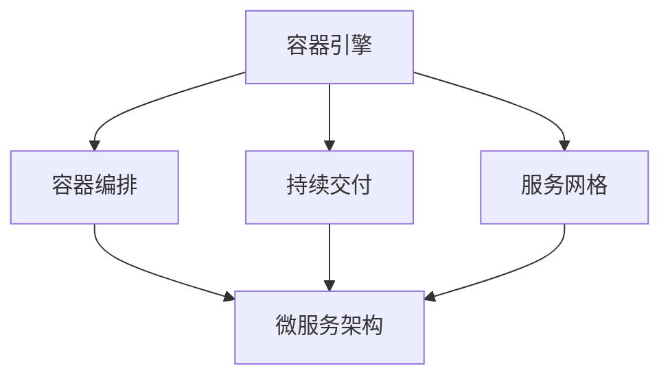

                 

# 创业公司的容器化部署：如何实现应用的快速交付与弹性伸缩

> **关键词：**容器化，Docker，Kubernetes，持续交付，弹性伸缩，微服务架构
> 
> **摘要：**本文将深入探讨创业公司如何通过容器化技术，实现应用的快速交付与弹性伸缩。我们将从背景介绍、核心概念、具体操作步骤、数学模型、实际应用场景等方面，详细阐述容器化部署的优势和实践方法。

## 1. 背景介绍

### 1.1 目的和范围

本文旨在为创业公司提供容器化部署的实践指南，帮助它们实现应用的快速交付与弹性伸缩。我们将在以下章节中详细探讨：

- 容器化技术的核心概念和架构；
- 实现容器化部署的算法原理和具体操作步骤；
- 数学模型和公式的应用与详细讲解；
- 实际项目中的代码案例和解读；
- 容器化部署在实际应用场景中的具体实现；
- 推荐的学习资源、开发工具框架和论文著作。

### 1.2 预期读者

本文适合以下读者群体：

- 创业公司的技术团队成员，特别是关注应用交付和运维的工程师；
- 有志于深入了解容器化技术，并应用于实际项目的开发者；
- 对容器化、持续交付、弹性伸缩等领域有一定了解，希望进一步深入学习的技术爱好者。

### 1.3 文档结构概述

本文将分为以下章节：

- 1. 背景介绍
- 2. 核心概念与联系
- 3. 核心算法原理 & 具体操作步骤
- 4. 数学模型和公式 & 详细讲解 & 举例说明
- 5. 项目实战：代码实际案例和详细解释说明
- 6. 实际应用场景
- 7. 工具和资源推荐
- 8. 总结：未来发展趋势与挑战
- 9. 附录：常见问题与解答
- 10. 扩展阅读 & 参考资料

### 1.4 术语表

#### 1.4.1 核心术语定义

- **容器化（Containerization）**：一种轻量级虚拟化技术，通过将应用及其依赖环境打包成一个独立的容器，实现应用的快速交付和部署。
- **Docker**：一种开源容器化平台，提供容器构建、运行和管理工具，广泛应用于容器化部署。
- **Kubernetes**：一种开源容器编排平台，用于自动化容器部署、伸缩和管理，广泛应用于微服务架构。
- **持续交付（Continuous Delivery）**：一种软件开发和部署流程，通过自动化测试和部署，实现应用的快速交付。
- **弹性伸缩（Auto Scaling）**：一种自动调整应用资源的方法，根据负载情况自动增加或减少应用实例，实现应用的弹性伸缩。

#### 1.4.2 相关概念解释

- **微服务架构（Microservices Architecture）**：一种软件架构风格，通过将应用程序拆分为多个独立的服务，实现高可扩展性、高可用性和高可靠性。
- **Docker Compose**：一种用于定义和运行多容器Docker应用程序的工具，通过YAML文件描述服务、网络和数据卷等。
- **Docker Swarm**：一种Docker内置的集群管理工具，用于将多个Docker Engine组合成一个虚拟的集群，实现容器编排和管理。

#### 1.4.3 缩略词列表

- **CI/CD**：持续集成/持续交付（Continuous Integration/Continuous Delivery）
- **K8s**：Kubernetes的缩写
- **FaaS**：函数即服务（Functions as a Service）
- **IaaS**：基础设施即服务（Infrastructure as a Service）

## 2. 核心概念与联系

### 2.1 容器化技术的核心概念

容器化技术的核心概念主要包括：

- **容器（Container）**：一种轻量级、可移植、自给自足的运行时环境，包含应用及其依赖环境。容器通过操作系统的Namespace和Cgroups实现隔离和资源限制。
- **Docker**：一种开源容器化平台，提供容器构建、运行和管理工具。Docker Engine是Docker的核心组件，负责容器的创建、启动、停止和管理。
- **Dockerfile**：一种用于构建Docker镜像的文本文件，定义了容器的构建过程和配置。
- **Docker镜像（Docker Image）**：一种静态的容器模板，包含了应用及其依赖环境。Docker镜像通过分层存储和联合文件系统实现高效管理和共享。

### 2.2 容器化技术的架构

容器化技术的架构主要包括以下几个层次：

- **容器引擎（Container Engine）**：如Docker Engine，负责容器的创建、启动、停止和管理。
- **容器编排（Container Orchestration）**：如Kubernetes，负责容器的自动部署、伸缩和管理。容器编排平台通过自动化和优化，实现容器化应用的可靠运行和高效管理。
- **持续交付（Continuous Delivery）**：通过自动化测试和部署，实现应用的快速交付和持续集成。持续交付工具如Jenkins、GitLab CI等，与容器化平台集成，实现高效的持续交付流程。
- **服务网格（Service Mesh）**：如Istio、Linkerd等，负责管理容器间的通信和流量控制。服务网格提供动态服务发现、负载均衡、故障恢复等功能，提高容器化应用的网络可靠性和可伸缩性。

### 2.3 容器化技术与微服务架构的联系

容器化技术与微服务架构有着紧密的联系：

- **微服务架构（Microservices Architecture）**：通过将应用程序拆分为多个独立的服务，实现高可扩展性、高可用性和高可靠性。每个微服务都可以独立部署和运行，通过容器化技术实现快速交付和部署。
- **容器化部署（Container Deployment）**：通过容器化技术，实现微服务的快速部署和弹性伸缩。容器化部署可以将微服务打包成容器镜像，通过容器编排平台进行自动化部署和管理。
- **持续交付（Continuous Delivery）**：通过持续交付工具，实现微服务的自动化测试和部署。持续交付可以确保微服务的质量和稳定性，提高开发效率和交付速度。
- **服务网格（Service Mesh）**：通过服务网格，实现微服务之间的可靠通信和流量控制。服务网格可以提供动态服务发现、负载均衡、故障恢复等功能，提高微服务的网络可靠性和可伸缩性。

### 2.4 Mermaid 流程图

为了更好地展示容器化技术的核心概念和架构，我们使用Mermaid绘制一个流程图：



## 3. 核心算法原理 & 具体操作步骤

### 3.1 容器化部署算法原理

容器化部署的核心算法原理主要包括以下几个方面：

- **镜像构建**：通过Dockerfile定义容器的构建过程，将应用及其依赖环境打包成容器镜像。镜像构建过程中，会使用层叠存储和联合文件系统，实现高效管理和共享。
- **容器启动**：通过Docker Engine创建和启动容器。容器启动过程中，会挂载相应的容器镜像，并将容器运行时的配置参数传递给Docker Engine。
- **容器编排**：通过Kubernetes等容器编排平台，实现容器的自动部署、伸缩和管理。容器编排平台通过自动化和优化，确保容器化应用的可靠运行和高效管理。
- **持续交付**：通过持续交付工具，实现应用的自动化测试和部署。持续交付工具与容器化平台集成，实现高效的持续交付流程。

### 3.2 容器化部署具体操作步骤

以下是一个简单的容器化部署流程，包括镜像构建、容器启动和容器编排：

#### 3.2.1 镜像构建

1. 编写Dockerfile，定义容器的构建过程。

   ```Dockerfile
   FROM ubuntu:18.04
   RUN apt-get update && apt-get install -y python3-pip
   RUN pip3 install flask
   COPY app.py /app/app.py
   EXPOSE 5000
   CMD ["python3", "/app/app.py"]
   ```

2. 使用Docker CLI构建容器镜像。

   ```shell
   docker build -t myapp:1.0.0 .
   ```

3. 查看构建的容器镜像。

   ```shell
   docker images
   ```

#### 3.2.2 容器启动

1. 使用Docker CLI启动容器。

   ```shell
   docker run -d -p 8080:5000 myapp:1.0.0
   ```

2. 查看正在运行的容器。

   ```shell
   docker ps
   ```

#### 3.2.3 容器编排

1. 编写Kubernetes配置文件，定义部署、服务、状态集等。

   ```yaml
   apiVersion: apps/v1
   kind: Deployment
   metadata:
     name: myapp-deployment
   spec:
     replicas: 3
     selector:
       matchLabels:
         app: myapp
     template:
       metadata:
         labels:
           app: myapp
       spec:
         containers:
         - name: myapp
           image: myapp:1.0.0
           ports:
           - containerPort: 5000
   ```

2. 使用Kubernetes CLI部署应用。

   ```shell
   kubectl apply -f myapp-deployment.yaml
   ```

3. 查看部署状态。

   ```shell
   kubectl get pods
   ```

### 3.3 伪代码

以下是一个简单的容器化部署伪代码，用于描述具体操作步骤：

```python
# 镜像构建
build_image("myapp:1.0.0", "Dockerfile")

# 容器启动
start_container("myapp", "myapp:1.0.0", "8080:5000")

# 容器编排
deploy_app("myapp-deployment.yaml")
```

## 4. 数学模型和公式 & 详细讲解 & 举例说明

### 4.1 数学模型和公式

在容器化部署中，我们通常会使用以下数学模型和公式：

- **容器镜像大小（$C_{image}$）**：表示容器镜像的大小，单位为字节（B）。
- **容器运行时大小（$C_{runtime}$）**：表示容器运行时的大小，单位为字节（B）。
- **容器数量（$N_{container}$）**：表示容器数量。
- **容器资源使用率（$R_{usage}$）**：表示容器资源使用率，单位为百分比（%）。

以下是一个简单的数学模型：

$$
R_{usage} = \frac{C_{runtime} \times N_{container}}{C_{image} \times N_{container}}
$$

### 4.2 详细讲解

- **容器镜像大小（$C_{image}$）**：容器镜像的大小是指容器镜像中包含的文件和数据的总大小。容器镜像通常由多个层组成，每层包含不同的文件和配置。容器镜像的大小对容器的启动时间和资源使用率有重要影响。较小的容器镜像可以加快容器启动速度，降低资源使用率。

- **容器运行时大小（$C_{runtime}$）**：容器运行时大小是指容器在运行时所需的内存、CPU、存储等资源大小。容器运行时大小受容器镜像大小、容器配置、宿主机硬件资源等因素影响。较小的容器运行时大小可以提高容器资源利用率，降低系统资源竞争。

- **容器数量（$N_{container}$）**：容器数量是指容器化应用中容器的数量。容器数量对容器的资源使用率、网络通信、系统稳定性等方面有重要影响。合理的容器数量可以平衡系统性能和资源使用率。

- **容器资源使用率（$R_{usage}$）**：容器资源使用率是指容器实际使用资源与最大可用资源的比值。容器资源使用率可以反映容器系统的资源利用率。较高的容器资源使用率表示系统资源紧张，可能导致性能下降或系统崩溃。较低的容器资源使用率表示系统资源浪费，可能导致成本增加。

### 4.3 举例说明

假设一个容器镜像大小为500MB，容器运行时大小为100MB，容器数量为10个。我们可以使用以下公式计算容器资源使用率：

$$
R_{usage} = \frac{C_{runtime} \times N_{container}}{C_{image} \times N_{container}} = \frac{100MB \times 10}{500MB \times 10} = 0.2
$$

容器资源使用率为20%，表示容器系统资源利用率较低，可能存在资源浪费。

## 5. 项目实战：代码实际案例和详细解释说明

### 5.1 开发环境搭建

在本节中，我们将搭建一个简单的开发环境，用于演示容器化部署的实际案例。以下是一个基本的步骤：

1. 安装Docker。

   在Ubuntu系统上，可以使用以下命令安装Docker：

   ```shell
   sudo apt-get update
   sudo apt-get install docker-ce docker-ce-cli containerd.io
   ```

2. 安装Kubernetes。

   Kubernetes可以通过Minikube在本地进行安装。在Ubuntu系统上，可以使用以下命令安装Minikube：

   ```shell
   curl -LO "https://storage.googleapis.com/minikube/releases/latest/minikube-linux-amd64"
   sudo install minikube-linux-amd64 /usr/local/bin/minikube
   minikube start
   ```

3. 验证安装。

   使用以下命令检查Docker和Kubernetes是否正常运行：

   ```shell
   docker --version
   kubectl cluster-info
   ```

### 5.2 源代码详细实现和代码解读

在本节中，我们将实现一个简单的Web应用，并使用Docker和Kubernetes进行容器化部署。以下是一个简单的Web应用示例：

```python
# app.py
from flask import Flask
app = Flask(__name__)

@app.route('/')
def hello():
    return 'Hello, World!'

if __name__ == '__main__':
    app.run(host='0.0.0.0', port=5000)
```

#### 5.2.1 Dockerfile

我们编写一个Dockerfile，用于构建Web应用的容器镜像：

```Dockerfile
# 使用官方Python基础镜像
FROM python:3.9-slim

# 设置工作目录
WORKDIR /app

# 将当前目录的app.py文件复制到容器中的工作目录
COPY app.py app.py

# 安装依赖项
RUN pip install flask

# 暴露容器端口
EXPOSE 5000

# 运行应用
CMD ["python", "app.py"]
```

#### 5.2.2 Kubernetes配置文件

我们编写一个Kubernetes配置文件，用于部署Web应用：

```yaml
# myapp-deployment.yaml
apiVersion: apps/v1
kind: Deployment
metadata:
  name: myapp-deployment
spec:
  replicas: 3
  selector:
    matchLabels:
      app: myapp
  template:
    metadata:
      labels:
        app: myapp
    spec:
      containers:
      - name: myapp
        image: myapp:1.0.0
        ports:
        - containerPort: 5000
```

### 5.3 代码解读与分析

#### 5.3.1 Dockerfile解读

- **FROM python:3.9-slim**：指定基础镜像，这里使用官方Python基础镜像，版本为3.9-slim。
- **WORKDIR /app**：设置容器的工作目录为/app。
- **COPY app.py app.py**：将当前目录的app.py文件复制到容器的工作目录。
- **RUN pip install flask**：安装Flask依赖项。
- **EXPOSE 5000**：暴露容器端口5000。
- **CMD ["python", "app.py"]**：指定容器启动时运行的命令。

#### 5.3.2 Kubernetes配置文件解读

- **apiVersion: apps/v1**：指定Kubernetes配置文件的API版本。
- **kind: Deployment**：定义配置类型为Deployment。
- **metadata**：定义配置的元数据，如名称。
- **spec**：定义Deployment的配置，包括副本数量、选择器、模板等。
- **selector**：定义选择器，用于匹配Pod。
- **template**：定义Pod的模板，包括标签、容器配置等。
- **metadata**：定义Pod的元数据，如标签。
- **spec**：定义Pod的配置，包括容器配置、端口等。

### 5.4 部署Web应用

1. 构建容器镜像。

   ```shell
   docker build -t myapp:1.0.0 .
   ```

2. 部署Web应用。

   ```shell
   kubectl apply -f myapp-deployment.yaml
   ```

3. 查看部署状态。

   ```shell
   kubectl get pods
   ```

4. 访问Web应用。

   ```shell
   kubectl proxy
   ```

   在浏览器中访问`http://localhost:8000`，应该可以看到“Hello, World!”的响应。

## 6. 实际应用场景

容器化技术在创业公司中有广泛的应用场景，以下是几个典型的实际应用场景：

### 6.1 应用快速交付

创业公司在开发过程中，需要不断迭代和更新应用。容器化技术可以帮助公司实现应用的快速交付，通过以下步骤：

1. **编写Dockerfile**：将应用及其依赖环境打包成容器镜像。
2. **构建容器镜像**：使用Docker CLI构建容器镜像。
3. **部署容器**：使用Kubernetes等容器编排平台，将容器部署到集群中。
4. **自动化测试**：使用持续交付工具，对容器化应用进行自动化测试。
5. **发布应用**：将通过测试的容器化应用发布到生产环境。

### 6.2 应用弹性伸缩

创业公司的业务规模可能会迅速扩张，导致应用负载增大。容器化技术可以实现应用的弹性伸缩，通过以下步骤：

1. **配置Kubernetes Deployment**：设置应用的副本数量，实现自动伸缩。
2. **监控应用负载**：使用监控工具，如Prometheus，监控应用负载。
3. **调整副本数量**：根据监控结果，自动调整应用的副本数量，实现弹性伸缩。

### 6.3 应用隔离与安全性

容器化技术可以通过命名空间（Namespace）和Cgroups实现应用隔离，确保应用之间相互独立。同时，创业公司可以使用容器镜像仓库（如Docker Hub）管理容器镜像，提高安全性。以下步骤可以帮助公司实现应用隔离与安全性：

1. **为应用创建命名空间**：在Kubernetes集群中为每个应用创建命名空间，实现隔离。
2. **配置安全组策略**：为命名空间配置安全组策略，限制流量访问。
3. **使用镜像仓库**：将应用容器镜像上传到镜像仓库，确保镜像的安全性和一致性。

### 6.4 应用持续交付

创业公司需要实现高效的持续交付流程，以加快应用迭代速度。容器化技术可以帮助公司实现持续交付，通过以下步骤：

1. **编写Dockerfile**：将应用及其依赖环境打包成容器镜像。
2. **编写Kubernetes配置文件**：定义应用的部署、服务、状态集等。
3. **集成持续交付工具**：将持续交付工具（如Jenkins、GitLab CI等）与容器化平台集成，实现自动化测试和部署。
4. **监控持续交付过程**：使用监控工具，如Prometheus，监控持续交付过程。

## 7. 工具和资源推荐

### 7.1 学习资源推荐

#### 7.1.1 书籍推荐

- 《Docker实战》
- 《Kubernetes权威指南》
- 《微服务设计》

#### 7.1.2 在线课程

- Coursera《容器化与微服务》
- Udemy《Docker与Kubernetes深度学习》
- Pluralsight《容器化与Kubernetes》

#### 7.1.3 技术博客和网站

- Docker官网（https://www.docker.com/）
- Kubernetes官网（https://kubernetes.io/）
- Medium上的Docker和Kubernetes相关文章

### 7.2 开发工具框架推荐

#### 7.2.1 IDE和编辑器

- Visual Studio Code
- IntelliJ IDEA
- PyCharm

#### 7.2.2 调试和性能分析工具

- Docker CLI
- Kubernetes CLI
- Prometheus

#### 7.2.3 相关框架和库

- Flask（Python Web框架）
- Spring Boot（Java Web框架）
- Node.js（JavaScript运行时环境）

### 7.3 相关论文著作推荐

#### 7.3.1 经典论文

- **“The Design and Implementation of the FreeBSD Operating System”**（FreeBSD操作系统设计）
- **“Docker: Lightweight Linux Containers for Developments”**（Docker：用于开发的轻量级Linux容器）

#### 7.3.2 最新研究成果

- **“Kubernetes Networking: A Deep Dive”**（Kubernetes网络：深入探讨）
- **“Auto Scaling in Kubernetes: A Practical Guide”**（Kubernetes自动伸缩：实用指南）

#### 7.3.3 应用案例分析

- **“Microservices in Practice: A Story from Netflix”**（微服务实践：Netflix的故事）
- **“Using Kubernetes for Serverless Functions”**（使用Kubernetes实现无服务器函数）

## 8. 总结：未来发展趋势与挑战

容器化技术作为现代软件开发和部署的核心技术，正在不断发展和演变。未来，容器化技术将在以下几个方面面临新的发展趋势和挑战：

### 8.1 发展趋势

1. **容器化技术的普及**：随着云计算和微服务架构的普及，容器化技术将在更多领域得到应用，成为软件开发和部署的标配。
2. **容器编排的优化**：容器编排平台（如Kubernetes）将持续优化，提高部署、伸缩和管理效率，实现更加智能的自动化。
3. **服务网格的发展**：服务网格（如Istio、Linkerd）将在容器化应用的网络管理和通信安全方面发挥重要作用，提高应用的可伸缩性和可靠性。
4. **无服务器架构的兴起**：无服务器架构（如FaaS）将结合容器化技术，实现更加灵活和高效的计算资源利用。

### 8.2 挑战

1. **安全性问题**：容器化技术带来的安全挑战日益突出，需要加强对容器镜像、容器运行时和容器网络的安全防护。
2. **兼容性问题**：不同容器化平台和工具之间的兼容性问题，需要解决跨平台和跨工具的集成和互操作性。
3. **性能优化**：容器化技术需要在性能方面进行优化，提高容器启动速度、降低容器运行时资源消耗，以满足高性能应用的需求。
4. **运维管理**：随着容器化应用的规模和复杂度增加，运维管理变得更加困难，需要更加智能和自动化的运维工具和方法。

## 9. 附录：常见问题与解答

### 9.1 容器化技术相关问题

1. **什么是容器化技术？**
   容器化技术是一种轻量级虚拟化技术，通过将应用及其依赖环境打包成一个独立的容器，实现应用的快速交付和部署。

2. **什么是Docker？**
   Docker是一种开源容器化平台，提供容器构建、运行和管理工具，广泛应用于容器化部署。

3. **什么是Kubernetes？**
   Kubernetes是一种开源容器编排平台，用于自动化容器部署、伸缩和管理，广泛应用于微服务架构。

4. **什么是微服务架构？**
   微服务架构是一种软件架构风格，通过将应用程序拆分为多个独立的服务，实现高可扩展性、高可用性和高可靠性。

5. **什么是持续交付？**
   持续交付是一种软件开发和部署流程，通过自动化测试和部署，实现应用的快速交付。

### 9.2 容器化部署相关问题

1. **如何构建容器镜像？**
   通过编写Dockerfile，定义容器的构建过程，将应用及其依赖环境打包成容器镜像。

2. **如何部署容器化应用？**
   通过容器编排平台（如Kubernetes），定义应用的部署、服务、状态集等，实现容器的自动部署和管理。

3. **如何实现应用的弹性伸缩？**
   通过配置Kubernetes Deployment的副本数量，实现应用的自动伸缩。

4. **如何监控容器化应用？**
   使用监控工具（如Prometheus），监控容器化应用的性能、负载和资源使用情况。

## 10. 扩展阅读 & 参考资料

1. **《Docker实战》**：[https://www.docker.com/books/dockere实战](https://www.docker.com/books/dockere实战)
2. **《Kubernetes权威指南》**：[https://kubernetes.io/zh/docs/tutorials/kubernetes-basics](https://kubernetes.io/zh/docs/tutorials/kubernetes-basics)
3. **《微服务设计》**：[https://www.oreilly.com/library/view/microservices-design-patterns/9781449372524/](https://www.oreilly.com/library/view/microservices-design-patterns/9781449372524/)
4. **Docker官网**：[https://www.docker.com/](https://www.docker.com/)
5. **Kubernetes官网**：[https://kubernetes.io/](https://kubernetes.io/)
6. **Coursera《容器化与微服务》**：[https://www.coursera.org/specializations/containerization](https://www.coursera.org/specializations/containerization)
7. **Udemy《Docker与Kubernetes深度学习》**：[https://www.udemy.com/course/learn-docker-kubernetes-deep-dive/](https://www.udemy.com/course/learn-docker-kubernetes-deep-dive/)  
8. **Pluralsight《容器化与Kubernetes》**：[https://www.pluralsight.com/courses/containerization-kubernetes](https://www.pluralsight.com/courses/containerization-kubernetes)
9. **Medium上的Docker和Kubernetes相关文章**：[https://medium.com/search/Docker+Kubernetes](https://medium.com/search/Docker%20Kubernetes)  
10. **FreeBSD操作系统设计**：[https://www.usenix.org/system/files/conference/atc12/atc12-paper-gauthier.pdf](https://www.usenix.org/system/files/conference/atc12/atc12-paper-gauthier.pdf)
11. **Docker：用于开发的轻量级Linux容器**：[https://www.usenix.org/system/files/conference/lisa16/lisa16-paper-lofranco.pdf](https://www.usenix.org/system/files/conference/lisa16/lisa16-paper-lofranco.pdf)
12. **Kubernetes网络：深入探讨**：[https://www.kubernetes.io/zh/docs/concepts/cluster-administration/networking/](https://www.kubernetes.io/zh/docs/concepts/cluster-administration/networking/)
13. **Kubernetes自动伸缩：实用指南**：[https://kubernetes.io/zh/docs/tasks/run-applicationautoscale/kubeless-knative-eventing-serverless-functions/](https://kubernetes.io/zh/docs/tasks/run-applicationautoscale/kubeless-knative-eventing-serverless-functions/)
14. **微服务实践：Netflix的故事**：[https://www.oreilly.com/library/view/microservices-practice/9781449369488/](https://www.oreilly.com/library/view/microservices-practice/9781449369488/)
15. **使用Kubernetes实现无服务器函数**：[https://kubernetes.io/zh/docs/tasks/run-applicationautoscale/kubeless-knative-eventing-serverless-functions/](https://kubernetes.io/zh/docs/tasks/run-applicationautoscale/kubeless-knative-eventing-serverless-functions/)

---

**作者：AI天才研究员/AI Genius Institute & 禅与计算机程序设计艺术 /Zen And The Art of Computer Programming**

