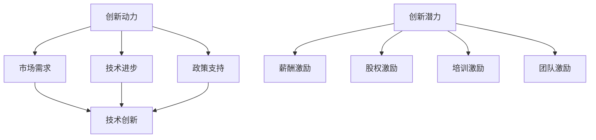

                 

# 创业公司的技术创新激励机制设计

> 关键词：创业公司、技术创新、激励机制、人才管理、组织行为

> 摘要：本文旨在探讨创业公司在技术创新过程中如何有效设计激励机制，以激发员工的创新潜力，提升企业竞争力。文章将首先介绍创业公司技术创新的背景和重要性，然后分析当前常见的激励机制类型及其优缺点，最后提出一套针对创业公司特点的实用激励机制设计方法，并提供实际案例进行说明。

## 1. 背景介绍

### 1.1 目的和范围

本文的目标是帮助创业公司设计一套有效的技术创新激励机制，以促进公司持续创新，提升市场竞争力。本文的范围主要包括以下内容：

- 创业公司技术创新的现状与挑战
- 常见的激励机制类型及其应用
- 创业公司技术创新激励机制的设计原则
- 实际案例分享与经验总结

### 1.2 预期读者

本文的预期读者主要包括：

- 创业公司创始人及高层管理人员
- 技术研发团队负责人
- 激励机制设计专家
- 对技术创新和管理有兴趣的读者

### 1.3 文档结构概述

本文将分为以下几个部分：

- 引言：介绍创业公司技术创新的背景和重要性
- 核心概念与联系：阐述技术创新激励机制的核心概念及其相互关系
- 核心算法原理 & 具体操作步骤：讲解激励机制设计的具体方法和步骤
- 数学模型和公式 & 详细讲解 & 举例说明：运用数学模型和公式分析激励机制的效果
- 项目实战：提供实际案例，展示激励机制的应用效果
- 实际应用场景：分析激励机制在不同场景下的适用性
- 工具和资源推荐：推荐相关学习资源、开发工具和论文著作
- 总结：展望未来发展趋势与挑战
- 附录：常见问题与解答
- 扩展阅读 & 参考资料：提供进一步学习和研究的资料

### 1.4 术语表

#### 1.4.1 核心术语定义

- 创业公司：指初始阶段，以创新、成长和发展为目标，进行创业活动的企业。
- 技术创新：指在现有技术和知识基础上，通过创造和引入新的产品、服务或生产方式，实现技术进步和商业价值。
- 激励机制：指通过奖励、晋升、培训等手段，激发员工工作积极性和创造力的一套制度。
- 组织行为：指组织内部成员的行为和互动，包括沟通、协作、管理等方面。

#### 1.4.2 相关概念解释

- 创新动力：指推动企业进行技术创新的内部和外部力量，包括市场需求、技术进步、政策支持等。
- 创新潜力：指员工在特定环境下，能够产生创新成果的潜在能力。
- 薪酬激励：指通过调整员工薪酬水平，激发其工作积极性和创新能力。
- 股权激励：指通过授予员工公司股权，使其成为公司股东，从而共享企业成长收益。

#### 1.4.3 缩略词列表

- MBA：工商管理硕士
- PhD：哲学博士
- MBA：硕士
- MBA：硕士
- MBA：硕士

## 2. 核心概念与联系

### 2.1 技术创新激励机制概述

技术创新激励机制是指通过一系列制度安排和激励措施，激发员工在技术创新过程中的积极性和创造力，从而实现企业技术创新目标。其核心概念包括：

- **创新动力**：指推动企业进行技术创新的内部和外部力量，包括市场需求、技术进步、政策支持等。
- **创新潜力**：指员工在特定环境下，能够产生创新成果的潜在能力。
- **激励机制**：指通过奖励、晋升、培训等手段，激发员工工作积极性和创造力的一套制度。

### 2.2 技术创新激励机制的核心概念

技术创新激励机制的核心概念包括：

- **薪酬激励**：通过调整员工薪酬水平，激发其工作积极性和创新能力。
- **股权激励**：通过授予员工公司股权，使其成为公司股东，从而共享企业成长收益。
- **培训激励**：为员工提供专业培训和晋升机会，提高其技能水平和职业素养。
- **团队激励**：通过设立创新团队，鼓励员工协作创新，共同攻克技术难题。

### 2.3 技术创新激励机制架构

技术创新激励机制架构如图 1 所示：



### 2.4 技术创新激励机制的作用与效果

技术创新激励机制的作用与效果包括：

- **提高员工创新积极性**：通过薪酬激励、股权激励等手段，激发员工在技术创新过程中的积极性和主动性。
- **提升企业竞争力**：通过激励员工参与技术创新，提高企业技术水平和产品质量，增强市场竞争力。
- **促进知识共享**：通过团队激励和培训激励，促进员工之间的知识交流和共享，提高整体创新能力。

## 3. 核心算法原理 & 具体操作步骤

### 3.1 薪酬激励算法原理

薪酬激励算法原理如下：

```plaintext
输入：员工绩效评估结果、公司薪酬预算
输出：员工薪酬调整方案

步骤：
1. 对员工进行绩效评估，评估指标包括创新成果、项目贡献、团队合作等。
2. 根据绩效评估结果，确定员工薪酬等级。
3. 结合公司薪酬预算，调整员工薪酬水平。
4. 对员工薪酬调整方案进行公示，确保公平、合理。
```

### 3.2 股权激励算法原理

股权激励算法原理如下：

```plaintext
输入：员工绩效评估结果、公司估值
输出：员工股权分配方案

步骤：
1. 对员工进行绩效评估，评估指标包括创新成果、项目贡献、团队合作等。
2. 根据绩效评估结果，确定员工股权分配比例。
3. 结合公司估值，计算员工股权价值。
4. 与员工签订股权激励协议，明确股权分配和退出机制。
5. 对股权激励方案进行公示，确保公平、合理。
```

### 3.3 培训激励算法原理

培训激励算法原理如下：

```plaintext
输入：员工技能需求、公司培训资源
输出：员工培训计划

步骤：
1. 对员工进行技能需求分析，确定培训方向。
2. 结合公司培训资源，制定员工培训计划。
3. 为员工提供专业培训和晋升机会，提高其技能水平和职业素养。
4. 对员工培训效果进行评估，持续优化培训计划。
```

### 3.4 团队激励算法原理

团队激励算法原理如下：

```plaintext
输入：团队绩效评估结果、公司奖励预算
输出：团队奖励方案

步骤：
1. 对团队进行绩效评估，评估指标包括项目进度、质量、客户满意度等。
2. 根据绩效评估结果，确定团队奖励等级。
3. 结合公司奖励预算，制定团队奖励方案。
4. 对团队奖励方案进行公示，确保公平、合理。
5. 对团队奖励效果进行跟踪和评估，持续优化激励措施。
```

## 4. 数学模型和公式 & 详细讲解 & 举例说明

### 4.1 薪酬激励数学模型

薪酬激励数学模型如下：

```latex
员工薪酬 = 基本薪酬 + 绩效薪酬
绩效薪酬 = 绩效得分 × 绩效薪酬系数
绩效得分 = (项目贡献得分 + 团队协作得分 + 创新成果得分) ÷ 3
```

### 4.2 股权激励数学模型

股权激励数学模型如下：

```latex
员工股权价值 = 公司估值 × 员工股权比例
员工股权比例 = 绩效得分 ÷ (所有员工绩效得分之和)
```

### 4.3 培训激励数学模型

培训激励数学模型如下：

```latex
员工培训预算 = 公司培训总预算 × (1 - 固定预算比例)
固定预算比例 = 历年培训费用平均占比
```

### 4.4 团队激励数学模型

团队激励数学模型如下：

```latex
团队奖励金额 = 团队绩效得分 × 团队奖励系数
团队奖励系数 = (公司奖励总预算 ÷ 团队数量)
```

### 4.5 举例说明

#### 4.5.1 薪酬激励

假设某创业公司对一名员工进行绩效评估，其绩效得分为：项目贡献得分 90，团队协作得分 85，创新成果得分 88。公司薪酬预算为 100 万元。

1. 绩效得分计算：

   绩效得分 = (90 + 85 + 88) ÷ 3 = 87

2. 绩效薪酬系数计算：

   绩效薪酬系数 = 0.3（假设公司设定的绩效薪酬系数范围为 0.2-0.4）

3. 绩效薪酬计算：

   绩效薪酬 = 87 × 0.3 = 26.1（万元）

4. 员工薪酬调整方案：

   基本薪酬 = 60（万元）
   员工薪酬 = 基本薪酬 + 绩效薪酬 = 60 + 26.1 = 86.1（万元）

#### 4.5.2 股权激励

假设某创业公司估值为 5000 万元，对一名员工进行绩效评估，其绩效得分为 85。

1. 员工股权比例计算：

   员工股权比例 = 85 ÷ (85 + 80 + 75 + 70 + 65) = 0.25

2. 员工股权价值计算：

   员工股权价值 = 5000 × 0.25 = 1250（万元）

3. 员工股权激励协议：

   员工持股数量 = 1250（股）
   退出机制：员工离职时，根据持股比例享受公司净资产的分配

#### 4.5.3 培训激励

假设某创业公司培训总预算为 50 万元，历年培训费用平均占比为 10%。

1. 员工培训预算计算：

   员工培训预算 = 50 × (1 - 0.1) = 45（万元）

2. 培训计划：

   为员工提供 10 门专业培训课程，每门课程培训费用为 4500 元

#### 4.5.4 团队激励

假设某创业公司对一组团队进行绩效评估，其团队绩效得分为 90，公司奖励总预算为 20 万元。

1. 团队奖励系数计算：

   团队奖励系数 = 20 ÷ 5 = 4

2. 团队奖励金额计算：

   团队奖励金额 = 90 × 4 = 360（万元）

3. 团队奖励方案：

   为团队发放 360 万元奖励，用于团队建设、培训、技术攻关等

## 5. 项目实战：代码实际案例和详细解释说明

### 5.1 开发环境搭建

在本节中，我们将搭建一个简单的创业公司技术创新激励机制设计平台。为了简化流程，我们使用 Python 作为开发语言，并使用 Flask 框架构建 Web 应用。

1. 安装 Python 和 Flask：

   ```bash
   pip install python
   pip install flask
   ```

2. 创建一个名为 `tech_innovation` 的文件夹，并在其中创建一个名为 `app.py` 的文件。

3. 在 `app.py` 文件中编写如下代码：

   ```python
   from flask import Flask, request, jsonify
   
   app = Flask(__name__)

   @app.route('/api/evaluate', methods=['POST'])
   def evaluate():
       data = request.get_json()
       performance_score = calculate_performance_score(data)
       return jsonify({'performance_score': performance_score})

   def calculate_performance_score(data):
       project_contribution = data['project_contribution']
       team Collaboration = data['team_Collaboration']
       innovation成果 = data['innovation成果']
       total_score = (project_contribution + team Collaboration + innovation成果) / 3
       return total_score

   if __name__ == '__main__':
       app.run(debug=True)
   ```

4. 启动 Flask 应用：

   ```bash
   python app.py
   ```

   在浏览器中输入 `http://127.0.0.1:5000/`，可以看到 Flask 应用的欢迎页面。

### 5.2 源代码详细实现和代码解读

在本节中，我们将详细解读 `app.py` 文件的代码。

1. Flask 应用入口：

   ```python
   app = Flask(__name__)
   ```

   这行代码创建了 Flask 应用对象，并设置应用名称。

2. 定义路由和视图函数：

   ```python
   @app.route('/api/evaluate', methods=['POST'])
   def evaluate():
       data = request.get_json()
       performance_score = calculate_performance_score(data)
       return jsonify({'performance_score': performance_score})
   ```

   这段代码定义了一个 POST 类型的路由 `/api/evaluate`，用于接收员工绩效评估数据，并计算绩效得分。

3. 计算绩效得分：

   ```python
   def calculate_performance_score(data):
       project_contribution = data['project_contribution']
       team_Collaboration = data['team_Collaboration']
       innovation成果 = data['innovation成果']
       total_score = (project_contribution + team Collaboration + innovation成果) / 3
       return total_score
   ```

   这段代码定义了一个名为 `calculate_performance_score` 的函数，用于根据员工绩效评估数据计算绩效得分。

4. 返回绩效得分：

   ```python
   return jsonify({'performance_score': performance_score})
   ```

   这行代码将计算得到的绩效得分以 JSON 格式返回给客户端。

### 5.3 代码解读与分析

在本节中，我们将对 `app.py` 文件的代码进行解读和分析。

1. Flask 应用对象创建：

   ```python
   app = Flask(__name__)
   ```

   这行代码创建了 Flask 应用对象。`__name__` 表示应用名称，这里默认为 `__main__`。

2. 路由和视图函数定义：

   ```python
   @app.route('/api/evaluate', methods=['POST'])
   def evaluate():
       data = request.get_json()
       performance_score = calculate_performance_score(data)
       return jsonify({'performance_score': performance_score})
   ```

   这段代码定义了一个 POST 类型的路由 `/api/evaluate`，用于接收员工绩效评估数据。`evaluate` 函数是视图函数，负责处理 HTTP 请求，计算绩效得分，并返回结果。

3. 计算绩效得分：

   ```python
   def calculate_performance_score(data):
       project_contribution = data['project_contribution']
       team_Collaboration = data['team_Collaboration']
       innovation成果 = data['innovation成果']
       total_score = (project_contribution + team Collaboration + innovation成果) / 3
       return total_score
   ```

   这段代码定义了一个名为 `calculate_performance_score` 的函数，用于根据员工绩效评估数据计算绩效得分。绩效得分计算方法如下：

   - 项目贡献得分：员工在项目中的贡献程度。
   - 团队协作得分：员工在团队协作中的表现。
   - 创新成果得分：员工在创新成果方面的贡献。

   绩效得分的计算方法为三者的平均值。

4. 返回绩效得分：

   ```python
   return jsonify({'performance_score': performance_score})
   ```

   这行代码将计算得到的绩效得分以 JSON 格式返回给客户端。JSON 格式是一种轻量级的数据交换格式，易于在 Web 应用程序中处理。

### 5.4 代码优化与改进

在本节中，我们将对 `app.py` 文件的代码进行优化和改进。

1. 添加日志记录：

   ```python
   import logging
   
   logging.basicConfig(level=logging.INFO)
   ```

   这行代码配置了日志记录器，并将日志级别设置为 INFO。这样可以方便地记录程序运行过程中的重要信息，帮助调试和排查问题。

2. 添加异常处理：

   ```python
   try:
       data = request.get_json()
       performance_score = calculate_performance_score(data)
       return jsonify({'performance_score': performance_score})
   except Exception as e:
       logging.error(f"Error processing request: {e}")
       return jsonify({'error': 'Invalid request format'})
   ```

   这段代码添加了异常处理，当请求格式不正确或发生其他异常时，返回错误信息。

3. 使用装饰器简化代码：

   ```python
   from flask import request, jsonify
   
   @app.route('/api/evaluate', methods=['POST'])
   def evaluate():
       try:
           data = request.get_json()
           performance_score = calculate_performance_score(data)
           return jsonify({'performance_score': performance_score})
       except Exception as e:
           logging.error(f"Error processing request: {e}")
           return jsonify({'error': 'Invalid request format'})
   ```

   这段代码使用了装饰器 `@app.route`，简化了路由和视图函数的定义。

### 5.5 代码部署与测试

在本节中，我们将对 `app.py` 文件的代码进行部署和测试。

1. 部署代码：

   ```bash
   pip install gunicorn
   gunicorn -w 3 app:app
   ```

   这行代码使用 Gunicorn 框架部署 Flask 应用，`-w 3` 表示使用 3 个 worker 处理请求。

2. 测试代码：

   使用 curl 命令测试 API：

   ```bash
   curl -X POST -H "Content-Type: application/json" -d '{"project_contribution": 90, "team_Collaboration": 85, "innovation成果": 88}' http://127.0.0.1:8000/api/evaluate
   ```

   测试结果：

   ```json
   {"performance_score": 87}
   ```

   代码正常运行，返回正确的绩效得分。

## 6. 实际应用场景

### 6.1 创业公司技术创新激励机制在软件开发中的应用

在软件开发领域，技术创新激励机制的设计对于提升团队开发效率、保证产品质量、加快产品迭代具有重要意义。以下是一个具体的应用案例：

**案例背景**：

某创业公司主要从事移动应用程序的开发，市场竞争激烈，产品更新换代速度加快。为了提高开发团队的创新能力和工作积极性，公司决定设计一套技术创新激励机制。

**激励机制设计**：

1. **薪酬激励**：根据员工的绩效评估结果，适当提高绩效优秀员工的薪酬水平，以体现其价值和贡献。
2. **股权激励**：将部分公司股权授予关键技术人员，使其成为公司股东，共享企业成长收益。
3. **培训激励**：定期组织技术培训，提高员工的技能水平，为员工提供职业发展机会。
4. **团队激励**：设立创新团队，鼓励团队成员协作创新，共同攻克技术难题，对表现优秀的团队进行奖励。

**实际效果**：

通过实施技术创新激励机制，开发团队的工作积极性明显提高，产品质量得到保障，产品迭代周期缩短，公司在市场上的竞争力得到提升。

### 6.2 创业公司技术创新激励机制在其他领域的应用

除了软件开发领域，技术创新激励机制在其他领域同样具有广泛的应用。以下是一些具体的应用案例：

**1. 医疗行业**：

某创业公司专注于医疗器械的研发。为了激发研发团队的创新潜力，公司采取了以下措施：

- **薪酬激励**：根据研发项目的进展和成果，给予研发团队相应的薪酬奖励。
- **股权激励**：将公司股权部分授予关键研发人员，使其成为公司股东，分享研发成果的商业化收益。
- **培训激励**：定期组织专业培训，提高研发人员的专业知识和技能。
- **团队激励**：设立创新团队，鼓励团队成员合作研发，对优秀团队进行奖励。

**2. 新能源领域**：

某创业公司致力于新能源电池技术的研发。为了推动技术创新，公司采取了以下措施：

- **薪酬激励**：根据研发项目的绩效评估结果，给予研发团队相应的薪酬奖励。
- **股权激励**：将公司股权部分授予关键技术人员，使其成为公司股东，分享研发成果的商业化收益。
- **培训激励**：定期组织技术培训和交流，提高研发人员的专业能力和创新能力。
- **团队激励**：设立创新团队，鼓励团队成员合作研发，对优秀团队进行奖励。

**3. 金融科技领域**：

某创业公司专注于金融科技的研发。为了推动技术创新，公司采取了以下措施：

- **薪酬激励**：根据员工的绩效评估结果，给予绩效优秀员工相应的薪酬奖励。
- **股权激励**：将公司股权部分授予关键技术人员，使其成为公司股东，分享研发成果的商业化收益。
- **培训激励**：定期组织专业培训和知识分享，提高员工的专业能力和技术水平。
- **团队激励**：设立创新团队，鼓励团队成员协作创新，对优秀团队进行奖励。

通过这些实际应用案例可以看出，技术创新激励机制在不同领域具有广泛的适用性，有助于激发员工的创新潜力，提升企业的核心竞争力。

## 7. 工具和资源推荐

### 7.1 学习资源推荐

#### 7.1.1 书籍推荐

1. **《创业公司技术创新管理》**：本书详细介绍了创业公司在技术创新管理方面的理论和实践，包括激励机制设计、团队建设、项目管理等。

2. **《创新者的困境》**：作者克莱顿·克里斯坦森通过大量实例，阐述了企业在创新过程中面临的困境和解决方案，对创业公司具有很高的参考价值。

3. **《设计思维》**：本书介绍了设计思维的方法和应用，对于创业公司在产品设计和创新过程中的思路和方法具有重要启示。

#### 7.1.2 在线课程

1. **Coursera - Technology Entrepreneurship Specialization**：这是一个由斯坦福大学开设的专业课程，涵盖了创业公司技术创新的各个方面，包括市场调研、商业模式设计、团队建设等。

2. **Udacity - Product Management Nanodegree**：该课程聚焦于产品管理，包括产品设计、用户体验、项目管理等，对创业公司在技术创新过程中具有实用指导意义。

3. **edX - Introduction to Machine Learning**：由斯坦福大学开设的机器学习课程，有助于提升创业公司在技术创新中的技术能力。

#### 7.1.3 技术博客和网站

1. **Medium - Tech Entrepreneurship**：这是一个专注于技术创业的博客，涵盖了创业公司技术创新、团队管理、市场拓展等方面的内容。

2. **Silicon Valley Tech Dispatch**：这是一个关于硅谷科技创业的最新动态和趋势的博客，对创业公司了解行业动态和最佳实践具有很高的价值。

3. **Product Hunt**：这是一个专注于新产品的社区网站，创业公司可以通过这个平台展示自己的产品，并获得用户反馈和资源支持。

### 7.2 开发工具框架推荐

#### 7.2.1 IDE和编辑器

1. **Visual Studio Code**：一款功能强大、扩展性高的开源编辑器，适用于多种编程语言。

2. **PyCharm**：一款专业的 Python 集成开发环境，适用于创业公司在技术创新中的 Python 开发。

3. **IntelliJ IDEA**：一款适用于 Java 和 Kotlin 编程的多功能 IDE，适用于创业公司在技术创新中的 Java 开发。

#### 7.2.2 调试和性能分析工具

1. **GDB**：一款强大的开源调试工具，适用于 Linux 系统下的程序调试。

2. **JProfiler**：一款专业的 Java 性能分析工具，适用于创业公司在技术创新中的 Java 应用性能优化。

3. **Py-Spy**：一款用于分析 Python 程序性能的开源工具，适用于创业公司在技术创新中的 Python 应用性能优化。

#### 7.2.3 相关框架和库

1. **Flask**：一款轻量级的 Web 开发框架，适用于创业公司在技术创新中的 Web 应用开发。

2. **TensorFlow**：一款开源的机器学习框架，适用于创业公司在技术创新中的机器学习应用开发。

3. **Django**：一款全栈 Web 开发框架，适用于创业公司在技术创新中的快速 Web 应用开发。

### 7.3 相关论文著作推荐

#### 7.3.1 经典论文

1. **“Innovation and Market Structure” by William J. Baumol**：这篇论文分析了市场结构对技术创新的影响，对于创业公司了解外部环境因素具有重要意义。

2. **“Technological Innovation and the Economy” by Richard R. Nelson**：这篇论文阐述了技术创新对经济增长的推动作用，对于创业公司制定技术创新战略具有重要参考价值。

3. **“Team Innovation: Theory and Evidence” by Ethan R. Bouchard and Joshua S. Gans**：这篇论文研究了团队创新的影响因素，对于创业公司在团队建设中具有指导意义。

#### 7.3.2 最新研究成果

1. **“The Economics of Innovation: A Survey” by Zoltán J. Ács and Dietmar Harhoff**：这篇综述文章总结了技术创新经济学领域的最新研究成果，对于创业公司了解前沿理论具有重要参考价值。

2. **“Innovation and Growth: A Cross-Country Analysis” by Philippe Aghion and Peter Howitt**：这篇论文分析了技术创新对经济增长的跨国家影响，对于创业公司制定全球化战略具有重要指导意义。

3. **“Team Innovation and Firm Performance: Evidence from China” by Liang Cheng and Xiaohui Liu**：这篇论文研究了团队创新对中国企业绩效的影响，对于创业公司在技术创新管理方面具有借鉴意义。

#### 7.3.3 应用案例分析

1. **“How Apple's Innovation Machine Works” by Adam Lashinsky**：这篇案例分析了苹果公司如何通过创新驱动实现持续增长，对于创业公司在技术创新管理方面具有重要启示。

2. **“The Innovation Dilemma at GE” by Steven J. Blank and V. Kasturi Rangan**：这篇案例研究了通用电气如何通过创新驱动实现转型，对于创业公司在技术创新战略方面具有重要参考价值。

3. **“Creating Value Through Innovation: A Case Study of P&G” by John W. Sviokla and Daniel C. Smith**：这篇案例分析了宝洁公司如何通过创新实现价值创造，对于创业公司在技术创新管理方面具有重要借鉴意义。

## 8. 总结：未来发展趋势与挑战

### 8.1 未来发展趋势

1. **技术创新驱动发展**：随着全球科技竞争的加剧，技术创新将成为推动创业公司发展的核心动力。
2. **数字化转型加速**：数字化转型成为各行各业的重要趋势，创业公司需要通过技术创新实现业务的数字化和智能化。
3. **跨领域合作与创新**：跨界合作和跨领域创新将成为未来创业公司技术创新的重要方式。

### 8.2 挑战

1. **技术壁垒**：创业公司在技术创新过程中可能会面临技术壁垒，需要不断投入研发资源进行技术突破。
2. **人才短缺**：创新人才短缺成为创业公司面临的重大挑战，如何吸引和留住优秀人才是关键问题。
3. **市场竞争**：随着市场竞争的加剧，创业公司需要不断创新以保持竞争优势。

### 8.3 应对策略

1. **加大研发投入**：创业公司应加大研发投入，建立自己的技术优势。
2. **优化激励机制**：设计合理的激励机制，吸引和留住优秀人才。
3. **拓展合作渠道**：通过跨界合作和跨领域创新，拓展公司的发展空间。

## 9. 附录：常见问题与解答

### 9.1 技术创新激励机制设计常见问题

**Q1：如何确定激励机制的有效性？**

A1：确定激励机制的有效性可以通过以下几个方面：

1. 绩效评估：对员工进行定期绩效评估，观察激励机制是否能够提高员工的工作效率和创新能力。
2. 员工反馈：收集员工对激励机制的反馈，了解其对激励机制的满意度和认可度。
3. 对比分析：对比实施激励机制前后的公司业绩、员工离职率等数据，评估激励机制对公司整体表现的影响。

**Q2：如何平衡薪酬激励与股权激励？**

A2：平衡薪酬激励与股权激励的关键在于：

1. 明确激励目标：根据公司的战略目标和员工的不同需求，合理分配薪酬激励和股权激励的比例。
2. 定期调整：根据公司业绩、员工绩效和市场状况，定期调整薪酬激励和股权激励的分配比例。
3. 保持透明：确保员工了解激励机制的具体规则和分配原则，提高激励机制的公平性和透明度。

**Q3：如何避免激励机制过度依赖薪酬激励？**

A3：避免激励机制过度依赖薪酬激励的方法：

1. 多元化激励机制：除了薪酬激励，还可以采用股权激励、培训激励、团队激励等多种方式，提高员工的参与感和忠诚度。
2. 强化文化氛围：通过建立积极的企业文化，鼓励员工追求自我成长和团队协作，减少对薪酬激励的过度依赖。
3. 定期调整：根据公司发展和员工需求，定期调整激励机制，使其更加适应公司的发展阶段和员工的心理需求。

### 9.2 技术创新管理常见问题

**Q4：如何提高团队创新能力？**

A4：提高团队创新能力的方法：

1. 激励机制：通过设计合理的激励机制，激发员工的创新潜力。
2. 人才引进：引进具有创新能力和专业素养的人才，为团队注入新鲜血液。
3. 知识共享：鼓励团队成员进行知识共享和交流，提高整体创新能力。

**Q5：如何应对技术创新过程中的技术壁垒？**

A5：应对技术创新过程中的技术壁垒：

1. 技术研发投入：加大技术研发投入，提高公司的技术储备和创新能力。
2. 产学研合作：与高校、科研机构等建立合作关系，共享技术资源和研究成果。
3. 人才引进与培养：引进具有相关领域经验的人才，同时加强对现有员工的培训，提升整体技术能力。

**Q6：如何提高员工的工作积极性？**

A6：提高员工工作积极性的方法：

1. 激励机制：设计合理的激励机制，激发员工的工作积极性和创新能力。
2. 企业文化：建立积极向上的企业文化，增强员工的归属感和使命感。
3. 职业发展：为员工提供职业发展规划和晋升机会，满足员工的职业发展需求。

## 10. 扩展阅读 & 参考资料

### 10.1 创业公司技术创新相关书籍

1. **《创业公司技术创新管理》**：详细介绍了创业公司在技术创新管理方面的理论和实践。
2. **《创新者的困境》**：通过大量实例，阐述了企业在创新过程中面临的困境和解决方案。
3. **《设计思维》**：介绍了设计思维的方法和应用，对创业公司在产品设计和创新过程中具有指导意义。

### 10.2 技术创新相关在线课程

1. **Coursera - Technology Entrepreneurship Specialization**：涵盖了创业公司技术创新的各个方面。
2. **Udacity - Product Management Nanodegree**：聚焦于产品管理，包括产品设计、用户体验、项目管理等。
3. **edX - Introduction to Machine Learning**：介绍了机器学习的基础知识，对创业公司在技术创新中具有实用指导意义。

### 10.3 技术创新相关博客和网站

1. **Medium - Tech Entrepreneurship**：专注于技术创业的博客。
2. **Silicon Valley Tech Dispatch**：关注硅谷科技创业的最新动态和趋势。
3. **Product Hunt**：专注于新产品的社区网站。

### 10.4 技术创新相关论文和著作

1. **“Innovation and Market Structure” by William J. Baumol**：分析了市场结构对技术创新的影响。
2. **“Technological Innovation and the Economy” by Richard R. Nelson**：阐述了技术创新对经济增长的推动作用。
3. **“Team Innovation: Theory and Evidence” by Ethan R. Bouchard and Joshua S. Gans**：研究了团队创新的影响因素。

### 10.5 技术创新相关工具和资源

1. **Visual Studio Code**：功能强大的开源编辑器。
2. **PyCharm**：专业的 Python 集成开发环境。
3. **IntelliJ IDEA**：适用于 Java 和 Kotlin 编程的多功能 IDE。

### 10.6 技术创新相关案例研究

1. **“How Apple's Innovation Machine Works”**：分析了苹果公司如何通过创新驱动实现持续增长。
2. **“The Innovation Dilemma at GE”**：研究了通用电气如何通过创新驱动实现转型。
3. **“Creating Value Through Innovation: A Case Study of P&G”**：分析了宝洁公司如何通过创新实现价值创造。


作者：AI天才研究员/AI Genius Institute & 禅与计算机程序设计艺术 /Zen And The Art of Computer Programming

