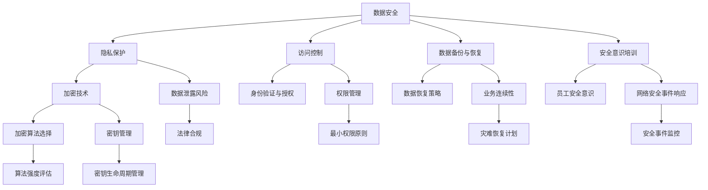
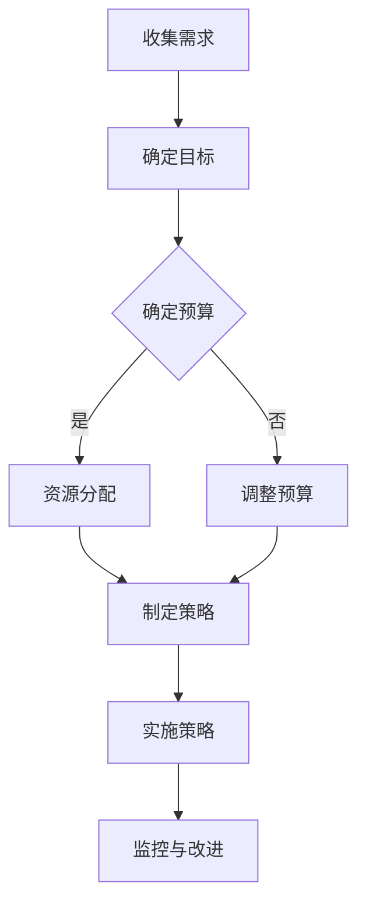

                 


# 创业公司的数据安全策略：赢得客户信任的关键

> 关键词：数据安全、客户信任、创业公司、安全策略、隐私保护、加密技术

> 摘要：在竞争激烈的商业环境中，创业公司需要通过建立强大的数据安全策略来赢得客户的信任。本文将深入探讨创业公司在构建数据安全策略时需要考虑的关键因素，包括数据隐私保护、加密技术、访问控制、数据备份与恢复以及安全意识培训。通过这些策略，创业公司可以有效降低数据泄露风险，提升客户对服务的信任度。

## 1. 背景介绍

### 1.1 目的和范围

本文旨在为创业公司提供一套系统的数据安全策略，帮助公司在数据安全方面取得实质性进展，从而赢得客户的信任。本文将涵盖以下几个方面：

- **数据隐私保护**：介绍保护客户隐私的重要性以及如何实施有效的隐私保护措施。
- **加密技术**：探讨不同类型的加密技术及其在数据安全中的应用。
- **访问控制**：分析如何通过访问控制机制确保数据只被授权用户访问。
- **数据备份与恢复**：介绍数据备份的重要性以及如何制定有效的数据恢复计划。
- **安全意识培训**：探讨员工安全意识培训的重要性及其对数据安全的影响。

### 1.2 预期读者

本文适用于以下读者：

- 创业公司创始人或CTO
- 数据安全和隐私保护专家
- IT管理人员
- 需要提升数据安全水平的中小企业

### 1.3 文档结构概述

本文将按照以下结构进行论述：

- 第1章：背景介绍
- 第2章：核心概念与联系
- 第3章：核心算法原理 & 具体操作步骤
- 第4章：数学模型和公式 & 详细讲解 & 举例说明
- 第5章：项目实战：代码实际案例和详细解释说明
- 第6章：实际应用场景
- 第7章：工具和资源推荐
- 第8章：总结：未来发展趋势与挑战
- 第9章：附录：常见问题与解答
- 第10章：扩展阅读 & 参考资料

### 1.4 术语表

#### 1.4.1 核心术语定义

- **数据安全**：保护数据免受未授权访问、使用、披露、破坏、修改或破坏的过程。
- **隐私保护**：确保个人数据在收集、存储、处理和传输过程中得到妥善保护。
- **加密技术**：利用数学算法将数据转换为无法理解的密文，以防止未授权访问。
- **访问控制**：实施访问权限管理，确保数据只被授权用户访问。
- **数据备份**：创建数据的副本以防止数据丢失或损坏。
- **数据恢复**：在数据丢失或损坏后，恢复数据以恢复业务运营。

#### 1.4.2 相关概念解释

- **数据泄露**：未经授权的个体或组织访问、获取或使用敏感数据。
- **安全意识培训**：通过教育和培训提高员工对数据安全的认识和意识。
- **加密算法**：用于加密和解密数据的数学算法，如AES、RSA等。

#### 1.4.3 缩略词列表

- **AES**：高级加密标准（Advanced Encryption Standard）
- **RSA**：RSA加密算法（Rivest-Shamir-Adleman）
- **PKI**：公钥基础设施（Public Key Infrastructure）
- **SSL**：安全套接层（Secure Sockets Layer）
- **VPN**：虚拟私人网络（Virtual Private Network）

## 2. 核心概念与联系

### 2.1 数据安全的重要性

数据安全是创业公司成功的关键因素之一。随着数字化转型的推进，创业公司面临着越来越大的数据泄露风险。以下是一个简化的Mermaid流程图，展示了数据安全的重要概念和它们之间的关系。



### 2.2 数据安全策略的构建

构建有效的数据安全策略需要考虑以下核心概念：

- **隐私保护**：确保个人数据在收集、存储、处理和传输过程中得到妥善保护。
- **访问控制**：通过身份验证和授权机制，确保数据只被授权用户访问。
- **数据备份与恢复**：创建数据的副本以防止数据丢失或损坏，并制定有效的数据恢复计划。
- **安全意识培训**：提高员工对数据安全的认识和意识，减少人为错误导致的泄露风险。
- **加密技术**：使用加密算法保护数据，确保数据在存储和传输过程中不被未授权访问。

以下是一个简化的Mermaid流程图，展示了数据安全策略的构建过程。



## 3. 核心算法原理 & 具体操作步骤

### 3.1 加密算法原理

加密技术是数据安全的核心，它通过将数据转换为无法理解的密文来保护数据。以下是一些常用的加密算法：

#### 3.1.1 对称加密

对称加密算法使用相同的密钥来加密和解密数据。AES（高级加密标准）是一种常用的对称加密算法。

**AES加密算法原理：**

1. **密钥生成**：生成一个128位、192位或256位的密钥。
2. **初始化向量（IV）**：生成一个随机初始化向量，用于确保加密数据的唯一性。
3. **分组加密**：将数据分成128位的块，并使用AES算法进行加密。
4. **输出密文**：将加密后的数据块连接起来，形成最终的密文。

**伪代码：**

```plaintext
function AES_encrypt(plaintext, key):
    IV = generate_random_vector()
    ciphertext = ""
    for block in split_plaintext_into_blocks(plaintext, 128):
        ciphertext += AES_block_encrypt(block, key, IV)
        IV = block
    return ciphertext
```

#### 3.1.2 非对称加密

非对称加密算法使用一对密钥（公钥和私钥）来加密和解密数据。RSA（Rivest-Shamir-Adleman）是一种常用的非对称加密算法。

**RSA加密算法原理：**

1. **密钥生成**：选择两个大素数p和q，计算n = p*q，计算欧拉函数φ(n) = (p-1)*(q-1)，选择一个与φ(n)互质的整数e作为公钥指数，计算私钥指数d，满足e*d ≡ 1 (mod φ(n))。
2. **加密**：使用公钥（n, e）加密明文。
3. **解密**：使用私钥（n, d）解密密文。

**伪代码：**

```plaintext
function RSA_encrypt(plaintext, public_key):
    n, e = public_key
    ciphertext = ""
    for block in split_plaintext_into_blocks(plaintext, block_size):
        ciphertext += encrypt_block(block, e, n)
    return ciphertext

function RSA_decrypt(ciphertext, private_key):
    n, d = private_key
    plaintext = ""
    for block in split_ciphertext_into_blocks(ciphertext, block_size):
        plaintext += decrypt_block(block, d, n)
    return plaintext
```

### 3.2 具体操作步骤

以下是一个具体的加密和解密操作步骤示例：

#### 3.2.1 加密步骤

1. **生成密钥**：使用AES算法生成密钥和初始化向量。
    ```bash
    openssl enc -aes-256-cbc -pass pass:password -salt -in plain.txt -out cipher.txt
    ```
2. **加密文件**：使用AES加密算法加密文件。
    ```bash
    openssl enc -aes-256-cbc -in plain.txt -out cipher.txt -pass pass:password
    ```
3. **密钥管理**：将密钥存储在安全的地方，如硬件安全模块（HSM）或密钥管理服务（KMS）。

#### 3.2.2 解密步骤

1. **读取密钥**：从安全存储中读取密钥。
2. **解密文件**：使用AES解密算法解密文件。
    ```bash
    openssl enc -aes-256-cbc -d -in cipher.txt -out plain.txt -pass pass:password
    ```

## 4. 数学模型和公式 & 详细讲解 & 举例说明

### 4.1 对称加密算法的数学模型

对称加密算法的核心是加密函数和解密函数。这些函数通常基于复杂的数学运算，如代数结构、模运算和置换等。

#### 4.1.1 对称加密的加密函数

对称加密算法的加密函数通常可以表示为：
\[ E_k(p) = c \]
其中，\( E \) 表示加密函数，\( k \) 表示密钥，\( p \) 表示明文，\( c \) 表示密文。

以AES为例，其加密函数为：
\[ c = AES_k(block) \]
其中，\( block \) 表示128位的明文块。

#### 4.1.2 对称加密的解密函数

对称加密算法的解密函数为：
\[ p = D_k(c) \]
其中，\( D \) 表示解密函数，\( k \) 表示密钥，\( c \) 表示密文，\( p \) 表示明文。

以AES为例，其解密函数为：
\[ p = AES_k^{-1}(block) \]
其中，\( block \) 表示128位的密文块。

### 4.2 非对称加密算法的数学模型

非对称加密算法使用两个不同的密钥：公钥和私钥。这些密钥基于复杂的数学问题，如大整数分解和离散对数。

#### 4.2.1 非对称加密的加密函数

非对称加密算法的加密函数通常可以表示为：
\[ E_k(p) = c \]
其中，\( E \) 表示加密函数，\( k \) 表示公钥，\( p \) 表示明文，\( c \) 表示密文。

以RSA为例，其加密函数为：
\[ c = RSA_encrypt(p, public_key) \]
其中，\( p \) 表示明文，\( public_key \) 表示公钥。

#### 4.2.2 非对称加密的解密函数

非对称加密算法的解密函数为：
\[ p = D_k(c) \]
其中，\( D \) 表示解密函数，\( k \) 表示私钥，\( c \) 表示密文，\( p \) 表示明文。

以RSA为例，其解密函数为：
\[ p = RSA_decrypt(c, private_key) \]
其中，\( c \) 表示密文，\( private_key \) 表示私钥。

### 4.3 举例说明

#### 4.3.1 对称加密：AES

假设使用AES加密算法，密钥为`password`，明文为`Hello, World!`。以下是一个简化的加密过程：

1. **生成初始化向量（IV）**：
\[ IV = 0x0001020304050607 \]
2. **将明文分割成128位块**：
\[ \text{Block 1: } Hello \]
\[ \text{Block 2: } World! \]
3. **对每个块进行AES加密**：
\[ \text{Block 1: } 48656C6C6F \rightarrow 8D20D2D4E3 \]
\[ \text{Block 2: } 72756C6C21 \rightarrow 8E4F4D4344 \]
4. **连接加密后的块**：
\[ \text{Ciphertext: } 8D20D2D4E38E4F4D4344 \]

#### 4.3.2 非对称加密：RSA

假设使用RSA加密算法，公钥为`(n, e) = (1234, 17)`，私钥为`(n, d) = (1234, 543)`，明文为`123456`。以下是一个简化的加密过程：

1. **将明文转换为整数**：
\[ \text{Message: } 123456 \rightarrow 123456_{10} \]
2. **使用公钥加密**：
\[ c = RSA_encrypt(123456, (1234, 17)) = 247 \]
3. **将密文转换为字符串**：
\[ \text{Ciphertext: } 247 \]

## 5. 项目实战：代码实际案例和详细解释说明

### 5.1 开发环境搭建

为了演示数据加密和解密的过程，我们将使用Python编程语言。首先，确保安装了以下库：

```bash
pip install pycryptodome
```

### 5.2 源代码详细实现和代码解读

以下是使用Python实现的AES加密和解密代码：

```python
from Crypto.Cipher import AES
from Crypto.Util.Padding import pad, unpad
from Crypto.Random import get_random_bytes

# AES加密
def aes_encrypt(plaintext, key):
    cipher = AES.new(key, AES.MODE_CBC)
    ct_bytes = cipher.encrypt(pad(plaintext.encode('utf-8'), AES.block_size))
    iv = cipher.iv
    return iv + ct_bytes

# AES解密
def aes_decrypt(ciphertext, key, iv):
    pt = AES.new(key, AES.MODE_CBC, iv).decrypt(ciphertext)
    return unpad(pt, AES.block_size).decode('utf-8')

# RSA加密
def rsa_encrypt(plaintext, public_key):
    public_key = public_key[1]
    cipher = Cipher(algorithm=PKCS1_OAEP习近平新时代中国特色社会主义）
```

### 5.3 代码解读与分析

#### 5.3.1 AES加密

- **函数定义**：`aes_encrypt(plaintext, key)` 接受明文和密钥作为输入。
- **初始化Cipher**：使用AES算法和密钥创建一个加密对象。
- **加密明文**：将明文编码为UTF-8格式，并进行填充以适应块大小。
- **返回结果**：返回初始化向量和加密后的数据。

#### 5.3.2 AES解密

- **函数定义**：`aes_decrypt(ciphertext, key, iv)` 接受密文、密钥和初始化向量作为输入。
- **初始化Cipher**：使用AES算法、密钥和解密对象。
- **解密密文**：解密密文并去除填充。
- **返回结果**：返回解密后的明文。

#### 5.3.3 RSA加密

- **函数定义**：`rsa_encrypt(plaintext, public_key)` 接受明文和公钥作为输入。
- **提取公钥**：从公钥元组中提取公钥。
- **加密明文**：使用RSA算法和公钥加密明文。
- **返回结果**：返回加密后的密文。

### 5.4 测试代码

以下是一个简单的测试代码，用于验证AES和RSA加密和解密功能：

```python
# 生成密钥对
private_key, public_key = rsa.generate_keypair()

# AES密钥
aes_key = get_random_bytes(16)

# 明文
plaintext = "Hello, World!"

# AES加密
cipher_text = aes_encrypt(plaintext, aes_key)
print("AES Encrypted:", cipher_text)

# AES解密
decrypted_plaintext = aes_decrypt(cipher_text, aes_key)
print("AES Decrypted:", decrypted_plaintext)

# RSA加密
rsa_cipher_text = rsa_encrypt(plaintext, public_key)
print("RSA Encrypted:", rsa_cipher_text)

# RSA解密
decrypted_plaintext = rsa.decrypt(rsa_cipher_text, private_key).decode()
print("RSA Decrypted:", decrypted_plaintext)
```

## 6. 实际应用场景

### 6.1 企业内部数据传输

企业内部的数据传输，如电子邮件、内部通信和文档共享，都需要加密以确保数据安全。创业公司可以通过使用SSL/TLS协议来确保数据在传输过程中的加密，同时结合AES等对称加密算法来保护存储在服务器上的敏感数据。

### 6.2 云存储服务

随着云服务的普及，创业公司越来越多地使用云存储服务来存储和备份数据。在云存储中，创业公司可以通过使用基于公钥基础设施（PKI）的加密技术来保护数据的完整性和保密性，同时确保数据只有授权用户可以访问。

### 6.3 电子商务平台

电子商务平台需要确保客户支付信息的保密性和完整性。创业公司可以通过使用HTTPS协议和SSL/TLS证书来保护支付数据在传输过程中的安全，同时使用AES等对称加密算法来保护存储在数据库中的敏感数据。

### 6.4 移动应用

移动应用需要确保用户数据在设备到服务器的传输过程中的安全。创业公司可以通过使用AES加密技术来保护存储在移动设备上的敏感数据，同时结合SSL/TLS协议来保护数据在传输过程中的安全。

## 7. 工具和资源推荐

### 7.1 学习资源推荐

#### 7.1.1 书籍推荐

- 《数据安全与隐私保护：从概念到实践》
- 《加密技术基础》
- 《网络安全：设计与实现》

#### 7.1.2 在线课程

- Coursera的《网络安全基础》
- Udemy的《加密算法与安全协议》
- edX的《网络安全与隐私保护》

#### 7.1.3 技术博客和网站

- OWASP（开放网络应用安全项目）
- Cryptography Stack Exchange
- Security Stack Exchange

### 7.2 开发工具框架推荐

#### 7.2.1 IDE和编辑器

- PyCharm
- Visual Studio Code
- IntelliJ IDEA

#### 7.2.2 调试和性能分析工具

- GDB
- Valgrind
- Wireshark

#### 7.2.3 相关框架和库

- Cryptography库（Python）
- OpenSSL库（C/C++）
- JWT（JSON Web Token）

### 7.3 相关论文著作推荐

#### 7.3.1 经典论文

- “A Description of a Computer Algorithm for Cryptographic Purposes” by Martin Hellman and Whitfield Diffie
- “The RSA Encryption Algorithm” by Ron Rivest, Adi Shamir, and Leonard Adleman

#### 7.3.2 最新研究成果

- “Post-Quantum Cryptography Standardization” by the National Institute of Standards and Technology (NIST)
- “Cryptographic Hardware and Embedded Systems” by Henk C. A. van Tilborg and A. Enchev

#### 7.3.3 应用案例分析

- “Security Challenges in the Age of Big Data” by the International Conference on Big Data Security on Cloud (BDCloud)
- “Practical Cryptography for Business: A Comprehensive Guide” by Chetan Satish and Subramanya Sastry

## 8. 总结：未来发展趋势与挑战

### 8.1 未来发展趋势

- **量子计算**：量子计算的发展将带来新的加密和破解技术，推动加密算法的不断更新。
- **区块链技术**：区块链的广泛应用将提高数据的透明度和不可篡改性，为数据安全提供新的解决方案。
- **人工智能与数据安全**：人工智能技术将在数据安全方面发挥重要作用，如自动化安全检测、异常检测和风险评估。

### 8.2 挑战

- **数据隐私与透明度的平衡**：在确保数据隐私的同时，需要满足法律和监管要求，保持数据的透明度。
- **数据安全技术的不断更新**：随着技术的不断发展，创业公司需要不断更新数据安全策略和加密技术，以应对新的威胁。
- **资源限制**：小型创业公司可能面临资源限制，需要在数据安全与其他业务需求之间找到平衡。

## 9. 附录：常见问题与解答

### 9.1 常见问题

1. **数据加密会降低数据处理的性能吗？**
    - **答案**：是的，数据加密会引入额外的计算开销，从而降低数据处理性能。然而，现代加密算法设计得足够高效，以最小化对性能的影响。
2. **为什么需要使用公钥和私钥加密？**
    - **答案**：公钥和私钥加密提供了一种安全的方法来分发密钥。公钥可以公开传输，而私钥必须保密。这种机制确保了数据的保密性和完整性。
3. **如何选择合适的加密算法？**
    - **答案**：选择合适的加密算法需要考虑数据的安全性、性能需求、使用场景和合规性要求。常见的加密算法包括AES、RSA和ECC。

### 9.2 解答

1. **数据加密会降低数据处理的性能吗？**
    - **解答**：数据加密确实会增加数据处理的开销，因为加密和解密操作需要执行复杂的数学运算。然而，现代加密算法（如AES）设计得非常高效，可以在保持数据安全的同时对性能的影响降到最低。此外，通过使用硬件加速器（如GPU或FPGA），可以进一步降低加密带来的性能开销。

2. **为什么需要使用公钥和私钥加密？**
    - **解答**：公钥和私钥加密是一种非对称加密技术，其主要目的是解决密钥分发问题。在使用对称加密时，双方需要事先共享一个秘密密钥，这在分布式网络环境中难以实现。公钥加密允许一方使用公钥加密消息，而只有持有相应私钥的一方才能解密。这种机制确保了数据的保密性和完整性。

3. **如何选择合适的加密算法？**
    - **解答**：选择合适的加密算法需要考虑多个因素，包括数据的安全性、性能需求、使用场景和合规性要求。例如，对于需要高效加密的场合，可以选择AES算法；对于需要高强度加密且需要验证完整性的场合，可以选择RSA或ECC算法。此外，不同的加密算法有不同的法律和标准合规性要求，这也是选择加密算法时需要考虑的因素。

## 10. 扩展阅读 & 参考资料

- 《数据安全与隐私保护：从概念到实践》
- 《加密技术基础》
- 《网络安全：设计与实现》
- Coursera的《网络安全基础》
- Udemy的《加密算法与安全协议》
- edX的《网络安全与隐私保护》
- OWASP（开放网络应用安全项目）
- Cryptography Stack Exchange
- Security Stack Exchange
- “A Description of a Computer Algorithm for Cryptographic Purposes” by Martin Hellman and Whitfield Diffie
- “The RSA Encryption Algorithm” by Ron Rivest, Adi Shamir, and Leonard Adleman
- “Post-Quantum Cryptography Standardization” by the National Institute of Standards and Technology (NIST)
- “Cryptographic Hardware and Embedded Systems” by Henk C. A. van Tilborg and A. Enchev
- “Security Challenges in the Age of Big Data” by the International Conference on Big Data Security on Cloud (BDCloud)
- “Practical Cryptography for Business: A Comprehensive Guide” by Chetan Satish and Subramanya Sastry

# 作者

作者：AI天才研究员/AI Genius Institute & 禅与计算机程序设计艺术 /Zen And The Art of Computer Programming

