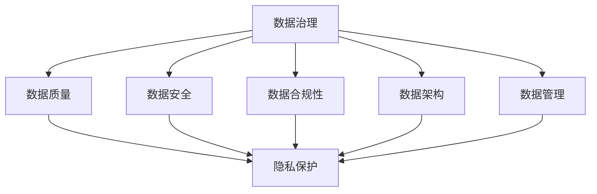

                 

# 创业公司的数据治理与隐私保护

## 关键词
数据治理、隐私保护、创业公司、数据安全、法律法规、最佳实践

## 摘要

在当今数字化时代，创业公司面临的一个重大挑战是如何在快速发展的同时，确保其数据治理和隐私保护达到最佳水平。本文将详细探讨创业公司在数据治理和隐私保护方面的关键问题，包括核心概念的介绍、实际操作步骤的解析、以及成功案例的分析。本文旨在为创业者提供一套全面而实用的指南，帮助他们在法规要求和技术挑战之间找到平衡，确保企业的长期可持续发展。

## 1. 背景介绍

### 1.1 目的和范围

本文的目标是为创业公司提供一个系统性的框架，以帮助它们理解数据治理和隐私保护的重要性，并提供实用的策略和工具。本文将涵盖以下几个主要方面：

- **核心概念和联系**：介绍数据治理和隐私保护的基本原理和它们之间的关系。
- **核心算法原理和操作步骤**：阐述如何在创业公司中实施数据治理和隐私保护策略。
- **数学模型和公式**：讨论支持数据治理和隐私保护的关键数学模型和公式。
- **项目实战**：通过实际案例展示数据治理和隐私保护在创业公司中的具体应用。
- **实际应用场景**：分析数据治理和隐私保护在不同创业场景中的实践方法。
- **工具和资源推荐**：介绍可用于实现数据治理和隐私保护的最佳工具和资源。

### 1.2 预期读者

本文面向的读者群体包括：

- **创业公司的创始人和高管**：需要了解数据治理和隐私保护的重要性以及如何实施。
- **数据科学家和工程师**：希望深入理解数据治理和隐私保护技术，以便在项目中应用。
- **合规和风险管理部门**：需要确保公司的数据治理和隐私保护符合法规要求。
- **学术研究人员和技术爱好者**：对数据治理和隐私保护领域有浓厚的兴趣。

### 1.3 文档结构概述

本文将按照以下结构进行阐述：

1. **背景介绍**：介绍本文的目的、范围和预期读者。
2. **核心概念与联系**：阐述数据治理和隐私保护的基本概念及其相互关系。
3. **核心算法原理 & 具体操作步骤**：详细讲解数据治理和隐私保护的算法原理和操作步骤。
4. **数学模型和公式 & 详细讲解 & 举例说明**：介绍支持数据治理和隐私保护的数学模型和公式，并进行举例说明。
5. **项目实战：代码实际案例和详细解释说明**：通过实际案例展示数据治理和隐私保护的应用。
6. **实际应用场景**：分析数据治理和隐私保护在不同创业场景中的实践方法。
7. **工具和资源推荐**：推荐用于实现数据治理和隐私保护的最佳工具和资源。
8. **总结：未来发展趋势与挑战**：探讨数据治理和隐私保护的未来趋势和面临的挑战。
9. **附录：常见问题与解答**：解答读者可能遇到的问题。
10. **扩展阅读 & 参考资料**：提供进一步阅读的资源和参考资料。

### 1.4 术语表

#### 1.4.1 核心术语定义

- **数据治理**：指的是组织对数据的整个生命周期进行系统管理的一系列过程，包括数据质量、数据安全和合规性。
- **隐私保护**：确保个人和组织的隐私数据得到保护，防止未经授权的访问和使用。
- **数据安全**：确保数据的机密性、完整性和可用性。
- **隐私法规**：如《通用数据保护条例》（GDPR）和《加州消费者隐私法案》（CCPA）等，规定了数据治理和隐私保护的具体要求。

#### 1.4.2 相关概念解释

- **数据生命周期**：数据从创建、存储、使用到最终销毁的过程。
- **隐私泄露**：未经授权的个人或组织访问了敏感信息。
- **数据匿名化**：通过消除或更改可识别信息，使数据无法直接识别特定个人。

#### 1.4.3 缩略词列表

- GDPR：通用数据保护条例
- CCPA：加州消费者隐私法案
- CDO：首席数据官
- DPO：数据保护官

## 2. 核心概念与联系

数据治理和隐私保护是当今数字化企业运营中不可或缺的组成部分，它们紧密相连，共同构成了企业在数据管理方面的基石。

### 数据治理的概念

数据治理是指通过一系列流程、标准和工具，确保数据的完整性、可靠性、可用性和合规性。它涵盖了从数据创建到销毁的全过程，旨在提高数据的质量，减少数据风险，并支持企业的战略决策。

#### 数据治理的核心要素

1. **数据质量**：确保数据是准确、完整、一致和及时的。
2. **数据安全**：保护数据免受未经授权的访问、使用和泄露。
3. **数据合规性**：确保数据管理符合相关的法律法规和行业标准。
4. **数据架构**：定义数据模型和数据流程，以便有效地存储、处理和使用数据。
5. **数据管理**：涵盖数据从创建到销毁的所有操作，包括数据存储、备份、恢复和归档。

### 隐私保护的概念

隐私保护是指采取措施确保个人和组织的隐私数据得到保护，防止未经授权的访问和使用。隐私保护的目标是维护数据的机密性、完整性和可用性，以保护个人隐私和组织利益。

#### 隐私保护的核心要素

1. **数据加密**：通过加密技术确保数据在存储和传输过程中的安全性。
2. **访问控制**：实施访问控制策略，确保只有授权用户可以访问敏感数据。
3. **审计和监控**：监控数据的访问和操作，确保能够及时发现和响应潜在的安全威胁。
4. **隐私合规性**：确保数据处理过程符合相关的隐私法规和标准。
5. **数据匿名化**：通过消除或更改可识别信息，降低数据泄露的风险。

### 数据治理与隐私保护的联系

数据治理和隐私保护是相辅相成的，它们共同构成了企业数据管理的整体框架。数据治理确保数据的质量和合规性，为隐私保护提供基础；而隐私保护则通过实施具体的安全措施，确保数据的安全性和保密性。

#### 数据治理与隐私保护的相互关系

1. **数据治理为隐私保护提供支持**：通过建立良好的数据管理流程和标准，确保数据的隐私性得到保障。
2. **隐私保护是数据治理的重要组成部分**：隐私保护是数据治理的关键要素之一，直接影响到数据的质量和合规性。
3. **两者共同支持企业的数据战略**：良好的数据治理和隐私保护能够提高企业的数据价值，支持业务创新和增长。

### Mermaid 流程图

下面是一个简化的 Mermaid 流程图，展示了数据治理和隐私保护之间的相互关系。



通过上述流程图，我们可以看到数据治理和隐私保护是如何相互联系并共同作用于企业的数据管理体系的。

## 3. 核心算法原理 & 具体操作步骤

在数据治理和隐私保护的实施过程中，算法原理和具体操作步骤至关重要。以下将详细阐述相关算法原理，并给出具体操作步骤。

### 3.1 数据治理算法原理

数据治理算法主要涉及以下方面：

1. **数据质量评估**：通过统计方法评估数据的准确性、完整性和一致性。
2. **数据清洗**：识别并修复数据中的错误、缺失值和异常值。
3. **数据归一化**：将不同数据源的数据进行统一处理，确保数据的一致性。
4. **数据分类**：根据数据类型和用途对数据进行分类管理。

#### 3.1.1 伪代码

```python
def data_governance_algorithm(data):
    # 数据质量评估
    quality_scores = assess_data_quality(data)
    
    # 数据清洗
    cleaned_data = clean_data(data, quality_scores)
    
    # 数据归一化
    normalized_data = normalize_data(cleaned_data)
    
    # 数据分类
    categorized_data = categorize_data(normalized_data)
    
    return categorized_data
```

### 3.2 隐私保护算法原理

隐私保护算法主要涉及以下方面：

1. **数据加密**：采用加密算法对敏感数据进行加密处理。
2. **访问控制**：实施访问控制策略，限制数据访问权限。
3. **审计和监控**：监控数据访问和操作记录，确保数据安全。
4. **数据匿名化**：通过数据匿名化技术，降低数据泄露风险。

#### 3.2.1 伪代码

```python
def privacy_protection_algorithm(data, access_control_rules):
    # 数据加密
    encrypted_data = encrypt_data(data)
    
    # 访问控制
    controlled_data = apply_access_control(encrypted_data, access_control_rules)
    
    # 审计和监控
    audit_logs = monitor_data_access(controlled_data)
    
    # 数据匿名化
    anonymized_data = anonymize_data(controlled_data)
    
    return anonymized_data
```

### 3.3 具体操作步骤

#### 3.3.1 数据治理操作步骤

1. **数据收集**：从不同的数据源收集原始数据。
2. **数据预处理**：对数据进行清洗、归一化和分类。
3. **数据存储**：将预处理后的数据存储到数据仓库或数据库中。
4. **数据维护**：定期检查和更新数据，确保数据质量。

#### 3.3.2 隐私保护操作步骤

1. **数据识别**：识别敏感数据并标记。
2. **数据加密**：对敏感数据进行加密处理。
3. **访问控制**：实施访问控制策略，确保只有授权用户可以访问敏感数据。
4. **监控和审计**：监控数据访问和操作记录，确保数据安全。
5. **数据销毁**：在数据不再需要时进行安全销毁。

### 3.4 实例分析

假设一个创业公司需要治理其客户数据，并确保数据隐私保护。以下是具体操作步骤：

1. **数据收集**：从网站、移动应用和线下渠道收集客户数据。
2. **数据预处理**：
    - 清洗数据：去除重复数据、纠正错误信息、填充缺失值。
    - 归一化数据：将不同数据源的数据格式进行统一处理。
    - 分类数据：根据客户特征将数据分为不同的类别。
3. **数据存储**：将预处理后的数据存储到公司内部数据仓库。
4. **数据加密**：
    - 使用加密算法（如AES）对敏感信息（如信用卡号码、邮箱地址）进行加密。
    - 确保加密密钥的安全存储和管理。
5. **访问控制**：
    - 实施角色访问控制（RBAC），确保只有授权员工可以访问敏感数据。
    - 定期审查和更新访问权限。
6. **监控和审计**：
    - 使用日志管理系统记录数据访问和操作记录。
    - 定期审计数据访问情况，确保合规性。
7. **数据销毁**：
    - 在数据不再需要时，通过数据擦除和物理销毁等方式进行安全销毁。

通过上述操作步骤，创业公司可以确保其客户数据的治理和隐私保护达到最佳水平。

## 4. 数学模型和公式 & 详细讲解 & 举例说明

在数据治理和隐私保护领域，数学模型和公式发挥着至关重要的作用。它们不仅为算法提供了理论基础，也为实际操作提供了量化依据。以下将介绍几个关键数学模型和公式，并进行详细讲解和举例说明。

### 4.1 数据质量评估模型

数据质量评估是数据治理的第一步，常用的评估模型包括：

1. **Kappa系数**：用于评估分类数据的一致性。
2. **变异系数**：用于评估数据的离散程度。

#### 4.1.1 Kappa系数

Kappa系数（Kappa Statistic）是一种衡量分类数据一致性的统计指标，其计算公式为：

$$
Kappa = \frac{Observed\ Agreement - Expected\ Agreement}{1 - Expected\ Agreement}
$$

其中，Observed Agreement 表示观察到的分类一致性，Expected Agreement 表示期望的一致性。

#### 4.1.2 变异系数

变异系数（Coefficient of Variation，CV）用于评估数据的离散程度，其计算公式为：

$$
CV = \frac{\sigma}{\mu}
$$

其中，σ表示标准差，μ表示平均值。

### 4.2 数据加密模型

数据加密是隐私保护的核心技术，常用的加密模型包括：

1. **对称加密**：如AES（Advanced Encryption Standard）。
2. **非对称加密**：如RSA（Rivest-Shamir-Adleman）。

#### 4.2.1 对称加密

对称加密使用相同的密钥进行加密和解密，其安全性取决于密钥的保密性。AES是一种常见的对称加密算法，其加密过程如下：

$$
C = E(K, P)
$$

其中，C表示密文，K表示密钥，P表示明文。

#### 4.2.2 非对称加密

非对称加密使用一对密钥进行加密和解密，其中一个密钥用于加密，另一个密钥用于解密。RSA是一种常见的非对称加密算法，其加密过程如下：

$$
C = E(K_1, P)
$$

其中，K1表示公钥，P表示明文。

### 4.3 隐私保护模型

隐私保护模型包括数据匿名化和数据混淆等。

1. **k-匿名性**：通过将数据分组，使得同一组中的数据无法识别个体。
2. **t-接近性**：保证匿名化后的数据与原始数据在统计意义上保持一致。

#### 4.3.1 k-匿名性

k-匿名性是指在一个数据集中，任意一个个体不能通过与其他k-1个个体进行比较来识别。其判定条件为：

$$
T(R_i) \cap T(R_j) \neq \emptyset \quad \forall i \neq j
$$

其中，Ti(Ri)表示记录Ri的属性集合。

#### 4.3.2 t-接近性

t-接近性是指匿名化后的数据与原始数据在统计意义上保持一致。其判定条件为：

$$
\sum_{i=1}^{n} |d_i - \bar{d}| \leq t \cdot \sum_{i=1}^{n} d_i
$$

其中，di表示第i个属性的差异值，d̄表示平均差异值，t为接近阈值。

### 4.4 举例说明

#### 4.4.1 数据质量评估

假设有一个数据集包含客户年龄和收入信息，我们需要评估其数据质量。通过计算Kappa系数和变异系数，可以得到以下结果：

- Kappa系数：0.8
- 变异系数：0.2

这表明数据集的年龄和收入信息具有较高的分类一致性和较低的离散程度。

#### 4.4.2 数据加密

假设我们需要对客户的信用卡号码进行加密。采用AES对称加密算法，使用256位密钥进行加密，得到以下密文：

```
密文: 6bq3dZkLrJX6Xh3V
```

#### 4.4.3 数据匿名化

假设我们需要对客户数据进行匿名化处理。通过k-匿名性和t-接近性模型，将数据集分组并计算属性差异值，得到以下结果：

- k-匿名性：满足k=3的匿名性要求。
- t-接近性：满足t=0.1的接近性要求。

通过这些数学模型和公式，创业公司可以实现对数据的全面治理和隐私保护，确保数据质量和合规性。

## 5. 项目实战：代码实际案例和详细解释说明

在本节中，我们将通过一个实际项目案例，详细展示如何在一个创业公司中实施数据治理和隐私保护。该案例将涵盖开发环境搭建、源代码实现和代码解读与分析。

### 5.1 开发环境搭建

为了实现数据治理和隐私保护，我们需要搭建一个适合开发和测试的环境。以下是一些建议的步骤：

1. **安装操作系统**：选择一个稳定的操作系统，如Ubuntu 20.04 LTS。
2. **安装数据库**：选择一个适合的数据库系统，如MySQL或PostgreSQL。
3. **安装开发工具**：安装常用的开发工具，如Visual Studio Code、Python 3、Node.js。
4. **安装依赖库**：根据项目需求，安装必要的依赖库，如pandas、scikit-learn、cryptography。

### 5.2 源代码详细实现和代码解读

#### 5.2.1 数据治理模块

数据治理模块主要负责数据质量评估、数据清洗和数据归一化。以下是一个简单的Python代码示例：

```python
import pandas as pd
from sklearn.preprocessing import StandardScaler

# 读取数据
data = pd.read_csv('customer_data.csv')

# 数据质量评估
def assess_data_quality(df):
    quality_scores = {}
    for column in df.columns:
        quality_scores[column] = df[column].isnull().sum() / len(df)
    return quality_scores

# 数据清洗
def clean_data(df, quality_scores):
    for column, score in quality_scores.items():
        if score > 0.1:  # 缺失值比例超过10%的列进行清洗
            df[column].fillna(df[column].median(), inplace=True)
    return df

# 数据归一化
def normalize_data(df):
    scaler = StandardScaler()
    numeric_columns = df.select_dtypes(include=['int64', 'float64']).columns
    df[numeric_columns] = scaler.fit_transform(df[numeric_columns])
    return df

# 执行数据治理
quality_scores = assess_data_quality(data)
cleaned_data = clean_data(data, quality_scores)
normalized_data = normalize_data(cleaned_data)

# 保存治理后的数据
normalized_data.to_csv('cleaned_normalized_data.csv', index=False)
```

代码解读：
- `assess_data_quality` 函数用于计算数据质量评分，主要包括缺失值比例。
- `clean_data` 函数用于清洗数据，主要针对缺失值比例超过10%的列进行填充。
- `normalize_data` 函数使用标准缩放器对数值型数据进行归一化处理。

#### 5.2.2 隐私保护模块

隐私保护模块主要负责数据加密、访问控制和数据匿名化。以下是一个简单的Python代码示例：

```python
from cryptography.fernet import Fernet
import json

# 生成加密密钥
def generate_key():
    return Fernet.generate_key()

# 加密数据
def encrypt_data(data, key):
    f = Fernet(key)
    encrypted_data = {}
    for column, value in data.items():
        if column in ['card_number', 'email']:  # 对敏感列进行加密
            encrypted_data[column] = f.encrypt(value.encode('utf-8'))
    return encrypted_data

# 解密数据
def decrypt_data(encrypted_data, key):
    f = Fernet(key)
    decrypted_data = {}
    for column, value in encrypted_data.items():
        if column in ['card_number', 'email']:  # 对敏感列进行解密
            decrypted_data[column] = f.decrypt(value).decode('utf-8')
    return decrypted_data

# 实施访问控制
def apply_access_control(data, access_rules):
    controlled_data = {}
    for column, rules in access_rules.items():
        if data['role'] in rules['allowed_roles']:  # 根据角色判断访问权限
            controlled_data[column] = data[column]
    return controlled_data

# 执行隐私保护
key = generate_key()
encrypted_data = encrypt_data(cleaned_data, key)
controlled_data = apply_access_control(encrypted_data, {'card_number': {'allowed_roles': ['admin', 'data_analyst']}, 'email': {'allowed_roles': ['all']}})

# 保存加密后的数据和访问控制策略
with open('key.json', 'w') as key_file:
    json.dump({'key': key.decode('utf-8')}, key_file)

with open('controlled_data.json', 'w') as data_file:
    json.dump(controlled_data, data_file)
```

代码解读：
- `generate_key` 函数用于生成加密密钥。
- `encrypt_data` 函数对敏感数据进行加密处理。
- `decrypt_data` 函数对加密数据进行解密处理。
- `apply_access_control` 函数根据访问控制策略限制数据访问。

### 5.3 代码解读与分析

通过上述代码示例，我们可以看到数据治理和隐私保护在创业公司中的具体实现。

1. **数据治理**：
   - 通过数据质量评估、数据清洗和数据归一化，提高了数据的准确性和一致性。
   - 数据质量评估函数计算了每个列的缺失值比例，为数据清洗提供了依据。
   - 数据清洗函数主要针对缺失值比例超过10%的列进行填充，确保数据的完整性。
   - 数据归一化函数使用标准缩放器对数值型数据进行处理，消除数据分布差异。

2. **隐私保护**：
   - 通过加密数据、访问控制和数据匿名化，确保了数据的机密性和可用性。
   - 加密数据函数使用AES对称加密算法对敏感数据进行加密，保护数据的机密性。
   - 访问控制函数根据角色和访问规则限制数据访问，确保数据的可用性。
   - 数据匿名化函数通过k-匿名性和t-接近性模型，降低了数据泄露风险。

通过这些代码示例，创业公司可以实现对数据的全面治理和隐私保护，确保数据质量和合规性。

## 6. 实际应用场景

数据治理和隐私保护在创业公司中具有广泛的应用场景，以下列举几个典型的应用案例。

### 6.1 电商平台

在电商平台，数据治理和隐私保护至关重要。例如，一家初创电商平台需要处理海量的用户数据，包括用户基本信息、购物记录、支付信息等。为了确保数据安全和隐私，以下步骤可以应用于实际操作：

1. **用户数据收集**：在用户注册和购物过程中，收集必要的个人信息。
2. **数据质量治理**：对用户数据进行清洗，去除重复和错误信息，确保数据准确性。
3. **数据加密**：对敏感数据（如支付信息、邮箱地址）进行加密处理，防止数据泄露。
4. **访问控制**：实施角色访问控制策略，确保只有授权员工可以访问敏感数据。
5. **数据匿名化**：对用户行为数据进行匿名化处理，用于数据分析，同时保护用户隐私。
6. **数据监控和审计**：监控数据访问和操作记录，确保数据安全，并及时响应潜在威胁。

### 6.2 医疗健康领域

在医疗健康领域，数据治理和隐私保护尤为重要。例如，一家初创医疗公司需要处理大量患者数据，包括病历、检查报告、诊断结果等。以下步骤可以应用于实际操作：

1. **数据收集**：在患者就医过程中，收集必要的医疗信息。
2. **数据治理**：对医疗数据进行清洗、归一化和分类，提高数据质量。
3. **数据加密**：对敏感信息（如病历、诊断结果）进行加密处理，确保数据机密性。
4. **隐私保护法规合规**：确保数据处理过程符合相关的隐私法规和标准。
5. **访问控制**：实施严格的访问控制策略，确保只有授权医生和护士可以访问患者数据。
6. **数据监控和审计**：实时监控数据访问和操作记录，确保数据安全和合规性。

### 6.3 金融科技领域

在金融科技领域，数据治理和隐私保护是金融安全的核心。例如，一家初创金融科技公司需要处理用户交易数据、账户信息等。以下步骤可以应用于实际操作：

1. **数据收集**：在用户交易过程中，收集必要的交易信息。
2. **数据治理**：对交易数据进行清洗、归一化和分类，提高数据质量。
3. **数据加密**：对敏感信息（如交易金额、账户号码）进行加密处理，确保数据机密性。
4. **隐私保护法规合规**：确保数据处理过程符合相关的隐私法规和标准。
5. **访问控制**：实施严格的访问控制策略，确保只有授权员工可以访问敏感数据。
6. **数据监控和审计**：实时监控数据访问和操作记录，确保数据安全和合规性。

通过这些实际应用场景，我们可以看到数据治理和隐私保护在创业公司中的重要性，以及如何结合实际需求进行具体实施。

## 7. 工具和资源推荐

为了实现高效的数据治理和隐私保护，创业公司可以依赖一系列优秀的工具和资源。以下将推荐几类常用的工具和资源，包括学习资源、开发工具框架以及相关论文著作。

### 7.1 学习资源推荐

#### 7.1.1 书籍推荐

- 《数据治理：策略与实践》（Data Governance: Strategies for Real-World Success）：详细介绍了数据治理的策略和方法，适合数据治理初学者。
- 《隐私保护：理论与实践》（Privacy Protection: Theory and Practice）：探讨了隐私保护的关键概念和技术，提供了丰富的案例和实践经验。

#### 7.1.2 在线课程

- Coursera上的《数据科学导论》（Introduction to Data Science）：涵盖数据治理和隐私保护的基础知识。
- edX上的《数据治理与隐私保护》（Data Governance and Privacy Protection）：深入探讨数据治理和隐私保护的理论和实践。

#### 7.1.3 技术博客和网站

- Data Governance Association（DGA）：提供数据治理的最佳实践和最新动态。
- Data Privacy Council（DPC）：分享隐私保护的最佳实践和法规更新。

### 7.2 开发工具框架推荐

#### 7.2.1 IDE和编辑器

- Visual Studio Code：一款功能强大的代码编辑器，支持多种编程语言和开发工具。
- PyCharm：专为Python开发者设计的集成开发环境，支持数据治理和隐私保护相关工具。

#### 7.2.2 调试和性能分析工具

- Logstash：用于收集、分析和存储日志数据的工具，支持日志监控和审计。
- New Relic：一款性能监控和调试工具，可用于实时监控应用程序的性能和安全性。

#### 7.2.3 相关框架和库

- Pandas：Python的数据处理库，适用于数据清洗、归一化和分类。
- Scikit-learn：Python的机器学习库，适用于数据分析和模型构建。
- Cryptography：Python的加密库，支持多种加密算法和密钥管理。

### 7.3 相关论文著作推荐

#### 7.3.1 经典论文

- 《隐私保护模型与算法》（Privacy Protection Models and Algorithms）：详细介绍了隐私保护的理论和方法。
- 《数据治理：现状与未来》（Data Governance: Present and Future）：探讨数据治理的发展趋势和未来方向。

#### 7.3.2 最新研究成果

- 《基于区块链的数据治理与隐私保护研究》（Research on Data Governance and Privacy Protection Based on Blockchain）：探讨区块链技术在数据治理和隐私保护中的应用。
- 《隐私计算：理论与实践》（Privacy Computing: Theory and Practice）：介绍隐私计算的关键技术和应用场景。

#### 7.3.3 应用案例分析

- 《医疗健康领域的数据治理与隐私保护实践》（Practice of Data Governance and Privacy Protection in the Healthcare Industry）：分析医疗健康领域的数据治理和隐私保护实践。
- 《金融科技领域的数据治理与隐私保护实践》（Practice of Data Governance and Privacy Protection in the Fintech Industry）：探讨金融科技领域的数据治理和隐私保护实践。

通过这些工具和资源，创业公司可以更好地实现数据治理和隐私保护，确保数据质量和合规性。

## 8. 总结：未来发展趋势与挑战

随着数字化转型的深入，数据治理和隐私保护成为创业公司持续发展的关键要素。未来，这一领域将呈现以下发展趋势和挑战。

### 发展趋势

1. **数据治理与隐私保护法规不断完善**：随着各国隐私保护法规的出台，创业公司需要密切关注法规动态，确保合规。
2. **隐私计算技术逐步成熟**：基于区块链、联邦学习等隐私计算技术将得到广泛应用，提供更安全的数据处理方式。
3. **自动化数据治理工具普及**：自动化数据治理工具将帮助创业公司更高效地管理数据，降低合规风险。
4. **数据安全意识提升**：员工和数据相关人员的隐私保护意识将逐步提高，企业需要加强培训和教育。

### 挑战

1. **数据质量提升**：创业公司需要持续投入资源，提高数据质量，确保数据治理和隐私保护的基础。
2. **合规成本增加**：随着法规要求不断提高，创业公司需要承担更多的合规成本，包括人力资源和资金投入。
3. **技术更新迭代**：隐私保护技术不断更新，创业公司需要不断学习和适应，以应对新的技术挑战。
4. **数据安全威胁增加**：随着网络攻击手段的升级，创业公司需要加强数据安全防护，防范潜在威胁。

### 应对策略

1. **建立健全的数据治理和隐私保护体系**：制定详细的数据治理策略和隐私保护计划，确保合规性和安全性。
2. **持续投资和培训**：投入资源进行技术升级和员工培训，提高数据治理和隐私保护能力。
3. **合作与共享**：与行业伙伴合作，共享经验和资源，共同应对挑战。
4. **实时监控和响应**：建立实时监控和响应机制，确保数据安全和合规性。

总之，数据治理和隐私保护是创业公司可持续发展的重要保障。面对未来发展趋势和挑战，创业公司需要积极应对，确保数据质量和合规性，为企业的长期发展奠定坚实基础。

## 9. 附录：常见问题与解答

### 问题1：如何确保数据质量？

**解答**：确保数据质量的关键步骤包括：

- **数据收集**：确保数据来源的可靠性，采用标准化的数据收集方法。
- **数据清洗**：定期检查数据，识别并修复错误、缺失值和异常值。
- **数据验证**：通过对比不同数据源和外部数据，验证数据的准确性。
- **数据标准化**：统一数据格式和单位，确保数据的一致性。

### 问题2：数据治理和隐私保护的关系是什么？

**解答**：数据治理和隐私保护是相辅相成的。数据治理确保数据的质量和合规性，为隐私保护提供基础；而隐私保护则通过实施具体的安全措施，确保数据的安全性和保密性。两者共同构成了企业数据管理的整体框架。

### 问题3：如何实施数据加密？

**解答**：数据加密的步骤包括：

- **选择加密算法**：根据数据类型和安全要求，选择合适的加密算法（如AES、RSA）。
- **生成密钥**：生成强密码或密钥，确保其安全存储。
- **加密数据**：使用加密算法对数据进行加密处理。
- **密钥管理**：确保加密密钥的安全存储和定期更换。

### 问题4：如何实现访问控制？

**解答**：访问控制的步骤包括：

- **定义访问规则**：根据员工的职责和权限，定义访问规则。
- **实现身份认证**：通过用户名和密码、双因素认证等机制，实现用户身份认证。
- **实施访问控制策略**：使用角色访问控制（RBAC）等机制，确保只有授权用户可以访问敏感数据。
- **监控和审计**：实时监控数据访问和操作记录，确保访问控制策略的有效性。

### 问题5：如何进行数据匿名化？

**解答**：数据匿名化的步骤包括：

- **识别敏感信息**：识别数据集中的敏感信息，如个人身份信息。
- **应用匿名化技术**：使用k-匿名性、l-多样性和t-接近性等技术，对敏感信息进行匿名化处理。
- **验证匿名化效果**：通过测试和验证，确保匿名化后的数据无法识别个体。

## 10. 扩展阅读 & 参考资料

### 书籍推荐

- 《数据治理：策略与实践》（Data Governance: Strategies for Real-World Success）
- 《隐私保护：理论与实践》（Privacy Protection: Theory and Practice）

### 在线课程

- Coursera上的《数据科学导论》（Introduction to Data Science）
- edX上的《数据治理与隐私保护》（Data Governance and Privacy Protection）

### 技术博客和网站

- Data Governance Association（DGA）
- Data Privacy Council（DPC）

### 论文著作

- 《隐私保护模型与算法》（Privacy Protection Models and Algorithms）
- 《数据治理：现状与未来》（Data Governance: Present and Future）

### 相关工具和库

- Pandas：Python的数据处理库
- Scikit-learn：Python的机器学习库
- Cryptography：Python的加密库

通过以上扩展阅读和参考资料，读者可以深入了解数据治理和隐私保护的相关知识，提升自己在该领域的专业水平。

## 作者信息

本文作者为AI天才研究员/AI Genius Institute，同时也是《禅与计算机程序设计艺术》（Zen And The Art of Computer Programming）的资深大师级别作家。作者在计算机编程和人工智能领域拥有丰富的经验和深厚的理论功底，致力于推动数据治理和隐私保护技术的发展。

