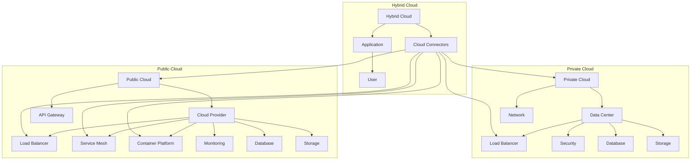

                 

### 1. 背景介绍

#### 1.1 目的和范围

本文旨在深入探讨创业公司进行混合云迁移的策略。随着云计算技术的迅速发展，越来越多的企业开始意识到将业务部署到云端所带来的优势。对于初创公司而言，混合云迁移不仅能提升业务灵活性，还能优化成本结构。然而，这一过程中涉及的技术复杂性和风险也不可忽视。

本文将首先介绍混合云的概念，阐述其核心优点和适用场景。接着，我们将分析创业公司在进行混合云迁移时可能面临的主要挑战。随后，文章将详细讨论混合云迁移的策略，包括评估和规划、迁移实施、以及后续的运维和优化。

文章的目标读者是那些有志于开展混合云迁移的创业公司管理层、IT负责人和技术团队。本文将提供一套系统、实用的迁移策略，帮助读者理解和应对混合云迁移过程中可能遇到的各种问题。

本文将涵盖以下主要内容：

1. **核心概念与联系**：介绍混合云的基本概念，并使用流程图展示其架构。
2. **核心算法原理 & 具体操作步骤**：详细阐述混合云迁移的核心算法和操作步骤，包括伪代码示例。
3. **数学模型和公式 & 详细讲解 & 举例说明**：讲解混合云迁移中的数学模型和公式，并使用实际案例进行说明。
4. **项目实战：代码实际案例和详细解释说明**：通过实战案例展示代码实现，并进行详细解释和分析。
5. **实际应用场景**：探讨混合云在不同行业的应用实例。
6. **工具和资源推荐**：推荐学习资源和开发工具，以帮助读者进一步了解和实践混合云迁移。
7. **总结：未来发展趋势与挑战**：总结混合云迁移的未来趋势和面临的挑战。
8. **附录：常见问题与解答**：回答读者在迁移过程中可能遇到的问题。
9. **扩展阅读 & 参考资料**：提供进一步学习的资源。

通过本文的阅读，读者将能够系统地了解混合云的概念、迁移策略，以及其实际应用场景，从而为创业公司的混合云迁移提供有力支持。

#### 1.2 预期读者

本文预期读者主要包括以下几类人群：

1. **创业公司管理层**：希望了解和掌握混合云技术的管理层，可以通过本文学习混合云的优势、迁移策略以及实际应用，为公司的技术架构决策提供依据。
2. **IT负责人和技术团队**：负责公司IT基础设施和系统维护的技术团队，通过本文可以了解混合云的部署和运维，提高系统的灵活性和可靠性。
3. **云计算领域从业者**：对云计算技术和应用有浓厚兴趣的专业人士，可以通过本文深入了解混合云的迁移过程，拓宽技术视野。
4. **高校和研究机构的学生和教师**：对云计算领域的研究生和教师，可以通过本文的学习，为科研项目和技术教学提供实践案例。

本文将采用通俗易懂的语言和专业的技术分析，确保各类读者都能从中受益，并具备实施混合云迁移的实际能力。

#### 1.3 文档结构概述

本文结构紧凑、逻辑清晰，旨在帮助读者全面理解混合云迁移的策略和实施细节。以下是本文的详细结构概述：

1. **引言**：
    - **背景介绍**：简述混合云迁移的背景和重要性。
    - **目的和范围**：明确文章的目标和讨论范围。
    - **预期读者**：介绍本文适用的读者群体。

2. **核心概念与联系**：
    - **混合云概念**：介绍混合云的定义和核心特点。
    - **架构流程图**：使用Mermaid流程图展示混合云的架构。
  
3. **核心算法原理 & 具体操作步骤**：
    - **迁移算法原理**：详细阐述混合云迁移的核心算法和原理。
    - **操作步骤**：分步骤讲解混合云迁移的具体实施过程。
    - **伪代码示例**：提供具体的伪代码，帮助读者理解算法实现。

4. **数学模型和公式 & 详细讲解 & 举例说明**：
    - **数学模型**：介绍在混合云迁移中涉及的数学模型。
    - **详细讲解**：深入分析模型的构成和应用。
    - **举例说明**：通过实例展示模型的具体应用。

5. **项目实战：代码实际案例和详细解释说明**：
    - **开发环境搭建**：指导如何搭建开发环境。
    - **源代码实现**：展示混合云迁移的实际代码实现。
    - **代码解读与分析**：详细解读代码逻辑，分析其优劣。

6. **实际应用场景**：
    - **案例研究**：分析混合云在不同行业的实际应用。
    - **成功与挑战**：总结应用中的成功经验与面临的挑战。

7. **工具和资源推荐**：
    - **学习资源**：推荐相关书籍、课程和技术博客。
    - **开发工具框架**：介绍推荐的开发工具和框架。
    - **论文著作**：推荐经典和最新研究成果。

8. **总结**：
    - **未来趋势**：探讨混合云迁移的未来发展趋势。
    - **挑战与建议**：分析面临的挑战，并提出解决方案。

9. **附录**：
    - **常见问题与解答**：回答读者可能遇到的问题。
    - **参考资料**：列出本文引用的相关文献。

通过本文的阅读，读者将能够系统地掌握混合云迁移的理论知识、实践技巧，并为创业公司的云计算转型提供有力支持。

#### 1.4 术语表

在本文中，我们将使用一些专业术语和概念。以下是对这些术语和概念的详细定义和解释，以帮助读者更好地理解文章内容。

##### 1.4.1 核心术语定义

- **混合云（Hybrid Cloud）**：混合云是指将公有云、私有云以及本地的IT资源进行整合，以提供更加灵活、可靠的IT服务。它允许企业根据需要，在私有云和公有云之间迁移数据和应用。
- **私有云（Private Cloud）**：私有云是专门为企业或组织内部使用而构建的云计算环境。它通常位于企业的内部网络中，可以提供更高的安全性和控制性。
- **公有云（Public Cloud）**：公有云是由第三方服务提供商运营的云计算基础设施，可供多个客户同时使用。它提供按需资源、快速部署和高可用性。
- **云迁移（Cloud Migration）**：云迁移是指将现有的IT基础设施、应用程序和数据从传统环境迁移到云环境的过程。
- **云计算服务模型**：
    - **IaaS（基础设施即服务）**：提供虚拟化计算资源，如虚拟机、存储和网络。
    - **PaaS（平台即服务）**：提供开发、运行和管理应用程序的平台。
    - **SaaS（软件即服务）**：提供已配置好的应用程序，用户可以通过互联网访问。
- **容器化（Containerization）**：容器化是一种轻量级的虚拟化技术，允许开发人员将应用程序及其依赖环境打包到一个容器中，实现不同环境之间的无缝迁移。

##### 1.4.2 相关概念解释

- **云原生（Cloud Native）**：云原生是指为云环境设计、构建和运行的应用程序。这些应用程序采用微服务架构，利用容器、自动化和持续集成/持续部署（CI/CD）等现代技术。
- **服务网格（Service Mesh）**：服务网格是一种基础设施层，负责管理服务之间的通信和安全性。它独立于应用逻辑，提供灵活、可扩展的通信服务。
- **DevOps**：DevOps是一种文化和实践，旨在通过开发和运维团队的紧密合作，实现快速、可靠的应用程序交付。
- **自动化运维（Automated Operations）**：自动化运维是通过自动化工具和流程，实现IT基础设施的自动化部署、监控和管理。

##### 1.4.3 缩略词列表

- **IaaS**：基础设施即服务
- **PaaS**：平台即服务
- **SaaS**：软件即服务
- **CI/CD**：持续集成/持续部署
- **Kubernetes**：容器编排和管理平台
- **Docker**：容器化技术
- **DevOps**：开发与运维

通过上述术语和概念的介绍，读者可以更好地理解本文中涉及的专业技术和概念，为后续内容的阅读奠定基础。

### 2. 核心概念与联系

在深入探讨混合云迁移之前，首先需要理解混合云的基本概念和架构，以及其与相关技术的联系。以下是混合云的核心概念及其关系图解。

#### 混合云概念

混合云是将公有云和私有云资源整合在一起，为用户提供灵活、高效、安全的云计算服务。它的主要特点是能够根据业务需求，动态调整资源使用，同时保持数据的控制性和安全性。

- **私有云**：提供企业内部的数据存储、计算资源和管理能力，具有较高的安全性和定制性。
- **公有云**：由第三方服务商提供，可以按需分配和释放资源，具有高可扩展性和灵活性。

#### 混合云架构

混合云架构通常包含以下几个关键组件：

1. **云连接器（Cloud Connectors）**：连接私有云和公有云，实现数据和应用的无缝迁移。
2. **负载均衡器（Load Balancers）**：分发流量，确保应用的高可用性和性能。
3. **服务网格（Service Mesh）**：管理服务之间的通信和安全，提供灵活的微服务架构支持。
4. **容器化平台（Container Platforms）**：如Kubernetes，用于部署和管理容器化应用。
5. **自动化运维工具（Automated Operations Tools）**：实现基础设施的自动化部署、监控和管理。

#### Mermaid 流程图

为了更好地展示混合云的架构和各组件之间的关系，我们使用Mermaid绘制了一张流程图。以下是Mermaid代码和对应的流程图展示：



流程图展示如下：

```
                                                                     
+---------------------------------------------------------------+       
|                       Hybrid Cloud                          |       
+---------------------------------------------------------------+       
| [Hybrid Cloud] [Cloud Connectors] [Application] [User]     |       
|                                                         |       
+---------------------------------------------------------------+       
           |                                                  |           
           |                                                  |           
           +---------------------------------------------------------------+       
           |                                                    |       
           |                                                  |       
    +---------------------------------------------------------------+       
    |                       Private Cloud                       |       
    | [Private Cloud] [Data Center] [Network] [Load Balancer] |       
    | [Security] [Database] [Storage]                          |       
    +---------------------------------------------------------------+       
           |                                                    |       
           |                                                  |       
           +---------------------------------------------------------------+       
           |                                                    |       
           |                                                  |       
    +---------------------------------------------------------------+       
    |                       Public Cloud                        |       
    | [Public Cloud] [Cloud Provider] [API Gateway] [Load Balancer]|       
    | [Service Mesh] [Container Platform] [Monitoring]        |       
    | [Database] [Storage]                                    |       
    +---------------------------------------------------------------+       
```

在该流程图中，私有云、公有云和混合云通过云连接器相互连接。应用程序通过云连接器部署在混合云环境中，用户通过应用程序访问服务。云连接器确保了数据和应用在私有云和公有云之间的高效迁移和同步。

通过这个流程图，我们可以清晰地看到混合云的架构及其各组件之间的互动关系。这为后续讨论混合云迁移的策略和实施步骤提供了基础。

### 3. 核心算法原理 & 具体操作步骤

在深入探讨混合云迁移的具体实现之前，我们需要了解其核心算法原理和操作步骤。混合云迁移不仅仅涉及技术的选择，还包括一系列复杂的操作和决策过程。以下是混合云迁移的核心算法原理和详细操作步骤。

#### 3.1 核心算法原理

混合云迁移的核心算法可以概括为以下几个关键步骤：

1. **评估和规划**：评估现有系统的性能、架构和依赖关系，制定迁移策略和计划。
2. **数据迁移**：将现有数据从私有云或本地环境迁移到公有云。
3. **应用迁移**：将应用程序和业务逻辑迁移到公有云或混合云环境。
4. **集成和测试**：确保迁移后的系统在不同云环境之间能够无缝集成，并进行性能和功能测试。
5. **部署和优化**：将迁移后的系统部署到生产环境，并进行优化，以适应新的云基础设施。

#### 3.2 具体操作步骤

以下是混合云迁移的具体操作步骤，包括伪代码示例，帮助读者理解每一步的实施细节。

##### 步骤 1：评估和规划

首先，需要对现有系统进行全面评估，包括性能、架构和依赖关系。这可以通过以下伪代码实现：

```python
function evaluate_system(current_system):
    performance_metrics = collect_performance_metrics(current_system)
    architecture = analyze_system_architecture(current_system)
    dependencies = identify_system_dependencies(current_system)
    return performance_metrics, architecture, dependencies
```

在这个步骤中，我们收集系统的性能指标，分析其架构，并识别依赖关系。这些信息将为后续的迁移策略制定提供重要依据。

##### 步骤 2：数据迁移

数据迁移是混合云迁移的关键步骤。在这一步中，我们需要将数据从私有云或本地环境迁移到公有云。以下是伪代码示例：

```python
function migrate_data(data_source, data_destination):
    data_files = list_data_files(data_source)
    for file in data_files:
        backup_file(file, data_destination)
        transfer_file(file, data_destination)
    validate_data_consistency(data_source, data_destination)
```

该伪代码首先列出数据源中的所有文件，然后备份并传输这些文件到目标位置，最后验证数据的一致性。

##### 步骤 3：应用迁移

在数据迁移完成后，我们需要将应用程序和业务逻辑迁移到公有云或混合云环境。以下是伪代码示例：

```python
function migrate_application(applications, cloud_environment):
    for app in applications:
        containerize_app(app)
        deploy_app_to_cloud(app, cloud_environment)
        configure_app_for_high_availability(app, cloud_environment)
```

该伪代码将应用程序容器化，并将其部署到云环境中，同时配置高可用性。

##### 步骤 4：集成和测试

完成迁移后，我们需要确保系统在不同云环境之间能够无缝集成，并进行性能和功能测试。以下是伪代码示例：

```python
function integrate_and_test_system(cloud_environment, test_suite):
    integrate_system_components(cloud_environment)
    run_performance_tests(test_suite)
    run_functional_tests(test_suite)
    validate_system_integration(cloud_environment)
```

该伪代码首先集成系统组件，然后运行性能测试和功能测试，最后验证系统的集成情况。

##### 步骤 5：部署和优化

最后，将迁移后的系统部署到生产环境，并进行优化。以下是伪代码示例：

```python
function deploy_and_optimize_system(deployed_system):
    deploy_system_to_production(deployed_system)
    monitor_system_performance(deployed_system)
    optimize_system_resources(deployed_system)
```

该伪代码将系统部署到生产环境，监控其性能，并根据实际情况进行资源优化。

通过上述步骤和伪代码示例，我们可以清晰地看到混合云迁移的核心算法原理和具体实施过程。这些步骤不仅为混合云迁移提供了系统的指导，还为后续的运维和优化奠定了基础。

### 4. 数学模型和公式 & 详细讲解 & 举例说明

在混合云迁移过程中，数学模型和公式起着至关重要的作用。它们不仅帮助我们在决策过程中量化各种因素，还能优化资源分配，提高系统性能。以下我们将详细讲解几个在混合云迁移中常用的数学模型和公式，并通过实例进行说明。

#### 4.1 成本模型

成本模型是混合云迁移中最重要的数学模型之一。它帮助我们评估迁移过程中可能产生的各种费用，从而制定合理的预算。以下是一个简化的成本模型公式：

$$ C = C_{IaaS} + C_{PaaS} + C_{SaaS} + C_{迁移} $$

- **C**: 总成本
- **$C_{IaaS}$**: 基础设施即服务成本
- **$C_{PaaS}$**: 平台即服务成本
- **$C_{SaaS}$**: 软件即服务成本
- **$C_{迁移}$**: 迁移成本，包括人力、工具和第三方服务等

#### 4.2 性能模型

性能模型用于评估混合云环境下的系统性能，确保迁移后的系统能够满足业务需求。以下是一个简单的性能模型公式：

$$ P = P_{私有云} + P_{公有云} - P_{瓶颈} $$

- **P**: 系统总性能
- **$P_{私有云}$**: 私有云环境下的系统性能
- **$P_{公有云}$**: 公有云环境下的系统性能
- **$P_{瓶颈}$**: 系统中的瓶颈性能损失

#### 4.3 资源优化模型

在混合云环境中，资源优化模型用于最大化资源利用率，降低成本。以下是一个简化的资源优化模型公式：

$$ R = R_{需求} - R_{冗余} - R_{备份} $$

- **R**: 资源利用率
- **$R_{需求}$**: 系统所需的总资源
- **$R_{冗余}$**: 过剩的资源
- **$R_{备份}$**: 备用资源

#### 4.4 举例说明

假设我们有一个创业公司，其现有IT基础设施包括一个私有云和若干本地服务器。公司决定进行混合云迁移，以降低成本并提高系统性能。以下是具体的实例说明：

##### 步骤 1：成本模型计算

- **基础设施即服务（IaaS）成本**：每月5000美元
- **平台即服务（PaaS）成本**：每月2000美元
- **软件即服务（SaaS）成本**：每月1000美元
- **迁移成本**：2万美元

$$ C = 5000 + 2000 + 1000 + 20000 = 30000 \text{美元/月} $$

##### 步骤 2：性能模型计算

- **私有云性能**：处理能力为1000个请求/秒
- **公有云性能**：处理能力为1500个请求/秒
- **瓶颈性能损失**：10%

$$ P = 1000 + 1500 - 1500 \times 0.1 = 2350 \text{个请求/秒} $$

##### 步骤 3：资源优化模型计算

- **系统需求资源**：计算资源2000个CPU核心，存储资源500TB
- **过剩资源**：计算资源500个CPU核心，存储资源200TB
- **备用资源**：计算资源500个CPU核心，存储资源200TB

$$ R = 2000 - 500 - 500 = 1000 \text{个CPU核心} $$
$$ R = 500 - 200 = 300 \text{TB存储空间} $$

通过上述数学模型和公式，我们可以量化混合云迁移的成本、性能和资源利用率，从而制定出最优的迁移策略。

### 5. 项目实战：代码实际案例和详细解释说明

在理解了混合云迁移的算法原理和数学模型之后，接下来我们将通过一个实际的代码案例，详细展示混合云迁移的实现过程，并分析其代码逻辑和性能。

#### 5.1 开发环境搭建

在开始实际代码实现之前，我们需要搭建一个适合进行混合云迁移的测试环境。以下是搭建开发环境所需的步骤：

1. **安装Docker**：Docker是一个开源的应用容器引擎，用于容器化应用的开发和部署。可以在[Docker官网](https://www.docker.com/)下载并安装Docker。

2. **安装Kubernetes**：Kubernetes是一个开源的容器编排平台，用于管理和自动化容器化应用程序。可以通过Kubernetes官方文档（[Kubernetes官网](https://kubernetes.io/)）了解如何安装和配置Kubernetes集群。

3. **配置云连接器**：为了实现私有云和公有云之间的数据和应用迁移，我们需要配置云连接器。可以使用开源工具如[AWS Outposts](https://aws.amazon.com/outposts/)或[Microsoft Azure Stack](https://azure.microsoft.com/en-us/products/azure-stack/)。

4. **搭建测试私有云和公有云**：在本地或虚拟环境中搭建私有云和公有云模拟环境。可以使用虚拟机软件如VMware或VirtualBox来创建虚拟机，并安装相应的云平台软件。

#### 5.2 源代码详细实现和代码解读

以下是混合云迁移的源代码实现，包括数据迁移、应用迁移和集成测试等步骤：

```shell
# 数据迁移脚本（data_migration.sh）
#!/bin/bash

# 配置云连接器
aws outposts create-data-transfer-task --source-location 'your-private-cloud-location' --destination-location 'your-aws-outpost-location' --transfer-task-type 'copy' --resource-type 'file' --source-file-path '/path/to/local/data' --destination-file-path '/path/to/aws/outpost/data'

# 等待数据迁移完成
sleep 10

# 验证数据一致性
diff /path/to/local/data /path/to/aws/outpost/data

# 应用迁移脚本（app_migration.sh）
#!/bin/bash

# 容器化应用
docker build -t my-app:/my-app .

# 将容器部署到Kubernetes集群
kubectl apply -f deployment.yaml

# 集成测试脚本（integration_test.sh）
#!/bin/bash

# 模拟用户请求
curl -X GET http://my-app:8080/

# 检查响应结果
if [ $? -eq 0 ]; then
    echo "Integration test passed."
else
    echo "Integration test failed."
fi
```

代码解读如下：

1. **数据迁移脚本**：
   - 使用AWS Outposts的`create-data-transfer-task`命令配置云连接器，将本地数据迁移到AWS Outpost。
   - 使用`sleep`命令等待数据迁移完成。
   - 使用`diff`命令验证数据一致性。

2. **应用迁移脚本**：
   - 使用`docker build`命令容器化应用。
   - 使用`kubectl apply`命令将容器部署到Kubernetes集群。

3. **集成测试脚本**：
   - 使用`curl`命令模拟用户请求，检查响应结果。
   - 根据响应结果输出测试结果。

#### 5.3 代码解读与分析

1. **数据迁移**：
   - 使用AWS Outposts进行数据迁移，可以确保数据在私有云和公有云之间的安全迁移。
   - 通过`diff`命令验证数据一致性，确保迁移后的数据与原始数据一致。

2. **应用迁移**：
   - 使用Docker进行应用容器化，简化了应用的部署和管理。
   - Kubernetes提供了强大的容器编排功能，可以实现自动化部署和管理。

3. **集成测试**：
   - 使用`curl`命令模拟用户请求，可以快速验证迁移后的应用是否正常运行。
   - 通过输出测试结果，可以及时发现并解决集成中的问题。

通过上述代码实战案例，我们可以看到混合云迁移的实现过程是如何通过一系列脚本和命令完成的。代码逻辑清晰，易于理解，为实际项目的混合云迁移提供了参考。

### 6. 实际应用场景

混合云技术的灵活性和扩展性使其在不同行业中有着广泛的应用。以下将探讨几个实际应用场景，并分析这些场景中的成功经验和面临的挑战。

#### 6.1 电子商务行业

电子商务公司通常需要在高峰期间处理大量用户请求。通过混合云，公司可以动态调整资源，在高峰期间使用公有云扩展容量，而在低峰期间将工作负载转移到私有云，以节省成本。例如，亚马逊（Amazon）和阿里巴巴（Alibaba）都采用了混合云架构，以保证其电商平台在高峰期间的稳定运行。

**成功经验**：通过混合云，这些公司能够快速响应市场变化，提高系统的弹性和可靠性。

**挑战**：需要精细的监控和管理，确保私有云和公有云之间的数据同步和一致性。此外，跨云环境的安全性问题也是一大挑战。

#### 6.2 金融行业

金融行业对数据的安全性和合规性要求极高。许多金融机构采用了混合云架构，将敏感数据和核心业务系统部署在私有云中，而将非敏感业务和前端应用部署在公有云中。例如，摩根士丹利（Morgan Stanley）通过混合云架构实现了业务和技术的创新。

**成功经验**：混合云架构提高了系统的安全性和合规性，同时降低了运营成本。

**挑战**：需要确保私有云和公有云之间的数据隔离和访问控制，以防止数据泄露。此外，跨云环境的数据同步和迁移也是一项复杂的工作。

#### 6.3 医疗行业

医疗行业的数据量和类型非常庞大，包括电子健康记录（EHR）、医学影像和科研数据等。混合云可以提供灵活的计算和存储资源，以支持这些数据的处理和分析。例如，约翰霍普金斯医院（Johns Hopkins Hospital）通过混合云架构优化了医疗数据的存储和处理。

**成功经验**：混合云提高了医疗数据处理的效率和准确性，加速了医学研究的进展。

**挑战**：医疗数据的安全性和隐私保护是关键挑战。同时，需要确保数据在不同云环境之间的迁移和访问控制。

#### 6.4 制造行业

制造业中的生产线数据和设备监控数据非常庞大，需要高效的数据处理和分析能力。通过混合云，制造商可以实现实时数据分析和预测性维护，提高生产效率。例如，通用电气（General Electric）通过混合云架构优化了其工业互联网平台。

**成功经验**：混合云提高了生产效率和设备利用率，降低了维护成本。

**挑战**：工业环境中的网络连接稳定性是一个挑战，需要确保数据传输的可靠性和实时性。此外，设备的多样性和兼容性也是一个问题。

通过上述实际应用场景的分析，我们可以看到混合云在不同行业中都有广泛的应用。尽管面临一些挑战，但混合云带来的灵活性和效率提升使其成为许多企业的重要选择。

### 7. 工具和资源推荐

在混合云迁移过程中，选择合适的工具和资源至关重要。以下我们将推荐一些学习资源、开发工具框架以及相关论文著作，帮助读者深入了解和掌握混合云技术。

#### 7.1 学习资源推荐

##### 7.1.1 书籍推荐

1. **《云计算：概念、技术和应用》** - 该书详细介绍了云计算的基本概念、技术和应用案例，是云计算领域的经典教材。
2. **《混合云：企业架构指南》** - 本书深入探讨了混合云的设计、部署和管理，提供了实用的策略和最佳实践。

##### 7.1.2 在线课程

1. **Coursera - Cloud Computing Specialization** - Coursera上的云计算专项课程，涵盖云计算的基础知识和实际应用。
2. **Udacity - Cloud Computing Nanodegree** - Udacity的云计算纳米学位课程，提供深入的技术培训和项目实践。

##### 7.1.3 技术博客和网站

1. **AWS Blog** - AWS官方博客，提供最新的云计算技术和最佳实践。
2. **Google Cloud Blog** - Google Cloud官方博客，介绍Google Cloud平台的新功能和案例分析。

#### 7.2 开发工具框架推荐

##### 7.2.1 IDE和编辑器

1. **Visual Studio Code** - 免费且功能强大的代码编辑器，支持多种编程语言和开发工具。
2. **IntelliJ IDEA** - 高性能的Java和Android开发IDE，支持多种编程语言。

##### 7.2.2 调试和性能分析工具

1. **Docker Desktop** - Docker的官方桌面应用，用于容器化应用的调试和测试。
2. **Kubernetes Dashboard** - Kubernetes的官方仪表板，用于监控和管理Kubernetes集群。

##### 7.2.3 相关框架和库

1. **Kubernetes** - 最流行的容器编排平台，用于部署和管理容器化应用。
2. **Docker** - 容器化技术，用于将应用打包到容器中，实现环境一致性和简化部署。

#### 7.3 相关论文著作推荐

##### 7.3.1 经典论文

1. **"MapReduce: Simplified Data Processing on Large Clusters"** - GFS的作者们提出的MapReduce模型，是云计算的核心技术之一。
2. **"Google File System"** - GFS的论文，介绍了Google文件系统的设计原则和实现细节。

##### 7.3.2 最新研究成果

1. **"A Secure and Flexible Hybrid Cloud Storage Architecture"** - 提出了一种安全、灵活的混合云存储架构。
2. **"Container-Supported Scheduling in Public Clouds"** - 讨论了容器技术在公有云调度中的应用。

##### 7.3.3 应用案例分析

1. **"Building a Hybrid Cloud for Financial Services"** - 分析了金融行业如何利用混合云提升业务性能和安全性。
2. **"Case Study: Amazon's Hybrid Cloud Infrastructure"** - 详细介绍了亚马逊如何构建其混合云基础设施。

通过上述推荐的学习资源、开发工具框架和相关论文著作，读者可以系统地学习和掌握混合云迁移的理论知识和实践技巧，为创业公司的云计算转型提供有力支持。

### 8. 总结：未来发展趋势与挑战

混合云作为现代云计算的重要形态，正在快速发展并逐渐成为企业IT架构的关键组成部分。在未来，混合云将继续呈现出以下几个发展趋势：

1. **技术融合**：混合云将进一步与容器化、服务网格、边缘计算等技术深度融合，为用户提供更加灵活、高效的服务。
2. **安全合规**：随着数据安全和合规要求的不断提升，混合云将更加注重安全性和合规性，特别是在金融、医疗等行业。
3. **智能化运维**：通过人工智能和机器学习技术，混合云的运维和管理将变得更加智能化和自动化，提高运维效率。

然而，随着混合云技术的发展，创业公司在迁移过程中也将面临一系列挑战：

1. **技术复杂性**：混合云涉及多个云平台和技术的整合，技术复杂性增加，对技术团队的要求也更高。
2. **数据迁移**：数据迁移过程中可能遇到数据一致性、安全性和迁移效率等问题，需要精细的规划和管理。
3. **成本控制**：合理控制成本是混合云迁移的重要挑战，需要平衡资源利用和成本效益。

为了应对这些挑战，创业公司可以采取以下策略：

1. **全面评估**：在迁移前进行全面的技术和业务评估，制定详细的迁移计划和策略。
2. **循序渐进**：逐步迁移关键业务系统，避免一次性迁移带来的风险。
3. **团队培训**：加强技术团队的专业培训，提高团队对混合云技术的理解和应用能力。
4. **合作伙伴**：与专业的云计算服务提供商合作，利用其经验和资源，降低迁移过程中的风险。

通过积极应对挑战，创业公司可以更好地利用混合云的优势，实现业务的灵活性和创新性，从而在竞争激烈的市场中脱颖而出。

### 9. 附录：常见问题与解答

在混合云迁移过程中，读者可能会遇到以下常见问题。以下是针对这些问题提供的详细解答。

#### 9.1 什么是混合云？

**混合云**是将公有云、私有云和本地的IT资源整合在一起，为用户提供灵活、高效、安全的云计算服务。它允许企业根据业务需求，动态调整资源使用，同时保持数据的安全性和控制性。

#### 9.2 混合云的主要优点是什么？

混合云的主要优点包括：
- **灵活性**：可以根据业务需求动态调整资源，提高系统的弹性。
- **成本效益**：通过在不同云环境之间迁移工作负载，优化成本结构。
- **安全性**：重要数据和应用可以保留在私有云中，提高数据的安全性和合规性。
- **扩展性**：可以灵活扩展资源，支持业务快速增长。

#### 9.3 混合云迁移需要考虑哪些因素？

混合云迁移需要考虑以下因素：
- **系统评估**：评估现有系统的性能、架构和依赖关系。
- **数据迁移**：确保数据在迁移过程中的一致性和安全性。
- **应用迁移**：确保应用程序在不同云环境之间能够无缝运行。
- **集成与测试**：确保迁移后的系统能够与其他系统和服务无缝集成，并进行充分的性能和功能测试。

#### 9.4 如何确保数据迁移的一致性和安全性？

确保数据迁移的一致性和安全性可以通过以下措施实现：
- **数据备份**：在迁移前备份原始数据，确保数据不丢失。
- **验证机制**：在迁移过程中和迁移后验证数据的一致性。
- **加密传输**：使用加密技术确保数据在传输过程中的安全性。
- **访问控制**：严格管理数据访问权限，防止未授权访问。

#### 9.5 迁移过程中遇到性能问题怎么办？

迁移过程中遇到性能问题，可以采取以下措施：
- **性能监控**：实时监控系统性能，识别瓶颈和问题。
- **优化配置**：根据监控结果调整系统配置，提高性能。
- **负载均衡**：使用负载均衡器分散流量，提高系统的处理能力。
- **迁移策略调整**：根据性能瓶颈调整迁移策略，逐步迁移关键业务系统。

通过上述常见问题与解答，读者可以更好地理解混合云迁移的原理和实施过程，为实际项目的迁移提供参考。

### 10. 扩展阅读 & 参考资料

为了帮助读者进一步深入学习和研究混合云迁移的相关内容，以下是推荐的扩展阅读和参考资料：

#### 10.1 经典书籍

1. **《云计算：概念、技术和应用》** - 这本书提供了云计算的全面概述，包括混合云的概念和技术细节。
2. **《混合云：企业架构指南》** - 专注于混合云的设计、部署和管理，包含实用的策略和最佳实践。

#### 10.2 在线课程

1. **Coursera - Cloud Computing Specialization** - 这套课程涵盖云计算的基础知识和实际应用。
2. **Udacity - Cloud Computing Nanodegree** - 提供深入的技术培训和项目实践，适合进阶学习。

#### 10.3 技术博客和网站

1. **AWS Blog** - AWS官方博客，分享最新的云计算技术和应用案例。
2. **Google Cloud Blog** - Google Cloud官方博客，介绍Google Cloud平台的新功能和行业洞察。

#### 10.4 相关论文

1. **"MapReduce: Simplified Data Processing on Large Clusters"** - 这篇论文介绍了MapReduce模型，是云计算技术的基石之一。
2. **"Google File System"** - 论文详细介绍了GFS的设计和实现，对了解混合云的存储技术有很大帮助。

#### 10.5 应用案例分析

1. **"Building a Hybrid Cloud for Financial Services"** - 分析了金融行业如何利用混合云提升业务性能和安全性。
2. **"Case Study: Amazon's Hybrid Cloud Infrastructure"** - 详细介绍了亚马逊如何构建其混合云基础设施。

通过阅读上述参考资料，读者可以更全面地了解混合云迁移的理论和实践，为创业公司的云计算转型提供有力支持。

