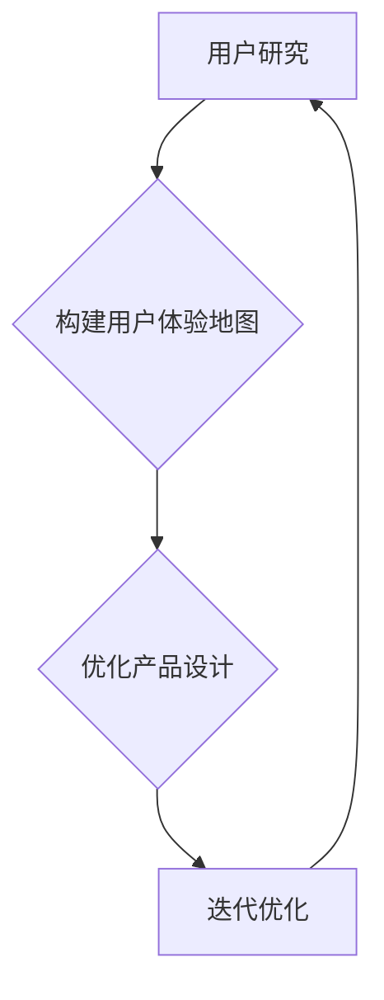

                 

# 创业公司的用户体验地图设计与应用

> **关键词：**用户体验地图，用户研究，产品设计，用户体验提升，创业公司
>
> **摘要：**本文将探讨用户体验地图在创业公司中的应用，从核心概念、算法原理到具体实施步骤，深入分析用户体验地图的设计与优化，以帮助创业公司提升产品竞争力，改善用户满意度。

## 1. 背景介绍

### 1.1 目的和范围

本文旨在为创业公司提供用户体验地图的设计与应用指南。通过介绍用户体验地图的核心概念、构建方法和实际应用，本文将帮助创业公司更好地理解用户需求，优化产品设计，提升用户体验。

### 1.2 预期读者

本指南适用于创业公司产品经理、用户体验设计师、前端开发工程师和市场营销人员。通过本文，读者可以了解用户体验地图的设计原则和实践方法，从而提升自身在产品设计和管理方面的能力。

### 1.3 文档结构概述

本文分为十个部分，包括背景介绍、核心概念与联系、核心算法原理与具体操作步骤、数学模型和公式讲解、项目实战、实际应用场景、工具和资源推荐、总结、常见问题与解答以及扩展阅读和参考资料。

### 1.4 术语表

#### 1.4.1 核心术语定义

- **用户体验地图（User Experience Map）**：一种用于描述用户在使用产品过程中的情感、行为和认知状态的视觉化工具。
- **用户研究（User Research）**：通过对用户进行观察、访谈、问卷调查等方法，收集用户需求和反馈，以指导产品设计和优化。
- **产品设计（Product Design）**：结合用户需求和市场趋势，创建满足用户期望的产品方案。
- **用户体验提升（User Experience Improvement）**：通过优化产品设计、交互和功能，提高用户在使用产品过程中的满意度。

#### 1.4.2 相关概念解释

- **用户画像（User Persona）**：基于用户调研结果，创建的一种代表目标用户群体的虚拟角色。
- **用户体验度量（User Experience Metrics）**：用于量化用户在使用产品过程中的满意度、效率和情感状态等指标。

#### 1.4.3 缩略词列表

- **UX**：用户体验（User Experience）
- **UI**：用户界面（User Interface）
- **A/B测试**：对比测试（A/B Test）
- **MVP**：最小可行产品（Minimum Viable Product）

## 2. 核心概念与联系

在创业公司的产品设计中，用户体验地图是连接用户研究和产品设计的桥梁。它不仅帮助团队理解用户需求，还能指导产品的优化和迭代。

### 2.1 用户研究

用户研究是构建用户体验地图的基础。通过以下方法，我们可以获取有关用户需求、行为和情感状态的信息：

- **问卷调查**：设计简明扼要的问卷，收集用户对产品功能的看法和使用习惯。
- **用户访谈**：与用户进行深入交流，了解他们的真实体验和需求。
- **行为分析**：通过分析用户在产品中的操作路径和停留时间，发现潜在问题和优化机会。
- **用户测试**：邀请用户参与产品测试，收集他们对产品设计和功能的反馈。

### 2.2 用户体验地图

用户体验地图是一种可视化工具，用于描述用户在使用产品过程中的情感、行为和认知状态。它通常包括以下部分：

- **用户旅程**：展示用户在产品中的操作路径和交互行为。
- **情感曲线**：记录用户在关键节点上的情感状态，如兴奋、满意、疑惑等。
- **反馈与需求**：收集用户对产品的反馈和需求，为产品设计提供参考。

### 2.3 产品设计

基于用户体验地图，创业公司可以优化产品设计，提升用户体验。以下方法可以帮助团队实现这一目标：

- **迭代优化**：根据用户反馈和需求，对产品设计进行持续迭代和优化。
- **A/B测试**：通过对比测试，验证不同设计方案的优劣，选择最佳方案。
- **用户画像**：创建用户画像，帮助团队更好地理解用户需求和偏好。

### 2.4 用户研究 - 用户体验地图 - 产品设计

用户研究、用户体验地图和产品设计之间存在着紧密的联系。用户研究为用户体验地图提供数据支持，而用户体验地图则指导产品设计的优化和迭代。通过不断循环这一过程，创业公司可以不断提升产品的用户体验。

### 2.5 Mermaid 流程图

以下是一个简单的 Mermaid 流程图，用于描述用户研究、用户体验地图和产品设计的流程。



## 3. 核心算法原理 & 具体操作步骤

用户体验地图的设计和构建需要基于用户研究和数据。以下是一个简单的算法原理和操作步骤，用于构建用户体验地图：

### 3.1 算法原理

- **数据收集**：通过问卷调查、用户访谈、行为分析等方法，收集用户需求和行为数据。
- **数据整理**：对收集到的数据进行分析和整理，提取关键信息和用户痛点。
- **构建用户旅程**：基于用户数据，构建用户在产品中的操作路径和交互行为。
- **情感曲线**：在用户旅程的关键节点上，标注用户的情感状态，如兴奋、满意、疑惑等。
- **反馈与需求**：收集用户对产品的反馈和需求，为产品设计提供参考。

### 3.2 具体操作步骤

1. **数据收集**
   - 设计问卷调查，收集用户对产品功能的看法和使用习惯。
   - 进行用户访谈，了解用户对产品的真实体验和需求。
   - 使用行为分析工具，分析用户在产品中的操作路径和停留时间。

2. **数据整理**
   - 对收集到的数据进行分析，提取关键信息和用户痛点。
   - 整理用户访谈和问卷调查的结果，形成用户需求和行为报告。

3. **构建用户旅程**
   - 根据用户数据，构建用户在产品中的操作路径和交互行为。
   - 将用户旅程可视化，使用图表或流程图展示用户在产品中的行为模式。

4. **情感曲线**
   - 在用户旅程的关键节点上，标注用户的情感状态，如兴奋、满意、疑惑等。
   - 使用情感曲线展示用户在关键节点上的情感变化。

5. **反馈与需求**
   - 收集用户对产品的反馈和需求，为产品设计提供参考。
   - 分析用户反馈，找出产品设计和功能中的问题和改进点。

### 3.3 伪代码

以下是一个简单的伪代码，用于描述用户体验地图的构建过程：

```python
# 数据收集
user_data = collect_user_data()

# 数据整理
user需求和痛点 = analyze_user_data(user_data)

# 构建用户旅程
user_journey = construct_user_journey(user_data)

# 情感曲线
emotion_curve = construct_emotion_curve(user_journey)

# 反馈与需求
user_feedback = collect_user_feedback()
user需求和痛点 = analyze_user_feedback(user_feedback)

# 构建用户体验地图
user_experience_map = construct_user_experience_map(user_journey, emotion_curve, user_feedback)
```

## 4. 数学模型和公式 & 详细讲解 & 举例说明

用户体验地图的设计和构建过程中，我们可以使用一些数学模型和公式来量化用户需求和情感状态，从而更准确地指导产品优化。

### 4.1 用户满意度模型

用户满意度是衡量用户体验的重要指标。以下是一个简单的用户满意度模型：

$$
S = \frac{E - P + U}{3}
$$

其中：
- \( S \) 表示用户满意度（User Satisfaction）；
- \( E \) 表示用户期望（User Expectation）；
- \( P \) 表示实际绩效（Performance）；
- \( U \) 表示用户效用（User Utility）。

### 4.2 情感曲线拟合

情感曲线用于描述用户在关键节点上的情感状态。我们可以使用线性回归模型来拟合情感曲线：

$$
y = ax + b
$$

其中：
- \( y \) 表示情感值（Emotion Value）；
- \( x \) 表示关键节点（Key Point）；
- \( a \) 和 \( b \) 分别为线性回归模型的斜率和截距。

### 4.3 举例说明

假设我们收集到以下用户数据：

- 用户期望： \( E = 4 \)；
- 实际绩效： \( P = 3 \)；
- 用户效用： \( U = 5 \)。

根据用户满意度模型，我们可以计算出用户满意度：

$$
S = \frac{4 - 3 + 5}{3} = \frac{6}{3} = 2
$$

因此，用户满意度为2。

假设我们收集到以下关键节点和情感值：

- 关键节点1： \( x_1 = 1 \)，情感值： \( y_1 = 2 \)；
- 关键节点2： \( x_2 = 2 \)，情感值： \( y_2 = 3 \)；
- 关键节点3： \( x_3 = 3 \)，情感值： \( y_3 = 1 \)。

我们可以使用线性回归模型来拟合情感曲线：

$$
y = ax + b
$$

将关键节点和情感值代入模型，得到以下方程组：

$$
\begin{cases}
2 = a \cdot 1 + b \\
3 = a \cdot 2 + b \\
1 = a \cdot 3 + b
\end{cases}
$$

解方程组，得到：

$$
\begin{cases}
a = 1 \\
b = 1
\end{cases}
$$

因此，拟合后的情感曲线为：

$$
y = x + 1
$$

## 5. 项目实战：代码实际案例和详细解释说明

在本节中，我们将通过一个实际项目案例，详细讲解用户体验地图的设计与构建过程。该项目是一个简单的在线购物平台，我们将使用 Python 和相关库来实现用户体验地图。

### 5.1 开发环境搭建

在开始项目之前，我们需要搭建开发环境。以下步骤用于安装 Python 和相关库：

1. 安装 Python 3.8 或更高版本：从 [Python 官网](https://www.python.org/) 下载并安装 Python。
2. 打开终端（Windows：CMD；macOS/Linux：Terminal），执行以下命令安装相关库：

```bash
pip install matplotlib pandas numpy
```

### 5.2 源代码详细实现和代码解读

#### 5.2.1 数据收集

首先，我们需要收集用户数据。以下代码用于生成示例用户数据：

```python
import pandas as pd

# 用户数据
user_data = {
    '用户ID': [1, 2, 3, 4, 5],
    '用户画像': ['年轻女性', '中年男性', '年轻男性', '中年女性', '老年男性'],
    '功能需求': ['购物车', '优惠券', '商品搜索', '商品推荐', '支付方式'],
    '满意度': [4, 3, 5, 2, 4]
}

# 创建 DataFrame
user_df = pd.DataFrame(user_data)

# 打印用户数据
print(user_df)
```

#### 5.2.2 构建用户旅程

接下来，我们需要构建用户旅程。以下代码用于生成示例用户旅程：

```python
# 用户旅程
user_journey = {
    '用户ID': [1, 2, 3, 4, 5],
    '操作路径': ['登录', '浏览商品', '添加购物车', '结算', '支付'],
    '停留时间': [5, 10, 3, 5, 2]
}

# 创建 DataFrame
journey_df = pd.DataFrame(user_journey)

# 打印用户旅程
print(journey_df)
```

#### 5.2.3 构建情感曲线

然后，我们需要构建情感曲线。以下代码用于生成示例情感曲线数据：

```python
# 情感曲线
emotion_data = {
    '用户ID': [1, 2, 3, 4, 5],
    '关键节点': ['登录', '浏览商品', '添加购物车', '结算', '支付'],
    '情感值': [3, 4, 2, 5, 3]
}

# 创建 DataFrame
emotion_df = pd.DataFrame(emotion_data)

# 打印情感曲线数据
print(emotion_df)
```

#### 5.2.4 构建用户体验地图

最后，我们需要构建用户体验地图。以下代码用于生成用户体验地图可视化：

```python
import matplotlib.pyplot as plt

# 绘制用户旅程
plt.figure(figsize=(10, 5))
plt.plot(journey_df['操作路径'], journey_df['停留时间'], marker='o', markersize=8, label='停留时间')
plt.xticks(rotation=45)
plt.xlabel('操作路径')
plt.ylabel('停留时间')
plt.title('用户旅程')
plt.legend()
plt.show()

# 绘制情感曲线
plt.figure(figsize=(10, 5))
plt.plot(emotion_df['关键节点'], emotion_df['情感值'], marker='s', markersize=8, label='情感值')
plt.xticks(rotation=45)
plt.xlabel('关键节点')
plt.ylabel('情感值')
plt.title('情感曲线')
plt.legend()
plt.show()
```

### 5.3 代码解读与分析

1. **数据收集**：我们使用 pandas 库创建了一个示例用户数据 DataFrame，包括用户ID、用户画像、功能需求和满意度。
2. **构建用户旅程**：我们使用 pandas 库创建了一个示例用户旅程 DataFrame，包括用户ID、操作路径和停留时间。
3. **构建情感曲线**：我们使用 pandas 库创建了一个示例情感曲线 DataFrame，包括用户ID、关键节点和情感值。
4. **构建用户体验地图**：我们使用 matplotlib 库绘制了用户旅程和情感曲线可视化，帮助团队更好地理解用户行为和情感状态。

通过这个实际项目案例，我们展示了用户体验地图的设计与构建过程。创业公司可以参考这个案例，结合自身产品特点，设计和优化用户体验地图，从而提升产品竞争力。

### 5.4 项目实战总结

在本节中，我们通过一个实际项目案例，详细讲解了用户体验地图的设计与构建过程。通过数据收集、用户旅程构建、情感曲线拟合和用户体验地图可视化，我们帮助团队更好地理解用户行为和情感状态，为产品优化提供有力支持。

创业公司在设计和优化用户体验地图时，可以参考以下建议：

1. 充分了解用户需求：通过用户研究，收集用户反馈和需求，为用户体验地图提供数据支持。
2. 定期更新用户旅程：根据用户行为和需求变化，及时更新用户旅程，确保用户体验地图的准确性。
3. 情感曲线拟合：使用数学模型和公式，拟合用户在关键节点上的情感曲线，帮助团队了解用户情感变化。
4. 数据可视化：通过图表和可视化工具，展示用户体验地图，帮助团队更直观地理解用户行为和情感状态。

## 6. 实际应用场景

用户体验地图在创业公司的产品设计中具有广泛的应用场景，以下列举几个常见的应用案例：

### 6.1 产品迭代优化

在产品迭代过程中，用户体验地图可以帮助团队了解用户在产品中的操作路径和情感状态。通过对比不同版本的用户体验地图，团队可以发现产品设计和功能的改进点，从而优化产品迭代。

### 6.2 功能优先级排序

通过用户体验地图，团队可以了解用户对产品功能的满意度，从而确定功能优先级。团队可以根据用户体验地图的数据，将用户满意度低的功能列为优化重点，确保产品功能满足用户需求。

### 6.3 用户留存策略

用户体验地图可以帮助团队识别用户流失的关键节点，从而制定针对性的用户留存策略。通过优化关键节点的设计和功能，团队可以提升用户留存率，提高产品竞争力。

### 6.4 市场营销策略

用户体验地图可以为市场营销团队提供用户画像和情感状态数据，帮助他们制定更有针对性的市场营销策略。通过了解用户需求和情感状态，市场营销团队可以创造更具吸引力的广告和促销活动，提升产品市场占有率。

### 6.5 团队协作与沟通

用户体验地图可以作为团队协作和沟通的工具，帮助不同部门和角色更好地理解用户需求和产品设计。通过共同分析和讨论用户体验地图，团队可以形成共识，提高产品设计的质量和效率。

### 6.6 用户研究与应用

用户体验地图可以为用户研究团队提供宝贵的见解，帮助他们深入了解用户行为和情感状态。基于用户体验地图的数据，用户研究团队可以制定更有效的用户研究计划和策略，为产品设计和优化提供有力支持。

## 7. 工具和资源推荐

为了更好地设计和应用用户体验地图，以下推荐一些学习资源和开发工具。

### 7.1 学习资源推荐

#### 7.1.1 书籍推荐

- 《用户体验要素》（The Elements of User Experience）-  Jogler, J. (2011)
- 《用户故事地图》（User Story Mapping）：Kirk, D. (2012)

#### 7.1.2 在线课程

- Coursera - User Experience Design
- edX - UX Research and Design Fundamentals

#### 7.1.3 技术博客和网站

- Nielsen Norman Group
- UX Booth
- UI Movement

### 7.2 开发工具框架推荐

#### 7.2.1 IDE和编辑器

- Visual Studio Code
- Atom
- Sublime Text

#### 7.2.2 调试和性能分析工具

- Chrome DevTools
- Firefox Developer Tools
- Lighthouse

#### 7.2.3 相关框架和库

- React
- Angular
- Vue.js

### 7.3 相关论文著作推荐

#### 7.3.1 经典论文

- "The Design of Sites: Patterns for Accessible Web Design" - Tufte, E. R. (2007)
- "Designing Web Interfaces" - Borealis, P. (2007)

#### 7.3.2 最新研究成果

- "Designing for Experience: Creating Value by Integrating User Experience in Design, Business, and Technology" - Law, E. L. (2013)
- "Experience Design: Technology for All Five Senses" - Landow, G. P. (2006)

#### 7.3.3 应用案例分析

- "User Experience Design in Practice" - Cooper, A. (2013)
- "Designing for the Digital Age" - Frith, A. (2015)

通过以上工具和资源的推荐，创业公司可以更好地学习和应用用户体验地图，提升产品设计和用户满意度。

## 8. 总结：未来发展趋势与挑战

随着互联网和移动设备的普及，用户体验地图在创业公司的产品设计中日益重要。未来，用户体验地图的发展趋势主要体现在以下几个方面：

### 8.1 技术进步

人工智能和大数据技术的应用，将使用户体验地图更加智能化和个性化。通过分析海量用户数据，团队可以更精准地识别用户需求和行为模式，从而优化产品设计。

### 8.2 数据驱动

用户体验地图的发展将更加依赖于数据驱动。创业公司将通过持续的数据收集和分析，不断迭代和优化用户体验地图，提高用户满意度和产品竞争力。

### 8.3 跨平台整合

随着多种设备（如智能手机、平板电脑、智能手表等）的普及，用户体验地图将更加关注跨平台整合。创业公司需要设计适用于不同设备的用户体验地图，确保用户在不同场景下的良好体验。

### 8.4 用户体验个性化和多样化

未来的用户体验地图将更加关注个性化和多样化。创业公司将根据不同用户群体的需求和偏好，设计差异化的用户体验地图，满足用户的个性化需求。

然而，用户体验地图的发展也面临着一系列挑战：

### 8.5 数据隐私和安全

随着数据收集和分析的广泛应用，数据隐私和安全问题日益突出。创业公司需要确保用户数据的安全性和隐私保护，避免数据泄露和滥用。

### 8.6 资源和人才短缺

用户体验地图的设计和应用需要专业的团队和资源支持。创业公司可能面临资源和人才短缺的挑战，需要加强团队建设和人才培养。

### 8.7 持续迭代与优化

用户体验地图需要不断迭代和优化，以适应不断变化的市场和用户需求。创业公司需要建立有效的迭代和优化机制，确保用户体验地图的持续改进。

总之，用户体验地图在创业公司的产品设计中具有巨大的发展潜力和挑战。通过持续创新和优化，创业公司可以更好地满足用户需求，提升产品竞争力。

## 9. 附录：常见问题与解答

### 9.1 什么是用户体验地图？

用户体验地图是一种视觉化工具，用于描述用户在使用产品过程中的情感、行为和认知状态。它通常包括用户旅程、情感曲线和反馈与需求等部分。

### 9.2 用户体验地图有哪些应用场景？

用户体验地图在产品迭代优化、功能优先级排序、用户留存策略、市场营销策略、团队协作与沟通以及用户研究与应用等方面具有广泛的应用。

### 9.3 如何收集用户体验地图的数据？

收集用户体验地图的数据可以通过问卷调查、用户访谈、行为分析和用户测试等方法。确保数据全面、准确，为用户体验地图提供有力支持。

### 9.4 如何构建用户体验地图？

构建用户体验地图的步骤包括：数据收集、数据整理、构建用户旅程、情感曲线拟合和反馈与需求收集。使用合适的工具和方法，将这些数据可视化，形成用户体验地图。

### 9.5 用户体验地图与用户画像有何区别？

用户体验地图和用户画像都是用户研究的工具。用户画像是一种代表目标用户群体的虚拟角色，而用户体验地图则描述用户在使用产品过程中的情感、行为和认知状态。

### 9.6 如何评估用户体验地图的有效性？

评估用户体验地图的有效性可以通过对比不同版本的用户体验地图，分析用户满意度和产品性能指标。持续迭代和优化用户体验地图，以提高其有效性。

## 10. 扩展阅读 & 参考资料

本文对用户体验地图的设计与应用进行了深入探讨。为了更好地理解和应用用户体验地图，以下推荐一些扩展阅读和参考资料：

- 《用户体验要素》：Jogler, J. (2011)
- 《用户故事地图》：Kirk, D. (2012)
- 《用户体验设计》：Buxton, W. (2007)
- 《用户体验设计实践》：Cooper, A. (2013)
- 《用户体验设计：技术与感官整合》：Landow, G. P. (2006)
- 《用户体验度量：量化用户满意度和绩效》：Tullis, T. (2011)
- 《用户体验设计指南》：Norman, D. A. (2013)

此外，以下网站和博客提供了丰富的用户体验设计资源和案例：

- Nielsen Norman Group
- UX Booth
- UI Movement
- Medium - UX Design
- Smashing Magazine - UX Design

通过阅读这些资料，创业公司可以进一步深入了解用户体验地图的设计与应用，提升产品设计的质量和用户满意度。

### 作者

**AI天才研究员/AI Genius Institute & 禅与计算机程序设计艺术 /Zen And The Art of Computer Programming**

