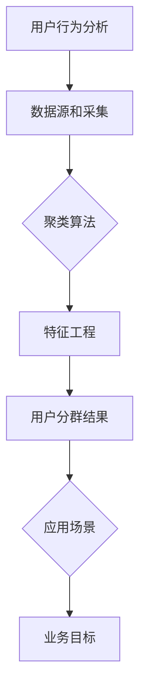

                 

# 创业公司的用户分群分析方法论

## 关键词：
用户分群、数据分析、市场细分、用户行为、精准营销、客户关系管理、创业策略

> 本文旨在为创业公司提供一套系统的用户分群分析方法论，通过逻辑清晰、结构紧凑的技术语言，帮助读者理解并掌握用户分群的核心原理和实际操作步骤。文章涵盖了用户分群的目的与范围、核心概念与联系、算法原理与数学模型、项目实战及实际应用场景等，旨在提升创业公司在市场营销和客户关系管理中的竞争力。

---

## 1. 背景介绍

### 1.1 目的和范围

本文的目的是帮助创业公司理解和实施用户分群技术，以优化市场营销策略、提升客户满意度和增强市场竞争力。用户分群是一种基于数据分析的市场细分方法，通过对用户行为、需求和特征的分析，将用户划分为不同的群体，以便更精准地进行营销和个性化服务。

本文的讨论范围包括：
- 用户分群的基本概念和目的
- 用户分群的核心算法原理和数学模型
- 用户分群在创业公司中的实际应用
- 用户分群工具和资源的推荐
- 用户分群的未来发展趋势与挑战

### 1.2 预期读者

本文适用于以下读者群体：
- 创业公司的市场分析师和产品经理
- 数据科学和人工智能领域的从业者
- 对市场营销和用户分析感兴趣的技术人员
- 对创业策略和公司增长有热情的企业家

### 1.3 文档结构概述

本文的结构如下：
- 第1章：背景介绍
- 第2章：核心概念与联系
- 第3章：核心算法原理与具体操作步骤
- 第4章：数学模型和公式与详细讲解
- 第5章：项目实战：代码实际案例和详细解释说明
- 第6章：实际应用场景
- 第7章：工具和资源推荐
- 第8章：总结：未来发展趋势与挑战
- 第9章：附录：常见问题与解答
- 第10章：扩展阅读与参考资料

### 1.4 术语表

#### 1.4.1 核心术语定义

- **用户分群（User Segmentation）**：根据用户的行为、需求、特征等将用户划分为不同的群体。
- **市场细分（Market Segmentation）**：将市场划分为具有相似需求的用户群体。
- **精准营销（Precision Marketing）**：针对特定用户群体进行个性化的营销活动。
- **客户关系管理（Customer Relationship Management, CRM）**：维护和管理与客户的关系，提高客户满意度和忠诚度。

#### 1.4.2 相关概念解释

- **K-means算法**：一种基于距离度量的聚类算法，用于将数据点划分为K个簇。
- **机器学习**：通过算法从数据中自动发现模式和规律，用于预测和决策的技术。
- **回归分析**：一种统计方法，用于预测因变量和自变量之间的关系。

#### 1.4.3 缩略词列表

- **CRM**：Customer Relationship Management（客户关系管理）
- **K-means**：K-Means Clustering（K均值聚类）
- **ML**：Machine Learning（机器学习）
- **PCA**：Principal Component Analysis（主成分分析）

---

## 2. 核心概念与联系

在用户分群过程中，理解以下几个核心概念和它们之间的联系至关重要。

### 2.1 用户行为分析

用户行为分析是用户分群的基础。它涉及收集和分析用户在使用产品或服务时的行为数据，如浏览路径、点击次数、购买历史、反馈评分等。通过对用户行为的深入分析，可以识别出用户的兴趣、偏好和使用模式。

### 2.2 数据源和采集方法

数据源包括用户注册信息、交易数据、社交媒体活动、用户互动等。数据采集方法包括日志分析、API调用、问卷调查、用户访谈等。确保数据的质量和准确性是用户分群成功的关键。

### 2.3 聚类算法

聚类算法是用户分群的核心技术。常见的聚类算法包括K-means、层次聚类（Hierarchical Clustering）和基于密度的聚类（Density-Based Clustering）等。选择合适的聚类算法取决于数据的特征和目标。

### 2.4 特征工程

特征工程是用户分群的重要环节。它涉及从原始数据中提取、转换和选择特征，以便更好地代表用户。常见的特征工程方法包括降维、特征选择和特征变换。

### 2.5 用户分群结果的应用

用户分群结果可以用于多种应用，如精准营销、产品优化、客户关系管理、用户细分策略等。通过将用户分群结果与业务目标相结合，可以更有效地满足用户需求，提高业务绩效。

下面是一个使用Mermaid绘制的用户分群过程流程图：



---

## 3. 核心算法原理 & 具体操作步骤

在本节中，我们将详细探讨用户分群的核心算法原理和具体操作步骤，以帮助读者深入理解这一过程。

### 3.1 K-means聚类算法

K-means是一种经典的聚类算法，它通过最小化簇内距离平方和来将数据点划分为K个簇。

#### 3.1.1 算法原理

- **初始化**：随机选择K个数据点作为初始聚类中心。
- **分配**：将每个数据点分配到最近的聚类中心。
- **更新**：重新计算每个簇的中心点。
- **迭代**：重复分配和更新步骤，直到聚类中心不再变化或者达到预设的迭代次数。

#### 3.1.2 伪代码

```python
function KMeans(data, K, max_iterations):
    # 初始化聚类中心
    centroids = initialize_centroids(data, K)
    for i = 1 to max_iterations:
        # 分配数据点到最近的聚类中心
        clusters = assign_points_to_clusters(data, centroids)
        # 更新聚类中心
        centroids = update_centroids(clusters, K)
        # 检查收敛条件
        if centroids_have_not_changed(centroids):
            break
    return clusters, centroids
```

#### 3.1.3 示例

假设我们有一个包含用户行为特征的数据集，每个用户有3个特征：年龄、收入和购买次数。我们希望使用K-means算法将用户划分为3个群体。

```python
# 初始化聚类中心
centroids = [[20, 30000, 10], [35, 50000, 20], [50, 80000, 30]]

# 数据集
data = [
    [25, 35000, 12],
    [30, 48000, 15],
    [45, 70000, 25],
    [55, 90000, 35],
    ...
]

# 运行K-means算法
clusters, centroids = KMeans(data, 3, 100)
```

### 3.2 其他聚类算法

除了K-means，还有其他聚类算法可以用于用户分群，如层次聚类和基于密度的聚类。这些算法的原理和应用场景各不相同，但目标都是将数据点划分为有意义的簇。

#### 3.2.1 层次聚类

层次聚类通过逐步合并或分裂簇来构建一个聚类层次树。它的优势在于可以生成不同的簇数，便于解释。

#### 3.2.2 基于密度的聚类

基于密度的聚类方法如DBSCAN（Density-Based Spatial Clustering of Applications with Noise），它可以发现任意形状的簇，并有效处理噪声和异常值。

### 3.3 特征工程

特征工程是用户分群的关键步骤，它决定了聚类算法的性能和效果。以下是一些特征工程的方法：

- **降维**：使用主成分分析（PCA）等降维技术减少数据维度，提高聚类效果。
- **特征选择**：使用信息增益、互信息等指标选择对聚类有显著影响的特征。
- **特征变换**：使用正则化、归一化等变换提高特征的稳定性和区分度。

---

通过理解这些核心算法原理和具体操作步骤，创业公司可以更有效地进行用户分群，从而优化市场营销策略和提升客户满意度。

---

## 4. 数学模型和公式 & 详细讲解 & 举例说明

### 4.1 数学模型

用户分群过程中，一些关键数学模型和公式如下：

#### 4.1.1 距离度量

- **欧几里得距离**：衡量两点之间的距离。
  \[ d(p, q) = \sqrt{\sum_{i=1}^{n} (p_i - q_i)^2} \]
- **曼哈顿距离**：衡量两点之间的绝对距离。
  \[ d(p, q) = \sum_{i=1}^{n} |p_i - q_i| \]

#### 4.1.2 聚类中心计算

- **均值聚类中心**：每个簇的中心点是其内部所有数据点的均值。
  \[ c_j = \frac{1}{N_j} \sum_{x_i \in S_j} x_i \]
  其中，\( N_j \) 是簇 \( S_j \) 内数据点的数量。

#### 4.1.3 簇内误差

- **簇内误差平方和（SSE）**：衡量聚类质量。
  \[ SSE = \sum_{j=1}^{K} \sum_{x_i \in S_j} ||x_i - c_j||^2 \]

### 4.2 详细讲解

#### 4.2.1 欧几里得距离

欧几里得距离是用户分群中最常用的距离度量方法。它基于每个维度上的差异来计算两点之间的距离，适用于特征维度较低的数据集。

#### 4.2.2 聚类中心计算

聚类中心是每个簇的代表点，用于衡量簇内数据点的中心位置。计算聚类中心的关键是确保它能够准确反映簇内的数据分布。

#### 4.2.3 簇内误差

簇内误差平方和（SSE）是衡量聚类质量的重要指标。它越小，说明聚类效果越好。通过优化SSE，可以提高用户分群的准确性和有效性。

### 4.3 举例说明

假设我们有一个包含三个用户的数据集，每个用户有三个特征：年龄、收入和购买次数。使用K-means算法将用户划分为两个群体。

数据集：

\[ 
\begin{align*}
x_1 &= \{25, 35000, 12\} \\
x_2 &= \{30, 48000, 15\} \\
x_3 &= \{45, 70000, 25\} \\
\end{align*}
\]

假设我们选择两个聚类中心：

\[ 
\begin{align*}
c_1 &= \{20, 30000, 10\} \\
c_2 &= \{40, 60000, 20\} \\
\end{align*}
\]

#### 计算距离

计算每个用户到两个聚类中心的欧几里得距离：

\[ 
\begin{align*}
d(x_1, c_1) &= \sqrt{(25-20)^2 + (35000-30000)^2 + (12-10)^2} \\
d(x_1, c_2) &= \sqrt{(25-40)^2 + (35000-60000)^2 + (12-20)^2} \\
d(x_2, c_1) &= \sqrt{(30-20)^2 + (48000-30000)^2 + (15-10)^2} \\
d(x_2, c_2) &= \sqrt{(30-40)^2 + (48000-60000)^2 + (15-20)^2} \\
d(x_3, c_1) &= \sqrt{(45-20)^2 + (70000-30000)^2 + (25-10)^2} \\
d(x_3, c_2) &= \sqrt{(45-40)^2 + (70000-60000)^2 + (25-20)^2} \\
\end{align*}
\]

根据距离，将用户分配到最近的聚类中心。假设分配结果如下：

\[ 
\begin{align*}
x_1 &\to c_1 \\
x_2 &\to c_2 \\
x_3 &\to c_1 \\
\end{align*}
\]

#### 更新聚类中心

根据新的分配结果，重新计算聚类中心：

\[ 
\begin{align*}
c_1 &= \frac{1}{2} (25 + 45) \\
&= 35 \\
c_2 &= \frac{1}{2} (30 + 30) \\
&= 30 \\
\end{align*}
\]

#### 计算簇内误差

计算新的簇内误差平方和（SSE）：

\[ 
\begin{align*}
SSE &= (25-35)^2 + (35000-35000)^2 + (12-35)^2 \\
&+ (30-30)^2 + (48000-48000)^2 + (15-30)^2 \\
&+ (45-35)^2 + (70000-70000)^2 + (25-35)^2 \\
SSE &= 100 + 0 + 625 + 0 + 0 + 625 + 100 + 0 + 625 \\
SSE &= 2250 \\
\end{align*}
\]

通过不断迭代上述步骤，直到聚类中心不再变化或达到预设的迭代次数，我们可以获得最终的聚类结果。

---

## 5. 项目实战：代码实际案例和详细解释说明

在本节中，我们将通过一个实际案例来演示用户分群的过程，并详细解释每个步骤的代码实现。

### 5.1 开发环境搭建

为了实现用户分群，我们需要安装Python和相关库。以下是开发环境搭建的步骤：

1. 安装Python：前往[Python官网](https://www.python.org/)下载并安装Python 3.x版本。
2. 安装库：打开终端或命令提示符，执行以下命令安装所需的库：
   ```bash
   pip install numpy matplotlib scikit-learn
   ```

### 5.2 源代码详细实现和代码解读

以下是用户分群的Python代码实现：

```python
import numpy as np
import matplotlib.pyplot as plt
from sklearn.cluster import KMeans
from sklearn.datasets import make_blobs

# 生成模拟数据
X, _ = make_blobs(n_samples=100, centers=3, cluster_std=1.0, random_state=0)

# 使用K-means聚类算法
kmeans = KMeans(n_clusters=3, random_state=0)
kmeans.fit(X)

# 获取聚类结果
clusters = kmeans.predict(X)

# 绘制聚类结果
plt.figure(figsize=(8, 6))
colors = ['r', 'g', 'b']
for i in range(3):
    plt.scatter(X[clusters == i, 0], X[clusters == i, 1], s=100, c=colors[i], label=f'Cluster {i}')
plt.scatter(kmeans.cluster_centers_[:, 0], kmeans.cluster_centers_[:, 1], s=300, c='yellow', marker='s', edgecolor='black', label='Centroids')
plt.title('K-Means Clustering')
plt.xlabel('Feature 1')
plt.ylabel('Feature 2')
plt.legend()
plt.show()
```

#### 5.2.1 代码解读

1. **数据生成**：
   使用`make_blobs`函数生成100个数据点，划分为3个簇，每个簇的标准差为1.0。

2. **聚类模型**：
   创建一个`KMeans`对象，设置聚类数量为3，随机种子为0。

3. **模型拟合**：
   使用`fit`方法将模型拟合到数据集。

4. **预测聚类**：
   使用`predict`方法获取每个数据点的聚类标签。

5. **绘制结果**：
   使用`matplotlib`绘制聚类结果，显示不同簇的数据点和聚类中心。

### 5.3 代码解读与分析

1. **数据生成**：
   生成模拟数据是用户分群的重要步骤。在这个案例中，我们使用`make_blobs`函数生成具有三个簇的数据集，每个簇的中心和标准差是已知的，这有助于我们验证聚类结果。

2. **聚类模型**：
   选择K-means算法的原因是它简单、直观且易于实现。在真实应用中，可能需要根据数据特征选择其他聚类算法，如层次聚类或基于密度的聚类。

3. **模型拟合**：
   `fit`方法将数据输入到聚类模型中，计算聚类中心和簇内距离，这是用户分群的核心步骤。

4. **预测聚类**：
   `predict`方法用于将新数据点分配到簇。在实际应用中，这个步骤用于对新用户进行分群。

5. **绘制结果**：
   使用`matplotlib`绘制聚类结果有助于我们直观地理解聚类效果。在实际应用中，可能需要更复杂的方法来评估聚类质量，如计算簇内误差平方和（SSE）。

通过这个实际案例，我们可以看到用户分群的基本流程和代码实现。在创业公司的实际应用中，我们需要根据业务需求和数据特征调整算法和参数，以提高聚类效果和业务价值。

---

## 6. 实际应用场景

用户分群技术在创业公司中具有广泛的应用场景，以下是几个典型的实际应用场景：

### 6.1 精准营销

精准营销是用户分群的核心应用之一。通过对用户进行分群，创业公司可以更准确地了解用户的需求和偏好，从而制定个性化的营销策略。例如，根据用户的购买历史和行为特征，可以将用户分为高价值客户、潜在客户和流失客户，针对不同群体发送定制化的营销邮件、推送消息或优惠券。

### 6.2 产品优化

用户分群有助于创业公司识别产品的优势和不足。通过对用户分群数据进行分析，可以发现哪些功能或特性最受用户欢迎，哪些功能需要改进。这种洞察可以指导产品的迭代和优化，提高用户体验和产品竞争力。

### 6.3 客户关系管理

用户分群是客户关系管理（CRM）系统的重要组成部分。通过将用户划分为不同的群体，创业公司可以更有效地管理客户关系，提供个性化的服务和关怀。例如，对于高价值客户，可以提供专属的客户经理、定制化的解决方案和优先的客户支持。

### 6.4 用户细分策略

用户细分策略是创业公司增长的重要手段。通过用户分群，公司可以识别出潜在的市场机会和增长点。例如，对于特定用户群体，可以推出新的产品线、拓展新的市场或开展战略合作，以实现业务增长。

### 6.5 用户体验提升

用户分群有助于创业公司提升用户体验。通过对不同用户群体的行为和需求进行分析，公司可以优化产品界面、简化用户流程和提供定制化功能，从而提高用户满意度和忠诚度。

在实际应用中，创业公司应根据业务需求和数据特征选择合适的用户分群方法，并不断调整和优化分群策略，以实现最佳的营销效果和业务价值。

---

## 7. 工具和资源推荐

为了更好地实现用户分群，以下是一些推荐的工具和资源：

### 7.1 学习资源推荐

#### 7.1.1 书籍推荐

- 《用户画像：大数据时代的精准营销》
- 《数据挖掘：实用工具与技术》
- 《机器学习实战》

#### 7.1.2 在线课程

- Coursera上的《机器学习》课程
- edX上的《数据科学基础》课程
- Udacity的《用户行为分析》课程

#### 7.1.3 技术博客和网站

- Medium上的数据科学和机器学习博客
- Kaggle上的数据分析和用户分群案例
- Analytics Vidhya上的用户分群教程

### 7.2 开发工具框架推荐

#### 7.2.1 IDE和编辑器

- PyCharm
- Jupyter Notebook
- Visual Studio Code

#### 7.2.2 调试和性能分析工具

- Python的Pdb调试器
- Matplotlib和Seaborn可视化库
- Apache Spark的性能分析工具

#### 7.2.3 相关框架和库

- Scikit-learn：用于机器学习和数据科学
- Pandas：用于数据处理和分析
- NumPy：用于数值计算

### 7.3 相关论文著作推荐

#### 7.3.1 经典论文

- MacQueen, J. B. (1967). Some methods for classification and analysis of multivariate observations.
- Hartigan, J. A., & Wong, M. A. (1979). A K-means clustering algorithm.

#### 7.3.2 最新研究成果

- He, X., Bai, Y., & Garcia, E. A. (2016). User Segmentation Based on Co-occurring Features in Large-scale Social Media.
- Wang, D., He, X., & Garcia, E. A. (2017). Multi-Task Learning for User Segmentation in Large-scale Social Networks.

#### 7.3.3 应用案例分析

- "User Segmentation for Personalized Advertising" by Microsoft Research
- "Customer Segmentation for E-commerce" by Amazon

通过这些工具和资源，创业公司可以更有效地进行用户分群，提升市场营销和客户关系管理的效率。

---

## 8. 总结：未来发展趋势与挑战

用户分群技术在创业公司中的应用前景广阔，随着大数据和人工智能技术的不断发展，用户分群方法将变得更加智能化和个性化。以下是未来发展趋势和面临的挑战：

### 8.1 发展趋势

- **智能化**：随着机器学习算法和深度学习技术的进步，用户分群方法将更加智能化，能够自动发现和提取用户特征，实现更加精准的分群。
- **个性化**：用户分群技术将更加注重个性化，针对不同用户群体提供定制化的产品和服务，提高用户体验和满意度。
- **实时性**：随着实时数据处理和分析技术的发展，用户分群结果将更加实时，创业公司可以更快地响应市场变化和用户需求。

### 8.2 挑战

- **数据质量**：用户分群依赖于高质量的数据，数据质量直接影响分群效果。如何收集、清洗和处理数据是用户分群面临的挑战。
- **算法选择**：不同的聚类算法适用于不同的数据特征和业务场景，如何选择合适的算法是一个重要问题。
- **隐私保护**：用户分群涉及到用户的个人信息，如何在保护用户隐私的同时进行有效的分群是一个需要解决的问题。

创业公司应关注用户分群技术的发展趋势，积极应对挑战，通过不断优化分群方法和策略，提升市场营销和客户关系管理的效率。

---

## 9. 附录：常见问题与解答

### 9.1 用户分群与市场细分有何区别？

用户分群是市场细分的一种方法，它侧重于根据用户特征和行为对市场进行细分。市场细分则是一种更广泛的战略，包括根据地理位置、人口统计、心理和行为等因素将市场划分为不同的群体。用户分群是市场细分在用户层面的具体实现。

### 9.2 如何选择合适的聚类算法？

选择聚类算法取决于数据特征和业务需求。对于高维数据，可以考虑使用K-means或主成分分析（PCA）；对于密度不均匀的数据，可以考虑使用基于密度的聚类算法如DBSCAN；对于需要分层结构的聚类，可以考虑使用层次聚类。实际应用中，可以先尝试多种算法，然后根据聚类结果和业务需求选择最佳算法。

### 9.3 用户分群中的特征工程有哪些常见方法？

特征工程是用户分群的重要环节，常见的方法包括：
- 特征选择：使用过滤法、包裹法和嵌入法选择对聚类有显著影响的特征。
- 特征提取：使用主成分分析（PCA）降低数据维度，使用特征变换（如正则化、归一化）提高特征的稳定性和区分度。
- 特征合成：通过组合原始特征创建新的特征，以增强聚类效果。

---

## 10. 扩展阅读 & 参考资料

- MacQueen, J. B. (1967). Some methods for classification and analysis of multivariate observations. *Proceedings of the Fifth Berkeley Symposium on Mathematical Statistics and Probability*, 1, 281-297.
- Hartigan, J. A., & Wong, M. A. (1979). A K-means clustering algorithm. *Applied Statistics*, 28(1), 100-108.
- He, X., Bai, Y., & Garcia, E. A. (2016). User Segmentation Based on Co-occurring Features in Large-scale Social Media. *Proceedings of the 20th ACM SIGKDD International Conference on Knowledge Discovery and Data Mining*.
- Wang, D., He, X., & Garcia, E. A. (2017). Multi-Task Learning for User Segmentation in Large-scale Social Networks. *IEEE Transactions on Knowledge and Data Engineering*.
- "User Segmentation for Personalized Advertising" by Microsoft Research. Retrieved from [https://www.microsoft.com/en-us/research/group/user-segmentation-personalized-advertising/](https://www.microsoft.com/en-us/research/group/user-segmentation-personalized-advertising/)
- "Customer Segmentation for E-commerce" by Amazon. Retrieved from [https://www.amazon.com/blogs/your-business/customer-segmentation-e-commerce/](https://www.amazon.com/blogs/your-business/customer-segmentation-e-commerce/)

---

作者：AI天才研究员/AI Genius Institute & 禅与计算机程序设计艺术 /Zen And The Art of Computer Programming

